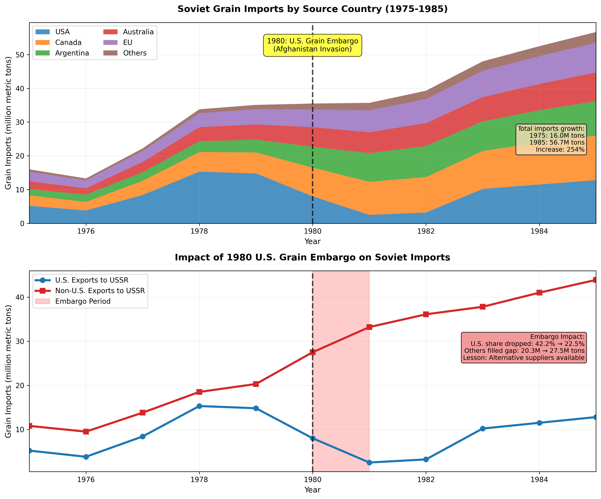

# Historical and Comparative Cases

## Executive Summary

On December 29, 1979, Soviet forces invaded Afghanistan, triggering international condemnation and a U.S. strategic response combining military aid to Afghan resistance with economic pressure on Moscow. President Jimmy Carter's signature economic measure—an embargo on grain sales to the Soviet Union—aimed to impose costs on Soviet leadership while demonstrating American resolve. The embargo prohibited sales beyond the 8 million metric tons already contracted, cutting off an additional 17 million tons the Soviets had planned to purchase (Paarlberg 1980). American farmers, particularly in the Midwest, faced immediate economic pain as grain prices collapsed. Yet Soviet grain imports barely declined: Moscow simply purchased from Argentina, Canada, Australia, and other suppliers willing to fill the gap at slightly higher prices. The embargo's failure illustrated a fundamental challenge of economic coercion: unilateral trade restrictions imposed by one supplier are easily circumvented when alternative sources exist and other countries prioritize commercial interests over geopolitical solidarity. The Soviets got their grain; American farmers got stuck with unsold harvests. This was not a lesson learned once and remembered—it would be repeated, with variations, for decades.

Why does history matter? Because every generation of policymakers rediscovers that economic coercion is harder than it looks. Targets adapt. Third parties defect. Domestic political costs mount. Strategic objectives remain stubbornly unachieved. Yet history also reveals when economic pressure works: South African apartheid collapsed partly under sustained international sanctions; CoCom technology restrictions degraded Soviet military capabilities for four decades; financial sanctions froze Libya, Iran, and North Korea out of global banking, imposing severe costs. What separates success from expensive failure? The historical record holds answers—for those willing to learn them.

The historical record reveals patterns that contemporary policymakers ignore at their peril.

**First, multilateral coordination dramatically improves economic coercion effectiveness, but achieving and sustaining coordination is politically difficult.** Unilateral sanctions face circumvention: if the United States embargoes grain to Russia, Argentina sells more; if America restricts technology to China, European firms capture market share. Multilateral sanctions, by contrast, can isolate targets comprehensively: UN Security Council sanctions on apartheid South Africa, international financial sanctions on Iran, and CoCom technology restrictions on the Soviet bloc all achieved broad participation that limited targets' alternatives. However, multilateral coordination requires aligned interests (often absent), sustained diplomatic effort, and mechanisms to prevent defection. The CoCom regime succeeded for four decades because Cold War threatened all Western democracies, providing shared security imperative. Contemporary sanctions on Russia (post-2022) initially achieved unprecedented Western unity but face erosion as economic costs mount and third countries (India, China, Turkey) expand trade with Moscow. Sanctions on China would face even greater coordination challenges given China's economic centrality and divergent interests among potential sanctioning countries.

**Second, economic coercion succeeds primarily when it reinforces broader political, military, and normative pressure rather than operating in isolation.** Apartheid sanctions contributed to South African regime change, but domestic resistance (ANC, UDF, labor unions), international isolation, and security deterioration (township uprisings, regional wars) created combined pressure that sanctions alone could not generate. Conversely, Cuba endured six decades of U.S. embargo because Havana received Soviet support (until 1991), adapted economically through import substitution and tourism, and maintained domestic political control. Economic pressure multiplies effect when combined with internal dissent, military pressure, diplomatic isolation, and normative delegitimization. Standalone economic measures rarely compel fundamental policy changes by capable, determined adversaries.

**Third, historical cases reveal persistent trade-offs between economic integration and coercive leverage: deeper integration creates mutual dependence that both enables coercion (leverage over integrated target) and constrains it (costs to coercer).** Europe's deep energy integration with Russia (40% of gas imports) created mutual dependence: Europe gained reliable, affordable energy; Russia gained revenue and political influence. When Russia invaded Ukraine (2022), Europe possessed theoretical leverage (denying revenue) but faced severe constraints (energy shortages, economic contraction, political instability). Russia faced reciprocal constraints (lost revenue, technological cutoff) but possessed strategic reserves and alternative markets (China, India). The paradox of weaponized interdependence is that the most coercive relationships—where targets depend heavily on coercer—are often precisely those where coercers face high costs from disruption. Managing this trade-off requires either maintaining diversified relationships (limiting dependence and leverage) or accepting that deep integration reduces policy flexibility.

The analysis examines U.S.-Soviet economic competition (CoCom, grain embargo, pipeline sanctions), anti-apartheid sanctions on South Africa, and earlier historical cases from Napoleon's Continental System to British trade restrictions on Revolutionary America. Case studies cover the 2010 Japan-China rare earth dispute and weaponized migration, while a Chinese Perspective Box contextualizes Beijing's strategic objectives within China's historical experiences with foreign economic pressure.

Historical cases teach that economic coercion is neither impotent nor omnipotent. Naive optimism—expecting sanctions to rapidly compel adversary compliance—leads to disappointment and policy abandonment. Naive pessimism—assuming sanctions never work—ignores cases where sustained, multilateral pressure achieved strategic objectives. The truth is messier and more interesting than either extreme. Realistic assessment recognizes that economic coercion succeeds under specific conditions: when multilateral coordination limits circumvention, when economic measures reinforce broader pressure, when targets face genuine vulnerabilities, and when coercers accept sustained costs. These conditions are demanding, explaining both why economic coercion often disappoints initial expectations and why, in specific historical cases, it proved decisive.

---

## U.S.-Soviet Economic Competition

For four decades (1949-1991), the United States and Soviet Union competed economically as well as militarily and ideologically. Unlike contemporary U.S.-China competition where deep economic integration creates mutual dependence, the U.S.-Soviet relationship featured limited trade and minimal financial ties. This facilitated Western economic restrictions—less trade to restrict meant lower costs—but also reduced leverage. You cannot threaten to cut off someone who was never connected in the first place. The autarkic Soviet economy was less vulnerable to external pressure than market-integrated economies. U.S. economic strategy employed multiple instruments: multilateral technology denial through CoCom, selective trade restrictions (grain embargo), pipeline sanctions targeting Soviet hard currency earnings, and financial isolation. Effectiveness varied dramatically across these instruments.

### CoCom: Multilateral Technology Denial (1949-1994)

**Origins and Structure**

The Coordinating Committee for Multilateral Export Controls (CoCom), established November 1949, coordinated Western restrictions on technology exports to Communist countries (Mastanduno 1992). Members included NATO allies (minus Iceland), Japan, and Australia—17 countries controlling most advanced Western technology. CoCom operated through:

- **Multilateral Export Control Lists**: Three lists identified restricted items: Munitions List (weapons), Atomic Energy List (nuclear technology), Industrial List (dual-use technologies including computers, telecommunications, machine tools, electronics)

- **Consensus-based approvals**: Export license applications for restricted items required unanimous CoCom member approval, creating effective veto power

- **Informal operation**: CoCom lacked treaty status or permanent secretariat, operating through regular meetings of national representatives in Paris. Informal structure reduced visibility and bureaucracy but also limited enforcement power

- **Differential restrictions**: Soviet bloc faced comprehensive restrictions; China experienced somewhat lighter controls (relaxed after Sino-Soviet split)

**Strategic Logic**

CoCom aimed to degrade Soviet military capabilities by denying access to Western advanced technology essential for modern weapons systems. Soviet military R&D depended heavily on acquiring (legally and illegally) Western technology:

Soviet military R&D sought Western computing capabilities, including supercomputers essential for nuclear weapons design, ballistic missile calculations, and cryptography. It also depended on advanced electronics such as integrated circuits, sensors, and guidance systems, as well as telecommunications technology for secure communications, electronic warfare, and signals intelligence. In the manufacturing domain, precision machine tools were critical for producing aircraft, submarines, and missiles, while advanced materials---including composites, special alloys, and ceramics---rounded out the key technology areas that CoCom sought to restrict.

Soviet indigenous technology development lagged Western capabilities by estimated 5-10 years (longer in some fields like semiconductors and software). CoCom restrictions forced Soviet military to rely on domestic inferior technology or acquire through espionage (time-consuming, incomplete, risk of detection).

**Effectiveness**

CoCom achieved substantial success in limiting Soviet access to strategic technology. The gap between Western and Soviet military technology persisted in significant part due to CoCom restrictions. Soviet military aircraft, submarines, and precision weapons exhibited persistent technological inferiority that could be traced to limitations in microelectronics, manufacturing, and materials---all areas subject to stringent export controls. By denying direct access to these technologies, CoCom also imposed a heavy espionage burden on Soviet intelligence. The KGB's Directorate T (Scientific and Technical Intelligence) dedicated enormous resources to Western technology theft, but espionage proved costly, uncertain, and capable of addressing only specific gaps rather than building overall industrial capability. Furthermore, by forcing the Soviet Union to develop inferior domestic substitutes through import substitution, CoCom imposed significant economic costs. The Soviet semiconductor industry, for example, consumed vast investment yet consistently produced chips that lagged years behind Western commercial products.

Despite these achievements, CoCom faced persistent limitations and challenges. The Soviets developed multiple circumvention strategies, acquiring restricted technology through third countries, front companies, and illegal diversions; Western intelligence repeatedly uncovered such procurement networks. Intra-alliance disputes also hampered the regime's effectiveness, as European allies often favored looser restrictions to preserve their commercial interests while the United States pushed for stricter controls, creating recurring diplomatic tensions. Enforcement gaps compounded these difficulties, since some members---particularly neutral countries with CoCom observer status---enforced restrictions less rigorously than others. Finally, rapid technological change posed an inherent challenge, making it difficult to define what constituted "restricted" technology, to update control lists to reflect new capabilities, and to prevent the commercial diffusion of dual-use technologies.

Despite limitations, scholarly consensus holds CoCom meaningfully degraded Soviet military capabilities (Mastanduno 1992; National Academy of Sciences 1987). The Soviet collapse (1991) ended the Cold War rationale; CoCom dissolved (1994), replaced by less restrictive Wassenaar Arrangement.

### Grain Embargo (1980): Unilateral Failure

<figure class="book-figure">
  
  <figcaption>Figure 9.1: Soviet grain imports by source country from 1975-1985, showing how alternative suppliers filled the gap left by the U.S. embargo.</figcaption>
</figure>

**Background and Implementation**

The Soviet invasion of Afghanistan (December 1979) prompted President Carter to impose comprehensive economic sanctions, including:

- **Grain embargo** (January 1980): Suspended grain sales beyond 8 million metric tons already contracted (traditional minimum quantity to maintain trade relationship), cutting approximately 17 million tons
- **Technology restrictions**: Tightened high-tech exports beyond CoCom
- **Olympic boycott**: U.S. boycotted Moscow Summer Olympics (1980)
- **Fishing rights suspension**: Revoked Soviet fishing permits in U.S. waters

The grain embargo received most attention due to visible domestic impact on American farmers and strategic logic: Soviet Union was world's largest grain importer (importing 35-40 million tons annually), and U.S. was dominant supplier (providing 40-50% of Soviet imports in late 1970s) (Paarlberg 1980; USDA 1981).

**Strategic Logic**

Embargo aimed to:
1. **Impose economic costs**: Force Soviet livestock culling or bread rationing, demonstrating Western economic power
2. **Signal resolve**: Show U.S. seriousness about Afghan invasion consequences
3. **Leverage political change**: Pressure Soviet leadership to withdraw from Afghanistan

**Results**

The grain embargo largely failed:

**Soviet grain imports barely declined**: Despite the embargo, Soviet grain imports in the 1979/80 marketing year reached approximately 31 million metric tons—only 5-6 million tons short of their pre-embargo target of 36-37 million tons (Paarlberg 1980; USDA 1981). Argentina, Canada, Australia, and Brazil increased sales to USSR.

**Circumvention**: Soviets purchased through intermediaries, rerouted shipments, and negotiated long-term contracts with alternative suppliers.

**U.S. domestic costs**: American grain prices fell 10-20%, costing farmers and agribusiness billions. Political opposition mounted rapidly, particularly in farm states.

**Minimal political impact**: Soviet leadership showed no signs of moderating Afghanistan policy due to embargo. Invasion continued until 1989 withdrawal driven by military losses, economic crisis, and Gorbachev reforms—not grain pressure.

**Allied non-participation**: European allies, Japan, and major grain exporters (Argentina, Canada, Australia) did not join embargo, prioritizing commercial interests. Unilateral U.S. action proved futile.

**Termination**: President Reagan lifted embargo in April 1981, stating it had harmed U.S. farmers more than Soviet Union.


**The Substitution Failure**
The Soviet grain embargo stands as a textbook example of why unilateral commodity restrictions fail. Grain is fungible—one seller's wheat is interchangeable with another's. When the U.S. embargoed sales, Argentina, Canada, and Australia simply filled the gap, often at slightly higher prices the Soviets happily paid. The result: American farmers lost their customers while Soviet grain imports barely declined. The lesson is brutal and simple: restricting commodity exports works only if ALL major suppliers participate.


**Lessons**

The grain embargo illustrated critical limitations of unilateral trade sanctions:

1. **Substitution**: Commodities with multiple suppliers are easily replaceable; restricting one source shifts purchases to others
2. **Allied defection**: Without coordination, third parties capture market share while target maintains supply
3. **Domestic costs**: Export restrictions hurt domestic producers, creating political pressure for reversal
4. **Limited leverage**: Even dominant market position (U.S. controlled 50% of global grain exports) provides insufficient leverage if alternatives exist

### Siberian Pipeline Sanctions (1981-1982): Extraterritorial Overreach

**Background**

The Siberian Pipeline project (Urengoy-Uzhgorod-Western Europe) would transport Soviet natural gas to Western Europe, generating hard currency revenue for Moscow while increasing European energy dependence on USSR (Jentleson 1986). The Reagan administration opposed the pipeline on strategic grounds:

- **Hard currency**: Gas sales would earn Soviet Union billions annually, financing military and subsidizing inefficient economy
- **Energy dependence**: European reliance on Soviet gas created vulnerability to supply cutoffs, providing Moscow political leverage
- **Technology transfer**: Pipeline construction required Western technology (compressors, large-diameter pipes, pumps), enhancing Soviet capabilities

**Sanctions Implementation**

December 1981: Reagan prohibited U.S. firms from exporting oil and gas equipment to Soviet Union

June 1982: Expanded to extraterritorial scope, prohibiting:
- U.S. subsidiaries abroad from supplying equipment
- Foreign companies from using U.S.-origin technology under license to produce equipment for pipeline

This extraterritorial reach targeted European firms (France's Creusot-Loire, Germany's AEG, UK's John Brown) using American technology licenses to manufacture compressors and turbines for the pipeline.

**Allied Resistance and Failure**

European allies rejected U.S. extraterritorial sanctions:

**Sovereignty objections**: European governments viewed U.S. attempt to control their companies' behavior as illegal overreach violating international law and sovereign authority

**Economic interests**: European companies held contracts worth billions; governments sought gas supplies and export revenue

**Strategic disagreement**: Europeans believed engagement and trade moderated Soviet behavior; economic isolation might increase confrontation

**Defiance**: British, French, German, and Italian governments ordered their companies to fulfill pipeline contracts despite U.S. sanctions, invoking "blocking statutes" prohibiting compliance with extraterritorial U.S. laws. In effect, European governments told Washington: you can't make our companies follow your laws when they're on our soil. It was a sovereignty showdown, and the U.S. blinked


**The Birth of Blocking Statutes**
The Siberian Pipeline dispute gave birth to a legal tool still used today: blocking statutes. European countries enacted laws prohibiting their companies from complying with extraterritorial U.S. sanctions, putting firms in an impossible position between conflicting legal requirements. The EU's updated Blocking Statute (1996, reinforced 2018) serves the same purpose against Iran secondary sanctions. These statutes rarely work in practice—companies usually choose U.S. market access over legal protection from their home governments—but they establish a sovereignty principle that complicates U.S. extraterritorial enforcement.


**U.S. Retreat**

By November 1982, facing allied unity in opposition and recognizing sanctions' futility, Reagan lifted extraterritorial sanctions. The pipeline completed on schedule (1983), supplying Western Europe with Soviet gas through the 1980s and beyond (with interruptions during 2006, 2009 disputes with Ukraine and 2022 Ukraine war).

**Lessons**

The pipeline sanctions demonstrated:

1. **Extraterritorial limits**: Attempting to impose U.S. law on allied companies generated backlash and failed when allies prioritized sovereignty
2. **Allied coordination requirements**: Major sanctions require allied agreement; unilateral U.S. action proved ineffective and counterproductive
3. **Energy interdependence trade-offs**: European energy dependence on Russia (created partly by Siberian pipeline) would later enable Russian leverage (2022) but also constrained European responses
4. **Long-term ineffectiveness**: Pipeline operated for decades, generating revenue for Soviet Union and successor Russian Federation, demonstrating sanctions' failure to prevent strategic outcome

### Synthesis: U.S.-Soviet Economic Competition Lessons

**Successes**: CoCom technology restrictions, sustained over four decades with allied coordination, degraded Soviet military capabilities and imposed persistent costs on Soviet R&D and manufacturing.

**Failures**: Unilateral trade restrictions (grain embargo) and extraterritorial overreach (pipeline sanctions) failed due to allied non-participation, alternative suppliers, and political backlash.

**Key lessons**:
- **Multilateral coordination essential**: CoCom worked because allies shared Cold War threat perception and sustained cooperation; unilateral U.S. measures failed (Chapter 4 explores how contemporary export controls attempt to apply these CoCom lessons to the semiconductor competition with China)
- **Technology vs. commodities**: Restricting specialized technology (few suppliers, difficult to replicate) more effective than commodity restrictions (multiple suppliers, substitutable)
- **Long-term commitment**: CoCom required decades; short-term measures (grain embargo: 16 months) proved futile
- **Costs and sustainability**: Effective sanctions impose costs on sanctioners (lost trade, allied friction); sustaining requires political will and strategic priority

---

## Anti-Apartheid Sanctions on South Africa

International sanctions against South Africa's apartheid regime (1960s-1990s) represent one of history's most comprehensive sanctions campaigns and one of the few cases where economic coercion demonstrably contributed to fundamental regime change. Yet the case also illustrates complexity: sanctions operated alongside internal resistance, international isolation, security pressures, and normative evolution. Disentangling sanctions' specific causal impact from these parallel factors challenges simple narratives about sanctions' effectiveness.

### Apartheid System and International Response

**Apartheid Foundations**

South Africa's apartheid system (Afrikaans: "separateness") institutionalized racial segregation through laws designating population groups (White, Black, Coloured, Indian) with differential rights:

- **Political exclusion**: Black majority (75% of population) denied voting rights, political representation
- **Residential segregation**: Group Areas Act assigned racial groups to designated areas, forcibly removing millions
- **Labor exploitation**: Pass laws restricted Black movement, channeling labor to white-owned mines, farms, industries
- **Economic inequality**: Whites (approximately 20% of population) owned 87% of the land and dominated 90% of the formal economy, while the Black majority was confined to just 13% of the country's territory; Black per capita income was less than 10% of white levels
- **Repression**: Security forces crushed dissent through bannings, detentions, torture, killings

The National Party government (1948-1994) defended apartheid as necessary for preserving white minority civilization and preventing Black majority rule.

**International Condemnation**

From the 1960s, international opposition intensified:

- **UN resolutions**: General Assembly condemned apartheid; Security Council imposed arms embargo (1977, Resolution 418)
- **Moral repugnance**: Apartheid's explicit racism offended post-WWII human rights norms, decolonization momentum
- **Cold War complications**: U.S. and Western allies initially resisted comprehensive sanctions, viewing South Africa as anti-communist bulwark; Soviet Union and non-aligned movement championed sanctions

### Evolution of Sanctions (1960s-1980s)

**Early Measures (1960s-1970s)**

- **UN arms embargo** (1963 voluntary, 1977 mandatory): Prohibited weapons sales to South Africa. Effectiveness limited by South African arms industry development and covert purchases.
- **Sports isolation**: International Olympic Committee suspended South Africa (1970); rugby, cricket, soccer federations implemented bans. Sports-mad South African whites resented isolation.
- **Cultural boycotts**: Artists, academics, musicians declined South African engagements
- **Selective national sanctions**: Nordic countries, Communist bloc implemented trade and investment restrictions; U.S. and major European economies maintained relations

**Comprehensive Sanctions Push (1980s)**

Township uprisings (1984-1986), Sharpeville massacre anniversary protests, and increasing violence prompted renewed sanctions pressure:

**UN sanctions proposals**: Repeatedly vetoed by U.S. and UK (using Security Council veto) preventing mandatory comprehensive sanctions

**Unilateral national sanctions**:

- **United States - Comprehensive Anti-Apartheid Act (1986)**: Passed over President Reagan's veto by bipartisan Congressional majority. Provisions:
  - Banned new U.S. investment in South Africa
  - Prohibited imports of South African agricultural products, textiles, steel, iron
  - Restricted exports of computers and nuclear technology to South Africa
  - Required U.S. firms operating in South Africa to follow Sullivan Principles (fair employment practices)

- **European Community**: Implemented investment restrictions, steel and gold krugerrand import bans, though UK resisted comprehensive measures

- **Commonwealth**: Member states adopted varying sanctions; Canada, Australia, India particularly active

**Financial sanctions**: Banks (Citibank, Barclays) withdrew from South Africa, cutting off credit access and forcing debt renegotiations. Capital flight accelerated.

**Disinvestment campaign**: Universities, pension funds, municipalities divested South African holdings, pressuring corporations to withdraw. By 1989, 200+ U.S. companies had exited South Africa.

### Economic Impact on South Africa

Quantifying sanctions' economic effects is difficult due to:
- Simultaneous domestic unrest reducing investment independently
- Oil price shocks, global recessions affecting economy
- South African countermeasures (import substitution industrialization)

**Estimated impacts**:

**GDP growth**: South African growth slowed from 5% annually (1960s) to near-zero (1980s). Sanctions contributed but weren't sole cause (internal instability, commodity prices, structural problems also factors).

**Investment collapse**: Foreign direct investment fell from $10 billion inflows (early 1980s) to net outflows by late 1980s. Disinvestment and financial sanctions cut off capital access.

**Trade disruption**: Exports declined, particularly manufactured goods facing sanctions. South Africa circumvented through sanctions-busting (rerouting exports, relabeling origins) but at higher costs.

**Currency depreciation**: Rand collapsed from R1 = $1.30 (1980) to R2.50 (1989), reflecting capital flight and economic deterioration.


**The Rand Collapse: Financial Sanctions' Devastating Power**
South Africa's Rand lost nearly half its value in less than a decade—from R1 = $1.30 (1980) to R2.50 (1989). This currency collapse demonstrated the devastating power of financial sanctions when banks withdraw credit, investors flee, and capital markets close. Unlike trade sanctions that can be circumvented through smuggling and rerouting, financial isolation creates an inescapable trap: you cannot print foreign currency or conjure international credit from domestic resources. The 1985 debt moratorium proved that even resource-rich countries cannot survive without access to global finance.


**Debt crisis**: Unable to refinance external debt, South Africa faced 1985 debt moratorium, negotiating painful restructuring.

**Psychological impact**: International isolation, economic pressure, capital flight conveyed message to white elite that apartheid was unsustainable, costs outweighed benefits.

### Internal Resistance and Combined Pressure

Sanctions operated alongside powerful domestic and regional pressures:

**Internal resistance**:
- **ANC (African National Congress)**: Underground resistance, armed struggle (Umkhonto we Sizwe), international diplomacy
- **UDF (United Democratic Front)**: Domestic mass mobilization, township uprisings
- **Labor unions**: COSATU strikes disrupting economy
- **Youth**: School boycotts, stone-throwing protests, "ungovernability" campaigns

**Security deterioration**:
- **Regional wars**: Angolan, Mozambican conflicts draining resources, conscription unpopular among whites
- **Township violence**: State repression provoking resistance; police/military stretched thin
- **International pariah status**: Diplomatic isolation, Olympic ban, cultural boycott

**White elite reassessment**:
- **Business community**: Recognized apartheid economically unsustainable, opened dialogue with ANC
- **Afrikaner intellectuals**: Questioned apartheid morality and viability
- **National Party pragmatists**: F.W. de Klerk faction concluded negotiated transition preferable to violent collapse

### Sanctions' Causal Role

Did sanctions cause apartheid's end, or merely coincide with collapse driven by other factors?

**Arguments for sanctions' importance**:
1. **Economic pressure**: Sanctions accelerated economic crisis, convincing white elite that apartheid costs exceeded benefits
2. **Signal to regime**: International unity demonstrated apartheid would face sustained opposition
3. **Signal to resistance**: Sanctions encouraged ANC and domestic opposition, showing global support
4. **Psychological impact**: Isolation conveyed moral repugnance, undermining regime legitimacy

**Arguments against sanctions' centrality**:
1. **Internal resistance decisive**: Domestic upheaval, not external pressure, drove regime crisis
2. **Limited economic damage**: South Africa adapted through import substitution, sanctions-busting; economy struggled but didn't collapse
3. **Timing**: Major sanctions (1985-1986) came late; regime negotiations began seriously only after 1989 with de Klerk's rise, domestic dynamics, and Soviet collapse removing Cold War rationale
4. **Counterfactual**: Would apartheid have ended without sanctions due to internal contradictions, demographic pressures, security costs?

**Scholarly consensus** (Hufbauer et al. 2007; Crawford and Klotz 1999): Sanctions **contributed significantly but were not solely determinative**. Sanctions operated as part of combined pressure—economic, political, military, normative—that made apartheid untenable. Isolating sanctions' specific impact is methodologically fraught, but evidence suggests:
- Sanctions accelerated timeline by increasing costs
- Financial sanctions (bank withdrawals, investment bans) had more impact than trade restrictions
- Psychological/normative effects on white elite possibly as important as material economic costs
- Domestic resistance created conditions where sanctions could matter; absent internal upheaval, external sanctions alone likely insufficient

### Lessons from South Africa Case

1. **Comprehensive sanctions require sustained coordination**: Anti-apartheid sanctions took decades to develop, required overcoming Cold War divisions, and succeeded partly due to rare normative consensus (apartheid's explicit racism)

2. **Economic isolation plus political/military pressure**: Sanctions worked best when combined with internal resistance, security costs, diplomatic isolation

3. **Target regime characteristics matter**: Apartheid's dependence on foreign capital, technology, international legitimacy created vulnerabilities. Autarkic or authoritarian regimes (North Korea, Cuba) less vulnerable.

4. **Long time horizons**: Sanctions operated for 25+ years before contributing to regime change. Short-term expectations (1-3 years) would have led to premature "failure" judgments.

5. **Normative dimension**: Moral clarity about apartheid facilitated coalition-building and sustained political will. Issues with contested normative foundations (e.g., territorial disputes) struggle to generate similar consensus.


**The Combined Pressure Requirement**
South Africa's case teaches that economic sanctions rarely succeed alone. Apartheid collapsed under combined pressure from multiple sources: economic sanctions, internal resistance (ANC, labor unions, township uprisings), security deterioration (regional wars draining resources), diplomatic isolation, and normative delegitimization. Sanctions were necessary but not sufficient. The policy implication is profound: don't expect sanctions to do the work of an entire strategy. Economic pressure must combine with other instruments—military deterrence, diplomatic isolation, support for internal opposition—to achieve fundamental change.


---

## Historical Comparisons - Patterns Across Eras

Economic coercion long predates the 20th century. Examining earlier cases reveals enduring patterns: states have always weaponized trade and finance when feasible, effectiveness depends on target vulnerabilities and circumvention opportunities, and unintended consequences frequently undermine original objectives.

### Napoleon's Continental System (1806-1814)

**Background and Objectives**

Following military victories against Austria, Prussia, and Russia (1805-1807), Napoleon Bonaparte controlled most of continental Europe. Unable to invade Britain (Royal Navy dominated seas after Trafalgar 1805), Napoleon pursued economic warfare: the Berlin Decree (1806) and Milan Decree (1807) established the Continental System, prohibiting European trade with Britain (Heckscher 1922).

**Strategic logic**: Britain depended on European markets for manufactured goods exports and imported foodstuffs. By closing European ports, Napoleon aimed to cause British economic collapse (unemployment, bankruptcy, starvation), forcing political submission.

**Implementation and Circumvention**

Napoleon deployed military force to enforce the system:
- Occupied ports monitored for compliance
- Confiscated British goods found in Europe
- Imposed Continental System on allied and conquered states

Yet circumvention proved endemic:
- **Smuggling**: British goods entered through neutral countries (Sweden, Portugal until 1807, Russia after 1810), coastal smuggling, merchant connivance
- **Russian defection**: Tsar Alexander I withdrew from Continental System (1810), resuming trade with Britain—contributing to Napoleon's disastrous 1812 invasion
- **Economic pain to Europe**: Blocking British trade harmed European economies dependent on British manufactured goods (textiles, tools) and colonial products (sugar, coffee, cotton). French industry couldn't substitute for British production.

**Results**

The Continental System largely failed:

**British economy survived**: Though exports to Europe declined 25-30% (1807-1809), Britain compensated by expanding trade with Latin America, Ottoman Empire, and global colonies. Economic stress occurred (1810-1811 recession) but not collapse.

**European resistance**: Economic pain and nationalist resentment of French domination fueled resistance. Spain (1808), Russia (1812), and Germany (1813) revolted partly due to Continental System's costs.

**French defeat**: Napoleon's 1812 Russian invasion—motivated partly by enforcing Continental System—proved catastrophic. Coalition wars (1813-1814) defeated France; Napoleon abdicated 1814.

**Lessons**:
1. **Unilateral sanctions face global circumvention**: Britain's global trade network provided alternatives when Europe closed
2. **Enforcement costs**: Military occupation required to enforce Continental System overstretched French power
3. **Blowback**: Economic pain to European allies generated resentment, undermining Napoleon's coalition
4. **Target resilience**: Economically diverse, globally connected Britain proved more resilient than Napoleon anticipated

### British Trade Restrictions on American Colonies and Early Republic

**Pre-Revolution Navigation Acts**

British mercantilism (17th-18th centuries) restricted colonial trade to benefit mother country:
- Colonies required to export products (tobacco, cotton, timber) only to Britain
- Manufactured goods imported from Britain, not produced locally or imported from competitors
- Shipping reserved for British vessels

**Colonial resistance**: Resentment of trade restrictions contributed to American revolutionary sentiment. "No taxation without representation" extended to "no trade restrictions without representation."

**Post-Independence Trade Wars**

After American independence (1783), Britain excluded U.S. ships from West Indies trade, restricted U.S. exports to Britain, and sought to maintain colonial-style economic dominance.

American responses included:
- **Reciprocal restrictions**: Tariffs on British imports
- **Jefferson's Embargo Act (1807)**: Prohibited all U.S. exports, attempting to coerce Britain and France (both interfering with American shipping during Napoleonic Wars) through denial of U.S. goods. Embargo devastated U.S. economy (especially New England maritime trade), had minimal impact on Britain/France, and was repealed 1809 after fierce domestic opposition.

**War of 1812**: Partly fought over British trade restrictions and impressment of sailors, the war ended (1815) with return to pre-war trade patterns but established U.S. determination to resist economic coercion.

**Lessons**:
- Trade restrictions contributed to colonial independence movements
- Unilateral export embargoes (Jefferson's 1807 Embargo) harmed imposing country more than targets
- Economic disputes intertwined with sovereignty, maritime rights, and national identity

### Patterns Across Historical Cases

Examining cases from Napoleon to present reveals recurring patterns:

**1. Circumvention through substitution**: Targets find alternative suppliers/buyers unless sanctions are truly global. Napoleon couldn't seal Britain off from world trade; U.S. grain embargo didn't prevent Soviet imports from others.

**2. Enforcement challenges**: Geographic scope, smuggling, third-party defection undermine sanctions. Continental System required military occupation; modern sanctions face sanctions-busting through shell companies, flag switching, cryptocurrencies.

**3. Domestic costs generate political backlash**: Jefferson's embargo hurt U.S. more than targets; Carter's grain embargo cost American farmers; European opposition to pipeline sanctions reflected economic interests.

**4. Target resilience often underestimated**: Britain's global trade network, Soviet autarky, South Africa's import substitution all demonstrated adaptation capabilities that sanctioners underestimated.

**5. Time horizons matter**: Short-term sanctions (1-3 years) rarely achieve major strategic objectives; long-term campaigns (CoCom 40+ years, anti-apartheid 25+ years) sometimes succeed.

**6. Multilateral coordination difficult but essential**: Unilateral sanctions (Napoleon vs. Britain, U.S. vs. USSR grain) fail; multilateral campaigns (CoCom, anti-apartheid eventually) achieve more.

**7. Economic coercion most effective when reinforcing broader pressure**: South African sanctions combined with internal resistance; CoCom combined with military containment, ideological competition; standalone economic measures rarely decisive.

---

## Success and Failure Patterns - Cross-Case Analysis

Examining diverse historical cases reveals conditions distinguishing successful from failed economic coercion. No single factor guarantees success, but certain combinations of conditions improve effectiveness dramatically. This section synthesizes patterns across cases, developing framework for assessing contemporary sanctions prospects.

### When Sanctions Succeed: Necessary Conditions

**Condition 1: Comprehensive Multilateral Coordination**

Every successful sanctions case involved broad international participation:

**CoCom (SUCCESS)**: All major Western technology exporters participated for 40+ years, limiting Soviet alternatives. Though circumvention occurred, comprehensive participation raised costs substantially.

**Anti-apartheid (PARTIAL SUCCESS)**: Initial unilateral sanctions (1960s-1970s) achieved little; comprehensive sanctions (1980s) including U.S., Europe, Commonwealth, financial institutions contributed to regime crisis.

**Grain embargo (FAILURE)**: Unilateral U.S. action allowed Argentina, Canada, Australia to substitute. Grain is fungible commodity with multiple global suppliers; absent multilateral coordination, unilateral restrictions futile.

**Pipeline sanctions (FAILURE)**: European allies refused participation; U.S. extraterritorial sanctions generated backlash without achieving objectives.


**The Coordination Multiplier**
History reveals a stark pattern: coordinated sanctions are exponentially more effective than unilateral ones. CoCom worked because all major technology exporters participated for 40 years. Anti-apartheid sanctions gained teeth only when the U.S., Europe, and Commonwealth finally aligned in the 1980s. The grain embargo failed precisely because Argentina, Canada, and Australia defected for commercial gain. Think of multilateral coordination as a multiplier: unilateral sanctions might achieve 10% of their potential; add two major allies and you reach 40%; achieve genuine global participation and you approach full effectiveness. The diplomatic investment required to build coalitions pays compound returns.


Multilateral coordination is **difficult** (requires aligned interests, sustained diplomacy, enforcement mechanisms) but **necessary** for sanctions against major economies with global trade access.

**Condition 2: Target Vulnerability**

Sanctions effectiveness correlates with target economic characteristics:

**Vulnerable targets**:
- **Foreign capital dependent**: South Africa required Western investment, technology, bank credit. Financial sanctions cut off access, accelerating economic crisis.
- **Export-dependent**: Iraq (oil), Libya (oil), Iran (oil, banking) depended on export revenue; sanctions denying market access imposed severe costs.
- **Integrated into global systems**: Exclusion from SWIFT, correspondent banking, dollar clearing inflicts severe pain on countries needing financial access.

**Resilient targets**:
- **Autarkic economies**: Soviet Union's limited trade exposure, North Korea's near-total isolation meant fewer sanctions pressure points.
- **Alternative support**: Cuba survived U.S. embargo through Soviet subsidies (until 1991); Venezuela endures U.S. sanctions via Russian/Chinese support.
- **Resource self-sufficiency**: Large continental economies (Russia, China) can substitute domestic production for imports more easily than small, trade-dependent economies.

Sanctions against globalized, capital-dependent targets (modern emerging markets) likely more effective than against isolated, autarkic regimes.

**Condition 3: Combined Pressure (Economic + Political + Military + Normative)**

Economic sanctions rarely succeed in isolation:

**South Africa**: Sanctions combined with internal resistance (ANC, UDF, labor unions), regional security deterioration (township uprisings, Angolan war), diplomatic isolation, and normative delegitimization.

**Libya (2003)**: Sanctions contributed to Qaddafi's decision to abandon WMD programs, but U.S. military threats (post-9/11, Iraq invasion demonstrating U.S. willingness to use force) and offers of normalization provided inducements.

**Iran nuclear deal (JCPOA 2015)**: Sanctions alone insufficient; negotiated agreement offering sanctions relief in exchange for nuclear restrictions achieved temporary success (until U.S. withdrawal 2018).

**Contrast failures**:
- **Cuba**: Six decades of U.S. embargo failed to dislodge Castro regime because Havana maintained domestic political control, received external support, and faced no combined military/internal threat.
- **North Korea**: Sustained UN sanctions cause economic pain but regime maintains power through repression, Chinese support, nuclear deterrent.

Economic pressure must combine with other instruments—military threats, diplomatic isolation, internal dissent, credible inducements—to compel major strategic concessions.

**Condition 4: Realistic Objectives**

Sanctions succeed more often with limited objectives than maximalist goals:

**Limited objectives (higher success rate)**:
- Deterring specific actions (preventing further aggression)
- Securing targeted concessions (releasing prisoners, stopping human rights abuses)
- Degrading capabilities (CoCom limiting Soviet technology)
- Changing specific policies (Libya abandoning WMD programs)

**Maximalist objectives (lower success rate)**:
- Regime change (Cuba, North Korea, Iran)
- Fundamental ideology reversal (Soviet communism, Chinese authoritarianism)
- Territory restoration (Crimea, occupied territories)

Expecting economic sanctions to achieve regime change or fundamental policy reversals often produces disappointment. More realistic objective framing—degrading capabilities, raising costs, demonstrating resolve—better matches achievable outcomes.

### When Sanctions Fail: Common Pathologies

**Pathology 1: "Symbolic Sanctions" (Political Theater)**

Sanctions imposed primarily for domestic political consumption, with little expectation of changing target behavior:

**Characteristics**:
- Narrow scope (targeting individuals, small entities)
- Unilateral (no allied coordination)
- Weak enforcement
- Mixed signals (sanctions imposed but trade continues in other sectors)

**Examples**:
- Individual sanctions on Russian oligarchs while maintaining broader trade
- Tariffs on specific Chinese goods while overall trade grows
- Travel bans and asset freezes on human rights violators with minimal economic impact

Such measures signal disapproval but rarely change target behavior. Calling them "sanctions" while expecting no strategic effect sets up false expectations.

**Pathology 2: Unilateral Overreach**

Major power assumes unilateral sanctions will compel smaller targets, underestimating resilience:

**U.S. embargo on Cuba (1960-present)**: Longest-running sanctions regime in modern history, yet Castro regime survived six decades. Initial expectation of rapid collapse ignored:
- Soviet support (subsidies, trade, security assistance until 1991)
- Cuban regime repression maintaining political control
- Cuban adaptation (tourism, limited market reforms, Venezuela/China support post-1991)
- U.S. isolation (most countries opposed embargo, undermining effectiveness)

Six decades later, embargo persists but original objectives (regime change, policy reversal) remain unachieved. Sunk cost fallacy and domestic politics sustain measures long after strategic failure evident.

**Pathology 3: Sanctions Undermine Own Objectives**

Sometimes sanctions produce opposite of intended effect:

**"Rally around the flag"**: Sanctions provide target regimes with scapegoat for economic problems, generate nationalist backlash
- Iranian regime blames economic struggles on U.S. sanctions, deflecting from domestic mismanagement
- Russian government frames Western sanctions as evidence of anti-Russian hostility, boosting domestic support
- North Korean propaganda cites sanctions as justification for autarky and militarization

**Harming civil society while strengthening regime**:
- Sanctions often hit population harder than leadership (who access privileged supply networks, offshore assets)
- Economic pain can increase population dependence on government (rationing, subsidies)
- Opposition movements weakened by economic collapse reducing resources for resistance

**Humanitarian costs**: Comprehensive sanctions (Iraq 1990-2003) caused civilian suffering (malnutrition, medical supply shortages) while regime elites remained comfortable. Humanitarian concerns undermined sanctions political sustainability.

**Pathology 4: Sanctions as Substitute for Strategy**

Governments sometimes impose sanctions to appear active while avoiding difficult strategic decisions:

**False action bias**: Political pressure to "do something" leads to sanctions even when ineffective. Sanctions allow politicians to claim action without military commitments or diplomatic concessions.

**Strategic drift**: Sanctions become default policy, substituting for genuine strategy integrating economic, diplomatic, military instruments toward coherent objectives.

**Escalation lock-in**: Once imposed, sanctions difficult to lift without visible target concessions (even if sanctions aren't working), creating policy inertia.

### Comparative Success Rates and Measurement Challenges

**Quantitative studies** (Hufbauer et al. 2007; Biersteker et al. 2016; Pape 1997; Drezner 1999) estimate sanctions success rates at 20-40%, depending on success definition and case selection.

<figure class="book-figure">
  
  <figcaption>Figure 9.3: Sanctions success rates by objective and era, showing variation based on goal type and historical period.</figcaption>
</figure>

**Measurement challenges**:

**Selection bias**: Sanctions cases include wide range of severity (comprehensive trade embargoes vs. individual asset freezes) and objectives (regime change vs. policy tweaks). Aggregating creates misleading averages.

**Attribution problems**: When sanctions coincide with other pressures (internal resistance, military action, diplomatic isolation), isolating sanctions' specific causal impact is methodologically difficult.

**Time horizons**: How long before declaring failure? CoCom required 40 years; anti-apartheid 25+ years; impatience after 2-3 years may incorrectly judge "failure" of measures requiring decades.

**Partial success**: Many cases exhibit partial effectiveness—raising costs, constraining options, degrading capabilities—without achieving stated objectives. Categorizing as simple "success" or "failure" misses nuance.

**Success definition ambiguity**: Different analysts define "success" differently: target full compliance, partial concessions, cost imposition, signaling resolve. Studies using different definitions produce different success rates.

### Lessons for Contemporary Policy

**1. Adjust expectations**: Expecting sanctions to rapidly compel major adversaries (Russia, China, Iran) to reverse course ignores historical patterns. Sanctions work slowly, partially, when combined with other pressures.

**2. Invest in multilateral coordination**: Most effective sanctions (CoCom, anti-apartheid) required sustained diplomatic effort building coalitions. Contemporary sanctions on Russia (post-2022) achieved unprecedented initial coordination but face erosion; maintaining requires constant diplomatic engagement.

**3. Target vulnerabilities**: Financial sanctions (SWIFT exclusion, correspondent banking restrictions, asset freezes) inflict more pain than trade restrictions on most modern economies. Technology restrictions effective if controlling bottleneck capabilities (semiconductor equipment, EDA software).

**4. Combine instruments**: Economic pressure must integrate with diplomatic engagement (off-ramps, inducements), military deterrence, support for internal opposition, and normative pressure to maximize effectiveness.

**5. Manage costs and sustainability**: Effective sanctions impose costs on sanctioners (lost trade, compliance burdens, allied friction). Political sustainability requires explaining costs, maintaining public support, and demonstrating progress toward objectives.

**6. Consider unintended consequences**: Sanctions can strengthen target regimes (rally effect), harm civilian populations, drive targets toward alternative alliances (Russia-China deepening), and accelerate dedollarization. Policymakers must assess whether costs outweigh benefits.

**7. Plan for long term**: Effective sanctions campaigns (decades, not months) require institutional capacity, sustained political will, and adaptation to target countermeasures. Short-term thinking produces disappointment and premature abandonment.

---

## Chinese Perspective Box: Historical Victimization and Resistance to Coercion

*This perspective box explores how Chinese historical experience and strategic objectives shape contemporary Chinese attitudes toward economic coercion. Understanding both the historical narrative and China's forward-looking aims is essential for analyzing Chinese responses to economic pressure.*

**Historical Context: Century of Humiliation**

Chinese leaders and citizens interpret contemporary economic pressure through the lens of the Century of Humiliation (百年国耻, bǎinián guóchǐ, roughly 1839-1949), when Western powers and Japan imposed unequal treaties, territorial concessions, and economic exploitation following military defeats. Key lessons drawn from this period include: weakness invites predation (requiring comprehensive national strength), economic coercion as a tool of domination (making sovereignty paramount), and skepticism toward Western appeals to international rules. While this historical narrative remains important, contemporary Chinese strategy is driven primarily by forward-looking strategic objectives rather than grievance alone.

**Postwar Technology Denial**

Following Communist victory (1949), China faced U.S. trade embargoes and CoCom technology controls, reinforcing the lesson that foreign powers would use economic tools to constrain China's development. The 1960 Soviet withdrawal of technical advisors and the post-Tiananmen arms embargo (still in effect) further demonstrated vulnerability to technology denial. These experiences drive China's commitment to technology self-sufficiency, captured in the recurring fear of being "strangled" (卡脖子, qiǎ bózi) by foreign control of critical technologies.

**China's Strategic Objectives: Beyond Historical Grievance**

Contemporary Chinese strategy is driven by clear forward-looking objectives, not merely reactions to historical victimization. Understanding these aims is essential for analyzing Chinese responses to economic coercion:

**1. Comprehensive National Power and Economic Strength**

China seeks to build "comprehensive national power" (综合国力, zōnghé guólì) integrating economic capability, technological innovation, military strength, and international influence. Economic goals include:
- Maintaining high-quality growth and avoiding the "middle-income trap"
- Achieving technology leadership in strategic sectors (AI, quantum computing, biotechnology, clean energy)
- Developing indigenous capabilities in semiconductors, commercial aircraft, and other industries where China remains dependent on foreign suppliers
- Transitioning from "factory of the world" to innovation leader

Economic coercion targeting these development goals (semiconductor export controls, investment restrictions) is viewed as attempts to trap China in permanent technological subordination, making resistance a strategic necessity rather than emotional reaction.

**2. Taiwan Unification**

Achieving reunification with Taiwan remains a core objective, viewed as unfinished business from the Chinese Civil War and essential to national rejuvenation. Economic strategy toward Taiwan includes:
- Making Taiwan economically dependent on mainland markets and supply chains
- Demonstrating to Taiwanese citizens the costs of separation and benefits of integration
- Developing economic tools to isolate Taiwan internationally and punish countries supporting Taiwanese autonomy
- Building capabilities to withstand potential Western sanctions following any military action toward Taiwan

Western economic support for Taiwan (arms sales, semiconductor cooperation, trade agreements) is viewed as interference in China's internal affairs and obstruction of legitimate unification goals.

**3. Maritime Claims and Regional Influence**

China asserts sovereignty over vast maritime areas via the "nine-dash line" in the South China Sea, encompassing critical shipping lanes and resource-rich waters. Strategic objectives include:
- Securing energy transit routes and maritime resources
- Establishing regional hegemony in East and Southeast Asia
- Reducing U.S. military presence and influence in the Western Pacific
- Building economic dependencies among Southeast Asian nations through Belt and Road Initiative infrastructure investments and market access

Economic statecraft (infrastructure loans, market access incentives, trade restrictions) serves these territorial and influence objectives.

**4. Reforming Global Institutions and Governance**

China seeks greater influence in international institutions and rules-setting to reflect its economic weight and strategic interests:
- Increasing voting shares and leadership positions in IMF, World Bank, and other Bretton Woods institutions
- Building alternative institutions (Asian Infrastructure Investment Bank, BRICS, Shanghai Cooperation Organization) to reduce dependence on Western-dominated systems
- Shaping technology standards (5G, AI governance, digital currencies) to favor Chinese firms and values
- Challenging Western dominance in defining "international rules" and "universal values"

Economic coercion by Western institutions (IMF conditionality, World Bank lending restrictions) motivates Chinese efforts to create parallel systems and rules.

**5. Technology Sovereignty and Indigenous Innovation**

Building on the "two bombs, one satellite" (两弹一星) legacy of developing nuclear weapons independently after Soviet withdrawal, China pursues technology self-reliance (自主创新, zìzhǔ chuàngxīn) across strategic sectors:
- Eliminating dependencies on foreign semiconductors, software, equipment that could be used as "strangling" leverage
- Achieving breakthroughs in AI, quantum computing, biotechnology to lead global innovation
- Developing domestic alternatives to GPS, SWIFT, internet infrastructure controlled by potential adversaries
- Creating robust supply chains immune to Western export controls

Contemporary export controls validate rather than deter these self-reliance efforts, as they confirm the risks of foreign dependency.

**Resistance to Coercion as Strategic Calculation**

Chinese resistance to economic coercion reflects both historical identity and rational strategic calculation:

**Sovereignty as paramount**: Chinese leadership prioritizes policy autonomy over short-term economic costs. This reflects both historical experience (where capitulation to foreign pressure led to exploitation) and current Party legitimacy (which partly rests on protecting Chinese sovereignty and dignity).

**Long-term resilience**: China's authoritarian system, large domestic market, and historical experience with hardship create capacity to endure economic pain longer than Western democracies might expect. This asymmetry in pain tolerance shapes Chinese willingness to engage in prolonged economic competition.

**Strategic Approach to Economic Competition**

Chinese strategic objectives shape distinctive approaches to economic coercion:

1. **Long-term perspective**: Chinese leaders think in terms of decades and centuries, not electoral cycles, creating willingness to endure short-term costs for strategic objectives like Taiwan unification or technology leadership.

2. **Self-reliance in critical sectors**: Commitment to indigenous capabilities in semiconductors, aerospace, and other strategic industries, accepting inefficiencies to avoid foreign dependencies that could be exploited.

3. **Counter-coercion capabilities**: Development of asymmetric leverage (rare earths, market access, supply chain dependencies) to deter Western economic pressure and demonstrate that economic competition imposes mutual costs.

4. **Alternative institutional architecture**: Building AIIB, BRICS, and other platforms to reduce dependence on Western-dominated institutions and create options for countries seeking alternatives to Western-led systems.

**Western Policy Implications**

Understanding Chinese strategic objectives and historical narratives provides insight into why Chinese responses to economic coercion may differ from Western expectations:

- Technology restrictions may accelerate self-reliance efforts rather than compelling dependence, as they validate Chinese concerns about foreign "strangling"
- China's strategic aims (Taiwan, regional influence, technology leadership, institutional reform) are viewed as core interests worth enduring significant economic costs
- Multilateral coordination is harder with China than it was with the Soviet Union, given China's deep integration into the global economy
- Chinese counter-coercion reflects both capability (chokepoint leverage in rare earths, manufacturing, markets) and strategic calculation about relative pain tolerance

Economic competition with China operates in a context shaped by clear Chinese strategic objectives, asymmetric time horizons, and different assessments of acceptable costs for core interests.

---

## Case Study 1: 2010 Japan-China Rare Earth Dispute

**Background**

On September 7, 2010, a Chinese fishing trawler collided with Japanese Coast Guard vessels near the Senkaku/Diaoyu Islands, disputed territory claimed by both Japan and China. Japanese authorities arrested the Chinese captain, Zhan Qixiong, and detained him for investigation. China demanded immediate release; Japan refused, asserting sovereign jurisdiction over the islands and territorial waters.

Tensions escalated:
- **September 19**: China postponed bilateral meetings
- **September 21**: China reportedly restricted rare earth exports to Japan (unofficial)
- **September 24**: Japan released captain under pressure

**Rare Earth Dependencies**

Rare earth elements (REEs)—17 metallic elements including neodymium, dysprosium, yttrium—are critical for high-tech manufacturing:
- Permanent magnets (hybrid vehicles, wind turbines, hard drives)
- Electronics (smartphones, displays, semiconductors)
- Defense systems (precision-guided munitions, radar, sonar)

Japan's high-tech manufacturing (Toyota, Honda, Panasonic, Sony) depended heavily on rare earth imports. China controlled:
- 95% of global rare earth processing (2010)
- 97% of Japan's rare earth imports

This concentration created acute Japanese vulnerability to supply disruptions (Wübbeke 2013).

**Chinese Export Restrictions**

China did not announce formal export ban, but Japanese firms reported:
- Customs delays and rejections at Chinese ports
- Verbal instructions from Chinese officials to halt shipments to Japan
- Rare earth export quotas tightened (though applicable to all countries, timing coincided with dispute)

Japanese rare earth imports from China fell 35-40% in October-November 2010. Industrial users (automotive, electronics) faced supply shortages and price spikes (neodymium prices rose 300% within months).

**Japanese Responses**

Japan employed multiple countermeasures:

**1. WTO complaint**: Japan (joined by U.S. and EU) filed WTO dispute (March 2012) challenging Chinese rare earth export quotas and restrictions as violating trade obligations.

**Outcome**: WTO ruled in Japan's favor (March 2014), determining Chinese quotas violated WTO commitments (WTO DS431/432/433). China removed export quotas (2015).

**2. Supply diversification**:
- Investments in alternative sources: Lynas (Australia), Molycorp (U.S.), Kazakhstan mines
- Stockpiling to buffer against future disruptions
- Recycling programs to recover rare earths from electronics waste

**3. Technology substitution**:
- R&D into rare-earth-free motors and magnets
- Reduced REE content in products through engineering innovations
- Alternative materials development

**4. Diplomatic outreach**: Japan strengthened partnerships with alternative suppliers, promoted rare earth mining development in friendly countries (Australia, Canada, U.S.).

By 2015:
- China's share of Japan's rare earth imports fell from 97% (2010) to 58% (2015)
- Diversified sources (Australia, U.S., Malaysia, India, France) reduced vulnerability
- Japanese rare earth consumption declined 30% through substitution and efficiency

**Effectiveness Assessment**

**Chinese perspective**: Restrictions achieved immediate objective—Japan released detained captain within two weeks. Coercion appeared successful at imposing costs and securing compliance.

**Japanese perspective**: Initial pain severe, but restrictions backfired:
1. **Diversification reduced future leverage**: Japanese firms accelerated diversification, permanently reducing Chinese market share and future coercion ability
2. **Reputational costs**: China's restriction alarmed other countries dependent on Chinese rare earths, spurring global diversification efforts
3. **WTO defeat**: Legal loss established precedent against export restrictions
4. **Strategic failure**: Japanese policy didn't change (still control Senkaku Islands, still coordinate with U.S. against Chinese maritime expansion)

**Lessons**

**1. Informal coercion provides plausibility deniability but limited effectiveness**: China denied official export ban, operating through customs delays and unofficial guidance. This provided deniability but also limited scope and enforcement.

**2. Monopoly power is fragile**: China's 95% rare earth processing share appeared overwhelming, but:
- Rare earths exist globally; China dominated processing due to environmental externalities (pollution) and low costs, not geological scarcity
- Temporary price increases incentivized alternative mine development
- Customers diversified to reduce dependency


**Monopoly Power is Fragile**
China's 95% control of rare earth processing seemed like an unassailable chokepoint—until it wasn't. The 2010 restrictions triggered a global response: prices spiked 300%, making previously uneconomic deposits profitable; Australia's Lynas and America's Molycorp ramped up production; Japan invested in recycling and substitution technologies. By 2015, China's share of Japan's rare earth imports had fallen from 97% to 58%. The lesson: wielding market power aggressively accelerates the very diversification that erodes that power. Use a chokepoint once, and everyone builds bypass routes.


**3. Coercion spurs counter-measures**: Chinese restrictions accelerated Japanese/Western efforts to develop alternatives, ultimately weakening Chinese leverage

**4. Short-term success, long-term cost**: China secured immediate tactical win (captain release) but suffered strategic losses (market share, reputation, WTO precedent)

**5. Economic coercion in territorial disputes has limits**: Japan didn't alter sovereignty claims despite economic pain, demonstrating that core national interests resist economic pressure

---

## Case Study 2: Weaponized Migration and Brain Drain

Economic coercion typically focuses on trade and finance, but migration—refugee flows, visa restrictions, skilled labor recruitment—also serves coercive purposes. States weaponize migration by:
1. **Sending refugees to impose costs on adversaries**
2. **Restricting emigration to deny labor/talent to rivals**
3. **Recruiting skilled migrants to drain adversary human capital**

### Sending Refugees as Coercion

**Turkey-EU (2015-present)**

Syrian refugee crisis (2011+) created 6+ million refugees, many attempting to reach Europe through Turkey. Turkey hosts 3.7 million Syrian refugees (as of 2024), providing humanitarian assistance.

**Turkish leverage**: President Erdogan repeatedly threatened to "open the gates" and allow refugees to flood into Europe unless EU provided:
- Financial assistance ($6 billion promised; portion delivered)
- Visa liberalization for Turkish citizens
- EU accession talks progress
- Reduced criticism of Turkish human rights, democracy issues

**Instances of coercion**:
- **March 2020**: Turkey opened border crossings, facilitating thousands of migrants crossing into Greece. EU scrambled to reinforce borders, negotiate with Turkey.
- **Recurring threats**: Erdogan regularly invokes refugee leverage during EU disputes (Cyprus, Syria policy, democracy concerns)

**Effectiveness**: Partial. EU provides financial assistance and moderates criticism, but refuses visa liberalization and accession progress. Turkey imposes costs but achieves limited strategic objectives.

**Libya (2020s)**: Libyan militias and government actors facilitate or prevent migrant flows to Europe depending on relationship with Italy/EU, using migration as diplomatic leverage.

**Belarus-Poland (2021)**: Belarus facilitated migrants from Middle East/Africa to cross into Poland, apparently in retaliation for EU sanctions. Poland deployed military to border, refused entry; EU accused Belarus of hybrid warfare.

### Restricting Emigration: Soviet Refuseniks and Exit Taxes

**Soviet exit restrictions (1917-1991)**

Soviet Union tightly controlled emigration, viewing citizens as state property. Jewish emigration, particularly to Israel, faced bureaucratic obstacles, arbitrary denials, and exit taxes ostensibly to recoup state investment in education.

**Jackson-Vanik Amendment (1974)**: U.S. legislation linked Soviet trade privileges (Most Favored Nation status) to freedom of emigration, particularly for Soviet Jews.

**Mechanism**: Denied MFN status to countries with non-market economies restricting emigration, imposing higher U.S. tariffs on Soviet goods.

**Effectiveness**: Soviet Jewish emigration increased from ~400/year (early 1970s) to 51,000 (1979), partly attributed to Jackson-Vanik pressure. However, emigration fluctuated based on broader U.S.-Soviet relations, and Soviets often restricted when relations soured.

**Modern echoes**:
- **China** restricts exit for dissidents, Uyghurs, and individuals deemed security risks, using exit bans to pressure compliance
- **North Korea** treats unauthorized emigration as treason, severely punishing defectors' families

### Recruiting Talent: Brain Drain as Strategic Tool

**Talent competition as zero-sum game**

Countries increasingly view skilled migration as strategic asset: attracting scientists, engineers, entrepreneurs enhances national competitiveness while depriving rivals of human capital.

**China's "Thousand Talents Plan" (千人计划, qiān rén jìhuà)**

Launched 2008, Thousand Talents recruited overseas Chinese and foreign scientists to China, offering:
- Generous salaries, research funding, laboratory facilities
- Streamlined visas and residency for participants and families
- Prestige and leadership positions

**U.S. concerns**:
- Program allegedly facilitated technology transfer, intellectual property theft
- Participants sometimes maintained U.S. university positions while conducting research in China, creating conflicts of interest
- FBI investigations targeted Thousand Talents participants for grant fraud, failing to disclose foreign funding

**U.S. countermeasures**:
- Department of Justice "China Initiative" (2018-2022) investigated researchers with Chinese ties (later discontinued amid concerns about racial profiling)
- Enhanced disclosure requirements for foreign funding in grant applications
- Restrictions on Chinese graduate students in sensitive fields

**"Reverse brain drain"**: As U.S.-China tensions increase, some Chinese scientists return to China (voluntarily or pushed by hostile environment), potentially reversing previous brain drain from China to U.S.

**Global talent competition**: U.S., UK, Canada, Australia, Singapore, Israel compete for skilled immigrants through:
- H-1B visas, skilled worker programs, startup visas
- Research funding competitions
- University recruitment
- Pathway to citizenship for PhDs, entrepreneurs

Migration policy increasingly viewed as strategic tool in technology competition, with coercive aspects (restricting adversary access to talent, luring talent away).

---

## Data Sources and Further Research

**Historical Sanctions Data**

**Global Sanctions Database (GSDB)**: Comprehensive dataset of sanctions 1950-2019 with sender/target countries, types, objectives, outcomes. Available: Felbermayr et al. (2020), https://www.globalsanctionsdatabase.com/

**Threat and Imposition of Economic Sanctions (TIES)**: Morgan et al. dataset covering 1945-2005, including threats not implemented. Focus on success/failure determinants.

**Targeted Sanctions Consortium (TSC)**: Biersteker et al. case studies on targeted (smart) sanctions effectiveness, humanitarian impacts, unintended consequences.

**Peterson Institute database**: Hufbauer, Schott, Elliott series *Economic Sanctions Reconsidered* provides 200+ case studies with quantitative effectiveness scores.

**U.S.-Soviet Economic Relations**

**CoCom**:
- Mastanduno, Michael. *Economic Containment: CoCom and the Politics of East-West Trade.* Cornell, 1992.
- Adler-Karlsson, Gunnar. *Western Economic Warfare 1947-1967.* Almqvist & Wiksell, 1968.
- National Academy of Sciences. *Balancing the National Interest: U.S. National Security Export Controls and Global Economic Competition.* 1987.

**Grain embargo and pipeline sanctions**:
- Paarlberg, Robert L. "Lessons of the Grain Embargo." *Foreign Affairs* 59.1 (1980).
- Jentleson, Bruce W. *Pipeline Politics: The Complex Political Economy of East-West Energy Trade.* Cornell, 1986.

**Anti-Apartheid Sanctions**

**Scholarly analyses**:
- Crawford, Neta C., and Audie Klotz, eds. *How Sanctions Work: Lessons from South Africa.* Macmillan, 1999.
- Haass, Richard N., ed. *Economic Sanctions and American Diplomacy.* Council on Foreign Relations, 1998.
- Levy, Philip I. "Sanctions on South Africa: What Did They Do?" *Economic Inquiry* 37.4 (1999).

**Primary sources**:
- UN Security Council Resolution 418 (1977): Arms embargo
- U.S. Comprehensive Anti-Apartheid Act (1986)
- Truth and Reconciliation Commission reports documenting apartheid-era history

**Napoleon's Continental System**

- Heckscher, Eli F. *The Continental System: An Economic Interpretation.* Clarendon Press, 1922. [Classic economic history]
- Dwyer, Philip. *Napoleon: The Path to Power* and *Napoleon: Passion, Death and Resurrection.* Yale, 2007-2018. [Modern biography with Continental System analysis]

**Japan-China Rare Earth Dispute**

- Wübbeke, Jost. "Rare Earth Elements in China: Policies and Narratives of Reinventing an Industry." *Resources Policy* 38.3 (2013).
- Morrison, Wayne M., and Rachel Tang. "China's Rare Earth Industry and Export Regime: Economic and Trade Implications for the United States." Congressional Research Service, 2012.
- WTO dispute DS431/432/433: China—Measures Related to the Exportation of Rare Earths (2014).

**Sanctions Effectiveness Studies**

**Quantitative**:
- Hufbauer, Gary Clyde, Jeffrey J. Schott, and Kimberly Ann Elliott. *Economic Sanctions Reconsidered.* 3rd ed. Peterson Institute, 2007. [Seminal quantitative study, 200+ cases]
- Pape, Robert A. "Why Economic Sanctions Do Not Work." *International Security* 22.2 (1997). [Skeptical view]
- Drezner, Daniel W. *The Sanctions Paradox: Economic Statecraft and International Relations.* Cambridge, 1999. [Theoretical framework]

**Targeted sanctions**:
- Biersteker, Thomas J., Sue E. Eckert, and Marcos Tourinho, eds. *Targeted Sanctions: The Impacts and Effectiveness of United Nations Action.* Cambridge, 2016.
- Nephew, Richard. *The Art of Sanctions: A View from the Field.* Columbia, 2017. [Practitioner perspective]

**Contemporary policy analysis**:
- Blackwill, Robert D., and Jennifer M. Harris. *War by Other Means: Geoeconomics and Statecraft.* Harvard, 2016.
- Farrell, Henry, and Abraham L. Newman. "Weaponized Interdependence: How Global Economic Networks Shape State Coercion." *International Security* 44.1 (2019).

**Think tanks and ongoing research**:
- **Atlantic Council GeoEconomics Center**: Sanctions tracking, analysis
- **Center for a New American Security (CNAS)**: Economic statecraft research
- **CSIS Economics Program**: Sanctions case studies
- **Carnegie Endowment**: Russia sanctions, China economic competition
- **Royal United Services Institute (RUSI)**: UK/European sanctions perspectives

## Key Insights

- **Multilateral coordination is the single most important determinant of economic coercion effectiveness:** Unilateral sanctions face circumvention as targets find alternative suppliers. The contrast between CoCom's four decades of successful technology denial (backed by allied consensus) and the Carter grain embargo's failure (as Argentina, Canada, and Australia filled the gap) demonstrates that coordination determines whether economic pressure isolates targets or merely redirects trade flows.

- **Economic coercion succeeds primarily when it reinforces broader political, military, and normative pressure:** Anti-apartheid sanctions contributed to regime change, but only in combination with internal resistance (ANC, labor unions), security deterioration (township uprisings), and international moral delegitimization. Cuba endured six decades of embargo because it lacked these complementary pressures. Standalone economic measures rarely compel fundamental policy changes from capable, determined adversaries.

- **Deep economic integration creates a paradox: the greatest coercive leverage exists in relationships where disruption is most costly to the coercer:** Europe's gas dependence on Russia created theoretical leverage but also severe constraints -- energy sanctions would devastate European consumers and industries. The most coercive relationships are precisely those where coercers face the highest costs from exercising their leverage.

- **Financial sanctions proved more devastating than trade restrictions in the South Africa case:** The withdrawal of international banks, capital flight, rand collapse, and 1985 debt moratorium imposed costs that trade rerouting could not circumvent. Unlike embargoed goods that can find alternative buyers, a country cannot print foreign currency or conjure international credit from domestic resources.

- **The 2010 Japan-China rare earth dispute revealed both the potency and the limitations of informal resource coercion:** China's unofficial export restrictions following the Senkaku/Diaoyu Islands incident caused immediate panic but also triggered Japanese diversification, WTO action, and long-term investment in alternative sources. Short-term resource leverage often catalyzes the very responses that erode future leverage.

- **Every generation of policymakers rediscovers the same lessons about economic coercion, yet the same mistakes recur:** From Napoleon's Continental System to the 1980 grain embargo to contemporary sanctions debates, the pattern repeats: targets adapt, third parties defect, domestic costs mount, and strategic objectives remain stubbornly unachieved. Yet the historical record also shows that when specific conditions align -- multilateral coordination, combined pressures, genuine target vulnerabilities -- economic coercion can prove decisive.

- **Contemporary US-China competition differs from Cold War precedents in ways that complicate historical analogies:** Deep economic integration (versus separate blocs), Chinese state investment capacity (versus Soviet innovation weakness), and divergent allied threat perceptions (versus anti-Communist consensus) all mean that CoCom-era strategies cannot be transplanted directly to current circumstances.

## Discussion Questions

1. The Carter grain embargo failed because alternative suppliers filled the gap, while CoCom technology controls succeeded partly because Western allies controlled virtually all advanced technology. What does this contrast suggest about the conditions under which U.S. sanctions on Chinese technology are likely to succeed or fail? How durable is the current technology chokepoint advantage?

2. Anti-apartheid sanctions are often cited as a success case, but the chapter notes that sanctions operated alongside internal resistance, security deterioration, and normative delegitimization. How should analysts assess the independent causal contribution of sanctions when they are deployed alongside other pressures? Does the inability to isolate sanctions' specific effect undermine their value as a policy tool?

3. The Siberian pipeline dispute of 1982 nearly broke NATO unity when the United States attempted to block European companies from supplying equipment for Soviet natural gas pipelines. What lessons does this episode hold for managing allied disagreements over China-related export controls and technology restrictions today?

4. Historical cases suggest that sanctions effectiveness declines over time as targets adapt through import substitution, alternative trading partnerships, and domestic restructuring. Given this pattern, should economic coercion be designed primarily for short-term shock effect, or can sustained long-term pressure achieve strategic objectives that short-term measures cannot?

5. The chapter identifies an enduring trade-off between economic integration (which creates both prosperity and coercive leverage) and strategic autonomy (which reduces vulnerability but sacrifices efficiency). For a country like Japan or Germany, deeply integrated with both the U.S. and Chinese economies, what is the optimal level of economic engagement with a strategic competitor?

---

> **Tabletop Exercise:** The tabletop exercise for this chapter — *Applying Historical Lessons to Contemporary Challenges* — can be found in **Appendix A: Tabletop Exercises**.

---

## References

[Abbreviated reference list highlighting key sources for major claims]

1. Hufbauer, Gary Clyde, Jeffrey J. Schott, and Kimberly Ann Elliott. *Economic Sanctions Reconsidered.* 3rd edition. Peterson Institute for International Economics, 2007.

2. Crawford, Neta C., and Audie Klotz, eds. *How Sanctions Work: Lessons from South Africa.* Macmillan, 1999.

3. Mastanduno, Michael. *Economic Containment: CoCom and the Politics of East-West Trade.* Cornell University Press, 1992.

4. Paarlberg, Robert L. "Lessons of the Grain Embargo." *Foreign Affairs* 59, no. 1 (Fall 1980): 144-162.

5. Jentleson, Bruce W. *Pipeline Politics: The Complex Political Economy of East-West Energy Trade.* Cornell University Press, 1986.

6. Heckscher, Eli F. *The Continental System: An Economic Interpretation.* Clarendon Press, 1922.

7. Biersteker, Thomas J., Sue E. Eckert, and Marcos Tourinho, eds. *Targeted Sanctions: The Impacts and Effectiveness of United Nations Action.* Cambridge University Press, 2016.

8. Wübbeke, Jost. "Rare Earth Elements in China: Policies and Narratives of Reinventing an Industry." *Resources Policy* 38, no. 3 (2013): 384-394.

9. Pape, Robert A. "Why Economic Sanctions Do Not Work." *International Security* 22, no. 2 (Fall 1997): 90-136.

10. Farrell, Henry, and Abraham L. Newman. "Weaponized Interdependence: How Global Economic Networks Shape State Coercion." *International Security* 44, no. 1 (Summer 2019): 42-79.

---

