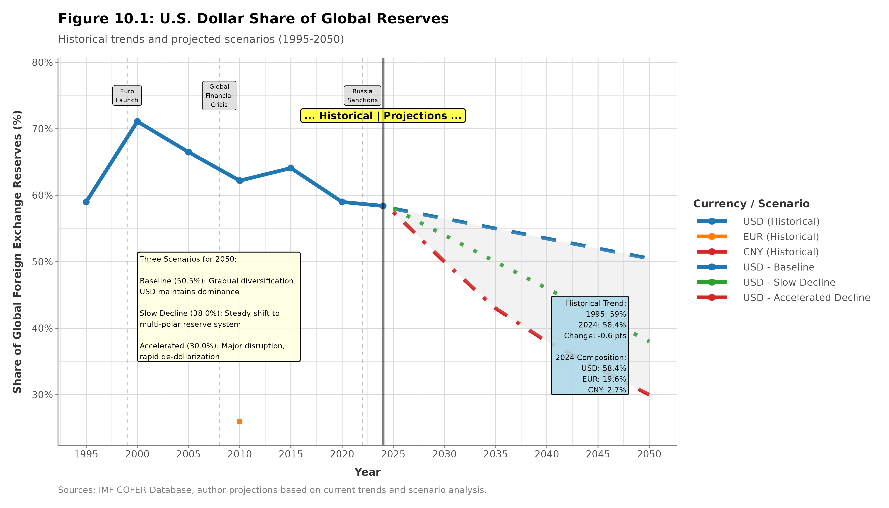
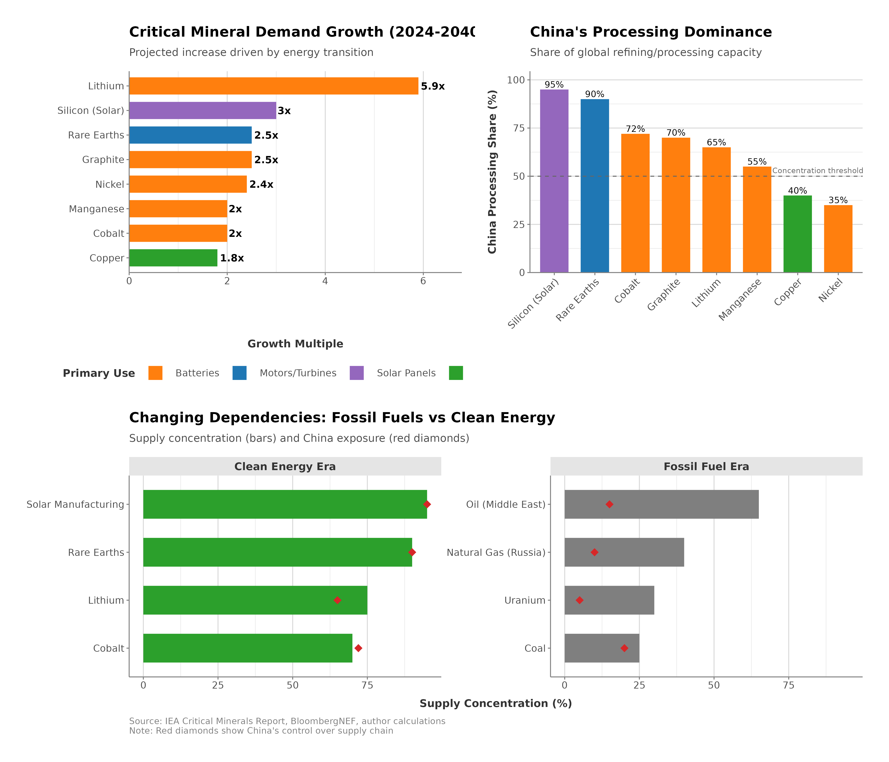
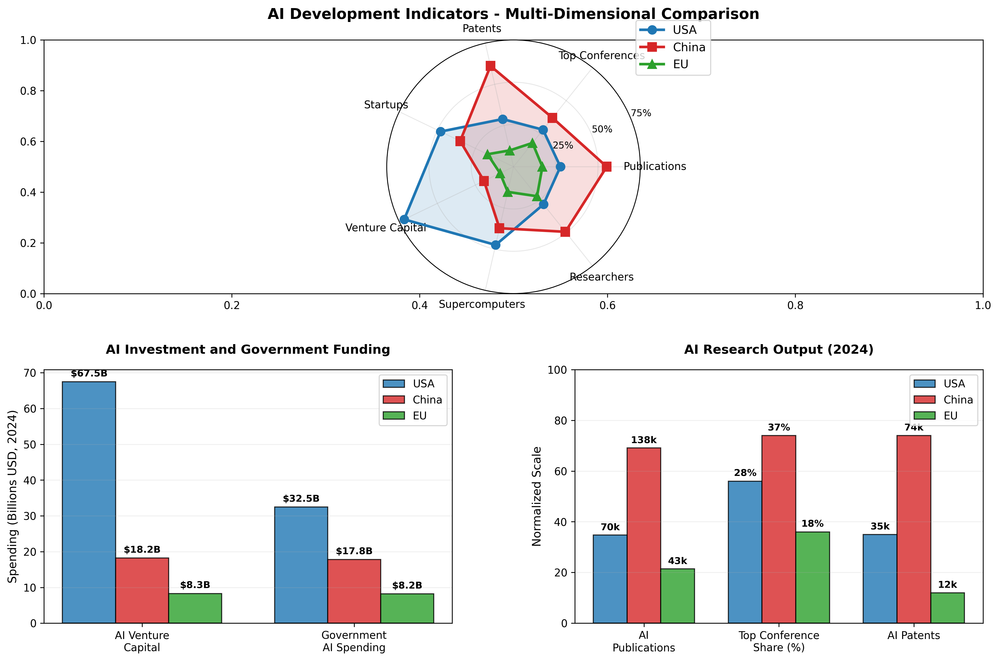
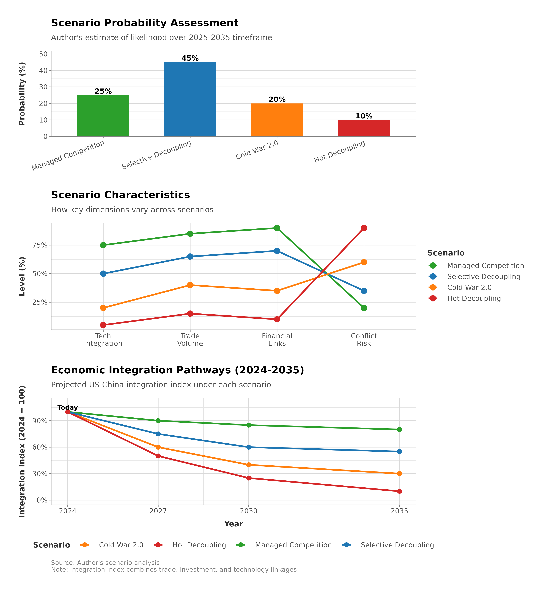

# Future Scenarios and Policy Implications

## Learning Objectives

After working through this chapter, readers should be able to:

- **Apply the substitution and coalitional margins** developed in Chapters 1 and 9 to plausible 2035-2050 futures, explaining why some dependencies erode under pressure while others harden.
- **Distinguish the several dimensions of de-dollarization**—reserve composition, payment-system share, and foreign-exchange turnover—and evaluate the counterargument that dollar-backed stablecoins extend, rather than erode, dollar reach.
- **Assess how emerging technologies** (AI, quantum computing, biotechnology, space) reshape the chokepoints available for economic coercion, and why software- and talent-centric domains resist controls designed for physical goods.
- **Trace the relocation of strategic dependence** from hydrocarbons to critical-mineral processing, and identify the coercive leverage that climate, water, and food systems create.
- **Use scenario analysis** to separate robust strategies (effective across futures) from contingent ones, and to identify the monitoring indicators that signal which future is arriving.
- **Evaluate the seven policy recommendations** carried forward into the Conclusion against the two-margins framework and the use-it-and-lose-it paradox.

## Executive Summary

The instruments examined in the previous chapters are now beginning to reshape the system that produced them, and the clearest recent demonstration came not in money but in minerals. On October 9, 2025, China's Ministry of Commerce announced a sweeping expansion of its rare-earth export controls, extending them for the first time to foreign-made goods containing as little as 0.1% Chinese-origin material—a near-mirror image of the extraterritorial Foreign Direct Product Rule the United States had turned against Chinese chipmakers three years earlier (Chapter 6). Washington answered with the threat of an additional 100% tariff; within weeks the two governments reached an uneasy truce in which each side shelved its newest weapon. The episode was less a resolution than a demonstration: each power had shown it could reach deep into the other's supply chains, and each had discovered that doing so invited symmetrical retaliation. The same dynamic is playing out, more slowly, in money. Bilateral local-currency settlement, expanded yuan-ruble trade to work around sanctions, and central-bank reserve diversification have accumulated into what observers call accelerating de-dollarization—a gradual erosion of the dollar's monopoly as global reserve currency and medium of exchange (Farrell and Newman 2019)—and they raise an uncomfortable question for American policymakers: whether weaponizing dollar dominance through sanctions will, over time, erode the very source of that power. Each use of dollar-based financial leverage gives other states a stronger incentive to build alternatives—even as, in a countervailing twist examined below, the 2025 turn to dollar-backed stablecoins may extend that dominance onto new digital rails.

This is the recurring paradox of economic statecraft: each instrument, once used, accelerates adversaries' efforts to neutralize it. Financial sanctions excluding Russia from SWIFT and freezing $300+ billion in reserves demonstrated American power, and accelerated Chinese, Russian, Indian, and Brazilian efforts to build alternative financial infrastructure. Export controls degrading adversary capabilities spur indigenous innovation. Investment screening blocks technology access but fragments the global markets that enriched Western economies. The tools of strategic competition tend to weaken the integrated system that made the West powerful enough to wield them.

Projecting forward to 2035–2050, several trends stand out.

The first is increasing economic fragmentation, partial decoupling between rival blocs, parallel technological ecosystems, and competing financial architectures, rather than complete autarky or renewed integration. Full decoupling is economically prohibitive. Even hostile powers maintain trade in non-strategic sectors (U.S.-China goods trade was $414.7 billion in calendar year 2025, with $106.3 billion in U.S. exports and $308.4 billion in U.S. imports, according to the Census/BEA February 5, 2026 release), and global supply chains resist comprehensive restructuring. That 2025 total—down sharply from the $690 billion record of 2022—is not a natural cooling but the imprint of a specific confrontation: the reciprocal-tariff escalation that briefly pushed effective duties into triple digits before the Geneva and Busan truces, and China's rare-earth export-licensing regime, which for the first time asserted extraterritorial control over foreign goods embedding Chinese minerals (Chapter 6). The figures already record, in aggregate, the machinery this chapter projects forward. But selective decoupling accelerates. Semiconductors, AI, biotechnology, and critical minerals face strategic controls; financial systems develop redundancies; standards and protocols diverge. The resulting "partially fragmented globalization" combines sectoral decoupling in strategic domains with continued integration in commodity trade and consumer goods, forcing firms and policymakers to manage operations across bifurcated markets.

The second is that emerging technologies, artificial intelligence, quantum computing, biotechnology, clean energy, and space systems, will become central arenas for strategic competition, with economic coercion tools adapted to control technology diffusion. Unlike semiconductors, where chokepoints concentrate in specific equipment and materials, AI development distributes across talent, algorithms, data, and computing infrastructure. Quantum computing remains early-stage, with uncertain timelines for practical applications but potentially far-reaching implications for cryptography, optimization, and sensing. Biotechnology advances (CRISPR gene editing, synthetic biology, personalized medicine) create dual-use capabilities with economic and security dimensions. Each technology requires tailored coercion strategies: talent restrictions for AI, specialized equipment controls for quantum, data sovereignty for biotech. Yet technology's rapid evolution, diffusion speed, and software-centricity resist traditional export controls designed for physical goods.

The third is that alliance structures will prove decisive in determining economic statecraft effectiveness, with competition between U.S.-led networks and alternative coalitions shaping global economic governance. The post-1945 order presumed Western economic dominance enabling rule-setting: IMF/World Bank governing finance, WTO managing trade, dollar-denominated transactions, and English-language internet protocols. China's rise, Russia's resistance, and Global South agency challenge this structure. Alternative institutions (AIIB, BRICS New Development Bank, SCO) provide parallel financial infrastructure. Digital currencies and payment systems (e-CNY, cryptocurrencies, bilateral settlement) reduce dollar dependence. Technology standards competition (5G, AI governance, internet protocols) fragments global systems. The future likely features competing economic blocs with varying degrees of integration, overlap, and conflict, a multipolar economic order replacing unipolar Western dominance.

Future economic statecraft will operate in an environment shaped by decisions made today. Weaponizing interdependence through sanctions, export controls, and investment restrictions yields short-term advantages but risks fragmenting the integrated global economy that generated Western prosperity. Managing this trade-off, maintaining competitive advantages while preserving beneficial integration, represents the central challenge for policymakers over the next three decades of strategic competition. If managed carefully, the rivalry can support a stable, if tense, world order; if managed poorly, it risks a broader unraveling of globalization and the prosperity that depends on it.

---

## De-Dollarization and the Future of Financial Architecture

The U.S. dollar's role as global reserve currency and dominant medium of exchange provides "exorbitant privilege": Americans borrow cheaply (foreign demand for dollar assets lowers U.S. interest rates), purchase imports through dollars printed domestically, and wield financial sanctions excluding adversaries from dollar-denominated systems. This privilege depends on network effects (more users increase utility), path dependency (existing dollar infrastructure creates inertia), and confidence (dollar perceived as safe store of value). Yet dollar weaponization through financial sanctions, combined with emerging alternatives, creates de-dollarization pressures that could fundamentally reshape global financial architecture by 2035-2050.

### Dollar Privilege and Its Vulnerabilities

Figure 10.1 sets out the reserve-currency trajectory that the scenarios in this chapter turn on. The decline in the dollar's share is real but gradual, and it has been running at a pace that would take decades to displace incumbency — which is why the interesting question is not the trend but what could interrupt it.

<figure class="book-figure">
  
  <figcaption>Figure 10.1: Projected dollar share of global reserves under different scenarios from 2024-2050.</figcaption>
</figure>

**Current Dollar Dominance**

As of 2025Q3 and December 2025, the dollar's dominance spans every dimension of international finance. It comprises about 57% of allocated global foreign exchange reserves (down from 71% in 2000, IMF COFER Data Brief published December 19, 2025), and SWIFT payment data (published January 2026 for December 2025 flows) shows USD at roughly half of global payment value, rising to about 59% when euro-area internal payments are excluded. The dollar's role in foreign exchange markets remains even more pronounced: it sits on one side of roughly 88% of all foreign-exchange turnover (BIS 2022 Triennial Survey). Because every currency trade involves two currencies, individual shares sum to 200%, so this figure reflects the dollar's ubiquity as the market's vehicle currency rather than an 88% "market share." Over 60% of international bonds and loans remain dollar-denominated (BIS 2022; Prasad 2023).

That position pays three distinct dividends. The first is seigniorage: the rest of the world holds dollars it does not spend, which amounts to an interest-free loan to the issuer. The second is cheaper borrowing, as foreign demand for Treasuries lowers U.S. government funding costs by an estimated thirty to fifty basis points — a saving measured in hundreds of billions of dollars a year. The third, and the one this book is principally concerned with, is coercive: the ability to exclude an adversary from dollar clearing imposes costs that no other single instrument of statecraft can match, for the reasons Chapter 7 sets out in detail.

**Vulnerabilities and Risks**

Each of these dividends is also a vulnerability, and the mechanism of erosion is the same use-it-and-lose-it dynamic that runs through the rest of the book.

The first pressure is sanctions overuse. Every deployment of financial sanctions is also a demonstration that dollar access is conditional, and it gives adversaries and neutrals alike a reason to reduce their exposure. Russia is the clearest case: the dollar share of its reserves fell from roughly 46 percent in early 2018 to about 22 percent within that year and into the low teens by 2024 (Bank of Russia, *Foreign Exchange and Gold Asset Management* reports), though the February 2022 freeze of some $300 billion — about half of Russia's reserves — makes deliberate diversification hard to disentangle from forced immobilization. China has diversified more quietly, and its reserve composition remains undisclosed, with the dollar still estimated at around 60 percent. More telling than either is that allies have raised the same concern: French and German officials objected to dollar weaponization after the extraterritorial Iran sanctions, which is a different order of complaint from an adversary's.

The second pressure is infrastructural. CIPS, China's yuan-denominated clearing system, handled roughly RMB 175 trillion — about $24 trillion — in 2024 and has been growing at over 40 percent a year, though it still relies on SWIFT messaging for a substantial share of its traffic, a dependency Chapter 7 examines closely. Russia's SPFS functions but has attracted little international adoption. Stablecoins and cryptocurrencies offer settlement outside state control at the cost of volatility and limited scale. And more than 130 countries are exploring or piloting central bank digital currencies, with China's e-CNY the furthest advanced. None of these is close to substituting for the dollar system today; the significance is that each of them exists because the dollar system was used as an instrument of pressure.

The third pressure is straightforwardly geopolitical. China promotes renminbi internationalization through Belt and Road lending, yuan-denominated oil futures in Shanghai, and an expanding network of bilateral swap lines. BRICS members periodically explore a common settlement mechanism, if not a common currency. And local-currency settlement between pairs such as China and Russia, or China and Brazil, chips away at dollar intermediation transaction by transaction. Individually these are marginal; the argument for taking them seriously is cumulative.

### De-Dollarization Trajectories

Three pathways are worth distinguishing, because they have very different implications for how much warning the United States would have.

**Gradual erosion** is the baseline. The dollar's share declines one to two percentage points a year as central banks diversify toward the euro, the renminbi, and gold; as bilateral trade increasingly settles in local currencies; and as regional payment systems absorb intra-regional flows. On this path the dollar falls from about 57 percent of allocated reserves in 2025 to somewhere between 45 and 50 percent by 2035, and 35 to 40 percent by 2050. The United States borrows slightly more expensively but remains privileged; financial sanctions keep their force while facing more circumvention; and what emerges is a multipolar currency system with the dollar as first among equals rather than a successor hegemon.

**Crisis-driven abandonment** is the tail case. It requires a shock — a Taiwan conflict, a broader confrontation, a financial panic — severe enough to make dollar holdings look like a liability rather than an asset. In that world China sells Treasuries in earnest (its holdings stood at about $683.5 billion at the end of 2025, down from roughly $759 billion a year earlier and from a 2013 peak near $1.3 trillion, having slipped behind both Japan and the United Kingdom), oil exporters begin accepting yuan and euros for crude, and BRICS+ coordinates a shift out of dollar trade. The decline would be sharp rather than gradual — perhaps to 30 to 35 percent of reserves within a decade of the triggering crisis — and the transition would be violently disorderly: spiking U.S. interest rates, global financial instability, and a permanent reduction in American coercive capacity as alternative systems mature under pressure.

**Technology-driven displacement** operates on a longer clock and by a different mechanism. Here digital currencies erode dollar dominance not through geopolitical rupture but by being better: the e-CNY reaching critical mass across Belt and Road economies on the strength of instant settlement and lower transaction costs, crypto-based systems enabling evasion at scale, and programmable currencies with compliance embedded in the instrument itself displacing correspondent banking. Significant displacement on this path arrives in the 2040s rather than the 2030s. Its distinctive consequence is that the dollar could retain safe-haven status while losing transactional dominance — which would preserve the borrowing advantage while gutting the coercive one, and would make financial surveillance considerably harder.

The most defensible expectation combines the first pathway with episodes of the second: slow structural decline, punctuated by crisis-driven jumps that partly stabilize afterward. On that basis a 2050 landscape might place the dollar at 35 to 45 percent of allocated reserves, against roughly 57 percent today; the euro at 20 to 25 percent, close to its current share; gold, SDRs, and digital instruments together at 15 to 20 percent; and the renminbi somewhere between 8 and 15 percent, up from 1.93 percent in 2025Q3. That last range deserves emphasis, because it is the one most often overstated. The constraint on renminbi reserve accumulation is not China's economic size, which is already sufficient, but capital-account convertibility, legal predictability, and the willingness of foreign institutions to hold claims they may not be able to liquidate freely. Those are political choices Beijing has so far declined to make, and until it makes them, the renminbi's reserve share will lag its trade share by a wide margin.


**The 2050 Currency Projection**
If current trends continue, the global reserve currency landscape in 2050 will look substantially different from today. The dollar is unlikely to collapse, but it will share the stage. A multipolar currency system with the dollar at 35-45% of allocated reserves (down from roughly 57% in 2025) means the U.S. retains significant privilege but cannot unilaterally dictate global financial terms. Sanctions will require genuine multilateral coalitions to be effective. American financial hegemony appears to be receding; the open question is whether it recedes gradually and manageably, or suddenly and chaotically.


### The Stablecoin Counterargument

The de-dollarization narrative has a powerful counter-current that accelerated in 2025, and it runs in the opposite direction. The largest privately issued dollar-substitutes—dollar-backed stablecoins such as USDT and USDC—do not compete with the dollar; they extend it. Each token is a claim on a U.S. dollar or a short-dated Treasury bill, and the July 2025 GENIUS Act (Guiding and Establishing National Innovation for U.S. Stablecoins Act) codified exactly that arrangement into federal law, requiring permitted issuers to hold 100% reserves in cash and short-term Treasuries and to disclose their composition monthly. The effect is to graft dollar demand onto digital rails that reach precisely the users—in emerging markets, in the crypto economy, in cross-border commerce—most often cited as candidates for de-dollarization. A Nigerian trader or an Argentine saver moving into a dollar stablecoin is diversifying away from the naira or the peso, not away from the dollar; the transaction ends in a new marginal buyer of Treasury bills. As Chapter 7 argues, this is dollar dominance migrating to a new substrate rather than retreating from the field: the same weaponizable chokepoints—reserve backing held in U.S. institutions, issuers subject to U.S. jurisdiction and sanctions authority—are reconstituted in programmable form. Whether stablecoins ultimately reinforce dollar primacy or, by demonstrating that money can move outside the correspondent-banking system entirely, seed the very alternatives they were meant to forestall, is one of the genuinely open questions of the coming decade.

### Implications for Financial Sanctions

De-dollarization doesn't eliminate U.S. financial sanctions power but constrains it:

**Reduced scope**: Countries with diversified reserves and alternative payment access less vulnerable to dollar cutoff. Russia post-2022 demonstrates adaptation: bilateral yuan-ruble trade, gold settlements, cryptocurrency use sustained economic activity despite SWIFT exclusion.

**Slower impact**: Targets can delay adjustment costs by using alternatives, reducing sanctions' immediate bite.

**Allied coordination more critical**: If dollar alone insufficient, coordinating euro, yen, pound exclusions becomes necessary, requiring diplomatic effort and increasing defection risks.

**Sectoral limitations**: Financial sanctions may retain effectiveness in specific domains (cutting off high-tech firms needing Western capital markets) while losing power over commodity trade (payable in yuan/rupees).

**Strategic trade-off**: Aggressive sanctions hasten de-dollarization, gradually eroding future sanctions power. Restraint preserves privilege longer but foregoes near-term coercion. Managing this trade-off requires:
- **Targeting**: Focus sanctions on highest-priority objectives, avoid overuse
- **Multilateralization**: Coordinate with allies so sanctions don't rely solely on dollar
- **Alternatives**: Develop non-financial coercion tools (technology restrictions, trade controls)
- **Adaptation**: Accept that financial sanctions will prove less effective over time, plan accordingly

---

## Climate, Resources, and the Security Nexus

Climate change is reshaping the conditions for economic coercion. It alters resource availability and geographic distribution, creates new dependencies (critical minerals for clean energy), generates humanitarian crises exploitable for coercive purposes, and changes strategic calculations about long-term competition. Economic statecraft in 2035-2050 will increasingly intersect with climate adaptation, resource scarcity, and energy transitions.

### Critical Minerals and Clean Energy Dependencies

**The Green Transition's Material Requirements**

Decarbonization demands massive increases in the production of a handful of specific minerals (IEA 2021). Lithium, the backbone of EV batteries and grid storage, ran at roughly 180,000 tons per year in 2023 (USGS Mineral Commodity Summaries 2024); reaching net zero implies 2 to 3 million tons per year by 2050 (IEA 2023; IEA Net Zero Roadmap). Its supply is geographically lopsided, with Australia mining about 50% and Chile 25%, while China accounts for only 15% of mining but fully 60% of processing (USGS 2024; Benchmark Mineral Intelligence 2024). Cobalt tells a similar story: battery cathodes drew on roughly 230,000 tons per year in 2023 (USGS Mineral Commodity Summaries 2024; Cobalt Institute), a figure that must climb to 500,000-700,000 tons by 2050 (IEA 2023; IEA Net Zero Roadmap), with the Democratic Republic of the Congo supplying about 74% and Russia and China another 25% combined (USGS 2024; cobalt production data). Rare earths—the magnets in wind turbines and EV motors—come from an already stressed supply chain in which China controls roughly 90% of processing and 70% of mining (Chapter 2; the Chapter 9 rare-earth case). Nickel, copper, graphite, and manganese round out the list, each requiring two- to fivefold production increases.

**New Dependencies Replace Old**

Figure 10.2 visualizes the relocation of strategic dependencies: legacy hydrocarbon exposure concentrated in OPEC and Russia shifts toward critical-mineral processing concentrated overwhelmingly in the People's Republic of China.

<figure class="book-figure">
  
  <figcaption>Figure 10.2: From oil to minerals — the relocation of strategic dependencies in the energy transition.</figcaption>
</figure>

Transitioning from fossil fuels to renewables does not eliminate strategic dependencies so much as relocate them, from oil producers to mineral processors, and the concentration is if anything more acute. Where OPEC produced roughly 40% of the world's oil, China processes 60 to 90% of the key minerals—a tighter chokepoint than the one that defined the twentieth century. Mining itself remains dispersed across the globe, but refining has pooled in China, drawn there by economies of scale, a willingness to externalize environmental costs, and tightly integrated supply chains. The same concentration extends downstream into manufacturing, with battery production, solar panels, and wind-turbine assembly all commanding a 60 to 80% Chinese share of the global market.


**From Oil to Minerals: A Relocation of Dependence**
The green energy transition does not end resource-based strategic vulnerabilities; it transforms them. China's dominance of critical mineral processing (60-90% of lithium, cobalt, rare earths) exceeds OPEC's historical control of oil (40%). The 1970s oil shocks demonstrated how resource concentration enables coercion, and the 2010 rare earth embargo (Chapter 9) illustrated the same dynamic more recently. Building alternative processing capacity is a costly, environmentally challenging, decade-long project; absent that investment, the clean energy transition leaves the West dependent on Chinese processing.


**Strategic Implications**

This relocation of dependence carries several strategic implications. China's grip on processing hands it leverage directly analogous to OPEC's oil leverage in the 1970s: it can restrict exports, as the 2010 rare-earth episode showed, or mandate that downstream manufacturing occur on Chinese soil before materials are allowed out. The United States and Europe, dependent on those supply chains for their own energy transitions, confront an awkward trade-off—accelerate decarbonization and deepen their reliance on China, or slow the transition and miss climate targets while remaining hooked on fossil fuels. Nor is the leverage China's alone. Resource-rich states holding lithium, cobalt, and nickel—Chile, Argentina, Indonesia, the DRC, and Australia—could in principle coordinate supply restrictions into a "green OPEC," extracting economic and political concessions. And a broader resource nationalism is already stirring, as developing countries increasingly demand local processing, technology transfer, and equity stakes rather than accepting extraction-only arrangements. Bolivia, Chile, and Argentina coordinate their lithium strategies, and Indonesia has banned nickel-ore exports outright to force domestic processing.

**Mitigation Strategies**

Western nations are pursuing diversification through investments in alternative mining in the United States, Canada, and Australia, along with expanded processing capacity. Recycling offers a complementary pathway, with battery recycling projected to provide 25-30% of lithium and cobalt needs by 2040, reducing virgin material requirements. Technology substitution, including sodium-ion batteries, rare-earth-free motors, and alternative chemistries, could further diminish dependence on concentrated supply sources. Governments are also stockpiling critical minerals as strategic reserves, and friend-shoring efforts aim to develop supply chains through allied countries such as Australia, Canada, Chile, and Peru.

### Water Scarcity and Agricultural Leverage

**Projected Water Stress**

The picture for 2040-2050 is sobering. By 2050 some 5 billion people—more than half the global population—are projected to face water scarcity for at least one month a year (United Nations World Water Development Report 2023; World Resources Institute Aqueduct 2024). More than 260 rivers cross international borders, and as they run low the potential for transboundary disputes, and outright conflict, rises with the stress. Agriculture bears the brunt, since falling water availability cuts crop yields and threatens food security precisely in the regions least able to compensate.

**Strategic Waterways and Leverage**

Upstream control of a river confers coercive leverage over everyone downstream, and three basins illustrate the pattern. On the Nile, Ethiopia's Grand Ethiopian Renaissance Dam (GERD) gives Addis Ababa command over flows to Egypt and Sudan—and roughly 90% of Egypt's water comes from the Nile. Through a decade of construction Cairo warned that filling the reservoir could sharply cut its supply, and repeatedly hinted at military action. In the event, the dam completed its fifth and final reservoir filling in October 2024 and was inaugurated on September 9, 2025 without the catastrophic downstream shortfall Egypt had feared: Ethiopia filled gradually and largely during high-flow years, and no binding tripartite agreement was ever reached. The episode is now a case study in coercive leverage brandished but, in the end, not exercised—the capability is permanent, yet Ethiopia declined to weaponize it, and the leverage now lies latent in reservoir-management decisions for decades to come. On the Mekong, China's upstream dams govern flows to Vietnam, Thailand, Laos, and Cambodia; retention and sudden releases cause downstream flooding and drought, a standing coercive tool in regional disputes. And on the Tigris-Euphrates, Turkey's dam construction lets it regulate the water reaching Syria and Iraq, leverage it has used in past conflicts.


**Upstream Dam Leverage**
Water has no substitute, so a country controlling upstream flows holds substantial leverage over downstream neighbors. Egyptian analysts had modeled worst-case scenarios in which a rapid filling of Ethiopia's Grand Ethiopian Renaissance Dam might temporarily cut Egypt's water supply by as much as a quarter, threatening food production for 100 million people—but that worst case did not materialize: Ethiopia filled the reservoir gradually over five years, completing it in October 2024 and inaugurating the dam in September 2025 without a catastrophic downstream shortfall. The lesson is instructive. The coercive capability created by upstream infrastructure is real and permanent, yet its exercise remains a political choice, and the mere existence of the leverage reshaped a decade of regional diplomacy even though the leverage was never fully used. China's Mekong dams have caused droughts and floods in Vietnam, Thailand, Laos, and Cambodia. Unlike oil, which has alternatives, or semiconductors, which can eventually be produced elsewhere, water leverage is difficult to circumvent, and its consequences can extend to famine.


**Agricultural Dependencies**

Water scarcity concentrates farming in water-rich regions, and that concentration breeds dependence. A short roster of exporters—the United States, Russia, Ukraine, Canada, Australia, Brazil, and Argentina—already accounts for roughly 80% of world wheat, corn, and soy exports, and climate change may consolidate their position further as higher latitudes benefit from warming while tropical regions suffer. On the other side of the ledger, the Middle East, North Africa, and Sub-Saharan Africa import ever more grain, so that any disruption—the Russia-Ukraine war, an export restriction—ripples outward as price spikes and political instability. The coercive potential is plain: grain exporters can restrict sales, as Russia did through the 2022 grain deal and as the United States attempted with its 1980 grain embargo, imposing real costs on import-dependent states.

### Climate-Driven Migration and Hybrid Coercion

**Climate Migration Projections**

The World Bank estimates 216 million internal climate migrants by 2050 under its baseline scenario (World Bank 2021), driven by sea-level rise that displaces coastal populations from Bangladesh to the Pacific islands to major coastal cities, by agricultural failure across water-stressed and heat-affected regions, and by extreme weather events—hurricanes, floods, droughts—growing in frequency and severity. Cross-border climate migration could add tens of millions more, concentrated along predictable corridors: from Central America toward the United States, from Sub-Saharan Africa toward Europe, from South Asia toward the Middle East and Southeast Asia, and from Southeast Asia toward Australia.

**Weaponized Migration** (Chapter 9 analysis extended)

Extending the analysis of Chapter 9, climate migration opens several coercive opportunities. States can turn refugee flows on and off, using border control as leverage in the manner of the Turkey-EU model, now applied to climate migrants. Even without deliberate direction, large-scale migration can weaken an adversary indirectly, provoking anti-immigrant populism, welfare costs, and cultural tensions that destabilize receiving societies. Flows can also be steered: directing refugees toward specific regions alters local demographics and manufactures ethnic tension or political change. And the threat itself can be monetized as humanitarian blackmail—a promise to unleash refugee flows unless economic concessions or policy changes are forthcoming. The countermeasures are familiar if imperfect: investment in border security, regional burden-sharing agreements, managed migration systems, and spending on the root causes through climate-adaptation funding.

---

## Emerging Technologies and Strategic Competition

Artificial intelligence, quantum computing, biotechnology, and space systems mark the technological frontiers where strategic competition will intensify. Unlike the historical technology races over nuclear weapons or semiconductors, with their relatively clear milestones and state-dominated development, these emerging fields share a set of features that make them harder to govern. Development is diffuse, spread across private firms, universities, and startups alongside government programs. Applications are dual-use, their commercial and military faces intertwined. Innovation cycles run faster than in traditional hardware. And success depends on global talent pools, on the ability to attract international scientists and engineers. Economic coercion tools must adapt to control the strategic diffusion of technologies built this way.

### Artificial Intelligence: The Defining Technology Competition

Figure 10.3 revisits the AI indicators introduced in Chapter 4, now as inputs to the scenarios below. Their divergence is what makes the technology competition hard to score in advance, and it is the principal reason the scenario probabilities offered here are wide.

<figure class="book-figure">
  
  <figcaption>Figure 10.3: AI development indicators comparing U.S. and China across research, talent, compute, and applications.</figcaption>
</figure>

**AI Strategic Significance**

Artificial intelligence reaches across every domain of competition. Militarily, it powers autonomous weapons, intelligence analysis, cyber operations, and logistics optimization. Economically, it drives automation, productivity gains, and entirely new products and services. And as an instrument of social control it enables surveillance, censorship, population monitoring, and predictive policing. Because dominance in AI confers decisive advantages across all three, it sits at the center of U.S.-China competition (Miller 2022; National Intelligence Council 2021).

**AI Development Requirements**

Leadership in AI requires assembling four ingredients—talent, data, computing power, and algorithms—and the two contenders hold different pieces. On talent, the researchers, engineers, and data scientists who build the models, the United States draws on top universities (Stanford, MIT, CMU, UC Berkeley), an immigration system that attracts global talent, and the dynamism of a private sector led by Google, Microsoft, Meta, and OpenAI; China counters with a vast domestic pool—more STEM graduates than the United States and EU combined—along with government-directed recruitment and growing success at retaining its own. On data, the fuel for training large models, China's advantages are structural: a population of 1.4 billion, weak privacy protections that ease collection, and government access to private-sector holdings; the United States offsets these with high-quality curated datasets, the dominance of the English-language internet, and commercial data drawn from global user bases. On computing power—the thousands of high-end GPUs that frontier training demands—the United States leads through chip design (Nvidia's H100, AMD) and wields semiconductor-equipment export controls to restrict Chinese access, while China remains dependent on imports, its domestic alternatives such as Huawei's Ascend lagging in performance and SMIC's fabrication running two to three generations behind TSMC and Samsung.


**The Compute Chokepoint**
AI development has a bottleneck that export controls can target: computing power. Training frontier AI models like GPT-4 requires thousands of cutting-edge GPUs that cost tens of millions of dollars. Nvidia's H100 chips, among the leading processors for AI training, are designed in the U.S. and manufactured in Taiwan with American equipment. By restricting these chips and the equipment to make them, the U.S. can directly constrain adversaries' AI capabilities. This compute chokepoint is currently the most effective lever for slowing Chinese AI development.


The fourth ingredient, the algorithms and models themselves—neural-network architectures, training techniques, foundation models—is the one that travels most freely. Research is published openly, and Chinese papers now match or exceed the United States in volume. The American edge survives at the frontier, in models such as GPT-4, Claude, and Gemini, but it is narrowing.

**AI Export Controls and Coercion**

U.S. semiconductor export controls evolved rapidly between 2022 and 2025, and their swerves lay bare the tensions inherent in using technology denial as a coercive instrument (Chapter 4 supplies the detailed analysis of mechanisms, allied coordination, and Chinese countermeasures). Under the Biden administration, from October 2022 through 2024, Washington imposed blanket restrictions on advanced AI chips (Nvidia's A100 and H100, AMD's MI250), on semiconductor manufacturing equipment, and on U.S. persons supporting Chinese chip development, tightening progressively to close loopholes—October 2023 updates banned "China-compliant" variants such as the A800 and H800. The administration's final salvo came in December 2024, when BIS added roughly 140 entities—136 of them Chinese semiconductor firms and toolmakers—to the Entity List, tightened controls on high-bandwidth memory, and expanded the Foreign Direct Product Rule; this, not any Trump-era measure, was Biden's last major chip-control action. Days before leaving office, in early January 2025, the outgoing administration issued a global "AI Diffusion Rule" creating a three-tier country-licensing framework meant to prevent third-country circumvention before the January 20, 2025 transition. The Trump administration then reversed course, rescinding that diffusion rule in May 2025 and shifting to case-by-case, revenue-sharing licensing for advanced chips. The clearest case was the Nvidia H20, banned from China in April 2025 and then, in July 2025, permitted again under an arrangement that channeled a share of the resulting revenue to the U.S. government. In September 2025 BIS issued the "Affiliates Rule," or "50 percent rule," automatically extending Entity List and Military End-User restrictions to any firm at least half-owned by a listed entity—a dramatic widening of coverage. And in the October 2025 Trump-Xi truce that followed China's rare-earth escalation, Washington agreed to suspend that rule—BIS formally delayed it for one year on November 10, 2025—in exchange for Beijing pausing its own rare-earth export controls, a vivid illustration of chokepoint leverage traded rather than exercised.

The record on effectiveness is mixed across time horizons. In the short run the controls bit: during the 2022-2024 restriction period Chinese labs faced GPU shortages, and training frontier models grew more expensive and slower. Over the medium run adaptation set in—Chinese firms found workarounds through smuggling and cloud-computing access while Huawei and SMIC pushed indigenous alternatives—and the 2025 relaxation partly reflects a recognition that blanket restrictions were inflicting innovation losses on American firms without permanently blocking Chinese progress. The long run remains genuinely uncertain: whether China achieves self-sufficiency or stays perpetually behind depends on the trajectory of semiconductor technology, on how effectively Chinese state investment is spent, and on whether Washington's own oscillation between restriction and selective engagement corrodes the credibility of export controls as a coercive tool.

**AI Governance Fragmentation**

Competing regulatory frameworks are pulling the field apart. The United States and Europe emphasize safety, ethics, transparency, and the prevention of bias and misuse, though they pursue these differently: the EU's AI Act imposes risk-based regulation under which high-risk applications face strict requirements, while the American approach relies on voluntary guidelines, sector-specific rules in healthcare and finance, and national-security restrictions. China emphasizes instead state control, censorship, and social stability, requiring algorithm disclosures to the government, content monitoring, and ideological alignment, and reserving state access to private-sector AI systems and data. These divergent standards breed incompatible systems—Chinese models built to comply with censorship, Western models prizing openness—alongside data-flow restrictions running from Chinese data-localization rules to the GDPR's limits on transfers, and impediments to talent movement in the form of security clearances, visa restrictions, and exit controls.

**Future AI Competition Scenarios**

**Scenario A: U.S. Sustained Lead**

Export controls successfully limit Chinese access to cutting-edge compute; U.S. talent advantages and innovation ecosystem maintain 2-5 year frontier model lead. China develops capable AI but remains behind state-of-the-art, relying on specialized applications where data/domain knowledge compensate for model limitations.

**Scenario B: Convergence**

Chinese state investment, large domestic market, talent development enable catching up. By 2035-2040, Chinese and U.S. frontier models roughly equivalent, competing primarily on applications, data advantages, regulatory environments rather than raw capability gaps.

**Scenario C: Fragmented Ecosystems**

Regulatory divergence, data localization, incompatible standards create separate AI ecosystems. Chinese AI dominates authoritarian markets (surveillance, censorship, state control). Western AI leads democracies (open systems, privacy-preserving, ethical AI). Global South countries choose between models, creating bifurcated technology spheres.

### Quantum Computing: Uncertain Timelines, Transformative Potential

**Quantum Computing Promise**

Quantum computers, exploiting the quantum-mechanical properties of superposition and entanglement, promise three broad capabilities. They could break encryption—Shor's algorithm threatens the RSA and elliptic-curve cryptography that secure internet communications, financial systems, and military networks. They could optimize complex systems, accelerating drug discovery, materials science, logistics, and financial modeling. And they could sharpen sensing, with quantum sensors enhancing navigation, detection, and imaging.

**Current State (2025-26)**

"Noisy intermediate-scale quantum" (NISQ) devices with dozens to hundreds of qubits remain the norm, but 2024-2025 delivered the field's most consequential milestone yet: error correction that improves as machines scale. In December 2024 Google's 105-qubit **Willow** chip demonstrated "below-threshold" error correction—adding qubits *reduced* the logical error rate rather than increasing it (published in *Nature*)—and in October 2025 Google reported a verifiable quantum-advantage result on the same platform. Rival architectures have multiplied around it. China's University of Science and Technology of China unveiled the 105-qubit **Zuchongzhi 3.0** superconducting processor in March 2025, benchmarked as a direct competitor to Willow, while Microsoft announced **Majorana 1** in February 2025, a small first-generation chip built on topological qubits and pitched as a path toward million-qubit scaling—though none of these is yet a fault-tolerant, general-purpose machine. Nor is any of them cryptographically relevant: breaking RSA-2048 is still estimated to require millions of high-quality physical qubits, and credible timelines remain in the 2030s-2040s and highly uncertain. In anticipation, NIST finalized its first post-quantum cryptography standards (FIPS 203/204/205) in August 2024, and migration to them is now the near-term policy priority. Leadership today rests with the United States—the quantum programs of Google, IBM, Microsoft, Amazon, and IonQ, backed by national labs at Argonne and Oak Ridge—but China sustains heavy state funding and holds a distinct edge in quantum communication, from the Micius satellite to metropolitan quantum-key-distribution networks, even as the superconducting-computing race between the two runs neck and neck.

**Quantum Competition Dynamics**

The competitive dynamics differ from AI's in two respects. First, long timelines temper urgency: where AI is deployed now, quantum's transformative applications remain years or decades away, which limits the immediate intensity of the race. Second, and cutting the other way, is the risk of a "quantum surprise"—a breakthrough that abruptly renders an adversary's communications readable and its financial systems vulnerable. Guarding against it requires completing the transition to post-quantum cryptography before quantum computers reach RSA-breaking capability, which is why NIST has been standardizing post-quantum algorithms.


**The Cryptography Threat**
Once cryptographically relevant quantum computers arrive, they will break the encryption protecting virtually all digital communications, financial transactions, and classified information. Adversaries are already harvesting encrypted communications today with the intention of decrypting them once quantum computers mature, a strategy called "harvest now, decrypt later." The transition to post-quantum cryptography must happen before quantum computers achieve this capability, but the timeline is uncertain (estimates range from 2030s to 2050s). The country that achieves quantum supremacy first gains a potentially decisive intelligence advantage.


A third dynamic works on a shorter clock: quantum communication and sensing. Quantum key distribution for secure communications and quantum sensors are near-term applications, deployable well before general-purpose quantum computing arrives.

**Export Controls Challenges**

Quantum technology diffuses globally in ways that frustrate control. Fundamental research is published openly, international collaborations are common, and while the field does require specialized equipment such as dilution refrigerators and control systems, that hardware is nowhere near as concentrated as semiconductor manufacturing—and the software and algorithms transfer instantly. Controlling quantum technology is therefore harder than controlling semiconductors, though the United States still restricts quantum-computing exports to China and monitors research collaborations.

### Biotechnology and Synthetic Biology

**Biotech Strategic Dimensions**

Chapter 8's analysis of the BIOSECURE Act—enacted as part of the FY2026 National Defense Authorization Act signed on December 18, 2025, with its procurement prohibitions phasing in through 2026-2027 as the government designates "biotechnology companies of concern"—demonstrated how biotech competition has become a domain for economic coercion. Future developments intensify strategic significance:

CRISPR gene editing points in several directions at once: toward agricultural enhancement in the form of drought-resistant crops and higher yields, toward medical treatments that could cure genetic diseases and enable personalized medicine, and toward bioweapons—engineered pathogens, potentially targeting specific populations, that raise Biological Weapons Convention (BWC) concerns. Synthetic biology, the design of organisms from scratch, similarly enables biomanufacturing of chemicals, materials, and pharmaceuticals through engineered organisms, environmental applications such as pollution remediation and carbon capture, and the dual-use risk of creating dangerous pathogens de novo. Personalized medicine and genomics, built on the collection of population genetic data, promise tailored treatments keyed to individual genetics and broad population-health insights—but also intelligence applications, from identifying individuals to assessing their health vulnerabilities.

**Biotech Competition and Coercion**

Several channels turn biotechnology into a domain of competition and coercion. Genetic data is increasingly treated as a strategic asset, with states guarding population genetic data as a national resource (the data-sovereignty logic of Chapter 5, now in a BIOSECURE Act context). Pharmaceutical dependencies cut both ways—Chinese biotech operating in the United States, American pharma in China—creating mutual vulnerabilities that either side could exploit in a crisis. Biosecurity risks shadow the whole field: gain-of-function research and synthetic-biology capabilities carry the danger of accidental or deliberate pathogen release, so strategic competition must be balanced against catastrophic risk. And the tools of restriction are already taking shape. The BIOSECURE Act established the legal framework, and its designation-based model can expand administratively to restrict collaborations, limit talent flows, and control trade in biological materials and reagents.

### Space Systems: The High Frontier

**Space as Strategic Domain**

Space systems underpin four strategic functions. They carry communications, with satellite networks—Starlink and its Chinese equivalents—supplying global connectivity. They provide navigation through GPS, BeiDou, Galileo, and GLONASS, enabling both military precision and commercial positioning. They deliver intelligence and surveillance via spy satellites and earth observation. And they furnish missile warning, with early-warning systems detecting launches.

**Space Competition Intensifying**

Competition in this domain is sharpening. American leadership, once unquestioned across NASA and the commercial sector, now faces determined Chinese competition. China has advanced rapidly—the Tiangong space station, the Chang'e lunar missions, the Zhurong Mars rover, and steadily growing launch capacity. Commercialization is rewriting the economics as SpaceX, Blue Origin, and a proliferation of space startups drive down costs. And the military dimension looms throughout, in anti-satellite weapons, the potential for space-based weapons, and counterspace capabilities more broadly.

**Economic Coercion Through Space**

Space affords its own instruments of economic coercion. Communications can be denied, with adversary satellite links disrupted during conflict. Navigation can be jammed, GPS jamming and spoofing degrading both precision weapons and civilian positioning. Technology export controls let the United States restrict space-technology exports, limiting rivals' access to satellite components and launch systems. And launch services can be withheld, with providers refusing to loft an adversary's satellites—though Chinese, Russian, and European launch capacity blunts that leverage.

---

## Alliance Evolution and Institutional Competition

Future economic coercion effectiveness depends on alliance structures and institutional alignments. Western-led order (G7, NATO, IMF/World Bank, WTO) faces challenges from alternative coalitions (BRICS+, SCO, regional frameworks) and neutral Global South countries avoiding alignment. Economic statecraft's future depends on how these alignments evolve.

### Western Coordination: Strengths and Strains

**G7 and Transatlantic Partnership**

The United States, Canada, the United Kingdom, France, Germany, Italy, and Japan coordinate economic policy through several channels. G7 summits provide regular leader-level coordination on sanctions, trade, and technology. The U.S.-EU Trade and Technology Council (TTC) aligns semiconductor policy, AI governance, export controls, and investment screening. And NATO, a military alliance at its core, has expanded into economic security, taking up supply-chain resilience and critical-infrastructure protection.

The bloc's strengths are considerable. Its economic weight is formidable—the G7 accounts for roughly 45% of global GDP, and about 60% once broader allies such as Australia and South Korea are included. It holds technology leadership, controlling the most advanced semiconductors, AI, biotechnology, and aerospace. It enjoys financial dominance, since the dollar, euro, and yen collectively dominate global finance and SWIFT and correspondent banking sit in Western institutional hands. And it possesses institutional depth: decades of cooperation, established mechanisms, and interoperable systems.

**Strains and Challenges**

Yet the coordination is strained in several ways. The first is cost distribution: burden-sharing tensions over defense spending and sanctions costs generate steady friction, with American frustration at European free-riding meeting European resistance to U.S. extraterritoriality. The second is asymmetric exposure to China. European firms depend on the Chinese market more heavily than American ones—Germany alone exports over $100 billion to China—and Asian allies such as South Korea and Japan face acute trade-offs between their U.S. alliance and their Chinese economic ties.


**Divergent Threat Perceptions**
Alliance coordination on China faces a fundamental asymmetry: the U.S. sees China as an existential threat to its global position, while European allies see China primarily as an economic partner with some security concerns. Germany exports over $100 billion annually to China; for German industry, "decoupling" means lost profits and jobs. South Korea and Japan face even sharper trade-offs, geographically closer to China and more economically intertwined, yet depending on U.S. security guarantees. Maintaining alliance cohesion requires acknowledging these different perspectives rather than demanding uniform alignment with U.S. priorities.


Policy divergences compound these strains: on climate, where the United States lagged Europe until the IRA and the two still differ on carbon pricing; on technology regulation, where the EU comes down harder on American tech firms than Washington does; and on China strategy, where European aspirations to strategic autonomy sit uneasily beside American containment. Domestic politics adds a further solvent, as populist movements and polarization breed alliance skepticism—the Trump presidency having demonstrated just how fragile these commitments can be. On balance, Western coordination is likely to persist but will weather periodic crises requiring diplomatic repair; its effectiveness will depend on managing frictions, demonstrating value to skeptical publics, and adapting to a shifting distribution of global power.

### Alternative Coalitions: BRICS+ and the Global South

**BRICS Expansion (2024+)**

The original BRICS—Brazil, Russia, India, China, and South Africa—expanded in 2024 to bring in Egypt, Ethiopia, Iran, Saudi Arabia, and the UAE, with some 40 additional countries expressing interest. The enlarged grouping is substantial on paper, representing roughly 37% of global GDP in PPP terms, about 45% of world population, and around 25% of global trade, and counting among its members major exporters of oil, minerals, and agricultural products. Its institutional scaffolding is growing too: the New Development Bank (NDB) offers an alternative to the World Bank with roughly $30 billion in project funding, member states are exploring a common currency or local-currency settlement mechanisms, and political coordination increasingly runs to joint statements challenging Western dominance and promoting multipolarity.

The grouping's limitations are equally real. Internal divisions run deep—India-China border tensions, Saudi-Iran rivalries, Brazil-Russia ideological differences—and unlike the G7, bound by shared values, BRICS coheres mainly around anti-Western positioning. Economic asymmetries strain it further: China accounts for roughly 70% of BRICS+ GDP, and the resulting power imbalance breeds resentment and unease about Chinese domination. Its institutions remain immature, the NDB and nascent payment systems dwarfed by the scale and depth of the IMF, World Bank, and SWIFT. And it has no security dimension at all—unlike NATO, BRICS carries no collective-defense or mutual-support obligations. On its likely trajectory, then, BRICS+ expands as a symbolic alternative to Western dominance and supplies a limited institutional infrastructure for development finance and trade settlement, but it does not replace the G7 and NATO as the primary mechanism of economic-security coordination. Its effectiveness will turn on whether it can manage internal tensions—above all between India and China—build institutional capacity beyond rhetoric, and offer members tangible benefits such as cheaper finance, favorable trade terms, and diplomatic support.

### Global South: Non-Alignment 2.0

**Re-emergence of Non-Alignment**

The Cold War's non-aligned movement has been resurrected as Global South countries resist pressure to choose between the United States and China. Their motivations blend economic pragmatism—trading with China and the U.S. and Europe alike, accepting investment from every source—with sovereignty concerns rooted in resentment of great-power coercion, whether U.S. sanctions or Chinese economic pressure, and with development priorities under which climate finance, technology transfer, and market access matter more than geopolitical alignment. The key players are large emerging economies with global connections: Indonesia, Mexico, Turkey, Saudi Arabia, the UAE, Nigeria, Vietnam, and Thailand. Their strategies are recognizable enough—hedging, by maintaining security ties with the United States through arms sales and training while expanding economic links with China; playing both sides, extracting concessions from two powers competing for influence; and a kind of institutional entrepreneurship that builds up regional bodies such as ASEAN, the African Union, and the Arab League as alternative power centers.

For economic coercion, the implications are direct. Neutral countries facilitate sanctions circumvention, with Russian exports moving via Turkey and the UAE and Chinese goods rerouted through third countries. They enable technology leakage by declining to enforce Western export controls. They blunt attempts at diplomatic isolation, as U.N. votes and international forums repeatedly show the Global South refusing to isolate Russia or China under Western pressure. And they provide alternative markets in which sanctioned states find willing buyers and sellers, limiting the bite of any restriction. On its likely trajectory this non-alignment strengthens as a multipolar order emerges, making coercion that depends on universal participation increasingly hard to sustain. Effective sanctions will therefore have to do one of three things: secure Global South cooperation through inducements such as development finance, market access, and technology transfer; accept lower effectiveness with only partial participation; or target the leverage points, above all the financial sector where Western control endures, rather than reaching for comprehensive trade restrictions.

---

## Scenario Analysis 2035-2050

Projecting 25 years into an uncertain future requires scenario analysis: developing multiple plausible futures based on critical uncertainties, assessing implications, and identifying robust strategies effective across scenarios (National Intelligence Council 2021; Blackwill and Harris 2016). Two critical uncertainties shape future economic statecraft:

**Dimension 1: Degree of Economic Integration**
- **Highly fragmented**: Rival blocs with minimal cross-bloc trade, parallel technology standards, separate financial systems
- **Selectively integrated**: Sectoral decoupling (strategic tech) but continued integration (commodities, consumer goods)
- **Deeply integrated**: Renewed globalization, reduced strategic competition, economic interdependence

**Dimension 2: Competition Intensity**
- **Managed competition**: Rules-based rivalry, crisis management mechanisms, limited escalation
- **Intense confrontation**: Economic warfare, comprehensive coercion, crisis-prone, risk of military conflict

Combining these dimensions generates four scenarios. Figure 10.4 places each scenario on the two-dimensional uncertainty space and summarizes the bilateral trade, reserve-currency shares, and alliance configurations associated with each outcome.

<figure class="book-figure">
  
  <figcaption>Figure 10.4: Four scenarios for U.S.–China economic competition, 2035–2050, mapped on the integration × intensity axes.</figcaption>
</figure>

### Scenario A: Managed Competition with Selective Integration (Baseline — 40% probability)

The baseline is not a resolution but a continuation. Competition stays intense and stays managed: decoupling proceeds sector by sector — semiconductors, artificial intelligence, biotechnology, defense-critical technologies — while trade in everything else continues largely undisturbed. The institutional machinery of crisis management holds well enough that Taiwan and the South China Sea remain below the military threshold, sustained by deterrence, back-channel communication, and the absence on both sides of any appetite for the alternative.

Economically, the shape of this world is already visible. Bilateral goods trade settles in the $400–500 billion range, well below the 2022 record of $690 billion but stable rather than collapsing further. Technology ecosystems diverge along standards rather than borders: Chinese specifications in 5G, AI governance, and digital payments spread across much of Asia, Africa, and Latin America, while Western standards hold in Europe, North America, and among treaty allies — a division that matters more for the next generation of infrastructure than for current trade. Friend-shoring reorganizes the strategic segments of supply chains without touching commodity trade, which remains stubbornly global because it is stubbornly fungible. The dollar's share of reserves continues its slow erosion, drifting toward the low fifties, with the euro roughly steady and the renminbi climbing from under 2 percent into the low-to-mid single digits — a meaningful increase in relative terms and an almost negligible one in absolute share, which is the pattern the evidence in Chapter 7 supports.

Coordination in this world is chronically strained but never breaks. G7 alignment survives recurring disputes over who bears which cost; BRICS+ expands in membership without converting size into coherence; and the Global South maintains the non-alignment that has served it well, extracting concessions from both sides precisely by declining to choose. Financial sanctions keep most of their force but face steadily more circumvention through renminbi-denominated trade and alternative payment rails. Export controls concentrate on the genuine frontier — leading-edge logic, AI accelerators, quantum systems — while investment screening is comprehensive in strategic sectors and largely absent elsewhere.

For policymakers this is the least dramatic and most demanding scenario, because it offers no crisis to force decisions. It rewards sustained multilateral coordination through friction that never quite becomes rupture, continued investment in the technologies where leadership is the source of leverage, patient management of Global South relationships through development finance rather than pressure, and the unglamorous maintenance of crisis-communication channels whose value is entirely counterfactual.

### Scenario B: Economic Cold War with Deep Fragmentation (25% probability)

An economic cold war does not arrive by drift. It requires a rupture — a Taiwan confrontation, a South China Sea clash, a technology embargo comprehensive enough to demand comprehensive retaliation — after which continued integration becomes politically impossible on both sides. Rival blocs consolidate, cross-bloc trade falls to a residue, institutions duplicate, and technology standards become deliberately incompatible. The risk of military conflict is materially higher in this world than in any other on this list, which is the reason it deserves attention out of proportion to its probability.


**Cold War Triggers**
An economic cold war would not arrive gradually; it would be triggered by a specific crisis that makes continued integration politically impossible. The most likely trigger is a Taiwan confrontation. If China blockades or invades Taiwan, the U.S. would face pressure for comprehensive sanctions, China would retaliate with export restrictions and debt weaponization, and allies would be forced to choose sides. Other plausible triggers include a South China Sea military clash, a catastrophic cyberattack attributed to state actors, or a financial crisis weaponized by either side. Scenario B is most likely to emerge from one of these crisis points.


Bilateral trade collapses below $100 billion, and what survives is mostly agricultural and raw-material flows that neither side can readily replace. Technology decoupling becomes total in both directions: no Chinese access to Western semiconductors, AI systems, or advanced biotechnology, and no American access to Chinese rare earths, refined critical minerals, or the manufactured goods that pass through them. Reserve composition shifts fast rather than gradually — the dollar falling toward a quarter to a third of reserves, the yuan and euro absorbing much of the difference, gold and alternatives the rest — not because the alternatives have become attractive but because the cost of holding assets a hostile jurisdiction can freeze has finally exceeded the convenience of holding them. Global recession accompanies the transition, as it must when comparative advantage is discarded by administrative decision.

Alliances harden into their blocs. NATO's economic dimension deepens into shared sanctions enforcement, technology pooling, and preferential trade; BRICS+ becomes the coherent anti-Western grouping it has so far declined to be, under unambiguous Chinese leadership; and the Global South's room for non-alignment closes, replaced by a choice most of its members would prefer not to make. Paradoxically, economic coercion becomes less effective in this world even as it becomes more total. Financial sanctions lose their bite as alternative systems mature under the pressure of necessity; export controls extend to everything strategic and therefore discriminate among nothing; and with two self-contained systems, the leverage that came from being the hub of a single one is simply gone.

The policy implications are uncomfortable, because most of them involve spending heavily on capabilities one hopes never to need. Supply-chain independence in critical sectors is expensive and, in this scenario, unavoidable. Allied integration must deepen from coordination into something closer to shared industrial policy. Alternative supply chains are far cheaper to build before a crisis than during one. And above all, escalation management becomes the central task, since the distance between economic and military conflict is shorter here than anywhere else on this list.

### Scenario C: Crisis-Driven Fragmentation with Regional Variation (20% probability)

The third scenario is the one that resembles most previous breakdowns of an international economic order: not a clean bipolar split but an uneven unravelling. A sequence of shocks — a pandemic, a financial crisis, several regional conflicts running at once — fragments globalization by sector and by region rather than by alliance. Energy, food, and commodities stay broadly integrated because integration is cheaper than the alternative; technology, finance, and defense industry fragment because the security case overwhelms the efficiency case. What emerges is not two blocs but several regions with genuinely different characteristics.

Trade volumes fall twenty to thirty percent from their peak and then stabilize. Supply chains reorganize on regional lines: an Americas-centred network linking the United States, Mexico, Canada, and Brazil; an Asia-Pacific network organized around China but including Japan, Korea, and ASEAN despite persistent friction; and a European network with deep African ties. Technology standards regionalize with limited cross-compatibility, which raises costs everywhere and creates durable advantages for whoever sets each region's specifications. Currencies fragment too, with the dollar, euro, and yuan all weakening in relative terms as regional currencies — the rupee in South Asia, the real in Latin America — take on functions they have not held before.

American alliances weaken in this world, less through any decision than through the erosion of domestic support for global commitments, while regional institutions such as ASEAN, the African Union, and the OAS grow correspondingly more important. China pursues regional hegemony in Asia while scaling back global ambitions it can no longer afford. Coercion in this environment becomes strikingly uneven: the United States retains real leverage in the Americas, China in much of Asia, and Europe becomes relatively independent of both. Sanctions require regional rather than global coordination to work at all, and the seams between fragmented systems create arbitrage opportunities that erode everyone's coercive capacity — the substitution margin widening for all targets simultaneously.

The policy response this scenario demands runs against instinct. It rewards prioritizing regional partnerships over global frameworks, accepting reduced global influence in order to concentrate resources on vital interests, diversifying technological, resource, and financial dependencies for a world in which no single system is reliable, and preserving enough flexibility to adapt as regional dynamics diverge in ways that cannot be forecast from the present.

### Scenario D: Renewed Integration and Managed Competition (15% probability)

The least likely scenario is also the one most dependent on catastrophe. Renewed cooperation between the United States and China is difficult to reach from current conditions by ordinary political means; what could produce it is a shared threat large enough to dwarf the competition — climate damage exceeding the worst current projections, a pandemic substantially deadlier than COVID-19, or an economic depression severe enough to make mutual recrimination unaffordable. This is worth stating plainly, because a scenario whose most plausible pathway runs through disaster is not an optimistic one.

If it arrives, bilateral trade rebounds toward $600–700 billion, and technology cooperation resumes in the areas where the shared threat lies: clean energy and carbon capture, pandemic preparedness and surveillance. The WTO is reformed with rules that finally address state-owned enterprises, industrial subsidies, and digital trade — the three questions its existing framework was never designed to answer. The dollar remains dominant at 55–60 percent of reserves, but under multilateral oversight arrangements that constrain its weaponization, which is the bargain that makes continued dominance acceptable to everyone else.

Institutionally, the G20 displaces the G7 as the primary coordination forum, BRICS integrates into reformed global governance rather than building a parallel system alongside it, and Security Council reform finally reflects the distribution of power rather than the settlement of 1945. Economic coercion does not disappear but narrows sharply, reserved for genuinely threatening actors — proliferators, rogue states, terrorist financing — and applied with something approaching universal enforcement. Technology controls target proliferation risk rather than competitive advantage, which is the distinction the current regime has found hardest to sustain.

Even at fifteen percent, this scenario carries a practical implication: the institutional capacity for cooperation is far easier to preserve than to rebuild. Investment in cooperative frameworks during a period of tension is cheap insurance against a world in which they are suddenly needed, and the legitimacy deficits in current global governance — the ones the Global South names consistently and the West addresses intermittently — are precisely what would have to be repaired first.

### Cross-Scenario Lessons

**Robust strategies effective across scenarios**:

**1. Technology leadership**: Whether competition managed or intense, technology advantages provide leverage

**2. Alliance resilience**: Allied coordination essential in all scenarios except renewed integration

**3. Economic diversification**: Reducing dependencies on adversaries prudent across scenarios

**4. Institutional flexibility**: Ability to operate through bilateral, regional, or global frameworks as circumstances dictate

**5. Strategic patience**: Competition likely spans decades; avoiding short-term temptations to escalate

**Scenario-contingent strategies**:

- **If fragmentation appears likely**: Accelerate friend-shoring, build alternative supply chains, accept near-term costs
- **If integration persists**: Maximize economic benefits, maintain leverage points, avoid premature decoupling
- **If crisis imminent**: Stockpile critical goods, prepare for disruptions, enhance deterrence

**Monitoring indicators** (early warning signs):

Policymakers should track several key indicators as early warning signs. In technology ecosystems, the outcomes of standardization battles over 5G, 6G, and AI governance will signal the direction of bifurcation or integration. Financial flows, particularly reserve currency composition and payment system adoption, including the growth rate of China's CIPS, will reveal whether dollar alternatives are gaining meaningful traction. Bilateral U.S.-China trade volumes and friend-shoring progress will indicate the pace of economic reorientation. Alliance cohesion, measured through the quality of G7 coordination and the institutionalization depth of BRICS+, will shape the structural landscape. Finally, crisis management around flashpoints such as Taiwan, the South China Sea, and cyber incidents will reveal whether great-power tensions are being managed or escalating toward confrontation.

---

## Chinese Perspective Box: China's Vision for Future Order

*Chinese strategic thinkers envision a future global order shaped by multipolarity, technology self-reliance, and China's role in reshaping international economic architecture.*

**Multipolarity (多极化, duōjíhuà) as Inevitable Trajectory**

Chinese analysts view multipolarity, a world with multiple great powers rather than U.S. hegemony, as historical inevitability. American share of global GDP fell from 50% (1945) to 25% (2024) and is projected to decline further; the unipolar moment (1991-2010s) was a temporary aberration. China, India, Russia, Brazil, Indonesia, and the European Union all constitute independent power centers whose collective weight challenges Washington's ability to set rules unilaterally. Post-WWII institutions (UN, IMF, World Bank, WTO) reflect 1945 power distribution and require reform to match contemporary realities.

**De-Westernization of Global Governance**

Chinese vision for future international order emphasizes:

1. **Sovereignty and non-interference**: Primacy of state sovereignty over humanitarian intervention and democracy promotion. Internal affairs are national prerogatives, not subjects for external pressure.
2. **Development diversity**: Multiple development models should coexist. No universal "correct" path; countries choose models fitting their circumstances.
3. **Institutional alternatives**: Parallel institutions (AIIB, NDB, BRICS mechanisms) provide choices beyond Western-dominated bodies. Competition improves all institutions.
4. **Cultural equality**: Reject Western cultural/ideological superiority claims. Chinese civilization's continuity, philosophical traditions, and governance systems have equal legitimacy.

**Technology Self-Reliance as Achieved Reality (by 2035-2050)**

Chinese projections envision technology independence: indigenous semiconductor equipment and fabrication achieving parity with Western capabilities; AI leadership through population-scale data resources, state coordination, and commercial applications; and global leadership or near-parity in quantum computing, biotech, and space through sustained state investment. The strategic logic: technology self-reliance eliminates Western coercion leverage (export controls and sanctions lose power), enables China to support developing countries through technology transfer without political conditions, and validates state-directed model superiority.

**Alternative Development Model Success**

Chinese perspectives expect developing countries to embrace the Chinese model of state-directed development and infrastructure-focused growth, particularly as Western model credibility suffers from financial crises, political polarization, inequality, and COVID-19 mismanagement. Belt and Road Initiative demonstrates Chinese willingness to invest without political conditions. Chinese concepts (cyber sovereignty, development rights over political rights, "harmonious world") gain acceptance as China's influence grows.

**Peaceful Multipolarity vs. Containment Resistance**

The Chinese strategic narrative frames China as seeking development, not hegemony—respecting sovereignty and pursuing win-win cooperation, unlike Western imperialism. Economic coercion (sanctions, export controls, investment restrictions) represents U.S. efforts to contain Chinese rise, repeating the historical pattern of established powers suppressing challengers. Xi Jinping's **"Community of common destiny for mankind"** (人类命运共同体, rénlèi mìngyùn gòngtóngtǐ) envisions an interconnected world facing shared challenges requiring cooperation, not confrontation.

**Internal Debates and Alternative Views**

Western analysts should recognize diversity of Chinese strategic thinking:

**Nationalist hardliners**: Advocate more aggressive responses to Western pressure, accelerated military modernization, comprehensive confrontation if necessary to secure Chinese interests.

**Economic pragmatists**: Warn that excessive confrontation risks development goals; maintaining trade and technology access more important than ideological victories; accommodation sometimes prudent.

**Regionalists**: Argue China should focus on Asian regional leadership rather than global competition with the U.S.; consolidate sphere of influence before challenging global order.

**Institutionalists**: Favor working within existing institutions (WTO, IMF) to gradually shift rules rather than building parallel systems; reform more effective than revolution.

**Implications for Western Strategy**

Understanding Chinese perspectives doesn't require accepting their validity but clarifies strategic choices:

1. **Time horizons**: Chinese strategic thinking operates over decades and centuries. Expecting short-term capitulation to economic pressure ignores historical patience.
2. **Technology competition**: Chinese commitment to self-reliance is ideological and strategic, not merely economic. Export controls may spur indigenous innovation rather than compelling dependence.
3. **Institutional competition**: China seeks alternatives to U.S.-dominated order, not integration into Western system. AIIB, BRICS, SCO reflect genuine alternative vision, not simply anti-Western positioning.
4. **Development model**: Chinese believe their approach works and benefits the Global South. Development finance without democracy conditions appeals to many governments.
5. **Non-zero-sum opportunities**: Despite competition, shared interests exist (climate change, pandemic preparedness, financial stability, nuclear non-proliferation). Identifying cooperation opportunities while competing in other domains defines effective strategy.

---

## Conclusion

> The argument of this book is completed in a standalone concluding chapter, **"Conclusion: Strategic Choices for an Uncertain Future"** (`conclusion.md`), which reprises the two-margins framework, carries the seven policy recommendations through it, and closes on the use-it-and-lose-it paradox.

---

## Data Sources and Further Research

**De-Dollarization and Financial Architecture**

- **IMF COFER Database**: Quarterly data on global foreign exchange reserves composition
- **SWIFT**: RMB Tracker monitoring yuan internationalization
- **Bank for International Settlements (BIS)**: Triennial surveys of currency trading, international banking statistics
- **People's Bank of China**: CIPS transaction volumes, yuan clearing data

**Climate, Resources, and Security**

- **International Energy Agency (IEA)**: *The Role of Critical Minerals in Clean Energy Transitions* (2021, updated annually)
- **U.S. Geological Survey**: Mineral Commodity Summaries (annual)
- **IPCC Reports**: Climate change projections, regional impacts
- **World Bank**: *Groundswell* reports on climate migration

**Emerging Technologies**

**AI**:
- **Stanford AI Index**: Annual report tracking AI development, investment, talent, applications
- **OECD AI Policy Observatory**: Country policies, regulations
- **China AI Development Report**: Annual assessments of Chinese AI progress

**Quantum**:
- **McKinsey**: Quantum Technology Monitor
- **NIST**: Post-quantum cryptography standardization
- **Chinese Academy of Sciences**: Quantum program publications

**Biotechnology**:
- **Nature Biotechnology**: Technology assessments
- **NIH, NSABB**: Biosecurity and dual-use research governance
- **Bioeconomy databases**: Commercial biotech tracking

**Alliance and Institutional Evolution**

- **G7, G20**: Summit declarations, working group outputs
- **BRICS**: Summit documents, New Development Bank reports
- **Asian Development Bank**: Asian economic integration reports
- **Atlantic Council, CSIS, CFR**: Alliance analysis, institutional competition tracking

**Scenario Analysis and Forecasting**

- **National Intelligence Council**: *Global Trends* reports (every 4 years)
- **Shell Scenarios**: Long-term energy and geopolitical scenarios
- **World Economic Forum**: *Global Risks Report* (annual)
- **RAND Corporation**: China strategy, future warfare scenarios

**Contemporary Analysis**

- **Brookings Institution**: China strategy, technology competition
- **Carnegie Endowment**: Russia sanctions, China economic policy
- **Center for Strategic and International Studies (CSIS)**: China Power Project, economic statecraft
- **Center for a New American Security (CNAS)**: Technology and national security
- **Royal United Services Institute (RUSI)**: European perspectives on economic security

## Key Insights

- **Each instrument of economic statecraft, once used, accelerates adversaries' efforts to neutralize it:** sanctions drive de-dollarization, export controls spur indigenous innovation, investment screening fragments integrated markets. This is the use-it-and-lose-it paradox, developed in full in the Conclusion and traced across every chapter.

- **Current trends point toward partial fragmentation rather than complete decoupling or renewed integration:** Full decoupling is economically prohibitive (U.S.-China goods trade still reached $414.7 billion in 2025), but selective decoupling accelerates in semiconductors, AI, biotechnology, and critical minerals. The result is a "partially fragmented globalization" where strategic domains decouple while commodity trade and consumer goods remain integrated.

- **De-dollarization is gradual but structurally accelerating:** The dollar's share of global reserves has declined from 71% in 2000 to about 57% in 2025Q3, and alternative payment systems (CIPS, bilateral currency agreements, CBDCs) continue growing. While no single alternative approaches dollar dominance, the cumulative effect of many small shifts could fundamentally reshape financial architecture by 2035-2050, reducing U.S. sanctions leverage.

- **Climate change will create new vectors of economic coercion that compound existing vulnerabilities:** Water scarcity enabling upstream dam leverage (Ethiopia over Egypt, China over Mekong nations), agricultural disruption concentrating food exports in fewer countries, critical mineral competition for the energy transition, and climate-driven migration all represent emerging coercion domains that current policy frameworks are unprepared to address.

- **Emerging technologies resist traditional export controls designed for physical goods:** AI development distributes across talent, algorithms, data, and computing infrastructure rather than concentrating in specific equipment. Quantum computing timelines remain uncertain. Biotechnology's dual-use character is even more pronounced than semiconductors. Each technology requires tailored coercion strategies, but rapid evolution and software-centricity overwhelm control frameworks designed for hardware.

- **Alliance structures will prove decisive in determining economic statecraft effectiveness:** The post-1945 order presumed Western economic dominance enabling rule-setting through IMF, WTO, and dollar-denominated systems. China's rise, BRICS expansion, and Global South agency challenge this structure. The future likely features competing economic blocs with varying degrees of integration, a multipolar economic order replacing unipolar Western dominance.

- **Strategic patience is essential because economic competition spans decades, not election cycles:** Technology denial, industrial policy, and alliance building produce results over 10-30 year horizons. Policymakers operating under short electoral timelines face structural disadvantages against competitors planning in decades, suggesting the need for bipartisan institutional frameworks that sustain strategy across administrations.

## Discussion Questions

1. The chapter presents four scenarios for 2035-2050: Managed Competition, Economic Cold War, Crisis-Driven Fragmentation, and Renewed Integration. Which scenario do you consider most likely, and what policy decisions in the next five years would most influence which scenario materializes? Are there hybrid outcomes the four-scenario framework fails to capture?

2. De-dollarization threatens to erode the foundation of U.S. financial sanctions power. Should the United States accept some reduction in sanctions effectiveness to preserve dollar dominance by using sanctions more sparingly, or should it maximize near-term leverage even at the cost of accelerating alternatives? Is there a middle path?

3. Climate change will reshape economic coercion through water scarcity, agricultural disruption, and critical mineral competition. How should international institutions prepare for climate-driven coercion? Are existing frameworks (WTO, UN, G7) adequate, or do we need new institutions specifically designed for climate-related economic security?

4. The chapter argues that emerging technologies like AI and biotechnology resist traditional export controls. Propose an alternative regulatory framework for controlling the diffusion of strategically significant technologies that exist primarily as software, algorithms, and data rather than physical goods. What would enforcement look like?

5. BRICS expansion, the AIIB, and bilateral currency agreements represent institutional alternatives to the Western-led economic order. How seriously should U.S. policymakers take these institutions as competitors to the IMF, World Bank, and WTO? What reforms to existing institutions might slow the shift toward parallel systems?

6. The book's overarching argument is that how the United States and China manage economic interdependence while competing strategically may determine whether this century sees managed rivalry or catastrophic conflict. Based on the evidence across all ten chapters, what single policy recommendation would you prioritize for reducing the risk of economic competition spiraling into military confrontation?

---

> **Tabletop Exercise:** The tabletop exercise for this chapter — *Multi-Domain Crisis in 2030* — can be found in **Appendix A: Tabletop Exercises**.

---

## References

[Abbreviated reference list highlighting key sources]

Allison, Graham. 2017. *Destined for War: Can America and China Escape Thucydides's Trap?* Houghton Mifflin Harcourt.

Bank for International Settlements. "Triennial Central Bank Survey of Foreign Exchange and OTC Derivatives Markets." Various years.

Bank of Russia (Central Bank of the Russian Federation). *Foreign Exchange and Gold Asset Management Reports.* Moscow, various years.

Blackwill, Robert D., and Jennifer M. Harris. 2016. *War by Other Means: Geoeconomics and Statecraft.* Harvard University Press.

Drezner, Daniel W. 2021. *The Uses and Abuses of Weaponized Interdependence.* Brookings Institution Press.

Economy, Elizabeth C. 2022. *The World According to China.* Polity.

Farrell, Henry, and Abraham L. Newman. 2019. "Weaponized Interdependence: How Global Economic Networks Shape State Coercion." *International Security* 44, no. 1: 42-79.

GENIUS Act (Guiding and Establishing National Innovation for U.S. Stablecoins Act). Enacted July 18, 2025.

Google Quantum AI. 2024. "Quantum Error Correction Below the Surface Code Threshold." *Nature*, published online December 9.

International Energy Agency. 2021. *The Role of Critical Minerals in Clean Energy Transitions.* IEA.

Miller, Chris. 2022. *Chip War: The Fight for the World's Most Critical Technology.* Scribner.

National Intelligence Council. 2021. *Global Trends 2040: A More Contested World.* NIC.

Prasad, Eswar. 2023. "Has the Dollar Lost Ground as the Dominant International Currency?" Brookings Institution, September.

Stanford University. *Artificial Intelligence Index Report.* Stanford HAI, annual (2024 edition).

World Bank. 2021. *Groundswell Part 2: Acting on Internal Climate Migration.* World Bank.

---
