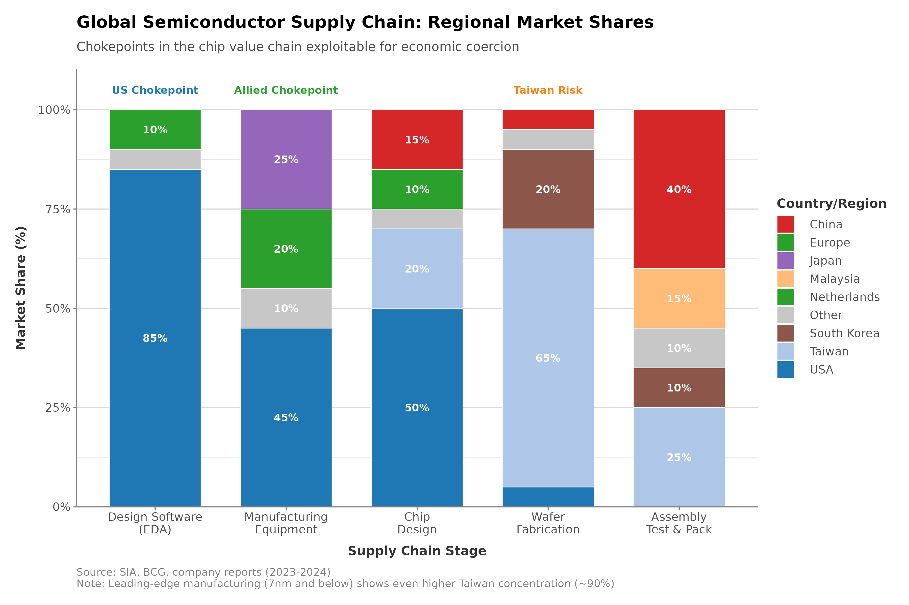
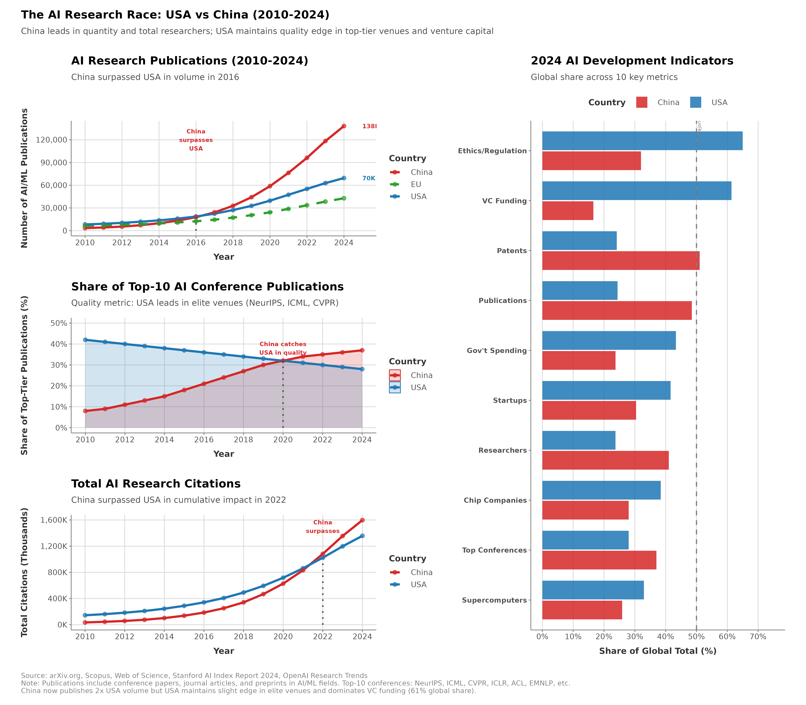
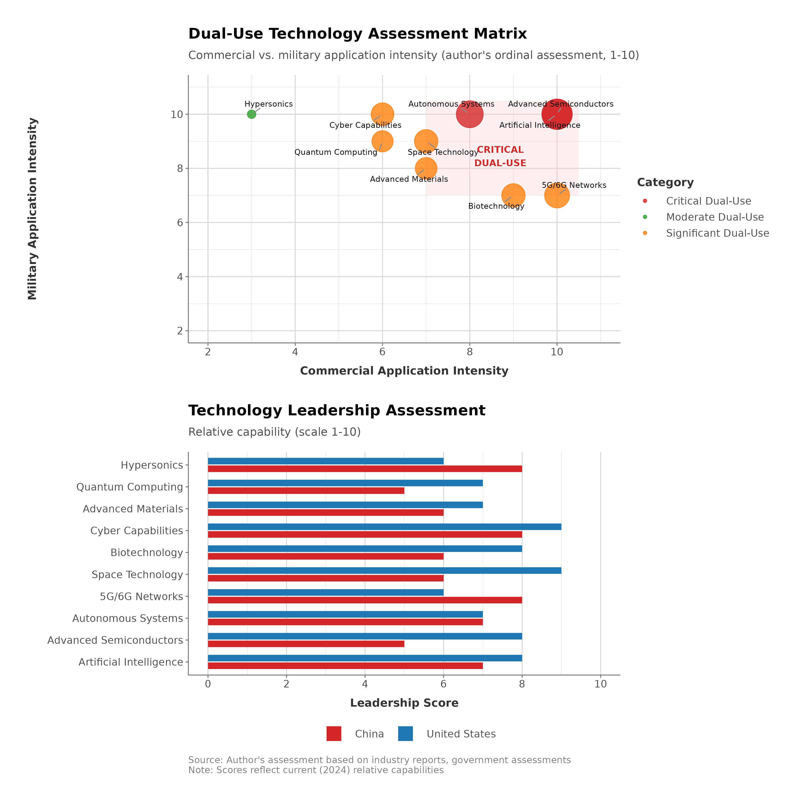
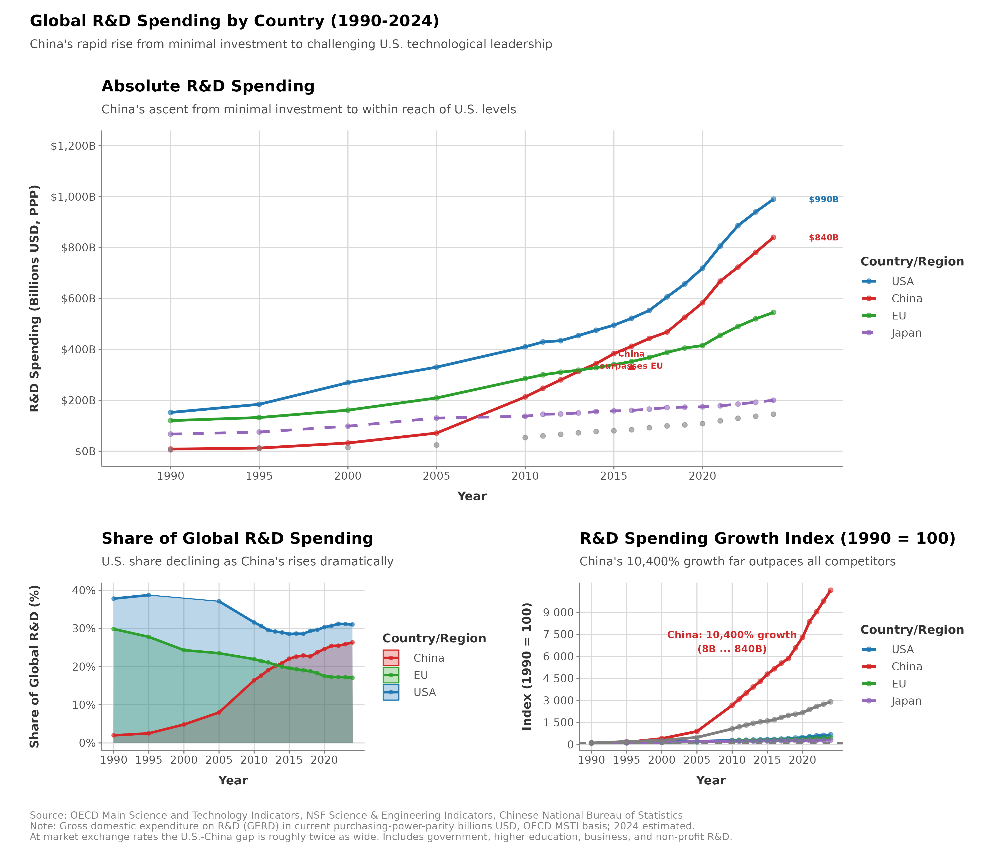
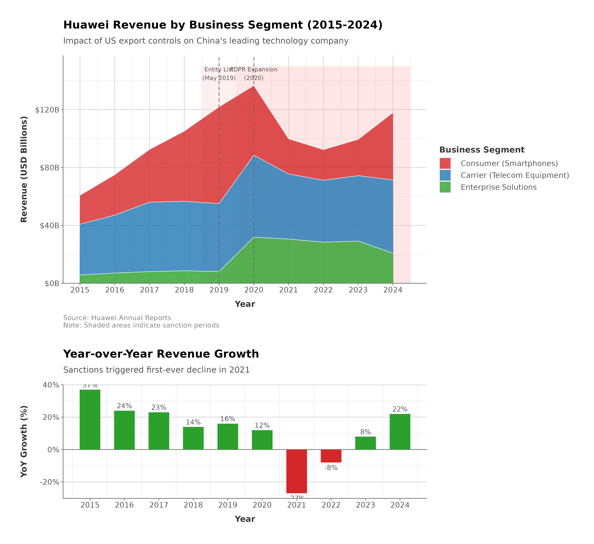

# Technology and Innovation Competition

## Learning Objectives

After this chapter, readers should be able to:

- Explain why semiconductors are the pivotal chokepoint in technology competition, and locate the distinct chokepoints—chip design, EDA software, lithography, leading-edge fabrication, and materials—across a supply chain that no single country controls end to end.
- Reconstruct the October 2022 export controls—advanced-chip performance thresholds, semiconductor-equipment controls, the U.S.-person restriction, and the Foreign Direct Product Rule—and explain the strategic pivot from "running faster" to slowing the competitor.
- Apply the book's five effectiveness criteria and its two margins—the *substitution margin* (how quickly a target can replace what is denied) and the *coalitional margin* (who bears the cost and whether they can change the policy)—to the semiconductor controls and to China's responses.
- Trace how the controls have evolved since 2022—the A800/H800 and H20 cycles, the 2025 revenue-share arrangement, and allied Dutch and Japanese measures—and assess what that evolution reveals about the durability of technology denial.
- Weigh the evidence on Chinese adaptation, from stockpiling and algorithmic efficiency (including DeepSeek) to indigenous accelerators and the Big Fund, against the counterfactual of unrestricted access.
- Compare the U.S. and Chinese innovation systems—R&D spending and its funding composition, universities, and venture capital—and evaluate the emerging-technology frontiers (AI compute, quantum, space, biotechnology) as distinct arenas of coercion.

## Executive Summary

No single object captures the stakes of technology competition better than the extreme ultraviolet (EUV) lithography system used to pattern the most advanced semiconductors. It is among the most complex machines ever manufactured, and exactly one company in the world, the Netherlands' ASML, can build it. Control over a handful of such chokepoints—lithography, chip-design software, leading-edge fabrication—is what gave the United States the option it exercised on October 7, 2022, when the Biden administration announced the most comprehensive technology export controls in a generation: a capability-based ban on advanced semiconductors and chipmaking equipment bound for China, a bar on American personnel supporting Chinese semiconductor development, and, through the Foreign Direct Product Rule, an extraterritorial reach into foreign-made products built with American technology. The United States accepted the loss of billions in commercial revenue to deny China technologies it deemed critical to both economic competitiveness and military superiority—the specific chips, tools, and personnel caught in the net are detailed later in the chapter.

China's response came quickly, though not through official statements. Within weeks, Chinese state media declared a "technology self-reliance" campaign, echoing rhetoric from previous embargoes but with renewed urgency and resources. The state's financial commitment escalated over the following eighteen months, culminating in the May 2024 launch of the third phase of the National Integrated Circuit Industry Investment Fund ("Big Fund III"), capitalized at RMB 344 billion (roughly $47.5 billion)—the largest single tranche since the program began in 2014 (Caixin 2024; Triolo 2024). Huawei, whose advanced chip development had been set back by earlier U.S. restrictions, surprised analysts in August 2023 by releasing the Mate 60 Pro smartphone powered by a 7-nanometer chip produced by Semiconductor Manufacturing International Corporation (SMIC) using older DUV equipment (Allen and Weinstein 2023). The chip was technologically inferior to TSMC's leading-edge 3nm chips and produced with reportedly low yields, but it demonstrated that China could circumvent export controls through indigenous production, however costly and inefficient.

The central paradox is that the United States is trying to constrain a competitor on whose supply chains its own industry depends. Unlike Cold War technology denial, where the Soviet Union operated in a separate ecosystem, this competition occurs within deeply integrated supply chains. American semiconductor firms derive 30-40% of revenue from Chinese customers (SIA 2023). Chinese researchers publish more AI papers than their American counterparts. Huawei, Ericsson, Nokia, and Samsung compete for global telecommunications infrastructure on the basis of geopolitical alignment as much as technical merit. Technology competition imposes costs on the restricting nation even as security concerns override economic logic.

Read through the lens developed in Chapter 1, the episode is a clean illustration of the substitution margin. The controls had bite precisely because the denied inputs—EUV lithography, the most advanced design software, leading-edge process technology—sat behind a wide and slow replacement cost; China could not simply buy them elsewhere. But denial on this scale also supplied the motive and the price signal for indigenous substitution, and the response followed the pattern the factor-scarcity literature would predict: a surge of state capital (the roughly $47 billion Big Fund III), a national "self-reliance" campaign, and, within a year, SMIC's 7-nanometer chip in the Huawei Mate 60 Pro—costly, low-yield, and a generation behind, but produced without the denied equipment. The controls bought time at the cost of accelerating the capability they were meant to withhold. The coalitional margin runs the other way: with American firms earning 30–40% of their revenue in China, the domestic losers from broad restrictions are concentrated and well organized, and much of the subsequent policy history is a contest between those firms' push for exemptions and the security agencies' push for breadth. Whether the controls count as a success turns less on the pain inflicted in any one year than on the race between these two margins—how long the dependence holds against how fast indigenous substitution and domestic lobbying wear the measure down.

Technology defines great power rivalry because technological capability determines both economic competitiveness and military effectiveness. Semiconductors power everything from smartphones to missile guidance systems, artificial intelligence enables autonomous weapons and facial recognition surveillance, and quantum computing threatens the encryption protecting financial transactions and military communications. The nation that leads gains advantages across the military, economic, and political domains, so technology leadership has become a strategic imperative rather than a commercial preference.

The dual-use problem makes clean separation difficult. The same AI chips that train consumer chatbots also train military targeting systems, CRISPR gene editing both treats cancer and could engineer bioweapons, and hypersonic materials enable both civilian spacecraft and nuclear delivery vehicles. Because commercial technology trade inevitably transfers military capabilities, governments face a tradeoff between economic integration that benefits adversaries and restrictions that handicap domestic industries while only delaying adversary development.

Individual technologies matter less than innovation ecosystems. China can purchase AI chips, but building world-class AI requires research universities, venture capital, immigration policies that attract global talent, intellectual property protection, and cultural tolerance for entrepreneurial failure. The United States led technological innovation through these ecosystem advantages rather than through specific policies, and no planned economy has achieved sustained technological leadership. American advantages are nonetheless eroding: Chinese R&D spending now rivals American levels, and Chinese universities produce increasingly competitive research.


**Ecosystem Competition: More Than Just Technology**
Technology competition is ultimately ecosystem competition. Individual technologies can be copied or purchased, but the institutional frameworks that generate sustained innovation—research universities, venture capital, IP protection, immigration policies, entrepreneurial culture—cannot be easily replicated. The fundamental question is whether China's state-directed approach can match America's market-driven ecosystem, or whether authoritarian governance inherently limits innovation capacity. History suggests the latter, but China's scale and determination create genuine uncertainty.


What is at stake is which nation shapes the 21st century. British industrial dominance determined the 19th-century order, and American innovation leadership shaped the 20th. The open question now is whether state-directed development can match market-driven innovation. The answer will determine not only U.S.-China relations but also global technology governance, alliance structures, and whether supply chains fragment along geopolitical lines.

---

## The Semiconductor Battleground

### Why Semiconductors Define Technology Competition

Semiconductors occupy a unique position in technology competition: they are simultaneously ubiquitous (powering virtually all modern electronics), strategically critical (essential for both economic activity and military systems), and characterized by extreme concentration in production (with Taiwan's TSMC holding 90% of advanced chip manufacturing (5nm and below) (TechInsights 2024)). This combination of universality, strategic importance, and geographic concentration makes semiconductors the single most critical chokepoint in contemporary technology competition.

The strategic significance of semiconductors extends across every domain examined in this book. Military systems depend on advanced chips. F-35 fighter jets contain thousands of chips enabling avionics, sensors, weapons targeting, and communications; missile guidance systems require radiation-hardened chips operating in extreme conditions; radar and electronic warfare systems process large data streams using specialized chips; and naval vessels depend on chips for navigation, combat systems, and command networks. The technological sophistication of modern militaries correlates directly with semiconductor capabilities, and a nation lacking access to advanced chips cannot field competitive 21st-century military systems.

Economic competitiveness increasingly relies on semiconductors as well. Data centers processing cloud computing, AI training, and digital services run on cutting-edge chips, including Nvidia's AI accelerators, Intel's Xeon processors, and AMD's EPYC chips. Telecommunications networks depend on networking chips from Broadcom, Marvell, and others. The automotive industry's transformation toward electric and autonomous vehicles requires chips for battery management, sensors (LIDAR, radar, cameras), driver assistance systems, and entertainment. Consumer electronics such as smartphones, laptops, gaming systems, and IoT devices are essentially sophisticated chip delivery mechanisms. The nation or nations controlling semiconductor design and manufacturing hold competitive advantages across virtually every economic sector.

National security vulnerabilities emerge from semiconductor dependencies. A nation relying on foreign chip supplies faces potential cutoffs during crises, whether U.S. military systems depending on Chinese chips during a Taiwan Strait conflict or Chinese telecommunications dependent on American chips during trade war escalation. This dependency creates what Chapter 1 termed "weaponized interdependence": whoever controls chokepoints can restrict access for strategic advantage. The semiconductor supply chain's complexity, with different stages concentrated in different countries, as examined in Chapter 2, means that multiple nations hold potential chokepoints: U.S. design tools (EDA software), Dutch lithography equipment (ASML), Taiwanese fabrication (TSMC), and American and Japanese materials (photoresists, silicon wafers). Each represents a potential vulnerability if geopolitical alignment fractures.

The semiconductor industry also exhibits characteristics that make competition intense and restrictions potent. Technology leadership requires continuous innovation. Under the Moore's Law dynamic in which chip capabilities roughly double every two years, falling behind technologically creates gaps that are difficult to close. A semiconductor manufacturer two generations behind, producing 14nm chips when leaders make 3nm, faces both quantitative disadvantage and qualitative gaps: lower performance, higher power consumption, larger size, and higher costs. These gaps compound, because inferior chips mean inferior end products (slower computers, shorter battery life, less AI capability), which reduce competitiveness and revenues, limit R&D investment, and widen technological gaps further.

Capital intensity creates natural barriers to entry. Building a cutting-edge semiconductor fabrication facility costs $15-20 billion and requires 3-5 years. A single EUV lithography machine costs $150-200 million, and fabs need dozens. Annual R&D spending for leading firms (TSMC, Samsung, Intel) exceeds $15-20 billion each (Miller 2022). Semiconductor leadership therefore cannot be achieved through incremental investment; it requires sustained, large commitments over decades. China's semiconductor investment, while large in absolute terms ($100+ billion across Big Fund I, II, and III) (Fuller 2016; CSIS *China Chip Fund Tracker*, 2023), must compete with private sector investment by Samsung, TSMC, Intel, and others that collectively exceeds this annually. Catching up requires not just matching current investment but exceeding it enough to close gaps while leaders continue advancing.

The supply chain complexity examined in Chapter 2 creates multiple chokepoints across the value chain. The United States dominates chip design (Qualcomm, Nvidia, AMD, Intel, Apple) and, together with Germany's Siemens, the essential design tools: the three leading electronic design automation (EDA) vendors—Synopsys, Cadence, and Siemens EDA—held roughly three-quarters of the global EDA market (about 74% in 2024, with an even higher share of the advanced-node tools that matter most) (Khan, Mann, and Peterson 2021; TrendForce 2024). The Netherlands monopolizes extreme ultraviolet lithography through ASML, the only company globally producing EUV machines essential for sub-7nm chips. Japan dominates critical materials (photoresists from JSR/Tokyo Ohka, silicon wafers from Shin-Etsu/SUMCO) and production equipment (Tokyo Electron). Taiwan controls advanced fabrication through TSMC, and South Korea provides memory chips (Samsung, SK Hynix). China handles much assembly and testing but controls no critical upstream stages. This distributed supply chain means that comprehensive technology denial requires coordination across multiple countries, while any single chokepoint can halt production.

### October 2022 Export Controls: Strategic Logic and Mechanisms

The Biden administration's October 7, 2022 semiconductor export controls represented a sharp escalation in U.S.-China technology competition and a fundamental shift in export control philosophy. Previous controls targeted specific companies (Huawei, SMIC) or specific applications (military, surveillance). The October 2022 rules instead imposed broad, capability-based restrictions: any semiconductor manufacturing equipment enabling production of chips below 14nm, any advanced AI chip with specified computing capabilities, and any American person supporting Chinese semiconductor development faced restrictions. (Chapter 6 details the Export Administration Regulations (EAR), Entity List designations, and ECCN classification system that provide the legal architecture for these controls.) The breadth surprised industry, since the controls extended far beyond military applications to encompass nearly all advanced commercial chip development in China.

The strategic logic behind the controls reflected a shifting U.S. government assessment of Chinese technology development and its security implications. Officials concluded that previous incremental restrictions—Entity List additions targeting specific firms, licenses required for certain sales—were insufficient to prevent Chinese military modernization and potential displacement of American technology leadership. Chinese firms like SMIC, despite Entity List designation, continued advancing (achieving 7nm production demonstrated by Huawei's 2023 chip). Chinese AI development progressed despite limited access to cutting-edge chips, using older but still capable hardware and algorithmic innovations. The U.S. government, facing political pressure to address Chinese technology competition and genuinely concerned about military implications of AI and advanced computing, opted for comprehensive restrictions targeting China's semiconductor ecosystem broadly rather than specific firms.

National Security Advisor Jake Sullivan articulated the strategic shift in a September 2022 speech, moving from maintaining a "relative" advantage (keeping the United States a few years ahead) to establishing "as large a lead as possible" by denying China access to technologies that could close the gap (Sullivan 2022). The earlier approach of staying ahead by innovating faster gave way to staying ahead by slowing the competitor's progress. This reflected a judgment that dual-use technologies transferred for commercial purposes inevitably support military applications, and that allowing Chinese semiconductor self-sufficiency would strengthen a potential adversary across both military and economic domains. Whether this logic succeeds depends on effectiveness across the five criteria introduced in Chapter 1, but the strategic intent was clear: accept commercial costs to prevent Chinese technology development.


**From Running Faster to Slowing the Competitor**
The October 2022 controls represent a departure from decades of U.S. technology policy. The earlier strategy was to maintain leads by out-innovating competitors. The new approach explicitly aims to slow adversary progress through denial, accepting that this will also impose significant costs on American firms. The shift acknowledges that in dual-use technologies, commercial sales inevitably transfer military-relevant capabilities.


The controls employed several complementary mechanisms to restrict access:

**Advanced chip export restrictions** prohibited sales of AI chips exceeding specified performance thresholds to Chinese customers. Nvidia's A100 and H100 chips, dominating AI training and inference markets, immediately fell under restrictions. AMD's MI250 accelerators faced similar bans. These restrictions targeted capability rather than specific companies—any chip meeting performance criteria faced controls. Nvidia attempted to develop "China-compliant" chips (A800, H800) with marginally reduced specifications designed to evade controls while maintaining commercial viability. The Commerce Department responded by tightening specifications in October 2023 updates, closing loopholes and banning the compliant variants. This exchange illustrated both industry resistance to lost revenue and government determination to enforce comprehensive restrictions.

**Semiconductor manufacturing equipment controls** banned sales of equipment capable of producing chips below 14nm to Chinese fabrication facilities. This targeted deep ultraviolet (DUV) lithography tools from ASML (Netherlands), etching and deposition equipment from Lam Research and Applied Materials (United States), and metrology tools from KLA (United States). Previous restrictions had blocked EUV machines (only from ASML) essential for sub-7nm production, but DUV tools could produce 14nm and 7nm chips through multiple patterning—technically challenging but feasible. The October 2022 rules closed this gap, aiming to freeze Chinese semiconductor manufacturing at trailing-edge nodes. ASML faced particular pressure: while its EUV machines were already blocked, its DUV tools (Twinscan NXT) were profitable exports to China. Dutch government implementation of controls faced industry lobbying and political resistance, though ultimately complied following U.S. pressure.


**EUV vs. DUV Lithography: Understanding the Technology Gap**
Extreme Ultraviolet (EUV) lithography uses 13.5nm wavelength light to etch transistor features smaller than viruses, enabling chips at 7nm and below. Deep Ultraviolet (DUV) uses 193nm light and can reach 7nm only through "multi-patterning"—exposing each layer multiple times at enormous cost and complexity. ASML is the sole global manufacturer of EUV machines (each costs $150-200 million). Without EUV, China cannot economically produce cutting-edge chips regardless of how much it invests in other capabilities.


**U.S. person restrictions** prohibited American citizens and permanent residents from supporting Chinese semiconductor development without Commerce Department authorization. This provision surprised industry: American engineers working for Chinese firms (including SMIC, YMTC, Yangtze Memory Technologies) faced immediate job losses or forced resignations. Senior technologists, many ethnic Chinese who had studied in the United States and worked for American firms before returning to China, found their expertise suddenly prohibited. The restrictions targeted human capital transfer, on the premise that equipment alone is insufficient without expertise to operate it effectively. This "brain drain" reversal attempted to halt technology transfer through personnel, though legality faced challenges (restricting Americans' employment based on foreign employer's nationality raises constitutional questions) and effectiveness remains uncertain (non-American engineers could substitute, though with lower expertise).

**Foreign Direct Product Rule (FDPR) extension** expanded U.S. jurisdiction extraterritorially to cover foreign-made products incorporating American technology. The FDPR, previously applied to Huawei specifically, became general policy: any semiconductor manufacturing equipment made anywhere globally using American technology (software, components, technical data) above de minimis thresholds required U.S. export licenses for sales to Chinese semiconductor fabs. This provision asserted that American technology embedded in foreign products grants U.S. government veto power over sales—a controversial claim of jurisdiction that allied governments privately resented but largely accepted given dependence on U.S. semiconductor technology and markets. The FDPR's effectiveness depends on American content in foreign equipment: if non-U.S. suppliers can substitute American components, the rule's leverage diminishes; if American technology proves irreplaceable, the rule grants comprehensive control.


**Extraterritorial Jurisdiction: The Long Arm of American Technology**
The Foreign Direct Product Rule is an extraordinary assertion of American legal authority over products manufactured entirely outside the United States. If a Dutch lithography machine contains American-origin software or components, Washington claims the right to veto its sale. This extraterritorial reach works only because American technology is often irreplaceable, but it generates resentment among allies and creates incentives for developing non-American alternatives.


### Allied Coordination: Success and Tensions

U.S. export controls on semiconductors cannot succeed unilaterally, because equipment chokepoints reside in the Netherlands (ASML lithography), Japan (Tokyo Electron equipment, JSR photoresists), and South Korea (Samsung and SK Hynix memory fabs in China). Allied cooperation is essential but involves persistent tensions between security imperatives and commercial interests (Chapter 6 examines multilateral coordination dynamics in detail).

Extended negotiations produced a January 2023 trilateral understanding among the United States, Japan, and the Netherlands, which the two allies then translated into national measures over the following months: the Netherlands announced expanded controls on advanced DUV lithography in March 2023 and brought its licensing regime into force in September 2023, while Japan announced controls on 23 categories of semiconductor manufacturing equipment in March 2023 and implemented them in July 2023. South Korea, home to Samsung and SK Hynix fabs inside China, negotiated arrangements allowing continued support for those operations. In each case, allied controls reflected compromise: cooperating sufficiently to maintain the U.S. alliance while limiting economic damage. Restrictions proved narrower than Washington desired—targeting only the most advanced equipment while permitting sales of mature-node tools.

The fundamental tension is that **allied governments share U.S. concerns about Chinese military modernization but prioritize commercial interests more highly and resist American extraterritorial jurisdiction**. Allied perspectives sometimes view U.S. restrictions as partly motivated by commercial competitiveness rather than purely security. Sustaining coordination requires balancing these pressures—a balance that shifts with political leadership, economic conditions, and assessment of whether controls are actually working.

### Chinese Responses: Adaptation, Circumvention, and Indigenous Development

China's responses to semiconductor export controls operate across multiple dimensions: immediate adaptations to restrictions, attempts to circumvent controls, long-term indigenous development, and potential retaliation. **Immediate adaptations** involve working within constraints. Chinese AI developers facing restrictions on Nvidia A100/H100 chips shifted to alternative approaches: using older but still capable chips (Nvidia V100, available before restrictions), clustering many weaker chips to approximate fewer powerful chips (less efficient but functional), optimizing algorithms to reduce computing requirements (achieving similar AI performance with less hardware), and purchasing restricted chips through third-country intermediaries or smuggling (explicitly prohibited but difficult to prevent entirely). Baidu, Alibaba, Tencent, and other Chinese tech giants stockpiled AI chips before restrictions took effect, providing buffer capacity for near-term development. These adaptations mean that restrictions slow but don't halt Chinese AI progress—developers adjust to constrained resources rather than abandoning efforts.

**Circumvention attempts** exploit loopholes and enforcement limitations. Chinese shell companies established in third countries (Singapore, Malaysia, Taiwan) purchase restricted equipment and chips, claiming end-use in permitted locations before diverting to China. Equipment manufacturers' foreign subsidiaries sell to Chinese customers with technical modifications claimed to fall outside control specifications. Individual smugglers purchase chips in small quantities (below regulatory thresholds) and aggregate shipments. U.S. and allied customs enforcement struggles with verification—distinguishing permitted sales (Chinese consumer electronics manufacturing using mature-node chips) from prohibited applications (advanced semiconductor development) requires technical expertise and investigation resources that overwhelm enforcement agencies. Commerce Department investigations and prosecutions send signals but cannot halt all circumvention.

**Indigenous development** represents China's long-term strategy and the ultimate determinant of restriction effectiveness. Chinese government, recognizing that dependency on foreign technology creates vulnerability, has poured resources into domestic semiconductor capabilities across the value chain:

**Semiconductor fabrication** investments aim to build SMIC and other Chinese foundries capable of producing advanced chips without foreign equipment. SMIC's achievement of 7nm production demonstrated progress: using older DUV tools and advanced multiple patterning techniques (industry estimates suggest 5+ masks per layer, far more complex than TSMC's EUV process), SMIC produced Huawei's Kirin 9000s chip powering the Mate 60 Pro smartphone released August 2023. This surprised American officials who had believed Chinese firms lacked the technical capacity for sub-10nm production without EUV machines. However, the achievement comes with caveats: yields have been variously estimated at 15-40% by industry analysts (though these estimates remain contested and lack authoritative sourcing; TechInsights 2023; SemiAnalysis 2023), meaning high costs and limited production volumes compared to TSMC's 90%+ yields; process instability requiring extensive trial-and-error; technological ceiling around 5-7nm without EUV (further miniaturization requires extreme ultraviolet lithography China cannot access); and performance gaps versus TSMC's 3nm chips (Huawei's chip less power-efficient and lower-performing than Apple's latest processors using TSMC 3nm).


**Huawei Mate 60 Pro: Proof of Concept Under Pressure**
The August 2023 release of Huawei's Mate 60 Pro smartphone, powered by a domestically-produced 7nm chip, demonstrated that export controls slow but do not halt Chinese technological progress. SMIC achieved this through brute-force multi-patterning using older equipment—technically impressive but economically unsustainable at scale. The achievement showed Chinese determination and capability while also revealing the limits: yields were low, costs were high, and further miniaturization without EUV appears impossible.


**Equipment development** targets building Chinese alternatives to ASML, Applied Materials, Lam Research, and Tokyo Electron. Shanghai Micro Electronics Equipment (SMEE) is developing DUV lithography tools, but current capabilities lag ASML by 10-15 years (SMEE's best machines comparable to ASML's tools from 2010) (Khan, Mann, and Peterson 2021). AMEC, Naura, and other Chinese equipment firms produce etching, deposition, and metrology tools, but achieve specifications suitable for 14nm+ nodes rather than cutting-edge <7nm. Breakthroughs in EUV lithography—requiring extraordinary precision in optical systems, high-power laser technology, and ultra-clean manufacturing—appear beyond Chinese capabilities for the foreseeable future despite substantial R&D investment. Equipment development is the hardest component: while semiconductor design can potentially achieve innovation through talent and software, equipment manufacturing requires decades of accumulated expertise in precision engineering, materials science, and production processes difficult to replicate quickly.

**Materials and chemicals** development addresses dependencies on Japanese photoresists, American specialty gases, and other inputs. Chinese firms have achieved progress in some materials (achieving acceptable photoresist quality for mature nodes), but cutting-edge materials remain dependent on Japanese suppliers. This dependence creates additional chokepoints beyond equipment. Even if China built indigenous fabrication equipment, reliance on foreign materials would leave a vulnerability.

**Design tools** represent another critical gap. Synopsys, Cadence, and Siemens EDA (formerly Mentor Graphics, acquired by Germany's Siemens in 2017) together hold roughly three-quarters of the Electronic Design Automation software market—and a still larger share of the advanced-node tools essential for designing complex chips (Khan, Mann, and Peterson 2021; TrendForce 2024). U.S. restrictions prohibit sales of EDA tool updates to Chinese firms, freezing their capabilities at older software versions. Chinese EDA companies exist but produce tools suitable for simple chips, not cutting-edge designs. Building world-class EDA software requires decades of development—accumulated libraries, verification tools, and optimization algorithms cannot be replicated quickly. This dependency means that even if China achieved fabrication independence, design tool limitations would constrain capabilities.

**Talent development** involves training engineers, physicists, chemists, and technicians with expertise in semiconductor development. China produces more STEM graduates than any country globally and has repatriated many ethnic Chinese engineers who studied and worked abroad. However, leading-edge semiconductor development requires not just quantity but quality: tacit knowledge from operating cutting-edge fabs, experience troubleshooting complex manufacturing processes, and creative problem-solving for unprecedented challenges. U.S. restrictions on American personnel supporting Chinese semiconductor work aim to cut off this expertise transfer, though non-American engineers (from Taiwan, South Korea, Europe) can substitute with varying effectiveness.

### Effectiveness Assessment: Five Criteria Analysis

Measured against the five effectiveness criteria from Chapter 1, the controls return a mixed verdict that this chapter's closing case study develops in full: moderate target compliance; capability degradation that is high in the short term but uncertain over the long term, with Chinese fabrication perhaps 3-5 years behind TSMC and Samsung and no clear path to close the gap without the restricted equipment (Khan, Mann, and Peterson 2021); very high cost imposition; only moderately assured sustainability, which hinges on allied cooperation; and high collateral damage. That last cost falls hardest on the restrictor's own firms—American equipment and chip makers lose tens of billions in annual Chinese revenue, and Nvidia's forgone China AI-chip sales alone have been put at $7-10 billion a year, consistent with its disclosure that China had accounted for roughly a fifth of its data-center revenue before the controls (Nvidia FY2024 10-K; Reuters 2023). The case study at the end of the chapter works through each criterion in turn.

Figure 4.1 traces where value and capability sit at each stage of the chain. The asymmetry it shows is the reason export controls at a single stage can be so consequential: no region is self-sufficient across the sequence, and the stages where concentration is highest are precisely those where the United States and its partners hold the leverage.

<figure class="book-figure">
  
  <figcaption>Figure 4.1: Regional market shares across the stages of the semiconductor supply chain, from design through fabrication, assembly, and equipment.</figcaption>
</figure>

### Strategic Implications: The Semiconductor Decoupling Dynamic

Semiconductor export controls have initiated a decoupling process with profound strategic implications extending far beyond chips themselves. This decoupling creates several dynamics:

**Technology ecosystem fragmentation:** Global semiconductor supply chains are splitting along geopolitical lines. Chinese firms increasingly source equipment, materials, and services from Chinese or non-aligned suppliers, building parallel but inferior ecosystem. Western firms consolidate supply chains among allies (U.S.-Japan-Netherlands-South Korea-Taiwan), reducing China exposure. This fragmentation creates inefficiencies (duplicated R&D, smaller economies of scale) but increases resilience (reduced mutual vulnerability).

**Allied coordination requirements:** Effective semiconductor restrictions require unprecedented allied cooperation on export controls. This cooperation extends beyond semiconductors to other critical technologies (quantum, AI, biotech), creating technology alliance structures paralleling military alliances. The U.S.-Japan-Netherlands semiconductor equipment coordination may presage broader "Tech 10" or similar groupings coordinating technology policies. However, maintaining cooperation faces challenges from diverging commercial interests and political changes.

**Chinese determination for self-sufficiency:** Export controls have convinced Chinese leadership that dependency on Western technology creates unacceptable vulnerability. This drives enormous investment in indigenous development regardless of economic efficiency. China's semiconductor self-sufficiency pursuit may sacrifice economic growth for strategic autonomy—a calculation Western market economies rarely make. The question is whether China's state-directed approach can achieve technological leadership or whether innovation ecosystems favoring market-driven entrepreneurship retain advantages.

**Race to technological leadership:** Semiconductor competition catalyzes broader technology race. Both the United States and China are massively increasing R&D spending, industrial policy support, and talent development across semiconductors, AI, quantum computing, and emerging technologies. This spending acceleration could drive innovation beneficial for humanity (medical advances, climate technologies, scientific breakthroughs) or waste resources on duplicated efforts and strategic competition. Historical parallels (Space Race during Cold War drove innovation but at enormous cost) suggest both outcomes are possible.

**Military-technological escalation risks:** As civilian technology gaps widen between China and the West, Chinese military modernization may plateau, potentially constraining Chinese regional ambitions. Alternatively, constraints could motivate Chinese military investment in asymmetric technologies (hypersonics, AI-powered autonomous systems, cyber capabilities) that don't require cutting-edge semiconductors. U.S. military advantages depend on restricting Chinese chip access and on sustaining American innovation, a challenge requiring continued R&D investment, immigration enabling talent acquisition, and education systems producing engineers.

Semiconductors thus sit at the center of U.S.-China strategic competition, combining economic stakes (hundreds of billions in commerce), security imperatives (military modernization dependencies), and long-term competitiveness (technological leadership determining great power status). How this competition evolves, including whether restrictions successfully constrain Chinese capabilities, whether Chinese indigenous development succeeds, whether allied coordination sustains, and whether collateral damage proves acceptable, will shape the 21st-century international order.

---

## Artificial Intelligence and Compute - The New Strategic Resource

### AI as Dual-Use Technology: From Language Models to Weapons Systems

Artificial intelligence has emerged as the defining technology of the 21st century, with applications spanning from consumer services (ChatGPT, image generation, recommendation algorithms) to military systems (autonomous weapons, target recognition, intelligence analysis). This dual-use character—where the same technology enables both beneficial civilian applications and potentially destabilizing military capabilities—creates profound challenges for export controls and technology competition.

Modern AI, particularly large language models and deep learning systems, depends critically on **compute**—massive computational power for training and running models. Training GPT-4, Claude, or comparable frontier models requires thousands of specialized AI accelerator chips running for months, consuming tens of millions of dollars in electricity and computing costs. If oil was the strategic resource of the 20th century, compute may be the strategic resource of the 21st. Access to advanced AI chips determines which nations, companies, and research institutions can develop cutting-edge AI. Unlike previous technologies where expertise and algorithms dominated, contemporary AI transforms compute into a bottleneck—those controlling AI chip supply can influence global AI development trajectories.


**The Compute Bottleneck**
The economics of frontier AI concentrate capability in very few hands: training a leading model requires thousands of specialized chips running for months at costs exceeding $100 million, a bill only a handful of institutions worldwide can pay. That concentration is itself the policy lever. Because advanced accelerators are so scarce and so traceable, whoever controls their supply can shape who gets to build frontier systems—which is precisely why export controls fixate on chips rather than on the freely circulating algorithms that run on them.


**Military AI applications** demonstrate why governments treat AI as strategic technology requiring restriction. Autonomous weapons systems—drones that identify and engage targets without human intervention—depend on AI vision systems and decision-making algorithms trained on vast datasets using powerful chips. China has publicly showcased drone swarms capable of coordinated action, reportedly using AI algorithms developed by Chinese tech firms. Target recognition systems enabling missiles to distinguish military from civilian targets, evade countermeasures, and adapt to battlefield conditions require AI trained on extensive imagery and sensor data. Intelligence analysis leveraging AI to process satellite imagery, communications intercepts, and open-source data enables militaries to identify patterns, predict adversary actions, and optimize resource allocation. Cyber operations increasingly employ AI to identify vulnerabilities, craft phishing campaigns, and automate intrusions at scale beyond human operators' capacity.

The U.S. military's Project Maven, initiated in 2017, exemplifies military AI adoption: using machine learning to analyze drone footage (Shane and Wakabayashi 2018), identifying objects and patterns faster and more accurately than human analysts. The project sparked controversy when Google employees protested company participation, ultimately leading Google to withdraw—illustrating tensions between commercial AI development and military applications. However, other firms (Palantir, Anduril, Shield AI, and increasingly Microsoft, Amazon, and Oracle) embrace defense AI contracts, recognizing strategic importance and commercial opportunities. China faces no similar corporate resistance: under its civil-military fusion doctrine—examined in this chapter's Chinese Perspective box—firms like Baidu, Alibaba, Tencent, and SenseTime actively collaborate with the People's Liberation Army on AI systems.

**Surveillance and social control** applications demonstrate AI's political implications. China's surveillance state leverages AI facial recognition (SenseTime, Megvii, Hikvision systems) to monitor populations, track dissidents, and enforce social control in Xinjiang and beyond (Mozur 2019). These systems depend on AI chips for real-time processing of millions of video streams, matching faces against databases, and identifying "suspicious" behaviors. Western governments condemn such applications while developing their own surveillance AI (for border control, counterterrorism, and law enforcement), creating hypocrisies and dilemmas about AI governance. Export controls on AI chips partly aim to prevent empowering authoritarian surveillance, though effectiveness faces limitations: older chips (A100's predecessor V100) retain substantial surveillance capabilities, and algorithms continue improving efficiency even with constrained hardware.

**Economic and scientific applications** explain why AI restrictions face commercial resistance and potential long-term costs. AI powers drug discovery (predicting molecular interactions, identifying potential treatments), climate modeling (simulating atmospheric dynamics with unprecedented resolution), materials science (discovering new compounds for batteries, catalysts, semiconductors), and financial markets (algorithmic trading, risk assessment, fraud detection). Restricting AI chip exports to China means cutting Chinese researchers off from frontier AI capabilities—potentially slowing scientific collaboration and reducing global innovation even while protecting American leads. American pharmaceutical companies collaborating with Chinese research institutions face disruptions. Climate research requiring Chinese participation (China operates major climate models and represents critical data source) encounters obstacles. These costs don't disappear simply because they serve long-term strategic interests—they represent genuine tradeoffs requiring justification.

### The October 2022 AI Chip Restrictions: Logic and Implementation

AI chip restrictions announced alongside the semiconductor controls (the October 7, 2022 package described above) targeted Chinese access to the computing power required for frontier AI development. The logic followed directly from the dependence on compute: if training cutting-edge AI models requires thousands of high-performance chips, restricting access to those chips constrains Chinese AI capabilities and preserves American advantages in both military and commercial AI applications.

**Specific restrictions** focused on chip capabilities rather than applications. The October 2022 rules prohibited exports to China of chips exceeding specified thresholds of computing performance and chip-to-chip interconnect bandwidth:

- **Processing-performance threshold:** a processing performance on the order of 4,800 tera-operations per second (TOPS)
- **Interconnect bandwidth threshold:** an aggregate bidirectional transfer rate of 600 gigabytes per second (GB/s) or more

These parameters (codified as export classification 3A090) captured Nvidia's flagship AI accelerators. The A100 (released 2020) pairs 600 GB/s of NVLink interconnect bandwidth with 312 teraflops of dense FP16 tensor performance (624 teraflops with sparsity), while the H100 (released 2022) exceeds it on both metrics. AMD's MI250 accelerators faced similar restrictions. The interconnect parameter proved the operative constraint for the A100: Nvidia's China-market A800 preserved the A100's compute but cut NVLink to 400 GB/s to fall just below the 600 GB/s threshold, as discussed next. The thresholds aimed to prohibit chips optimal for large-scale AI training while potentially permitting less capable chips for inference (running trained models) and other applications.

Nvidia's response demonstrated commercial creativity in circumventing restrictions while technically complying. Within weeks, Nvidia announced "China-compliant" chips: the A800 (modified A100) and H800 (modified H100) with interconnect bandwidth reduced to 400 GB/s—just below the 600 GB/s threshold—while maintaining computing performance. These chips sacrificed some efficiency in distributed training (where multiple chips must exchange data rapidly) but retained substantial capabilities for AI development. Nvidia could legally export these variants, preserving billions in Chinese revenue while ostensibly respecting control requirements.

The Commerce Department's October 2023 update closed these loopholes, revising specifications to ban the compliant variants. New rules set lower thresholds and employed "total processing performance" metrics incorporating both compute density and interconnect bandwidth, preventing specification gaming. Nvidia's ability to sell its highest-end AI chips to China was curtailed, forcing Chinese customers to either stockpile older chips (V100, T4), use clustered weaker chips with performance penalties, or develop indigenous alternatives (discussed below under Chinese AI Development).

The cat-and-mouse did not end there, and its next round produced an entirely new model of export control. To keep serving the Chinese market within the October 2023 thresholds, Nvidia designed the H20—a further cut-down Hopper part—which became its principal China AI chip through 2024 and generated an estimated $12–15 billion in sales that year. On April 9, 2025, the Trump administration reversed course and told Nvidia that H20 exports to China would require a license, effectively halting them; Nvidia took a charge of roughly $4.5 billion on stranded H20 inventory and purchase commitments (Nvidia FY2026 Form 10-Q). Then, only three months later, the administration reversed again: in July 2025 it signaled that H20 licenses would be granted, and it paired the reversal with an unprecedented arrangement under which Nvidia (and AMD, for its MI308) would remit 15% of their China AI-chip revenue to the U.S. government in exchange for those licenses (CNN Business 2025). Whatever its legal durability—as of late 2025 the 15% remittance had not been codified in regulation—the episode marked a departure from binary allow/deny licensing toward treating export access as a revenue-generating, negotiable privilege, a template with obvious appeal to a transactional administration and obvious hazards for the predictability on which export-control regimes depend.

**Allied coordination** for AI chip restrictions faces less complexity than semiconductor equipment controls because AI chips primarily originate from U.S. companies (Nvidia, AMD, Intel). However, ensuring Chinese customers don't obtain chips through third-country intermediaries requires export compliance and customs enforcement. Reports of Nvidia chips reaching China through Singapore and Hong Kong shell companies, third-country procurement agents, and individual smuggling highlight enforcement challenges. The United States pressured Singapore and Hong Kong to tighten export controls and investigate suspicious transactions, with mixed success. Systematic circumvention proves difficult at scale (Chinese AI firms need thousands or tens of thousands of chips, not ones or tens smuggled individually), but marginal circumvention continues.

### AI Research Leadership: Publications, Patents, and Talent

Figure 4.2 assembles the standard indicators of AI capability, and the first thing it shows is that they disagree with one another. Publication counts, patent filings, private investment, and top-tier talent each produce a different ranking, which is why any confident claim about who is 'ahead' in artificial intelligence is usually a claim about which indicator the speaker has chosen.

<figure class="book-figure">
  
  <figcaption>Figure 4.2: AI research output and impact by country, showing publications, citations, and talent distribution.</figcaption>
</figure>

AI competition extends beyond chips to research capabilities: which countries publish cutting-edge research, file foundational patents, attract and develop top talent, and translate research into commercial products and military applications. Metrics reveal complex dynamics where the United States and China lead in different dimensions while Europe falls behind.

**Research publications** show China overtaking the United States in quantity while competing in quality. According to Stanford's AI Index and analysis of Scopus publication databases, China publishes more AI/ML research papers annually than the United States (approximately 40-45% of global AI publications versus 10-15% for the U.S.). However, citation metrics—measuring research influence—show American papers cited more frequently on average, suggesting higher impact. The most-cited individual papers and breakthrough publications disproportionately originate from American institutions (Stanford, MIT, Berkeley, OpenAI, Google Research, Microsoft Research) rather than Chinese universities and firms. This pattern suggests Chinese research emphasizes quantity and incremental advances while American research produces more foundational breakthroughs—though China's quality is improving rapidly, with Tsinghua, Peking University, and firms like Baidu and Alibaba publishing increasingly influential work.

**Patent filings** in AI-related technologies show similar patterns. WIPO data indicates Chinese entities file more AI patents than American counterparts, particularly in applications (computer vision, natural language processing, recommendation systems). American firms file more foundational algorithm and architecture patents. Patent quality assessments (citations, legal scope, commercial value) generally favor American patents, though measuring quality proves methodologically challenging and controversial. Patent filings also reveal different focuses: Chinese patents emphasize applications (surveillance, e-commerce, social media), American patents cover broader algorithmic innovations and AI chips/hardware.

**Talent development and circulation** represent critical dimensions where the United States has historically held advantages but faces erosion. American universities dominate global AI education and research: Stanford, MIT, Carnegie Mellon, Berkeley, and others train both American and international students (including many Chinese) who disproportionately contribute to AI advances. Immigration historically allowed the United States to retain top foreign talent—Chinese, Indian, European researchers staying in America after PhDs to join Google, Microsoft, OpenAI, or start companies. This "brain gain" amplified American AI capabilities beyond domestic population proportions.

Recent dynamics threaten American advantages. Increasingly, Chinese AI researchers return to China after U.S. education, attracted by generous compensation, research funding, and opportunities to lead large teams. Alibaba, Baidu, Tencent, ByteDance, and other firms offer competitive salaries and access to massive datasets (hundreds of millions of Chinese users) unavailable to Western researchers. Chinese government funding for AI research rivals or exceeds American levels (though measuring precisely proves difficult due to definitional differences and reporting opacity). Geopolitical tensions, visa restrictions following Trump administration policies, and COVID-19 pandemic disruptions reduced Chinese student numbers in U.S. universities—potentially cutting future American access to Chinese AI talent.

The United States also develops domestic talent, though shortfalls exist. Computer science enrollments at American universities have surged, but demand for AI expertise exceeds supply, driving fierce corporate competition for talent (six-figure salaries for new PhDs, million-dollar compensation for experienced researchers). Many top American students pursue lucrative industry careers rather than academic research, potentially reducing long-term foundational research. Educational outcomes show the United States producing fewer STEM graduates per capita than China, South Korea, and several European nations, though American education quality at top institutions remains unmatched globally.

**Transfer between research and application** represents another dimension where American ecosystem advantages manifest. Silicon Valley's venture capital, startup culture, and major tech firms excel at commercializing AI research: OpenAI transformed GPT research into ChatGPT commercial product within months, Google commercialized transformer architectures into search and advertising improvements, and countless startups leverage academic research for specialized applications. China's AI commercialization proceeds rapidly (TikTok's recommendation algorithms, Alibaba's logistics optimization, SenseTime's surveillance systems), but ecosystem differences create advantages for American translation of research to products, particularly in global markets where Chinese firms face regulatory and political obstacles (TikTok bans, Huawei restrictions, data localization requirements limiting Chinese cloud services).

### Chinese AI Development: Constrained but Not Halted

U.S. restrictions on AI chips aim to constrain Chinese AI development, yet Chinese capabilities continue advancing through adaptations, stockpiling, algorithmic innovations, and indigenous chip development. Assessing whether restrictions achieve meaningful delays or merely inconvenience Chinese developers requires examining specific Chinese responses and their effectiveness.

**Stockpiling and hoarding** before and immediately after October 2022 restrictions allowed Chinese firms to accumulate substantial AI chip inventories. Alibaba, Tencent, Baidu, ByteDance, and others reportedly purchased tens of thousands of A100 and H100 chips before restrictions took effect, spending billions to secure near-term supply. These stockpiles enable continued frontier AI development for 2-3 years, during which time Chinese firms can train large models, deploy AI systems, and potentially develop indigenous alternatives. Stockpiling success demonstrates export control challenges: restrictions announced with insufficient lead time (industry knew restrictions were coming months before implementation) allow targets to adapt.

**Algorithmic innovations** reduce compute requirements, allowing Chinese researchers to achieve competitive AI performance with constrained hardware. Techniques include:

- **Model compression and quantization:** Reducing model precision from 32-bit to 8-bit or even 4-bit operations dramatically cuts computing requirements with minimal accuracy loss for many applications.
- **Efficient architectures:** Developing models requiring fewer parameters and operations to achieve equivalent performance—e.g., China's GLM-130B model claims performance comparable to OpenAI's GPT-3 (175 billion parameters) while using only 130 billion parameters.
- **Training optimizations:** Techniques like mixed-precision training, gradient checkpointing, and efficient parallelization reduce chip requirements for given model sizes.
- **Specialized models:** Rather than pursuing general-purpose foundation models like GPT-4, developing specialized models for specific applications (language translation, image recognition, recommendation systems) that require less compute.

These innovations mean Chinese AI development continues even with chip constraints, though potentially falling behind American frontier models that leverage unrestricted access to thousands of H100 chips. Chinese researchers publish extensively on efficient AI, potentially sharing advances globally and benefiting non-Chinese researchers, so the restrictions can motivate innovation that diffuses beyond the target.

**Indigenous AI chip development** pursues Chinese alternatives to Nvidia and AMD accelerators, and it has advanced faster than the 2022 restrictions anticipated. Huawei's original Ascend 910 (2019), fabricated by TSMC, was roughly comparable to Nvidia's V100. Its SMIC-fabricated successors moved the frontier: the Ascend 910B (2023–24, delivering on the order of 320 teraflops of FP16 performance) and the dual-die 910C (shipping from late 2024), both built on SMIC's 7nm-class process, which industry analysts estimate reaches roughly 60–80% of an Nvidia H100's per-card throughput—albeit at markedly lower yields, higher power draw, and dependence on scarce high-bandwidth memory (TechInsights 2024). Cambricon, a Chinese AI chip startup, produces training and inference accelerators used by Chinese firms and government agencies. Through 2025 Beijing leaned hard into this substitution, steering state-linked cloud and data-center operators toward domestic accelerators; Huawei reportedly targeted on the order of 700,000 Ascend 910-series units for the year. These chips still trail Nvidia's frontier parts and remain hostage to constrained domestic fabrication, but they increasingly provide a genuine—if inferior and costlier—substitute for embargoed Nvidia hardware, reducing dependence and providing fallback capacity.

**Cloud computing workarounds** allow Chinese users to access foreign AI computing resources indirectly. Chinese researchers and firms can rent AI compute from foreign cloud providers (Amazon Web Services, Google Cloud, Microsoft Azure, Oracle Cloud) operating in third countries (Singapore, Japan, Europe), ostensibly for permitted purposes while potentially using capacity for restricted AI development. Cloud providers face export compliance obligations and implement customer screening, but distinguishing permitted from prohibited AI development proves challenging. Unless the United States extends restrictions to prohibit cloud AI services to Chinese customers—an escalation with major commercial costs and enforcement complexity—cloud access provides partial circumvention route.

**Chinese AI development trajectories** remain robust despite restrictions, though likely slowed relative to counterfactual without controls. Chinese firms continue releasing competitive AI products: Baidu's ERNIE models (competitor to ChatGPT), Alibaba's Tongyi Qianwen language model, SenseTime's multimodal AI systems, and TikTok's recommendation algorithms (arguably world-leading in engagement optimization). Chinese military AI development proceeds across autonomous systems, intelligence analysis, and cyber applications. Complete Chinese AI development stagnation proves implausible; whether the United States maintains meaningful leads (2-3 years, 5 years, or permanent) remains uncertain and depends on sustained American innovation, effective enforcement of restrictions, and Chinese indigenous capabilities.

### The DeepSeek Shock (January 2025)

If the algorithmic-efficiency argument needed a defining test, it arrived in January 2025. DeepSeek, a Hangzhou lab spun out of the quantitative hedge fund High-Flyer, released its V3 model in December 2024 and its R1 reasoning model on January 20, 2025—both broadly competitive with the leading American frontier models on standard benchmarks, both open-weight, and both trained not on H100s but on export-compliant H800 chips (the throttled-interconnect Hopper variant Nvidia had sold into China before the October 2023 tightening). DeepSeek reported that V3's final training run consumed roughly 2.79 million H800 GPU-hours—about $5.6 million at a rental-equivalent $2 per GPU-hour—and a later Nature paper put the incremental cost of the R1 reasoning stage at only about $294,000. The claimed figures were one to two orders of magnitude below the sums American labs were understood to be spending, and they landed as a genuine shock. On January 27, 2025, Nvidia fell roughly 17%, shedding about $589 billion in market value—the largest single-day loss in U.S. market history—amid a broad rout in AI and power stocks (CNN Business 2025; SemiAnalysis 2025).

Read through this chapter's framework, DeepSeek is a near-perfect illustration of the substitution margin at work: denied the most capable hardware, Chinese developers substituted human capital and algorithmic ingenuity for raw compute, leaning on a mixture-of-experts architecture, multi-head latent attention, and FP8 training to wring far more performance out of far less silicon—and then, in the open-weight tradition, published enough that the gains diffused to everyone, target and restrictor alike. It vindicated the factor-scarcity prediction the chapter's opening made: broad denial supplies the motive and the price signal for exactly the kind of efficiency innovation that erodes the value of the denied input.

What DeepSeek does *not* settle is whether compute controls "failed," and here the two competing arguments matter. The training-efficiency argument holds that if frontier-class models can be trained for single-digit millions, the compute chokepoint is largely illusory. The inference-and-scale argument holds the opposite: the reported $5.6 million covers one final training run, not the accumulated cost of prior research, failed runs, salaries, or the hardware itself—SemiAnalysis estimated DeepSeek's total GPU fleet at billions of dollars—and, more fundamentally, that cheaper models raise rather than lower aggregate compute demand (a Jevons dynamic), because they are then served to hundreds of millions of users and, in the case of reasoning models like R1, spend ever more compute at *inference* time. On this reading, controls bite hardest not on any single clever training run but on the scale at which a country can *deploy* AI and train the *next* generation. The most defensible conclusion is narrower than either camp's headline: DeepSeek proved that export controls cannot freeze Chinese AI progress and can actively accelerate efficiency, while leaving intact the case that sustained compute denial still constrains China's ceiling—the ability to field the largest training clusters and serve frontier models at national scale. It is, in short, the substitution margin and the coalitional margin racing each other in real time, exactly as the chapter's opening predicted.

### Compute as Strategic Resource: Implications and Alternatives

The centralization of AI capability in advanced compute resources creates a new form of strategic dependency. Nations lacking indigenous AI chip production or access to foreign chips face constraints on AI development, potentially falling behind economically and militarily. This dependency creates several dynamics:

**Compute inequalities** between nations and institutions shape AI development globally. Only a handful of institutions can afford frontier AI model training: OpenAI (Microsoft-backed), Google DeepMind, Meta, Anthropic (Amazon-backed), and a few others with access to tens of thousands of H100-equivalent chips and tens of millions in compute budgets. Most nations lack resources for comparable efforts, leaving AI capabilities dominated by American firms and potentially China. This concentration raises governance questions about whether AI development this consequential should occur in private firms pursuing commercial objectives rather than under democratic oversight. Concerns about AI risks (from misinformation to potential existential threats) intersect with debates about compute access and control.

**Cloud concentration** amplifies dependencies. Amazon Web Services, Microsoft Azure, and Google Cloud dominate global cloud computing, including AI-specific services providing access to GPU clusters, pre-trained models, and development tools. Firms and researchers globally depend on these platforms for AI development—creating surveillance opportunities (cloud providers can observe model training and usage patterns), control mechanisms (providers can restrict access or raise prices), and leverage for American foreign policy (government can pressure providers to cut off disfavored customers). China's pursuit of indigenous cloud infrastructure (Alibaba Cloud, Tencent Cloud, Huawei Cloud) partly reflects determination to escape this dependency, creating parallel ecosystems.

**Energy consumption** for AI training and inference creates environmental costs and practical constraints. Training large models consumes tens of gigawatt-hours of electricity—equivalent to hundreds of American households' annual consumption. Global AI expansion could consume substantial percentages of electricity production, raising costs and environmental concerns (if powered by fossil fuels) or requiring renewable energy expansion. Compute-constrained nations may face energy constraints limiting AI development even if they access chips—an underappreciated bottleneck in AI competition.

**Alternative AI paradigms** less dependent on massive compute could shift competitive dynamics. Neuromorphic computing, inspired by brain architectures, potentially enables AI with far lower energy consumption. Analog computing approaches promise specialized AI chips more efficient than digital alternatives. Quantum-inspired algorithms could achieve specific AI tasks more efficiently than conventional approaches. Breakthroughs in any of these alternatives could render current compute-centric restrictions obsolete—creating both opportunities (for countries innovating successfully) and risks (for those invested in conventional paradigms). China's substantial investment in alternative computing approaches reflects recognition that conventional paths may remain constrained by foreign dependencies.

**Diffusion of AI capabilities** complicates control strategies. As AI techniques improve, yesterday's frontier capabilities become accessible to broader audiences using less powerful chips. GPT-2, once restricted from release due to misuse concerns, runs on consumer hardware. Image generation models operate on smartphones. This diffusion means that even if the United States successfully restricts Chinese access to cutting-edge chips, previous-generation capabilities—still formidable—diffuse globally. Permanent AI advantage through export controls appears implausible; the goal becomes maintaining leads of 2-5 years rather than permanent dominance.

In the competition over AI compute, both the United States and China are advancing rapidly, with U.S. restrictions aiming to slow Chinese progress while America sustains its own innovation. Success requires not only restricting Chinese chip access but also sustaining American AI innovation through research investment, talent development, and commercial ecosystems that support rapid deployment. Two failure scenarios are possible: Chinese breakthroughs that close the gap despite restrictions, and American complacency that assumes restrictions alone suffice without continued innovation.

---

## Emerging Technologies - Quantum, Space, and Biotechnology

### Quantum Computing and Communications: The Next Frontier

Quantum technologies represent potentially revolutionary capabilities across computing, communications, and sensing, with implications for cryptography, drug discovery, materials science, and military systems. Unlike semiconductors and AI, where current capabilities are well established, quantum technologies remain largely in research and early development phases, making competition a matter of future potential rather than present applications. This uncertainty creates both opportunities (countries achieving breakthroughs could leapfrog competitors) and risks (large investments may yield limited practical returns if technical barriers prove insurmountable). The strategic stakes are high: quantum computing threatens to break current encryption securing global financial systems and military communications, while quantum sensing could change submarine detection, underground mapping, and navigation.

**Quantum Computing: Principles, Applications, and Technical Challenges**

Quantum computing leverages quantum mechanical phenomena—superposition (qubits existing in multiple states simultaneously) and entanglement (correlation between separated particles)—to perform certain calculations exponentially faster than classical computers. Where classical computers process bits as 0 or 1, quantum computers use qubits that can represent 0, 1, or both simultaneously, enabling massive parallel computation for specific problem classes.

The strategic applications driving that investment are profound. The most consequential is cryptography breaking: Shor's algorithm, run on a sufficiently large quantum computer, could factor large numbers exponentially faster than any classical machine, unravelling the RSA encryption that secures internet communications, financial transactions, and classified military traffic. Current 2,048-bit RSA, considered secure against classical attack, could in theory be broken by a quantum computer with roughly 20 million physical qubits (estimates vary), and the nation-state that got there first could decrypt adversary communications, penetrate financial systems, and compromise military command and control—rendering the world's current encryption worthless overnight. The civilian applications are nearly as sweeping. Quantum computers can simulate molecular interactions that defeat classical machines, a capability that could transform pharmaceutical development (designing drugs around specific protein interactions), materials science (discovering superconductors, catalysts, and battery chemistries), and chemical engineering (optimizing industrial processes). Quantum algorithms also promise advantages in optimization—supply-chain management, financial portfolio construction, logistics, and machine learning—with immediate commercial and military relevance, from streamlining military logistics to improving radar detection and accelerating AI training.

Current capabilities remain far from these promises, though the frontier moved sharply in late 2024. The most advanced machines contain hundreds to low-thousands of physical qubits: IBM's Condor processor (1,121 qubits, 2023) and its subsequent modular Heron devices, Google's Sycamore (53 qubits, achieving "quantum supremacy" on a narrow sampling problem in 2019), and China's photonic Jiuzhang. The most consequential recent result came in December 2024, when Google unveiled Willow, a 105-qubit superconducting chip that demonstrated "below-threshold" error correction—for the first time, adding physical qubits to an encoded logical qubit reduced its error rate exponentially rather than compounding it, a long-sought milestone on the road to fault tolerance (Google Quantum AI 2024). Willow also completed a random-circuit-sampling benchmark in under five minutes that Google estimated would take a leading classical supercomputer an astronomically long time. These remain "noisy intermediate-scale quantum" (NISQ)-era devices—limited by error rates, short coherence times (qubits maintaining quantum states for microseconds to milliseconds), and connectivity constraints between qubits—but below-threshold error correction is precisely the qualitative step the field had been waiting for, and progress continued into 2025.

The barriers between those promises and working hardware remain formidable. Today's qubits suffer error rates of 0.1 to 1 percent per operation, so any calculation involving millions of operations accumulates unacceptable errors; correcting them requires bundling many physical qubits into each reliable logical qubit—estimates run from 1,000 to 10,000 physical qubits per logical qubit for fault-tolerant computing, implying that practical machines may need millions of physical qubits in total. Coherence is the second constraint: quantum states decohere, losing their quantum properties as they interact with the environment, within microseconds to milliseconds, which caps how deep a calculation can run. And scalability compounds both problems, since adding qubits while preserving quality, connectivity, and control grows exponentially harder. Taken together, industry estimates put practical quantum advantage—machines outperforming classical computers on commercially relevant problems—at 1,000 to 10,000 logical qubits with error correction, and therefore millions of physical qubits, a threshold that remains years if not decades away. The strategic imperative is nonetheless clear: whichever nation first achieves scalable quantum computing could gain decisive advantages in cryptography, intelligence, and military capability.

**U.S.-China Quantum Computing Competition**

Both nations have declared quantum computing strategic priorities, investing billions in national quantum initiatives, though with different approaches reflecting broader innovation system differences.

The American approach combines all three of the country's characteristic strengths. Government funding flows through the National Quantum Initiative, signed in 2018 and allocating $1.2 billion for quantum research; academic leadership is spread across MIT, Caltech, Berkeley, the University of Chicago, and the University of Maryland; and private-sector innovation runs from the big platforms (Google Quantum AI, IBM Quantum, Microsoft Azure Quantum, Amazon Braket) to venture-backed specialists pursuing rival architectures—PsiQuantum's photonic approach, IonQ's trapped ions, Rigetti's superconducting qubits. This distributed ecosystem plays to American advantages in fundamental research, venture capital, and commercialization. U.S. institutions dominate quantum research citations and the field's foundational breakthroughs—Shor's algorithm, Grover's algorithm, the theory of quantum error correction—while cloud access to real quantum machines through IBM, Amazon, and Google lets researchers worldwide experiment, accelerating progress even as it diffuses it.

China's approach, by contrast, emphasizes concentrated state direction and rapid scaling. Large government investments are channelled through the National Laboratory for Quantum Information Sciences in Hefei (announced in 2017 and valued by early Western press reports at around $10 billion—a widely repeated but unverified figure never confirmed in published budgets), supplemented by dedicated research institutes and mandates for commercial participation. Chinese institutions, above all the University of Science and Technology of China (USTC) under Pan Jianwei, have posted genuine milestones: the Jiuzhang photonic quantum computer in 2020, the 66-qubit Zu Chongzhi superconducting processor in 2021, and the Micius quantum-communication satellite. The Chinese advantages are the mirror image of the American ones—government quantum spending that exceeds U.S. public investment and can build capacity quickly, tighter coupling between government, military, and commercial efforts than Washington's public-private coordination allows, and a clear lead in deploying quantum communications, a nearer-term application than computing, through the Beijing–Shanghai network and the Micius satellite.

Publication metrics show U.S.-China rough parity in quantum computing research volume. Both countries contribute 20-25% of global quantum computing publications, with Europe producing comparable numbers. Citation analysis suggests American and Chinese research compete in quality, with both producing influential papers and neither demonstrating clear dominance. This parity contrasts with AI (where American research leads in citations) and semiconductors (where American design dominates)—quantum computing remains sufficiently early-stage that research leadership is contested.

**Quantum Communications: Nearer-Term Applications**

While quantum computing remains years from practical applications, quantum communications—particularly Quantum Key Distribution (QKD)—is deployable today. QKD leverages quantum mechanics to generate encryption keys with theoretically unbreakable security: any eavesdropping attempt disturbs quantum states and reveals intrusion. This provides information-theoretic security (unbreakable even by quantum computers) versus current computational security (breakable given sufficient computing power).

China's lead in quantum communications is substantial and concrete. It has strung a Beijing–Shanghai trunk line—more than 2,000 kilometers of fiber carrying QKD between major cities—and launched Micius in 2016, a satellite that enables quantum key exchange between ground stations thousands of kilometers apart, overcoming the distance limits of fiber. Both have been folded into sensitive government communications and financial-transaction security. This leadership reflects the shape of the technology as much as strategic priority: quantum communications demand expensive, purpose-built infrastructure—specialized fiber networks, satellite systems—of exactly the kind state-directed funding is good at financing, and their primary uses in government and financial security are domains where the Chinese state can mandate deployment without waiting for commercial viability.

U.S. quantum communication efforts proceed more cautiously, reflecting skepticism about QKD's practical advantages over post-quantum cryptography (classical encryption algorithms resistant to quantum computing attacks). American researchers argue that post-quantum cryptography—upgrading classical encryption algorithms to be quantum-resistant—may provide equivalent security at lower cost and greater flexibility than quantum key distribution networks. The National Institute of Standards and Technology (NIST) has standardized post-quantum cryptographic algorithms (2024), representing a different approach to quantum threats than Chinese quantum communication deployment.

Whether quantum communications provide genuine strategic advantages over post-quantum cryptography remains debated among cryptographers. China's infrastructure deployment demonstrates technical capability and willingness to invest in speculative technologies, but whether this leadership translates to practical advantages depends on future quantum computing trajectories and cryptographic developments.

**Export Controls on Quantum Technologies**

Export controls on quantum technologies remain limited but expanding. The October 2022 semiconductor export controls included restrictions on quantum computing equipment and materials, though specific applications remain classified. The January 2023 U.S.-Japan-Netherlands understanding on semiconductor equipment export controls—implemented through national measures over mid-2023—primarily targeted advanced lithography and chipmaking equipment rather than quantum technologies specifically, though subsequent BIS rules have begun addressing quantum-related items. Potential future quantum-specific controls may target:

- Cryogenic cooling systems (required for superconducting quantum computers)
- Specialized control electronics (microwave generators, arbitrary waveform generators)
- Precision manufacturing equipment for quantum device fabrication
- Quantum computing software and algorithms (control and optimization software)

However, quantum technology's early stage and distributed research ecosystem complicate export controls: much relevant knowledge resides in published research accessible globally, making equipment restrictions only partially effective. Quantum computing requires multi-disciplinary expertise (quantum physics, electrical engineering, computer science, cryogenics) that cannot easily be controlled through equipment restrictions alone.

Future export controls likely will target specific quantum computing capabilities as technology matures: qubit counts, error rates, coherence times, and specific military applications (cryptanalysis, optimization for weapons systems).

**Strategic Implications and Competition Dynamics**

Quantum competition differs from the semiconductor and AI contests in four ways. The first is sheer uncertainty: the technology's practical applications remain speculative, so massive investment may yield little if the technical barriers prove insurmountable—or decisive advantage if they fall. The second is dual-use ambiguity. Quantum applications straddle civilian domains (drug discovery, optimization) and military ones (cryptography, intelligence), and because the nearest-term uses may actually be civilian, restrictions are harder to justify than for semiconductors, where the military stakes are plain. The third is the length of the time horizon: practical machines are years if not decades away, which demands sustained investment across electoral cycles and business cycles alike. The fourth is ecosystem dependency—quantum computing requires simultaneous advances in materials, cryogenics, control electronics, and algorithms, a web of complex supply chains that any control regime would have to coordinate across. The stakes remain high because first-mover advantages could prove decisive, and with both the United States and China pursuing scalable capabilities and neither yet dominant, the competition will only intensify as milestones accumulate and military applications come into focus.

---

Figure 4.3 gathers the frontier technologies this chapter treats and places each by how strongly it serves commercial and military ends. The scores are ordinal judgments rather than measurements — they are the author's, and the figure is offered as a way of organising the problem rather than as evidence about it. Read that way, two things stand out. Almost everything sits in the upper-right: for the technologies that matter strategically now, the dual-use character is not an occasional complication but the normal condition, which is why export controls in this domain cannot avoid hitting civilian applications. And the lower panel shows that leadership does not track dual-use intensity at all — China leads on hypersonics and 5G, the United States on quantum and space — so there is no single frontier to defend, only a portfolio of them.

<figure class="book-figure">
  
  <figcaption>Figure 4.3: Frontier technologies by commercial and military application intensity (author's ordinal assessment), with relative U.S. and Chinese capability.</figcaption>
</figure>

### Space Systems: Dual-Use Infrastructure and Military Competition

Space capabilities have become essential infrastructure for modern economies and militaries: satellites provide communications, navigation (GPS/Galileo/BeiDou), earth observation (weather, agriculture, intelligence), and increasingly commercial services (internet connectivity, remote sensing). This dual-use character—where civilian and military space applications share common technologies—makes space a domain of intensifying strategic competition with economic and security dimensions.

Access to space begins with launch, and here several nations compete. The United States dominated first through NASA and then through commercial firms—SpaceX, Blue Origin, United Launch Alliance—with SpaceX's reusable Falcon 9 rockets cutting launch costs from $10,000-20,000 per kilogram to $2,000-3,000 and sustaining American launch dominance even as government space budgets shrank. China has expanded rapidly, conducting on the order of 65–90 orbital launches a year—67 in 2023, 66 in 2024, and roughly 92 in 2025—fielding diverse launch vehicles and reaching genuine milestones: the first landing on the far side of the moon, a Mars rover, and space-station construction. Yet U.S. cadence still far exceeds China's and has widened the gap every year since 2022; propelled overwhelmingly by the reusable Falcon 9, the United States recorded roughly 116 orbital launches in 2023, 154 in 2024, and 193 in 2025—more than double China's total (SpaceNews 2025). Russia retains launch capability but is constrained by sanctions and shrunken commercial demand, while Europe (Ariane), Japan (H-IIA), and India (PSLV/GSLV) maintain independent capacity for commercial and government payloads. The competition is at once commercial and strategic: launch services are a market worth billions annually, with SpaceX dominant in the West and China offering cost-competitive rides to developing nations' satellites, particularly Belt and Road participants; and behind the commerce lies the question of assured access, since a nation dependent on foreign launch can be cut off in a crisis. China's drive for independent launch reflects exactly that fear—and the pattern is an old one, since U.S. restrictions on satellite exports to China, imposed in 1998 over technology-transfer concerns, themselves accelerated Chinese indigenous satellite development, a reminder of how reliably export controls breed the self-sufficiency they aim to prevent.

Satellite constellations for communications and earth observation form a second arena. SpaceX's Starlink—more than 5,000 satellites operational, with plans for tens of thousands—aims at global internet coverage with real implications for remote and underserved regions, and China's state-owned enterprises are building rivals, notably the Guowang (GW) constellation projected at 13,000 satellites, alongside Europe's OneWeb and Amazon's Project Kuiper. These mega-constellations promise to bridge digital divides even as they raise concerns about space debris, light pollution, military communications in denied areas, and surveillance.

Navigation systems make the case for indigenous capability plainly. GPS (United States), GLONASS (Russia), Galileo (Europe), and BeiDou (China) all provide the positioning and timing that precision weapons, troop movements, and platform coordination depend on, so reliance on a foreign constellation is a wartime vulnerability. China's BeiDou, completed in 2020 with global coverage, ended its dependence on GPS and now serves Belt and Road nations—dynamics examined in detail in Chapter 5—just as Europe's Galileo grew out of the same determination to escape GPS. The parallel systems leave civilian users better off, since multiple constellations improve accuracy and reliability, while giving each power strategic autonomy.

The most troubling military dimension is anti-satellite (ASAT) weaponry and the broader weaponization of space. China, Russia, and the United States have all demonstrated ASAT capabilities—kinetic interceptors that physically destroy satellites, directed-energy weapons, electronic jamming, and cyberattack. China's 2007 ASAT test destroyed a weather satellite and scattered thousands of debris fragments that will threaten operations in orbit for decades; Russia has tested co-orbital systems that maneuver near a target before striking; and the United States maintains its own ASAT capabilities while advocating norms against debris-generating tests. The escalation risk is acute, because space assets are fragile, attacks are hard to attribute, and the debris from any conflict threatens every operator indiscriminately.

Whether any of this can be monitored depends on space domain awareness—the ability to track objects, detect threats, and attribute attacks. The United States operates the most comprehensive surveillance network, tracking tens of thousands of objects and issuing collision warnings to satellite operators worldwide, while China builds comparable capacity through ground radars, optical telescopes, and space-based sensors. The same tracking serves peaceful ends (debris avoidance, traffic management) and military ones (targeting adversary satellites, protecting one's own).

Export controls sit awkwardly on all of it. The International Traffic in Arms Regulations (ITAR) treat many space technologies as munitions, requiring licenses and limiting international collaboration in order to deny adversaries space and missile capability—but at a cost, since American satellite manufacturers ceded market share to less-constrained European competitors and scientific collaboration ran into bureaucratic walls. Recent reforms have eased some restrictions while preserving controls on the most sensitive technologies, but the balance between commercial interest and security remains contested.

### Biotechnology and Synthetic Biology: From CRISPR to Biosecurity

Biotechnology represents perhaps the most consequential and least-governed domain of U.S.-China technology competition. Advances in gene editing (CRISPR), synthetic biology (engineering organisms for specific functions), and computational biology (AI-driven drug discovery and protein design) promise revolutionary medical treatments, agricultural improvements, and industrial applications—while raising existential biosecurity risks from engineered pathogens, genetic discrimination, and ecosystem disruption.

CRISPR and gene editing have diffused globally since the technology emerged in 2012. The United States leads the foundational science—Jennifer Doudna and Emmanuelle Charpentier won the Nobel for work at Berkeley and in European institutions—but Chinese researchers have applied CRISPR to human embryos, crops, and clinical treatments under looser ethical and regulatory constraints than their Western counterparts. The starkest illustration came in 2018, when He Jiankui created gene-edited human babies in an attempt to confer HIV resistance, violating international norms and Chinese regulations alike; he was imprisoned, but the episode showed how far Chinese researchers were willing to push in pursuit of a technological first.

Research leadership in biotechnology shows the same mixed pattern as AI. American institutions—the NIH, the major research universities, the pharmaceutical companies—publish the most influential work, file the most patents, and commercialize most effectively, while China has rapidly scaled output and quality to contribute more than 20 percent of global biological research publications, increasingly in top-tier journals. Citation patterns and breakthrough discoveries still favor American research; China pursues quantity and application while the United States retains its edge in foundational quality.

The BIOSECURE Act represents the sharpest U.S. move to limit Chinese biotech access and address data-security concerns. Enacted in December 2025 as part of the FY2026 NDAA, it prohibits federal agencies from contracting with designated "biotechnology companies of concern," and the enacted law relies on the Defense Department's Section 1260H list rather than naming firms—a narrowing from the original House bill, which had explicitly targeted WuXi AppTec, WuXi Biologics, BGI Group, and MGI Tech. Its rationale braids together three threads: data security (Chinese firms processing American patients' genomic data could pass it to the Chinese government), supply-chain vulnerability (U.S. drug development leans on Chinese contract research organizations), and long-run competitiveness (Chinese firms advancing on American data and collaborations while Chinese data stays closed to Americans).

WuXi AppTec embodies both the integration and the anxiety. It provides drug-discovery and development services—chemistry, manufacturing, testing—to Western pharmaceutical companies, in effect outsourced R&D; the Western firms gained cost savings and Chinese expertise while WuXi gained cutting-edge research, commercial relationships, and capabilities of its own. That entanglement is precisely the vulnerability: if geopolitical tensions severed the relationships, Western drug development would face disruption from lost capacity while China kept the intellectual property and know-how built up through the collaboration. The BIOSECURE Act is an attempt to force decoupling before the dependency deepens.

BGI Group raises a distinct worry around genomic data. It runs sequencing services worldwide, including prenatal testing for hundreds of thousands of international customers, and that data could flow into Chinese databases—raising both privacy concerns and strategic ones, since population-level genetic data could in principle inform biological weapons targeting specific ethnicities or the search for genetic advantages in human enhancement. Evidence of malicious use is thin, but the potential is enough to motivate restriction; BGI's reply—that its data is anonymized, stored per local regulation, and used for legitimate commercial ends—captures the underlying tension between beneficial international science and genuine security risk.

Synthetic biology poses governance challenges beyond anything earlier technologies raised. Engineering organisms can produce pharmaceuticals (insulin, vaccines), industrial chemicals (biofuels, materials), and hardier crops (nitrogen-fixing, pest-resistant)—and the same techniques could engineer pathogens with enhanced transmissibility, lethality, or treatment resistance, whether for weapons or for gain-of-function research into pandemic threats. The COVID-19 pandemic, which began in Wuhan in 2020 amid virology work at the Wuhan Institute of Virology, sharpened every debate about laboratory biosafety, gain-of-function research, and the risk of accidental or deliberate pathogen release.

Export controls on biotechnology remain thin compared with semiconductors or AI, precisely because the field is so distributed and so civilian. The Biological Weapons Convention bars offensive bioweapons development, but verification is weak and defensive-research exceptions leave loopholes; the Australia Group coordinates export controls on biological materials and equipment across 42 countries, but China is not a member. U.S. controls reach specific pathogens, toxins, and specialized equipment—fermenters, freeze dryers, spray dryers—yet cannot restrain widely available knowledge or commercial biological materials. The hard truth is that much of biotechnology needs only published knowledge, off-the-shelf equipment, and standard laboratory practice, which makes export controls far weaker here than against capital-intensive technologies like chips.

China's biotechnology strategy leans on scaling and commercialization: assembling vast genomic databases drawn from hundreds of millions of citizens, subsidizing biotech firms through contracts and grants, investing in agricultural biotechnology, and pushing medical frontiers—gene therapy, stem-cell treatment—under lighter regulatory constraint than the United States or Europe would allow. The approach exploits China's population scale (enabling massive clinical studies), state-directed funding, and tolerance for risks Western regulators forbid. Whether it produces leadership depends on whether scale and risk tolerance can outweigh American advantages in foundational quality, intellectual-property protection, and safety regulation.

The biosecurity risks of this competition run in several directions at once: reduced international collaboration that hampers pandemic preparedness and basic science, intelligence-collection fears that drive data restrictions and in turn limit beneficial research, and a possible biotech decoupling that would fragment global supply chains for pharmaceuticals and medical equipment. Unlike semiconductors, where the military stakes are clear, biotechnology's primary uses are civilian—medicine, agriculture, environmental remediation—which makes restriction both costlier and ethically harder. Balancing the open-science tradition against security concern is an unresolved problem, and likely to stay that way.

---

## Innovation Ecosystems and Industrial Policy

### R&D Spending and the Race for Investment

Research and development investment determines long-term technological leadership, yet measuring and comparing R&D spending across countries involves definitional challenges, data quality concerns, and questions about efficiency versus quantity. Nevertheless, broad patterns reveal intensifying competition where Chinese R&D investment rivals or exceeds American levels while questions persist about which system generates more innovation per dollar invested.

Figure 4.4 plots these totals on the purchasing-power basis, where the convergence is genuine and the crossing point is near. On market exchange rates the same two series remain roughly a factor of two apart, and the gap between those two readings — not any dispute about the underlying data — is what most disagreements about Chinese research spending actually turn on.

<figure class="book-figure">
  
  <figcaption>Figure 4.4: R&D spending by country from 1990-2024, showing the dramatic rise of Chinese investment.</figcaption>
</figure>

Global R&D spending has grown dramatically and shifted eastward. World Bank and OECD data put it at roughly $2.2–2.5 trillion a year by 2021—about 2 percent of global GDP—with the growth concentrated in Asia (UNESCO Institute for Statistics 2023). The United States remains the largest single-country investor at market exchange rates, spending roughly $806 billion in 2021 (about 3.5 percent of GDP) and more since. How far China has closed the gap depends entirely on the yardstick. At market exchange rates Chinese R&D was about $430 billion in 2021 (2.4 percent of GDP), rising to RMB 3.61 trillion in 2024 (2.68 percent of GDP)—on that basis U.S. spending remains nearly double, roughly $990 billion against about $500 billion in 2024. In purchasing-power-parity terms, which correct for China's lower input and wage costs, the same 2021 outlay was closer to $650–670 billion, and on the OECD's PPP series Chinese R&D reached roughly $840 billion in 2024 against about $990 billion for the United States—close enough that the crossing point is now a question of when rather than whether, though it had not yet occurred (OECD, *Main Science and Technology Indicators*; NBS 2025; NSF *Science and Engineering Indicators* 2024). The methodological gap between those two bases—not any statistical sleight of hand—is why headline claims of Chinese "parity" or "lead" must always name their yardstick. The European Union collectively invests substantial sums ($386 billion in 2021), but fragmentation across 27 member states dilutes coordination and scale, while Japan ($177 billion), South Korea (around $110–120 billion), and Taiwan sustain high R&D intensity of 3–4 percent of GDP on smaller absolute totals (OECD 2023).

The composition of American R&D reflects its market-driven character. The private sector funds roughly 65–70 percent of the total, government 20–25 percent (chiefly through the NIH, NSF, DOD, and DOE), and universities and nonprofits the remaining 5–10 percent (OECD 2023)—so American research answers mainly to commercial incentive rather than state direction. Amazon, Alphabet, Microsoft, Meta, Apple, the pharmaceutical firms, and the aerospace manufacturers each pour tens of billions a year into R&D chasing competitive advantage. That commercial focus brings market discipline that weeds out unproductive work, but it can underinvest in basic research whose payoff is distant and uncertain even when the eventual social returns are enormous.

China's R&D composition looks more American than the stereotype allows. Contrary to the common claim that the state and its enterprises dominate the funding, business enterprises now *perform* roughly 78 percent of Chinese R&D and *fund* a comparable share—about 77 percent—while government sources fund on the order of 20 percent (NBS 2025; OECD 2023). What distinguishes China is direction, not the headline public-private split: the state channels this enterprise- and institute-performed research toward designated priorities—semiconductors, AI, quantum computing, aerospace, biotechnology—through subsidies, procurement preferences, and guidance funds. Major state-owned enterprises (State Grid, PetroChina, Sinopec) conduct substantial mandated R&D, and national champions (Huawei, Tencent, Alibaba, BYD) invest heavily, often in coordination with state objectives. The model can scale investment in priority areas fast, but it risks the inefficiencies of political interference, misallocation, and weak market discipline.

Measuring whether all this spending pays off is genuinely hard. Patent counts, publication tallies, and citation metrics capture only part of the story and say little about commercial impact or social value. On the available evidence American R&D looks more efficient—U.S. firms commercialize quickly (Google's search algorithms, Apple's iPhone, Moderna's mRNA vaccines), convert research into profitable products, and lead global markets across many sectors. Chinese R&D is visibly improving (Huawei's 5G, BYD's electric vehicles, TikTok's recommendation algorithm), but faces the open question of whether sheer investment volume can compensate for lower productivity per dollar. Whether state direction can match or beat market-driven innovation is a question with ideological, empirical, and political dimensions, and the evidence remains mixed.

### Universities, Research Institutions, and Talent Development

Research universities represent critical nodes in innovation ecosystems, producing both fundamental discoveries and trained talent that feeds industry R&D. University quality, academic freedom, and connections to industry differ significantly across the United States and China, creating competitive advantages and vulnerabilities.

American universities anchor the research system and dominate the global rankings—Stanford, MIT, Harvard, Berkeley, Caltech, Carnegie Mellon, and Princeton sit consistently among the world's best in science and engineering. That standing rests on sustained investment (endowments worth billions, federal research funding exceeding $40 billion a year through the NIH, NSF, and DOD), on academic freedom that permits curiosity-driven work, and on cultural prestige that draws global talent: more than half the STEM PhDs at top programs come from abroad, particularly China and India (NSF Science & Engineering Indicators 2024), a brain gain the country realizes whenever those graduates stay for industry careers.

Chinese universities have climbed the rankings sharply, with Tsinghua, Peking, Zhejiang, Fudan, and Shanghai Jiao Tong now inside the global top 100, propelled by the Double First Class University Plan and its tens of billions aimed at matching Western institutions. Publication output has surged, especially in engineering and applied science. But constraints on academic freedom, political requirements (Communist Party cells on campus, limits on sensitive topics), and compensation structures that reward administration over research all weigh on the system, and brain drain persists as many of the best Chinese students still pursue PhDs abroad and stay—though returnee rates are rising.

Beyond the universities, dedicated research institutions carry much of the load. America's national laboratories—Lawrence Livermore, Los Alamos, Sandia, Argonne, Oak Ridge—pursue basic and applied work where commercial incentives are thin (nuclear weapons, fundamental physics, advanced materials), and DARPA funds the high-risk, high-reward research that produced the internet, GPS, and the mRNA vaccine platform, bridging basic science and application by taking the risks firms avoid. China's counterparts include the Chinese Academy of Sciences, with hundreds of member institutions, specialized defense research institutes, and newer experiments like West Lake University, established in 2018 on a Western research-university model. These are generously funded and pointed at state priorities, but whether they can match DARPA's record of breakthroughs remains uncertain, because that record depends on a tolerance for failure that sits uneasily with the political accountability demands of an authoritarian system.

Talent circulation—the interplay of brain drain and brain gain—shapes the whole contest. The United States has historically been the great beneficiary, recruiting foreign students, retaining many through work visas and green cards, and absorbing scientists fleeing authoritarian regimes (Soviet scientists after the Cold War, Chinese researchers after Tiananmen), an importation that amplified American innovation well beyond what its own population and schools could supply. Recent trends unsettle that advantage. Chinese STEM PhD holders increasingly return home—returnee rates are estimated to have climbed from around 25 percent in the 2000s to more than 50 percent in the 2020s—as domestic opportunities improve and American visa policy tightens. Trump-era measures (restrictive H-1B visas, security screening of Chinese students, and the "China Initiative" investigations of Chinese researchers) created a hostile climate that pushed talent away, and the COVID-19 pandemic's travel restrictions disrupted international education flows on top of it. Should these trends persist, America's historic access to global talent could erode just as China reaps a reverse brain drain.

### Venture Capital, Startups, and Commercialization

Innovation ecosystems require not just research but also mechanisms translating discoveries to commercial products. Venture capital funding, entrepreneurial culture, and regulatory environments supporting startups differentiate American and Chinese innovation systems with implications for technology competition.

Silicon Valley and the wider American venture ecosystem are the hardest advantage for competitors to copy. Roughly $200–300 billion in venture capital is deployed in the United States each year, concentrated in software, biotechnology, and hardware, funding tens of thousands of startups chasing risky bets. Most fail—about 90 percent eventually shut down or stay small—but the successes (Google, Amazon, Facebook, Tesla, Nvidia) generate enormous value and genuine breakthroughs. The machine runs on several parts at once: investors willing to back high-risk ventures, experienced founders who recycle their winnings and mentorship into new startups, legal and financial infrastructure built for equity finance, and a culture that treats failure as tuition rather than disgrace, so a founder who failed before can still raise the next round.

Chinese venture capital has grown explosively to rival American levels, with $100–150 billion deployed annually (estimates vary widely with definitions and data quality) and a roster of successes—Alibaba, Tencent, ByteDance, Meituan—worth hundreds of billions together. But it is structured differently. State-guided funds, run by central and provincial governments, account for a far larger share than in the United States, steering investment toward official priorities rather than pure commercial return; regulatory uncertainty adds risk, as sudden crackdowns on entire sectors (private education, gaming, fintech) have vaporized billions in value and chilled investment; and IPO markets that favor state-owned enterprises and the politically connected make exits harder for independent startups.

The two entrepreneurial cultures differ in ways that shape what gets built. American culture lionizes founders—Elon Musk, Mark Zuckerberg, and their imitators achieve celebrity—and attaches little stigma to failure, so serial entrepreneurs raise capital for new ventures and students aspire to startups as readily as to corporate jobs; the result supports improbable, high-risk visions like SpaceX's reusable rockets, Moderna's mRNA vaccines, and OpenAI's frontier models that established firms would never attempt. Chinese entrepreneurial culture has developed fast but along different lines. Successful founders such as Jack Ma, Pony Ma, and Zhang Yiming inspire admiration, yet government tolerance for independently powerful entrepreneurs has fallen—Jack Ma's Ant Financial IPO was blocked, tech platforms were hit with regulatory crackdowns, and entrepreneurs are expected to demonstrate political loyalty. Risk tolerance favors incremental and business-model innovation (adapting Western platforms to Chinese markets) over technological leaps, and state-owned enterprises dominate the sectors deemed strategic, narrowing the space for founders. Whether China can sustain rapid innovation under tightening state control is an open question.

Regulation and intellectual-property protection round out the differences. American regulatory environments generally favor innovation: the FDA approves drugs efficiently relative to the alternatives, SEC rules accommodate startup IPOs, and the patent system protects intellectual property imperfectly but better than most, giving startups reasonable predictability to raise capital, attract talent, and commercialize. China's environment carries more uncertainty—patent protection has improved but enforcement lags, so technology theft and counterfeiting persist; regulatory approvals often favor state-owned and connected firms; and sudden interventions can destroy company value overnight, as gaming-time restrictions did to Tencent and outright bans did to the education-tutoring companies. Such uncertainty discourages long-horizon investment and tilts the field toward incumbents over disruptive startups.

### Industrial Policy: CHIPS Act vs. Made in China 2025

Government industrial policy—direct state intervention to support specific industries or technologies—has returned to favor after decades of market-oriented skepticism. Both the United States and China now pursue aggressive industrial policies, though with different mechanisms, scales, and philosophies.

The CHIPS and Science Act of 2022 is the most significant recent example of American industrial policy, allocating $52 billion in subsidies for domestic semiconductor manufacturing and R&D. It aims to reduce American dependence on Asian fabrication—TSMC's concentration in Taiwan above all—to shore up supply-chain resilience and hold technological leadership, funding new fabs (Intel, TSMC, and Samsung building in Arizona, Ohio, Texas, and elsewhere) and R&D consortia for next-generation technologies, with a 25 percent investment tax credit amplifying the incentives. The Act marks a philosophical shift: an admission that market forces alone will not keep semiconductor capability at home, and that subsidies, for all their inefficiency, serve national security.

The Inflation Reduction Act, also passed in 2022, extends the same logic to clean energy, providing $370 billion in tax credits and subsidies for battery manufacturing, solar production, electric-vehicle assembly, and critical-mineral processing. Like CHIPS, it is industrial policy in substance—subsidizing domestic capacity to cut Chinese dependence, address climate change, and create manufacturing jobs—with domestic-content requirements and curbs on Chinese content (batteries using Chinese materials are increasingly ineligible for the credits) designed to reshore supply chains.

Made in China 2025 is the systematic counterpart, spanning ten strategic sectors: semiconductors, AI, robotics, aerospace, electric vehicles, biotechnology, new materials, agricultural machinery, rail equipment, and maritime engineering. Its targets were ambitious—70 percent domestic content in core components by 2025, and global leadership in advanced manufacturing—and its instruments familiar: subsidies (Big Fund I, II, and III for semiconductors, together exceeding $100 billion), preferential procurement (government agencies required to buy domestic), forced technology transfer (foreign firms trading market access for local partnerships and technology sharing), and R&D support. Its explicit articulation provoked a Western backlash, and American concern in particular that Chinese industrial policy was undermining fair competition, appropriating intellectual property, and threatening Western technological leadership; the Trump administration's trade war and the Biden administration's export controls were aimed partly at countering it. Beijing subsequently downplayed the label while pursuing the substance largely unchanged.

Whether any of these policies work remains contested. American critics argue that government "picking winners" wastes money on politically favored projects, that subsidies enrich corporations without building lasting capability, and that protectionism invites retaliation against exports; supporters counter that market failures—private underinvestment in strategic capabilities with national-security externalities—justify intervention, and that competing with a state-directed economy requires state support. Chinese industrial policy draws different critiques: subsidies breed overcapacity and inefficiency (steel, solar panels, perhaps semiconductors next), political priorities override economic logic in propping up state-owned enterprises over more efficient private firms, and top-down direction misses the market signals that guide investment—though China's successes in electric vehicles, high-speed rail, and telecommunications equipment show state-directed development can build real capability even when it is inefficient. The larger pattern is convergence: both powers now back strategic industries through subsidies, procurement preferences, and trade restrictions, a turn that risks wasteful subsidy races even as it may accelerate technological development. Which approach proves more effective will likely depend on sectoral specifics, implementation quality, and sustained political commitment rather than on any ideological superiority.

---

## Chinese Perspective Box: Technology Sovereignty and the "Century of Humiliation"

### Historical Context: Foreign Technology Denial as National Trauma

Chinese strategic thinking about technology is fundamentally shaped by the **Century of Humiliation** (百年国耻, bǎinián guóchǐ)—the period from the 1840s Opium Wars through 1949 when technological backwardness enabled foreign domination. British gunboats defeated Qing dynasty forces because superior Western industrial technology produced weapons China could not match. Japanese invasion during World War II exploited this same vulnerability: modern Japanese industry produced aircraft, ships, and armaments that technologically backward China could not counter. For Chinese elites, this historical experience carries a clear lesson: nations lacking indigenous technological capabilities face exploitation, occupation, and destruction of sovereignty.

The early People's Republic reinforced these imperatives. CoCom restrictions denied China access to advanced manufacturing equipment, computers, and dual-use technologies. Soviet technical assistance during the 1950s proved temporary—the Sino-Soviet split in 1960 saw Soviet advisors withdrawn overnight, crippling industrial programs dependent on foreign inputs. China's response was enforced self-reliance. The "Two Bombs, One Satellite" program (两弹一星, liǎngdàn yīxīng) developed nuclear weapons, ballistic missiles, and satellites despite Western embargo and Soviet abandonment, demonstrating that determined state effort could achieve technological breakthroughs from positions of profound backwardness.

### Key Chinese Terms in Technology Strategy

Contemporary Chinese technology policy employs specific vocabulary reflecting historical experience and current strategic priorities:

**Technological Self-Reliance and Self-Strengthening** (科技自立自强, kējì zìlì zìqiáng) represents the core strategic imperative: China must develop indigenous capabilities in critical technologies to eliminate foreign leverage. This term, elevated to policy prominence under Xi Jinping, emphasizes that self-reliance is not merely economic preference but national survival requirement.

**Stranglehold/Chokepoint** (卡脖子, qiǎ bózi, literally "strangling the neck") describes foreign control over critical technology inputs that could be weaponized against China. When Huawei lost access to Google services and TSMC fabrication, Chinese commentators framed this as Americans "strangling China's neck." The term resonates deeply with Century of Humiliation memories of foreign powers controlling China's destiny through superior technology.

**Domestic Substitution** (国产替代, guóchǎn tìdài) refers to replacing imported technologies with domestically-produced alternatives. This policy priority drives massive investment in indigenous semiconductors, operating systems, EDA software, and manufacturing equipment—accepting higher costs and lower quality as acceptable prices for eliminating chokepoint vulnerabilities.

### October 2022 Controls as Technological Containment

Chinese officials and commentators characterize the October 2022 semiconductor export controls as **technological containment** (技术遏制, jìshù èzhì)—a deliberate American strategy to prevent China from achieving technological parity. Official statements frame the controls as revealing Washington's true intentions: not fair competition but permanent Chinese subordination.

Chinese Foreign Ministry spokesman Wang Wenbin declared the controls "typical of American technological hegemony" (技术霸权, jìshù bàquán), arguing they violated market principles and international trade norms. State media portrayed the restrictions as confirming that Western integration rhetoric masked containment: China was encouraged to specialize in low-value manufacturing while remaining dependent on Western technology, creating permanent vulnerability to coercion.

The controls validated Chinese arguments for self-reliance. If the United States would restrict access to commercial technologies (AI chips for consumer applications, not military systems), then no level of engagement could guarantee access—only indigenous capability could ensure security.

### Made in China 2025 and Semiconductor Self-Sufficiency

**Made in China 2025** (中国制造2025, Zhōngguó Zhìzào 2025) established explicit self-sufficiency targets: 40% domestic content in core components by 2020, 70% by 2025. Semiconductors received priority given their foundational role across military and civilian applications.

Semiconductor self-sufficiency goals proved most challenging. China's 2015 starting position—producing roughly 15% of semiconductors consumed domestically, nearly all at mature nodes—required building an entire ecosystem: design, fabrication, equipment, materials, and packaging. The policy recognized that semiconductor dependencies represented existential vulnerabilities: a nation dependent on foreign chips for military systems, telecommunications, and industrial control faces potential paralysis if access is denied.

Western backlash to Made in China 2025 led Chinese officials to de-emphasize explicit references, but substantive policies continued unchanged under different labels.

### Big Fund Investments and State-Directed Innovation

The **National Integrated Circuit Industry Investment Fund** (国家集成电路产业投资基金, commonly called "Big Fund" or 大基金) exemplifies state-directed technology development:

- **Big Fund I (2014)**: RMB 138.7 billion (~$21 billion) supporting SMIC, Hua Hong, Yangtze Memory Technologies Corporation (YMTC), and packaging firms (Fuller 2016; CSIS *China Chip Fund Tracker*, 2023)
- **Big Fund II (2019)**: RMB 204.1 billion (~$29 billion) focusing on design tools (EDA), equipment manufacturing, and materials (CSIS *China Chip Fund Tracker*, 2023)
- **Big Fund III (May 2024)**: RMB 344 billion (~$47.5 billion) targeting advanced chips, AI processors, and domestic equipment — the largest single tranche to date (Ministry of Finance PRC 2024; Financial Times 2024; Bloomberg 2024)

These investments reflect Chinese willingness to accept inefficiency for sovereignty. Even if domestically-produced chips cost 30-50% more than imports, eliminating foreign chokepoints justifies the premium. Learning-by-doing builds expertise and human capital with long-term payoffs beyond immediate products.

Big Fund corruption scandals (multiple executives arrested for embezzlement) highlight governance challenges in state-directed investment, but have not diminished commitment to the model. Chinese leadership views market-driven approaches as inadequate for technologies where established Western firms dominate and commercial incentives favor continued offshoring.

### Civil-Military Fusion Doctrine

**Civil-Military Fusion** (军民融合, jūnmín rónghé) mandates integration between civilian technology development and military applications. Under Xi Jinping, this became national strategy requiring private technology firms to support military modernization, share research relevant to defense applications, and accept People's Liberation Army involvement in ostensibly civilian projects.

The doctrine reflects recognition that dual-use technologies—semiconductors, AI, quantum computing, biotechnology—advance both economic competitiveness and military capabilities simultaneously. Separating civilian from military applications is artificial: the same chips powering smartphones enable missile guidance systems.

Civil-military fusion creates complications. Western firms and researchers increasingly avoid Chinese collaboration, international partnerships face restrictions, and Chinese firms dependent on foreign markets must balance government mandates against regulatory risks abroad. American export controls explicitly target civil-military fusion, treating all Chinese technology development as potentially military-relevant.

### Dual Circulation Strategy

Post-2020, China's **Dual Circulation** (双循环, shuāng xúnhuán) strategy restructured economic priorities in response to technology coercion risks:

**Internal Circulation** (国内大循环, guónèi dà xúnhuán) emphasizes domestic consumption and production, building complete supply chains for strategic sectors (semiconductors, pharmaceuticals, aerospace) within China. This reduces vulnerability to foreign pressure but requires accepting efficiency losses from smaller scale and reduced specialization.

**External Circulation** (国际循环, guójì xúnhuán) maintains international engagement but from a position of strength rather than dependence. China continues participating in global trade and investment, but strategic sectors must have domestic alternatives ensuring that external disruptions cannot paralyze critical industries.

Dual circulation directly responds to U.S. weaponization of interdependence. If integration creates vulnerability, China must rebalance toward domestic self-sufficiency while maintaining beneficial external relationships where risks are manageable.

### Implications for Understanding Chinese Responses

Chinese perspectives on technology competition create predictable dynamics: export controls trigger indigenous development acceleration rather than policy concessions; restrictions validate self-reliance arguments, mobilizing resources and political will; retaliation targets Western vulnerabilities selectively to impose reciprocal costs; and long-term competition focuses on building parallel technology ecosystems rather than accommodation.

Western policymakers expecting Chinese compliance underestimate historical determination rooted in Century of Humiliation memories. Chinese leadership views technological independence as existential—the difference between sovereignty and subjugation. Economic efficiency arguments fail to engage this frame. Understanding these perspectives enables more effective strategy: anticipating responses, avoiding counterproductive escalation, and recognizing that technology competition will persist regardless of policy choices.

---

## Government Tools Box 1: Foreign Direct Product Rule and Multilateral Technology Controls

### Legal Authority

**Regulation:** Export Administration Regulations (EAR), 15 C.F.R. § 734.3(a)(4)-(6) and § 736.2(b)(3)

**Statutory basis:** Export Control Reform Act of 2018 (ECRA), 50 U.S.C. § 4801 et seq.

The **Foreign Direct Product Rule (FDPR)** is the mechanism through which the United States extends export control jurisdiction to items manufactured entirely outside the United States by non-U.S. companies. Under the FDPR, a foreign-made item becomes subject to U.S. export controls if it was produced using U.S.-origin technology or software, or was produced by a plant or major component of a plant that is itself a direct product of U.S.-origin technology or software. In semiconductor manufacturing, where American companies dominate electronic design automation (EDA) software and key equipment inputs, the FDPR gives the U.S. jurisdiction over chips fabricated anywhere in the world — including by TSMC in Taiwan, Samsung in South Korea, and GlobalFoundries in Germany.

The FDPR transforms the U.S. technology ecosystem's upstream position into a jurisdictional lever: because virtually all advanced semiconductors are designed using the dominant EDA tools (the U.S. firms Synopsys and Cadence together with Germany's Siemens EDA hold roughly three-quarters of the market—about 74% in 2024, and more at advanced nodes) or fabricated with equipment incorporating American technology, the FDPR captures foreign-made chips that contain no American materials.

**Cross-reference:** For the broader Export Administration Regulations framework, Entity List procedures, and enforcement mechanisms, see Chapter 6, Government Tools Box 3.

### Evolution: From Narrow Exception to Strategic Weapon

The FDPR existed for decades as a narrow provision rarely invoked. Its transformation into a primary tool of technology competition occurred in three stages:

**Stage 1 — Huawei (May 2020):** The Trump administration applied an entity-specific FDPR to Huawei Technologies, prohibiting any foreign company from supplying Huawei with semiconductors produced using American technology or equipment. TSMC — Huawei's primary chip supplier — was forced to halt shipments despite being a Taiwanese company using non-U.S. materials. This single application effectively cut Huawei off from advanced chip supply worldwide, demonstrating the FDPR's reach.

**Stage 2 — October 7, 2022 Controls:** The Biden administration dramatically expanded the FDPR from targeting specific entities to imposing **country-wide** application. The new rules applied the FDPR to all of China for:
- Advanced computing chips above specified performance thresholds (initially targeting capabilities equivalent to Nvidia A100/H100)
- Semiconductor manufacturing equipment capable of producing chips at advanced nodes (sub-14nm logic, sub-128-layer NAND, advanced DRAM)
- Supercomputer components destined for Chinese end-users

This expansion meant that a chip fabricated in Taiwan, designed in the UK, using Japanese equipment — but relying on American EDA software at any point in the design chain — required a U.S. export license for shipment to China.

**Stage 3 — October 2023 and 2025 Updates:** Subsequent rule updates closed loopholes (Nvidia's China-specific A800/H800 chips designed to skirt thresholds were captured), expanded controlled chip categories, and tightened the "U.S. person" restrictions prohibiting American citizens and permanent residents from supporting advanced semiconductor development in China.

### Multilateral Technology Controls: The Trilateral Agreement

The FDPR's unilateral reach created immediate pressure for multilateral coordination. If the U.S. restricted American technology while Japanese and Dutch equipment manufacturers continued unrestricted sales, China could partially circumvent controls by sourcing non-American alternatives. Two countries held the key:

**Netherlands — ASML:** ASML Holding is the world's sole manufacturer of extreme ultraviolet (EUV) lithography systems required for cutting-edge chip production (sub-7nm). ASML also produces deep ultraviolet (DUV) immersion lithography equipment capable of producing chips down to roughly 7nm through multi-patterning. EUV systems had been informally restricted from China since 2019; the question was whether DUV restrictions would follow.

**Japan — Tokyo Electron, Nikon:** Tokyo Electron manufactures semiconductor fabrication equipment (etch, deposition, cleaning) essential at advanced nodes. Nikon produces DUV lithography equipment. Both companies derive significant revenue from Chinese customers.

In January 2023, the U.S., Japan, and Netherlands reached an understanding — not a formal treaty, but coordinated national policy decisions — to restrict semiconductor equipment exports to China. Each ally then announced and implemented its own measures over the following months:

- **Netherlands (announced March 2023; effective September 2023):** After signaling expanded controls in March, the Dutch government published licensing requirements on advanced DUV lithography equipment (effective September 1, 2023), restricting ASML's sales to China of its most capable DUV systems
- **Japan (announced March 2023; implemented July 2023):** Japan announced controls on 23 categories of semiconductor manufacturing equipment in March and brought them into force in July, covering advanced lithography, etch, deposition, and inspection tools
- **Coordination mechanism:** Trilateral consultations continue to align thresholds, close loopholes, and respond to technological evolution

### How It Works in Practice

**For a U.S. company (e.g., Nvidia designing AI chips):**
1. Nvidia designs chip using Cadence/Synopsys EDA tools (U.S.-origin technology)
2. TSMC fabricates chip in Taiwan using ASML lithography and Applied Materials deposition equipment
3. Even though chip is manufactured in Taiwan by a Taiwanese company, FDPR applies because U.S.-origin technology was used in design and production
4. Export to China requires BIS license — which is subject to a "presumption of denial" for advanced computing chips

**For a foreign company (e.g., TSMC filling a Chinese order):**
1. TSMC receives order from Chinese firm for chips above controlled thresholds
2. TSMC determines that fabrication process uses U.S.-origin EDA software and U.S.-origin equipment
3. FDPR applies; TSMC must obtain U.S. export license before shipping
4. TSMC, unwilling to risk U.S. enforcement action and loss of access to American technology, declines the order

**For allied equipment manufacturers (e.g., ASML, Tokyo Electron):**
1. National export controls (Dutch/Japanese) independently restrict advanced equipment sales to China
2. FDPR provides backup jurisdiction: if national controls prove insufficient, U.S. can invoke FDPR against equipment containing American components or designed using American software
3. In practice, allied companies comply with both national and U.S. restrictions to maintain access to the American technology ecosystem

### Strengths

1. **Extraordinary reach**: Captures virtually all advanced semiconductor manufacturing worldwide due to pervasive U.S. technology inputs in EDA software, equipment, and IP
2. **Difficult to circumvent**: Unlike tariffs (which can be absorbed) or entity-specific sanctions (which can be evaded through shell companies), the FDPR targets the *production process itself* — fabricating advanced chips without any U.S.-origin technology inputs is currently not feasible
3. **Multilateral reinforcement**: The trilateral agreement with Japan and Netherlands creates overlapping restrictions that are harder to circumvent than unilateral controls
4. **Adaptable**: BIS can adjust performance thresholds and equipment specifications as technology evolves, maintaining control over the frontier without requiring new legislation

### Limitations

1. **Allied friction**: Japan and Netherlands imposed controls under significant U.S. pressure; both countries' semiconductor equipment industries (ASML revenue from China was ~27% in 2023; Tokyo Electron ~25%) bear substantial commercial costs. Sustaining allied compliance requires ongoing diplomatic investment and equitable burden-sharing
2. **Innovation incentive**: By denying China access to the most advanced tools, controls create powerful incentives for indigenous Chinese development of EDA software, lithography equipment, and other currently U.S.-dominated technologies. Huawei's 2023 Mate 60 Pro (using a SMIC-fabricated 7nm chip achieved through DUV multi-patterning) demonstrated faster-than-expected Chinese adaptation
3. **Threshold games**: Performance-based thresholds invite designs optimized to just below controlled levels. Nvidia's A800 chip (designed for China market just below original thresholds) required a subsequent rule update to capture — a cycle likely to continue
4. **Incomplete multilateral coverage**: South Korea (home to Samsung's foundry operations and SK Hynix memory manufacturing) has not joined the trilateral arrangement at equivalent restriction levels. Other potential suppliers (Israel's Tower Semiconductor, European foundries) represent smaller but growing gaps
5. **Legitimacy concerns**: Extraterritorial application of U.S. law to foreign companies' foreign transactions generates sovereignty objections. The EU's Blocking Statute — designed to counter U.S. extraterritorial sanctions — could theoretically be invoked against FDPR enforcement, though it has not been to date in the semiconductor context

---

Figure 4.5 shows what a decade of escalating restriction did to a single firm, and what it did not do. Huawei's consumer business collapsed after the 2020 foreign direct product rule cut off its access to advanced chips, taking total revenue down by more than a quarter in a single year. But the firm did not fail: carrier and enterprise revenue held, and by 2024 total revenue had recovered to roughly its 2020 level. Read alongside the substitution margin, the trajectory is a caution against reading early sanctions impact as a permanent verdict.

<figure class="book-figure">
  
  <figcaption>Figure 4.5: Huawei revenue by business segment, 2015-2024. Shading marks the phases of U.S. restriction.</figcaption>
</figure>

## Case Study: U.S. Semiconductor Export Controls (October 2022-2024)

### Background and Strategic Context

This case study applies the chapter's analytical framework to the October 2022 semiconductor export controls discussed above. The controls—targeting AI chips, manufacturing equipment, and U.S. person support for Chinese semiconductor development—represented the shift from entity-specific to comprehensive capability-based restrictions detailed in the preceding sections.

### Analytical Framework Application

**Domain:** Technology (semiconductors and artificial intelligence) with secondary trade implications.

**Target:**
- **Sectoral:** Chinese semiconductor manufacturing industry broadly (all fabs, equipment suppliers, design firms)
- **Entity-level:** Specific restrictions on firms like SMIC, Huawei, and others on Entity List with enhanced controls
- **Individual:** U.S. persons restricted from supporting Chinese semiconductor work

**Objective:**
- **Primary:** Capability degradation—preventing Chinese development of advanced semiconductors and AI chips
- **Secondary:** Containment—slowing Chinese technology advancement to maintain U.S. competitive advantages
- **Tertiary:** Compellence—pressuring China to modify technology development practices and civil-military fusion policies (though unstated and unlikely to succeed)

**Intensity:** Level 4-5 (Severe to Comprehensive)
- Denies entire categories of technology to adversary regardless of end-use
- Extraterritorial application through FDPR
- Requires allied coordination to achieve effectiveness
- Imposes substantial economic costs on American firms (estimated $7–10 billion annually in lost Nvidia AI chip sales alone; Nvidia FY2024 10-K; Reuters 2023)
- Creates technological bifurcation with long-term economic and strategic implications

### Implementation and Allied Coordination

As detailed in the preceding allied-coordination section, implementation required BIS to publish 139 pages of regulations and to chase the cat-and-mouse of "China-compliant" chip variants; the January 2023 trilateral understanding and the Dutch, Japanese, and South Korean measures that followed supplied the allied dimension. Enforcement remains the weak point: circumvention through third-country procurement, smuggling, and cloud-computing access continues, and BIS lacks the resources for comprehensive monitoring.

### Effectiveness Assessment: Five Criteria

**Target Compliance (Moderate):** Major Chinese firms largely comply with explicit restrictions while aggressively exploiting loopholes. Stockpiling before implementation, purchasing through intermediaries, and using cloud computing access provide partial circumvention. Smaller firms and research institutes pursue more aggressive circumvention. Overall, restrictions force behavioral changes but not complete compliance.

**Capability Degradation (High Short-Term, Uncertain Long-Term):** Chinese access to cutting-edge chips and manufacturing equipment is substantially constrained. SMIC's 7nm achievement demonstrates capability but at low yields and high costs unsuitable for commercial scale. China currently cannot produce sub-7nm chips or access Nvidia H100-equivalent AI accelerators. However, long-term degradation depends on whether Chinese indigenous development succeeds—a question with 5-10 year time horizons and enormous uncertainty.

**Cost Imposition (Very High):** Restrictions impose multiple costs: lost commercial revenue (plausibly on the order of tens of billions of dollars a year across the Chinese semiconductor industry, though this is an order-of-magnitude estimate rather than a measured figure), massive R&D investment required for indigenous alternatives (Big Fund III alone is capitalized at RMB 344 billion, roughly $47.5 billion), economic inefficiency from using inferior domestic chips, and opportunity costs from resources devoted to duplicating foreign capabilities rather than advancing beyond them. Whether China sustains these costs depends on political determination rather than economic rationality.

**Sustainability (Moderate Concerns):** U.S. restrictions require allied cooperation subject to commercial pressures and political changes. If allied governments prioritize economic growth over strategic competition, coordination could erode. Chinese retaliation targeting allied exports creates political constituencies opposing restrictions. However, security concerns provide countervailing support. Sustainability also depends on effectiveness: if restrictions successfully constrain China, political support strengthens; if Chinese breakthroughs render restrictions ineffective, sustaining them becomes difficult.

**Collateral Damage (High):** American firms lose tens of billions in Chinese revenue (Nvidia, AMD, Applied Materials, Lam Research, KLA). Revenue losses reduce R&D budgets potentially undermining long-term innovation. Allied equipment manufacturers similarly sacrifice Chinese sales. Scientific collaboration faces restrictions slowing research progress. Global supply chain disruptions create ripple effects across chip-dependent industries. Costs are accepted as necessary for strategic objectives but remain substantial.

### Strategic Implications and Future Trajectories

The October 2022 controls initiated technological decoupling with profound long-term implications. Several scenarios are plausible:

**Scenario 1 (U.S. Success):** Restrictions successfully constrain Chinese semiconductor capabilities at trailing-edge nodes indefinitely. American innovation continues advancing while Chinese efforts stagnate without access to critical equipment. U.S. military maintains decisive technological advantages, and American firms dominate global chip markets excluding China. Allied coordination sustains, and China accepts technological constraints.

**Scenario 2 (Chinese Breakthrough):** Chinese indigenous development achieves unexpected breakthroughs in manufacturing equipment (domestic EUV equivalents) or alternative architectures (RISC-V, chiplets, neuromorphic computing) that circumvent conventional constraints. Massive state investment drives rapid progress despite inefficiency. U.S. restrictions prove temporarily effective but ultimately fail as Chinese capabilities close gaps by 2030s.

**Scenario 3 (Fragmented Stalemate):** Restrictions prevent Chinese access to cutting-edge chips, but China develops "good enough" capabilities for most applications using trailing-edge processes. Global technology ecosystems fragment: U.S./allied advanced chips serve Western markets, Chinese chips serve domestic and Belt and Road Initiative markets. Both systems coexist with inefficiencies from duplicated R&D and lost economies of scale.

**Scenario 4 (Mutual Damage):** Restrictions trigger comprehensive Chinese retaliation (rare earth export prohibitions, critical mineral restrictions, pharmaceutical ingredient cutoffs). Both sides suffer substantial economic damage. Technology decoupling combines with broader economic fragmentation reducing global growth. Neither side achieves decisive advantages; both incur significant costs.

Current evidence suggests Scenario 3 (fragmented stalemate) as most likely: China develops partial capabilities sufficient for many purposes while remaining behind cutting-edge, and both ecosystems operate in parallel with strategic and economic costs. However, outcomes remain highly uncertain and dependent on Chinese indigenous development success, sustained allied cooperation, and continued American innovation investment.

**2025 Policy Shift:** The Trump administration's approach to semiconductor export controls illustrates the sustainability tensions inherent in Scenario 3. In early January 2025, before the **January 20, 2025** inauguration, the outgoing Biden administration issued a sweeping "AI Diffusion Rule" creating a global three-tier licensing framework to prevent Chinese access to advanced chips through third countries. The Trump administration rescinded this rule, favoring a different approach: in December 2025, BIS began reviewing export license applications for Nvidia H200 and AMD MI325X chips to approved Chinese customers on a case-by-case basis — a significant relaxation from the blanket prohibitions of 2022-2024. At the same time, 140 additional PRC-linked entities were added to the Entity List, demonstrating continued pressure on specific firms even as the broader policy loosened. This oscillation between restriction and selective engagement reflects the fundamental tension between American firms' commercial interests (tens of billions in lost Chinese revenue) and strategic competition objectives — precisely the sustainability challenge this analysis identifies.

The case demonstrates how technology export controls serve strategic competition objectives while creating economic costs, enforcement challenges, and escalation risks. Success requires not just restricting adversary access but sustaining domestic innovation, maintaining allied coordination, and accepting collateral damage as acceptable price for strategic advantages. Whether these requirements can be sustained across changes in administration and over decades of competition remains the fundamental question shaping U.S.-China technology rivalry.

---

## Data Sources and Further Research

### Semiconductor Industry Data

**Primary Sources:**
- **TechInsights:** Semiconductor market analysis, technology assessments, and competitive intelligence on chip manufacturers
- **Semiconductor Industry Association (SIA):** U.S. industry statistics, policy positions, and market data
- **Gartner and IC Insights:** Market research, forecasts, and technology trend analysis
- **Company disclosures:** TSMC, Samsung, Intel, SMIC annual reports and investor presentations provide production capacity, technology node progress, and capital expenditures

**Trade and Export Control Data:**
- **Bureau of Industry and Security (BIS):** Federal Register publications of export control rules, Entity List updates, and enforcement actions
- **Commerce Department:** Semiconductor supply chain reviews and policy documents
- **UN Comtrade:** Bilateral trade flows for semiconductor equipment and chips (HS codes 8541, 8542)

### Artificial Intelligence Research

**Publication Databases:**
- **arXiv.org:** Preprint server for AI/ML research papers
- **Scopus and Web of Science:** Citation databases for measuring research impact
- **Stanford AI Index:** Annual comprehensive reports on AI trends, publications, and capabilities
- **Google Scholar:** Author and institution publication tracking

**Patent Data:**
- **USPTO (U.S. Patent and Trademark Office):** American patent filings
- **WIPO (World Intellectual Property Organization):** Global patent database
- **Patent analytics firms:** Dimensions, PatSnap for AI-specific patent analysis

**AI Chip and Computing:**
- **Nvidia, AMD, Intel investor relations:** Product announcements and market data
- **MLPerf benchmarks:** Standardized AI performance metrics
- **Top500 and Green500:** Supercomputer rankings including AI-specific systems

### Government Policy and Strategy Documents

**U.S. Sources:**
- **National Security Strategy:** High-level technology competition framing
- **CHIPS and Science Act:** Legislative text and Commerce Department implementation
- **Inflation Reduction Act:** Clean energy and battery manufacturing incentives
- **National Quantum Initiative:** Federal quantum technology strategy and funding
- **OSTP reports:** White House Office of Science and Technology Policy analyses

**Chinese Sources:**
- **Made in China 2025:** Original policy documents (English translations available from CSIS, Mercator Institute for China Studies)
- **Five-Year Plans:** 13th (2016-2020) and 14th (2021-2025) include technology priorities
- **Ministry of Science and Technology:** Policy announcements and R&D statistics (Chinese-language, partial English)
- **Chinese academic journals:** *China Science and Technology Resources* (中国科技资源导刊), *Science and Technology Progress and Policy* (科技进步与对策)

### Think Tanks and Policy Research

**U.S.-Focused:**
- **Center for Strategic and International Studies (CSIS):** China Power Project, Strategic Technologies Program
- **Center for a New American Security (CNAS):** Technology and national security
- **Belfer Center for Science and International Affairs:** AI, cybersecurity, technology competition
- **Information Technology and Innovation Foundation (ITIF):** Technology policy analysis

**China-Focused:**
- **Mercator Institute for China Studies (MERICS):** European perspective on Chinese technology policy
- **Rhodium Group:** Chinese investment tracking and economic analysis
- **Carnegie Endowment for International Peace:** China technology and innovation research
- **Australian Strategic Policy Institute (ASPI):** Critical technology tracker

### Books and Foundational Reading

**Semiconductors:**
- Miller, Chris. *Chip War: The Fight for the World's Most Critical Technology*. New York: Scribner, 2022.
- Lécuyer, Christophe and David C. Brock. *Makers of the Microchip: A Documentary History of Fairchild Semiconductor*. Cambridge: MIT Press, 2010.

**Artificial Intelligence:**
- Lee, Kai-Fu. *AI Superpowers: China, Silicon Valley, and the New World Order*. Boston: Houghton Mifflin Harcourt, 2018.
- Mitchell, Melanie. *Artificial Intelligence: A Guide for Thinking Humans*. New York: Farrar, Straus and Giroux, 2019.

**Technology Competition:**
- Roberts, Anthea, Henrique Choer Moraes, and Victor Ferguson. *Toward a Geoeconomic Order in International Trade and Investment*. Cambridge: Cambridge University Press, 2019.
- Farrell, Henry and Abraham L. Newman. "Weaponized Interdependence: How Global Economic Networks Shape State Coercion." *International Security* 44, no. 1 (2019): 42-79.

**Chinese Technology Strategy:**
- Breznitz, Dan and Michael Murphree. *Run of the Red Queen: Government, Innovation, Globalization, and Economic Growth in China*. New Haven: Yale University Press, 2011.
- Segal, Adam. *The Hacked World Order: How Nations Fight, Trade, Maneuver, and Manipulate in the Digital Age*. New York: PublicAffairs, 2016.

### Databases and Tracking Tools

- **China Global Investment Tracker (AEI):** Chinese foreign investment by sector including technology
- **CSET China AI Research Tracker:** Georgetown University database of Chinese AI research
- **PIIE Peterson Institute Trade Charts:** U.S.-China trade flows and tariffs
- **Council on Foreign Relations Global Conflict Tracker:** Taiwan Strait tensions and scenarios

### Recommended Monitoring for Current Developments

- **Federal Register:** Weekly monitoring for new export control rules
- **Commerce Department newsroom:** BIS announcements on Entity List and enforcement
- **Industry publications:** *Semiconductor Engineering*, *EE Times*, *The Information* (technology)
- **Financial news:** *Financial Times*, *Wall Street Journal*, *Bloomberg* for corporate developments
- **Chinese media:** *Global Times*, *South China Morning Post* for official perspectives (interpret carefully given state influence)

---

**End of Chapter 4**

## Key Insights

- **Semiconductors are the single most consequential chokepoint in technology competition:** They are simultaneously ubiquitous (powering virtually all modern electronics), strategically critical (essential for both economic activity and military systems), and characterized by extreme production concentration. The nation controlling semiconductor supply chains holds advantages across every domain -- military, economic, and political.

- **The October 2022 export controls marked a strategic pivot from "running faster" to slowing the competitor:** Previous U.S. strategy sought to maintain a relative technology lead through out-innovation. The new approach explicitly aims to slow Chinese progress through denial, accepting that commercial sales to China inevitably transfer military-relevant capabilities. This represents the most aggressive peacetime technology denial since CoCom.

- **Huawei's 7nm chip achievement demonstrates that export controls slow but do not halt determined adversaries:** SMIC produced a functional 7nm chip through brute-force multi-patterning using older DUV equipment, proving Chinese technical capability. However, low yields, high costs, and a technological ceiling around 5nm without EUV lithography reveal the limits of this approach, making it economically unsustainable at scale.

- **AI compute has become the new strategic resource, analogous to oil in the 20th century:** Training frontier AI models requires thousands of specialized chips running for months at costs exceeding $100 million. Controlling AI chip supply determines which nations can develop cutting-edge AI, creating a new form of technological inequality with direct military and economic consequences.

- **Technology competition is ultimately ecosystem competition:** Individual technologies can be copied or purchased, but the institutional frameworks generating sustained innovation -- research universities, venture capital, IP protection, immigration policies, entrepreneurial culture -- cannot be easily replicated. Whether China's state-directed approach can match America's market-driven ecosystem remains the fundamental open question.

- **Allied coordination is essential but generates persistent tension between security imperatives and commercial interests:** The Netherlands, Japan, and South Korea implemented export restrictions aligned with U.S. controls, but each country negotiated narrower restrictions than Washington preferred, reflecting the difficulty of sustaining cooperation when allies bear disproportionate commercial losses.

- **Collateral damage from technology restrictions undermines the innovation base they aim to protect:** American semiconductor and AI chip firms lose tens of billions in annual Chinese revenue, reducing R&D budgets that fund future innovation. The paradox is that technology denial may weaken the coercer's long-term competitive position even as it constrains the adversary's near-term capabilities.

## Discussion Questions

1. National Security Advisor Jake Sullivan articulated a shift from maintaining a "relative" technology advantage to establishing "as large a lead as possible." Is this objective achievable and sustainable, or does it set the United States on an unsustainable path of escalating restrictions that eventually fragment the global innovation ecosystem?

2. Nvidia initially designed "China-compliant" AI chips (A800, H800) that marginally reduced specifications to fall below export control thresholds while maintaining substantial capabilities. This cat-and-mouse dynamic between industry and regulators is a recurring feature of export controls. How should policymakers balance the need for clear, enforceable rules with the inevitability of specification gaming by commercially motivated firms?

3. China's state-directed semiconductor development has consumed over $100 billion with mixed results. Under what conditions might massive state investment in technology eventually succeed despite market-oriented economies' historical advantages in innovation? What features of the semiconductor industry make it more or less amenable to state-directed development?

4. The chapter presents AI as a dual-use technology where the same chips training consumer chatbots also train military targeting systems. Given this inseparability, is it possible to design export controls that meaningfully restrict military AI development without crippling legitimate commercial and scientific applications? What would such controls look like?

5. If semiconductor export controls successfully constrain Chinese AI and computing capabilities for the next decade, but China eventually achieves self-sufficiency in semiconductor equipment, will the United States be better or worse off than if it had maintained commercial engagement? How should policymakers weigh short-term denial benefits against long-term relationship costs?

---

> **Tabletop Exercise:** The tabletop exercise for this chapter — *AI Export Control Dilemma* — can be found in **Appendix A: Tabletop Exercises**.

---

## References and Further Reading

Allen, Gregory C. 2022. "Choking Off China's Access to the Future of AI." Center for Strategic and International Studies, October.

Allen, Gregory C., and Emily S. Weinstein. 2023. "Huawei's Mate 60 Pro: China's Semiconductor Breakthrough." CSIS Commentary, September.

Khan, Saif M., Alexander Mann, and Dahlia Peterson. 2021. "The Semiconductor Supply Chain: Assessing National Competitiveness." Center for Security and Emerging Technology, January.

Miller, Chris. 2022. *Chip War: The Fight for the World's Most Critical Technology*. Scribner.

Rasser, Martijn, et al. 2022. "The CHIPS and Science Act: Here Comes the Hardest Part." Center for Strategic and International Studies, August.

SIA (Semiconductor Industry Association). 2023. "2023 State of the U.S. Semiconductor Industry." June.

Sullivan, Jake. 2022. "Remarks by National Security Advisor Jake Sullivan at the Special Competitive Studies Project Global Emerging Technologies Summit." White House, September 16.

Triolo, Paul. 2024. "A New Era for the Chinese Semiconductor Industry: Beijing Responds to Export Controls." *American Affairs* 8, no. 1.

U.S. Department of Commerce, Bureau of Industry and Security. 2022. "2022 Export Controls: Taking the Long View." October.

Fuller, Douglas B. 2016. *Paper Tigers, Hidden Dragons: Firms and the Political Economy of China's Technological Development*. Oxford University Press.

Center for Strategic and International Studies. 2023. *China Chip Fund Tracker: Mapping Chinese Semiconductor State Investment*. CSIS.

Caixin. 2024. "China Piles $47.5 Billion Into 'Big Fund III' to Boost Chip Development." *Caixin Global*, May 28.

CNN Business. "Nvidia Says It Will Restart Sales of a Key AI Chip to China, in a Reversal of US Restrictions" (July 15, 2025) and "China's DeepSeek Shook the Tech World. Its Developer Just Revealed the Cost of Training the AI Model" (September 19, 2025). CNN.

Google Quantum AI and Collaborators. "Quantum Error Correction Below the Surface Code Threshold." *Nature*. 2024. See also "Meet Willow, Our State-of-the-Art Quantum Chip." Google, December 9, 2024.

Mozur, Paul. 2019. "One Month, 500,000 Face Scans: How China Is Using A.I. to Profile a Minority." *New York Times*, April 14.

National Bureau of Statistics of China. 2025. "Communiqué on National Expenditures on Science and Technology in 2024." Beijing.

National Science Board, National Science Foundation. 2024. *Science and Engineering Indicators 2024*. Alexandria, VA: National Science Foundation. https://ncses.nsf.gov/indicators.

NVIDIA Corporation. Form 10-K, Fiscal Year Ended January 28, 2024. U.S. Securities and Exchange Commission, 2024.

NVIDIA Corporation. Form 10-Q, Fiscal Quarter Ended April 27, 2025 (Q1 FY2026). U.S. Securities and Exchange Commission, 2025.

Reuters. 2023. "US Tightens Curbs on AI Chip Exports to China." Reuters, October 17.

SemiAnalysis (Dylan Patel et al.). Analyses of SMIC 7nm Yields and Chinese Semiconductor Manufacturing. SemiAnalysis, 2023.

SemiAnalysis. 2025. "DeepSeek Debates: Chinese Leadership on Cost, True Training Cost, Closed Model Margin Impacts." SemiAnalysis.

Shane, Scott, and Daisuke Wakabayashi. 2018. "'The Business of War': Google Employees Protest Work for the Pentagon." *New York Times*, April 4.

SpaceNews. 2025. "SpaceX, China Drive New Record for Orbital Launches in 2025." *SpaceNews*.

TechInsights. Semiconductor Device Teardowns and Market-Share Analyses (including TSMC advanced-node share and SMIC/Huawei chip analyses). TechInsights, 2023–2024.

TrendForce. 2024. "Global EDA Market Share, 2024" (Synopsys, Cadence, Siemens EDA). TrendForce.

