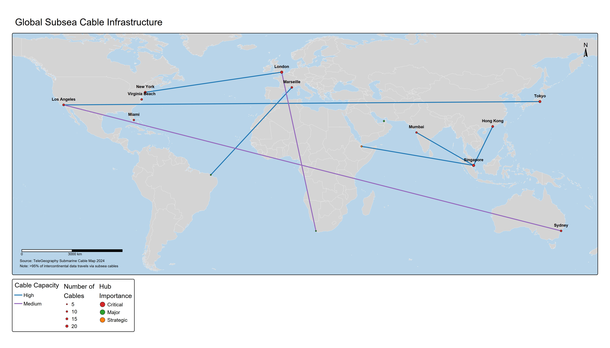

# Information, Standards, and Digital Infrastructure

## Executive Summary

In December 2021, the Biden administration placed eight Chinese technology firms on the Entity List for developing surveillance technology used against Uyghurs in Xinjiang. Among them was SenseTime, one of China's leading artificial intelligence companies, scheduled for a Hong Kong initial public offering worth $767 million. The designation—requiring U.S. government approval for any American technology sales to SenseTime—forced postponement of the IPO and cut the company off from American AI chips, software, and technical support. SenseTime's facial recognition systems, trained on databases of millions of faces and capable of real-time identification across vast camera networks, represented both commercial success (deployed in over 100 Chinese cities per company claims; exact scope unverified) and strategic concern (enabling authoritarian surveillance at unprecedented scale). The Entity List designation signaled American determination to restrict technology enabling human rights abuses while raising fundamental questions: Can democracies compete with authoritarian regimes wielding information technology for social control? Should Western technology companies profit from surveillance states? Can export controls meaningfully constrain information technologies that diffuse rapidly and require primarily software rather than restricted hardware?

SenseTime's predicament captures the broader battleground: the information domain has become a central arena of U.S.-China competition. Cyber operations target intellectual property and critical infrastructure. Data localization requirements fragment the global internet. Standards battles determine whose technical specifications govern 5G networks and IoT devices. Information warfare campaigns shape narratives. The emerging "splinternet" splits digital ecosystems along geopolitical lines. Unlike physical supply chains or semiconductor fabs, information competition involves intangibles—data, software, protocols, standards, narratives—that flow invisibly across borders, replicate at zero cost, and resist traditional export controls.

Consider the asymmetry. A semiconductor fab requires billions in investment, years to construct, and rare expertise. A surveillance algorithm can be copied instantly, modified easily, and deployed globally at negligible cost. Hardware is a wall. Software is a virus. Export controls designed for the former collapse against the latter.

The information domain enables coercion through mechanisms distinct from traditional trade tools. Cyber espionage steals intellectual property worth hundreds of billions. Data localization mandates force costly infrastructure investments while creating leverage over foreign firms. Standards manipulation designs technical specifications favoring domestic champions. Information operations shape public opinion to pressure governments. These mechanisms exploit information technology's unique economics: near-zero marginal replication costs, network effects creating winner-take-all dynamics, and the impossibility of distinguishing legitimate uses from malicious ones.

China's approach shatters Western assumptions about the internet. Since the 1990s, American policy assumed internet adoption would promote democratization, that economic interdependence would constrain authoritarianism, that information freedom would erode closed societies. China proved otherwise. The Communist Party harnessed internet technologies for social control—surveillance systems, content censorship, digital payment tracking—while building e-commerce and fintech platforms rivaling Western counterparts. Beijing exports surveillance technology through Belt and Road and promotes "cyber sovereignty" norms challenging Western internet governance. This is not a transitional phase. It is a coherent alternative vision: authoritarian digital governance.

Standards competition operates on a different timeline. When Huawei's 5G specifications become industry standards, telecommunications worldwide must interoperate with Huawei designs—creating vendor lock-in lasting decades. When China's facial recognition protocols become international standards, Chinese firms gain preferential positions in global surveillance markets. American internet protocols (TCP/IP, HTTP, DNS) gave U.S. firms first-mover advantages that persist today. Standards battles unfold in obscure technical committees (3GPP, ISO, ITU) where engineers and diplomats negotiate specifications with massive strategic implications that receive almost no public attention.

We are fighting a 21st-century information war with 20th-century trade weapons. You can embargo a machine, but not an algorithm. Financial sanctions struggle against cyber operations conducted through proxies and shell companies with shifting identities. Tariffs prove irrelevant for digital services delivered through internet connections. This domain demands new tools: technical measures, regulatory approaches, standards engagement, and narrative contestation. The transformation of competition in an increasingly digital world has only begun.

<figure class="book-figure">
  
  <figcaption>Figure 5.1: Global subsea telecommunications cable infrastructure. Over 95% of intercontinental data travels via undersea cables, making landing points and cable routes critical chokepoints for global connectivity. Critical hubs (red) include major data centers and internet exchange points.</figcaption>
</figure>


**Physical Internet: The Undersea Cables Most People Forget Exist**
Despite the cloud metaphor suggesting ethereal data flows, over 95% of intercontinental internet traffic travels through approximately 400 undersea fiber optic cables lying on the ocean floor. These cables, often only inches in diameter, represent critical physical infrastructure vulnerable to sabotage, natural disasters, and espionage. Cable landing points—where undersea cables connect to land-based networks—are particularly concentrated, with a handful of locations handling the majority of transatlantic and transpacific data. Control over or access to these cables provides extraordinary surveillance opportunities.


---

## Cyber Operations and Espionage

### The Economics of Cyber Espionage: Strategic IP Theft

Cyber espionage represents economic coercion through intellectual property theft at unprecedented scale. Traditional industrial espionage—agents photographing documents in dimly lit offices, bribing insiders over expensive lunches, recruiting disgruntled employees—operated at human speed with inherent limitations. Each target required dedicated resources, stolen information volume remained modest, and exposure risks constrained operations. Cyber operations transformed this calculus entirely. Now automated tools can penetrate thousands of networks simultaneously, exfiltrate terabytes of data within hours, and operate from jurisdictions beyond law enforcement reach. The economics have shifted decisively in favor of attackers: intrusion operations cost thousands to millions of dollars while stolen intellectual property may be worth billions. It's as if safecrackers discovered they could rob every bank in the country simultaneously, from their apartments, with minimal chance of prosecution.

**China's state-sponsored cyber espionage campaigns** exemplify how information technology enables economic coercion at scale. U.S. government assessments and private security firm investigations consistently identify Chinese government-affiliated groups conducting systematic IP theft across strategic sectors worth conservatively hundreds of billions of dollars.

The **APT1 revelations** (Mandiant 2013) attributed campaigns to PLA Unit 61398, documenting intrusions into 141 organizations across 20 industries—from gas pipeline designs to solar manufacturing processes to telecommunications architecture. The 2014 U.S. indictment of five PLA officers for economic espionage (DOJ 2014) did not halt operations but drove tactical adaptation. Successor campaigns—**APT10**'s "Operation Cloud Hopper" targeting managed service providers to access hundreds of downstream clients, and **APT41** blurring state espionage with financially motivated cybercrime (DOJ 2020)—demonstrated the resilience and evolution of Chinese cyber operations. Public exposure and indictments shifted tradecraft toward MSS contractors providing plausible deniability, but the systematic targeting continued.

**Effectiveness** reveals complex dynamics. Campaigns have been extraordinarily productive: enabling Chinese firms to leapfrog R&D timelines in high-speed rail (Siemens/Kawasaki technologies), wind turbines (Sinovel's theft of American Superconductor source code), the C-919 airliner (compromised aerospace contractor designs), and pharmaceuticals. But long-term value proves more ambiguous. Firms relying on espionage rather than organic R&D develop weaker innovation capabilities and face quality control challenges. Chinese aviation still cannot produce competitive jet engines despite decades of espionage targeting Pratt & Whitney, GE, and Rolls-Royce—suggesting that tacit knowledge and manufacturing expertise resist transfer through data theft alone.

Moreover, cyber espionage imposes costs on perpetrators beyond immediate operational expenses. **Reputational damage** when attribution succeeds creates diplomatic tensions, business obstacles (foreign firms reduce Chinese partnerships), and security cooperation deterioration. The 2015 Xi-Obama agreement nominally committing both countries to refrain from commercial cyber espionage followed sustained U.S. pressure and threatened sanctions (White House 2015)—Chinese operations temporarily decreased (though later resumed), suggesting reputational costs can modify behavior even if not eliminating espionage entirely. **Counterintelligence risks** emerge when targeted organizations improve security practices, deploy deception operations (feeding false information to identified intruders), and share threat intelligence—making future operations more difficult and expensive. **Retaliatory capabilities** develop as victims improve defensive and offensive cyber capacities, creating escalation risks where both sides lose more than they gain.

### Critical Infrastructure Vulnerabilities: From Reconnaissance to Potential Disruption

Beyond intellectual property theft, cyber operations targeting critical infrastructure represent perhaps the most concerning dimension of information domain competition. Unlike espionage seeking data exfiltration, infrastructure targeting positions attackers to disrupt essential services—electricity grids, water treatment, telecommunications, financial systems, transportation networks, and healthcare—during crises or conflicts. The strategic logic parallels Cold War nuclear targeting: demonstrating capabilities and pre-positioning access creates deterrent effects and potential coercive leverage, even if never activated.

**Chinese reconnaissance of U.S. critical infrastructure** has been documented across multiple sectors over the past decade. Security firms and U.S. government agencies have attributed persistent intrusions into electric utilities, water systems, natural gas pipelines, and telecommunications networks to Chinese state-sponsored groups. These intrusions often involve reconnaissance—mapping networks, identifying control systems, testing access methods—rather than immediate disruption, suggesting strategic pre-positioning for potential future operations. The 2021 revelation that Chinese-affiliated hackers had accessed U.S. oil and natural gas pipeline systems demonstrated presence in operationally critical networks capable of causing physical disruptions if exploited.

The **Volt Typhoon campaign** disclosed in 2023 exemplified this pre-positioning strategy. Microsoft and U.S. government agencies attributed widespread intrusions across U.S. critical infrastructure (Microsoft 2023; CISA 2023)—telecommunications, energy, water, and transportation sectors—to a Chinese state-sponsored group focused on maintaining persistent, stealthy access. Unlike traditional espionage campaigns targeting intellectual property, Volt Typhoon operations avoided detection through "living off the land" techniques: using legitimate administrative tools already present in networks rather than custom malware, blending malicious activity with normal operations, and exfiltrating minimal data. The campaign's apparent objective was establishing persistent access enabling future disruption rather than immediate intelligence collection—positioning China to potentially cripple U.S. critical infrastructure during Taiwan Strait or other conflicts.


**Critical Infrastructure at Risk: The Digital Achilles Heel**
Much U.S. critical infrastructure—electrical grids, water treatment, pipelines, telecommunications—relies on networked industrial control systems designed decades ago without security considerations. These systems are now connected to the internet for remote monitoring and efficiency but remain vulnerable to cyber intrusion. Chinese and other adversary reconnaissance of these systems creates the specter of "lights out" scenarios where cyberattacks could disable essential services affecting millions of civilians, potentially during military conflicts when disruption would be most damaging.


**Strategic implications** of critical infrastructure vulnerabilities extend beyond immediate disruption risks. Knowledge that adversaries have penetrated essential systems creates **psychological and political effects**: public anxiety about grid failures or water contamination, political pressure on leaders to avoid escalation lest cyber retaliation devastate civilian infrastructure, and deterrent effects where both sides recognize mutual vulnerability. This dynamic creates a form of "cyber mutual assured destruction" analogous to nuclear deterrence—but with crucial differences. Nuclear arsenals are relatively well-understood, physically located, and subject to detection and verification regimes. Cyber capabilities remain secret (attackers don't reveal full access until using it), constantly evolving (new vulnerabilities discovered regularly), and difficult to verify (defensive measures may succeed in removing access, or attackers may have maintained alternative entry points). This opacity creates strategic instability: neither side confidently knows its true vulnerabilities or adversary capabilities, potentially causing either dangerous complacency or paranoid overreaction.

**Deterrence challenges** in critical infrastructure protection differ from traditional military deterrence. Nuclear retaliation is unambiguous and devastating; cyber retaliation faces attribution difficulties (was China responsible for specific infrastructure failure, or did it result from domestic technical issues, criminal hackers, or third-party states?), escalation uncertainties (what cyber attack justifies what military response?), and effectiveness questions (can retaliatory cyber operations impose equivalent costs?). The United States has articulated that cyber attacks causing significant physical damage or casualties could trigger conventional military responses, but thresholds remain deliberately ambiguous—simultaneously attempting to deter attacks while preserving flexibility.

**Defense strategies** for critical infrastructure involve layered approaches combining technical, organizational, and policy measures. **Network segmentation** isolates operational technology (OT) systems controlling physical processes from information technology (IT) networks connected to the internet, reducing attack surfaces. **Zero-trust architectures** require continuous verification rather than assuming internal network traffic is legitimate. **Threat intelligence sharing** through organizations like the Electricity Information Sharing and Analysis Center (E-ISAC) enables collective defense where utilities share indicators of compromise and defensive techniques. **Regulatory requirements** from Department of Homeland Security (NERC CIP standards for electric utilities, TSA directives for pipelines, Sector Risk Management Agencies for various critical infrastructure sectors) mandate minimum security standards, though implementation and enforcement vary.

However, fundamental vulnerabilities persist. Much U.S. critical infrastructure relies on legacy systems designed decades ago without security considerations, operated by private sector entities with varying resources and security maturity. Upgrading industrial control systems proves expensive and risky (shutting down facilities for security improvements creates immediate operational disruptions and costs). The interconnected nature of modern infrastructure means that securing individual assets proves insufficient—attackers can pivot through supply chains, compromise less-secure suppliers or contractors, and exploit trust relationships. Perfect defense appears unattainable; resilience strategies emphasizing rapid recovery rather than prevention increasingly dominate security thinking.

### Attribution Challenges and Deterrence Dilemmas

**Attribution**—confidently identifying who conducted cyber operations—represents a persistent challenge complicating deterrence, retaliation, and norm enforcement in cyberspace. Unlike kinetic attacks where physical evidence, geographic locations, and weapons systems often reveal attackers, cyber operations can route through compromised computers in third countries, employ false flags mimicking adversary techniques, and leverage criminal infrastructure masking state involvement. This attribution difficulty creates a "plausible deniability" space where states conduct operations while maintaining diplomatic pretenses that constraints wouldn't permit for overt actions.

**Technical attribution** involves analyzing malware code, infrastructure (command-and-control servers, domain registrations), operational patterns (working hours suggesting time zones, language artifacts in code comments), and targeting logic (victim selection revealing strategic priorities). Private sector cybersecurity firms (Mandiant, CrowdStrike, Recorded Future, Kaspersky, ESET) have developed sophisticated attribution methodologies, tracking persistent threat actor groups across campaigns, documenting toolsets and techniques, and making public attributions linking activities to specific state intelligence services. These technical attributions often precede official government acknowledgments, creating an interesting dynamic where corporate security researchers effectively conduct open-source intelligence analysis previously reserved for classified government operations.

**Official government attribution** requires higher confidence thresholds and incorporates classified intelligence beyond technical forensics—signals intelligence revealing tasking and reporting, human sources within intelligence services, and clandestine observations of adversary operations. U.S. government attributions typically come through formal statements from FBI, Department of Homeland Security, NSA, or direct presidential attribution. The decision to publicly attribute involves weighing costs (revealing intelligence sources and methods, potentially escalating tensions) against benefits (deterring future operations, building international consensus for responses, demonstrating capabilities to adversaries). Political considerations influence timing and specificity: attribution may be delayed for diplomatic reasons, specificity limited to protect sources, or amplified to justify retaliatory measures.

**Strategic ambiguity and plausible deniability** create advantages for cyber operations that conventional military actions lack. China can orchestrate massive intellectual property theft while officially denying involvement and prosecuting token cases of domestic hackers to demonstrate "commitment" to cyber norms. Russia can disrupt Ukrainian electrical grids while maintaining diplomatic fiction that it doesn't conduct offensive cyber operations. North Korea can steal billions through cryptocurrency heists while diplomatic channels discuss denuclearization. This plausible deniability operates even when technical evidence is overwhelming and government attributions are confident—targets of operations may know with near-certainty who is responsible yet face domestic or international political constraints requiring definitive proof before responding forcefully.

**Deterrence in the absence of reliable attribution** requires strategies distinct from conventional military deterrence. One approach involves **declaratory policies** announcing that cyber attacks will trigger responses regardless of attribution certainty—holding responsible any state whose territory or infrastructure facilitated attacks, even if direct government involvement is unclear. This "safe haven liability" principle appears in U.S. cyber strategy documents but faces practical challenges: many countries lack capacity to police cyber operations from their territory, creating unjust attribution; sophisticated attackers route operations through multiple jurisdictions specifically to implicate innocent third parties; and holding states responsible for all cyber activity originating from their territory sets a precedent that could backfire against the United States (which hosts significant cybercriminal infrastructure despite law enforcement efforts).

**Cost imposition** represents another deterrence approach: raising operational costs for adversaries through improved defenses (making intrusions more expensive), persistent engagement (conducting operations that disrupt adversary infrastructure), and economic consequences (sanctions, export controls, diplomatic isolation) that exceed benefits of cyber operations. The U.S. Cyber Command's "defend forward" and "persistent engagement" strategies emphasize continuous operations to map adversary networks, pre-position access for potential disruption, and impose costs making cyber operations less attractive. However, measuring effectiveness proves difficult—are adversary operations declining because of defensive improvements, or are they simply less observed because attackers improved stealth? Does persistent engagement deter adversaries or simply normalize reciprocal intrusions creating escalation risks?

**International norms and agreements** offer potential paths toward stability but face severe limitations. The 2015 U.S.-China agreement and broader G20 endorsement of norms prohibiting state-sponsored theft of intellectual property for commercial advantage represented rhetorical progress. However, Chinese cyber espionage resumed after temporary decreases, suggesting limited practical impact. The challenge is that cyber norms lack verification mechanisms and enforcement tools: no equivalent exists to nuclear inspection regimes or arms control treaties with intrusive monitoring. States that benefit from cyber operations (China's technology acquisition, Russia's disruption capabilities, North Korea's cryptocurrency theft) have limited incentives for meaningful restraint. Democracies facing public accountability for cyber vulnerabilities may unilaterally constrain operations that authoritarian adversaries pursue freely, creating asymmetric disadvantages.

---

## Data Localization and Digital Sovereignty


**Data Sovereignty: The New Frontier of National Control**
Data sovereignty refers to the principle that data is subject to the laws and governance structures of the nation where it is collected or stored. Unlike physical goods that must cross borders through customs checkpoints, data flows invisibly through fiber optic cables and satellite links. Data localization laws attempt to reassert national control over these flows, requiring that data about citizens remain within territorial jurisdiction—creating both legitimate regulatory frameworks and potential tools for surveillance, censorship, and economic protectionism.


### China's Data Security Framework: From Ambiguity to Control

Data localization requirements—mandating that data be stored within national borders—represent a form of economic coercion threatening global digital integration. China's evolving framework illustrates how data policies serve multiple objectives simultaneously: privacy protection, industrial policy favoring domestic firms, and state control over information flows.

The progression from the 2016 Cybersecurity Law (vague, selectively enforced) to the **2021 Data Security Law** and **Personal Information Protection Law (PIPL)** created comprehensive frameworks (Creemers, Triolo, and Webster 2022) establishing data classification hierarchies, export security reviews, and cross-border transfer limitations. **Critical Information Infrastructure (CII)** designation—applied broadly to telecommunications, internet services, financial infrastructure, and major foreign technology firms—requires domestic data storage, government access to encryption keys and source code, and purchase from approved (often domestic) vendors. These requirements force foreign firms to choose between Chinese market access and protection of intellectual property and operational independence.

The coercive dynamics are visible in corporate responses. LinkedIn operated a censored Chinese version for years but closed its social networking service in 2021, citing escalating compliance demands. Microsoft operates Chinese cloud services through local partner 21Vianet with elaborate structures separating Chinese from global operations. Both cases demonstrate that compliance with data localization creates leverage that host governments can continuously ratchet upward.

### European GDPR and Digital Protectionism

The EU's **General Data Protection Regulation (GDPR)**, implemented in 2018, created the world's most comprehensive data privacy framework—with penalties up to 4% of global annual revenue. GDPR's privacy protections represent genuine advances (consent requirements, data portability, right to deletion), but practical implementation disproportionately burdens American technology companies. Google has been fined over €8 billion across GDPR and antitrust actions; Meta faces billions for data transfer violations; Amazon received a €746 million fine. European firms, while technically subject to the same rules, face less aggressive enforcement.

**Cross-border data transfer restrictions** create particularly significant barriers. The U.S. failed EU adequacy assessment; two successive transfer frameworks (Safe Harbor, Privacy Shield) were invalidated by European Court of Justice rulings. The 2023 Data Privacy Framework represents a third attempt, with legal challenges ongoing. Critics argue GDPR functions as **digital protectionism** disguised as privacy protection; EU officials counter that American data practices genuinely violate fundamental rights. The "Brussels Effect"—GDPR becoming a de facto global standard as multinationals implement compliant practices worldwide—represents European strategic success in shaping digital governance through regulatory leadership.

### Data Localization Proliferation

Beyond China and Europe, data localization has proliferated globally. Russia's 2015 law requires data on Russian citizens to be stored domestically—LinkedIn was blocked for non-compliance (2016), while Meta, Google, and Apple complied by building Russian data centers. Russia's 2019 Sovereign Internet Law further created infrastructure for potential domestic internet isolation. India's Reserve Bank mandated exclusive domestic storage of payment data (2018), forcing Mastercard, Visa, and American Express to build Indian infrastructure, while the Digital Personal Data Protection Act extends localization to broader categories.

The strategic calculations parallel Chapter 2's supply chain analysis: benefits include enhanced regulatory jurisdiction and domestic industry support, while costs include economic inefficiencies (Brookings estimates 0.7-1.7% GDP reduction globally from data localization), security vulnerabilities from dispersed data, and innovation constraints. Governments pursuing localization accept economic costs for sovereignty and strategic control.

---

## Technology Standards Competition

### Why Standards Matter: Architecture as Strategic Advantage

Technology standards—the technical specifications defining how devices, networks, and systems interoperate—determine market structures, competitive advantages, and strategic dependencies lasting decades. This may sound like arcane technical minutiae, but standards are architecture, and architecture is power. When Huawei's 5G specifications become industry standards adopted by 3GPP (3rd Generation Partnership Project), telecommunications equipment globally must conform to those specifications to achieve interoperability. This creates massive advantages: Huawei's equipment inherently complies with standards the company helped write, competitors face costs adapting to specifications they didn't design, and network effects lock in Huawei's market position as deployed infrastructure creates path dependencies resisting change.

Standards competition operates through mechanisms distinct from market competition or geopolitical contests. **Technical committee processes** in bodies like 3GPP, ITU (International Telecommunication Union), ISO (International Organization for Standardization), IEEE (Institute of Electrical and Electronics Engineers), and IETF (Internet Engineering Task Force) involve engineers proposing specifications, working groups evaluating alternatives, and consensus processes approving standards. This technocratic veneer obscures strategic dimensions: which proposals are advanced, how alternatives are evaluated, whose participation shapes decisions, and what criteria determine adoption all reflect power dynamics and economic interests alongside pure technical merit.

**Chinese standards strategy** has evolved from passive adoption of Western standards to active standards competition pursuing leadership. Early Chinese economic development relied on implementing international standards developed primarily by American, European, and Japanese firms—accepting disadvantageous positions in technology value chains but enabling rapid integration into global manufacturing networks. As Chinese firms' technical capabilities advanced, strategy shifted toward developing indigenous standards (AVS video coding versus MPEG, WAPI wireless security versus Wi-Fi, TD-SCDMA 3G standard) that created protected domestic markets while remaining isolated internationally due to incompatibility with dominant global standards.

The current Chinese approach emphasizes **standards leadership in emerging technologies** where no incumbent dominant standards exist. 5G represents the most prominent success: Huawei contributed more 5G standard-essential patents to 3GPP than any other firm (approximately 14-18% of declared essential patents as of 2023; IPlytics 2023), shaping specifications in ways favoring Huawei equipment and establishing technical leadership translated into market dominance. Chinese firms and institutions now actively participate in standards bodies across AI governance, IoT protocols, facial recognition, smart cities infrastructure, and other emerging domains—seeking to replicate 5G successes in shaping global technology architecture.

### The 5G Standards Battle: Huawei's Rise and Western Response

5G wireless technology represents critical infrastructure enabling next-generation applications: ultra-high-definition video streaming, autonomous vehicles, remote surgery, industrial automation, smart cities infrastructure, and ubiquitous IoT connectivity. The firm or nation controlling 5G standards and dominating equipment markets gains advantages extending beyond telecommunications to entire digital economy ecosystems dependent on wireless connectivity. Huawei's emergence as 5G standards leader and dominant equipment supplier created strategic concerns in the United States and allied nations, triggering campaigns to exclude Huawei from critical networks despite technical capabilities and cost advantages.

**Huawei's standards leadership** resulted from sustained technical investment and strategic standards engagement. The company allocated billions annually to R&D (consistently ranking among world's top R&D spenders across all industries), employed tens of thousands of engineers developing wireless technologies, and systematically participated in 3GPP working groups drafting 5G specifications. This technical investment translated to standards influence: Huawei representatives chaired key 3GPP working groups, contributed thousands of technical proposals, and accumulated the largest portfolio of 5G standard-essential patents (SEPs) among all firms. By the time 5G standards were finalized (Release 15 in 2018, Release 16 in 2020), Huawei's technologies were deeply embedded in specifications that all equipment manufacturers must implement for 5G compatibility.

**Market dominance** followed standards leadership. Huawei captured approximately 30% of global telecommunications equipment market share (competing with Ericsson, Nokia, Samsung, and smaller players), with particularly strong positions in Asia, Africa, Middle East, and parts of Europe. Several factors drove Huawei's success beyond standards influence:

- **Cost advantages:** Chinese government support, lower labor costs, and vertically integrated supply chains enabled Huawei to underprice Western competitors by 20-30% for equivalent equipment
- **Performance and features:** Huawei equipment matched or exceeded competitors in technical capabilities, network efficiency, and feature sets
- **Financing packages:** Offering attractive vendor financing through Chinese state banks, particularly appealing to developing nations lacking capital for network upgrades
- **Rapid deployment support:** Providing extensive technical support, training, and integration services accelerating network rollouts

Western telecommunications firms (Ericsson, Nokia) struggled competing against Huawei's combination of technical excellence, cost advantages, and state backing. By 2019, Huawei appeared poised to dominate global 5G deployments, translating standards leadership and market position into enduring competitive advantages.

**U.S. security concerns and exclusion campaigns** targeted Huawei's 5G equipment based on espionage and disruption risks. U.S. intelligence agencies and allied counterparts assessed that Huawei equipment in critical telecommunications networks could enable Chinese government surveillance (intercepting communications, stealing data transiting networks) and disruption (remote shutdown or manipulation of network operations during crises). Several factors intensified concerns specifically about Huawei and 5G:


**The Backdoor vs. Front-door Debate**
Security concerns about Huawei equipment focus on two distinct risks. "Backdoors" are hidden vulnerabilities intentionally inserted for espionage—difficult to detect and potentially devastating if exploited. "Front-door" access refers to China's National Intelligence Law requiring companies to cooperate with intelligence services when requested—meaning even without hidden vulnerabilities, Huawei could be legally compelled to assist Chinese espionage. Critics argue the distinction matters less than the outcome: Chinese government access to networks is the threat, regardless of the technical mechanism enabling it.


Several factors intensified these concerns. China's National Intelligence Law requires Chinese firms and citizens to cooperate with intelligence services, creating mandatory compliance with government espionage demands. Huawei's internal Communist Party committees and reported intelligence service ties further raised questions about the company's independence from state direction. The complexity of Huawei's equipment and software made comprehensive security audits difficult, creating opportunities for embedded vulnerabilities or backdoors through supply chain opacity. Moreover, the architecture of 5G itself amplified the risks: unlike previous wireless generations with centralized switching infrastructure, 5G distributes intelligence throughout networks, making Huawei equipment ubiquitous and deeply integrated rather than isolated in specific network segments. Compounding these concerns, 5G's reliance on software-defined networking and software-controlled network functions enables remote updates and modifications, creating persistent access opportunities for equipment manufacturers.

The Trump administration launched aggressive campaigns to exclude Huawei from allied 5G networks, combining domestic restrictions (banning Huawei equipment from U.S. networks, Entity List designation cutting off semiconductor and software supplies) with diplomatic pressure on allies to reject Huawei. Secretary of State Mike Pompeo and other officials conducted extensive international travel explicitly lobbying against Huawei deployments, warning that intelligence sharing with nations deploying Huawei 5G could be curtailed. The campaign achieved mixed results across allied nations.

**Five Eyes intelligence partners** (United States, United Kingdom, Canada, Australia, New Zealand) demonstrated varied responses revealing tensions between security concerns and economic interests. **Australia** banned Huawei from 5G networks in August 2018, becoming the first major economy to implement comprehensive exclusion. Australian intelligence assessments concluded that 5G architecture made distinguishing "core" versus "edge" network components meaningless—Huawei equipment anywhere in networks created unacceptable risks. **New Zealand** followed with restrictions preventing major carriers from using Huawei 5G equipment, though implementation remained less absolute than Australia's.

**United Kingdom** initially attempted a middle path: allowing Huawei participation in 5G but limiting market share to 35%, excluding equipment from "core" network functions and sensitive geographic areas (near military bases, government facilities). The UK's National Cyber Security Centre assessed that risks from Huawei equipment could be managed through technical measures, vendor diversity, and oversight. However, U.S. pressure intensified following January 2020 semiconductor export controls cutting Huawei's access to advanced chips. UK government reversed course in July 2020, announcing complete Huawei exclusion from 5G networks by 2027—demonstrating that U.S. leverage ultimately overcame UK's preferred balanced approach.

**Canada** delayed decisions for years, caught between security partnership with the United States and complex political dynamics involving Huawei CFO Meng Wanzhou's detention in Vancouver (on U.S. extradition request for fraud charges related to Iran sanctions violations) creating Chinese retaliation against Canadian agricultural exports and arbitrary detention of Canadian citizens in China. Canada ultimately banned Huawei and ZTE from 5G networks in May 2022, joining other Five Eyes partners but only after extended deliberation reflecting costs of security alignment.

**European responses** varied widely, with major economies attempting balances between U.S. pressure and commercial interests. **Germany** faced particularly acute tensions: Deutsche Telekom, Vodafone Germany, and Telefónica Deutschland had deployed Huawei 4G equipment extensively and planned continued Huawei use for 5G, generating cost and deployment timeline advantages. German automotive industry relied on Huawei for connected vehicle development. However, U.S. pressure and internal security debates led to restrictions: Huawei not banned outright, but stringent certification requirements, vendor diversity mandates, and exclusion from sensitive applications created de facto limitations. The compromise satisfied neither security hawks (who wanted complete bans) nor Huawei (which faced severe market constraints).

**France** similarly avoided outright bans but implemented security certification processes and encouraged carriers to favor Ericsson and Nokia, effectively limiting Huawei to existing footprint without expansion. **Italy, Spain, and other EU members** maintained Huawei relationships with varying restrictions, balancing security concerns against deployment costs and carrier preferences. The fragmented European response frustrated American officials seeking unified allied exclusion but reflected EU member states' sovereign decisions and economic calculations.

**Effectiveness assessment** of Huawei exclusion campaigns reveals partial success with significant costs:

In terms of market impact, Huawei's international 5G equipment sales declined substantially in developed markets, with lost revenues estimated at tens of billions, though Huawei maintained strong positions in Asia, Africa, the Middle East, and parts of Latin America—particularly in countries prioritizing cost and performance over Western security concerns. On allied coordination, Five Eyes partners ultimately aligned on Huawei exclusion (though timing and implementation varied), demonstrating U.S. influence, while European fragmentation revealed the limits of American leverage when security arguments compete with commercial interests. Chinese retaliation against specific Huawei bans remained limited, but the broader deterioration of technology cooperation and investment relationships imposed mutual costs. The innovation impact proved double-edged: excluding Huawei reduced competitive pressure on Ericsson and Nokia, potentially slowing innovation and increasing costs for carriers and consumers, and while Western equipment vendors benefited commercially, questions persisted about whether reduced competition would sustain technical leadership. Perhaps most significantly, Huawei's standards contributions and patent portfolios remained embedded in 5G specifications regardless of equipment exclusion, meaning that Ericsson and Nokia must still license Huawei patents and implement Huawei-influenced specifications, limiting the completeness of exclusion efforts.

### Beyond 5G: IoT, AI Governance, and 6G Standards Competition

The 5G standards battle foreshadows intensifying competition across emerging technology domains where standards remain contested. Chinese firms and government agencies now systematically pursue standards leadership in Internet of Things (IoT), artificial intelligence governance, facial recognition protocols, smart cities infrastructure, and next-generation 6G wireless—learning from 5G successes and failures.

**IoT and edge computing standards** determine interoperability for billions of connected devices: industrial sensors, smart home appliances, autonomous vehicles, medical devices, agricultural equipment, and urban infrastructure. Multiple competing standards bodies and protocols create fragmentation—IEEE, ITU, ISO, IETF, and industry consortia all advance different specifications. Chinese participation in these venues has increased dramatically, with firms contributing technical proposals, representatives chairing working groups, and government funding supporting standards engagement.

Chinese IoT standards initiatives emphasize **domestic market leverage**: China's massive manufacturing base and consumer market create opportunities to establish dominant standards through market adoption rather than purely technical committee processes. If hundreds of millions of Chinese IoT devices implement specifications developed by Huawei, Xiaomi, Alibaba, or government research institutes, foreign manufacturers face pressures to adopt Chinese standards for market access—creating network effects and locked-in advantages. This "standards through scale" strategy leverages China's economic weight to complement technical committee engagement.

**AI governance standards** represent particularly consequential competition with limited international progress toward consensus. Technical standards for AI systems (testing methodologies, documentation requirements, transparency protocols, bias assessment) are emerging through ISO, IEEE, and national standards bodies. However, fundamental disagreements about AI governance between democratic and authoritarian regimes impede convergence. Western frameworks emphasize transparency, accountability, individual rights protection, and independent oversight. Chinese approaches prioritize state control, social stability, party leadership, and national security—creating incompatible governance philosophies translated into competing technical standards.

The **ITU's AI for Good Global Summit** and UNESCO's AI ethics frameworks represent attempts at international cooperation, but progress proves limited when underlying values diverge. China has proposed facial recognition standards at ITU emphasizing technical interoperability while ignoring human rights concerns Western democracies prioritize. These proposals, if adopted internationally, would facilitate surveillance technology exports and normalize authoritarian applications—demonstrating how ostensibly neutral technical standards embed political values.

**6G standards competition** is already underway despite 5G deployment remaining incomplete globally. 6G promises orders of magnitude improvements in speed, latency, and connectivity density—enabling applications currently speculative: truly seamless virtual/augmented reality, pervasive artificial intelligence, advanced holographic communications, and integration of terrestrial and satellite networks. Standards development is in early stages, with 3GPP planning initial specifications for late 2020s and commercial deployment in 2030s.

Both United States and China recognize 6G standards as critical strategic competition domain. **China launched 6G development initiatives** in 2019, establishing research programs, funding university and industry projects, and coordinating standards engagement strategies. The goal is establishing standards leadership from initial development rather than catching up as occurred in earlier wireless generations. **United States**, having largely ceded 5G standards leadership to Huawei, seeks to regain initiative in 6G through "Next G Alliance" (industry consortium coordinating 6G R&D), increased government funding for wireless research, and diplomatic efforts to coordinate allied standards positions.

The fundamental question is whether Western firms and governments can match Chinese systematic, state-supported standards engagement. U.S. firms excel at innovation but often underinvest in standards processes—viewing committee work as burdensome rather than strategic. Chinese firms receive government guidance and support for standards participation, attend meetings systematically, and coordinate positions—creating persistent engagement advantages. Unless Western approaches adapt, Chinese standards influence will likely continue expanding across emerging technologies.

---

## Information Warfare and Influence Operations

### Disinformation, Platform Manipulation, and Narrative Control

Information warfare—the use of information and communication technologies to gain strategic advantages through manipulating perceptions, spreading disinformation, and shaping narratives—has become an increasingly prominent dimension of great power competition. Unlike cyber espionage seeking data theft or infrastructure attacks pursuing disruption, information operations target human cognition and political processes: influencing elections, undermining trust in institutions, polarizing societies, and advancing geopolitical narratives favorable to operators.

**Chinese information operations** differ in character from Russian approaches, reflecting distinct strategic objectives and political systems. Russian operations, as demonstrated in 2016 U.S. elections and ongoing campaigns, emphasize chaos, polarization, and undermining democratic legitimacy—seeking to weaken adversaries through internal divisions rather than promoting specific Russian narratives. Chinese operations more often pursue **positive propaganda** promoting Chinese Communist Party achievements, Belt and Road Initiative benefits, and Chinese governance model advantages, alongside **defensive censorship** suppressing criticism of Chinese policies and human rights abuses.

**COVID-19 pandemic** provided case study in Chinese information operations' scale and mechanisms. As global criticism mounted regarding initial outbreak handling in Wuhan, delayed information sharing, and potential laboratory origins, Chinese government agencies and affiliated entities conducted coordinated campaigns deflecting blame and promoting Chinese pandemic response successes. Operations included:

- **Diplomatic "wolf warrior" rhetoric:** Chinese diplomats and Foreign Ministry spokespersons aggressively promoted conspiracy theories about U.S. military origins of COVID-19, amplified criticism of Western pandemic responses, and highlighted Chinese medical assistance to other countries
- **State media amplification:** CGTN, Xinhua, China Daily, and other official outlets produced massive content promoting Chinese pandemic control, contrasting "superior" Chinese governance with "chaotic" Western responses, and depicting China as responsible global leader
- **Social media manipulation:** Researchers documented coordinated inauthentic behavior on Twitter, Facebook, and YouTube where accounts with Chinese characteristics (registration patterns, linguistic features, behavioral signatures) systematically amplified pro-Chinese content, attacked critics, and spread disinformation
- **Information suppression:** Domestic censorship prevented Chinese citizens from accessing alternative narratives, while international pressure compelled platform removals of content critical of Chinese policies

**Effectiveness of Chinese information operations** remains contested. Some analysts assess that operations successfully shaped narratives in developing countries where Chinese infrastructure investment and media presence influence information environments, but faced limited traction in Western democracies with diverse media ecosystems and public skepticism of Chinese government claims. However, even unsuccessful influence attempts can impose costs: forcing democratic governments and civil society to invest resources in debunking disinformation, creating political controversies, and polluting information environments with contradictory narratives that undermine confidence in objective truth.

**Uyghur genocide narratives** demonstrate information warfare's intensity on issues Chinese government views as core interests. As evidence accumulated of mass detention, forced labor, coercive population control, and cultural destruction in Xinjiang, international criticism intensified. Chinese responses combined aggressive information campaigns (denying abuses, claiming "vocational training" and "deradicalization," organizing propaganda tours for sympathetic observers) with economic coercion (threatening market access for companies criticizing Xinjiang policies, pressuring governments to silence criticism). The campaign achieved limited success in changing Western government positions but successfully fragmented international responses—many Muslim-majority nations issued statements supporting Chinese policies or remained silent, prioritizing economic relationships over human rights.

### Platform Governance and the Weaponization of Content Moderation

Social media platforms—Twitter/X, Facebook/Meta, YouTube, TikTok—have become contested spaces where states pursue influence while platforms attempt content moderation balancing free expression, user safety, and political pressures from multiple governments. This creates opportunities for **authoritarian manipulation of platform policies** where governments pressure platforms to censor content, remove critics, and amplify regime narratives under guise of combating misinformation, hate speech, or extremism.

**Chinese pressure on platforms** operates through market access leverage. Platforms seeking Chinese operations must accept censorship (LinkedIn's Chinese version censored politically sensitive profiles), data localization (storing Chinese user data in China-based servers accessible to authorities), and government partnership requirements (Google's abandoned Dragonfly search engine would have enabled censorship and surveillance). Platforms refusing compliance face blocking—Google Search, Facebook, Twitter, YouTube, and most Western social media remain blocked in China behind the Great Firewall, replaced by domestic alternatives (Baidu, WeChat, Weibo) subject to comprehensive government control.

**TikTok** represents unique information warfare concerns, being Chinese-owned platform (ByteDance parent company) with massive user base in Western countries including United States (over 150 million American users as of 2023) (TikTok 2023). U.S. government concerns encompass multiple dimensions:

- **Data collection:** TikTok collects extensive user data (location, contacts, viewing habits, biometric information from face filters) potentially accessible to Chinese government through legal demands or ByteDance cooperation
- **Algorithm manipulation:** Recommendation algorithms determining what content users see could be manipulated to suppress content critical of China, promote pro-Chinese narratives, or influence political opinions—particularly among young users who disproportionately use TikTok
- **Influence operations:** Platform could be weaponized during crises to spread disinformation, create panic, or manipulate public opinion on geopolitically sensitive issues
- **Cognitive security:** Even without active manipulation, foreign adversary control of information platform consumed by millions creates strategic vulnerability and potential coercive leverage

TikTok implemented various measures attempting to address concerns: storing U.S. user data with Oracle in the United States, establishing content moderation transparency, and creating organizational separations between TikTok and ByteDance. However, U.S. government assessments concluded that structural ties to the Chinese parent company and potential Chinese government pressure created ineradicable risks. Legislation requiring ByteDance divestiture passed Congress in 2024, and after a brief period under a de jure ban (January 19, 2025 to January 22, 2026) that was never enforced, the TikTok USDS Joint Venture LLC was formally established in January 2026. The deal restructured U.S. TikTok operations under majority American ownership — 50% held by new investors (Oracle, Silver Lake, and Abu Dhabi's MGX at 15% each), 30.1% by existing ByteDance investors, and 19.9% retained by ByteDance — with the recommendation algorithm copied and retrained exclusively on U.S. user data, hosted by Oracle.


**Algorithmic Influence: The Invisible Hand of Content Curation**
TikTok's recommendation algorithm determines what 150+ million American users see, creating unprecedented influence over attention and opinion formation, particularly among young people. The concern is not just data collection but algorithmic manipulation: could the algorithm be tuned to suppress content critical of China, amplify divisive political content, or shape attitudes on issues like Taiwan? Even without active manipulation, foreign adversary control over information infrastructure consumed by millions creates strategic vulnerability that traditional security frameworks struggle to address.


The TikTok debate illustrates broader dilemmas about **reciprocity in digital platforms**. Chinese internet remains closed to Western platforms while Chinese platforms operate globally—creating asymmetric information access. Arguments for banning or restricting TikTok emphasize security and reciprocity; counterarguments raise free expression concerns, economic costs (American creators and businesses rely on TikTok), and precedent for internet fragmentation (if United States bans foreign platforms based on ownership nationality, will others follow, fragmenting global internet?).

---

## The Splinternet and Digital Fragmentation

### Internet Balkanization: From Global Network to Geopolitical Fragments

The internet's foundational vision—a borderless, interoperable global network enabling free information flows—is fragmenting into geopolitically defined zones with divergent governance, technical standards, and accessible content. This "splinternet" or internet balkanization reflects competing visions of digital governance, strategic competition dynamics, and erosion of consensus that sustained global internet integration.

**Technical fragmentation** manifests through incompatible standards, divergent protocols, and isolated infrastructure. China's Great Firewall creates the most comprehensive technical separation: filtering systems block access to foreign websites and services, forcing users onto domestic platforms operating under government control. Russia's sovereign internet initiatives pursue similar separation capabilities. Alternative root DNS systems, competing internet governance frameworks, and proliferating localization requirements create barriers to seamless global connectivity that characterized earlier internet eras.

**Content fragmentation** occurs as different jurisdictions enforce contradictory requirements on platforms and content providers. What is legal speech in United States may violate European hate speech laws, Chinese censorship requirements, or Russian "extremism" statutes. Platforms must either fragment offerings (different content available in different countries), accept lowest-common-denominator restrictions (global censorship to satisfy most restrictive jurisdiction), or exit markets refusing compliance. Geographic content blocking—restricting access based on user location—becomes standard practice rather than exceptional.

**Regulatory fragmentation** accelerates as nations implement incompatible frameworks for data protection, content moderation, platform liability, and technology governance. GDPR's European approach differs fundamentally from Chinese data security laws and American sectoral regulations. No global consensus exists on fundamental questions: are platforms liable for user content or protected by intermediary liability shields? Must encryption include government backdoors or preserve end-to-end security? Should data flow freely across borders or remain subject to localization? These unresolved questions generate proliferating national regulations creating compliance burdens and barriers to global digital integration.

### Alternative Digital Infrastructures: BeiDou, CIPS, and Digital Sovereignty

Chinese pursuit of digital sovereignty extends beyond censorship and data localization to building alternative digital infrastructures reducing dependencies on Western-controlled systems. These alternatives—navigation satellites, payment systems, internet routing, cloud services—create parallel ecosystems enabling both independence from Western leverage and potential extensions of Chinese influence.

**BeiDou Navigation Satellite System**, completed in 2020 with global coverage, represents China's GPS alternative. While civilian GPS remains freely available globally, Chinese government determined that military and critical infrastructure dependencies on American-controlled navigation created unacceptable vulnerabilities (GPS can be selectively denied or degraded in specific regions during conflicts). BeiDou provides Chinese military assured access independent of U.S. control and offers civilian services throughout Belt and Road Initiative countries—creating technical ties and potential leverage comparable to Western GPS dependencies.

**Cross-Border Interbank Payment System (CIPS)**, launched in 2015 and expanded substantially since, represents Chinese alternative to SWIFT (Society for Worldwide Interbank Financial Telecommunication) for international payments (see Chapter 7 for detailed analysis of SWIFT as a financial coercion tool). While SWIFT remains dominant (processing tens of millions of daily transactions globally), CIPS enables RMB-denominated cross-border payments outside SWIFT infrastructure. Strategic motivation is clear: SWIFT's Belgian domicile notwithstanding, U.S. pressure has repeatedly compelled SWIFT disconnections as sanctions enforcement mechanism (Iran, Russia). CIPS provides potential escape from SWIFT-based financial coercion, though current transaction volumes remain orders of magnitude below SWIFT.

**Domestic technology ecosystems** substituting for American platforms create comprehensive digital sovereignty: Baidu replaces Google Search, WeChat substitutes for WhatsApp and Facebook combined, Weibo parallels Twitter, Douyin (TikTok's Chinese version) operates under different rules than international TikTok, Alibaba and JD.com replace Amazon. These platforms operate under government oversight enabling content censorship and data access, but also demonstrate that authoritarian regimes need not depend on Western platforms—comprehensive digital ecosystems can develop domestically with sufficient market scale and government support.

### Strategic Implications: Resilience or Inefficiency?

Digital fragmentation creates tradeoffs between resilience and efficiency that parallel supply chain debates in Chapter 2. **Proponents of fragmentation** emphasize resilience benefits: reduced vulnerabilities to foreign disruption, protection from surveillance and manipulation, and strategic autonomy enabling independent action during crises. **Critics highlight inefficiency costs**: duplicated infrastructure investment, lost network effects and economies of scale, reduced innovation from fragmented markets, and barriers to global cooperation on challenges requiring coordination.

The trajectory remains uncertain. Full splinternet—completely separate digital ecosystems with no interoperability—appears implausible given economic interdependencies and technical complexity. But continued fragmentation through incompatible regulations, content blocking, alternative infrastructure, and geopolitical tensions seems likely. The question is degree: will fragmentation remain modest (separate content in different jurisdictions but interoperable infrastructure) or accelerate toward substantive separation (incompatible technical standards, isolated networks, competing governance systems)?

Answers depend on broader geopolitical trajectories: deepening U.S.-China strategic competition suggests accelerating fragmentation, while economic interdependencies and shared challenges (climate, pandemics, technology governance) create incentives for maintaining connectivity. The information domain thus serves as both arena of strategic competition and potential site of cooperation—a tension that runs through contemporary international relations.

---

## Chinese Perspective Box: Cyber Sovereignty and Discourse Power

### Understanding Chinese Concepts of Information Security

Chinese approaches to information technology governance fundamentally diverge from Western frameworks, reflecting different political systems, historical experiences, and strategic objectives. Understanding these perspectives through key Chinese concepts provides essential context for analyzing information domain competition.

**Cyber Sovereignty (网络主权, wǎngluò zhǔquán)** represents the foundational Chinese principle: states possess sovereign authority over internet infrastructure, content, and data within their territories, equivalent to sovereignty over physical territory. This concept explicitly challenges Western internet governance norms emphasizing multi-stakeholder governance, free information flows, and limiting government control. From Chinese perspective, Western internet "freedom" rhetoric masks American dominance of internet infrastructure (root DNS servers, ICANN control, submarine cable routes) and platforms (Google, Facebook, Amazon), creating unacceptable vulnerabilities and information asymmetries.

Chinese officials argue that cyber sovereignty protects against multiple threats: foreign espionage and surveillance (Snowden revelations proved American intelligence agencies conduct massive global surveillance including of allies), ideological infiltration (Western platforms could be weaponized to spread democratic values threatening Communist Party legitimacy), and strategic manipulation (adversaries could exploit internet dependencies to disrupt China during crises). From this perspective, the Great Firewall and data localization represent defensive measures comparable to border controls and customs enforcement—legitimate exercises of sovereignty protecting national security and social stability.

**Discourse Power (话语权, huàyǔquán)** addresses perceived information asymmetries where Western nations dominate global narratives through media control, platform ownership, and cultural influence. Chinese government views international discourse as systematically biased against China: Western media emphasize Chinese human rights violations while downplaying Western abuses, international institutions reflect Western values and interests, and English language dominance marginalizes Chinese perspectives. Discourse power thus means capability to shape international narratives, influence global public opinion, and contest Western information dominance.

Pursuing discourse power motivates substantial investments in international media (CGTN, China Daily, Xinhua expanding global presence), Belt and Road Initiative infrastructure giving leverage over developing nation narratives, social media presence amplifying Chinese perspectives, and standards engagement shaping technical governance. The objective is not necessarily convincing Western audiences (acknowledged as difficult) but providing alternative narratives in developing nations, creating doubt about Western criticisms, and gradually shifting international discourse toward acknowledging Chinese model's legitimacy.

**Information Security (信息安全, xìnxī ānquán)** in Chinese usage encompasses both cybersecurity (protecting networks and data from intrusions) and content security (preventing information threatening social stability or party rule). This conflation reflects Chinese government's view that information threats are inseparable from technical threats—social media platforms enabling political organizing pose national security dangers comparable to cyber espionage or critical infrastructure attacks. Western criticisms that this violates free expression rights are dismissed as imposing Western values inappropriately—from Chinese perspective, social stability and national security legitimately constrain expression rights.

**Digital Civilization (数字文明, shùzì wénmíng)** represents Chinese vision for global internet governance: a multipolar digital order where multiple civilizations maintain distinct digital ecosystems reflecting their values and governance systems, rather than universal Western-dominated internet. This concept explicitly challenges internet universalism, instead embracing digital plurality where Chinese, Western, Islamic, and other civilizations maintain separate-but-equal digital spaces with minimal interference. Critics view this as rationalizing authoritarian censorship and fragmentation; Chinese officials portray it as respecting civilizational diversity and national sovereignty.

### Chinese Perspective: Technology Sovereignty and Strategic Objectives

Chinese information technology strategy reflects both historical lessons about technological dependence and forward-looking strategic objectives. Past experiences with foreign technology denial (Western embargoes, Soviet withdrawal of technical support) reinforce the imperative for self-reliance (自力更生, zìlì gēngshēng). Contemporary Chinese information strategy pursues several goals:

**Technology leadership**: Achieving global leadership in AI, quantum computing, 6G networks, and other frontier technologies to drive economic growth and military capability

**Digital sovereignty**: Maintaining control over domestic information flows to preserve political stability and prevent foreign influence operations

**Standard-setting power**: Shaping international technology standards (5G, AI governance, digital currencies) to favor Chinese firms and governance models

**Supply chain security**: Developing domestic alternatives to GPS, internet infrastructure, and operating systems controlled by potential adversaries

From the Chinese perspective, these measures represent strategic necessities for great power status, not merely authoritarian control. Western technology restrictions (semiconductor export controls, platform bans, network equipment exclusions) validate Chinese concerns about foreign "strangling" leverage, intensifying determination to achieve technological independence regardless of short-term costs.

### Strategic Implications for U.S. Policy

Understanding Chinese cyber sovereignty concepts reveals strategic dilemmas U.S. policymakers face. **Engagement strategies** promoting internet openness and democratic governance norms confront Chinese determination to maintain authoritarian control—creating fundamental incompatibility. **Coercive strategies** restricting Chinese technology access (semiconductor controls, platform bans) reinforce Chinese conviction that Western technology dependence creates unacceptable vulnerabilities, motivating intensified indigenous development regardless of cost.

**Alternative approaches** might emphasize reciprocity (Chinese platforms access Western markets only if Western platforms access Chinese markets under non-discriminatory terms), technical security measures (requiring supply chain transparency, independent audits, data protection standards) rather than ideological debates, and coalition-building with democracies sharing internet freedom values while acknowledging that comprehensive convergence with authoritarian regimes appears implausible.

The fundamental question is whether U.S. strategy should pursue Chinese integration into liberal internet order (assuming eventual convergence toward openness), accept permanent digital fragmentation along geopolitical lines, or seek pragmatic coexistence managing competition while preventing complete decoupling. Current trajectory suggests middle option—accelerating fragmentation with uncertain endpoints—will dominate absent deliberate strategic choices reorienting competition dynamics.

---

## Government Tools Box 1: Computer Fraud and Abuse Act and Cyber Authorities

The **Computer Fraud and Abuse Act (CFAA)** (18 U.S.C. § 1030) is the primary federal statute criminalizing cyber intrusions, establishing criminal and civil liability for unauthorized computer access, data theft, and intentional damage. Penalties reach 10-20 years imprisonment for serious violations. The DOJ's National Security Division and FBI Cyber Division lead enforcement, complemented by CISA's defensive capabilities, the Economic Espionage Act (criminalizing trade secret theft for foreign governments), and Executive Orders 13694/13757 authorizing cyber-related sanctions.

**Applications to Chinese operations**: The U.S. has used CFAA indictments as a primary attribution and deterrence tool. Notable cases include the 2014 PLA Unit 61398 indictments (first-ever criminal charges against state-sponsored hackers), 2018 APT10 "Cloud Hopper" charges (compromising managed service providers for IP theft across multiple sectors), 2020 APT41 charges (intrusions affecting 100+ companies globally), and 2020 Equifax breach indictments (four PLA members charged for compromising 145 million Americans' data).

**Strengths**: Public indictments impose reputational costs, provide diplomatic leverage, and help the private sector defend networks by declassifying intrusion methodologies. **Limitations**: Defendants remain beyond U.S. jurisdiction (China will never extradite state-sponsored operatives); operations continue despite indictments, suggesting reputational costs are acceptable to Beijing; and public attribution may reveal intelligence sources and methods. CFAA enforcement proves most effective when combined with export controls, sanctions, allied coordination, and U.S. Cyber Command's "defend forward" strategy.

---

## Government Tools Box 2: FIRRMA and Technology Investment Screening

The **Foreign Investment Risk Review Modernization Act (FIRRMA)** (2018) substantially expanded the Committee on Foreign Investment in the United States (CFIUS), an interagency committee chaired by the Treasury Secretary that reviews foreign transactions for national security risks. Before FIRRMA, CFIUS jurisdiction was limited to transactions resulting in foreign *control* of U.S. businesses—Chinese investors exploited this gap through minority stakes in technology startups, joint ventures with operational rights short of control, and strategic real estate acquisitions.

FIRRMA expanded jurisdiction to cover **non-controlling investments** in businesses involving critical technologies (semiconductors, AI, quantum computing, biotech), critical infrastructure (telecom, energy, financial systems), and sensitive personal data. It established mandatory filing requirements for foreign government-controlled investments, with penalties up to transaction value for non-compliance, and expanded coverage to real estate near military installations.

**Impact on Chinese investment**: Chinese investment in U.S. technology declined dramatically, with total Chinese FDI falling from its 2016 peak of $45.6 billion to approximately $1 billion by 2023 (Rhodium Group 2024; PitchBook 2024). CFIUS reviews of Chinese transactions roughly doubled. Notable blocked transactions include MoneyGram-Ant Financial ($1.2 billion) and Lattice Semiconductor-Canyon Bridge (semiconductor technology). The Broadcom-Qualcomm deal (2018) was also blocked on national security grounds, though Broadcom was Singapore-based—the concern was that its cost-cutting approach would weaken Qualcomm's 5G R&D, indirectly benefiting China. Allied nations followed with comparable screening: the EU's FDI Screening Regulation (2019), the UK's National Security and Investment Act (2021), and strengthened mechanisms in Australia, Japan, and Canada.

**Strengths**: Successfully reduced Chinese access to early-stage U.S. technologies; closed minority-stake loopholes; created deterrent effects. **Limitations**: Cannot address technologies already transferred; focused on inbound investment only (doesn't restrict U.S. outbound investment in Chinese tech companies); potential chilling effects on foreign investment generally; limited extraterritorial reach as Chinese investors can acquire non-U.S. companies with relevant technologies.

---

## Case Study 1: China's Great Firewall and Digital Sovereignty

### Background and Technical Architecture

China's "Great Firewall" (GFW), technically the "Golden Shield Project" (金盾工程), represents the world's most comprehensive internet censorship system, blocking access to foreign websites and monitoring communications for over 1 billion users. Technical mechanisms combine IP blocking, DNS filtering, deep packet inspection of network traffic, VPN/Tor protocol restrictions, and platform compliance requirements mandating that domestic services (WeChat, Weibo, Douyin) implement content filtering and government access. Circumvention is possible through VPNs but requires technical knowledge, effectively limiting foreign information exposure for most Chinese users.

### Applying the Four-Dimension Framework

The GFW operates across the information domain, targeting both domestic audiences (preventing access to foreign information) and international firms (denying market access unless accepting censorship). Objectives combine deterrence (preventing foreign information from undermining Party legitimacy), industrial policy (protecting domestic platforms from foreign competition), and surveillance capability. At Level 4 intensity (major structural coercion), it affects hundreds of millions of users and blocks thousands of foreign services.

### Economic and Strategic Implications

The GFW creates three key economic effects. **Market protection**: blocking Google, Facebook, and Twitter eliminated competition, enabling Baidu, Tencent, Alibaba, and ByteDance to grow into technology giants—whether they would have thrived facing foreign competition remains counterfactual, but protected market unquestionably provided formative advantages. **Market access denial**: Google withdrew in 2010 citing censorship concerns; Facebook never operated; LinkedIn withdrew in 2021 as demands escalated. **Economic costs**: censorship creates inefficiencies—barriers to global information, academic collaboration obstacles—estimated at tens of billions annually, though Beijing judges these acceptable for political control.

**Effectiveness** is high across most dimensions: target compliance is strong (circumvention remains minority activity); foreign platforms are excluded from shaping China's digital ecosystem; and the system has operated for over two decades with continuous upgrades. The primary collateral damage is to Chinese researchers, businesses, and citizens bearing information restriction costs, plus the precedent encouraging other authoritarian regimes.

### Export of Censorship Technologies and Policy Lessons

China has exported Great Firewall technologies through Huawei and ZTE surveillance system sales to governments across Africa, the Middle East, and Southeast Asia; cybersecurity training programs; "cyber sovereignty" advocacy in international venues (ITU, UN); and Belt and Road Digital Silk Road infrastructure. Recipients include Russia, Central Asian states, and numerous African and Southeast Asian nations. This creates **normative competition** where authoritarian digital control presents a coherent alternative to Western internet freedom frameworks.

The Great Firewall's key lessons: comprehensive digital censorship is technically feasible and sustainable; economic integration does not automatically produce political liberalization; protected markets enabled domestic champions now competing globally; and exported authoritarian governance creates challenges beyond bilateral U.S.-China competition.

---

## Case Study 2: 5G Standards Competition and the Huawei Challenge

### Background: Huawei's Rise to 5G Leadership

Huawei Technologies, founded 1987 as telecommunications equipment reseller, evolved into global leader in wireless infrastructure through sustained R&D investment, aggressive international expansion, and strategic standards engagement. By 2018-2019, Huawei had achieved dominant positions in 4G equipment markets and led 5G technology development—contributing approximately 14-18% of 5G standard-essential patents (IPlytics 2023), more than any other single firm, and positioning itself to capture significant share of global 5G equipment deployments worth hundreds of billions in total market value.

This success reflected deliberate strategy combining technical excellence, cost advantages from Chinese government support and manufacturing scale, and systematic standards participation. Huawei employed tens of thousands of engineers in wireless R&D, contributed thousands of technical proposals to 3GPP standardization processes, and built relationships with telecommunications carriers globally through equipment sales, financing packages, and technical support.

### Applying the Four-Dimension Framework

**Domain:** Technology standards and infrastructure—determining which firm's technical specifications become global standards, controlling critical telecommunications infrastructure, and shaping evolution of mobile networks enabling next-generation applications.

**Target:** Multi-level targeting:
- **Entity level:** Huawei Technologies specifically targeted through Entity List designation, export controls, and exclusion campaigns
- **Sectoral level:** Broader Chinese telecommunications sector (ZTE also restricted)
- **State level:** China's technology competitiveness and military modernization constrained by limiting access to advanced chips and Western markets

**Objective:**
- **Capability degradation:** Preventing Huawei from dominating 5G equipment markets globally, limiting Chinese telecommunications technology advantages
- **Containment:** Ensuring allied telecommunications networks exclude Chinese equipment that could enable espionage or disruption
- **Signaling:** Demonstrating U.S. willingness to accept economic costs to prevent Chinese technology dominance in strategic sectors

**Intensity:** Level 3-4 (Moderate to major coercion)—Entity List restrictions cutting off semiconductor and software access represent severe constraints; allied exclusion from major markets (U.S., Five Eyes, much of Europe) imposes tens of billions in lost revenues; however, Huawei retains market access in much of Asia, Africa, Middle East, creating partial rather than comprehensive restrictions.

### U.S. and Allied Responses: Mechanism and Effectiveness

**Export controls** placed Huawei on Entity List in May 2019, initially restricting U.S. technology sales. Huawei adapted by stockpiling components and shifting to non-U.S. suppliers. U.S. expanded controls in May 2020 through Foreign Direct Product Rule, prohibiting foreign semiconductor manufacturers (primarily TSMC) from producing chips for Huawei using U.S. equipment or technologies. This effectively cut Huawei's access to cutting-edge chips essential for 5G base stations and smartphones, as detailed in Chapter 4.

**Allied exclusion campaigns** achieved mixed success:
- **Five Eyes full alignment:** Australia, New Zealand banned Huawei; UK reversed permissive approach to full ban; Canada banned after extended deliberation
- **European fragmentation:** Germany, France restricted but didn't ban; Eastern European nations varied; Nordic countries favored Ericsson and Nokia for historical relationships
- **Asia/Africa/Middle East:** Continued Huawei deployments prioritizing cost and performance over Western security concerns

### Effectiveness Assessment (Five Criteria)

**Target Compliance:** Moderate. Huawei withdrew from markets mandating exclusion but continued operations elsewhere; company adapted to semiconductor restrictions through stockpiling, design modifications, and Chinese chip alternatives (though with performance compromises).

**Capability Degradation:** Moderate to high. Huawei's technological capabilities constrained by semiconductor access restrictions; market share declined in developed markets; revenues fell from $140 billion (2020) to $100 billion (2022) with smartphone business particularly impacted. However, Huawei retained capabilities in infrastructure equipment, 5G patents, and alternative markets.

**Cost Imposition:** High on Huawei (tens of billions in lost revenues, technological setbacks); moderate on China broadly (demonstrated vulnerabilities in semiconductor supply chain motivating increased indigenous development investment); moderate on U.S. and allies (lost Huawei equipment cost advantages, reduced competition potentially slowing innovation and increasing carrier deployment costs).

**Sustainability:** Moderate. Restrictions require sustained allied coordination facing commercial pressures and potential political changes; enforcement demands continuous adaptation as Huawei and suppliers seek circumvention; economic costs create constituencies favoring relaxation.

**Collateral Damage:** Moderate. Consumers and telecommunications carriers pay higher prices and face slower deployment from reduced competition; scientific collaboration constrained; global technology fragmentation accelerates; precedent for politicized technology markets creates uncertainty for multinational firms.

### Strategic Implications and 6G Competition

Huawei restrictions demonstrate that U.S. can impose significant costs on Chinese technology champions through export controls and allied coordination, but effectiveness depends on:

1. **Sustained allied unity:** Coordination across U.S., Europe, Five Eyes, Japan, South Korea essential—fragmentation limits effectiveness
2. **Comprehensive supply chain control:** U.S. semiconductor technology leverage enabled restrictions; Chinese indigenization efforts reduce future leverage
3. **Willingness to accept costs:** Reduced competition and higher prices represent tradeoffs for security
4. **Alternative vendor viability:** Ericsson and Nokia must remain competitive; if Western vendors fall behind technically, exclusion strategies face commercial and strategic obstacles

**6G competition** (see Section 3.3) represents next battleground where U.S. seeks to apply lessons from 5G experience: engage earlier in standards processes, coordinate allied positions from initial development, invest in Western vendor competitiveness, and potentially preemptively restrict Chinese participation in sensitive portions of 6G architecture. Whether this succeeds depends on sustained government support for standards engagement, Western firms' technical capabilities, and Chinese determination to maintain telecommunications technology leadership despite restrictions.

---

## Data Sources and Further Research

### Primary Sources

**Government Reports and Documents:**
- White House, *National Security Strategy* (2017, 2022)
- Department of Defense, *Annual Report to Congress: Military and Security Developments Involving the People's Republic of China*
- ODNI, *Annual Threat Assessment of the U.S. Intelligence Community*
- CISA, *Cybersecurity Advisories* and *Critical Infrastructure Alerts* (www.cisa.gov)
- FBI, *Internet Crime Complaint Center (IC3) Reports*
- DOJ, *Indictments and Press Releases* on cyber espionage cases
- CFIUS, *Annual Reports to Congress*
- Department of Commerce, *Bureau of Industry and Security Export Control Reports*

**Chinese Government Sources:**
- *Cybersecurity Law of the People's Republic of China* (2016)
- *Data Security Law* (2021)
- *Personal Information Protection Law* (2021)
- State Council, *Made in China 2025* plan documents
- Ministry of Industry and Information Technology, telecommunications and internet governance regulations
- CAC (Cyberspace Administration of China) policy documents

**Standards Bodies:**
- 3GPP specifications and meeting reports (www.3gpp.org)
- ITU Recommendations and Study Group documents
- ISO/IEC JTC 1 standards on information technology
- IEEE standards proceedings

### Private Sector and Think Tank Research

**Cybersecurity Firms:**
- Mandiant (now part of Google Cloud), APT threat reports
- CrowdStrike, *Global Threat Report*
- Recorded Future, threat intelligence analyses
- Microsoft Digital Defense Report
- Symantec/Broadcom, *Internet Security Threat Report*

**Policy Research Institutions:**
- CSIS, *Strategic Technologies Program* and *China Power Project*
- Council on Foreign Relations, *Net Politics* blog and technology governance reports
- Belfer Center, Harvard Kennedy School, technology and cyber policy papers
- Atlantic Council, *Digital Forensic Research Lab*
- CNAS (Center for New American Security), technology and national security reports
- ASPI (Australian Strategic Policy Institute), *International Cyber Policy Centre*
- MERICS (Mercator Institute for China Studies), digital policy analyses

### Academic Resources

**Key Publications:**
- Adam Segal, *The Hacked World Order: How Nations Fight, Trade, Maneuver, and Manipulate in the Digital Age* (2016)
- Chris Miller, *Chip War* (2022) — see Chapter 4 references
- Kai-Fu Lee, *AI Superpowers: China, Silicon Valley, and the New World Order* (2018)
- Bruce Schneier, *Data and Goliath: The Hidden Battles to Collect Your Data and Control Your World* (2015)
- Tim Maurer, *Cyber Mercenaries* (2018)
- Ben Buchanan, *The Cybersecurity Dilemma* (2017)

**Academic Journals:**
- *Journal of Cyber Policy*
- *Journal of Cybersecurity*
- *IEEE Security & Privacy*
- *Communications of the ACM*
- *China Quarterly* (for Chinese policy analysis)

### Datasets and Tracking Tools

**Technology and Standards:**
- FOSS Patents blog for patent analysis and standards tracking
- Darts-ip patent database
- 3GPP specifications database for standards contributions
- Analysys Mason telecommunications market reports

**Cyber Threat Intelligence:**
- MITRE ATT&CK framework for adversary tactics and techniques
- CISA Known Exploited Vulnerabilities catalog
- National Vulnerability Database (NVD)
- Threat intelligence platforms (subscription): Recorded Future, FireEye iSIGHT, CrowdStrike Falcon Intelligence

**Investment and Economic Data:**
- Rhodium Group, *China Investment Monitor*
- CFIUS annual reports to Congress
- Pitchbook and Crunchbase for venture capital and M&A tracking
- UN COMTRADE for technology trade flows

### News and Journalism

**Specialized Technology Coverage:**
- *The Wire China* — technology and cyber policy
- *Protocol* and *Platformer* — technology industry
- *Cybersecurity Dive* and *Threatpost*
- *South China Morning Post* technology section
- *Financial Times* technology coverage
- *Wall Street Journal* cybersecurity and China coverage

### Recommended Starting Points

For practitioners new to information domain competition, recommended reading sequence:

1. **Foundations:** Adam Segal's *The Hacked World Order* for conceptual framework
2. **Technical understanding:** CISA advisories and Mandiant APT reports for threat landscape
3. **Policy context:** CSIS Strategic Technologies Program reports for policy analysis
4. **Chinese perspectives:** MERICS reports and official Chinese government documents
5. **Current developments:** Subscribe to Lawfare blog Cyberlaw Podcast, Council on Foreign Relations Net Politics, and relevant threat intelligence firm newsletters

## Key Insights

- **The information domain enables coercion through mechanisms fundamentally different from traditional trade tools:** Cyber espionage steals intellectual property at near-zero marginal cost, data localization mandates force costly infrastructure investments while creating surveillance leverage, standards manipulation locks in vendor advantages for decades, and information operations shape public opinion to pressure governments -- all operating beyond the reach of conventional export controls designed for physical goods.

- **China disproved the Western assumption that internet adoption promotes democratization:** The Communist Party harnessed internet technologies for social control -- surveillance, censorship, digital payment tracking -- while building e-commerce and fintech platforms rivaling Western counterparts. This is not a transitional phase but a coherent alternative vision of authoritarian digital governance that Beijing actively exports.

- **Standards competition operates on a different timeline and carries outsized strategic consequences:** When Huawei's 5G specifications become industry standards through 3GPP, telecommunications equipment worldwide must interoperate with Huawei designs, creating vendor lock-in lasting decades. Standards battles unfold in obscure technical committees where engineers and diplomats negotiate specifications with massive strategic implications that receive almost no public attention.

- **Chinese state-sponsored cyber espionage has transferred hundreds of billions of dollars in intellectual property:** Campaigns like APT1, APT10, and APT41 demonstrate systematic targeting of aerospace, pharmaceuticals, semiconductors, and telecommunications, enabling Chinese firms to leapfrog R&D timelines. However, stolen technology creates dependencies and quality control challenges that limit long-term effectiveness compared to organic innovation.

- **Critical infrastructure pre-positioning represents a form of cyber deterrence analogous to nuclear targeting:** The Volt Typhoon campaign's placement of persistent access in U.S. telecommunications, energy, water, and transportation networks creates the specter of "lights out" scenarios during military conflicts. This capability creates psychological and political deterrent effects even without activation, but the opacity of cyber capabilities generates strategic instability absent in nuclear deterrence.

- **Data localization requirements function as economic coercion disguised as sovereignty:** China, Russia, India, and others mandate that data about citizens remain within territorial jurisdiction, forcing foreign firms to invest in local infrastructure and subject operations to host government oversight. Compliance costs are substantial, but the deeper threat is that these requirements force firms to choose between market access and protection of intellectual property and user data.

- **The "splinternet" is fragmenting the global internet along geopolitical lines:** China's Great Firewall, Russia's Sovereign Internet Law, and proliferating data localization mandates are creating parallel digital ecosystems with divergent technical standards, content rules, and governance models. This fragmentation reduces the efficiency and openness that made the internet transformative while enabling authoritarian control.

## Discussion Questions

1. Export controls were designed for physical goods: you can embargo a machine but not an algorithm. How should democratic governments adapt their economic coercion toolkits for an era where the most strategically significant technologies are software-based, replicate at zero cost, and diffuse rapidly across borders?

2. The 2015 Xi-Obama agreement on commercial cyber espionage produced a temporary decrease in Chinese operations before they resumed. Does this suggest that diplomatic agreements on cyber norms are fundamentally ineffective, or that the agreement lacked adequate enforcement mechanisms? What would a more effective cyber norms regime look like?

3. Huawei's 5G equipment offers 20-30% cost advantages over Ericsson and Nokia, with comparable or superior technical performance. If you were advising a developing country's telecommunications authority, how would you weigh cost savings against the security risks of Chinese-made critical infrastructure? What conditions or safeguards might change your calculus?

4. The European Union's GDPR has been criticized as digital protectionism disguised as privacy protection, disproportionately burdening American technology companies while benefiting European firms. Evaluate this claim. Can regulatory sovereignty and economic protectionism be meaningfully distinguished in the digital economy?

5. The Volt Typhoon campaign demonstrated Chinese pre-positioning in U.S. critical infrastructure for potential disruption during future conflicts. Should the United States respond with comparable operations against Chinese infrastructure (persistent engagement), focus on defensive hardening, or pursue diplomatic agreements constraining such activities? What are the escalation risks of each approach?

6. Physical internet infrastructure -- particularly the roughly 400 undersea fiber optic cables carrying 95% of intercontinental data -- represents a critical vulnerability that receives far less policy attention than cyber threats. How should governments prioritize protection of physical versus logical internet infrastructure, and what role should the private sector play?

---

> **Tabletop Exercise:** The tabletop exercise for this chapter — *Submarine Cable Sabotage and Digital Infrastructure Crisis* — can be found in **Appendix A: Tabletop Exercises**.

---

## References and Further Reading

Buchanan, Ben. *The Cybersecurity Dilemma: Hacking, Trust, and Fear Between Nations*. Oxford University Press, 2017.

CISA. "People's Republic of China State-Sponsored Cyber Actor Living Off the Land to Evade Detection." Cybersecurity Advisory AA23-144A. May 24, 2023.

Deibert, Ronald J. *Reset: Reclaiming the Internet for Civil Society*. House of Anansi Press, 2020.

Gady, Franz-Stefan, and Ven Bruusgaard, Kristin, editors. *The Cyber Operations Handbook*. Oxford University Press, 2024.

Gartzke, Erik, and Jon R. Lindsay. "Thermonuclear Cyberwar." *Journal of Cybersecurity* 3, no. 1 (2017): 37-48.

Goldsmith, Jack, and Tim Wu. *Who Controls the Internet? Illusions of a Borderless World*. Oxford University Press, 2006.

Lee, Kai-Fu. *AI Superpowers: China, Silicon Valley, and the New World Order*. Houghton Mifflin Harcourt, 2018.

Lindsay, Jon R., and Erik Gartzke, editors. *Cross-Domain Deterrence: Strategy in an Era of Complexity*. Oxford University Press, 2019.

Mandiant Intelligence. "APT1: Exposing One of China's Cyber Espionage Units." February 2013.

Maurer, Tim. *Cyber Mercenaries: The State, Hackers, and Power*. Cambridge University Press, 2018.

Mueller, Milton L. *Will the Internet Fragment? Sovereignty, Globalization and Cyberspace*. Polity, 2017.

Rid, Thomas. *Active Measures: The Secret History of Disinformation and Political Warfare*. Farrar, Straus and Giroux, 2020.

Segal, Adam. *The Hacked World Order: How Nations Fight, Trade, Maneuver, and Manipulate in the Digital Age*. PublicAffairs, 2016.

Schneier, Bruce. *Data and Goliath: The Hidden Battles to Collect Your Data and Control Your World*. W.W. Norton, 2015.

U.S. Department of Justice. "Seven International Cyber Defendants, Including 'Apt41' Actors, Charged In Connection With Computer Intrusion Campaigns Against More Than 100 Victims Globally." September 16, 2020.

U.S.-China Economic and Security Review Commission. *2023 Annual Report to Congress*. November 2023.

Weber, Steven, and Teri Takai, editors. *Technology and National Security*. MIT Press, 2023.

Zittrain, Jonathan. *The Future of the Internet—And How to Stop It*. Yale University Press, 2008.       

---
