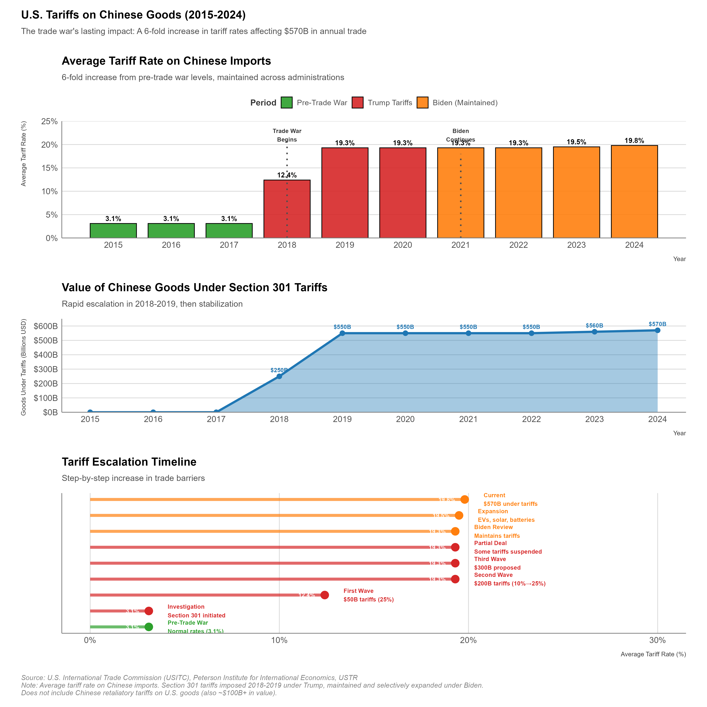
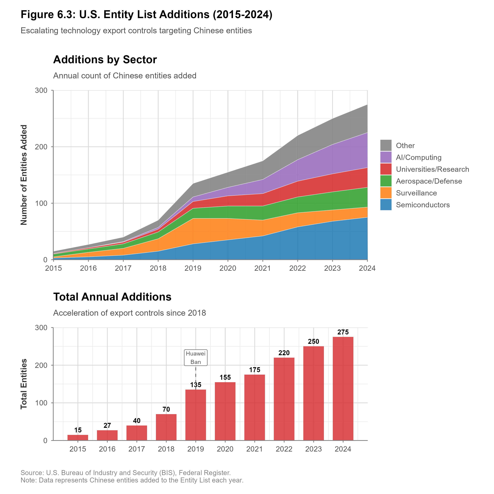

# Trade Controls and Tariffs

## Executive Summary

On March 22, 2018, President Trump signed a presidential memorandum imposing tariffs on approximately $50 billion worth of Chinese goods under Section 301 of the Trade Act of 1974, citing China's "unfair trade practices" related to technology transfer and intellectual property (USTR 2018). China immediately retaliated with equivalent tariffs on U.S. agricultural products, aircraft parts, and automobiles. What began as targeted measures escalated over 18 months into tariffs affecting more than $360 billion in bilateral trade—the largest trade war between major economies since the Smoot-Hawley Tariff of 1930. The era of "free trade as shared prosperity" was over; the era of "trade as strategic weapon" had begun. When the Biden administration took office in January 2021, it maintained nearly all Trump-era tariffs while expanding export controls, signaling a bipartisan consensus that traditional trade policy had transformed into a tool of strategic competition.

Trade controls—tariffs, quotas, and export restrictions—occupy unique territory among economic weapons. Financial sanctions can freeze bank accounts with a keystroke. Investment screening blocks individual transactions. But trade controls reshape entire industries and disrupt the daily operations of millions of businesses and workers. They are blunt instruments with broad collateral damage—which makes their proliferation in strategic competition all the more consequential.

**First, trade policy has evolved from primarily economic objectives to strategic competition tools.** Historically, tariffs served revenue generation and infant industry protection. Today's trade measures increasingly target specific countries and technologies for national security reasons, blurring traditional distinctions between economic policy and security policy. Section 232 steel tariffs (ostensibly for national security) and Section 301 China tariffs (for technology competition) exemplify this transformation.

**Second, the multilateral trade architecture built after World War II is eroding under strategic competition pressures.** The World Trade Organization's dispute resolution system faces paralysis as major powers ignore rulings or block appellate appointments. Export control regimes like the Wassenaar Arrangement struggle to adapt to dual-use technologies where commercial and military applications are inseparable. This erosion creates uncertainty but also flexibility for states pursuing coercive trade policies.

**Third, effectiveness of trade-based coercion is highly context-dependent.** Tariffs may redistribute trade flows without compelling behavioral change. Export controls can slow adversary capabilities if multilaterally coordinated but leak through third countries if unilateral. Success depends on market concentration, substitutability, alliance coordination, and the target's tolerance for economic pain. Understanding these dynamics helps policymakers design more effective measures and anticipate responses.

The analysis moves from tariff mechanisms and trade wars through export control regimes, multilateral versus unilateral approaches, and WTO compliance challenges. Government Tools Boxes detail the legal authorities underpinning U.S. trade controls (Section 232, Section 301, Export Administration Regulations). Case studies examine the U.S.-China trade war (2018-present) and CoCom export controls against the Soviet Union, with Chinese perspectives on counter-coercion woven throughout.

---

## Tariffs and Trade Wars

Tariffs—taxes on imported goods—represent the oldest form of trade policy, predating modern states. Yet their function has transformed dramatically. Through the 19th century, tariffs primarily generated government revenue (comprising 80-95% of U.S. federal revenue until the income tax). In the early 20th century, they protected infant industries from foreign competition. Today, tariffs increasingly serve as coercive instruments targeting specific countries to compel policy changes or degrade adversary capabilities. This section examines modern tariff mechanisms, their evolution into tools of economic statecraft, and effectiveness in achieving strategic objectives.

### Legal Authorities for U.S. Tariffs

The United States employs multiple statutory authorities to impose tariffs, each with distinct procedural requirements, substantive standards, and strategic applications. Three statutes have been central to the trade war era (detailed legal analysis of each appears in the Government Tools Boxes later in this chapter):

**Section 232 of the Trade Expansion Act of 1962** (19 U.S.C. § 1862) authorizes the President to adjust imports threatening national security—a remarkably broad authority requiring no congressional approval. The Trump administration expansively interpreted "national security" to include economic security, using Section 232 to impose 25% tariffs on steel imports (March 2018) and 10% on aluminum imports, affecting imports from close allies including the European Union, Canada, and Mexico. The Biden administration maintained these tariffs while negotiating exceptions for allies, demonstrating bipartisan acceptance of broad Section 232 application. (See *Government Tools Box 1: Section 232 of the Trade Expansion Act.*)


**Precedent Alert: The "National Security" Loophole**
The Trump administration's broad interpretation of "national security" under Section 232 set a dangerous precedent. By including economic security and industrial base concerns, this interpretation opened the door for virtually any import restriction to be justified on national security grounds. Other countries have since followed suit, invoking similar security exceptions for their own trade restrictions—eroding the rules-based trading system that the U.S. itself built.


**Section 301 of the Trade Act of 1974** (19 U.S.C. § 2411) authorizes the U.S. Trade Representative to investigate and take action against foreign trade practices that are "unjustifiable," "unreasonable," or "discriminatory." Unlike Section 232's national security focus, Section 301 targets unfair trade practices—intellectual property violations, forced technology transfer, market access denials—and was the primary legal authority for the U.S.-China trade war. The Trump administration's August 2017 Section 301 investigation into China's technology transfer practices culminated in tariffs affecting over $360 billion in Chinese imports (USTR 2018; Bown and Kolb 2021)—the largest Section 301 action in history. (See *Government Tools Box 2: Section 301 of the Trade Act of 1974.*)

**Section 201 of the Trade Act of 1974** (19 U.S.C. § 2251) provides "safeguard" relief for domestic industries seriously injured by imports, regardless of whether foreign practices are unfair. The International Trade Commission investigates injury claims and recommends remedies; the President decides whether to impose restrictions. Recent applications include solar panel tariffs (2018, later mostly removed) and washing machine tariffs (2018-2023). Section 201 applies on a most-favored-nation basis (affecting all countries), unlike the country-specific targeting possible under Section 232 or 301.

### The U.S.-China Trade War: Escalation and Impacts

<figure class="book-figure">
  
  <figcaption>Figure 6.1: U.S.-China tariff rates and trade flows from 2018-2024, showing the escalation of the trade war.</figcaption>
</figure>

The 2018-present U.S.-China trade war illustrates modern tariff-based coercion dynamics. What began as targeted technology-sector tariffs escalated through tit-for-tat retaliation into economy-wide restrictions affecting consumer goods, agricultural products, and industrial inputs.

**Phase 1: Initial Escalation (2018)**

- **July 2018**: U.S. imposes 25% tariffs on $34 billion of Chinese goods (machinery, electronics)
- **August 2018**: Additional $16 billion in U.S. tariffs; China retaliates equivalently
- **September 2018**: U.S. imposes 10% tariffs on $200 billion in Chinese goods (consumer products, textiles)
- **December 2018**: 90-day truce announced at G20; China agrees to purchase more U.S. agricultural products

By year-end, U.S. tariffs affected $250 billion in Chinese imports; Chinese retaliatory tariffs affected $110 billion in U.S. exports. U.S. tariffs averaged 12% on Chinese goods (up from 3% pre-escalation); Chinese tariffs averaged 18% on U.S. goods (up from 8%) (Bown and Kolb 2021; PIIE 2019).

**Phase 2: Maximum Pressure (2019)**

- **May 2019**: U.S. raises tariffs on $200 billion tranche from 10% to 25% as negotiations stall
- **June 2019**: Trump threatens tariffs on remaining $300 billion in Chinese imports
- **August 2019**: China allows yuan to depreciate below 7.0 per dollar; U.S. Treasury designates China a "currency manipulator"
- **September 2019**: U.S. imposes 15% tariffs on $112 billion (consumer electronics, apparel, footwear); delays tariffs on remainder

Peak U.S. tariff levels: 25% on $250 billion in imports, 15% on $112 billion, affecting $362 billion total (66% of U.S. imports from China). China retaliated with tariffs ranging from 5% to 25% on $185 billion in U.S. exports (over 70% of U.S. exports to China).

**Phase 3: "Phase One" Agreement (2020)**

On January 15, 2020, the U.S. and China signed the "Economic and Trade Agreement Between the United States of America and the People's Republic of China" (Phase One Agreement), featuring:

- Chinese commitments to purchase $200 billion in additional U.S. goods and services over 2020-2021 (agriculture, manufactured goods, energy, services)
- Intellectual property protections for patents, trademarks, copyrights
- Technology transfer provisions prohibiting forced transfers
- Financial services market access
- Enforcement mechanism allowing tariff retaliation for non-compliance

In exchange:
- U.S. canceled planned December 2019 tariff increases
- U.S. reduced September 2019 tariff tranche from 15% to 7.5%
- U.S. maintained 25% tariffs on $250 billion in Chinese goods

COVID-19 pandemic derailed implementation. China purchased only 58% of committed goods in 2020 and 71% over 2020-2021 combined—a $140 billion shortfall (Bown 2022). Neither side invoked enforcement provisions, effectively rendering the agreement dormant by 2022.

**Phase 4: Biden Continuity and Expansion (2021-2024)**

The Biden administration conducted a Section 301 tariff review in 2021-2022, maintained nearly all Trump-era tariffs, and implemented targeted escalations:

- **May 2022**: Removed tariffs on 352 excluded product categories (mainly inputs for U.S. manufacturers)
- **September 2022**: Initiated a new Section 301 investigation into China's semiconductor, maritime, and logistics policies
- **May 2024**: Announced major tariff increases for strategic sectors (including EVs, batteries, solar cells, steel/aluminum, and selected medical products)
- **September 27, 2024**: Finalized staged Section 301 rate increases, with some increases scheduled to take effect on January 1, 2025

**Phase 5: Trump Second-Term Administrative Adjustment (January 2025-March 2026)**

After inauguration on **January 20, 2025**, the second Trump administration kept the core Section 301 architecture and adjusted implementation at the margin:

- **January 1, 2025 (effective date)**: Additional staged rate increases from the September 27, 2024 determination took effect
- **November 2025-March 2026**: The Trump administration suspended the proposed Section 301 maritime/logistics action for one year (through November 10, 2026) while extending certain machinery exclusions through November 10, 2026

As of early 2026, the core tariff architecture remains in place: U.S. Section 301 tariffs still cover roughly the same broad Chinese import basket as in 2018-2024, while Chinese retaliatory tariffs still affect most U.S. goods exports to China. The policy mix has shifted toward higher rates in strategic sectors and narrower, time-limited exclusions.

### Economic Impacts of the Trade War

Assessing trade war impacts requires distinguishing direct effects (tariff incidence) from indirect effects (supply chain reconfiguration, uncertainty).

**Trade Flow Changes**

U.S. imports from China fell from $539.5 billion (2018) to $452.2 billion (2019), a 16.2% decline (U.S. Census Bureau 2020). However:
- Much trade diverted through third countries: U.S. imports from Vietnam surged 36% (2018-2019), from Mexico 10%, from Taiwan 25% (U.S. Census Bureau 2020; UN Comtrade 2020)
- Some products (furniture, electronics) saw minimal import decline despite 25% tariffs, suggesting Chinese exporters absorbed costs through price cuts or U.S. importers accepted higher prices
- Total U.S. imports declined only 1.7% (2018-2019), indicating trade diversion rather than import reduction

Chinese imports from U.S. fell from $134 billion (2017) to $107 billion (2019), a 20% decline concentrated in agriculture:
- U.S. soybean exports to China fell 75% (2018-2019) as China sourced from Brazil
- Aircraft deliveries fell 47%
- Energy product exports fell 54%

**Incidence: Who Paid the Tariffs?**

Economic theory predicts tariff incidence depends on elasticities of demand and supply. Empirical studies found:

- **Amiti, Redding, and Weinstein (2019, AER)**: U.S. tariffs had complete pass-through to U.S. import prices; negligible reduction in Chinese export prices. U.S. consumers and firms bore nearly 100% of tariff costs.
- **Fajgelbaum et al. (2020, JPE)**: Aggregate U.S. real income fell 0.04% from tariffs and Chinese retaliation combined. Costs distributed unevenly: import-competing industries gained; import-using industries and consumers lost.
- **Flaaen and Pierce (2019, Fed Working Paper)**: Manufacturing employment in tariff-protected industries showed no significant increase; employment in tariff-affected input-using industries declined.
- **Cavallo et al. (2021, AEJ)**: Retail prices for tariffed goods rose nearly one-for-one with tariffs; no evidence of Chinese exporters reducing prices or U.S. retailers absorbing costs.

The uncomfortable conclusion: U.S. tariffs functioned as a domestic tax on U.S. consumers and firms, not as costs imposed on China. Chinese tariffs similarly represented Chinese taxes on Chinese consumers. Each country was punching itself in the face, insisting the other would soon cry uncle.


**Who Actually Pays Tariffs?**
Contrary to political rhetoric suggesting tariffs "punish" foreign exporters, economic research consistently finds that U.S. consumers and businesses bear nearly 100% of tariff costs. Chinese exporters did not lower their prices to absorb the tariffs. Instead, American importers paid the full tariff amount, passing costs to consumers through higher retail prices. The average U.S. household paid an estimated $800-1,300 annually in additional costs from trade war tariffs.


**Supply Chain Reconfiguration**

Beyond static trade impacts, tariffs accelerated supply chain reconfiguration. Multinational firms adopted **"China+1" strategies**, diversifying production to Vietnam, Thailand, India, and Mexico to avoid tariffs—Apple, Samsung, Intel, Dell, and HP all announced production shifts. Many of these moves proved permanent: sunk costs of relocating production mean that even if tariffs were removed, Flaaen and Pierce (2024) estimate 30-40% of trade flow changes are irreversible. The shift produced clear winners and losers. Vietnam's exports to the U.S. surged from $49 billion (2017) to $115 billion (2023), making it the 8th largest U.S. trade partner, while Mexico became the largest U.S. trade partner in 2023, partly from Chinese firms routing production through Mexican plants. On the losing side, Chinese manufacturing employment growth slowed, and sectors like furniture and electronics lost global market share permanently.

**Aggregate Economic Impacts**

The macroeconomic costs were substantial across all parties. Studies estimate a 0.3-0.5% reduction in U.S. GDP from tariffs and retaliation (2018-2020) (Amiti, Redding, and Weinstein 2019; Fajgelbaum et al. 2020), with the agricultural sector suffering $27 billion in lost exports partially offset by $23 billion in government subsidies (USDA 2020; Congressional Research Service 2021) while manufacturing employment gains remained negligible. China experienced an estimated 0.5-0.8% GDP reduction, though its simultaneous growth slowdown from debt deleveraging and COVID-19 makes trade war effects difficult to isolate. Globally, the IMF (2019) estimated the trade war could reduce world GDP by 0.8% by 2020 through trade disruptions, uncertainty, and financial market impacts.

### Political Economy of Tariff-Based Coercion

Why do governments impose tariffs despite clear evidence that their own citizens bear the costs? The answer lies not in economics but in politics:

**Concentrated Benefits, Diffuse Costs**

Tariff protection concentrates benefits on specific industries (steel, aluminum, manufacturing) while spreading costs across all consumers. Protected industries lobby intensively and contribute to political campaigns; consumers rarely mobilize against small price increases on individual products. This asymmetry makes tariff imposition politically attractive even when aggregate costs exceed benefits.

**Symbolic Politics and Nationalism**

Tariffs signal toughness on foreign competition and protection of domestic workers. Trump's "America First" trade rhetoric resonated with voters in manufacturing-heavy swing states (Pennsylvania, Michigan, Wisconsin) that decided the 2016 election. Biden maintained tariffs to avoid appearing "soft on China"—a politically toxic position in contemporary U.S. politics.

**Retaliation Dynamics**

Once one country imposes tariffs, the target faces domestic political pressure to retaliate to avoid appearing weak. China's retaliatory tariffs on U.S. agriculture deliberately targeted Republican-voting states (Iowa, Kansas, Nebraska) to create political pressure on the Trump administration. This created a "tariff trap": each side faced domestic costs from removing tariffs without reciprocal concessions, preventing de-escalation.

**Interest Group Coalitions**

Trade wars realign political coalitions. In the U.S.:
- **Winners supporting tariffs**: Steel and aluminum producers, some manufacturing unions, economic nationalists
- **Losers opposing tariffs**: Agriculture (export-dependent), technology firms (rely on Chinese supply chains), retailers (sell Chinese consumer goods), consumers

Politically, concentrated manufacturing interests in swing states outweighed diffuse consumer interests and geographically concentrated agricultural interests, enabling tariff persistence.

### Strategic Effectiveness of Tariff-Based Coercion

Applying our four-dimension framework:

**Domain**: Trade (goods), with spillovers to investment, technology, and financial domains
**Target**: State-level (China), with differential sectoral impacts
**Objective**: Multiple overlapping objectives complicating assessment:
- **Compellence**: Force China to change IP practices, market access, subsidies (primary stated objective)
- **Containment**: Slow China's technological advancement by disrupting supply chains
- **Industrial policy**: Rebuild U.S. manufacturing and reduce dependence on China
- **Signaling**: Demonstrate resolve for broader strategic competition

**Intensity**: Level 3 (Substantial sectoral coercion)—affected majority of bilateral trade ($360 billion) but exempted many critical inputs and consumer goods; neither side pursued autarky.

**Effectiveness Assessment**:

**Target Compliance (Low)**: China made minimal structural reforms. Phase One purchase commitments went unfulfilled without consequence. IP protections in Phase One Agreement lacked enforcement mechanisms. Forced technology transfer and subsidies continued.

**Capability Degradation (Moderate)**: Supply chain shifts reduced China's market share in some sectors (furniture, textiles, some electronics). Accelerated "China+1" diversification reduced Western dependence on Chinese manufacturing. However, China retained dominance in critical industries (rare earth processing, solar panels, batteries, APIs).

**Cost Imposition (Moderate)**: Tariffs imposed direct costs (~0.5-0.8% GDP for China, 0.3-0.5% for U.S.), but China tolerated these costs without major policy concessions. Agricultural sector losses ($27 billion) created political pressure but were offset by government subsidies.

**Sustainability (Moderate)**: Both sides have sustained tariffs for roughly eight years (2018-early 2026) with no structural resolution. However, U.S. inflation (2021-2023) created pressure to remove tariffs as an anti-inflationary measure, and China's growth slowdown (2023-2025) created pressure for trade normalization.

**Collateral Damage (Moderate-High)**: U.S. consumers bore costs through higher prices. U.S. exporters (especially agriculture) suffered retaliatory tariffs. Global supply chains disrupted, reducing efficiency. Allies (EU, Japan, Korea) faced pressure to choose sides, complicating coordination.

**Overall Assessment**: The U.S.-China trade war achieved limited success in compelling Chinese structural reforms (the stated primary objective) but contributed to supply chain diversification (industrial policy objective) and signaled U.S. willingness to impose economic costs in strategic competition (signaling objective). The mismatch between stated objectives (compellence) and actual achievements (partial containment and signaling) reflects inherent limitations of tariff-based coercion against large, relatively closed economies capable of tolerating economic pain for strategic goals.

---

## Export Control Regimes

While tariffs tax imports, export controls restrict exports—prohibiting or conditioning sales of specific goods, software, or technology to specific destinations. If tariffs are a blunt hammer, export controls are a scalpel. They serve national security objectives: preventing adversaries from acquiring military capabilities, dual-use technologies (with both civilian and military applications), or technologies that could strengthen strategic competitors. Unlike tariffs' broad economic impacts, export controls surgically target specific technologies and recipients, making them precision instruments of technological competition. The catch: scalpels require precision. Aim poorly, and you cut yourself.

### Multilateral Export Control Regimes

After World War II, Western states recognized unilateral export controls could be circumvented through third countries. This drove formation of multilateral regimes coordinating members' national controls:

**Wassenaar Arrangement on Export Controls for Conventional Arms and Dual-Use Goods and Technologies**

Established 1996 as successor to Cold War-era CoCom (Coordinating Committee for Multilateral Export Controls), Wassenaar coordinates national export control policies for conventional weapons and dual-use goods. Forty-two member states (including U.S., EU members, Japan, Korea, Australia; notably excluding China, India, Israel).

**Structure and Operation**:
- Members maintain national export control systems based on common control lists
- **Munitions List**: Nine categories of conventional arms (aircraft, missiles, explosives, etc.)
- **Dual-Use List**: Nine categories of sensitive technologies (materials, electronics, computers, telecommunications, sensors, navigation, aerospace, propulsion)
- Members report licenses granted and denied to specific destinations
- Consensus decision-making for control list updates
- **Key limitation**: No binding obligation; members may grant licenses others would deny

**Control Mechanisms**:
- Individual licensing: Case-by-case review for sensitive destinations/end-users
- General licenses: Pre-approved for low-risk destinations
- Catch-all controls: Authority to block unlisted items if suspicion of weapons use

**Effectiveness and Limitations**:

Strengths:
- Harmonizes national control lists, reducing competitive disadvantages for compliant firms
- Information sharing on denied licenses prevents shopping around multiple jurisdictions
- Provides cover for politically sensitive denials ("required by international obligations")

Weaknesses:
- Consensus requirement enables lowest-common-denominator standards; any member can block list additions
- Non-binding nature means members can approve sales others oppose
- Major producers outside regime (China, India, Israel, Brazil) not bound by restrictions
- Dual-use technology definition increasingly ambiguous as digitalization blurs civilian-military boundaries


**The Dual-Use Dilemma**
The fundamental challenge of export controls is that the most powerful technologies are almost always dual-use. The same AI chips that power ChatGPT can train military targeting systems. The same gene-editing tools that cure diseases can create bioweapons. The same satellite imagery that tracks deforestation can guide precision missiles. This creates an impossible choice: restrict broadly and cripple legitimate commerce and scientific progress, or restrict narrowly and watch controlled technologies flow to adversaries through commercial channels.


**Missile Technology Control Regime (MTCR)**

Founded 1987, MTCR restricts exports of missiles, unmanned aerial vehicles, and related technology capable of delivering weapons of mass destruction. Thirty-five members committed to control transfers of:
- Category I: Complete rocket systems, unmanned aerial vehicles, and production facilities (strong presumption of denial for transfers)
- Category II: Rocket components, materials, and technologies (case-by-case licensing)

Threshold: Systems capable of delivering 500kg payload to 300km range.

MTCR successfully constrained proliferation of long-range missiles to non-members (North Korea, Iran, Pakistan remain outside). However, proliferation of short-range systems (drones, cruise missiles below threshold) continues, and emerging hypersonic technologies challenge 1980s-era definitions.

**Nuclear Suppliers Group (NSG)**

Created 1975 after India's nuclear test, NSG coordinates export controls on nuclear materials, equipment, and technology. Forty-eight members (including nuclear weapon states plus major suppliers) control:
- **Part 1 (Trigger List)**: Materials and equipment especially designed for nuclear use (enrichment, reprocessing, heavy water)
- **Part 2 (Dual-Use List)**: Materials, equipment, and technology with nuclear and non-nuclear applications

NSG operates by consensus. Its effectiveness shown by successful isolation of North Korea's nuclear program and substantial constraints on Iran's. However, China's admission (2004) and Russia's participation create complications when proliferation concerns conflict with strategic interests (e.g., Chinese nuclear cooperation with Pakistan, Russian cooperation with Iran).

**Australia Group (AG)**

Established 1985 after Iraqi chemical weapons use, AG coordinates export controls on chemical and biological weapons precursors and equipment. Forty-three members control:
- Chemical weapons precursors (dual-use chemicals)
- Biological agents and toxins
- Chemical/biological production equipment (fermenters, aerosol systems, specialized protective equipment)

AG faces fundamental challenge: Most controlled chemicals and equipment have legitimate commercial uses (pharmaceuticals, agriculture, research). Overly broad controls impede legitimate commerce; narrow controls enable proliferation. Balance remains contested.

**Common Challenges Across Regimes**

1. **Dual-use technology expansion**: Digitalization, AI, quantum technologies blur civilian-military boundaries. Commercial AI chips used for both consumer applications and military systems. Quantum computers enable cryptography and code-breaking. Biotechnology serves medicine and bioweapons. Traditional category-based controls struggle.

2. **Non-member producers**: China's exclusion from most regimes increasingly problematic as it becomes major technology producer. India, Israel, Brazil, and others export without multilateral constraints. Regime effectiveness erodes as non-members' market share grows.

3. **Intangible technology transfer**: Traditional controls focused on physical exports. Modern technology transfer occurs through digital communications, cloud computing, remote access, and personnel mobility. Controlling intangible technology without impeding scientific collaboration proves difficult.

4. **Enforcement variation**: Members vary enormously in enforcement resources and political will. Small states with limited enforcement capacity create transshipment vulnerabilities. Some members prioritize commercial interests over nonproliferation.

5. **Update lag**: Control lists update slowly (annual at best) while technology evolves rapidly. Emerging technologies (AI, quantum, synthetic biology) lack agreed definitions and control parameters.

### U.S. Unilateral Export Controls: The Export Administration Regulations

The United States maintains the world's most extensive unilateral export control system, codified in the **Export Administration Regulations (EAR)**, 15 C.F.R. Part 730 et seq. The Commerce Department's Bureau of Industry and Security (BIS) administers EAR based on statutory authority from the **Export Control Reform Act of 2018** (ECRA), 50 U.S.C. § 4801 et seq. (For detailed legal analysis of EAR authorities, jurisdiction, enforcement, and the Entity List, see *Government Tools Box 3: Export Administration Regulations and Entity List.*)

<figure class="book-figure">
  
  <figcaption>Figure 6.3: Entity List additions by administration, showing the growth of export control restrictions.</figcaption>
</figure>

**Scope of EAR Jurisdiction**

EAR applies extraordinarily broadly:

1. **U.S.-origin items**: All items (commodities, software, technology) exported from the United States
2. **Foreign-made items incorporating U.S. content**: Items made abroad incorporating controlled U.S.-origin components above de minimis thresholds (typically 25%, lower for military items)
3. **Foreign Direct Product (FDP) Rule**: Foreign-made items produced using U.S.-origin technology or software, even if containing no U.S. components
4. **U.S. persons**: U.S. citizens, permanent residents, and U.S. entities subject to EAR regardless of location

This extraterritorial reach makes EAR a powerful tool: U.S. can restrict foreign sales of foreign-made goods if they contain U.S. technology or were produced using U.S. equipment.

**Commerce Control List (CCL)**

EAR controls items listed on the CCL, organized into ten categories:
- 0: Nuclear materials, facilities, and equipment
- 1: Materials, chemicals, microorganisms, and toxins
- 2: Materials processing
- 3: Electronics
- 4: Computers
- 5: Telecommunications and information security
- 6: Sensors and lasers
- 7: Navigation and avionics
- 8: Marine
- 9: Aerospace and propulsion

Each entry includes:
- **Export Control Classification Number (ECCN)**: Identifies specific item
- **Reasons for Control**: National security (NS), missile technology (MT), regional stability (RS), chemical/biological weapons (CB), crime control (CC), etc.
- **License Requirements**: Destinations requiring licenses for export
- **License Exceptions**: Circumstances allowing export without individual license

Items not on CCL are designated **EAR99**—low-technology consumer goods generally exportable without licenses (except to embargoed destinations).

**Entity List: Targeted Denials**

The **Commerce Department's Entity List** (Supplement No. 4 to Part 744 of the Export Administration Regulations) identifies foreign entities subject to specific license requirements due to proliferation concerns, weapons development, human rights violations, or other national security threats. The China-focused portion of the list has continued to expand; in March 2025 alone, BIS added 80 entities globally, with more than 50 entries from China, including:

- **Huawei Technologies** (2019): Telecommunications equipment and services, security and foreign policy concerns
- **SMIC (Semiconductor Manufacturing International Corporation)** (2020): China's leading chip manufacturer, military diversion risk
- **YMTC (Yangtze Memory Technologies Corporation)** (2022): Memory chip manufacturer
- **Hikvision, Dahua** (2019): Surveillance equipment manufacturers, complicity in Xinjiang human rights violations
- **Leading Chinese AI firms** (SenseTime, Megvii, CloudWalk, iFlytek): Facial recognition and surveillance technologies

Entity List designation requires licenses for exports of specified items (often all EAR-controlled items); licenses carry presumption of denial. This effectively operates as an export ban for most controlled technologies.


**The Ultimate Chokepoint: EDA Software**
Electronic Design Automation (EDA) software—essential for designing any advanced semiconductor—represents perhaps the most powerful chokepoint in the technology ecosystem. Three American companies (Synopsys, Cadence, and Siemens EDA/Mentor Graphics) control approximately 100% of the market for advanced chip design tools. Without EDA software, no country can design cutting-edge semiconductors, regardless of their manufacturing capabilities. This near-total monopoly gives the U.S. extraordinary leverage that even China's massive investments cannot quickly overcome.


**Foreign Direct Product Rule Expansion**

The FDP Rule traditionally applied narrowly to items directly produced by U.S. technology. In May 2020, BIS expanded the FDP Rule specifically targeting Huawei, restricting foreign semiconductor manufacturers from selling chips to Huawei if:

1. Chips designed by Huawei using U.S. software (e.g., Electronic Design Automation tools from Synopsys, Cadence)
2. Chips manufactured using U.S.-origin equipment (e.g., Applied Materials, Lam Research, KLA lithography systems)

This expansion effectively cut Huawei off from Taiwan's TSMC (which uses U.S. equipment) despite TSMC being a foreign company selling foreign-made products. TSMC immediately ceased accepting new Huawei orders.

October 2022 semiconductor export controls extended FDP principles broadly: Foreign fabs using U.S. equipment cannot produce advanced chips (< 16nm) for Chinese customers without licenses (presumption of denial). This extraterritorial assertion of control over foreign production represents unprecedented expansion of export control jurisdiction.

**Penalties and Enforcement**

EAR violations carry severe consequences:

- **Civil penalties**: Up to $330,000 per violation or twice transaction value, whichever is greater
- **Criminal penalties**: Willful violations up to $1 million per violation and 20 years imprisonment
- **Denial orders**: Prohibition on export privileges (receiving U.S. exports or participating in export transactions)

Major recent enforcement actions:
- **ZTE Corporation (2017)**: $1.19 billion penalty for violating Iran/North Korea sanctions, plus seven-year suspended denial order; later imposed (2018) before negotiated settlement
- **Huawei (2020-present)**: Indictments for sanctions evasion, trade secret theft; effective export denial through Entity List
- **Fujian Jinhua (2018)**: Entity List addition for DRAM technology theft; company operations suspended

**2018 Export Control Reform Act (ECRA)**

ECRA codified and strengthened export controls, adding focus on "emerging and foundational technologies" essential to U.S. national security:

- **Emerging technologies**: Biotechnology, AI/machine learning, position/navigation/timing, microprocessor technology, advanced computing, quantum information/sensing, logistics technology, additive manufacturing, robotics, brain-computer interfaces, hypersonics, advanced materials, advanced surveillance
- **Foundational technologies**: Technologies emerging from or enabling emerging technologies (interpreted broadly)

ECRA directed Commerce to establish controls for these technologies in coordination with Defense, State, and Energy departments. Implementation proceeded slowly due to definitional challenges and industry opposition. As of early 2026, controls are established for key categories (advanced AI chips, semiconductor manufacturing equipment, quantum-related items, and some additive manufacturing), but many emerging technologies still face scope and definitional ambiguity.

### Technology-Specific Controls: Semiconductor Case Study

Semiconductor export controls illustrate how EAR authorities operate in practice. Advanced semiconductors enable AI, quantum computing, autonomous weapons, and supercomputers—dual-use technologies where the commercial/military distinction collapses entirely. Controls evolved from targeted entity restrictions (2019-2021) through comprehensive capability-based controls (October 2022) to multilateral coordination with the Netherlands and Japan (2023-2025). Chapter 4 provides a detailed analysis of this evolution, including strategic logic, allied coordination dynamics, Chinese responses, and effectiveness assessment.

From an export control architecture perspective, the semiconductor case demonstrates both the power and limits of EAR authorities: ECCN-based controls can restrict specific technological capabilities, the FDPR can extend jurisdiction extraterritorially, and Entity List designations can target specific actors—but effectiveness depends on allied coordination that lies beyond any single government's legal authority.

### Lessons from Cold War Export Controls: CoCom

Historical parallels inform current challenges. The Coordinating Committee for Multilateral Export Controls (CoCom, 1949-1994) coordinated Western export controls denying Soviet bloc access to advanced technologies.

**Structure**:
- Seventeen members (NATO minus Iceland, plus Japan, Australia)
- Maintained embargo lists (munitions, atomic energy, dual-use industrial/commercial items)
- Consensus decision-making
- Informal regime (no treaty, no secretariat, no binding enforcement)

**Challenges**:
- **Free-riding**: Members had incentives to cheat for commercial gain. France, Italy particularly prone to approving sales others denied.
- **Technology diffusion**: Civilian technologies proliferated beyond control (computers, telecommunications). As computing spread globally, maintaining denial became impossible.
- **Non-member leakage**: Transshipment through Austria, Switzerland, Hong Kong enabled circumvention
- **Enforcement variation**: Small members (Portugal, Greece) lacked resources; some prioritized commerce over security

**Effectiveness**:

Soviet assessments after Cold War revealed CoCom imposed substantial costs:
- Delayed Soviet capabilities 5-10 years in computing, semiconductors, telecommunications
- Forced inefficient indigenous development at high cost
- Created technological lag perpetuating Soviet economic weakness

However, limitations clear:
- Soviets acquired many controlled technologies through espionage, smuggling, and legal purchases through front companies
- Rapid technological change in West meant even successful Soviet acquisition resulted in outdated technology
- CoCom could not prevent Soviet military technological development, only impose costs and delays

**Relevance to China Controls**:

Soviet case offers mixed lessons:
- Long-term comprehensive controls can impose costs and slow development
- But: Soviet Union was much smaller economically and more technologically isolated than China
- China deeply integrated in global economy and technology ecosystem; far more difficult to isolate
- Chinese tech ecosystem larger and more advanced than Soviet; closer to technological frontier
- Third countries (Taiwan, Korea, Japan) critical to semiconductor supply chains complicate coordination

---

## Multilateral Versus Unilateral Approaches

Export controls face a fundamental dilemma: Unilateral measures risk competitive disadvantage as firms lose sales to foreign competitors unburdened by restrictions, while multilateral coordination requires compromises that may dilute effectiveness. This section examines the trade-offs, exploring when unilateral action succeeds despite commercial costs and when multilateral coordination proves essential.

### The Case for Multilateral Coordination

For export controls to meaningfully constrain adversary capabilities, they must cover sufficient market share that substitutes are unavailable. In semiconductor equipment, the U.S. holds ~40% market share, Japan ~30%, and the Netherlands controls 100% of EUV lithography. Unilateral U.S. controls leave 60% of the equipment market accessible; coordinated controls close access to ~85%.

Multilateral coordination also reduces commercial disadvantage (all suppliers face the same restrictions, leveling the playing field), enhances political sustainability (firms cannot circumvent by relocating), and signals shared threat assessment rather than unilateral American action. U.S. semiconductor equipment firms lost $10-15 billion annually (2022-2024) from China restrictions—losses that generate intense lobbying for exemptions absent allied burden-sharing.

### Challenges to Multilateral Coordination

Despite these advantages, coordination faces severe obstacles. **Divergent threat perceptions**: European allies prioritize Russia, Asian allies prioritize China, and Germany's deep economic integration with China creates a different cost-benefit calculus. **Commercial lobbying**: ASML lobbied against broad lithography restrictions, Samsung and SK Hynix secured exemptions for their China fabs, and Tokyo Electron advocated for narrow controls preserving most sales. Lobbying is more effective in smaller countries where individual firms represent a larger share of the economy. **Consensus regimes** (Wassenaar, MTCR) can only adopt controls acceptable to all members, creating delay, ambiguity, and exploitable loopholes.

Example: Wassenaar took three years (2013-2016) to add intrusion software and surveillance technology controls, and final language contained exemptions enabling continued sales to authoritarian regimes.

**Free-Riding and Enforcement**

Even with formal agreement, enforcement varies:

- **Resource constraints**: Small countries lack personnel and budgets for robust export control enforcement
- **Priority mismatches**: Countries prioritizing counterterrorism may underinvest in nonproliferation enforcement
- **Corruption**: In some jurisdictions, bribes enable license approvals regardless of formal policies
- **Third-country transshipment**: Non-member countries (Singapore, UAE, Hong Kong historically) facilitate re-export to restricted destinations

These gaps enable circumvention: Goods exported legally to intermediary countries are re-exported illegally to restricted end-users.

### When Unilateral Action Works

Despite challenges, unilateral export controls can succeed when specific conditions obtain:

**Technological Monopoly or Oligopoly**

When one country (or small group) dominates production of critical inputs, unilateral controls can be effective:

- **EDA software (U.S.)**: Synopsys, Cadence, Mentor Graphics control ~100% of advanced electronic design automation software essential for chip design. Chinese designers cannot create advanced chips without this software. U.S. unilateral controls effectively block Chinese access.
- **EUV lithography (Netherlands/ASML)**: Only producer of EUV lithography equipment essential for sub-7nm chip production. Dutch unilateral controls (coordinating with U.S.) block Chinese advanced chip manufacturing.
- **Advanced AI chips (U.S.)**: Nvidia and AMD dominate high-end AI accelerators. China's Huawei, Biren, Hygon cannot match performance. Unilateral U.S. controls significantly constrain Chinese AI development.

**Network Effects and Standards**

Technologies with strong network effects create lock-in that unilateral controls can exploit:

- **Software ecosystems**: U.S. dominance in operating systems (Windows, iOS, Android), cloud platforms (AWS, Azure, Google Cloud), and enterprise software creates dependencies difficult to replace. Denying access imposes significant costs.
- **Financial infrastructure**: SWIFT messaging system for international payments based in Belgium but dollar-dominated. U.S. can unilaterally threaten SWIFT access (secondary sanctions) to pressure intermediaries.
- **Internet infrastructure**: While fragmented, U.S. firms still dominant in critical internet infrastructure (DNS, CDNs, submarine cables). Unilateral restrictions on these could impose costs (though also harm U.S. interests and face significant retaliation).

**Strategic Goods with Limited Substitutability**

Some goods lack ready substitutes due to technical complexity or economies of scale:

- **Rare earth processing** (China): Despite rare earths mined globally, China processes 85%. Chinese export restrictions force others to develop processing (slow, expensive, environmentally challenging) or pay premium prices.
- **Pharmaceutical precursors**: Consolidation of API production in China/India creates dependencies exploitable through export restrictions
- **Specialized aerospace components**: Single-source suppliers for certain aircraft and satellite components enable unilateral controls

**Speed and Surprise**

Multilateral coordination is slow. When rapid action necessary to prevent imminent threat, unilateral moves may be only option:

- Emergency controls to block arms sales to conflict zones
- Preventing technology acquisition during crisis (e.g., blocking semiconductor sales if Taiwan Strait crisis escalates)
- Responding to sudden threat discovery (e.g., evidence of weapons program breakthrough)

After crisis passes, unilateral measures can be multilateralized through subsequent negotiations.

### Hybrid Approaches: Coalitions of the Willing

Recent U.S. strategy increasingly employs "coalitions of the willing"—not full multilateral regimes but informal coordination among key players:

**Chip 4 Alliance**

Proposed U.S.-Japan-Korea-Taiwan semiconductor coordination to:
- Align export controls and investment screening
- Coordinate R&D on next-generation technologies (post-silicon, 3D chips, quantum)
- Build resilience through diversified production
- Share threat intelligence on Chinese acquisition attempts

Status: Informal discussions ongoing; formal alliance resisted by Korea and Taiwan fearing Chinese economic retaliation.

**Technology 7 (T-7)**

U.S., Japan, Korea, Netherlands, Taiwan, and key EU members coordinating on export controls for critical technologies:
- Semiconductor manufacturing equipment
- Advanced computing
- AI systems
- Quantum technologies

Advantage over formal regimes: Smaller group enables faster decision-making and tighter coordination. Excludes members unlikely to support strict controls (Germany initially resistant).

Disadvantage: Lack of institutional structure reduces sustainability; dependent on aligned political leadership across members.

**Limits of Coalitions**

Even coalitions face coordination challenges:

- **Exemptions and loopholes**: Korea secured exemptions for Samsung/SK Hynix China operations; Netherlands limited ASML restrictions; Japan delayed implementation to allow sales completion
- **Transshipment**: Singapore, Malaysia, UAE, Mexico enable re-export to China; coalition members lack extraterritorial enforcement in third countries
- **Technology evolution**: As Chinese firms move toward indigenous alternatives (RISC-V, domestic EDA, domestic equipment), coalition controls become less effective

### China's Retaliation: Counter-Controls and Unreliable Entity List

Chinese counter-coercion illustrates retaliation dynamics:

**Export Control Law (2020)**

China enacted Export Control Law (2020) establishing authority to:
- Control exports of dual-use items, military items, and nuclear items
- Implement end-user and end-use controls
- Conduct temporary controls on items not on control lists if national security risk
- Prohibit exports to entities violating export control obligations or threatening national security/interests

**Specific Controls**:

- **Rare earth export restrictions** (2023): Controls on gallium and germanium (used in semiconductors, solar cells, fiber optics). China produces 94% of global gallium, 83% of germanium (USGS 2024). Restrictions raised prices and forced Western firms to stockpile.
- **Graphite restrictions** (2023): Controls on certain graphite materials essential for lithium-ion battery anodes. China controls 65% of global graphite mining, 90% of processing (USGS 2024).
- **Antimony restrictions** (2024): Controls on antimony (used in semiconductors, solar panels, batteries, ammunition). China produces 48% globally, processes 63% (USGS 2024).

**Unreliable Entity List (不可靠实体清单, bù kě kào shítǐ qīngdān)**

Announced 2019, implemented 2021, China's Unreliable Entity List targets foreign entities that:
- Endanger China's national sovereignty, security, or development interests
- Block or cut supplies to Chinese entities for non-commercial purposes
- Discriminate against Chinese entities in violation of market rules

Listed entities face:
- Restrictions on trade with China
- Prohibitions on investment in China
- Denial of work permits for personnel
- Fines and other penalties

As of early 2026, only a limited number of entities have been publicly listed (including U.S. defense firms linked to Taiwan arms sales), but the threat is used to deter foreign compliance with U.S. restrictions. Many firms face a difficult choice: comply with U.S. export controls (and risk Chinese market losses) or maintain China ties (and risk U.S. penalties).

**Effectiveness of Chinese Counter-Controls**

Chinese retaliation less effective than U.S. controls due to:

1. **Substitutes exist**: For most Chinese-controlled materials (rare earths, graphite, gallium), alternatives available or can be developed, albeit at higher cost and longer timelines
2. **Limited technology monopolies**: China lacks monopoly position in critical enabling technologies comparable to U.S./Allied position in semiconductors, AI, aerospace
3. **Autarky costs**: Restricting exports harms Chinese producers and creates incentives for foreign firms to develop alternatives, reducing long-term leverage

However, near-term disruptions real: Gallium/germanium restrictions caused 6-12 month supply disruptions and 20-30% price increases. For firms with thin margins or just-in-time inventory, temporary disruptions can be severe.

---

## WTO Compliance and the Erosion of the Trading System

The World Trade Organization embodies post-1945 liberal international economic order: rules-based system constraining states' unilateral trade restrictions. Yet U.S.-China strategic competition increasingly operates outside or in explicit violation of WTO commitments. This section examines how national security exceptions, dispute resolution dysfunction, and great power prerogatives undermine multilateral trade law.

### WTO Rules on Trade Restrictions

**General Prohibition on Quantitative Restrictions**

GATT Article XI prohibits "prohibitions or restrictions other than duties, taxes or other charges" on imports or exports. This seemingly prohibits export controls and quotas. However:

**Article XXI: Security Exception**

GATT Article XXI allows states to take actions "necessary for the protection of [essential security interests]" including:
- (a) Preventing disclosure of information contrary to essential security interests
- (b) Relating to fissionable materials or materials from which they are derived
- (c) Taken in time of war or other emergency in international relations

Article XXI is self-judging: States determine what constitutes "essential security interests." This creates enormous loophole: Any trade restriction can be justified as national security measure.

Historically, states exercised restraint in invoking Article XXI to avoid undermining the trading system. U.S. Section 232 steel/aluminum tariffs (2018) expansively defined "national security" to include economic security, breaking this norm. Other states followed: India invoked Article XXI for information technology controls, Russia for transit restrictions, UAE for Qatar blockade.

**Article XX: General Exceptions**

GATT Article XX permits restrictions "necessary to protect public morals," "protect human, animal or plant life or health," or "relating to conservation of exhaustible natural resources." States invoked Article XX to justify:

- Environmental regulations restricting hazardous material imports
- Public health measures (e.g., COVID-19 medical equipment export restrictions)
- Sanctions on goods produced with forced labor

However, Article XX requires restrictions be "not applied in a manner which would constitute... arbitrary or unjustifiable discrimination" and "not a disguised restriction on international trade." Proving necessity and non-discrimination proves difficult; many measures struck down.

### Dispute Resolution Breakdown

**The Appellate Body Crisis**

WTO dispute resolution previously constrained unilateral actions: Members could challenge restrictions, and Dispute Settlement Body rulings (including Appellate Body appeals) were binding. This system collapsed:

- **U.S. blocking Appellate Body appointments** (2017-2020): Trump administration blocked new member appointments, citing concerns over Appellate Body overreach, inconsistent interpretation, and failure to meet 90-day deadlines. By December 2019, Appellate Body fell below minimum three members required to hear appeals, effectively ceasing function.

- **Rationale**: U.S. criticized Appellate Body for treating prior reports as precedent (not required by WTO Agreement), engaging in advisory opinions beyond case requirements, and second-guessing national determinations (especially in trade remedy cases). Critics saw this as pretext; real objective was preventing adverse rulings on U.S. national security tariffs and other measures.

**Consequences**:

Without functioning Appellate Body:
- Panel reports can be appealed "into the void"—no resolution
- Losing parties appeal all adverse rulings, preventing enforcement
- System reverts to diplomatic negotiation without binding arbitration
- Powerful states (especially U.S., China) face no constraints


**Dispute Resolution Paralysis**
The collapse of the WTO Appellate Body represents one of the most consequential developments in international economic law since World War II. Without binding dispute resolution, the rules-based trading system that the U.S. championed for 75 years has effectively reverted to power politics. Any country can now violate WTO commitments, appeal the ruling, and face no consequences. The irony is profound: the United States disabled the very system it built to constrain others' trade violations.


**Multi-Party Interim Appeal Arbitration Arrangement (MPIA)**

EU, China, Canada, and 25+ other members created alternative arbitration mechanism (2020) using WTO arbitration provisions. However:
- U.S. refuses to participate
- China participates selectively
- Limited to disputes among MPIA members
- Lacks legitimacy and enforcement power of formal Appellate Body

### Major Trade Disputes and Weak Enforcement

**U.S. Section 232 Tariffs (Steel and Aluminum)**

EU, Canada, Mexico, China, Japan, Korea, and others filed WTO challenges to U.S. Section 232 national security tariffs (2018):

- **Complainant arguments**: Tariffs not justified by Article XXI; economic security is not essential security interest; no emergency in international relations; tariffs actually protect domestic industries (disguised protectionism)
- **U.S. response**: Article XXI self-judging; WTO has no authority to review U.S. national security determinations; defending Article XXI as self-judging essential to U.S. sovereignty

**Panel rulings** (2022):
- Norway-U.S. and China-U.S. panels ruled against U.S., finding tariffs not justified by Article XXI
- Panels held Article XXI not completely self-judging; "taken in time of war or other emergency" must be objectively verified
- Ruled no evidence of emergency justifying steel/aluminum tariffs

**U.S. response**: Appealed to non-functioning Appellate Body, effectively nullifying panel rulings. Maintained tariffs. Signaled WTO dispute resolution irrelevant for great power trade policies.

**U.S. Section 301 Tariffs on China**

China challenged U.S. Section 301 tariffs (2018) arguing:
- Tariffs exceed bound tariff rates (U.S. committed to maximum tariffs in WTO accession)
- Not justified by Article XXI (no security emergency)
- Not justified by Article XX (not necessary for public morals or health)
- Violate dispute settlement understanding (U.S. unilaterally determined violations and imposed remedies rather than using WTO dispute process)

**Panel and appellate status** (2020-present):
The WTO panel report in the Section 301 dispute was circulated on September 15, 2020 and found against the United States on key claims. The U.S. appealed on October 26, 2020 to a non-functioning Appellate Body ("appeal into the void"), preventing adoption and enforcement. The case has become a central example of dispute-settlement paralysis in the post-Appellate-Body era.

**China's Technology Transfer and Subsidy Practices**

U.S., EU, and Japan filed multiple WTO cases against Chinese:
- Forced technology transfer requirements for market access
- Discriminatory licensing restrictions
- Indigenous innovation subsidies favoring domestic firms
- Lack of intellectual property protection

Some cases succeeded:
- **China—Intellectual Property Rights** (2009): Panel ruled China must provide criminal enforcement for commercial-scale copyright piracy
- **China—Auto Parts** (2009): Panel ruled China cannot impose higher tariffs on imported auto parts than finished vehicles

However, enforcement limited:
- China often makes minimal compliance efforts
- Subsidies hard to identify and quantify (state-owned enterprises, below-market financing, concealed support)
- Technology transfer requirements operate informally ("voluntary" agreements)
- U.S./EU increasingly bypass WTO, using unilateral measures instead

### The Political Economy of WTO Erosion

Why did states previously respecting WTO rules abandon constraints?

**Changing Power Dynamics**

WTO rules negotiated when U.S. enjoyed overwhelming economic dominance (1990s). As China's economy approached U.S. size, symmetrical rules became less advantageous:

- U.S. previously tolerated some Chinese non-compliance as cost of integrating China into rules-based order and supporting Chinese development
- As China became peer competitor, costs of non-compliance rose and tolerance fell
- U.S. perception: WTO rules failed to constrain Chinese state capitalism and technology mercantilism

**Domestic Political Economy**

Trade liberalization benefits diffuse (slightly lower consumer prices) while costs concentrate (job losses in specific communities). This creates:

- Weak constituencies supporting WTO compliance (exporters, consumers)
- Strong constituencies opposing trade (displaced manufacturing workers, unions, economic nationalists)
- Political incentives to prioritize protection over compliance

Trump's 2016 election demonstrated political power of trade grievances in swing states (Pennsylvania, Michigan, Wisconsin). Biden maintained Trump trade policies to avoid appearing weak on China—a politically toxic position across both parties.

**National Security Imperatives**

As technology competition became central to U.S.-China rivalry, policymakers prioritized security over trade rules:

- Semiconductors, AI, quantum, biotech seen as existential national security issues
- WTO compliance regarded as constraint on necessary security measures
- Article XXI interpreted expansively to justify necessary actions

**Strategic Competition Logic**

In strategic competition, states prioritize relative gains over absolute gains. WTO promotes absolute gains (all members benefit from trade). But if trade disproportionately benefits rivals, states defect:

- U.S. concerns: Trade with China strengthened potential adversary; China used market access to acquire technology and fund military modernization
- China concerns: Dependence on U.S. technology creates vulnerability; U.S. can weaponize interdependence to contain China

Both sides increasingly view trade through security lens, incompatible with WTO's commercial framework.

### Future of the Multilateral Trading System

**Three Scenarios**:

**Scenario 1: Managed Fragmentation**

The most likely outcome in the near term:
- WTO continues for non-strategic trade among non-rivals
- Strategic sectors (semiconductors, AI, quantum, critical materials, pharmaceuticals) governed by separate frameworks outside WTO
- Blocs form around U.S. and China with different rules (IPEF for U.S.-aligned, RCEP for China-aligned)
- Appellate Body remains defunct; disputes among great powers settled diplomatically or not at all

**Scenario 2: WTO Reform and Restoration**

Optimistic scenario requiring substantial reforms:
- Agreement on Appellate Body reform addressing U.S. concerns while restoring binding dispute resolution
- Clearer Article XXI disciplines distinguishing legitimate security from disguised protectionism
- Stronger subsidy disciplines to address state capitalism and industrial policy
- Mechanism to address national security trade-offs in emerging technologies

Barriers: Requires consensus among U.S., China, EU. Current political climates make agreement unlikely. Would require crisis (major trade war causing recession) or leadership change prioritizing multilateralism.

**Scenario 3: Collapse and Mercantilism**

Pessimistic scenario if U.S.-China competition escalates:
- WTO becomes irrelevant as members ignore rules and rulings
- Trade wars spread beyond U.S.-China to other sectors and dyads
- Tariffs and export controls proliferate as states prioritize self-sufficiency and security
- Global trade declines; economic growth slows; political tensions rise

Historical parallel: 1930s trade collapse after Smoot-Hawley Tariff contributed to Great Depression and World War II.

**Most Likely: Scenario 1 with elements of Scenario 3**

Managed fragmentation for now, but with risk of escalation into broader mercantilism if U.S.-China tensions spike (Taiwan crisis, military conflict, technology decoupling accelerates).

---

## Chinese Perspective Box: Trade War as Containment

### Section 301 Tariffs: Economic Aggression and the Breaking of Trust

From the Chinese perspective, the Section 301 tariffs imposed in 2018 represented not legitimate trade enforcement but **economic aggression** designed to contain China's rise. Chinese officials and state media characterized the tariffs as **bullying** (霸凌主义, bàlíng zhǔyì)—the abuse of American economic power to coerce a competitor. The **trade war** (贸易战, màoyì zhàn) label, used freely in Chinese discourse, framed the conflict as deliberate American hostility rather than dispute resolution.

Chinese critiques emphasized several dimensions of perceived illegitimacy:

**Unilateral action bypassing WTO**: The United States determined Chinese violations and imposed remedies without WTO dispute resolution. From Beijing's perspective, Washington claimed to defend the "rules-based international order" while systematically violating those rules when convenient.

**Pretextual justifications**: Chinese officials argued that intellectual property and technology transfer concerns were pretexts for economic containment. China had made substantial progress on IP protection since WTO accession; the sudden escalation reflected strategic competition fears as Chinese firms approached technological frontiers.

**Maximum pressure tactics**: The escalating tariff waves (25% on $50 billion, then $200 billion, then threats on remaining $300+ billion) resembled sanctions campaigns rather than trade negotiations. Chinese commentators compared this to American pressure tactics against Iran and North Korea—economic warfare designed to impose capitulation rather than negotiate mutual accommodation.

### Key Chinese Terms in Trade Conflict

**Trade War** (贸易战, màoyì zhàn): Unlike American officials who initially avoided this term, Chinese discourse embraced it explicitly. Framing the conflict as "war" emphasized American aggression and justified comprehensive mobilization in response.

**Bullying/Hegemonic Bullying** (霸凌主义, bàlíng zhǔyì): This term appeared constantly in Chinese official statements, portraying the United States as global bully using economic power to intimidate competitors. The framing resonated domestically, tapping nationalist resentment of perceived American arrogance.

**Decoupling** (脱钩, tuōgōu): Chinese officials warned that American policy aimed at **decoupling**—deliberately severing economic integration to contain Chinese development. China rhetorically committed to continued integration while preparing for forced separation.

**Legitimate Development Rights** (合法发展权利, héfǎ fāzhǎn quánlì): Chinese framing positioned the conflict as American denial of China's "legitimate development rights"—the entitlement of developing countries to industrialize, adopt technologies, and improve living standards. American restrictions represented "ladder-kicking": developed countries that climbed to prosperity now denying the same path to others.

### Phase One Deal: Forced Concessions Under Duress

Chinese perspectives on the January 2020 Phase One deal differ markedly from American triumphalism. Chinese commentary emphasized: the deal was signed under economic duress with tariffs still in place (**coerced agreement**, not mutual accommodation); China committed to specific purchase targets while the United States merely promised to consider tariff reductions (**unequal obligations**); the $200 billion purchase commitments were economically unrealistic (**impossible targets**); and Phase One addressed symptoms while ignoring causes—American containment strategy and structural competition (**core issues unresolved**). China viewed the deal as temporary ceasefire, not durable settlement.

### Chinese Counter-Measures: The Legal Framework

China responded to American economic coercion by constructing legal frameworks enabling systematic retaliation:

**Unreliable Entity List** (不可靠实体清单): Announced in 2019 and implemented in 2021, this directly mirrored the American Entity List. Foreign entities that cut off supplies to Chinese firms for non-commercial reasons face trade restrictions, investment prohibitions, and fines. The concept of "unreliability" emphasizes that politically-motivated supply disruptions make partners fundamentally untrustworthy—a pointed critique of American firms complying with Entity List restrictions.

**Export Control Law of 2020** (出口管制法): Established comprehensive authority for Chinese export controls with control lists for dual-use items, end-user controls, extraterritorial application to items containing Chinese-origin content, and explicit authorization for retaliatory measures against countries "abusing export control measures." The law provides legal basis for restricting critical minerals (gallium, germanium, antimony, graphite), rare earth elements, and pharmaceutical precursors where China holds dominant market positions.

**Anti-Foreign Sanctions Law of 2021** (反外国制裁法): Authorizes counter-measures against foreign individuals and organizations implementing discriminatory restrictions against Chinese entities. Critically, it requires Chinese entities to implement counter-sanctions—placing firms in impossible positions where complying with American restrictions triggers Chinese penalties. The law transforms individual American coercive acts into occasions for systematic Chinese retaliation.

### Zero-Sum Thinking Versus Legitimate Development

Chinese discourse frames the trade conflict as reflecting fundamentally different worldviews. Chinese commentators argue Washington views international economics through a Cold War competitive lens—any Chinese gain represents American loss—producing containment policies rather than fair competition. Beijing presents an alternative vision of mutual benefit: China's rise benefits the global economy through manufacturing efficiency, market expansion, and innovation. At a deeper level, the conflict reflects tension between developing country rights to industrialize and developed country desire to maintain technological hierarchy—what Chinese analysts frame as perpetuating colonial-era patterns of North-South exploitation.

### Belt and Road Initiative: Building Alternative Systems

China positions the **Belt and Road Initiative** (一带一路, yīdài yīlù) as constructive alternative to Western-dominated systems: infrastructure financing without Western political conditions; alternative payment systems (CIPS for yuan-denominated transactions, digital currency pilots, bilateral currency swaps reducing dollar dependence); spread of Chinese technical standards in telecommunications and construction; and South-South solidarity positioning China as leader of the developing world. This framing resonates in countries with historical grievances against Western colonialism and frustrations with IMF/World Bank conditionality.

### Implications for Understanding Chinese Responses

Chinese perspectives on the trade war produce predictable response patterns: escalation of American restrictions triggers proportional Chinese retaliation; coercive tactics strengthen rather than weaken Chinese resolve; economic pain is tolerable given nationalist framing and authoritarian governance; and long-term strategic competition replaces hopes for mutual accommodation.

Western policymakers expecting Chinese concessions through economic pressure underestimate Beijing's tolerance for costs and determination to resist perceived containment. The trade war confirmed Chinese narratives about American hostility, validated self-reliance strategies, and accelerated development of counter-coercion capabilities. Whether this serves long-term Chinese interests remains debatable, but understanding these perspectives enables more realistic assessment of policy options and their likely consequences.

---

## European Perspective Box: Strategic Autonomy and the Politics of Extraterritoriality

### Understanding European Views on Trade-Based Coercion

European perspectives on economic coercion occupy a distinctive third position — neither the American view (coercion as legitimate tool of primacy) nor the Chinese view (coercion as Western containment). The EU experiences economic coercion from *both* directions: as a target of Chinese pressure and as collateral damage from American extraterritoriality. This dual exposure has produced a European approach emphasizing institutional rules, multilateral frameworks, and a growing — if still incomplete — commitment to strategic autonomy.

### Historical Context: From Rule-Taker to Rule-Maker

The European Union was built on trade rules. The Single Market, the customs union, the Common Commercial Policy — these represent the world's most ambitious experiment in rules-based economic integration. Europeans internalized the lesson of the 1930s: that unilateral trade restrictions and beggar-thy-neighbor policies lead to political catastrophe. This institutional DNA shapes European reactions to both American and Chinese economic coercion: a reflexive preference for WTO adjudication, multilateral coordination, and proportionate response over unilateral escalation.

But this rules-based instinct has been tested. The Trump administration's Section 232 steel and aluminum tariffs (2018) — imposed on allies under a "national security" justification that Europeans found insulting and pretextual — demonstrated that rule-following provides no protection when a major partner abandons multilateral norms. China's informal economic coercion against Lithuania (2021-2022), after Vilnius permitted Taiwan to open a "Taiwanese Representative Office," demonstrated that rules-based economies are vulnerable to state-capitalist pressure tactics that operate below the threshold of formal trade disputes.

### Key European Concepts

**Strategic Autonomy (*autonomie stratégique*)**

European strategic autonomy — a concept originally articulated by French President Macron and adopted in modified form by the European Commission — describes the EU's aspiration to act independently in defense of its economic interests without dependence on American security guarantees or vulnerability to Chinese leverage. In its trade dimension, strategic autonomy encompasses:

- **Reduced dependence on single suppliers**: Diversifying critical supply chains away from both Chinese and, in some cases, American dominance
- **Defensive trade instruments**: Building the EU's own capacity to respond to economic coercion, rather than relying on American protection
- **Technology sovereignty**: Developing European capabilities in semiconductors, AI, cloud computing, and other strategic sectors — neither American nor Chinese, but European

Strategic autonomy remains contested within the EU. France champions robust autonomy; Germany worries it will damage transatlantic trade and investment; smaller member states fear it reduces their leverage within the alliance. The concept has nonetheless shifted European policy from passive rule-following toward active economic security, codified in the European Commission's 2023 European Economic Security Strategy.

**The Blocking Statute (1996, updated 2018)**

The EU Blocking Statute, originally adopted in 1996 in response to U.S. extraterritorial sanctions on Cuba, Iran, and Libya, prohibits EU persons from complying with specified U.S. secondary sanctions and nullifies the effect of foreign court judgments based on them. The statute was updated in August 2018 after the Trump administration's withdrawal from the Iran nuclear deal (JCPOA) and reimposition of secondary sanctions on European firms doing legitimate business with Iran.

The Blocking Statute embodies the EU's core legal objection to extraterritoriality: that U.S. secondary sanctions violate international law by extending American jurisdiction to transactions involving no U.S. persons, no U.S. territory, and no U.S.-origin goods. It has, however, proven largely ineffective in practice — European firms, faced with the choice between compliance with EU law and access to dollar-denominated markets, overwhelmingly chose compliance with U.S. sanctions. The BNP Paribas case (2014, $8.9 billion fine for sanctions violations) and the mass withdrawal of European firms from Iran after 2018 demonstrated that American financial market access trumps European legal obligations. The statute's failure catalyzed the search for more effective instruments.

**The Anti-Coercion Instrument (ACI, December 2023)**

The ACI represents the EU's most significant response to economic coercion, adopted in November 2023 and entering into force on December 27, 2023. It was directly inspired by China's economic pressure on Lithuania and Australia, but its architecture is deliberately non-country-specific:

- **Definition**: Economic coercion exists when a third country applies or threatens trade/investment measures to pressure the EU or a member state into making a particular policy choice
- **Procedure**: The Commission investigates, proposes a determination to the Council (which decides by qualified majority — critically, no single-member veto), engages in dialogue with the coercing country, and if dialogue fails, adopts countermeasures
- **Response measures**: Tariffs, import/export restrictions, exclusion from public procurement, limits on financial market access, restrictions on intellectual property rights — a comprehensive toolkit
- **Deterrence logic**: The ACI is designed to deter coercion before it occurs, signaling that the EU can impose costs on coercers rather than simply absorbing pressure

The ACI has not yet been formally invoked as of early 2026, but its existence has already reshaped diplomatic calculations. Its adoption by qualified majority voting — removing the single-member veto that previously paralyzed EU trade responses — represents a significant institutional evolution.

### European Critiques of U.S. and Chinese Economic Coercion

**On American Extraterritoriality**

European frustration with U.S. extraterritorial sanctions runs deep and crosses the political spectrum:

- **JCPOA withdrawal**: The U.S. unilateral exit from the Iran nuclear deal and reimposition of secondary sanctions forced European firms out of a market that the EU had collectively negotiated to open — demonstrating that European commercial interests are subordinate to American domestic politics
- **Secondary sanctions as coercion**: Europeans view secondary sanctions as the United States coercing allies, not adversaries. When a French bank, a German automaker, or an Italian energy company must abandon legal business because Washington changed policy, Europeans experience this as American economic coercion dressed in the language of alliance solidarity
- **Dollar weaponization**: The dollar's role as global reserve currency gives the U.S. jurisdiction over virtually any transaction touching the dollar clearing system — a structural asymmetry that Europeans resent but cannot easily escape

**On Chinese Economic Coercion**

European views on Chinese coercion have hardened significantly since 2020:

- **Lithuania precedent**: China's de facto trade embargo on Lithuania (2021-2022) over a Taiwan representation office — including blocking Lithuanian goods transiting through other EU member states — was understood as a direct attack on EU single market integrity and member state sovereignty
- **"Divide and conquer"**: Europeans recognize Chinese strategy of targeting individual member states to fracture EU solidarity, creating pressure on smaller economies (Greece, Hungary, Czech Republic) to block collective EU positions on China
- **Systemic rivalry**: The European Commission's 2019 designation of China as a "systemic rival" alongside "partner" and "competitor" reflected growing recognition that Chinese economic practices — subsidies, forced technology transfer, market access restrictions — represent structural challenges, not solvable through WTO dispute settlement

### Implications for Transatlantic Coordination

The EU's development of autonomous economic security tools creates both opportunities and tensions in the transatlantic relationship. On one hand, European investment screening (the EU FDI Screening Regulation), export controls (the EU's dual-use regulation), and the ACI expand the toolkit available for coordinated Western responses to Chinese economic coercion. On the other, European strategic autonomy explicitly aims to reduce dependence on American decisions — the EU does not want to be dragged into economic confrontations driven by American domestic politics, as occurred with Iran.

The central European dilemma: how to coordinate with the United States on China (where interests substantially overlap) while protecting against American extraterritoriality (where interests directly conflict). This balancing act — partner on Monday, target on Tuesday — defines the European experience of 21st-century economic coercion and explains why European policy responses emphasize rules, institutions, and process over the unilateral exercises of power that characterize both American and Chinese approaches.

---

## Government Tools Box 1: Section 232 of the Trade Expansion Act

**Section 232 of the Trade Expansion Act of 1962** (19 U.S.C. § 1862) authorizes the President to restrict imports if the Secretary of Commerce determines they threaten U.S. national security. The statute provides no definition of "national security," giving Commerce and the President remarkably broad discretion. After Commerce conducts an investigation (within 270 days), the President has 90 days to impose tariffs, quotas, or other restrictions—with minimal judicial review.

**Key application**: In March 2018, President Trump imposed 25% tariffs on steel imports and 10% on aluminum imports globally, citing declining domestic production capacity needed for defense and critical infrastructure. Subsequent investigations targeted automobiles (delayed indefinitely) and uranium (no restrictions imposed). The steel/aluminum tariffs generated approximately $10 billion in revenue (2018-2021).

**Strengths**: Executive autonomy (no congressional approval required), broad discretion enabling flexible application, and Article XXI WTO security exception providing legal basis (though contested). **Limitations**: Retaliation from targeted countries including allies (EU, Canada, Mexico all imposed counter-tariffs); domestic costs (estimates suggest $900,000 per job saved in steel production); strained ally relationships from applying national security justification to defense partners; norm erosion as other countries invoke security exceptions for their own trade restrictions; and WTO panels (2022) ruling the tariffs violated Article XXI standards.

---

## Government Tools Box 2: Section 301 of the Trade Act of 1974

**Section 301 of the Trade Act of 1974** (19 U.S.C. § 2411-2420) authorizes the U.S. Trade Representative (USTR) to investigate and retaliate against foreign government practices that are "unjustifiable," "unreasonable," or "discriminatory" and burden U.S. commerce. Unlike Section 232 (which requires a national security nexus), Section 301 covers virtually any unfair trade practice, making it the most consequential trade remedy tool in modern strategic competition.

**Key application — the U.S.-China trade war**: USTR's August 2017 investigation found China engaged in forced technology transfer, discriminatory licensing, state-directed technology acquisition, and cyber-enabled IP theft. Tariffs escalated in waves: 25% on $50 billion (mid-2018), 10-25% on $200 billion (September 2018-May 2019), and 15% on $112 billion (September 2019). The January 2020 Phase One Agreement reduced some tariffs, but purchase commitments went largely unfulfilled. The Biden administration maintained all tariffs and added targeted increases (EVs to 100%, solar to 50%, semiconductors to 50%). At peak, tariffs affected $360 billion in Chinese imports (66% of total) at an effective average rate of 19.3%.

**Strengths**: Broad scope and flexible remedies; product-specific targeting with exclusion processes; bipartisan sustainability (both Trump and Biden maintained tariffs); negotiating leverage through calibrated escalation. **Limitations**: Likely WTO-illegal (unilateral remedies rather than dispute settlement); U.S. consumers bear nearly 100% of tariff costs through higher prices (Amiti, Redding, and Weinstein 2019); Chinese retaliation targeting politically sensitive U.S. sectors (agriculture, energy); limited compellence success despite massive tariff coverage; and escalation dynamics creating a "tariff trap" where domestic political costs prevent de-escalation even when both sides face net losses.

---

## Government Tools Box 3: Export Administration Regulations and Entity List

The **Export Administration Regulations (EAR)** (15 C.F.R. § 730-774), implementing the **Export Control Reform Act of 2018**, regulate exports of dual-use items from the United States. EAR's jurisdictional reach extends beyond U.S.-origin goods to foreign-made items incorporating U.S. content above de minimis thresholds, and—critically—to foreign-made items produced using U.S.-origin technology or equipment through the **Foreign Direct Product (FDP) Rule**, even if containing no U.S. components.

The **Entity List** identifies foreign persons posing national security risks; designation requires exporters to obtain licenses (typically denied). As of early 2026, the list contains over 1,000 entities from 50+ countries, with China accounting for the largest share—including Huawei, ZTE, SMIC (telecommunications/semiconductors), Hikvision and SenseTime (surveillance), and Sugon and Phytium (supercomputing). The Bureau of Industry and Security (BIS) administers the system, with interagency review involving State, Defense, Energy, and other departments.

**Notable enforcement actions**: ZTE paid $1.19 billion in penalties for Iran/North Korea sanctions violations (2017-2018); Huawei's 2019 Entity List designation was expanded in 2020 with FDP Rule application cutting off semiconductor access; Fujian Jinhua was effectively shut down for DRAM technology theft from Micron. Penalties reach up to $1 million per violation and 20 years imprisonment for willful violations.

**Strengths**: Extraterritorial reach through FDP Rule, targeted precision via Entity List, rapid flexibility (30-day review process), severe deterrent penalties, and compatibility with multilateral regimes (Wassenaar, MTCR). **Limitations**: Circumvention through shell companies and transshipment; competitive disadvantage for U.S. firms losing sales to unrestricted foreign competitors; allied resistance to extraterritorial assertions; definitional challenges with rapidly evolving technologies (AI, quantum); Chinese counter-restrictions (Unreliable Entity List, rare earth/gallium/germanium export controls); and the fundamental reality that export controls delay but rarely prevent determined adversaries from eventually acquiring capabilities.

---

## Case Study 1: U.S.-China Trade War (2018-Present)

### Background and Escalation

The U.S.-China trade war represents the largest bilateral trade conflict in modern history, affecting over $600 billion in annual trade and $360 billion in tariffed goods. What began as targeted tariffs on specific sectors escalated through tit-for-tat retaliation into comprehensive trade restrictions affecting consumer goods, agricultural products, and critical industrial inputs.

**Origins**: Trump administration's August 2017 Section 301 investigation concluded China engaged in unfair trade practices: forced technology transfer requirements for market access, discriminatory licensing restrictions, cyber espionage to steal intellectual property, and massive state subsidies to strategic industries. USTR estimated Chinese practices cost U.S. economy $50+ billion annually in lost innovation and competitiveness.

**Escalation Timeline**:

- **March 2018**: Initial $50 billion tariff announcement targeting Chinese high-tech goods
- **July 2018**: First tranche ($34 billion) implemented at 25%; China retaliates equivalently
- **August 2018**: Second tranche ($16 billion) implemented; China retaliates
- **September 2018**: Massive escalation - $200 billion Chinese imports at 10%; China retaliates on $60 billion U.S. exports
- **May 2019**: Tariffs on $200 billion increased from 10% to 25% as negotiations fail
- **August-September 2019**: Additional $112 billion at 15%; China retaliates; yuan depreciates below 7.0
- **January 2020**: Phase One Agreement; U.S. reduces some tariffs to 7.5% but maintains 25% on $250 billion
- **2021-2024**: Biden maintains Trump tariffs and announces targeted increases (EVs to 100%, solar to 50%, batteries, steel/aluminum, medical products)
- **January 2025 onward (Trump second term after January 20, 2025)**: Additional staged Section 301 increases enter into force for semiconductors and selected critical inputs; exclusions narrow and become more explicitly temporary

**Peak Impact**: U.S. tariffs affected $360 billion Chinese imports (66% of total); effective average rate 19.3%. Chinese retaliatory tariffs affected $185 billion U.S. exports (72% of total); average rate 20.7%.

### Applying the Four-Dimension Framework

**Domain**: Primarily trade, with spillovers to technology, investment, and finance. **Target**: State-level, with U.S. targeting Chinese high-tech manufacturing and emerging technologies while China retaliated against politically sensitive U.S. sectors (agriculture, energy, aircraft). **Objective**: Multiple overlapping goals—compellence (structural reforms), containment (slowing Chinese technological advancement), industrial policy (rebuilding U.S. manufacturing), and signaling (demonstrating resolve). **Intensity**: Level 3-4, affecting majority of bilateral trade but with exemptions, exclusions, and maintained de-escalation mechanisms.

### Effectiveness Assessment

**Target Compliance: LOW.** The trade war failed to achieve structural reforms. Forced technology transfer, IP enforcement, and market access saw minimal improvement. Chinese subsidies *increased* (Big Fund III, EV subsidies). Phase One purchase commitments went $288 billion below target with no enforcement. China assessed that tolerating tariff costs was preferable to compromising its state-directed economic model.

**Capability Degradation: MODERATE.** Tariffs contributed to supply chain reconfiguration: Chinese export share to the U.S. fell from 21.6% (2017) to 16.5% (2023), with Vietnam ($49 billion to $115 billion in U.S. exports) and Mexico capturing share. Combined with semiconductor export controls, tariffs accelerated technology ecosystem bifurcation. However, China's $17 trillion domestic market, 28% share of global manufacturing, and increased dominance in critical sectors (solar, batteries, rare earths) limit the effect.

**Cost Imposition: MODERATE.** Chinese GDP fell an estimated 0.5-0.8% ($65-100 billion), with 1-3 million manufacturing jobs lost. U.S. GDP fell 0.3-0.5% ($60-100 billion), with average households paying $800-1,300 annually in tariff costs and agriculture losing $27 billion in exports (partially offset by $23 billion in government subsidies). Neither side faced intolerable costs forcing capitulation.

**Sustainability: MODERATE-HIGH.** Both sides sustained tariffs for roughly eight years without structural resolution. Bipartisan U.S. consensus, Chinese authoritarian insulation, and firm adaptation supported duration—though U.S. inflation and Chinese growth slowdown created de-escalation pressures.

**Collateral Damage: MODERATE-HIGH.** Tariffs functioned as regressive consumer tax, harmed downstream industries, strained ally relationships through steel/aluminum tariffs on Canada/EU/Japan/Korea, eroded WTO norms (other states followed precedent invoking Article XXI), and imposed fragmentation costs from dual supply chains.

### Lessons for Economic Coercion Strategy

The trade war illustrates several principles. **Objective clarity matters**: multiple overlapping goals (reform, containment, industrial policy, signaling) diluted effectiveness; clearer prioritization might have improved outcomes. **Large economies tolerate tariff costs**: neither the U.S. nor China faced existential threat from bilateral tariffs given large domestic markets—coercion proves more effective against smaller, more dependent targets. **Retaliation is certain**: targets with capacity to retaliate will do so, creating domestic political costs offsetting coercive leverage. **Unilateral action has multilateral gaps**: Chinese firms sourced from European, Japanese, and Korean suppliers unrestricted by U.S. tariffs. And fundamentally, the trade war operated on **strategic logic** (relative gains, security) not economic logic (absolute gains, efficiency)—whether the security benefits justified the economic costs is a political calculation, not an economic one.

---

## Case Study 2: CoCom Export Controls Against the Soviet Union (1949-1994)

### Background and Structure

The Coordinating Committee for Multilateral Export Controls (CoCom), established November 1949, coordinated Western technology denial to the Soviet bloc throughout the Cold War. Seventeen members (NATO minus Iceland, plus Japan and Australia) maintained three embargo lists covering weapons, nuclear materials, and dual-use items (electronics, computers, machine tools, telecommunications). An informal "gentlemen's agreement" without binding treaty obligations, CoCom operated by consensus through a small staff in the U.S. Embassy in Paris.

Implementation faced persistent challenges: free-riding (France and Italy approved marginal sales for commercial gains; the 1987 Toshiba-Kongsberg scandal revealed Japanese-Norwegian sales enabling quieter Soviet submarines); enforcement variation across members; technology evolution outpacing control list updates; and scope disputes between the U.S. (broad controls) and Europeans/Japanese (narrow controls focused on direct military applications). Consensus meant controls represented the lowest common denominator.

### Effectiveness Assessment

**Capability degradation: MODERATE-HIGH.** Post-Cold War assessments reveal substantial technology lags: Soviet computing 5-10 years behind, semiconductors 8-12 years, telecommunications 10-15 years. Forced indigenous development consumed massive R&D (3-4% of GDP versus 2-2.5% for the U.S.), much directed at replicating Western technologies rather than genuine innovation. Manufacturing efficiency reached only 40-50% of Western levels. Military impacts included submarine quieting gaps enabling Western ASW advantage and inferior avionics throughout the Cold War.

**Cost imposition: MODERATE-HIGH.** Controls imposed substantial costs but didn't cripple the Soviet economy or military. The Soviet Union sustained competition for 45 years without capitulating to technology denial—systemic economic problems (central planning, political repression, Afghanistan) proved more significant than technology gaps.

**Sustainability: HIGH.** Existential threat perception, NATO alliance cohesion, and gradual control list liberalization (preventing excessive commercial harm) sustained the framework for 45 years. Dissolution (1994) followed Warsaw Pact and Soviet collapse, indicating controls were sustainable as long as the security threat was perceived. **Collateral damage: LOW-MODERATE** due to the relatively small Soviet market and technology-focused (rather than broad trade) restrictions.

### Relevance to Contemporary China Export Controls

Key similarities include long-term competition requiring sustained technology denial, multilateral coordination challenges, and targets pursuing indigenous development. But critical differences complicate the analogy: China is deeply integrated in the global economy (the Soviet Union had minimal Western trade); China's $17 trillion market creates far greater commercial incentives to defect; China is near the technological frontier (versus substantial Soviet lag); alternative suppliers exist outside control regimes; and no NATO-equivalent provides institutional framework. CoCom demonstrates that sustained multilateral technology denial can impose meaningful costs and delays but cannot prevent determined states from eventually developing capabilities—and effective denial against China requires broader participation, tighter enforcement, and greater willingness to accept commercial costs than CoCom achieved.

---

## Data Sources and Further Research

### Trade Data and Statistics

**U.S. International Trade Commission (USITC)**: DataWeb (https://dataweb.usitc.gov)
- Comprehensive U.S. import/export data by country, commodity (HS code), value, quantity
- Tariff rate data including MFN, preferential, and Section 301/232 rates
- Monthly updates; historical data back to 1989
- Essential for tracking bilateral trade flows and tariff impacts

**UN Comtrade Database**: (https://comtrade.un.org)
- Global bilateral trade statistics from 190+ countries
- Harmonized System (HS) commodity classifications at various digit levels
- Annual and monthly data; coverage varies by country
- Enables comparison of U.S.-China trade patterns with global trends

**U.S. Census Bureau Foreign Trade Statistics**: (https://www.census.gov/foreign-trade)
- Monthly U.S. trade balance data by country and commodity
- Advance monthly trade deficit/surplus reports
- Historical data and interactive tools
- Source for official U.S. trade figures

**World Trade Organization Statistics Database**: (https://stats.wto.org)
- Global trade statistics and tariff profiles
- Trade policy review reports for member countries
- Dispute settlement case database with panel/Appellate Body reports
- Tariff Analysis Online tool showing applied MFN and preferential rates

### Export Control Data and Documentation

**Bureau of Industry and Security (BIS)**: (https://www.bis.doc.gov)
- Export Administration Regulations (EAR) full text
- Commerce Control List with Export Control Classification Numbers (ECCNs)
- Entity List, Denied Persons List, Unverified List (updated continuously)
- Federal Register notices of rule changes, Entity List additions
- License exception guidance and frequently asked questions
- Annual reports on export license applications and denials by country/item

**Wassenaar Arrangement**: (https://www.wassenaar.org)
- Munitions List and Dual-Use List (updated biannually)
- Public statements and communiqués (annual plenary meetings)
- Best practices guides for implementing export controls
- Denial notifications database (members-only but some aggregate data public)

**Congressional Research Service Reports**:
- "Export Controls: Overview and Issues for Congress" (updated regularly)
- "The Export Administration Regulations: Overview and Related Issues"
- "Section 232 Investigations: Overview and Issues for Congress"
- "U.S.-China Trade Issues" (updated regularly)
- "The WTO Dispute Settlement System: Status and Reform"
- Available through congressional offices or FAS.org (Federation of American Scientists)

### U.S. Government Official Documents

**Federal Register**: (https://www.federalregister.gov)
- All BIS rule changes, Entity List additions, temporary denial orders
- Commerce Section 232 investigation reports (steel, aluminum, automobiles, uranium)
- USTR Section 301 investigation reports (China, EU, others)
- Presidential proclamations imposing tariffs and quotas

**White House Statements and Fact Sheets**:
- Presidential memoranda and executive orders on trade and export controls
- Fact sheets explaining semiconductor export controls (October 2022, October 2023)
- National Security Strategy documents
- Readouts of leader-level meetings on trade issues

**Office of the U.S. Trade Representative**: (https://ustr.gov)
- Section 301 reports (China technology transfer investigation, subsequent reviews)
- National Trade Estimate Report on Foreign Trade Barriers (annual)
- Trade agreement texts (Phase One U.S.-China Economic and Trade Agreement)
- WTO filings and dispute settlement submissions

**Department of Commerce Reports**:
- Section 232 investigation reports on steel, aluminum, automobiles, uranium
- Supply chain assessments (100-day supply chain review, 2021)
- International Trade Administration industry reports
- Trade statistics and analysis

### Economic Analysis and Impact Studies

**Peterson Institute for International Economics**: (https://piie.com)
- Chad Bown's trade war tracker (updated monthly): tariff data, import values affected, retaliation tracking
- Policy briefs analyzing tariff impacts, trade diversion, economic costs
- Research on WTO disputes, export controls, trade agreements
- China Economic Watch monitoring Chinese policies and responses

**National Bureau of Economic Research Working Papers**: (https://www.nber.org)
- Academic studies on tariff incidence, trade war impacts, supply chain effects
- Key papers:
  * Amiti, Redding, Weinstein: "The Impact of the 2018 Tariffs on Prices and Welfare" (AER 2019)
  * Fajgelbaum et al.: "The Return to Protectionism" (QJE 2020)
  * Flaaen and Pierce: "Disentangling the Effects of the 2018-2019 Tariffs" (Fed Working Paper)
  * Cavallo et al.: "Tariff Pass-Through at the Border and at the Store" (AEJ 2021)

**Federal Reserve Economic Data (FRED)**: (https://fred.stlouisfed.org)
- Trade balance time series
- Import/export price indices by country
- Manufacturing employment and output data
- Exchange rate data (including CNY/USD)

### Policy Think Tank Analysis

**Center for Strategic and International Studies (CSIS)**: (https://www.csis.org)
- Briefs on export controls, technology competition, supply chains
- ChinaPower project tracking Chinese economic/trade policies
- Technology and Security Program analysis of semiconductor controls

**Center for a New American Security (CNAS)**: (https://www.cnas.org)
- Economic statecraft program publications
- Analysis of export controls, investment screening, sanctions coordination
- Reports on allied coordination in technology restrictions

**Council on Foreign Relations**: (https://www.cfr.org)
- Backgrounders on U.S.-China trade war, WTO, export controls
- Expert analysis and policy recommendations
- Global Economics Program publications

**Brookings Institution**: (https://www.brookings.edu)
- Order from Chaos blog covering trade and economics
- China Strategy Initiative papers
- Global Economy and Development Program research

### Chinese Government Sources (English)

**Ministry of Commerce (MOFCOM)**: (http://english.mofcom.gov.cn)
- Press releases on trade disputes, countermeasures
- Trade statistics (China Customs data)
- Policies on export controls, Unreliable Entity List

**State Council Information Office**:
- White papers on trade, technology, China-U.S. relations
- Official Chinese government positions on trade disputes

**National Development and Reform Commission (NDRC)**:
- Industrial policy documents (Made in China 2025, strategic emerging industries)
- Five-Year Plans (English summaries)

**Global Times** (state media, English): (https://www.globaltimes.cn)
- Nationalist perspective on trade disputes
- Commentary reflecting Chinese government views

### WTO and International Organizations

**World Trade Organization Dispute Settlement**: (https://www.wto.org/english/tratop_e/dispu_e/dispu_e.htm)
- Panel and Appellate Body reports (full text)
- Dispute status tracking
- Legal interpretation of GATT Article XXI (security exception), Article XX (general exceptions)
- Key cases: DS544 (U.S. Steel and Aluminum), DS543 (U.S. Tariff Measures on China)

**Organization for Economic Cooperation and Development (OECD)**: (https://www.oecd.org)
- Trade policy reports and statistics
- Export credits and officially supported export credits data
- Digital Economy Papers on technology competition

### Legal Resources

**International Trade Law Materials**:
- 19 U.S.C. § 1862 (Section 232 of Trade Expansion Act of 1962)
- 19 U.S.C. § 2411 (Section 301 of Trade Act of 1974)
- 50 U.S.C. § 4801 et seq. (Export Control Reform Act of 2018)
- 15 C.F.R. § 730-774 (Export Administration Regulations)

**Court of International Trade Decisions**: (https://www.cit.uscourts.gov)
- Transpacific Steel LLC v. United States (Section 232 judicial review)
- License denial and Entity List designation challenges
- Tariff classification disputes

**Justia and Cornell LII**: Free legal databases providing:
- U.S. Code sections on trade and export controls
- Code of Federal Regulations (CFR) for EAR and other trade regulations
- Case law on trade disputes

### Industry and Business Sources

**Semiconductor Industry Association (SIA)**: (https://www.semiconductors.org)
- Industry statistics (production, sales, R&D)
- Policy positions on export controls
- Factbooks and market analyses

**U.S. Chamber of Commerce**: (https://www.uschamber.com)
- Business perspectives on tariffs and export controls
- Impact studies on trade policy
- Policy recommendations

**National Association of Manufacturers**: (https://www.nam.org)
- Surveys of manufacturing sentiment
- Analysis of tariff impacts on member companies
- Trade policy advocacy positions

### Academic Journals

**American Economic Review**
**Quarterly Journal of Economics**
**Journal of Political Economy**
- Rigorous empirical studies on trade policy impacts

**Journal of International Economics**
- Specialized research on trade, tariffs, trade policy

**Foreign Affairs**
**Foreign Policy**
- Policy-oriented analysis accessible to practitioners

**The China Quarterly**
**Journal of Contemporary China**
- Specialized research on Chinese economic policy and politics

### Tracking Tools and Databases

**Chad Bown's Trade War Tracker**: (https://www.piie.com/research/piie-charts/us-china-trade-war-tariffs-date-chart)
- Interactive visualization of U.S.-China tariffs
- Updated monthly with new policy changes
- Tracks retaliation and exemptions

**HS Code Lookup Tools**:
- USITC HTS (Harmonized Tariff Schedule) lookup: Determine applicable tariffs by product
- UN Trade Statistics Knowledgebase: HS code descriptions and conversions

### Historical Resources for CoCom Study

**Cold War International History Project** (Wilson Center): (https://www.wilsoncenter.org/program/cold-war-international-history-project)
- Declassified documents on CoCom operations
- Soviet responses to export controls
- Allied coordination and disputes

**National Security Archive** (George Washington University): (https://nsarchive.gwu.edu)
- Declassified documents on Cold War export controls
- Presidential decision memoranda on CoCom policy

### For Practitioners

**Export Compliance Training Institute**: (https://www.ectionline.org)
- Training materials on EAR compliance
- Updates on regulatory changes
- Best practices for corporate export control programs

**Law Firm Client Alerts**:
- Akin Gump, Covington & Burling, Steptoe & Johnson, Hogan Lovells, Gibson Dunn
- Timely analysis of new export control rules, Entity List additions, enforcement actions

### Research Strategy Recommendations

**For Understanding Tariff Impacts**:
1. Start with UN Comtrade or USITC DataWeb for bilateral trade data
2. Use Peterson Institute tracking tools for policy timeline
3. Consult NBER working papers for rigorous economic analysis
4. Check Federal Register for official tariff proclamations and legal basis

**For Export Control Research**:
1. Begin with BIS website for current EAR, CCL, and Entity List
2. Review Federal Register notices for rule changes and justifications
3. Consult CRS reports for policy overview and congressional perspectives
4. Track industry responses through SIA and business association statements

**For WTO Disputes**:
1. Access dispute case files on WTO website for panel/Appellate Body reports
2. Review government submissions for parties' legal arguments
3. Consult academic analysis in trade law journals
4. Track implementation and retaliation through USTR and WTO announcements

**For Chinese Perspectives**:
1. Official sources: MOFCOM, State Council white papers for government positions
2. State media: Global Times, China Daily for nationalist commentary
3. Think tanks: Carnegie-Tsinghua Center, Brookings China experts for analysis
4. Academic journals: China Quarterly, Journal of Contemporary China for research

---

## Key Insights

- **Trade policy has transformed from an economic tool to a strategic weapon:** Historically, tariffs served revenue generation and infant industry protection. Today's trade measures increasingly target specific countries and technologies for national security reasons, blurring the distinction between economic policy and security policy. The bipartisan consensus maintaining Trump-era tariffs under the Biden administration confirms this transformation is structural, not partisan.

- **The U.S.-China trade war achieved limited compellence but contributed to broader strategic objectives:** China made minimal structural reforms in response to tariffs, and Phase One purchase commitments went unfulfilled. However, the trade war accelerated supply chain diversification ("China+1" strategies), signaled U.S. willingness to impose costs, and shifted the political economy of trade toward strategic competition. The mismatch between stated objectives and actual achievements is characteristic of tariff-based coercion.

- **Export controls are precision instruments, but precision requires constant adaptation:** Unlike tariffs' broad economic impacts, export controls surgically target specific technologies and recipients. However, their effectiveness depends on multilateral coordination, enforcement capacity, and the ability to update controls faster than adversaries develop workarounds or circumvention networks through third countries.

- **The multilateral trade architecture is eroding under strategic competition:** The WTO's dispute resolution system faces paralysis as major powers invoke expansive "national security" exceptions. The Trump administration's broad interpretation of Section 232 set a precedent that other countries have adopted to justify their own trade restrictions, accelerating the erosion of rules-based trade.

- **The dual-use dilemma makes clean technology restrictions impossible:** The same AI chips powering consumer chatbots train military targeting systems. The same gene-editing tools treating cancer could create bioweapons. This inseparability forces governments into an impossible choice between restricting broadly (crippling legitimate commerce) and restricting narrowly (watching controlled technologies flow to adversaries through commercial channels).

- **Multilateral export control regimes face structural challenges from non-member producers and intangible technology:** The Wassenaar Arrangement and other regimes were designed for a world where advanced technology concentrated in Western hands and transferred through physical exports. China's exclusion from most regimes, growing non-Western technology producers, and the shift to digital technology transfer through cloud computing and remote access all undermine traditional frameworks.

## Discussion Questions

1. The U.S.-China trade war imposed estimated GDP costs of 0.5-0.8% on China and 0.3-0.5% on the United States, yet produced minimal structural reform from Beijing. Under what circumstances can tariff-based coercion compel policy changes from a large economy with high pain tolerance? Are there alternative policy designs that could have been more effective?

2. Section 232 steel and aluminum tariffs were justified on national security grounds, but studies estimate they cost the U.S. economy $900,000 per job saved. How should policymakers weigh the economic costs of trade restrictions against their strategic benefits? Is there a principled framework for determining when "national security" justifications for trade restrictions are legitimate versus pretextual?

3. The Wassenaar Arrangement operates by consensus with no binding obligations, and its 42 members can grant export licenses that others would deny. Given these structural weaknesses, should the United States pursue a new, smaller export control alliance among like-minded technology producers (a "Tech 10" or "Chip 4"), or work to reform existing multilateral regimes? What are the trade-offs?

4. China's retaliatory tariffs during the trade war strategically targeted U.S. agricultural products from politically important states. How does the political economy of retaliation -- the ability to target politically sensitive sectors in the coercing country -- constrain the design and sustainability of trade-based coercion?

5. Export controls on dual-use technologies face a fundamental tension: restricting too broadly stifles scientific collaboration and commercial innovation, while restricting too narrowly allows military-relevant capabilities to flow to adversaries. Using semiconductors or AI as a case, propose a framework for drawing the line between permissible commercial trade and restricted strategic technology.

---

> **Tabletop Exercise:** The tabletop exercise for this chapter — *Tariff Escalation and Trade War Dynamics* — can be found in **Appendix A: Tabletop Exercises**.

---

## References and Further Reading

### Essential Books

**Chris Miller**, *Chip War: The Fight for the World's Most Critical Technology* (Scribner, 2022)
- Definitive history of semiconductor industry and geopolitics
- Essential background for understanding semiconductor export controls and technology competition

**Henry Farrell and Abraham Newman**, *Underground Empire: How America Weaponized the World Economy* (Henry Holt, 2023)
- Theoretical framework for weaponized interdependence
- Applications to trade, finance, and technology competition

**Paul Blustein**, *Schism: China, America, and the Fracturing of the Global Trading System* (CIGI Press, 2019)
- Inside account of U.S.-China tensions at WTO
- Negotiations, disputes, and trading system breakdown

**Chad P. Bown**, *Self-Enforcing Trade: Developing Countries and WTO Dispute Settlement* (Brookings Institution Press, 2009)
- WTO dispute resolution mechanics
- Enforcement challenges and power asymmetries

**Michael Mastanduno**, *Economic Containment: CoCom and the Politics of East-West Trade* (Cornell University Press, 1992)
- Definitive academic study of CoCom
- Alliance politics, enforcement, effectiveness assessment

### Key Academic Articles

Mary E. Lovely and Jeffrey J. Schott, "The US-China Trade War: A Breakdown," *Peterson Institute for International Economics Working Paper* (2019)

Pablo D. Fajgelbaum, Pinelopi K. Goldberg, Patrick J. Kennedy, and Amit K. Khandelwal, "The Return to Protectionism," *Quarterly Journal of Economics* 135:1 (2020): 1-55

Mary Amiti, Stephen J. Redding, and David E. Weinstein, "The Impact of the 2018 Tariffs on Prices and Welfare," *Journal of Economic Perspectives* 33:4 (2019): 187-210

Aaron Flaaen and Justin Pierce, "Disentangling the Effects of the 2018-2019 Tariffs on a Globally Connected U.S. Manufacturing Sector," *Federal Reserve Board Finance and Economics Discussion Series* (2019)

Emily J. Blanchard, Chad P. Bown, and Robert C. Johnson, "Global Supply Chains and Trade Policy," *NBER Working Paper* 26153 (2019)

### Policy Reports

U.S. Trade Representative, "Findings of the Investigation into China's Acts, Policies, and Practices Related to Technology Transfer, Intellectual Property, and Innovation Under Section 301 of the Trade Act of 1974" (March 22, 2018)

U.S. Trade Representative, "Notice of Determination in the Four-Year Review of the Actions in the Section 301 Investigation: China's Acts, Policies, and Practices Related to Technology Transfer, Intellectual Property, and Innovation" (December 2024), including staged implementation dates through January 1, 2025.

U.S. Trade Representative, "USTR Extends Exclusions in China Section 301 Investigation Until November 10, 2026" (November 11, 2025).

U.S. Trade Representative, "USTR Announces Decision to Suspend Proposed Section 301 Maritime Action for One Year While Monitoring Progress Toward Targeted Commitments" (November 10, 2025).

U.S. Department of Commerce Bureau of Industry and Security, "The Effect of Imports of Steel on the National Security" (January 11, 2018)

U.S. Department of Commerce Bureau of Industry and Security, "Department of Commerce Strengthens Restrictions on Advanced Computing Semiconductors, Manufacturing Equipment, and Supercomputing Items to Countries of Concern" (March 25, 2025) [Entity List additions].

Congressional Research Service, "Section 232 Investigations: Overview and Issues for Congress" (Updated regularly)

Congressional Research Service, "U.S.-China Trade and Economic Relations: Overview" (Updated regularly)

Congressional Research Service, "The Export Administration Regulations: Overview and Related Issues" (Updated regularly)

White House, "Building Resilient Supply Chains, Revitalizing American Manufacturing, and Fostering Broad-Based Growth: 100-Day Reviews under Executive Order 14017" (June 2021)

World Trade Organization, DS543 (United States — Tariff Measures on Certain Goods from China): panel report circulated September 15, 2020; appeal notified October 26, 2020.

### Think Tank and Policy Analysis

Chad P. Bown and Douglas A. Irwin, "Trump's Assault on the Global Trading System—And Why Decoupling from China Will Change Everything," *Foreign Affairs* (September/October 2019)

Jennifer Hillman, "Three Approaches to Fixing the World Trade Organization's Appellate Body: The Good, the Bad and the Ugly?" *Institute of International Economic Law Issue Brief* (2018)

Emily Kilcrease and Megan Lamberth, "Assessing the State of U.S. Export Controls: Towards Better Policy, Process, and Resources," *Center for a New American Security* (2021)

Kevin Wolf, "The ECRA and the New World of Export Controls," *Akin Gump Trade Blog* (2018)

Wendy Cutler and Aidan Arasasingham, "The U.S. Section 301 Investigation into China's IP Practices: Two Years Later," *Asia Society Policy Institute* (2020)

---

