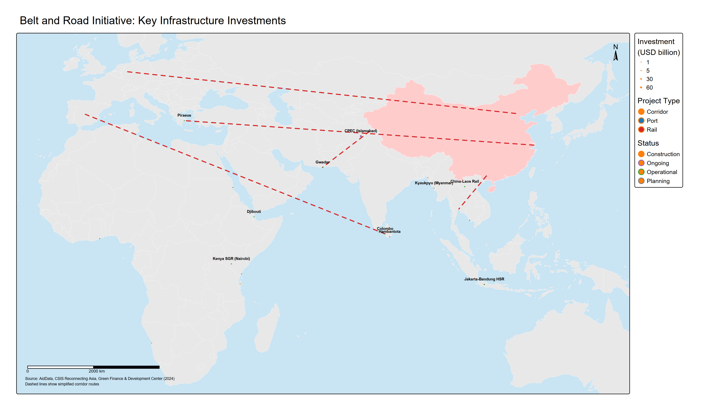
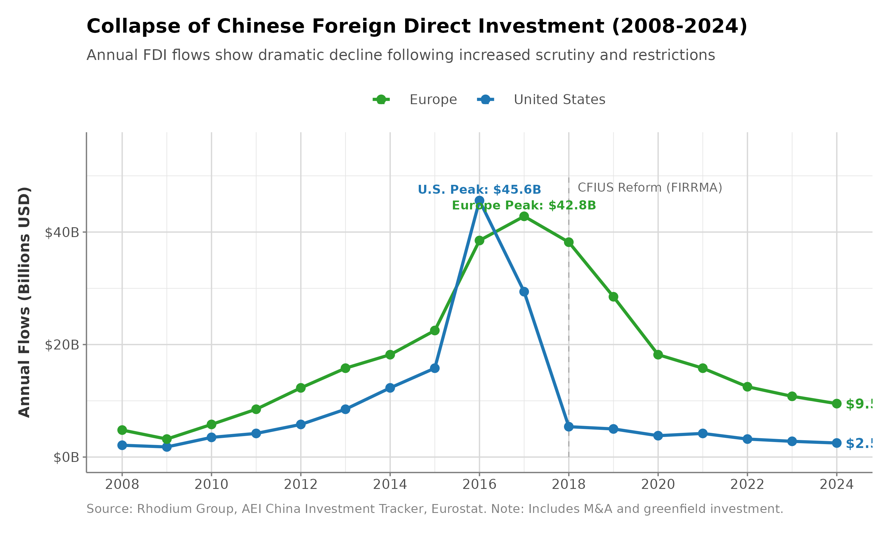
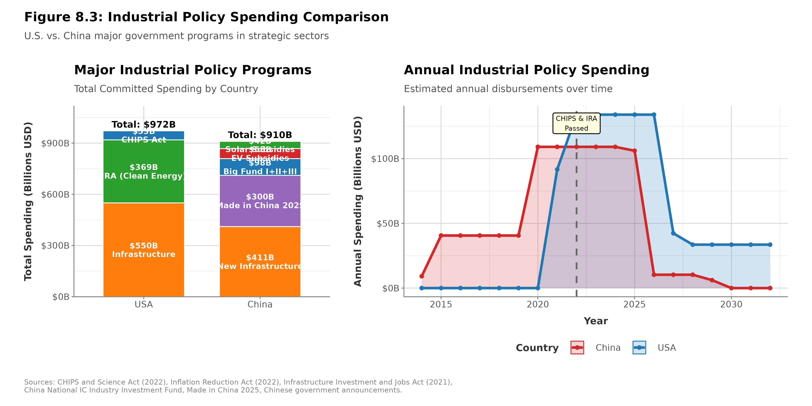

# Investment Screening, Industrial Policy, and Strategic Assets

## Learning Objectives

After working through this chapter, readers should be able to:

- Explain how U.S. investment screening evolved from the passive, narrowly security-focused CFIUS of 1975 into an active instrument of economic competition, and identify the specific mechanisms FIRRMA (2018) introduced.
- Distinguish the legal trigger for CFIUS jurisdiction over non-controlling "covered investments" (access, board rights, or decisionmaking involvement) from the mandatory-declaration thresholds and from allied regimes such as the UK's National Security and Investment Act.
- Compare the U.S. and Chinese models of industrial policy, and assess—using the book's five effectiveness criteria—whether large subsidy programs such as the CHIPS Act and the Inflation Reduction Act can build durable capabilities given political-cycle risk, as illustrated by the 2025 rollback of the IRA's clean-energy credits.
- Analyze informal economic coercion through the 2020-2024 China-Australia case, explaining why plausible deniability, sector selectivity, and target diversification shape its effectiveness.
- Evaluate the return of direct state ownership—the 2025 conversion of Intel's CHIPS award into a federal equity stake and the proposed U.S. sovereign wealth fund—as evidence of a broader shift from market-led to state-directed allocation.

## Executive Summary

Two convictions that anchored Western economic policy for a generation—that capital should flow to wherever it is most productive, and that governments should not try to pick industrial winners—have both been substantially abandoned within the space of a few years. The TikTok case marks the retreat from the first. On August 6, 2020, President Trump issued an executive order giving ByteDance, the Chinese parent company of TikTok, 45 days to divest the popular video-sharing app or face a complete ban in the United States. The order cited national security concerns: TikTok's collection of American users' data, algorithmic content curation controlled by a Chinese company potentially subject to Chinese government influence, and the risk of Chinese intelligence exploiting the platform's vast user base (100 million Americans, predominantly young). ByteDance proposed technical solutions and partnership structures, but the Committee on Foreign Investment in the United States (CFIUS) determined that only complete divestment, selling TikTok's U.S. operations to American owners, would address those concerns.

After years of litigation and negotiation—culminating in Congress's Protecting Americans from Foreign Adversary Controlled Applications Act (April 2024), the Supreme Court's decision upholding it in *TikTok v. Garland* (January 2025), and a joint venture that closed in January 2026 under majority American ownership—the TikTok case moved from threatened ban to forced restructuring. The standoff illustrates a broader transformation. Investment screening has shifted from routine national-security review to an active instrument of economic competition, targeting specific countries, entire sectors, and companies already operating on domestic soil. Governments that long resisted industrial policy have adopted it. The United States, long a champion of free markets and skeptic of state intervention, committed over $500 billion through the CHIPS and Science Act ($52 billion), Inflation Reduction Act ($369 billion initial estimate for energy and climate provisions; subsequent CBO analyses project significantly higher costs due to greater-than-anticipated uptake), and Infrastructure Investment and Jobs Act ($65 billion for broadband, $39 billion for transit, $7.5 billion for EV charging) (Congressional Budget Office 2022; 2023) to remake semiconductor production and clean energy supply chains. China continues to pursue long-horizon technology policy through Made in China 2025 successor efforts and large semiconductor state funds. Governments have shifted decisively from market-led allocation toward state direction of strategic sectors.

Investment controls and industrial policy now rank alongside tariffs and sanctions as primary instruments of economic coercion. Governments use them to shape capital flows, set ownership structures, and rebuild industrial capabilities they previously offshored. Three developments organize this chapter.

The first is the evolution of investment screening from passive national-security review to an active economic-coercion tool, directed particularly at Chinese investments in technology and critical infrastructure. Traditional CFIUS review focused on narrow security concerns: preventing foreign control of defense contractors, protecting classified information, and safeguarding critical infrastructure from sabotage. Applications were relatively rare, reviews largely procedural, and approvals common with modest mitigation measures. The 2018 Foreign Investment Risk Review Modernization Act (FIRRMA) substantially expanded CFIUS's reach. It extended jurisdiction to non-controlling investments and early-stage ventures previously outside CFIUS reach, mandated declarations for investments in "TID" sectors (Technology, Infrastructure, Data), and explicitly targeted critical emerging technologies (AI, quantum computing, biotechnology, hypersonics). Post-FIRRMA, Chinese direct investment in the United States fell from a 2016 peak of $45.6 billion to just $2.5 billion in 2024, a 95% decline (Rhodium Group 2024). This reflected policy intent rather than market forces: investment screening became a mechanism for economic decoupling, preventing Chinese capital from accessing American innovation ecosystems.

The second is the return of state-directed capitalism through industrial policy competition, with both the United States and China deploying large subsidies and mandates to reshape critical supply chains. For decades, Western economic policy emphasized market efficiency, comparative advantage, and free trade, treating industrial policy as distortionary, inefficient, and characteristic of failing developmental states. Western policymakers were skeptical that governments could select industries effectively. China's targeted investments in strategic sectors (high-speed rail, renewable energy, telecommunications, semiconductors) nonetheless enabled Chinese firms to achieve global leadership, often displacing Western competitors. The CHIPS and Science Act, committing $52 billion to semiconductor manufacturing and R&D, explicitly aims to reverse market-driven offshoring (Rasser et al. 2022) and rebuild domestic production despite higher costs. The Inflation Reduction Act's initially estimated $369 billion for clean energy (with actual costs likely substantially higher) was designed to counter China's dominance in solar panels (roughly 85% of global module assembly), wind turbines (about 60%), and EV batteries (around 80% of cell production). The scale is large, and the objective extends beyond supporting nascent industries to reshoring established supply chains through subsidies that make otherwise uneconomic production viable. Whether such policies build sustainable capabilities or create dependency on continued government support remains unproven, though the commitment is clear.

The third is informal economic coercion, state actions outside formal legal frameworks to impose costs on target economies, which shows that economic power operates beyond institutionalized sanctions and tariffs. China's 2020-2021 economic pressure on Australia illustrates these dynamics. Following Australia's call for an independent investigation into COVID-19 origins, China imposed de facto restrictions on Australian exports including wine (tariffs of 200%+), barley (80% tariffs), coal (unofficial import bans), lobster, timber, and beef, affecting over $20 billion in trade. These restrictions operated through administrative measures, customs delays, and "quality concerns" rather than explicit government policies, providing plausible deniability while inflicting substantial economic pain. Australian wine exporters, who sent close to 40% of their exports to China, faced an existential crisis. Australia nonetheless maintained its policy positions, sought alternative markets, and deepened security alignment with the United States. The case demonstrates both the power of informal coercion, which imposes costs without triggering WTO dispute mechanisms or formal retaliation frameworks, and its limitations: targets may absorb pain rather than concede, and market diversification reduces future leverage.

Government Tools Boxes detail CFIUS procedures, FIRRMA expansion, and industrial policy authorities (CHIPS Act, Defense Production Act Title III). Case studies examine the BIOSECURE Act's targeting of Chinese biotech firms and China's informal economic coercion against Australia (2020-2021). A Chinese Perspective Box explores Beijing's views on investment screening as discriminatory protectionism and industrial policy as legitimate development strategy.

These themes reflect economic statecraft's evolution beyond traditional trade and financial tools. Capital flows, industrial capabilities, and market access have become contested domains, with implications extending well beyond bilateral U.S.-China competition to allied policy coordination, development finance, and the future shape of globalization.

<figure class="book-figure">
  
  <figcaption>Figure 8.1: Key Belt and Road Initiative infrastructure investments. Port investments (blue) extend Chinese maritime presence; rail projects (red) create overland connectivity; corridor investments (orange) integrate regional economies. Size indicates investment scale in USD billions.</figcaption>
</figure>

---

## Investment Screening - From Passive Review to Active Coercion

Investment screening, the government review of foreign acquisitions and investments for national security implications, has existed for decades in most advanced economies. The United States established the Committee on Foreign Investment in the United States (CFIUS) in 1975, primarily to monitor OPEC petrodollar investments following the oil crises. For most of its history, CFIUS operated as a relatively obscure interagency process: companies voluntarily notified proposed foreign acquisitions, government agencies reviewed for narrow security concerns (protecting classified information, preventing foreign control of defense contractors), and most transactions received approval, sometimes with mitigation measures. Rejections and forced divestments were rare. This passive, procedural approach reflected an era when foreign investment was generally welcomed as beneficial capital inflow, and national security concerns centered on traditional military threats. CFIUS attracted little attention. That changed as Chinese capital began acquiring U.S. technology companies in volume.

The 2018 Foreign Investment Risk Review Modernization Act (FIRRMA) reshaped the system, expanding CFIUS jurisdiction, mandating reviews of previously exempt transactions, and explicitly targeting Chinese investments in emerging technologies. Post-FIRRMA investment screening functions as active economic coercion rather than passive review, deliberately blocking Chinese capital from accessing American technology even when transactions pose only speculative, long-term security risks rather than immediate threats. This section examines CFIUS evolution, FIRRMA's mechanisms, allied investment screening coordination, and effectiveness in achieving decoupling objectives.

### CFIUS Evolution: From OPEC to China

**Historical Origins and Traditional Approach (1975-2016)**

President Gerald Ford established CFIUS via Executive Order 11858 in 1975, primarily to monitor foreign investments amid concerns about OPEC nations recycling petrodollars into U.S. assets. The Committee, chaired by the Treasury Secretary and including Defense, State, Commerce, and Homeland Security, could review foreign acquisitions of U.S. companies and recommend that the President block transactions threatening national security. However, legal authority remained ambiguous until the Exon-Florio Amendment to the Defense Production Act (1988) explicitly granted the President authority to suspend or prohibit foreign acquisitions, mergers, or takeovers that threaten national security.

Through 2015, CFIUS operated with relatively limited scope and activity:

- **Voluntary jurisdiction**: Companies could choose whether to file CFIUS notices. Most foreign acquisitions proceeded without notification, and CFIUS reviewed only self-selected cases (typically where parties anticipated potential concerns and sought clearance).

- **Narrow security focus**: Reviews concentrated on traditional national security: defense contractors, classified programs, critical infrastructure vulnerable to sabotage (ports, telecommunications). Economic competitiveness, technology leadership, and data privacy were largely outside CFIUS purview.

- **Rare rejections**: From 2008 to 2015, CFIUS reviewed roughly 900 covered transactions, and the share proceeding to a full 45-day investigation climbed from about 14% in 2008 to roughly 35-50% in later years. Yet outright presidential prohibition remained rare—Obama's 2012 order that Ralls Corporation divest an Oregon wind farm was the era's signal case—and most transactions cleared, often subject to mitigation (U.S. Department of the Treasury, CFIUS Annual Reports to Congress). Typical mitigation required corporate governance changes, limited foreign personnel access to sensitive facilities, or cybersecurity protocols.

- **Limited Chinese scrutiny**: Chinese investments grew dramatically from $1 billion annually (pre-2008) to $45.6 billion peak (2016), largely approved (Rhodium Group 2024). High-profile acquisitions included Lenovo's purchase of IBM's PC business (2005), Chinese investments in U.S. real estate and entertainment (AMC Theatres, Legendary Entertainment), and technology sector venture capital.

**Awakening to Strategic Competition (2012-2016)**

Several developments triggered policy reassessment of Chinese investment:

**Technology transfer concerns**: U.S. intelligence assessments concluded that Chinese investments increasingly targeted dual-use technologies, particularly in semiconductors, aerospace, robotics, and AI. While individual investments appeared benign, cumulative effect transferred critical capabilities supporting Chinese military modernization and industrial policy goals.

**Huawei and ZTE telecommunications dominance**: Growing presence of Chinese telecommunications equipment in U.S. and allied networks raised security concerns about potential espionage, backdoors, and disruption capabilities. Congressional reports in 2012 recommended excluding Huawei and ZTE from U.S. critical infrastructure.

**Visible acquisition attempts**: China's 2016 attempt to acquire German semiconductor equipment maker Aixtron (blocked by U.S. intervention citing technology transfer concerns) and proposed acquisition of U.S. chipmaker Lattice Semiconductor (blocked by Trump 2017) demonstrated systematic targeting of technology chokepoints.

**Intellectual property theft campaigns**: Revelations of Chinese cyber espionage (APT1, APT10, APT41 as examined in Chapter 5) stealing hundreds of billions in IP demonstrated that while Chinese firms acquired some technology through investment, they also pursued systematic theft, raising questions about enabling access through permissive investment review.

By 2016-2017, bipartisan consensus emerged that existing CFIUS authorities were insufficient to address Chinese strategic investment targeting American technology leadership. This consensus culminated in FIRRMA, the most significant expansion of U.S. investment screening since Exon-Florio.

### FIRRMA 2018: Expanding the Net

The Foreign Investment Risk Review Modernization Act (FIRRMA), enacted August 13, 2018, dramatically expanded CFIUS jurisdiction (Jackson 2020), introduced mandatory filing requirements, and explicitly targeted emerging and foundational technologies. Its key provisions shifted investment screening from passive review toward active technology protection.

**Expanded Jurisdiction Beyond Controlling Investments**

Traditional CFIUS jurisdiction covered only transactions resulting in foreign "control" of U.S. businesses, typically defined as acquiring majority ownership or board control. FIRRMA expanded jurisdiction to cover non-controlling investments in specific sectors:

- **Non-controlling investments in TID sectors**: Foreign investments in U.S. businesses dealing with critical **Technology**, **Infrastructure**, or **Data** ("TID") now fall under CFIUS jurisdiction even without control. This captures minority stake investments, venture capital funding, and strategic partnerships previously beyond CFIUS reach.


**TID Sectors: The New Red Lines**
FIRRMA's "TID" framework—Technology, Infrastructure, Data—defines the new red lines for foreign investment. **Technology** includes AI, quantum computing, semiconductors, biotechnology, and other emerging fields. **Infrastructure** covers energy, telecommunications, transportation, and other critical systems. **Data** encompasses any business collecting sensitive personal information on Americans. A non-controlling minority investment in a TID-sector startup can now trigger CFIUS jurisdiction—but only when it affords the foreign investor access to material nonpublic technical information, a board seat or observer rights, or a role in substantive decisionmaking. A purely passive stake, however large, does not. Even so, this "covered investment" test is a dramatic expansion from the traditional "control" requirement.


- **Critical technology definition**: Investments involving businesses that produce, design, test, manufacture, fabricate, or develop critical technologies face CFIUS review. Critical technologies include:
  - Export-controlled items (including emerging and foundational technologies under Export Control Reform Act)
  - Nuclear facilities and materials
  - Select agents and toxins
  - Emerging technologies not yet subject to export controls but determined critical to national security (AI, quantum computing, biotechnology, hypersonics, robotics, brain-computer interfaces)

- **Critical infrastructure**: Investments in 28 infrastructure sectors (energy, telecommunications, transportation, water systems, healthcare, financial services) within the United States face heightened scrutiny.

- **Sensitive personal data**: Businesses maintaining or collecting sensitive data on U.S. citizens that could be exploited for intelligence purposes (genetic information, geolocation data, financial records, health data) now trigger jurisdiction.

**Mandatory Declarations**

Previously, CFIUS filings were voluntary; parties could choose whether to notify. FIRRMA introduced mandatory declarations for certain transactions:

- Foreign government-controlled investors acquiring substantial interest (25%+ voting rights) in TID businesses must file
- Transactions involving critical technologies subject to export controls require declarations
- Failure to file carries penalties and potential forced divestment even years after transaction completion

Mandatory declarations create a "short-form" filing (5 pages vs. 50-100 page full notices), with CFIUS responding within 30 days: cleared, request for full notice, or unilateral initiation of review. This mechanism forces disclosure of investments previously hidden from CFIUS.

**Real Estate Transactions**

FIRRMA added jurisdiction over foreign purchases or leases of real estate near sensitive locations:
- Military installations (within ranges determined by regulations)
- Government facilities involved in critical technologies, sensitive information, or national security functions
- Ports and airports

This addresses concerns about foreign surveillance infrastructure near military bases or intelligence facilities, for example Chinese purchases of land near Air Force bases in Texas and North Dakota.

**Pilot Programs and Regulations**

Treasury implemented FIRRMA through phased rulemakings:
- November 2018: Critical technology pilot program mandating declarations for investments in 27 industry sectors
- February 2020: Final regulations establishing TID definitions, mandatory declarations, real estate jurisdiction
- Ongoing: Updates expanding critical technology definitions and covered transactions

**Increased Resources and Timelines**

FIRRMA authorized increased CFIUS staffing and funding (from ~20 full-time employees to 70+) and extended review timelines:
- Initial review: 45 days
- Investigation if concerns identified: 45 days
- Presidential decision: 15 days
- Total possible timeline: 105 days (previously 90 days)
- Extensions possible by mutual agreement

### Impact on Chinese Investment: Near-Total Collapse

<figure class="book-figure">
  
  <figcaption>Figure 8.2: Chinese foreign direct investment in U.S. and Europe from 2008-2024, showing the dramatic collapse after FIRRMA.</figcaption>
</figure>

FIRRMA's impact on Chinese investment was immediate and severe. Chinese direct investment in the United States:

- **2016 (Pre-FIRRMA peak)**: $45.6 billion
- **2017**: $29.4 billion (declining as political sentiment shifted)
- **2018** (FIRRMA enacted): $5.4 billion
- **2019**: $5.0 billion
- **2020**: $3.8 billion
- **2021**: $5.1 billion
- **2022**: $2.8 billion
- **2023**: $2.6 billion
- **2024**: $2.5 billion (estimated)

This represents a **95% decline from peak**, with 2024 investment returning to levels last seen in 2004, before China's emergence as major global investor (Rhodium Group 2024). The collapse extends across sectors but concentrates in technology:


**The 95% Collapse in Chinese FDI**
The near-total collapse of Chinese foreign direct investment in the United States, from $45.6 billion in 2016 to just $2.5 billion in 2024, is among the largest investment reversals in modern history. It was a policy outcome rather than a market correction. FIRRMA's expanded jurisdiction, mandatory declarations, and aggressive enforcement created an environment in which Chinese capital could no longer access American technology companies. The intended signal was clear: Chinese money would not be welcome in U.S. innovation ecosystems.


**Technology sector**: Chinese VC investment in U.S. technology startups fell from $3.2 billion (2017) to less than $200 million (2024) (Rhodium Group 2024). Prominent Chinese VCs (Sequoia China, Hillhouse Capital) largely exited U.S. deals.

**Real estate**: Chinese purchases of U.S. residential real estate peaked at $31.7 billion in the year ending March 2017 before falling sharply, driven partly by CFIUS concerns about properties near sensitive sites but also by Chinese capital controls and economic slowdown (National Association of Realtors, *International Transactions in U.S. Residential Real Estate*).

**Entertainment and consumer sectors**: High-profile Chinese acquisitions of AMC Theatres, Legendary Entertainment, and other entertainment assets ended. Consumer sector deals (food, retail) also largely ceased.

**CFIUS Statistics Reflecting Increased Scrutiny**

Treasury's CY2024 report shows high and sustained review activity:

- **Total transactions**: 325 transactions assessed or reviewed (116 declarations plus 209 written notices)
- **Declarations**: 116 declarations assessed in 2024, roughly 78% of which cleared after the 30-day assessment
- **Notices**: 209 written notices reviewed in 2024
- **China share**: China filed the most notices of any single country (26, about 12% of the total), down from roughly 31% of notices in 2016
- **Withdrawals**: 49 notices were withdrawn in 2024 (all after an investigation had begun), 42 of which were subsequently refiled (31 in 2024, 11 in 2025)

**Forced Divestments**

Beyond blocking prospective deals, CFIUS gained aggressive enforcement of existing investments:

- **Grindr**: Chinese gaming company Kunlun required to divest Grindr (LGBTQ dating app) due to blackmail/espionage concerns from location and personal data. Divestment completed 2020.
- **PatientsLikeMe**: Chinese firm iCarbonX forced to divest health data platform
- **StayNTouch**: Chinese acquirer required to divest hotel management software accessing guest data
- **Multiple smaller divestitures**: CFIUS identified and unwound dozens of unreported transactions closed before FIRRMA, forcing retroactive review and divestment.


**Retroactive Power: No Deal is Ever "Final"**
One of CFIUS's most powerful tools is retroactive review. Transactions completed years ago—even those never notified to CFIUS—can be reopened if security concerns emerge. Chinese investors who acquired U.S. companies before FIRRMA's passage found themselves forced to divest years later. This creates permanent uncertainty: there is no statute of limitations, no "safe harbor" after closing. For foreign investors, especially Chinese ones, this means no deal involving sensitive technology or data is ever truly final.


### Allied Investment Screening: Coordination and Divergence

The United States is not alone in expanding investment screening. European Union member states, United Kingdom, Australia, Japan, and other allies have implemented or strengthened foreign investment review mechanisms, driven by similar concerns about Chinese technology acquisition and critical infrastructure control. However, allied approaches reflect differing balances between economic openness and security protection, creating coordination challenges.

**European Union FDI Screening Regulation (2019)**

The EU implemented a framework for screening foreign direct investments in October 2020, establishing coordination among member states while preserving national sovereignty over investment decisions. Key features:

- **Voluntary national screening**: Member states may establish investment review mechanisms but are not required to. As of end-2024, 24 of 27 EU members had active screening regimes, while the remaining states were in legislative processes (European Commission 2025).

- **Coordination mechanism**: When a member state reviews a transaction, other members and the European Commission can provide opinions if the investment affects their security interests or EU-wide projects (Horizon Europe research, Galileo satellite navigation, etc.)

- **Mandatory factors**: Screening must consider whether foreign investors are controlled by foreign governments, whether investors have been involved in activities affecting security in another member state, and risks to critical infrastructure, critical technologies, sensitive information, or media freedom.

- **No veto power**: The Commission and member states provide opinions, but the member state where the investment occurs makes the final decision. This preserves sovereignty but limits coordination effectiveness.

**Germany and France: Strictest EU Regimes**

Germany and France, as EU's largest economies and leading industrial powers, have implemented the EU's most comprehensive screening:

**Germany**:
- Foreign Trade and Payments Act amendments (2017, 2020, 2023) expanded screening beyond defense to critical infrastructure, media, healthcare, and food supply
- Lowered thresholds for mandatory review from 25% to 10% ownership for critical sectors
- Blocked Chinese acquisitions: Aixtron semiconductor equipment (2016), Leifeld Metal Spinning (machine tools, 2018), 50Hertz power grid operator (2018)
- But approved: Chinese acquisitions such as Geely's minority stake in Daimler, robotics (Midea's purchase of Kuka), and deals in other sectors, demonstrating selective rather than blanket restrictions

**France**:
- 2019 PACTE law expanded sectors subject to screening to include AI, robotics, semiconductors, data storage, cybersecurity
- Blocked Chinese acquisitions of Photonis (night vision technology, 2021), though later partially reversed under appeal
- Maintains extensive screening but balances with economic openness; Chinese battery investments (Envision AESC) approved for electric vehicle supply chains

**United Kingdom: National Security and Investment Act (2022)**

The UK's NSI Act, effective January 2022, represents post-Brexit recalibration of investment policy:

- **Mandatory notification**: Acquisitions in 17 defined sensitive sectors (AI, quantum, semiconductors, nuclear, defense, communications) must be notified and cleared before completion once the buyer crosses 25%, 50%, or 75% of shares or voting rights (a lower 15% threshold floated in the original bill was dropped before enactment); acquisitions conferring "material influence" below those levels fall under the separate call-in power rather than mandatory notification
- **Call-in powers**: Government can review any transaction in any sector if national security concerns exist, with retroactive reach up to 5 years
- **Volume**: Over 1,800 notifications in first two years, with ~1% subject to detailed review and handful blocked
- **Chinese focus**: Particularly scrutinizes Chinese investments in technology and infrastructure, though maintains openness to non-sensitive sectors

**Australia: FIRB and Critical Infrastructure**

Australia, geographically proximate to China and economically dependent on Chinese trade, faces acute tensions between economic interests and security concerns. The Foreign Investment Review Board (FIRB):

- 2021 reforms lowered thresholds for review, particularly for investments by foreign government entities (including SOEs)
- Expanded definition of national security businesses to include critical infrastructure, defense, telecommunications, data
- Critical Infrastructure Act (2021) grants government powers to direct operators of critical infrastructure (ports, energy, telecommunications, data centers) to mitigate security risks, even absent change of ownership
- Chinese reaction: Accusations of discriminatory treatment, contributing to bilateral tensions examined in Section 4

**Japan: Strengthened FISC Reviews**

Japan's Foreign Investment Screening Committee (FISC), operating under Foreign Exchange and Foreign Trade Act (FEFTA):

- 2019 amendments expanded covered sectors from 12 to 20, including semiconductors, pharmaceuticals, software
- Lowered notification threshold from 10% to 1% for sensitive sectors and foreign government-linked investors
- Streamlined "pre-clearance" process for trusted investors from allied countries
- Scrutinizes Chinese investments while facilitating Western capital, reflecting geopolitical alignment

**South Korea: Balancing Act**

South Korea faces particular difficulty balancing alliance with the United States against economic dependence on China (largest trading partner). Investment screening reflects this tension:

- National Security Investigation Act covers acquisitions in defense, dual-use technologies, critical infrastructure
- Applied selectively: blocks or mitigates concerning Chinese investments but avoids comprehensive restrictions
- Samsung and SK Hynix exemptions from U.S. semiconductor equipment export controls (Chapter 4) create reciprocal pressure to avoid overly restrictive investment screening
- Maintains substantially more open posture toward Chinese investment than U.S./Europe

**Coordination Challenges**

Allied investment screening coordination faces persistent obstacles:

1. **Divergent threat perceptions**: U.S. views Chinese technology acquisition as existential competition; European countries often see commercial opportunities; smaller allies balance economic dependence against security alignment

2. **Regulatory arbitrage**: Investors can target countries with weaker screening, or structure transactions to avoid triggers (using multiple jurisdictions, complex ownership structures, sequential transactions)

3. **Sovereignty sensitivities**: Investment screening historically national prerogative; countries resist ceding decision authority to multilateral bodies

4. **Economic costs**: Blocking foreign investment imposes costs (lost capital, jobs, technology transfer); costs fall unevenly depending on country's economic structure and alternatives

5. **Legal frameworks**: U.S. uses national security exception in WTO agreements; EU screening operates under EU law; coordination requires reconciling different legal bases and procedural requirements

The U.S.-EU Trade and Technology Council (TTC), Quadrilateral Security Dialogue (Quad: U.S., Japan, India, Australia), and G7 coordination mechanisms attempt to harmonize investment screening, but progress remains incremental.

### Effectiveness Assessment

Evaluating investment screening's effectiveness as economic coercion instrument requires applying the five criteria established in Chapter 1:

**1. Target Compliance**

Investment screening achieves high compliance: when CFIUS or allied authorities block or demand divestment, targets generally comply rather than risk presidential prohibition, sanctions, or legal penalties. The TikTok case illustrates both the difficulties and ultimate effectiveness of forced divestiture for already-operating businesses: ByteDance resisted through years of litigation, and Congress ultimately forced the issue with the Protecting Americans from Foreign Adversary Controlled Applications Act (April 2024), which the Supreme Court upheld in *TikTok v. Garland* (January 2025). The joint venture that closed in January 2026—in which Oracle, Silver Lake, and MGX led an investor group holding roughly 80% while ByteDance retained under 20%, and Oracle assumed responsibility for U.S. data security and algorithm retraining—demonstrated that even complex, politically charged divestitures can be resolved when backed by credible legislative force.

Compliance extends to voluntary transaction abandonment: when parties anticipate CFIUS rejection, they typically withdraw filings rather than proceeding to formal rejection. This "shadow" effect means visible statistics undercount actual effectiveness.

**2. Capability Degradation**

Investment screening demonstrably degrades Chinese technology acquisition capabilities:

- **95% reduction in U.S. investment** eliminates Chinese capital from American technology ecosystems
- **VC funding cutoff** prevents Chinese firms from early-stage access to startups developing emerging technologies
- **Forced divestitures** remove existing Chinese ownership of sensitive data and capabilities

However, degradation is partial:
- **Alternative acquisition methods**: Chinese entities pursue technology through partnerships below ownership thresholds, recruitment of talent, procurement of products (rather than companies), and cyber espionage
- **Non-U.S. investments**: Chinese capital increasingly targets European, Israeli, and emerging market technology, though allied coordination limits options
- **Indigenous development**: Investment restrictions spur Chinese self-reliance efforts (Chapter 4 semiconductor example), potentially building capabilities that reduce long-term dependence

**3. Economic Cost**

Costs fall asymmetrically:

**Target costs (China)**:
- Lost investment opportunities in world's most innovative technology ecosystem
- Forced divestitures incur financial losses (Grindr sale at distressed valuation)
- Reduced access to early-stage technologies limits future competitiveness
- Estimated economic cost: $40-50B in lost investment annually compared to 2015-2016 levels

**Coercer costs (United States)**:
- Lost foreign capital (though largely offset by other sources, as European, Japanese, and Canadian investment increased)
- Reduced competition in venture capital may inflate valuations
- Technology sector lobbying against restrictions creates political friction
- Estimated cost: Modest in aggregate but concentrated in specific sectors (biotechnology, semiconductors where Chinese capital significant)

**4. Sustainability**

Investment screening appears highly sustainable:
- **Strong political support**: Bipartisan consensus in U.S. Congress, political support in allied countries
- **Institutional capacity**: CFIUS, EU mechanisms, allied bodies now resourced and established
- **Legal clarity**: FIRRMA and allied legislation provide clear authorities and procedures

Sustainability risks include:
- **Allied coordination**: Requires ongoing diplomatic effort; political changes could fracture consensus
- **Legal challenges**: Targets contest authorities in courts (as ByteDance did before ultimately accepting the TikTok divestiture); adverse rulings could limit tools
- **Economic pressure**: Prolonged capital controls may generate business community opposition if costs rise or alternative capital sources prove insufficient

**5. Collateral Damage**

Collateral damage is moderate:
- **Friendly countries**: Investment screening targets Chinese and Russian investments but creates compliance burdens for all foreign investors; allied coordination mitigates but doesn't eliminate costs
- **U.S. businesses**: Startups lose potential investors, face longer fundraising timelines, and navigate regulatory complexity
- **Technology diffusion**: Restricting capital flows may slow global innovation diffusion, reducing benefits of international collaboration
- **Middle powers**: Countries like South Korea, Israel, and Southeast Asian nations face pressure to choose sides, limiting economic flexibility

**Overall Assessment**

Investment screening has proven effective in achieving its primary objective: dramatically reducing Chinese access to Western technology through capital markets. The 95% decline in U.S. investment and substantial reductions in Europe demonstrate capability degradation. Political sustainability appears strong, and collateral damage remains moderate. However, effectiveness in preventing Chinese technology development is less clear: restrictions spur indigenous innovation, alternative acquisition methods, and investments in non-allied technology ecosystems. Investment screening is a powerful coercion tool but not a comprehensive solution to strategic technology competition.

---

## Industrial Policy Competition - The Return of the State

For nearly four decades, Western economic policy embraced market-driven allocation of resources, viewing government industrial policy, meaning directed subsidies, mandates, and preferences for specific industries, as inefficient distortions that reduce competitiveness. The Washington Consensus held that governments should establish rule of law, protect property rights, maintain macroeconomic stability, and otherwise let markets determine winners and losers. China's rapid rise through aggressive industrial policy challenged this orthodoxy. Now, facing strategic competition and supply chain vulnerabilities exposed by the pandemic and geopolitical tensions, the United States and Europe have embraced industrial policy on unprecedented scale, directly competing with China's state-directed model. This section examines contemporary industrial policy competition, comparing U.S. and Chinese approaches, assessing early results, and evaluating prospects for success.

### U.S. Industrial Policy: CHIPS, IRA, and Infrastructure

**CHIPS and Science Act (August 2022)**

The Creating Helpful Incentives to Produce Semiconductors (CHIPS) and Science Act represents the United States' most significant industrial policy intervention in generations, committing $52.7 billion to rebuild domestic semiconductor manufacturing and R&D capabilities. The act allocates $39 billion in direct grants and loans as **manufacturing incentives** for fabrication facilities, supplemented by a 25% investment tax credit. An additional $13.2 billion supports **R&D investments** in semiconductor research, including the National Semiconductor Technology Center, the National Advanced Packaging Manufacturing Program, and expanded NSF and DOE research programs. The legislation dedicates $500 million to **workforce development** for semiconductor industry training (Rasser et al. 2022). Critically, the act includes **guardrails** prohibiting recipients from expanding semiconductor manufacturing capacity in China for 10 years, preventing subsidized firms from simultaneously aiding Chinese competitors.


**The 10-Year China Ban**
CHIPS Act "guardrails" force companies to make a fundamental choice: take U.S. subsidies or expand in China—not both. Any company receiving CHIPS funding is prohibited from materially expanding semiconductor manufacturing capacity in China for 10 years. For companies like Intel, TSMC, and Samsung that have existing China operations, this creates difficult strategic trade-offs. The guardrails effectively weaponize subsidies, turning industrial policy into a tool for accelerating decoupling.


By early 2026, several flagship CHIPS projects had moved from announcement to finalized award terms. **TSMC** received up to $6.6 billion in direct CHIPS funding and up to $5 billion in potential loans; in March 2025 it announced plans to increase its U.S. investment to $165 billion, adding a third Arizona fab plus advanced packaging and R&D capacity. **Intel** signed a preliminary CHIPS award of up to $7.865 billion in direct funding plus up to $11 billion in loans across Arizona, New Mexico, Ohio, and Oregon. **Samsung** signed a preliminary award of up to $4.745 billion in direct funding and up to $1.458 billion in loans for Central Texas investments exceeding $37 billion. **Micron** signed a preliminary CHIPS award of up to $6.165 billion tied to long-run memory fab expansion in New York and Idaho. **GlobalFoundries** received up to $1.5 billion in direct funding to support more than $12 billion in expansion in New York and Vermont (U.S. Department of Commerce 2024; The White House 2025).

These projects still face significant **challenges**. **Cost overruns** remain common, as U.S. fab construction costs run materially above equivalent facilities in Taiwan or Korea due to labor, regulatory, and materials expenses. **Talent shortages** remain binding in engineering and technician roles. Questions of **subsidy dependency** also persist: without continuing public support, private economics still favor lower-cost offshore production in many segments. Finally, **timeline risk** remains substantial; original schedules for multiple projects slipped, and ramp quality/yield execution has become at least as important as groundbreaking announcements.

In August 2025 the relationship between the state and the semiconductor industry became literal. The Trump administration converted the unpaid balance of Intel's CHIPS award, together with funds earmarked under the Pentagon's Secure Enclave program, into an $8.9 billion purchase of roughly 433 million Intel shares—an approximately 10% equity stake that made the U.S. government Intel's largest shareholder, alongside a five-year warrant for an additional 5% should Intel cede majority control of its foundry business (Intel Corporation 2026). Grants had become equity: "the return of the state" was no longer a metaphor. Supporters framed the stake as taxpayer upside for public money; critics warned that direct government ownership of a competitor distorts the very market the CHIPS Act was meant to rebuild and politicizes Intel's commercial decisions.

**Inflation Reduction Act (August 2022)**

As enacted in 2022, the IRA committed an estimated $369 billion to clean energy and climate programs (CBO later projected substantially higher costs), much of it functioning as industrial policy to counter Chinese dominance in renewable energy supply chains. The legislation offered tax credits for U.S.-manufactured **solar panels, wind turbines, and components**; for **electric vehicles**, a $7,500 consumer credit conditioned on North American assembly and battery-sourcing requirements that effectively excluded Chinese content; a $35/kWh production tax credit for battery cells to incentivize domestic **battery manufacturing**; loans and grants for domestic mining and processing of **critical minerals** including lithium, graphite, cobalt, and rare earths; and tax credits for clean **hydrogen** production. Much of this architecture proved short-lived. The One Big Beautiful Bill Act (OBBBA), signed on July 4, 2025, repealed or accelerated the phase-out of most of the IRA's clean-energy credits: the $7,500 new- and used-EV credits terminated on September 30, 2025, and the residential clean-energy credit at the end of 2025 (One Big Beautiful Bill Act 2025). The reversal is a real-time illustration of the sustainability problem examined later in this chapter—industrial policy delivered through tax credits is only as durable as the electoral coalition that enacted it.

The IRA's early **impact** was substantial while it lasted. More than $100 billion in clean energy manufacturing investments were announced after its passage, a battery-plant construction boom got underway (with over a dozen facilities announced by manufacturers including LG, SK, Panasonic, Ford, and GM), and solar manufacturers such as First Solar and Hanwha Q Cells expanded U.S. capacity. However, Chinese supply-chain dominance---roughly 85% of global solar module assembly and about 80% of EV battery cell production (IEA 2025)---meant that reshoring would take years even under stable policy, and the 2025 credit rollback introduced fresh uncertainty for projects predicated on a decade of federal support. Chinese firms, meanwhile, may circumvent sourcing restrictions through third-country operations.

**Infrastructure Investment and Jobs Act (November 2021)**

The $1.2 trillion infrastructure bill includes significant industrial policy elements. It allocates $65 billion for broadband expansion, $42 billion for bridge repair and replacement, $39 billion for public transit modernization, and $7.5 billion for EV charging infrastructure (Congressional Budget Office 2022; 2023). **"Buy America" provisions** requiring domestic content for infrastructure projects further reinforce the reshoring objectives shared across these legislative efforts.

**Total U.S. Industrial Policy Commitment: ~$500 billion** across these three acts, representing fundamental shift from market-driven allocation to strategic state intervention (Congressional Budget Office 2022; 2023).

### China's State-Directed Model: Made in China 2025 and Beyond

China has pursued aggressive industrial policy for decades, viewing state-directed development as essential for technological catch-up, economic security, and great power status. Current initiatives represent continuation and acceleration of long-standing approach.

**Made in China 2025 (2015)**

Announced in 2015, Made in China 2025 targets ten strategic industries for Chinese leadership:
1. New information technology (semiconductors, 5G, AI)
2. Robotics and automation
3. Aerospace and aviation equipment
4. Maritime engineering and high-tech ships
5. Advanced rail equipment
6. New energy vehicles and equipment
7. Power equipment (nuclear, renewables)
8. Agricultural machinery
9. New materials (rare earths, composites)
10. Biopharmaceuticals and medical devices

The plan set **explicit self-sufficiency targets**: 40% domestic content by 2020, 70% domestic content by 2025, and global leadership in key sectors by 2049, the 100th anniversary of the People's Republic of China (State Council of the People's Republic of China 2015).

The program operates through several reinforcing **mechanisms**. Central and local governments provide **subsidies** in the form of grants, below-market-rate loans, and tax incentives totaling hundreds of billions of dollars. **Government procurement** policies mandate preferential purchasing from domestic suppliers. **Technology transfer requirements** compel foreign firms seeking Chinese market access to partner with Chinese companies and share proprietary technology. **State-owned enterprises** are directed to invest in strategic sectors regardless of short-term profitability. Government-backed **venture capital** funds channel investment into startups in target sectors. And the **"Thousand Talents Plan"** actively recruits foreign scientists and engineers to bring expertise into Chinese institutions.

**Western backlash**: Made in China 2025 triggered alarm in Washington and European capitals, contributing to shift toward industrial policy competition and export controls. After Trump administration criticism, China downplayed the program but didn't abandon underlying objectives.

**Big Fund I, II, and III: Semiconductor Focus**

China's National Integrated Circuit Industry Investment Fund (the "Big Fund") exemplifies state-directed capital allocation. **Big Fund I**, established in 2014 with $21 billion in capital, invested in foundries such as SMIC and Hua Hong, memory manufacturers like Yangtze Memory Technologies (YMTC), and packaging firms. **Big Fund II** followed in 2019 with $29 billion, shifting focus toward design tools (EDA software), equipment manufacturing, and materials. **Big Fund III**, launched in May 2024 with an estimated $47.5 billion, targets advanced chips, AI processors, and domestic equipment development (Center for Strategic and International Studies 2023; Bloomberg News 2024).

The **results** of these investments have been mixed. The Chinese semiconductor industry has expanded capacity dramatically, but significant technology gaps persist. SMIC achieved a notable milestone by demonstrating 7nm chip production for the Huawei Mate 60 Pro despite equipment restrictions, though yields reportedly remain low at 40-50%. Chinese firms produce mature-node manufacturing tools but lag 10-15 years behind the cutting edge in lithography, etching, and deposition equipment. China's share of global semiconductor production capacity rose from 12% in 2015 to 24% in 2024, but this growth concentrates in mature nodes (28nm and above), with advanced node production (14nm and below) remaining a small share. Questions of efficiency also cloud the picture: massive capital investment yielded progress but at high cost, and multiple Big Fund corruption scandals---with executives arrested for embezzlement---raise serious doubts about allocation efficiency.

### Comparing Approaches: Market-Driven vs. State-Directed

<figure class="book-figure">
  
  <figcaption>Figure 8.3: Industrial policy spending comparison between the U.S. and China across key technology sectors.</figcaption>
</figure>

**U.S. Model: Strategic Industrial Policy within Market Framework**

The U.S. approach is characterized by **selective intervention**: the CHIPS Act and IRA target specific chokepoints such as semiconductors, batteries, and critical minerals rather than attempting comprehensive economic planning. **Private sector leadership** remains central, with the government providing incentives while private firms retain investment and production decisions. The approach maintains a degree of **technology neutrality**, offering tax credits and grants to any firm meeting established criteria rather than picking specific corporate winners. Programs carry **sunset assumptions**, with defined funding and timelines rather than permanent subsidies, though political dynamics make extensions likely. The model also emphasizes **allied coordination**, incorporating friend-shoring and partner cooperation as exemplified by TSMC and Samsung participation in U.S. fabs.

These strengths are offset by notable weaknesses. U.S. **political cycles** operate on short time horizons, while industrial policy requires decades of sustained commitment---a mismatch the American system struggles to reconcile, as the 2025 repeal of the Inflation Reduction Act's clean-energy credits, barely three years after their enactment, vividly demonstrated. Even with subsidies, U.S. production often remains more expensive than Asian alternatives, creating persistent **cost competitiveness** challenges. **Fragmented implementation** across multiple agencies, with federal-state coordination difficulties and bureaucratic complexity, hampers execution. And **private sector profit motives** may undermine policy goals: companies may accept subsidies while maintaining primary production offshore if doing so remains more profitable.

**China Model: Comprehensive State Direction**

China's approach differs fundamentally in its scope and structure. **Sector-wide planning** under Made in China 2025 targets entire industries rather than individual chokepoints. **State-owned enterprises** execute government priorities regardless of short-term profitability, providing reliable implementation capacity. The model benefits from **long-term commitment**, with industrial policy spanning decades and backed by consistent resource allocation unconstrained by electoral cycles. **Technology sovereignty** serves as an explicit goal, with Chinese planners willing to accept higher costs in exchange for self-sufficiency and security. And **central coordination** through top-down direction reduces the bureaucratic fragmentation that hampers the U.S. approach.

China's model carries its own significant weaknesses, however. **Inefficiency** plagues state-directed allocation, which frequently misallocates resources---as evidenced by Big Fund corruption scandals and zombie companies sustained by subsidies long past any productive purpose. **Innovation deficits** emerge because state planning struggles to match market-driven innovation; China's strengths lie in scaling production rather than achieving breakthrough R&D. The model faces **diminishing returns** as China approaches the technology frontier, where state-directed catch-up strategies become less effective than at earlier development stages. Finally, aggressive industrial policy triggers **international resistance** in the form of Western countermeasures including export controls, investment screening, and tariffs.

Which model proves more successful is uncertain and likely sector-dependent. Semiconductors favor scale, capital intensity, and sustained investment, potentially a Chinese advantage. Biotechnology and AI favor entrepreneurial innovation and talent mobility, potentially a U.S. advantage. Both countries face obstacles. The United States must overcome short-term political pressures and cost disadvantages; China must address efficiency and innovation limitations. The competition will unfold over decades, not years.

---

## State-Owned Enterprises and Sovereign Wealth Funds as Strategic Instruments

State-owned enterprises (SOEs) and sovereign wealth funds (SWFs) function as extensions of government power in economic statecraft. Unlike private firms accountable primarily to shareholders and profit maximization, SOEs and SWFs pursue state strategic objectives such as resource control, technology acquisition, and geopolitical influence, sometimes accepting commercial losses for political gains. This section examines how states, particularly China, deploy these instruments as tools of economic coercion and strategic competition.

### Chinese SOEs: Scale and Strategic Role

China's approximately 96 centrally-managed SOE groups under SASAC (combined assets over $12 trillion, millions of direct employees) span energy, telecommunications, banking, aerospace, shipping, and nuclear sectors. They operate under a **dual mandate**: commercial profitability and political objectives including industrial policy implementation, resource security, BRI infrastructure, and, when directed, economic coercion.

**Resource acquisition** has been aggressive: CNOOC's attempted Unocal acquisition (withdrawn under Congressional pressure, 2005), PetroChina's global oil investments, ChemChina's $43 billion Syngenta purchase (2017), and extensive mining acquisitions across Latin America, Africa, and Australia for lithium, cobalt, and rare earths. **Technology acquisition** operates through joint venture requirements, state-backed global expansion (Huawei), and SOE partnerships with Western aerospace, rail, and manufacturing firms.

### Sovereign Wealth Funds and Western Responses

Chinese SWFs, the China Investment Corporation (~$1.33 trillion AUM as of 2023), SAFE Investment Company ($1+ trillion), and the National Social Security Fund (~$415 billion), operate with less transparency than Norwegian or Singaporean counterparts, raising concerns about strategic motivations. CIC holds stakes in Blackstone, Morgan Stanley, and commodity firms, increasingly targeting technology and strategic sectors (Sovereign Wealth Fund Institute 2024; Bloomberg data).

Western responses center on **reciprocity arguments** (if Chinese SOEs invest freely in Western markets while Chinese markets remain restricted, this creates asymmetric advantage), **investment screening** (CFIUS and allied mechanisms now target SOE investments with mandatory declarations and presumptions of government control), and **reform pressure** through multilateral institutions. China has consolidated and partially privatized some SOEs but retains strategic control over key sectors.

The United States itself moved toward this instrument in 2025. On February 3, 2025, President Trump signed an executive order directing the Secretaries of the Treasury and Commerce to deliver, within 90 days, a plan to establish a U.S. sovereign wealth fund—an idea long associated with resource exporters and with the very Gulf and Asian states whose funds Washington had scrutinized (Executive Order, February 3, 2025). Proponents pitched it as a vehicle to monetize federal assets and pursue strategic investments; skeptics questioned what a chronic fiscal-deficit country would capitalize such a fund with, and noted the irony of the United States embracing a tool it had long treated as a marker of state capitalism. Coming months before the Intel equity stake, the proposal underscored how far the U.S. posture toward direct state ownership had shifted.

---

## Informal Economic Coercion - The Australia Case

Formal economic coercion operates through institutionalized mechanisms: CFIUS decisions, tariffs under Section 301, OFAC sanctions. Informal coercion employs state power outside formal frameworks, through customs delays, regulatory harassment, unofficial import restrictions, and consumer boycotts encouraged by state media, to impose costs while maintaining plausible deniability. China's 2020-2021 economic pressure on Australia exemplifies informal coercion dynamics: how it operates, why targets struggle to respond, and implications for middle powers navigating great power competition.

### Background: COVID-19 Investigation and Bilateral Tensions

**April 2020: Australia's COVID Origins Call**

On April 19, 2020, Australian Foreign Minister Marise Payne called for an independent international investigation into COVID-19 origins, including China's initial response in Wuhan. Prime Minister Scott Morrison amplified the call, comparing it to "weapons inspectors" investigating the pandemic. The proposal, though supported by many countries, particularly angered Beijing:

- **Timing**: During peak of pandemic when China faced international criticism for initial cover-ups, silencing whistle-blowers (Dr. Li Wenliang), and delayed WHO notification
- **Terminology**: "Weapons inspectors" language evoked Iraq WMD inspections, implying coercive intrusion
- **Motives**: Australia had strengthened Five Eyes intelligence cooperation, banned Huawei from 5G networks (2018), and increased criticism of Chinese influence operations; COVID investigation seen as part of broader confrontational approach

**Chinese Official Responses**

Chinese officials and state media delivered warnings:
- Chinese Ambassador to Australia Cheng Jingye warned of consumer boycotts if investigation proceeded
- Global Times (state media) published articles threatening economic consequences
- Chinese Foreign Ministry spokesman condemned Australia's "political manipulation"

### Economic Restrictions: Sectors Targeted

Beginning May 2020, China imposed de facto restrictions on multiple Australian export sectors. Critically, these operated through administrative measures and unofficial guidance rather than formal tariff or ban announcements:

**Barley (May 2020)**
- **Action**: China imposed 80.5% anti-dumping and countervailing duties on Australian barley (MOFCOM Announcement No. 14 of 2020)
- **Impact**: Australian barley exports to China fell from ~AUD 1.5 billion annually to near zero (Department of Foreign Affairs and Trade [DFAT], *Composition of Trade* 2021)
- **Nominal justification**: Dumping investigation initiated 2018, but decision timing clearly political
- **Australian response**: WTO dispute initiated (ultimately successful in 2024, with China removing tariffs; WTO Dispute DS598)

**Beef (May-September 2020)**
- **Action**: Four major Australian beef processors lost export licenses for "labeling violations," later expanded to more facilities (GACC notices 2020; Australian Meat Industry Council statements 2020)
- **Impact**: Reduced but didn't eliminate Australian beef exports (other facilities continued, though facing delays)
- **Justification**: Technical compliance issues (labeling, health certificates)

**Wine (November 2020)**
- **Action**: Anti-dumping duties of 107–212% on bottled Australian wine (MOFCOM Announcement No. 55 of 2020)
- **Impact**: Australian wine exports to China collapsed from AUD 1.2 billion (2019) to AUD 12 million (2021)—a 99% decline. For Australian wineries, China had been the largest export market (~39% of exports) (Wine Australia *Export Report* 2022; DFAT 2022).
- **Devastating sector impacts**: Treasury Wine Estates, Pernod Ricard Australia, and many smaller wineries faced revenue collapse, lay-offs, discounted inventory


**The 99% Wine Collapse**
Australia's wine industry faced perhaps the most devastating blow of China's informal coercion campaign. Anti-dumping duties of 107-212% were prohibitively high—effectively a complete market exclusion dressed in trade law language. Wine exports to China plummeted from $1.2 billion to just $12 million in two years. For an industry where China had become the largest export market (39% of total), this represented an existential crisis. Regional towns dependent on wine exports faced severe economic hardship.


**Coal (October 2020-2022)**
- **Action**: Unofficial import restrictions—Australian coal ships stuck at Chinese ports for months without customs clearance (General Administration of Customs of the PRC [GACC] data; Lowy Institute 2021)
- **Impact**: Australian coal exports to China fell from AUD 14 billion (2019) to AUD 2.4 billion (2020) to near-zero in 2021 (DFAT *Composition of Trade* 2022; Office of the Chief Economist, Department of Industry)
- **No formal announcement**: Chinese officials denied restrictions; customs simply delayed or rejected clearances for unspecified "quality concerns"
- **Strategic dimensions**: Coal restrictions hurt Australian exports but also created Chinese domestic energy shortages (winter 2020-2021 power crises), demonstrating costs of coercion

**Lobster, Timber, Copper**
- Lobster: Customs delays leading to spoilage of live lobsters at airports
- Timber: Import restrictions citing pest concerns
- Copper ore and concentrates: Some restrictions and delays

### Australian Responses and Economic Impact

**Economic Costs**

Cumulative trade impact estimated $20+ billion in affected exports over 2020-2022. However:
- **Diversification partially mitigated**: Australian exporters found alternative markets (U.S., UK, Southeast Asia for wine; India, Japan, Korea for coal)
- **Commodity prices**: Strong demand for iron ore, coal, and LNG (not restricted) meant Australia's overall trade balance remained positive
- **Sector-specific pain**: Wine, barley, lobster industries suffered concentrated losses; regional economies dependent on these exports faced severe hardship

**Policy Responses**

**No policy reversal**: Australia maintained its positions:
- Continued calling for COVID-19 investigation
- Upheld Huawei 5G ban
- Strengthened foreign interference legislation targeting Chinese influence
- Deepened Five Eyes and Quad security cooperation
- Announced AUKUS nuclear submarine partnership with U.S. and UK (September 2021)

**Market diversification**:
- Wine industry shifted to U.S., UK, Southeast Asian markets
- Coal exporters increased sales to India, Japan, South Korea
- Barley found buyers in Middle East, Southeast Asia
- Government Export Market Development Grants supported diversification


**The Diversification Success Story**
Australia's response to Chinese coercion offers a model for economic resilience. Rather than capitulating, Australia aggressively diversified export markets. Wine found new customers in the U.S., UK, and Southeast Asia. Coal redirected to India, Japan, and South Korea. Barley reached Middle Eastern and Southeast Asian buyers. While painful in the short term, this forced diversification ultimately reduced Australia's vulnerability to future Chinese pressure—demonstrating that economic coercion can backfire by motivating targets to build resilience rather than submit.


**WTO disputes**:
- Challenged Chinese barley duties at WTO (successful 2024)
- Prepared but didn't file wine dispute (bilateral relations thawing by 2023)

**Closer U.S. alliance**:
- AUKUS represented dramatic deepening of security ties
- U.S. diplomatic support for Australia during Chinese pressure
- Economic resilience strengthened through broader Indo-Pacific partnerships

### Easing of Restrictions (2023-2024)

Following Chinese leadership transition dynamics and Australian government change (Labor Party's Anthony Albanese elected May 2022), bilateral relations gradually stabilized:

- **Barley**: Duties removed August 2023 after Australia suspended WTO case
- **Wine**: Anti-dumping duties removed on 29 March 2024 following an expedited review
- **Coal**: Informal restrictions eased 2023; exports resumed
- **Ministerial engagement**: High-level visits resumed after three-year freeze

**Reasons China eased pressure**

Several factors contributed:
1. **Limited effectiveness**: Australia didn't reverse policies; restrictions imposed costs on China (energy shortages, forfeited revenue)
2. **Diversification**: Australian exporters found alternative markets, reducing future leverage
3. **Reputational costs**: China's coercion alarmed other middle powers, driving them toward U.S. alignment
4. **Broader strategy shift**: China sought to reduce tensions with multiple countries simultaneously (also stabilizing relations with Japan, South Korea, EU)

### Lessons: Informal Coercion Dynamics

**Mechanisms**

Informal coercion operates through:
- **Administrative discretion**: Customs delays, regulatory harassment, licensing revocations for ostensible technical violations
- **Plausible deniability**: No formal government announcements; officials deny political motives
- **Sector selectivity**: Target economically significant exports while avoiding escalation (iron ore untouched because China depends on Australian supply)
- **State media amplification**: Nationalist sentiment, consumer boycott encouragement

**Advantages**

- **Avoids WTO constraints**: Informal measures harder to challenge than explicit tariffs or quotas
- **Flexibility**: Easily escalated or de-escalated without formal policy reversals
- **Deniability**: Diplomatic relations can continue while economic pressure applied

**Limitations**

- **Market diversification**: Targets can find alternative buyers, reducing long-term leverage
- **Domestic costs**: Restrictions harm Chinese consumers and industries (coal shortages)
- **Reputational damage**: Visible coercion drives other countries toward rival alliances
- **Targets may not comply**: Australia accepted economic pain rather than concede sovereignty

**Middle Power Implications**

Australia's experience demonstrates challenges facing middle powers:
- **Asymmetric economic dependence**: China was Australia's largest trading partner (35% of exports); Australia represented smaller share of Chinese trade
- **Security vs. economics trade-off**: Maintaining sovereignty and security alignment with U.S. required accepting economic costs
- **Alliance value**: U.S. and allied support (diplomatic, security deepening via AUKUS) helped Australia withstand pressure
- **Resilience through diversification**: Market access to U.S., Europe, Japan, India, Southeast Asia provided alternatives

For countries like South Korea, ASEAN states, and others with high China trade dependence but security interests aligned with U.S., Australia's experience offers cautionary lessons: economic coercion is real, painful, but survivable with diversification and allied support (Chapter 9 places Australia's experience in historical context alongside other major economic coercion cases).

---

## Chinese Perspective Box: Industrial Policy, SOEs, and Reciprocity

*This perspective box presents Chinese government and elite viewpoints on investment screening, industrial policy, state-owned enterprises, and informal coercion. These perspectives show how policies appear from China's vantage point, even as we maintain Western analytical frameworks.*

**Industrial Policy as Legitimate Development Tool (产业政策, chǎnyè zhèngcè)**

From Beijing's perspective, Chinese industrial policy represents legitimate catch-up development strategy employed by successful late industrializers from 19th century Germany to post-WWII Japan and South Korea. Key arguments:

**Historical precedent**: Every major economy employed industrial policy during development. The United States protected infant industries through tariffs (1800s), funded railroad construction, supported aerospace and internet development through military contracts (ARPANET, GPS), and currently subsidizes agriculture massively. For Washington to condemn Chinese industrial policy while deploying CHIPS Act and IRA subsidies exemplifies hypocrisy.

**Development imperative**: China remains a middle-income country (about $13,000 per capita GDP versus roughly $86,000 in the United States as of 2024) seeking to escape the "middle-income trap" where countries stagnate before reaching high-income status. Industrial policy targeting strategic sectors (semiconductors, aerospace, pharmaceuticals) represents rational development strategy, not unfair competition.

**Technology sovereignty (科技主权, kējì zhǔquán)**: Chinese experience of Western embargoes (CoCom during Cold War, post-Tiananmen sanctions, contemporary semiconductor export controls) demonstrates that relying on foreign technology creates vulnerability. Indigenous innovation through state support ensures China cannot be cut off (卡脖子, qiǎ bózi, literally "stuck at the neck") by foreign technology denial.

**"Dual circulation" (双循环, shuāng xúnhuán)**: Xi Jinping's dual circulation strategy emphasizes domestic self-sufficiency (internal circulation) while maintaining international engagement (external circulation). Industrial policy enables internal circulation by building domestic capabilities in critical sectors, reducing dependence on potentially hostile foreign suppliers.

**State-Owned Enterprises as Strategic Instruments (国有企业, guóyǒu qǐyè)**

Chinese perspectives on SOEs emphasize their role in national economic security and strategic objectives:

**Economic stability**: SOEs provide countercyclical investment during downturns, employ workers for social stability, and invest in infrastructure with long payback periods that private firms avoid. During 2008 financial crisis, Chinese SOE infrastructure spending helped sustain growth while Western economies contracted.

**National champions (国家冠军企业, guójiā guànjūn qǐyè)**: SOEs in telecommunications (Huawei, ZTE), energy (Sinopec, PetroChina), and aerospace (COMAC) compete globally against established Western firms. State support helps Chinese firms achieve scale and technical capabilities to challenge incumbent monopolies.

**Strategic sectors**: Defense, nuclear energy, grid infrastructure, telecommunications networks require state control for national security. Allowing foreign or purely profit-driven private ownership in these sectors would create unacceptable vulnerabilities.

**Reform and efficiency**: Chinese government acknowledges SOE efficiency challenges and has implemented reforms: consolidating SOEs, introducing private capital into mixed-ownership enterprises, requiring profitability improvements, and disciplining poor performers. However, strategic control remains non-negotiable.

**Western investment screening as discriminatory protectionism (歧视性保护主义, qíshì xìng bǎohù zhǔyì)**

Chinese analysts view FIRRMA and allied investment screening as:

**Violating market principles**: The United States long championed free markets and foreign investment openness, criticizing protectionism. CFIUS expansion represents abandoning these principles when Chinese firms achieve competitiveness.

**Discriminatory targeting**: Investment screening ostensibly applies to all foreign investors but disproportionately affects Chinese firms. De facto country-specific restrictions violate non-discrimination principles and WTO national treatment obligations.

**Moving goalposts**: When Chinese firms acquired technology through market-based transactions (investments, acquisitions), Western countries retroactively deemed this threatening and changed rules (FIRRMA). This "rules-based order" only operates when rules favor Western interests.

**Reciprocity demands (对等, duìděng) as unreasonable**

Western calls for reciprocal market access ignore development stage differences:

**Development stage**: China as developing country reasonably maintains SOE presence and foreign investment restrictions to protect nascent industries, similar to Western countries during their industrialization. Demanding China immediately match U.S. openness ignores this context.

**Sectoral sensitivities**: Every country restricts foreign investment in sensitive sectors (U.S. restricts defense, telecommunications, energy). China's restrictions may be broader but reflect legitimate security concerns, particularly given Western containment strategy.

**Incremental opening**: China has substantially opened markets since WTO accession (2001): eliminated joint venture requirements in many sectors, opened finance and insurance, reduced tariffs dramatically. Western demands for faster opening ignore progress achieved.

**Informal coercion: Western double standards**

Regarding Australia case and similar episodes:

**Legitimate trade measures**: Anti-dumping duties on Australian barley and wine followed proper procedures (investigations, findings of dumping/subsidies). That decisions coincided with political tensions doesn't prove political motivation; timing may be coincidental or reflect genuine trade concerns.

**Western sanctions more severe**: U.S. and European sanctions freeze assets, cut off entire countries from financial systems (Russia, Iran, Venezuela), impose secondary sanctions forcing third parties to comply. Chinese trade measures affecting specific sectors while maintaining overall economic relations appear mild by comparison.

**Australia's provocations**: Australia's calls for COVID investigation using "weapons inspector" language, Huawei ban, foreign interference legislation targeting Chinese community, and AUKUS nuclear submarine deal all represented hostile actions. That China responded through trade policy merely reflects normal state behavior protecting interests.

**Selective outrage**: When U.S. imposes tariffs on Chinese goods (Section 301), blocks Chinese investments (CFIUS), and sanctions Chinese entities (Entity List, SDN), Washington frames these as legitimate national security measures. When China responds through trade restrictions, Western media condemns "economic coercion." This double standard reflects unwillingness to accept that China can employ similar tools.

**Synthesis: Chinese Elite Consensus**

Despite internal debates about economic policy details, Chinese elite consensus holds:

1. **Industrial policy is essential**: Market forces alone cannot build capabilities in strategic technologies where established Western firms dominate; state support is necessary and legitimate
2. **State economic role must continue**: SOEs, government guidance, and capital allocation serve strategic purposes that pure market allocation would not achieve
3. **Western containment requires self-reliance**: Technology controls, investment screening, and alliance coordination demonstrate Western intent to prevent Chinese development; indigenous innovation is survival imperative
4. **Reciprocity demands are premature**: China's development stage and security concerns justify maintained restrictions; Western countries protected their economies during similar development stages
5. **Economic coercion is mutual**: If U.S. can employ export controls, investment restrictions, and sanctions for national security, China can use trade policy for similar purposes

Understanding these perspectives doesn't require accepting their validity. Significant criticisms exist regarding SOE inefficiency, technology theft beyond market acquisition, and Chinese coercion targeting. However, recognizing Chinese reasoning illuminates why U.S.-China economic competition intensifies: both sides view their policies as defensive responses to adversary aggression, creating escalation dynamics resistant to resolution.

---

## Government Tools Box 1: CFIUS Procedures and FIRRMA Expansion

The **Committee on Foreign Investment in the United States (CFIUS)**, chaired by Treasury with nine Cabinet-level voting members, reviews foreign transactions for national security risks under Section 721 of the Defense Production Act. FIRRMA (2018) substantially expanded jurisdiction beyond traditional control transactions to cover non-controlling investments in Technology, Infrastructure, or Data (TID) businesses, real estate near sensitive facilities, and changes in foreign investor rights. (For FIRRMA's substantive provisions, see the "FIRRMA 2018: Expanding the Net" section earlier in this chapter.)

**Review process**: Parties submit voluntary notices or mandatory declarations (required for foreign government interests of 25%+ in TID businesses). Initial review (45 days) leads to clearance, mitigation conditions, or full investigation (45 days), potentially escalating to presidential decision (15 days). Mitigation measures include board governance restrictions, data firewalls, and compliance monitoring. CFIUS retains 5-year look-back authority for non-notified transactions.

**Statistics (CY2024)**: 116 declarations and 209 written notices (325 transactions in total); approximately 78% of declarations cleared after the 30-day assessment; 49 notices were withdrawn (all after an investigation had begun), 42 of them later refiled; China filed the most notices of any single country (26, about 12% of the total), down from roughly 31% of notices in 2016. **Challenges**: Classified decisions limit transparency; resource constraints despite increased staffing; undefined scope of "national security" creates unpredictability; and extraterritorial reach (blocking foreign-to-foreign deals with U.S. nexus) strains allied relationships.

---

## Government Tools Box 2: Industrial Policy Authorities

The U.S. industrial policy toolkit for strategic competition combines several authorities:

**CHIPS and Science Act** (2022): Commerce Department's CHIPS Program Office administers direct grants, loans (up to $75 billion), and a 25% advanced manufacturing investment tax credit. Key guardrails prohibit recipients from expanding semiconductor manufacturing in China for 10 years and include excess profits clawback provisions. Awards are tied to construction and production milestones.

**Defense Production Act Title III**: Expands productive capacity through purchase commitments, loans, and production support for national defense materials. Recent applications include critical minerals (rare earths, lithium, graphite), pharmaceutical APIs, and defense industrial base components.

**Inflation Reduction Act** (2022): Clean-energy manufacturing incentives included battery production credits ($35/kWh for cells), solar/wind domestic-content bonuses, and a $7,500 EV consumer credit conditioned on North American assembly and battery-sourcing requirements. These provisions embedded supply-chain security into climate policy by requiring critical-mineral sourcing from North America or free-trade-agreement partners. The One Big Beautiful Bill Act (July 2025) subsequently repealed or accelerated the phase-out of most of these credits, terminating the $7,500 EV credit on September 30, 2025.

**Buy America provisions** across multiple statutes require domestically manufactured goods for federal procurement, though domestic unavailability waivers remain common. Allied coordination mechanisms include the U.S.-EU Trade and Technology Council (aligning subsidies and China policies) and the Indo-Pacific Economic Framework (supply chain resilience).

---

## Case Study 1: BIOSECURE Act and Chinese Biotech

**Background: Genomics and Pharmaceutical Dependencies**

U.S. healthcare and pharmaceutical industries rely heavily on Chinese biotechnology companies for genomics services, contract research, and manufacturing. Five Chinese firms dominate specific segments:

- **WuXi AppTec**: Contract research organization (CRO) providing drug development services to U.S. and European pharmaceutical companies. Estimated 20-30% of U.S. biotech and pharma companies use WuXi services. 2023 revenue: $5.4 billion.
- **WuXi Biologics**: Biologics manufacturing (antibodies, vaccines), separate from WuXi AppTec. Major customers include top 20 global pharmaceutical companies.
- **BGI Group (BGI Genomics, MGI)**: Genomics sequencing services and equipment. Processed millions of genetic samples globally, including U.S. COVID tests during pandemic.
- **Complete Genomics**: Genomics sequencing (BGI subsidiary).
- **GenScript**: Synthetic biology and gene synthesis services.

**National Security Concerns**

U.S. intelligence and security officials identified multiple risks:

**Genetic data collection**: BGI processing U.S. patient samples creates access to American genetic data, potentially exploitable for intelligence (identifying individuals, health vulnerabilities) or biological research (population genetics, targeted therapeutics or bioweapons). BGI also operates globally, collecting genetic data from multiple countries.

**Intellectual property**: WuXi AppTec and WuXi Biologics work with early-stage drug candidates and proprietary research. Access to this IP could enable Chinese firms to develop competing products or support Chinese pharmaceutical industry development.

**Supply chain dependencies**: Relying on Chinese genomics equipment (BGI/MGI sequencers) and services creates vulnerability: potential disruption during geopolitical crisis or deliberate denial to disadvantage U.S. healthcare.

**Chinese national security laws**: China's 2017 National Intelligence Law requires all organizations and citizens to support intelligence work. WuXi, BGI, and others must comply if Chinese government requests data access.

**Legislative Response: BIOSECURE Act**

**House version introduced**: January 2024
**Senate version**: March 2024
**Enacted**: December 18, 2025, signed into law as Section 851 of the FY2026 National Defense Authorization Act (NDAA), Public Law 119-60, after passing the House 306-81 (September 2024) and surviving extensive Senate negotiation over the final text.

**Key provisions**:

**Prohibition on federal contracts**: Federal agencies prohibited from contracting with or procuring from "biotechnology companies of concern" (BCCs) and their subsidiaries. Agencies may not expend loan or grant funds for biotechnology equipment or services provided by a BCC.

**Designation mechanism**: The enacted law does not name specific companies. Instead, it treats any company on the Department of Defense's Section 1260H list of "Chinese military companies" as a BCC, while creating an administrative process through which additional companies can be designated—a significant narrowing from the original House bill, which named specific firms. As of mid-2026 the 1260H list included BGI Group, MGI, and Complete Genomics, and—following a June 8, 2026 update—WuXi AppTec, all of which are therefore treated as BCCs subject to the law's restrictions and its statutory phase-in. WuXi Biologics, a separate company, was not on the list and remains outside the law's automatic scope, though it could be designated through the administrative process.

**Covered activities**:
- Drug development contracts
- Genomics sequencing services
- Equipment procurement
- Data processing services

**Timeline**:
- Existing contracts: Five-year safe harbor for contracts with companies later designated as BCCs
- New contracts: Prohibition effective upon designation
- Equipment produced or services provided prior to designation are excluded

**Exemptions and waivers**: Secretary of HHS may waive in national security interest or if no viable alternative exists

**Industry Impact**

**Pharmaceutical and biotech disruption**:
- **Immediate costs**: U.S. firms using WuXi or BGI services must find alternatives
- **Development delays**: Transitioning to non-Chinese CROs and genomics providers delays drug development timelines (estimated 6-18 months for some projects)
- **Increased costs**: U.S. and European CROs charge 20-40% more than Chinese providers; capacity constraints may drive prices higher
- **Market cap impact**: WuXi AppTec and WuXi Biologics lost ~$20 billion combined market capitalization when BIOSECURE Act advanced (stock prices fell 20-30%)

**Genomics sector**:
- BGI/MGI sequencing equipment widely used in U.S. hospitals, research institutions, and companies
- Illumina (U.S. genomics leader) stands to benefit but faces capacity constraints for rapid expansion
- Other Western genomics firms---the UK's Oxford Nanopore and U.S.-based Pacific Biosciences (PacBio)---gain market opportunities

**Chinese countermeasures**:
- Chinese government condemned BIOSECURE as protectionism violating WTO principles
- Potential retaliatory restrictions on U.S. pharmaceutical companies operating in China
- WuXi companies announced efforts to restructure operations, separate U.S. businesses, or sell assets to avoid designation
- Lawsuits challenging legislative designation as unconstitutional (bills of attainder, due process violations)

**Effectiveness Assessment**

**1. Compliance**: High. Federal agencies must comply; private firms relying on federal contracts (NIH grants, DoD biodefense projects, Medicare reimbursements for diagnostics) will transition. The narrower designation mechanism (1260H list rather than named companies) initially made the scope of compliance obligations more limited than anticipated during the legislative debate, though the June 2026 addition of WuXi AppTec to the 1260H list significantly widened that scope.

**2. Capability Degradation**:
- **Chinese access to U.S. genetic data reduced**: BGI and others lose U.S. samples
- **IP protection improved**: WuXi companies lose access to early-stage U.S. drug development
- **But limitations**: Private sector not prohibited from using Chinese services unless seeking federal funding; Chinese firms serve European, Asian markets

**3. Economic Cost**:
- **U.S. costs**: an estimated $5-15 billion over a decade (higher development costs, delays, lost efficiencies)
- **Chinese costs**: an estimated $40-60 billion in lost revenue for WuXi and BGI over ten years, plus reputational damage limiting global business

*(These dollar figures are the author's illustrative estimates rather than published projections; treat them as orders of magnitude.)*

**4. Sustainability**: High political support (bipartisan enactment via NDAA), aligns with broader China competition strategy. Industry lobbying succeeded in narrowing the designation mechanism from named companies to the 1260H list process, but the framework is now law and can be expanded through administrative action—as the June 2026 listing of WuXi AppTec demonstrated.

**5. Collateral Damage**: Moderate. U.S. biotech firms face costs and delays; patients may experience delayed access to new therapies; European and other allies not coordinating similar restrictions may gain competitive advantages if their firms continue using Chinese services.

**Strategic Implications**

BIOSECURE Act represents expansion of U.S.-China economic competition into healthcare and biotechnology. Unlike semiconductor or telecommunications restrictions justified by military applications, biotech restrictions emphasize:
- Data sovereignty (genetic information as strategic asset)
- Health security (supply chain resilience)
- Future technology leadership (genomics, synthetic biology, CRISPR)

The legislation demonstrates U.S. willingness to accept economic costs (delayed drug development, higher healthcare costs) for security and competitive objectives, consistent with broader strategic decoupling. Chinese firms face growing exclusion from Western markets, reinforcing Beijing's drive for technology self-reliance and alternative partnerships with developing countries.

---

## Case Study 2: Australian Economic Coercion (2020-2024)

China's campaign of economic pressure against Australia following Canberra's April 2020 call for an independent COVID-19 origins investigation represents one of the most comprehensive modern cases of informal economic coercion. The episode is analyzed in detail in Sections 4.4 and 4.5 above, which cover the full spectrum of Chinese restrictions (barley, wine, beef, coal, lobster, and other sectors), Australian economic impacts and policy responses, the gradual easing of restrictions in 2023-2024, and broader lessons about informal coercion mechanisms and middle power resilience.

The case is particularly instructive for this chapter's themes because it illustrates how investment screening and industrial policy intersect with coercion dynamics. Australia's decision to exclude Huawei from its 5G network (August 2018) and to strengthen foreign investment review through the Foreign Relations Act (December 2020) were both triggers for and responses to Chinese economic pressure. The episode demonstrates that countries willing to absorb short-term economic costs, and capable of diversifying trade relationships, can resist coercive campaigns without policy capitulation.

---

## Data Sources and Further Research

**Investment Screening Data**

**U.S. CFIUS**:
- **Annual Reports to Congress**: Treasury Department publishes annual reports with aggregate statistics (total filings, countries of origin, sectors, withdrawal rates, mitigation agreements). Available: https://home.treasury.gov/policy-issues/international/cfius-reports-and-tables
- **Individual transactions**: Specific deals rarely disclosed publicly except Presidential blocks (Ralls wind farm, Lattice Semiconductor, TikTok). Media reports and company disclosures provide partial information.

**Chinese FDI Data**:
- **Rhodium Group China Investment Monitor**: Tracks Chinese FDI into U.S. and Europe with sector breakdowns, deal values, policy analysis. Subscription-based but reports often publicly available.
- **American Enterprise Institute China Global Investment Tracker**: Database of $100M+ Chinese investments and construction contracts globally. Free access: https://www.aei.org/china-global-investment-tracker/
- **Bureau of Economic Analysis (BEA)**: U.S. FDI statistics including country-of-origin data

**Allied Investment Screening**:
- **European Commission FDI Screening Reports**: Annual reports on member state screening activity
- **UK Investment Security Unit**: NSI Act annual reports detailing notifications, investigations
- **Australian FIRB**: Annual reports on foreign investment applications and decisions

**Industrial Policy Tracking**

**U.S. Programs**:
- **Commerce Department CHIPS Program Office**: Awarded projects, funding details, timelines
- **Department of Energy Loan Programs Office**: Clean energy investments
- **IRS**: Clean energy tax credit statistics
- **CSIS Industrial Policy Tracker**: Aggregates U.S., Chinese, European subsidies and investments

**Chinese Industrial Policy**:
- **Made in China 2025 documentation**: Original Chinese government documents (五年规划, wǔ nián guīhuà—Five-Year Plans) outline sector targets, investment levels
- **Big Fund disclosures**: Partial information from Chinese securities filings, company annual reports
- **MERICS (Mercator Institute for China Studies)**: European think tank tracking Chinese industrial policy with excellent English-language analysis
- **Chinese government statistics**: National Bureau of Statistics provides R&D spending, production capacity data (caution: reliability varies)

**State-Owned Enterprise Data**:
- **SASAC**: State-owned Assets Supervision and Administration Commission publishes limited aggregate data on central SOEs
- **Company disclosures**: Individual SOE annual reports (for listed entities) provide financial details
- **OECD SOE Database**: Comparative data on SOE presence globally
- **Sovereign Wealth Fund Institute**: Tracks SWF assets, investments

**Australia-China Trade**:
- **Australian Bureau of Statistics**: Detailed trade data by commodity, destination
- **Wine Australia**: Industry-specific export statistics
- **Meat and Livestock Australia**: Beef export data
- **Industry reports**: Sectoral analyses of Chinese restrictions impacts

**Key Academic and Policy Literature**

**Investment Screening**:
- Hanemann, Thilo, and Daniel H. Rosen. *Chinese Investment in the United States* series. Rhodium Group.
- Jackson, James K. "The Committee on Foreign Investment in the United States (CFIUS)." Congressional Research Service.

**Industrial Policy**:
- Miller, Chris. *Chip War: The Fight for the World's Most Critical Technology.* Scribner, 2022. [Exceptional history of semiconductors and industrial policy competition]
- Rodrik, Dani. "Industrial Policy for the Twenty-First Century." KSG Working Paper, 2004.
- Harrison, Ann, and Andrés Rodríguez-Clare. "Trade, Foreign Investment, and Industrial Policy for Developing Countries." *Handbook of Development Economics*, Vol. 5.

**Chinese Economic Strategy**:
- Lardy, Nicholas R. *The State Strikes Back: The End of Economic Reform in China?* Peterson Institute, 2019.
- Naughton, Barry. *The Rise of China's Industrial Policy: 1978 to 2020.* Universidad Nacional Autónoma de México, 2021.
- Scissors, Derek. "Chinese Investment: State-Owned Enterprises and the Trade Agenda." American Enterprise Institute.

**Economic Coercion**:
- Blackwill, Robert D., and Jennifer M. Harris. *War by Other Means: Geoeconomics and Statecraft.* Harvard, 2016.
- Baldwin, David A. *Economic Statecraft.* Princeton, 1985. [Classic text]
- Drezner, Daniel W. "Economic Statecraft in the Age of Trump." *The Washington Quarterly*, 2019.

**Think Tanks and Ongoing Analysis**:
- **Center for Strategic and International Studies (CSIS)**: Economics Program, China Power Project, Strategic Technologies Program
- **Center for a New American Security (CNAS)**: Economic Statecraft Initiative
- **Council on Foreign Relations**: Asia Studies, International Economics
- **Peterson Institute for International Economics**: China Economic Watch, Trade and Investment Policy
- **Atlantic Council**: GeoEconomics Center

## Key Insights

- **Investment screening has evolved from passive bureaucratic review to active economic coercion:** Traditional CFIUS review focused on narrow security concerns with a 99%+ approval rate. FIRRMA's 2018 expansion transformed the process into a mechanism for strategic decoupling, and Chinese direct investment in the United States plummeted 95% from a 2016 peak of $45.6 billion to about $2.5 billion by 2024 -- a decline driven by policy intent, not market forces.

- **The return of industrial policy represents a paradigm shift in Western economic governance:** The United States, long a champion of free markets and skeptic of state intervention, committed over $500 billion through the CHIPS Act, Inflation Reduction Act, and infrastructure legislation to reshape critical supply chains. Western skepticism that governments could select industries effectively gave way after China's targeted-sector investments produced clear successes, particularly in renewable energy, batteries, and telecommunications.

- **Informal economic coercion operates outside legal frameworks but can be devastatingly effective:** China's 2020-2021 trade restrictions on Australia -- imposed through administrative measures, customs delays, and "quality concerns" rather than explicit government policies -- affected over $20 billion in trade while providing plausible deniability and avoiding WTO dispute mechanisms. This form of coercion is increasingly common and difficult to counter through established institutional channels.

- **FIRRMA's expansion to non-controlling investments and TID sectors substantially changed the calculus for technology startups:** A non-controlling investment in an AI, quantum computing, or biotechnology startup can now trigger CFIUS jurisdiction whenever it gives the foreign investor access to sensitive technical information, board rights, or a role in decisionmaking—even without a controlling stake. This has chilled both Chinese investment and legitimate venture capital flows, potentially reducing innovation funding in the sectors the United States aims to lead.

- **Industrial policy effectiveness remains unproven at the scale now being attempted:** Whether the CHIPS Act's $52 billion or the IRA's initially estimated $369 billion will build sustainable domestic capabilities or create permanent subsidy dependence is an open question. Historical examples of successful industrial policy (Taiwan's semiconductor strategy, South Korea's chaebol system) involved decades of sustained investment in economies far smaller and more centrally directed than the United States.

- **Australia's resistance to Chinese economic coercion offers lessons for middle powers:** Despite over $20 billion in affected trade, Australia maintained its policy positions, sought alternative markets, and deepened security alignment with the United States. The case demonstrates both the power of informal coercion and its limitations: targets may absorb economic pain rather than concede, and market diversification reduces future leverage.

## Discussion Questions

1. FIRRMA expanded CFIUS jurisdiction to non-controlling investments in technology, infrastructure, and data sectors. Has the expansion gone too far in restricting beneficial foreign investment, or not far enough given ongoing technology competition? How should policymakers balance the security risks of foreign capital access against the innovation benefits of open investment?

2. The United States and China are both pursuing massive industrial policy programs (CHIPS Act, Made in China 2025). Historical evidence suggests that state-directed industrial policy works best in catch-up contexts with clear technological targets, but less well for frontier innovation. Does this historical pattern apply to the current competition? Under what conditions might China's approach succeed or fail?

3. China's informal economic coercion against Australia operated through administrative measures and "quality concerns" rather than explicit sanctions, allowing plausible deniability and avoiding WTO mechanisms. How should international institutions adapt to address this form of coercion? Is a new institutional framework needed, or can existing trade law evolve?

4. The TikTok case required years of litigation, negotiation, and eventually forced restructuring in 2025-2026. What does that timeline reveal about the practical limits and strengths of investment screening? How should policymakers balance national security authorities with due process protections in a constitutional system?

5. Belt and Road Initiative lending creates dependencies that may constrain recipient countries' foreign policy autonomy. How does development finance differ from -- or overlap with -- economic coercion? At what point does a financing relationship become a leverage relationship, and how should recipient countries manage this risk?

6. If you were advising a mid-sized democratic country (such as South Korea or the Netherlands) navigating pressure from both the United States and China to align investment screening and industrial policies with their respective preferences, what principles would guide your recommendations?

---

> **Tabletop Exercise:** The tabletop exercise for this chapter — *CFIUS Review and Investment Screening Dilemmas* — can be found in **Appendix A: Tabletop Exercises**.

---

## References

1. U.S. Department of the Treasury, "Annual Report to Congress on CFIUS, Calendar Year 2024" (published August 2025), https://home.treasury.gov/policy-issues/international/cfius-reports-and-tables

2. Rhodium Group, "Two-Way Street: 2024 Update on US-China Investment Trends," Thilo Hanemann, Daniel H. Rosen, et al., May 2024.

3. U.S. Congress, Foreign Investment Risk Review Modernization Act of 2018 (FIRRMA), Public Law 115-232.

4. U.S. Congress, CHIPS and Science Act of 2022, Public Law 117-167.

5. U.S. Department of Commerce, CHIPS Program Office award announcements: Intel (March 2024), TSMC Arizona (April 2024), GlobalFoundries (February 2024), Micron (April 2024), and Samsung Texas (December 2024).

6. The White House, "Fact Sheet: President Donald J. Trump Secures Historic $100 Billion U.S. Investment from TSMC" (March 3, 2025).

7. BIOSECURE Act, Section 851 of the National Defense Authorization Act for Fiscal Year 2026, Public Law 119-60 (December 18, 2025); originally H.R. 8333, 118th Congress (2024).

8. Australian Bureau of Statistics, "International Trade in Goods and Services," various releases 2020-2024.

9. State Council of the People's Republic of China, "Made in China 2025," 2015.

10. Miller, Chris. *Chip War: The Fight for the World's Most Critical Technology.* New York: Scribner, 2022.

11. European Commission, "Report from the Commission to the European Parliament and the Council: Tenth annual report on the screening of foreign direct investments into the Union (2024)," COM(2025) 330 final (June 2025).

12. American Enterprise Institute, "China Global Investment Tracker," https://www.aei.org/china-global-investment-tracker/

13. Rasser, Martijn, et al. "The CHIPS and Science Act: Here Comes the Hardest Part." Center for Strategic and International Studies, August 2022.

14. Center for Strategic and International Studies. *China Chip Fund Tracker: Mapping Chinese Semiconductor State Investment.* CSIS, 2023.

15. Bloomberg News. "China Creates $47.5 Billion Chip Fund, Biggest to Date." Bloomberg, May 27, 2024.

16. Congressional Budget Office. Cost estimates and budgetary analyses of the CHIPS and Science Act, Inflation Reduction Act, and Infrastructure Investment and Jobs Act. 2022–2023.

17. Protecting Americans from Foreign Adversary Controlled Applications Act, Division H of the 21st Century Peace through Strength Act, Public Law 118-50 (April 24, 2024); *TikTok Inc. v. Garland*, 604 U.S. ___ (2025) (per curiam).

18. National Association of Realtors. *International Transactions in U.S. Residential Real Estate*, annual reports. The $31.7 billion Chinese purchase peak is reported for the year ending March 2017.

19. One Big Beautiful Bill Act of 2025, Public Law 119-21 (July 4, 2025).

20. The White House. "A Plan for Establishing a United States Sovereign Wealth Fund." Executive Order, February 3, 2025.

21. Intel Corporation. Form 10-K for Fiscal Year 2025 (U.S. Securities and Exchange Commission), describing the U.S. government's approximately 10% equity investment (August 2025).

22. U.S. Department of Defense. "Section 1260H List of Chinese Military Companies," updated June 8, 2026 (adding WuXi AppTec Co., Ltd.).

23. International Energy Agency. *Solar PV Global Supply Chains* (2022) and *Global EV Outlook 2025*.

---

