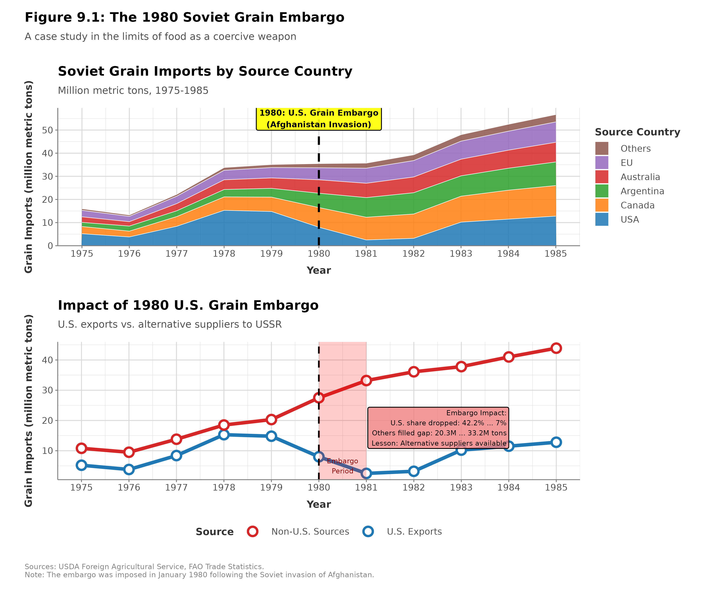
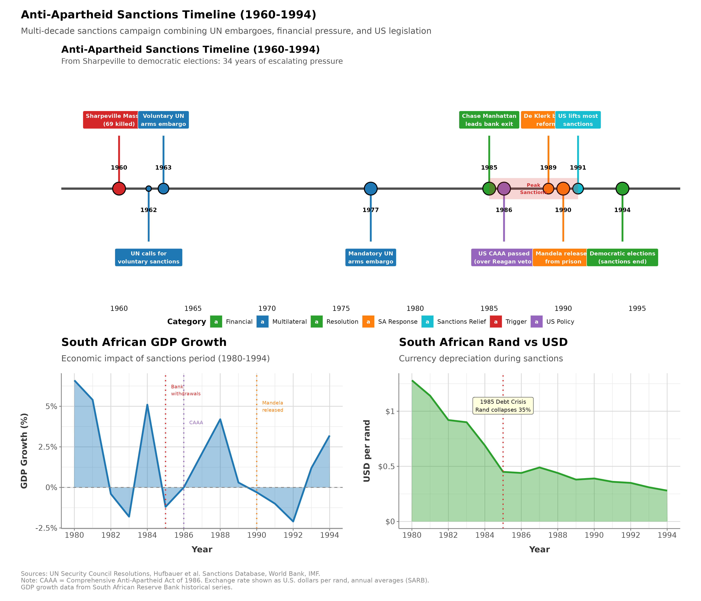
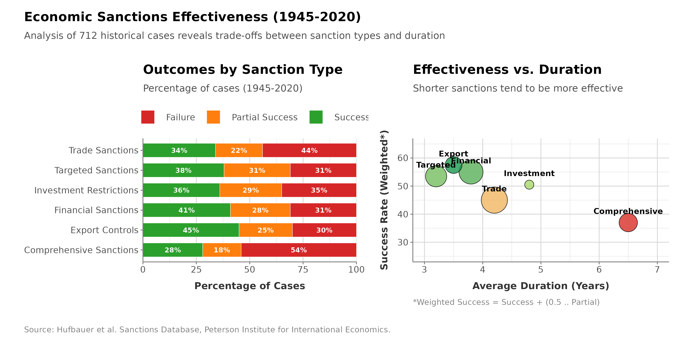
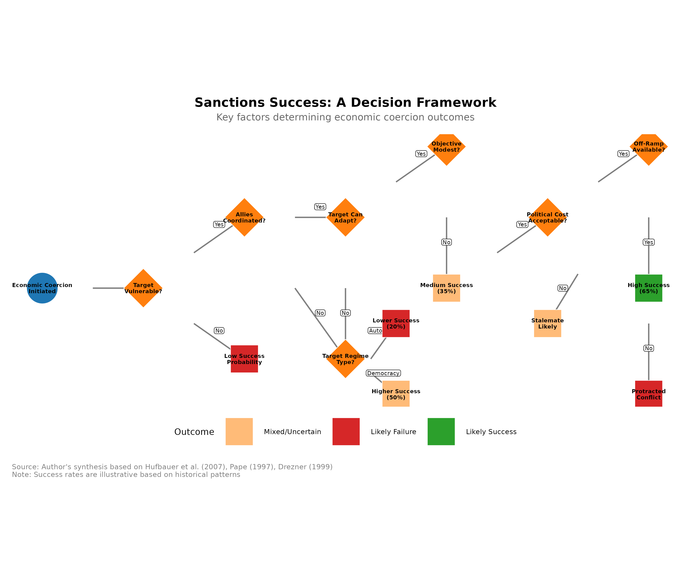
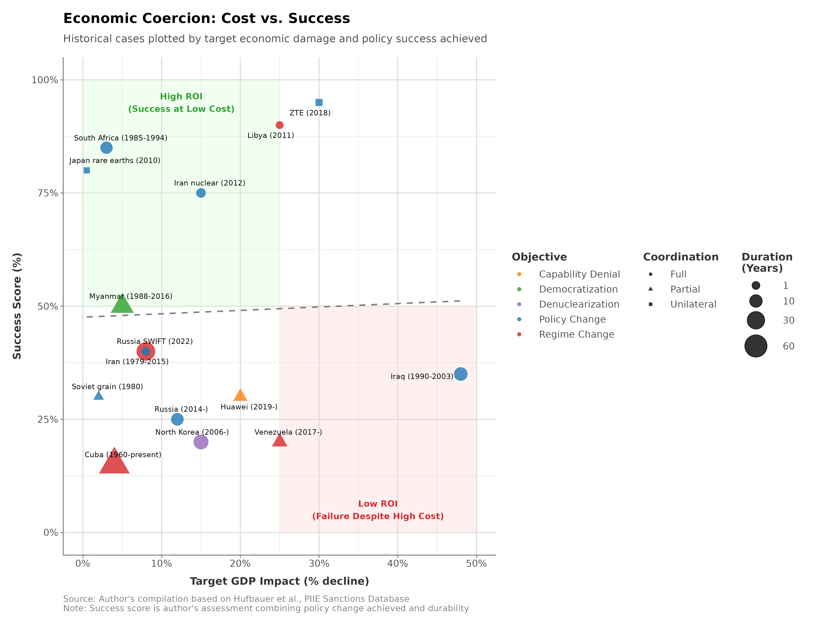

# Historical and Comparative Cases

## Learning Objectives

By the end of this chapter, readers should be able to:

1. Explain why multilateral coordination is the single most important determinant of whether economic coercion isolates a target or merely redirects its trade flows.
2. Apply the chapter's four synthesis conditions—multilateral coordination, target vulnerability, combined pressure, and realistic objectives—to classic cases (CoCom, the 1980 grain embargo, apartheid South Africa, Iraq) and to the contemporary sanctioning of Russia.
3. Use the two-margins framework introduced in Chapter 1—the substitution margin and the coalitional margin—to diagnose why particular coercion episodes succeeded or failed.
4. Distinguish capability degradation from compellence, and explain why sanctions routinely impose severe economic costs while failing to change a determined target's behavior.
5. Evaluate the methodological problems—selection bias, attribution, time horizons, and the definition of success—that make headline sanctions "success rates" difficult to interpret.

---

## Executive Summary

On December 24, 1979, Soviet forces began their invasion of Afghanistan—seizing Kabul and killing President Hafizullah Amin on December 27—triggering international condemnation and a U.S. strategic response combining military aid to Afghan resistance with economic pressure on Moscow. President Jimmy Carter's principal economic measure, an embargo on grain sales to the Soviet Union, aimed to impose costs on Soviet leadership while demonstrating American resolve. The embargo prohibited sales beyond the 8 million metric tons already contracted, cutting off an additional 17 million tons the Soviets had planned to purchase (Paarlberg 1980). American farmers, particularly in the Midwest, faced immediate economic pain as grain prices collapsed. Yet Soviet grain imports barely declined; Moscow purchased instead from Argentina, Canada, Australia, and other suppliers willing to fill the gap at slightly higher prices. The episode illustrates a recurring challenge of economic coercion: unilateral trade restrictions imposed by one supplier are easily circumvented when alternative sources exist and other countries prioritize commercial interests over geopolitical solidarity. The embargo failed to reduce Soviet supply while imposing losses on American farmers, a pattern that would recur for decades.

Each generation of policymakers rediscovers that economic coercion is harder than it looks: targets adapt, third parties defect, domestic costs mount, and strategic objectives often remain out of reach. The historical record also identifies when economic pressure works. South African apartheid collapsed partly under sustained international sanctions; CoCom technology restrictions degraded Soviet military capabilities for four decades; financial sanctions froze Libya, Iran, and North Korea out of global banking, imposing severe costs. Success and failure are separated by a few conditions, examined below: multilateral coordination, target vulnerability, alignment with broader pressure, and realistic objectives.

Three themes recur across the cases examined in this chapter. The first is that multilateral coordination substantially improves the effectiveness of economic coercion, though achieving and sustaining it is politically difficult. Unilateral sanctions face circumvention: if the United States embargoes grain to Russia, Argentina sells more; if America restricts technology to China, European firms capture market share. Multilateral sanctions, by contrast, can isolate targets comprehensively. UN Security Council sanctions on apartheid South Africa, international financial sanctions on Iran, and CoCom technology restrictions on the Soviet bloc all achieved broad participation that limited targets' alternatives. Coordination requires aligned interests (often absent), sustained diplomatic effort, and mechanisms to prevent defection. The CoCom regime succeeded for four decades because the Cold War threatened all Western democracies, providing a shared security imperative. Contemporary sanctions on Russia (post-2022) initially achieved unprecedented Western unity but face erosion as economic costs mount and third countries (India, China, Turkey) expand trade with Moscow. Sanctions on China would face even greater coordination challenges given China's economic centrality and divergent interests among potential sanctioning countries.

The second is that economic coercion succeeds mainly when it reinforces broader political, military, and normative pressure rather than operating in isolation. Apartheid sanctions contributed to South African regime change, but domestic resistance (ANC, UDF, labor unions), international isolation, and security deterioration (township uprisings, regional wars) created combined pressure that sanctions alone could not generate. Cuba, by contrast, endured six decades of U.S. embargo because Havana received Soviet support (until 1991), adapted economically through import substitution and tourism, and maintained domestic political control. Economic pressure multiplies its effect when combined with internal dissent, military pressure, diplomatic isolation, and normative delegitimization. Standalone economic measures rarely compel fundamental policy changes by capable, determined adversaries.

The third is that historical cases reveal a persistent trade-off between economic integration and coercive leverage. Deeper integration creates mutual dependence that both enables coercion (leverage over the integrated target) and constrains it (costs to the coercer). Europe's energy integration with Russia (40% of gas imports) created mutual dependence: Europe gained reliable, affordable energy, and Russia gained revenue and political influence. When Russia invaded Ukraine (2022), Europe possessed theoretical leverage (denying revenue) but faced severe constraints (energy shortages, economic contraction, political instability). Russia faced reciprocal constraints (lost revenue, technological cutoff) but possessed strategic reserves and alternative markets (China, India). The paradox of weaponized interdependence is that the most coercive relationships, those in which targets depend heavily on the coercer, are often precisely the ones in which coercers face high costs from disruption. Managing this trade-off requires either maintaining diversified relationships, which limits both dependence and leverage, or accepting that deep integration reduces policy flexibility.

The historical record suggests economic coercion is neither reliably effective nor uniformly futile. The expectation that sanctions will rapidly compel adversary compliance leads to disappointment and policy abandonment. The assumption that sanctions never work ignores cases where sustained, multilateral pressure achieved strategic objectives. Realistic assessment recognizes that economic coercion succeeds under specific conditions: when multilateral coordination limits circumvention, when economic measures reinforce broader pressure, when targets face genuine vulnerabilities, and when coercers accept sustained costs. These conditions are demanding, explaining both why economic coercion often disappoints initial expectations and why, in specific historical cases, it proved decisive.

These conditions map onto the two margins set out in Chapter 1. Multilateral coordination matters because it governs the target's substitution margin: when Argentina and Canada stood ready to sell grain, the Soviet substitution margin was wide and the embargo failed almost mechanically, whereas when CoCom held the Western allies together, the Soviet substitution margin for advanced technology stayed narrow for four decades and the restrictions proved effective. Alignment with broader pressure is usually a statement about the coalitional margin: the sanctions on apartheid South Africa mattered less for their aggregate economic weight than because they fell on, and helped to reorganize, the business and political coalitions whose support the regime required, reinforcing domestic and regional pressures already in motion. Cuba endured six decades of embargo because neither margin favored the coercer—Soviet support held the substitution margin open, and the pain fell on a population the regime could insulate and mobilize rather than on a coalition that could change the policy. Read this way, the historical record is less a catalog of idiosyncratic cases than the same two mechanisms played out under different conditions.

---

## U.S.-Soviet Economic Competition

For four decades (1949-1991), the United States and Soviet Union competed economically as well as militarily and ideologically. Unlike contemporary U.S.-China competition where deep economic integration creates mutual dependence, the U.S.-Soviet relationship featured limited trade and minimal financial ties. This facilitated Western economic restrictions, since less trade to restrict meant lower costs, but it also reduced leverage: a relationship that was never deeply connected offers little to sever. The autarkic Soviet economy was less vulnerable to external pressure than market-integrated economies. U.S. economic strategy employed multiple instruments: multilateral technology denial through CoCom, selective trade restrictions (grain embargo), pipeline sanctions targeting Soviet hard currency earnings, and financial isolation. Effectiveness varied dramatically across these instruments.

### CoCom: Multilateral Technology Denial (1949-1994)

**Origins and Structure**

The Coordinating Committee for Multilateral Export Controls (CoCom), established in November 1949, coordinated Western restrictions on technology exports to Communist countries (Mastanduno 1992). Its members—the NATO allies minus Iceland, together with Japan and Australia—amounted to seventeen countries that controlled most of the advanced technology in the Western world. The regime operated through three restricted-item lists: a Munitions List covering weapons, an Atomic Energy List covering nuclear technology, and an Industrial List covering dual-use technologies including computers, telecommunications, machine tools, and electronics. Export licenses for anything on these lists required the unanimous approval of CoCom members, which gave each participant an effective veto. The arrangement was deliberately informal—it had no treaty status and no permanent secretariat, working instead through regular meetings of national representatives in Paris—a structure that reduced visibility and bureaucracy at the cost of enforcement power. Restrictions were also differential: the Soviet bloc faced comprehensive controls, while China experienced somewhat lighter ones, relaxed further after the Sino-Soviet split.

**Strategic Logic**

CoCom aimed to degrade Soviet military capabilities by denying access to Western advanced technology essential for modern weapons systems. Soviet military R&D depended heavily on acquiring (legally and illegally) Western technology:

Soviet military R&D sought Western computing capabilities, including supercomputers essential for nuclear weapons design, ballistic missile calculations, and cryptography. It also depended on advanced electronics such as integrated circuits, sensors, and guidance systems, as well as telecommunications technology for secure communications, electronic warfare, and signals intelligence. In the manufacturing domain, precision machine tools were critical for producing aircraft, submarines, and missiles, while advanced materials---including composites, special alloys, and ceramics---rounded out the key technology areas that CoCom sought to restrict.

Soviet indigenous technology development lagged Western capabilities by estimated 5-10 years (longer in some fields like semiconductors and software) (Mastanduno 1992). CoCom restrictions forced Soviet military to rely on domestic inferior technology or acquire through espionage (time-consuming, incomplete, risk of detection).

**Effectiveness**

CoCom achieved substantial success in limiting Soviet access to strategic technology. The gap between Western and Soviet military technology persisted in significant part due to CoCom restrictions. Soviet military aircraft, submarines, and precision weapons exhibited persistent technological inferiority that could be traced to limitations in microelectronics, manufacturing, and materials---all areas subject to stringent export controls. By denying direct access to these technologies, CoCom also imposed a heavy espionage burden on Soviet intelligence. The KGB's Directorate T (Scientific and Technical Intelligence) dedicated enormous resources to Western technology theft, but espionage proved costly, uncertain, and capable of addressing only specific gaps rather than building overall industrial capability. Furthermore, by forcing the Soviet Union to develop inferior domestic substitutes through import substitution, CoCom imposed significant economic costs. The Soviet semiconductor industry, for example, consumed vast investment yet consistently produced chips that lagged years behind Western commercial products.

Despite these achievements, CoCom faced persistent limitations and challenges. The Soviets developed multiple circumvention strategies, acquiring restricted technology through third countries, front companies, and illegal diversions; Western intelligence repeatedly uncovered such procurement networks. Intra-alliance disputes also hampered the regime's effectiveness, as European allies often favored looser restrictions to preserve their commercial interests while the United States pushed for stricter controls, creating recurring diplomatic tensions. Enforcement gaps compounded these difficulties, since some members---particularly neutral countries with CoCom observer status---enforced restrictions less rigorously than others. Finally, rapid technological change posed an inherent challenge, making it difficult to define what constituted "restricted" technology, to update control lists to reflect new capabilities, and to prevent the commercial diffusion of dual-use technologies.

Despite limitations, scholarly consensus holds CoCom meaningfully degraded Soviet military capabilities (Mastanduno 1992; National Academy of Sciences 1987). The Soviet collapse (1991) ended the Cold War rationale; CoCom dissolved (1994), replaced by less restrictive Wassenaar Arrangement.

### Grain Embargo (1980): Unilateral Failure

<figure class="book-figure">
  
  <figcaption>Figure 9.1: Soviet grain imports by source country from 1975-1985, showing how alternative suppliers filled the gap left by the U.S. embargo.</figcaption>
</figure>

**Background and Implementation**

The Soviet invasion of Afghanistan in December 1979 prompted President Carter to impose a package of economic sanctions. Its centerpiece, the grain embargo of January 1980, suspended sales beyond the 8 million metric tons already contracted—the traditional minimum kept in place to preserve the trade relationship—cutting off roughly 17 million tons the Soviets had planned to buy. Alongside it came tightened high-technology export controls reaching beyond CoCom, a U.S. boycott of the 1980 Moscow Summer Olympics, and the revocation of Soviet fishing permits in American waters. The grain embargo drew the most attention, both for its visible domestic impact on American farmers and for its strategic logic: the Soviet Union was the world's largest grain importer, taking in 35-40 million tons annually, and the United States was its dominant supplier, providing 40-50% of Soviet imports in the late 1970s (Paarlberg 1980; USDA 1981).

**Strategic Logic**

The embargo pursued three aims at once: to impose economic costs by forcing Soviet livestock culling or bread rationing and so demonstrate Western economic power; to signal resolve about the consequences of the Afghan invasion; and, ultimately, to pressure the Soviet leadership into withdrawing from Afghanistan.

**Results**

The grain embargo largely failed. Soviet grain imports barely declined: in the 1979/80 marketing year they still reached approximately 31 million metric tons, only 5-6 million tons short of the pre-embargo target of 36-37 million (Paarlberg 1980; USDA 1981), as Argentina, Canada, Australia, and Brazil expanded their sales to the USSR. The Soviets circumvented the restriction with practiced ease—purchasing through intermediaries, rerouting shipments, and locking in long-term contracts with alternative suppliers. The costs, meanwhile, landed at home: American grain prices fell 10-20%, costing farmers and agribusiness billions (Paarlberg 1980), and political opposition mounted rapidly across the farm states. For all that pain, the political impact was minimal. Soviet leadership showed no sign of moderating its Afghanistan policy, and the occupation continued until the 1989 withdrawal—driven by military losses, economic crisis, and Gorbachev's reforms, not by grain pressure. The decisive weakness was allied non-participation: European allies, Japan, and the major grain exporters of Argentina, Canada, and Australia declined to join, prioritizing commercial interests, and unilateral U.S. action proved futile. President Reagan lifted the embargo in April 1981, acknowledging that it had harmed American farmers more than the Soviet Union.


**The Substitution Failure**
The Soviet grain embargo is the classic case of why unilateral commodity restrictions fail. Grain is fungible; one seller's wheat is interchangeable with another's. When the U.S. embargoed sales, Argentina, Canada, and Australia filled the gap, often at slightly higher prices the Soviets were willing to pay. American farmers lost their customers while Soviet grain imports barely declined. Restricting commodity exports works only if all major suppliers participate.


**Lessons**

The episode illustrated the characteristic limitations of unilateral trade sanctions. Commodities with multiple suppliers are easily replaced, so restricting one source merely shifts purchases to others; without coordination, third parties capture the market share while the target's supply holds steady; export restrictions hurt domestic producers, generating political pressure for reversal; and even a dominant market position—the United States controlled 50% of global grain exports—confers insufficient leverage when alternatives exist (Paarlberg 1980).

### Siberian Pipeline Sanctions (1981-1982): Extraterritorial Overreach

**Background**

The Siberian Pipeline project (Urengoy-Uzhgorod-Western Europe) would carry Soviet natural gas to Western Europe, generating hard-currency revenue for Moscow while deepening European energy dependence on the USSR (Jentleson 1986). The Reagan administration opposed it on three strategic grounds. Gas sales would earn the Soviet Union billions annually, financing its military and subsidizing an inefficient economy. European reliance on Soviet gas would create vulnerability to supply cutoffs, handing Moscow political leverage. And pipeline construction required Western technology—compressors, large-diameter pipes, pumps—that would enhance Soviet capabilities.

**Sanctions Implementation**

In December 1981, Reagan prohibited U.S. firms from exporting oil and gas equipment to the Soviet Union. In June 1982 the measure was expanded to an extraterritorial scope, barring both U.S. subsidiaries abroad from supplying equipment and foreign companies from using U.S.-origin technology under license to produce equipment for the pipeline. That reach fell directly on European firms—France's Creusot-Loire, Germany's AEG, the United Kingdom's John Brown—that were relying on American technology licenses to manufacture compressors and turbines for the project.

**Allied Resistance and Failure**

European allies rejected the extraterritorial sanctions outright, and for several reinforcing reasons. They regarded Washington's attempt to control their companies' behavior as illegal overreach, a violation of international law and sovereign authority. Their firms held contracts worth billions, and their governments wanted both the gas supplies and the export revenue. They also disagreed on strategy, believing that engagement and trade moderated Soviet behavior while economic isolation risked sharpening confrontation. So they defied Washington: the British, French, German, and Italian governments ordered their companies to fulfill the pipeline contracts despite U.S. sanctions, invoking "blocking statutes" that prohibited compliance with extraterritorial American law. Rejecting Washington's claim of authority over firms operating on their own territory, the allies held firm, and the United States ultimately retreated.


**The Birth of Blocking Statutes**
The Siberian Pipeline dispute gave birth to a legal tool still used today: blocking statutes. European countries enacted laws prohibiting their companies from complying with extraterritorial U.S. sanctions, putting firms in an impossible position between conflicting legal requirements. The EU's updated Blocking Statute (1996, reinforced 2018) serves the same purpose against Iran secondary sanctions. These statutes rarely work in practice—companies usually choose U.S. market access over legal protection from their home governments—but they establish a sovereignty principle that complicates U.S. extraterritorial enforcement.


**U.S. Retreat**

By November 1982, facing allied unity in opposition and recognizing sanctions' futility, Reagan lifted extraterritorial sanctions. The pipeline completed on schedule (1983), supplying Western Europe with Soviet gas through the 1980s and beyond (with interruptions during 2006, 2009 disputes with Ukraine and 2022 Ukraine war).

**Lessons**

The pipeline sanctions demonstrated several things at once. Attempting to impose U.S. law on allied companies generated backlash and collapsed once allies chose to prioritize sovereignty, confirming that major sanctions require allied agreement and that unilateral American action can be not merely ineffective but counterproductive. The episode also exposed the double edge of energy interdependence: the European dependence on Russian gas that the Siberian pipeline helped create would later hand Moscow leverage in 2022, even as it constrained Europe's own response. And it proved durable in exactly the wrong way—the pipeline operated for decades, generating revenue for the Soviet Union and its Russian successor, a standing demonstration that the sanctions had failed to prevent the strategic outcome they targeted.

### Synthesis: U.S.-Soviet Economic Competition Lessons

The Soviet-era record divides cleanly. CoCom's technology restrictions, sustained over four decades with allied coordination, degraded Soviet military capabilities and imposed persistent costs on Soviet R&D and manufacturing. The unilateral trade restrictions of the grain embargo and the extraterritorial overreach of the pipeline sanctions, by contrast, failed—undone by allied non-participation, alternative suppliers, and political backlash.

Four lessons follow. Multilateral coordination was essential: CoCom worked because the allies shared a Cold War threat perception and sustained their cooperation, whereas unilateral U.S. measures failed (Chapter 4 explores how contemporary export controls attempt to apply these CoCom lessons to the semiconductor competition with China). The nature of the good mattered too—restricting specialized technology, with few suppliers and hard-to-replicate capabilities, proved far more effective than restricting substitutable commodities with many suppliers. So did duration: CoCom required decades, while the grain embargo's sixteen months proved futile. And effectiveness carried a price, since serious sanctions impose costs on the sanctioner in lost trade and allied friction, so that sustaining them demands political will and strategic priority.

---

## Anti-Apartheid Sanctions on South Africa

International sanctions against South Africa's apartheid regime (1960s-1990s) represent one of history's most comprehensive sanctions campaigns and one of the few cases where economic coercion clearly contributed to fundamental regime change. Yet the case also illustrates complexity: sanctions operated alongside internal resistance, international isolation, security pressures, and normative evolution. Disentangling sanctions' specific causal impact from these parallel factors challenges simple narratives about sanctions' effectiveness.

### Apartheid System and International Response

**Apartheid Foundations**

South Africa's apartheid system (Afrikaans for "separateness") institutionalized racial segregation through laws that sorted the population into groups—White, Black, Coloured, Indian—with sharply differential rights. The Black majority, some 75% of the population, was denied voting rights and political representation. The Group Areas Act assigned racial groups to designated areas, forcibly removing millions, while pass laws restricted Black movement and channeled labor to white-owned mines, farms, and industries. The economic asymmetry was staggering: whites—approximately 15% of the population by the 1980s, about 16% at the 1980 census and declining thereafter—owned 87% of the land and dominated some 90% of the formal economy, while the Black majority was confined to just 13% of the country's territory. That 87/13 division was first codified by the Natives Land Act of 1913 and entrenched by the Native Trust and Land Act of 1936, and Black per capita income ran at less than 10% of white levels. Undergirding all of it was repression, as security forces crushed dissent through bannings, detentions, torture, and killings. The National Party government (1948-1994) defended the whole edifice as necessary to preserve white minority civilization and prevent Black majority rule.

**International Condemnation**

From the 1960s onward, international opposition intensified. The General Assembly condemned apartheid, and the Security Council imposed an arms embargo in 1977 (Resolution 418). Apartheid's explicit racism offended post-war human rights norms and the momentum of decolonization. Yet the Cold War complicated the response: the United States and its Western allies initially resisted comprehensive sanctions, viewing South Africa as an anti-communist bulwark, while the Soviet Union and the non-aligned movement championed them.

### Evolution of Sanctions (1960s-1980s)

**Early Measures (1960s-1970s)**

The first wave of measures was uneven. A UN arms embargo—voluntary from 1963, mandatory from 1977—prohibited weapons sales, though its effectiveness was blunted by South Africa's development of a domestic arms industry and by covert purchases. Sports isolation cut deeper into the national psyche than its material weight suggested: the International Olympic Committee suspended South Africa in 1970, and the rugby, cricket, and soccer federations imposed bans that sports-mad white South Africans bitterly resented. Artists, academics, and musicians declined engagements in a widening cultural boycott. National sanctions, however, remained selective—the Nordic countries and the Communist bloc imposed trade and investment restrictions while the United States and the major European economies kept their relations intact.

**Comprehensive Sanctions Push (1980s)**

The township uprisings of 1984-1986, protests marking the anniversary of the Sharpeville massacre, and mounting violence renewed the pressure for sanctions. Fresh UN proposals went nowhere—the United States and the United Kingdom repeatedly used their Security Council vetoes to block mandatory comprehensive measures—so the action shifted to national capitals.

The most consequential single measure was the U.S. Comprehensive Anti-Apartheid Act of 1986, passed over President Reagan's veto by a bipartisan Congressional majority. Its provisions:

- Banned new U.S. investment in South Africa
- Prohibited imports of South African agricultural products, textiles, steel, and iron
- Restricted exports of computers and nuclear technology to South Africa
- Required U.S. firms operating in South Africa to follow the Sullivan Principles on fair employment practices

The European Community imposed its own investment restrictions and bans on steel and gold krugerrand imports, though the United Kingdom resisted comprehensive measures; across the Commonwealth, member states adopted a patchwork of sanctions, with Canada, Australia, and India particularly active. The financial track bit hardest: banks such as Citibank and Barclays withdrew from South Africa, cutting off credit and forcing debt renegotiations as capital flight accelerated. A parallel disinvestment campaign, in which universities, pension funds, and municipalities sold off their South African holdings, pressured corporations to leave—by 1989, more than 200 U.S. companies had exited the country (Crawford and Klotz 1999).

<figure class="book-figure">
  
  <figcaption>Figure 9.2: The anti-apartheid sanctions campaign, 1960-1994 — escalation timeline with the economic toll visible in GDP growth and the rand's slide against the dollar.</figcaption>
</figure>

### Economic Impact on South Africa

Quantifying the economic effect of sanctions is difficult, because so much moved at once: domestic unrest was depressing investment independently, oil price shocks and global recessions were buffeting the economy, and South Africa was actively countering pressure through import-substitution industrialization. With those caveats, the estimated impacts are still striking. GDP growth slowed from around 5% annually in the 1960s to near-zero in the 1980s—sanctions contributed, though internal instability, commodity prices, and structural problems were also at work. Foreign direct investment slowed dramatically over the 1980s and turned to net outflows by the end of the decade as the disinvestment campaigns took hold, with financial sanctions and voluntary bank withdrawals cutting off access to capital. Exports declined, manufactured goods most of all, and although South Africa circumvented some restrictions through sanctions-busting—rerouting exports, relabeling origins—it did so at higher cost. The currency told the story most vividly: the rand slid from roughly \$1.30 per rand in 1980—the U.S. dollar first surpassed the rand only in March 1982—to about \$0.40 per rand by 1989, some R2.50 to the dollar, reflecting capital flight and economic deterioration (South African Reserve Bank data).


**The Rand Collapse: The Reach of Financial Sanctions**
South Africa's rand lost more than two-thirds of its dollar value in less than a decade, sliding from about \$1.30 per rand in 1980 to roughly \$0.40 per rand—about R2.50 to the dollar—by 1989. The currency's decline reflected the effect of financial sanctions when banks withdraw credit, investors flee, and capital markets close. Trade sanctions can be circumvented through smuggling and rerouting; financial isolation is harder to evade, because a country cannot print foreign currency or generate international credit from domestic resources. The 1985 debt moratorium showed that even resource-rich countries depend on access to global finance.


Two further effects compounded the damage. Unable to refinance its external debt, South Africa was forced into the 1985 debt moratorium and a painful restructuring. And beyond the balance sheet, the accumulating isolation, economic pressure, and capital flight carried a message to the white elite that apartheid was becoming unsustainable—that its costs had begun to outweigh its benefits.

### Internal Resistance and Combined Pressure

Sanctions never operated on their own; they worked alongside powerful domestic and regional pressures. Internal resistance came from several directions at once—the African National Congress waged underground resistance, armed struggle through Umkhonto we Sizwe, and international diplomacy; the United Democratic Front drove domestic mass mobilization and township uprisings; COSATU's labor strikes disrupted the economy; and the youth sustained school boycotts, stone-throwing protests, and campaigns of deliberate "ungovernability." Security deteriorated in parallel. The regional wars in Angola and Mozambique drained resources and made conscription unpopular among whites, township violence provoked state repression that stretched police and military thin, and diplomatic isolation—the Olympic ban, the cultural boycott—confirmed South Africa's pariah status. Under this combined weight the white elite began to reassess. The business community concluded that apartheid was economically unsustainable and opened dialogue with the ANC, Afrikaner intellectuals questioned its morality and viability, and the National Party pragmatists around F.W. de Klerk decided that a negotiated transition was preferable to violent collapse.

### Sanctions' Causal Role

Whether sanctions caused apartheid's end or merely coincided with a collapse driven by other factors remains contested, and the evidence supports a qualified middle position. Those who stress the importance of sanctions point to four things: sanctions accelerated the economic crisis and convinced the white elite that apartheid's costs now exceeded its benefits; international unity signaled to the regime that it would face sustained opposition; that same unity signaled to the ANC and the domestic opposition that they enjoyed global support; and the isolation conveyed a moral repugnance that eroded the regime's legitimacy. Skeptics counter that internal upheaval, not external pressure, drove the crisis; that the economic damage was limited, since South Africa adapted through import substitution and sanctions-busting and its economy struggled without collapsing; that the timing is wrong, because the major sanctions of 1985-1986 came late while serious negotiations began only after 1989, propelled by de Klerk's rise, domestic dynamics, and the Soviet collapse that removed the Cold War rationale; and that apartheid might well have ended anyway, undone by its own internal contradictions, demographic pressures, and security costs.

The scholarly consensus (Hufbauer et al. 2007; Crawford and Klotz 1999) settles between these poles: sanctions contributed significantly but were not solely determinative, operating as one strand of a combined economic, political, military, and normative pressure that made apartheid untenable. Isolating their specific impact is methodologically fraught, but the evidence suggests that sanctions accelerated the timeline by raising costs, that financial measures—bank withdrawals and investment bans—bit harder than trade restrictions, that the psychological and normative effects on the white elite may have mattered as much as the material economic costs, and that domestic resistance created the conditions in which sanctions could matter at all—absent the internal upheaval, external sanctions alone would likely have been insufficient.

### Lessons from South Africa Case

Five lessons emerge from the case. Comprehensive sanctions require sustained coordination: the anti-apartheid campaign took decades to assemble, had to overcome Cold War divisions, and succeeded partly on the strength of a rare normative consensus rooted in apartheid's explicit racism. They worked best in combination, economic isolation reinforcing internal resistance, security costs, and diplomatic isolation rather than standing alone. Target characteristics mattered, too: apartheid South Africa's dependence on foreign capital, technology, and international legitimacy created the vulnerabilities that more autarkic or authoritarian regimes—North Korea, Cuba—simply do not present. The time horizon was long, with sanctions operating for more than twenty-five years before they contributed to regime change, so that any short-term expectation of one to three years would have produced a premature verdict of failure. And the normative dimension was decisive: the moral clarity of the anti-apartheid cause eased coalition-building and sustained political will in a way that disputes resting on contested foundations, such as territorial claims, struggle to match.


**The Combined Pressure Requirement**
South Africa's case indicates that economic sanctions rarely succeed alone. Apartheid collapsed under combined pressure from multiple sources: economic sanctions, internal resistance (ANC, labor unions, township uprisings), security deterioration (regional wars draining resources), diplomatic isolation, and normative delegitimization. Sanctions were necessary but not sufficient. The policy implication is that sanctions cannot substitute for an entire strategy. Economic pressure must combine with other instruments, including military deterrence, diplomatic isolation, and support for internal opposition, to achieve fundamental change.


---

## Iraq Sanctions (1990-2003): The Paradox of Comprehensive Coercion

The comprehensive international sanctions against Iraq from 1990 to 2003 represent one of the most extensive and prolonged economic coercion campaigns in modern history. The sanctions regime, imposed by the United Nations Security Council following Iraq's invasion of Kuwait, was unprecedented in scope: a total trade embargo cutting off oil exports (Iraq's principal source of revenue), comprehensive import restrictions, asset freezes, and financial isolation. The paradox of the regime is that it devastated Iraqi civilians while failing to achieve its stated political objectives. The case illustrates several tensions in economic coercion: comprehensiveness versus targeting, multilateral legitimacy versus enforcement challenges, and the moral hazard of imposing large civilian costs in pursuit of political objectives.

### Strategic Context and Objectives

On August 2, 1990, Iraqi forces invaded and occupied Kuwait. The international community responded with unprecedented speed and unity. Within four days, the UN Security Council adopted Resolution 661, imposing comprehensive sanctions prohibiting all trade with Iraq except food and medicine. Resolution 665 followed, authorizing naval blockade to enforce the embargo. When Iraq refused to withdraw by the January 15, 1991 deadline, a U.S.-led coalition launched Operation Desert Storm, liberating Kuwait by February 28. Sanctions nonetheless continued and intensified.

The sanctions regime pursued multiple, shifting objectives over thirteen years: (1) withdrawal from Kuwait (achieved through military force by February 1991); (2) compliance with disarmament obligations under UN Security Council Resolution 687 (chemical, biological, and nuclear weapons destruction); (3) payment of war reparations to Kuwait; and (4) implicitly, regime change (though Security Council resolutions never explicitly authorized this). As objectives evolved from concrete military demands to vague political transformation, sanctions became decoupled from achievable success criteria.

### Four-Dimension Framework

**Domain**: The Iraq sanctions spanned virtually every domain of economic statecraft: trade embargo (exports and imports), financial asset freezes, oil revenue restrictions through the Oil-for-Food Programme (1996-2003), and transportation sanctions blocking aircraft and shipping. The comprehensiveness reflected coalition determination to punish Iraqi aggression and compel compliance with disarmament obligations.

**Target**: The sanctions targeted the Iraqi state under Saddam Hussein's Ba'ath Party regime. However, the regime's distributional control—allocating resources to military, security services, and loyalist populations while allowing civilian sectors to deteriorate—meant sanctions disproportionately harmed ordinary Iraqis rather than the regime itself. The target adapted to sanctions in ways that strengthened rather than weakened political control.

**Objective**: Sanctions pursued compellence (forcing compliance with UN resolutions) and implicitly, containment and regime change. However, objectives proved unachievable through economic means alone: Hussein calculated that maintaining power required retaining weapons capabilities that served domestic deterrence and regional influence, making compliance politically impossible even under severe economic pressure.

**Intensity**: The Iraq sanctions represented maximum intensity—comprehensive trade embargo cutting 95% of pre-war trade, financial isolation blocking international transactions, and oil export restrictions removing virtually all hard currency earnings (Gordon 2010). This comprehensiveness generated maximum economic damage but also maximum civilian suffering.

### Economic Devastation and Humanitarian Catastrophe

The sanctions devastated the Iraqi economy. GDP contracted by an estimated 50-60% from 1990-1996 (World Bank estimates; precise figures uncertain due to data limitations under sanctions). Oil exports collapsed from an estimated $12-15 billion (1989) to effectively zero, eliminating government revenue and foreign exchange. Inflation exceeded 1,000% annually. Industrial production collapsed; infrastructure deteriorated; agricultural productivity declined.

Human development indicators reversed: malnutrition increased and medical supplies dwindled. A 1999 UNICEF/Government of Iraq survey was widely cited for the claim that 500,000 or more Iraqi children died as a result of sanctions (Gordon 2010), but that figure is now regarded as unreliable. Reanalyzing the underlying survey data, Dyson and Cetorelli (2017) conclude that the Saddam Hussein regime manipulated the 1999 survey to sway international opinion against sanctions, and that there was in fact no major rise in child mortality during the sanctions period. The humanitarian toll was serious, but the true excess-mortality figure was almost certainly far below the half-million number that shaped a generation of sanctions debate. Even so, the perception of mass child death was politically decisive: Denis Halliday, UN Humanitarian Coordinator in Iraq (1997-1998), resigned in protest, calling sanctions "genocidal." Madeleine Albright's 1996 statement that the price of containing Saddam was "worth it" when questioned about child deaths became a touchstone for sanctions critics.

Yet costs were not evenly distributed. The regime maintained its security apparatus and military capabilities throughout the sanctions period. Saddam Hussein built palaces while hospitals lacked basic supplies. This distributional asymmetry—regime survival vs. civilian suffering—is central to the sanctions' moral critique and effectiveness failure.

### The Oil-for-Food Dysfunction

The Oil-for-Food Programme (1996-2003), allowing limited oil exports for humanitarian imports, partially alleviated suffering but proved dysfunctional: billions in illicit revenue flowed to the regime through kickbacks, surcharges, and smuggling; UN officials faced corruption allegations; and humanitarian goods were frequently delayed by Iraqi bureaucratic obstruction. The program demonstrated that partial relief can sustain sanctions politically while providing inadequate humanitarian protection—and that sanctioned regimes can capture humanitarian mechanisms for their own benefit.

### Effectiveness Assessment

**Objectives Achieved: Failed**

Sanctions achieved withdrawal from Kuwait—but only because military force compelled it. They failed to compel full Iraqi compliance with weapons inspections: Hussein obstructed inspectors and hid weapons programs, contributing to the 1998 breakdown in inspections and the withdrawal of UN inspectors. Sanctions failed to achieve regime change: Hussein remained in power until the 2003 U.S. invasion. The sanctions regime collapsed under its own weight—political pressure, humanitarian concerns, and widespread smuggling undermined enforcement.

**Cost Imposition: Severe but Counterproductive**

Sanctions imposed catastrophic economic costs but failed to create compliance incentives. Hussein calculated that accepting sanctions was preferable to the existential threat of revealing (or eliminating) weapons programs that buttressed his domestic power and regional deterrence. The regime developed sophisticated smuggling networks (with Jordan, Turkey, Syria, and Gulf states) and patronage systems that actually strengthened political control.

**Third-Party Compliance: Eroded**

While Iraq sanctions enjoyed Security Council authorization, enforcement eroded over time. Coalition members faced pressure from commercial interests seeking sanctions-busting opportunities. Russia, France, and China increasingly opposed sanctions as 2003 approached. Without consistent enforcement, comprehensive sanctions became porous.

**Duration: Unsustainable**

Thirteen years of comprehensive sanctions without clear off-ramps exhausted international resolve. The indefinite nature of sanctions—shifting from concrete compliance demands to vague containment goals—undermined political sustainability. Sanctions became an end rather than means, continuing because stopping seemed like rewarding aggression despite having failed to achieve objectives.

### Lessons for Contemporary Policy

The Iraq sanctions experience profoundly shaped subsequent economic statecraft thinking:

**1. Comprehensiveness carries humanitarian costs that undermine legitimacy.** Sanctions imposing mass civilian suffering generate moral outrage, political backlash, and enforcement erosion. The international community subsequently embraced "targeted" or "smart" sanctions—financial measures, travel bans, arms embargoes—aiming to pressure regimes without devastating populations.

**2. Sanctions without achievable objectives become endless.** When objectives shift from concrete demands to vague goals, sanctions become unmoored from measurable success criteria. Effective sanctions require clear, achievable objectives with off-ramps for compliance.

**3. Regime adaptation can neutralize sanctions.** Authoritarian regimes with distributional control can weather pressure that democracies or market economies cannot. Sanctions' effectiveness depends on targets' adaptation capacity.

**4. Multilateral enforcement requires sustained political will.** Comprehensive sanctions require enforcement mechanisms and international consensus that erode over time.

**5. Sanctions failure may lead to military escalation.** When 13 years of sanctions failed to remove Saddam Hussein, the 2003 invasion cited sanctions failure as justification. Sanctions may not be alternatives to military force but stepping stones toward it.

### Comparative Assessment

Iraq contrasts with other historical cases: South Africa sanctions succeeded (partly) because they combined with internal resistance and international normative pressure; Iraq lacked comparable domestic opposition. Iran sanctions (post-1979) similarly imposed costs without regime change, though Iran's larger, diversified economy enabled greater resilience. Post-2022 Russia sanctions attempt to apply "smart sanctions" lessons—targeting financial networks and technology chokepoints while avoiding comprehensive trade embargoes that would devastate populations while potentially strengthening authoritarian regimes.

The Iraq sanctions case ultimately demonstrates that economic coercion's most extreme form can impose catastrophic costs without achieving political objectives. The lesson shaped subsequent doctrine: modern sanctions emphasize targeting, proportionality, and off-ramps, seeking to coerce compliance without recreating Iraq's humanitarian catastrophe.

---

## Russia Sanctions (2022-2026): Coercing a Great Power

The Western response to Russia's full-scale invasion of Ukraine on February 24, 2022 is the most comprehensive sanctions campaign ever mounted against a major economy, and the defining test of the questions this chapter poses. It combined nearly every instrument surveyed in this book—reserve immobilization, financial disconnection, price caps, technology denial—against a nuclear-armed, veto-wielding member of the Security Council deeply woven into global energy and commodity markets. Four years on, it offers an unusually clean reading of the two margins introduced in Chapter 1. (The financial mechanics summarized here are treated in detail in Chapter 7.)

### Background: "Fortress Russia"

After the comparatively mild Western reaction to its 2014 annexation of Crimea, Moscow spent eight years building a sanctions-resistant economy. The central bank accumulated some \$630 billion in reserves, diversified away from the dollar toward gold, euros, and renminbi, paid down external debt, and ran conservative fiscal buffers through a National Wealth Fund. Policymakers assumed this "Fortress Russia" would let the country absorb whatever the West imposed. The assumption proved half right—and the wrong half.

### The Coercion

Western measures escalated across several fronts. **Reserve immobilization** came first and mattered most: within days, the G7, EU, Japan, and others froze roughly \$300 billion of the Russian central bank's foreign reserves held in their jurisdictions—about half the total—with some \$200 billion sitting at the Belgian securities depository Euroclear. The freeze turned "Fortress Russia" against itself, neutralizing the very buffer built to withstand pressure and signaling to every reserve manager that dollar and euro holdings are politically contingent (Demarais 2022). **Financial disconnection** followed: selected major Russian banks were expelled from the SWIFT messaging network (an initial batch in March 2022, expanded through 2022), alongside correspondent-banking cutoffs and asset freezes.

The **oil price cap** was subtler. Because cutting Russian crude off entirely would have spiked global prices, the G7 and EU instead set a \$60-per-barrel cap (effective December 5, 2022 for crude, February 2023 for products), enforced through the Western-dominated shipping-insurance and services complex. The design goal was to keep Russian barrels flowing while capping the Kremlin's per-barrel revenue. **Export controls** applied the CoCom logic of this chapter's opening to a twenty-first-century target: the United States extended the Foreign Direct Product Rule and coordinated with allies to deny Russia advanced semiconductors, avionics, machine tools, and other dual-use technology.

Pressure ratcheted up rather than easing. In October 2025—in the first major Russia action of the second Trump administration, coordinated with the United Kingdom and the EU—OFAC designated Rosneft and Lukoil, Russia's two largest oil companies, as blocked persons under Executive Order 14024, reaching directly at the export revenues sustaining the war economy (U.S. Treasury 2025).

### Adaptation

Russia's countermeasures map precisely onto the substitution and coalitional margins. To escape the price cap's reliance on Western insurance, Russia assembled a **"shadow fleet"** of several hundred aging tankers operating outside G7 services, which came to carry the majority of its seaborne crude and let much of it trade above the cap (KSE Institute 2023). Barrels once bound for Europe were **rerouted to Asia** at a discount: India, which had bought almost no Russian crude before the war, took roughly a third or more of its oil from Russia by 2023-2024, and China increased purchases as well. Trade with these partners shifted toward **renminbi, rupees, and dirhams**, cleared increasingly through China's CIPS rather than SWIFT—accelerating exactly the fragmentation Demarais (2022) warned sanctions would provoke (Chapter 7 explains why messaging and settlement are not the same thing). Restricted Western technology, meanwhile, continued to reach Russia through **parallel imports**—re-exported chips and components routed via Turkey, the UAE, Central Asia, and China—blunting but not defeating the export controls.

### Assessment

Measured against the chapter's synthesis conditions, the record is mixed. Multilateral coordination among the sanctioners held to a degree few predicted, denying Russia the intra-alliance defections that sank the grain and pipeline sanctions—but the coalition was Western, not global. The neutrality of India, China, Turkey, and the Gulf kept alternative buyers in the market and gutted the price impact the cap was meant to deliver. Target vulnerability was real but bounded: Russia depended on Western technology and financial plumbing (genuine chokepoints) yet was resource-self-sufficient and export-diversified enough to reroute its most valuable output. And the objective drifted from the achievable (degrading Russia's war-making capacity) toward the maximalist (compelling withdrawal from Ukraine), reprising the objectives-inflation that undid the Iraq regime.

Read through the two margins, the outcome is legible. On the **substitution margin**, energy rerouting succeeded almost completely—Russia found new buyers faster than the West could close them off—while technology substitution was only partial, forcing reliance on smuggled and lower-grade inputs that degraded quality and raised costs. On the **coalitional margin**, Western cohesion was the campaign's great achievement and non-Western neutrality its great limitation: the coalition was deep but not wide.

The honest verdict is therefore split. Capability degradation is real but slow: sanctions and export controls raised the cost and lowered the quality of Russian military production, strained aviation and high-tech sectors, and forced the economy onto an overheated, inflationary war footing. Compellence, however, failed. The Russian economy contracted only about 2% in 2022—far less than the collapse many forecast—before war spending drove a rebound, and Moscow neither withdrew from Ukraine nor altered its core aims. As with apartheid South Africa, the measures that bit hardest were financial rather than commercial; as with Iraq, comprehensive pressure imposed enormous costs without producing political capitulation. The Russia case confirms the chapter's central lesson: economic coercion degrades and constrains far more reliably than it compels, and its ceiling is set by the target's substitution options and the breadth—not merely the depth—of the coalition applying it.

---

## Historical Comparisons - Patterns Across Eras

Economic coercion long predates the 20th century. Examining earlier cases reveals enduring patterns: states have always weaponized trade and finance when feasible, effectiveness depends on target vulnerabilities and circumvention opportunities, and unintended consequences frequently undermine original objectives.

### Napoleon's Continental System (1806-1814)

**Background and Objectives**

Following his victories against Austria, Prussia, and Russia between 1805 and 1807, Napoleon Bonaparte controlled most of continental Europe. Unable to invade Britain—the Royal Navy had dominated the seas since Trafalgar in 1805—he turned to economic warfare, and the Berlin Decree of 1806 and the Milan Decree of 1807 established the Continental System, prohibiting European trade with Britain (Heckscher 1922). The strategic logic was straightforward: Britain depended on European markets for its manufactured exports and on imported foodstuffs, so by closing the Continent's ports Napoleon aimed to trigger British economic collapse—unemployment, bankruptcy, starvation—and force political submission.

**Implementation and Circumvention**

Napoleon enforced the system by military means, garrisoning occupied ports to monitor compliance, confiscating British goods found on the Continent, and imposing the Continental System on allied and conquered states alike. Yet circumvention proved endemic. British goods slipped in through neutral countries—Sweden, Portugal until 1807, Russia after 1810—as well as through coastal smuggling and merchant connivance. The most damaging breach was political: Tsar Alexander I withdrew Russia from the Continental System in 1810 and resumed trade with Britain, a defection that helped draw Napoleon into his catastrophic 1812 invasion. And the system inflicted real pain on Europe itself, since blocking British trade hurt economies that depended on British manufactured goods such as textiles and tools and on colonial products such as sugar, coffee, and cotton—shortfalls that French industry could not make good.

**Results**

The Continental System largely failed. The British economy survived: exports to Europe fell 25-30% between 1807 and 1809, but Britain compensated by expanding trade with Latin America, the Ottoman Empire, and its global colonies (Heckscher 1922), enduring the recession of 1810-1811 without collapse. Economic pain and nationalist resentment of French domination fed resistance across the Continent, and Spain in 1808, Russia in 1812, and Germany in 1813 revolted partly under the system's costs. The denouement was French defeat: the 1812 invasion of Russia, motivated in part by the need to enforce the blockade, proved catastrophic, and the coalition wars of 1813-1814 brought France down and Napoleon to abdication in 1814.

The lessons anticipate every later case in this chapter. Unilateral sanctions face global circumvention, because Britain's worldwide trade network offered alternatives the moment Europe closed. Enforcement is costly, and the military occupation required to police the Continental System overstretched French power. Blowback matters, since the economic pain inflicted on European allies bred the resentment that corroded Napoleon's own coalition. And target resilience is easily underestimated—economically diverse, globally connected Britain proved far tougher than Napoleon had anticipated.

### British Trade Restrictions on American Colonies and Early Republic

Under the mercantilism of the seventeenth and eighteenth centuries, Britain restricted colonial trade to benefit the mother country through the Navigation Acts: the colonies could export staples such as tobacco, cotton, and timber only to Britain, had to import manufactured goods from Britain rather than make them locally or buy from competitors, and could ship only in British vessels. Resentment of these restrictions fed American revolutionary sentiment, and "no taxation without representation" carried an unspoken corollary of "no trade restrictions without representation."

Independence in 1783 did not end the contest. Britain excluded U.S. ships from the West Indies trade, restricted American exports, and tried to preserve a colonial-style economic dominance. The American responses ranged from reciprocal tariffs on British imports to the most sweeping self-inflicted measure of the era, Jefferson's Embargo Act of 1807, which prohibited all U.S. exports in an attempt to coerce Britain and France—both then interfering with American shipping during the Napoleonic Wars—by denying them American goods. The embargo devastated the U.S. economy, and New England's maritime trade above all, made little impression on Britain or France, and was repealed in 1809 amid fierce domestic opposition. The War of 1812, fought partly over British trade restrictions and the impressment of sailors, ended in 1815 with a return to pre-war trade patterns but a hardened American determination to resist economic coercion. The lessons are of a piece with the others: trade restrictions helped drive colonial independence movements, unilateral export embargoes like Jefferson's harmed the imposing country more than their targets, and economic disputes proved inseparable from questions of sovereignty, maritime rights, and national identity.

### Patterns Across Historical Cases

From Napoleon to the present, the same patterns recur. The first is circumvention through substitution: unless sanctions are truly global, targets find alternative suppliers or buyers, just as Napoleon could not seal Britain off from world trade and the U.S. grain embargo could not keep the Soviets from buying elsewhere. The second is the difficulty of enforcement, as geographic scope, smuggling, and third-party defection all corrode sanctions—the Continental System required military occupation, and modern regimes face sanctions-busting through shell companies, flag switching, and cryptocurrencies. The third is domestic backlash: Jefferson's embargo hurt the United States more than its targets, Carter's grain embargo cost American farmers, and European opposition to the pipeline sanctions reflected hard commercial interests. The fourth is that target resilience is routinely underestimated, as Britain's global trade network, Soviet autarky, and South Africa's import substitution all demonstrated an adaptive capacity the sanctioners had discounted. The fifth is that time horizons matter, with short-term sanctions of one to three years rarely achieving major strategic objectives while the long campaigns—CoCom's forty-plus years, the anti-apartheid effort's twenty-five—sometimes did. And the sixth is that economic coercion is most effective when it reinforces broader pressure: the South African sanctions combined with internal resistance, CoCom with military containment and ideological competition, and standalone economic measures rarely proved decisive.

---

## Success and Failure Patterns - Cross-Case Analysis

Examining diverse historical cases reveals conditions distinguishing successful from failed economic coercion. No single factor guarantees success, but certain combinations of conditions substantially improve effectiveness. This section synthesizes patterns across cases, developing framework for assessing contemporary sanctions prospects.

### When Sanctions Succeed: Necessary Conditions

**Condition 1: Comprehensive Multilateral Coordination**

Every successful case in the record rested on broad international participation. CoCom succeeded because all the major Western technology exporters took part for more than four decades, holding Soviet alternatives to a minimum; circumvention occurred, but comprehensive participation raised the cost of it substantially. The anti-apartheid campaign was a partial success along the same axis—the unilateral measures of the 1960s and 1970s achieved little, while the comprehensive sanctions of the 1980s, drawing in the United States, Europe, the Commonwealth, and the financial institutions, contributed to the regime's crisis. The failures ran the other way. The grain embargo failed because unilateral U.S. action simply let Argentina, Canada, and Australia substitute: grain is a fungible commodity with many global suppliers, and absent multilateral coordination the restriction was futile. The pipeline sanctions failed because the European allies refused to participate and the extraterritorial reach generated backlash without achieving anything. Multilateral coordination is difficult—it requires aligned interests, sustained diplomacy, and enforcement mechanisms—but for sanctions against major economies with global trade access it is necessary.

**Condition 2: Target Vulnerability**

Effectiveness also tracks the target's economic characteristics. The vulnerable targets share a dependence on the outside world. South Africa needed Western investment, technology, and bank credit, so financial sanctions that cut off access accelerated its crisis. Export-dependent economies—Iraq and Libya on oil, Iran on oil and banking—relied on export revenue that sanctions could deny at severe cost. And economies deeply integrated into global systems feel acute pain from exclusion from SWIFT, correspondent banking, and dollar clearing. The resilient targets are the mirror image. Autarkic economies such as the Soviet Union, with its limited trade exposure, and North Korea, in near-total isolation, offer fewer pressure points. Others survive on alternative support, as Cuba did on Soviet subsidies until 1991 and as Venezuela does today on Russian and Chinese backing. And the large continental economies—Russia, China—can substitute domestic production for imports far more readily than small, trade-dependent states. The implication is that sanctions bite hardest on globalized, capital-dependent targets such as modern emerging markets, and least on isolated, autarkic regimes.

**Condition 3: Combined Pressure (Economic + Political + Military + Normative)**

Economic sanctions rarely succeed in isolation. In South Africa they combined with internal resistance from the ANC, the UDF, and the labor unions, with regional security deterioration in the township uprisings and the Angolan war, with diplomatic isolation, and with normative delegitimization. In Libya in 2003, sanctions contributed to Qaddafi's decision to abandon his WMD programs, but U.S. military threats—credible after 9/11 and the Iraq invasion had demonstrated Washington's willingness to use force—and offers of normalization supplied the inducements. In the Iran nuclear deal, the JCPOA of 2015, sanctions alone were insufficient; it took a negotiated agreement trading sanctions relief for nuclear restrictions to achieve even the temporary success that lasted until the U.S. withdrawal in 2018. The failures are instructive by contrast. Cuba weathered six decades of U.S. embargo because Havana held domestic political control, drew external support, and faced no combined military or internal threat; North Korea absorbs sustained UN sanctions while the regime holds power through repression, Chinese support, and its nuclear deterrent. Economic pressure, in short, must be combined with other instruments—military threats, diplomatic isolation, internal dissent, credible inducements—to compel major strategic concessions.

**Condition 4: Realistic Objectives**

Finally, sanctions succeed more often when their objectives are limited than when they are maximalist. The achievable end of the spectrum runs to deterring specific actions such as further aggression, securing targeted concessions such as the release of prisoners or an end to particular human rights abuses, degrading capabilities as CoCom degraded Soviet technology, and changing specific policies as pressure moved Libya to abandon its WMD programs. The maximalist end—regime change in Cuba, North Korea, or Iran; the reversal of a foundational ideology such as Soviet communism or Chinese authoritarianism; the restoration of territory in Crimea or other occupied lands—yields a far lower success rate. Expecting sanctions to deliver regime change or fundamental policy reversal is a recipe for disappointment; the more realistic framing of degrading capabilities, raising costs, and demonstrating resolve better matches what the tool can actually achieve.

### When Sanctions Fail: Common Pathologies

**Pathology 1: "Symbolic Sanctions" (Political Theater)**

The first pathology is the sanction imposed mainly for domestic political consumption, with little real expectation of changing the target's behavior. Its hallmarks are a narrow scope aimed at individuals or small entities, a unilateral character with no allied coordination, weak enforcement, and mixed signals in which sanctions are announced even as trade continues in other sectors. The genre includes individual designations of Russian oligarchs alongside continued broader trade, tariffs on specific Chinese goods even as overall commerce grows, and travel bans and asset freezes on human rights violators that carry minimal economic weight. Such measures signal disapproval but rarely move the target, and calling them "sanctions" while expecting no strategic effect only sets up false expectations.

**Pathology 2: Unilateral Overreach**

The second pathology is unilateral overreach, in which a major power assumes its sanctions alone will compel a smaller target and underestimates that target's resilience. The U.S. embargo on Cuba, running from 1960 to the present, is the longest sanctions regime in modern history, yet the Castro regime survived six decades. The initial expectation of rapid collapse ignored the Soviet support—subsidies, trade, and security assistance until 1991—that propped Havana up, the repression through which the regime held political control, the adaptation via tourism, limited market reforms, and post-1991 backing from Venezuela and China, and the U.S. isolation that came from most countries opposing the embargo and thereby blunting it. Six decades on, the embargo persists while its original objectives of regime change and policy reversal remain unmet, sustained less by strategic logic than by the sunk-cost fallacy and domestic politics long after the failure became evident.

**Pathology 3: Sanctions Undermine Own Objectives**

The third pathology is more perverse still: sanctions that produce the opposite of their intended effect. One channel is the rally-around-the-flag dynamic, in which sanctions hand target regimes a scapegoat for their economic troubles and stoke nationalist backlash—the Iranian regime blames its economic struggles on U.S. sanctions to deflect from domestic mismanagement, the Russian government frames Western sanctions as proof of anti-Russian hostility to shore up support, and North Korean propaganda cites them to justify autarky and militarization. A second channel is the way sanctions can harm civil society while strengthening the regime: the pain typically falls harder on the population than on a leadership with access to privileged supply networks and offshore assets, economic distress can deepen the population's dependence on government rationing and subsidies, and opposition movements are weakened as economic collapse strips them of the resources for resistance. A third is humanitarian: the comprehensive sanctions on Iraq from 1990 to 2003 caused civilian suffering through malnutrition and medical shortages while the regime elite stayed comfortable, and the resulting humanitarian concerns corroded the sanctions' political sustainability.

**Pathology 4: Sanctions as Substitute for Strategy**

The fourth pathology is subtler and institutional: governments impose sanctions to appear active while avoiding harder strategic choices. A false-action bias is at work, as the political pressure to "do something" produces sanctions even when they will not work, because they let politicians claim action without military commitments or diplomatic concessions. Over time this hardens into strategic drift, with sanctions becoming the default policy in place of a genuine strategy that would integrate economic, diplomatic, and military instruments toward coherent objectives. And it ends in escalation lock-in, since sanctions once imposed are hard to lift without visible target concessions—even when they plainly are not working—so that policy calcifies into inertia.

### Comparative Success Rates and Measurement Challenges

**Quantitative studies** (Hufbauer et al. 2007; Biersteker et al. 2016; Pape 1997; Drezner 1999) put the success rate at roughly a third of cases: Hufbauer, Schott, Elliott, and Oegg code about 34% of their 200-plus episodes as achieving "at least partial success." The figure is highly sensitive to how success is defined and which cases are counted—Pape, excluding episodes backed by concurrent military force, puts the effective rate closer to 5%, while the "partial success" coding is itself generous.

<figure class="book-figure">
  
  <figcaption>Figure 9.3: Sanctions success rates by objective and era, showing variation based on goal type and historical period.</figcaption>
</figure>

A **decision framework** for selecting coercive instruments is summarized in Figure 9.4, which distils the lessons of the historical cases into a branching logic keyed on objective type (compellence vs. denial), target regime type, and availability of multilateral support.

<figure class="book-figure">
  
  <figcaption>Figure 9.4: Decision tree for selecting among economic coercion instruments, synthesizing lessons from historical cases.</figcaption>
</figure>

Figure 9.5 aggregates observed outcomes across the major twentieth- and twenty-first-century sanctions episodes covered in this chapter, contrasting stated objectives against realized political outcomes.

<figure class="book-figure">
  
  <figcaption>Figure 9.5: Historical outcomes across major sanctions regimes, stated objectives vs. realized effects.</figcaption>
</figure>

Several measurement challenges lie behind that spread. Selection bias is the first: sanctions cases span an enormous range of severity, from comprehensive trade embargoes to individual asset freezes, and of ambition, from regime change to minor policy tweaks, so that aggregating them produces misleading averages. Attribution is the second, because when sanctions coincide with internal resistance, military action, or diplomatic isolation, isolating their specific causal contribution is methodologically hard. Time horizon is the third—how long before one declares failure? CoCom needed forty years and the anti-apartheid campaign more than twenty-five, so impatience after two or three years may wrongly condemn measures that were always going to take decades. Partial success is the fourth: many cases raise costs, constrain options, or degrade capabilities without achieving their stated objectives, and a simple success-or-failure binary misses that nuance. And definitional ambiguity is the last, since analysts variously equate "success" with full compliance, partial concessions, cost imposition, or signaling resolve, and studies built on different definitions naturally report different rates.

### Lessons for Contemporary Policy

Seven practical lessons follow for today's policymakers. The first is to adjust expectations: expecting sanctions to compel major adversaries such as Russia, China, or Iran to reverse course quickly ignores the historical pattern, in which sanctions work slowly, partially, and only in concert with other pressures. The second is to invest in multilateral coordination, since the most effective campaigns—CoCom, anti-apartheid—demanded sustained diplomatic coalition-building, and the post-2022 sanctions on Russia, for all their unprecedented initial unity, face the erosion that only constant diplomatic engagement can slow. The third is to target genuine vulnerabilities: on most modern economies, financial sanctions such as SWIFT exclusion, correspondent-banking restrictions, and asset freezes inflict more pain than trade restrictions, while technology controls are effective when they command a bottleneck such as semiconductor equipment or EDA software. The fourth is to combine instruments, integrating economic pressure with diplomatic off-ramps and inducements, military deterrence, support for internal opposition, and normative pressure. The fifth is to manage costs and sustainability, because effective sanctions impose real costs on the sanctioner—lost trade, compliance burdens, allied friction—so that political durability depends on explaining those costs, holding public support, and showing progress. The sixth is to weigh unintended consequences, since sanctions can strengthen target regimes through the rally effect, harm civilian populations, push targets toward alternative alignments such as the deepening Russia-China axis, and accelerate de-dollarization. And the seventh is to plan for the long term, because effective campaigns run for decades rather than months and require institutional capacity, sustained political will, and constant adaptation to the target's countermeasures—short-term thinking only breeds disappointment and premature abandonment.

---

## Chinese Perspective Box: Historical Victimization and Resistance to Coercion

*Chinese historical experience and strategic objectives shape contemporary attitudes toward economic coercion. Both the historical narrative and China's forward-looking aims inform Chinese responses to economic pressure.*

**Historical Context: Century of Humiliation**

Chinese leaders and citizens interpret contemporary economic pressure through the lens of the Century of Humiliation (百年国耻, bǎinián guóchǐ, roughly 1839-1949), when Western powers and Japan imposed unequal treaties, territorial concessions, and economic exploitation following military defeats. Key lessons drawn from this period include: weakness invites predation (requiring comprehensive national strength), economic coercion as a tool of domination (making sovereignty paramount), and skepticism toward Western appeals to international rules. While this historical narrative remains important, contemporary Chinese strategy is driven primarily by forward-looking strategic objectives rather than grievance alone.

Following Communist victory (1949), China faced U.S. trade embargoes and CoCom technology controls, reinforcing the lesson that foreign powers would use economic tools to constrain China's development. The 1960 Soviet withdrawal of technical advisors and the post-Tiananmen arms embargo (still in effect) further demonstrated vulnerability to technology denial. These experiences drive China's commitment to technology self-sufficiency, captured in the recurring fear of being "strangled" (卡脖子, qiǎ bózi) by foreign control of critical technologies.

**China's Strategic Objectives: Beyond Historical Grievance**

Contemporary Chinese strategy is driven by clear forward-looking objectives, not merely reactions to historical victimization. These aims shape Chinese responses to economic coercion:

**1. Comprehensive National Power and Economic Strength**

China seeks to build "comprehensive national power" (综合国力, zōnghé guólì) integrating economic capability, technological innovation, military strength, and international influence—maintaining high-quality growth, achieving technology leadership in strategic sectors (AI, quantum computing, biotechnology, clean energy), developing indigenous capabilities in semiconductors and other industries where China remains dependent, and transitioning from "factory of the world" to innovation leader. Economic coercion targeting these development goals is viewed as attempts to trap China in permanent technological subordination, making resistance a strategic necessity rather than emotional reaction.

**2. Taiwan Unification**

Achieving reunification with Taiwan remains a core objective, viewed as unfinished business from the Chinese Civil War and essential to national rejuvenation. Economic strategy includes making Taiwan economically dependent on mainland markets, developing tools to isolate Taiwan internationally, and building capabilities to withstand potential Western sanctions following any military action. Western economic support for Taiwan (arms sales, semiconductor cooperation, trade agreements) is viewed as interference in China's internal affairs.

**3. Maritime Claims and Regional Influence**

China asserts sovereignty over vast maritime areas via the "nine-dash line" in the South China Sea, encompassing critical shipping lanes and resource-rich waters. Economic statecraft (infrastructure loans, market access incentives, trade restrictions) serves objectives of securing energy transit routes, establishing regional hegemony, reducing U.S. presence in the Western Pacific, and building economic dependencies among Southeast Asian nations through Belt and Road investments.

**4. Reforming Global Institutions and Governance**

China seeks greater influence in international institutions to reflect its economic weight: increasing representation in IMF, World Bank, and other Bretton Woods institutions; building alternative institutions (AIIB, BRICS, SCO) to reduce dependence on Western-dominated systems; shaping technology standards (5G, AI governance, digital currencies) to favor Chinese firms; and challenging Western dominance in defining "international rules." Economic coercion by Western institutions motivates Chinese efforts to create parallel systems.

**5. Technology Sovereignty and Indigenous Innovation**

Building on the "two bombs, one satellite" (两弹一星) legacy, China pursues technology self-reliance (自主创新, zìzhǔ chuàngxīn) across strategic sectors: eliminating dependencies on foreign semiconductors, software, and equipment; achieving breakthroughs in AI, quantum computing, and biotechnology; and developing domestic alternatives to GPS, SWIFT, and internet infrastructure controlled by potential adversaries. Contemporary export controls validate rather than deter these self-reliance efforts, as they confirm the risks of foreign dependency.

**Resistance to Coercion as Strategic Calculation**

Chinese resistance to economic coercion reflects both historical identity and rational strategic calculation:

**Sovereignty as paramount**: Chinese leadership prioritizes policy autonomy over short-term economic costs. This reflects both historical experience (where capitulation to foreign pressure led to exploitation) and current Party legitimacy (which partly rests on protecting Chinese sovereignty and dignity).

**Long-term resilience**: China's authoritarian system, large domestic market, and historical experience with hardship create capacity to endure economic pain longer than Western democracies might expect. This asymmetry in pain tolerance shapes Chinese willingness to engage in prolonged economic competition.

Chinese strategic objectives shape distinctive approaches: a long-term perspective (decades, not electoral cycles); commitment to self-reliance in critical sectors accepting inefficiencies to avoid exploitable dependencies; development of counter-coercion capabilities (rare earths, market access, supply chain leverage); and building alternative institutional architecture (AIIB, BRICS) reducing dependence on Western-dominated systems.

**Western Policy Implications**

Understanding Chinese strategic objectives provides insight into why Chinese responses to economic coercion may differ from Western expectations:

- Technology restrictions may accelerate self-reliance efforts rather than compelling dependence, as they validate Chinese concerns about foreign "strangling"
- China's strategic aims (Taiwan, regional influence, technology leadership, institutional reform) are viewed as core interests worth enduring significant economic costs
- Multilateral coordination is harder with China than it was with the Soviet Union, given China's deep integration into the global economy
- Chinese counter-coercion reflects both capability (chokepoint leverage in rare earths, manufacturing, markets) and strategic calculation about relative pain tolerance

---

## Case Study 1: 2010 Japan-China Rare Earth Dispute

**Background**

On September 7, 2010, a Chinese fishing trawler collided with Japanese Coast Guard vessels near the Senkaku/Diaoyu Islands, territory claimed by both Japan and China. Japanese authorities arrested the Chinese captain, Zhan Qixiong, and detained him for investigation; China demanded his immediate release, and Japan refused, asserting sovereign jurisdiction over the islands and their territorial waters. Tensions then escalated on a compressed timeline. On September 19, China postponed bilateral meetings; on September 21, it reportedly—though unofficially—restricted rare earth exports to Japan; and on September 24, Japan released the captain under pressure.

**Rare Earth Dependencies**

Rare earth elements—seventeen metallic elements including neodymium, dysprosium, and yttrium—are critical to high-tech manufacturing, going into the permanent magnets of hybrid vehicles, wind turbines, and hard drives, the electronics of smartphones, displays, and semiconductors, and the defense systems behind precision-guided munitions, radar, and sonar. Japan's high-tech champions—Toyota, Honda, Panasonic, Sony—depended heavily on imports of these materials, and China controlled roughly 95% of global rare earth production and processing in 2010 and supplied roughly 90% of Japan's rare earth imports. That concentration created an acute Japanese vulnerability to supply disruption (Wübbeke 2013).

**Chinese Export Restrictions**

China announced no formal export ban, but Japanese firms reported customs delays and rejections at Chinese ports, verbal instructions from officials to halt shipments to Japan, and a tightening of rare earth export quotas that, though nominally applied to all countries, happened to coincide with the dispute. Japanese rare earth imports from China fell 35-40% in October and November 2010, and industrial users in automotive and electronics faced shortages and price spikes—neodymium prices rose 300% within months (Wübbeke 2013).

**Japanese Responses**

Japan answered on four fronts. It pursued a legal challenge, joining the United States and the EU to file a WTO dispute in March 2012 against China's rare earth quotas and restrictions; the WTO ruled in Japan's favor in March 2014, finding that the quotas violated China's commitments (WTO DS431/432/433), and China removed them in 2015. It diversified supply, investing in alternative sources such as Lynas in Australia, Molycorp in the United States, and mines in Kazakhstan, building stockpiles against future disruption, and launching programs to recycle rare earths from electronic waste. It pushed technology substitution, funding R&D into rare-earth-free motors and magnets, engineering down the rare earth content of its products, and developing alternative materials. And it conducted diplomatic outreach, strengthening partnerships with alternative suppliers and promoting rare earth mining in friendly countries such as Australia, Canada, and the United States. The results were visible by 2015 (Wübbeke 2013): China's share of Japanese rare earth imports had fallen from roughly 90% in 2010 to 58%, diversified sources in Australia, the United States, Malaysia, India, and France had reduced the vulnerability, and Japanese rare earth consumption had dropped 30% through substitution and efficiency.

**Effectiveness Assessment**

From the Chinese vantage point, the restrictions achieved their immediate objective: Japan released the detained captain within two weeks, and the coercion looked like a success at imposing costs and securing compliance. From the Japanese vantage point, the initial pain was severe but the episode backfired. The accelerated diversification permanently reduced China's market share and its future capacity to coerce; the restriction alarmed other countries dependent on Chinese rare earths and spurred global diversification; the WTO defeat set a precedent against such export restrictions; and, strategically, Japanese policy did not change at all—Tokyo still controls the Senkakus and still coordinates with the United States against Chinese maritime expansion.

**Lessons**

The dispute carries several lessons. Informal coercion buys plausible deniability at the price of effectiveness: by denying any official ban and working through customs delays and unofficial guidance, China preserved deniability but also limited the scope and enforceability of its own pressure. It also showed that monopoly power is fragile. China's 95% share of rare earth processing looked overwhelming, but rare earths are geologically common—China dominated processing because it absorbed the environmental externalities of the pollution and undercut on cost, not because the elements were scarce—so temporary price increases made alternative mines viable and customers moved to diversify away from the dependency.


**Use It and Lose It**
A commodity chokepoint is often worth more as a threat than as a weapon. China's 95% grip on rare earth processing looked durable, yet exercising it in 2010 began dismantling it: prices spiked 300%, turning previously uneconomic deposits profitable; Lynas in Australia and Molycorp in the United States expanded production; and Japan poured money into recycling and substitution. By 2015 China's share of Japanese imports had slid from roughly 90% to 58%. The contrast with financial chokepoints is instructive—dollar clearing and SWIFT access are hard to replicate quickly, whereas a processing monopoly resting on a cost advantage rather than genuine scarcity erodes the moment it is used. For the coercer, that is the trap: the single most intimidating use of the leverage is also the event that teaches every customer to build an alternative.


The remaining lessons compound the point. Coercion spurs countermeasures, as the Chinese restrictions accelerated Japanese and Western development of alternatives and ultimately weakened Chinese leverage. It traded short-term success for long-term cost: China won the immediate tactical point of the captain's release but absorbed strategic losses in market share, reputation, and an adverse WTO precedent. And it revealed the limits of economic coercion in territorial disputes, since Japan never altered its sovereignty claims despite the economic pain—a reminder that core national interests tend to resist economic pressure.

---

## Case Study 2: Weaponized Migration and Brain Drain

Economic coercion typically centers on trade and finance, but migration—refugee flows, visa restrictions, the recruitment of skilled labor—can serve coercive purposes too. States weaponize it in three broad ways: by sending refugees to impose costs on adversaries, by restricting emigration to deny labor and talent to rivals, and by recruiting skilled migrants to drain an adversary's human capital.

### Sending Refugees as Coercion

**Turkey-EU (2015-present)**

Syrian refugee crisis (2011+) created 6+ million refugees, many attempting to reach Europe through Turkey. Turkey hosted a peak of roughly 3.7 million registered Syrians under temporary protection in 2021-2022; the number had fallen to about 2.9 million by the end of 2024 and, after the fall of the Assad regime in December 2024 triggered accelerating returns, to roughly 2.4 million by the end of 2025 (UNHCR figures).

President Erdogan repeatedly threatened to "open the gates" and let refugees flood into Europe unless the EU delivered on a set of demands: financial assistance (of the $6 billion promised, a portion was delivered), visa liberalization for Turkish citizens, progress in EU accession talks, and muted criticism of Turkey's human rights and democracy record. The threats were not idle. In March 2020, Turkey opened its border crossings and facilitated the movement of thousands of migrants into Greece, sending the EU scrambling to reinforce its borders and reopen negotiations, and Erdogan has invoked the same leverage in recurring disputes over Cyprus, Syria policy, and democratic backsliding. The results were partial: the EU provided financial assistance and moderated its criticism, but refused visa liberalization and accession progress, so that Turkey imposed costs without securing its larger strategic aims.

The fall of the Assad regime in December 2024 exposed how contingent this leverage always was. As returns accelerated—more than half a million Syrians left Turkey for Syria over the following eighteen months—the very population that gave Ankara its bargaining chip began to shrink, and with it the credibility of the threat to "open the gates."

Migration coercion turns on the same two margins as any other instrument in this chapter. The coercer's leverage depends on the target's **substitution margin**—the EU's ability to harden its external border, pay other transit states (Libya, Sahel governments) to hold migrants, or process asylum claims offshore—and on the **coalitional margin** among EU members, whose front-line states (Greece, Italy) bear costs that inland states do not, tempting the side deals that undercut a common European position. Turkey's leverage was real but bounded on both margins: Europe could substitute partially (border fortification, the cash-for-control bargain of the 2016 EU-Turkey deal) and its coalition mostly held, so Ankara extracted money and muted criticism but never the visa liberalization or accession progress it most wanted.

The same dynamic recurs elsewhere. In Libya through the 2020s, militias and government actors have facilitated or blocked migrant flows to Europe depending on their relationship with Italy and the EU, using migration as diplomatic leverage. And in 2021, Belarus channeled migrants from the Middle East and Africa toward Poland, apparently in retaliation for EU sanctions; Poland deployed its military to the border and refused entry, and the EU accused Minsk of hybrid warfare.

### Restricting Emigration: Soviet Refuseniks and Exit Taxes

The Soviet Union tightly controlled emigration from 1917 to 1991, treating its citizens as a kind of state property. Jewish emigration in particular, above all to Israel, faced bureaucratic obstacles, arbitrary denials, and exit taxes ostensibly levied to recoup the state's investment in education. The United States answered with the Jackson-Vanik Amendment of 1974, which linked Soviet trade privileges—Most Favored Nation status—to freedom of emigration, especially for Soviet Jews. The mechanism was to deny MFN status to non-market economies that restricted emigration, imposing higher U.S. tariffs on their goods. It appeared to work in part: Soviet Jewish emigration rose from roughly 400 a year in the early 1970s to 51,000 in 1979, a jump partly attributed to Jackson-Vanik pressure, though the numbers ultimately fluctuated with the broader state of U.S.-Soviet relations and the Soviets tightened the valve whenever relations soured. The pattern echoes into the present: China restricts the exit of dissidents, Uyghurs, and others deemed security risks, using exit bans to pressure compliance, and North Korea treats unauthorized emigration as treason and punishes defectors' families severely.

### Recruiting Talent: Brain Drain as Strategic Tool

Countries increasingly treat skilled migration as a strategic asset in something close to a zero-sum game: attracting scientists, engineers, and entrepreneurs enhances national competitiveness while depriving rivals of the same human capital. China's Thousand Talents Plan (千人计划, qiān rén jìhuà), launched in 2008, set out to recruit overseas Chinese and foreign scientists with generous salaries, research funding, and laboratory facilities, streamlined visas and residency for participants and their families, and prestige and leadership positions. In the United States the program drew mounting concern that it facilitated technology transfer and intellectual property theft, that participants sometimes held U.S. university posts while conducting research in China in undisclosed conflicts of interest, and that some had committed grant fraud by failing to disclose foreign funding—concerns that became the object of FBI investigations. Washington's countermeasures included the Department of Justice's "China Initiative" (2018-2022), which investigated researchers with Chinese ties before being discontinued amid concerns about racial profiling, along with enhanced disclosure requirements for foreign funding in grant applications and restrictions on Chinese graduate students in sensitive fields. The pressure produced a partial "reverse brain drain," as rising U.S.-China tensions pushed some Chinese scientists to return home, whether by choice or in response to a hostile environment. The wider contest is now general: the United States, United Kingdom, Canada, Australia, Singapore, and Israel compete for skilled immigrants through H-1B and other skilled-worker and startup visas, research funding, university recruitment, and citizenship pathways for PhDs and entrepreneurs. Migration policy, in short, has become a strategic instrument in the technology competition, with coercive edges that run both to restricting an adversary's access to talent and to luring that talent away.

---

## Data Sources and Further Research

**Historical Sanctions Data**

**Global Sanctions Database (GSDB)**: Comprehensive dataset of sanctions 1950-2019 with sender/target countries, types, objectives, outcomes. Available: Felbermayr et al. (2020), https://www.globalsanctionsdatabase.com/

**Threat and Imposition of Economic Sanctions (TIES)**: Morgan et al. dataset covering 1945-2005, including threats not implemented. Focus on success/failure determinants.

**Targeted Sanctions Consortium (TSC)**: Biersteker et al. case studies on targeted (smart) sanctions effectiveness, humanitarian impacts, unintended consequences.

**Peterson Institute database**: Hufbauer, Schott, Elliott series *Economic Sanctions Reconsidered* provides 200+ case studies with quantitative effectiveness scores.

**U.S.-Soviet Economic Relations**

**CoCom**:
- Mastanduno, Michael. *Economic Containment: CoCom and the Politics of East-West Trade.* Cornell, 1992.
- Adler-Karlsson, Gunnar. *Western Economic Warfare 1947-1967.* Almqvist & Wiksell, 1968.
- National Academy of Sciences. *Balancing the National Interest: U.S. National Security Export Controls and Global Economic Competition.* 1987.

**Grain embargo and pipeline sanctions**:
- Paarlberg, Robert L. "Lessons of the Grain Embargo." *Foreign Affairs* 59.1 (1980).
- Jentleson, Bruce W. *Pipeline Politics: The Complex Political Economy of East-West Energy Trade.* Cornell, 1986.

**Anti-Apartheid Sanctions**

**Scholarly analyses**:
- Crawford, Neta C., and Audie Klotz, eds. *How Sanctions Work: Lessons from South Africa.* Macmillan, 1999.
- Haass, Richard N., ed. *Economic Sanctions and American Diplomacy.* Council on Foreign Relations, 1998.
- Levy, Philip I. "Sanctions on South Africa: What Did They Do?" *Economic Inquiry* 37.4 (1999).

**Primary sources**:
- Natives Land Act No. 27 of 1913 (and Native Trust and Land Act No. 18 of 1936): statutory basis of the 87/13 land division
- UN Security Council Resolution 418 (1977): Arms embargo
- U.S. Comprehensive Anti-Apartheid Act (1986)
- Truth and Reconciliation Commission reports documenting apartheid-era history

**Napoleon's Continental System**

- Heckscher, Eli F. *The Continental System: An Economic Interpretation.* Clarendon Press, 1922. [Classic economic history]
- Dwyer, Philip. *Napoleon: The Path to Power* and *Napoleon: Passion, Death and Resurrection.* Yale, 2007-2018. [Modern biography with Continental System analysis]

**Japan-China Rare Earth Dispute**

- Wübbeke, Jost. "Rare Earth Elements in China: Policies and Narratives of Reinventing an Industry." *Resources Policy* 38.3 (2013).
- Morrison, Wayne M., and Rachel Tang. "China's Rare Earth Industry and Export Regime: Economic and Trade Implications for the United States." Congressional Research Service, 2012.
- WTO dispute DS431/432/433: China—Measures Related to the Exportation of Rare Earths (2014).

**Sanctions Effectiveness Studies**

**Quantitative**:
- Hufbauer, Gary Clyde, Jeffrey J. Schott, and Kimberly Ann Elliott. *Economic Sanctions Reconsidered.* 3rd ed. Peterson Institute, 2007. [Seminal quantitative study, 200+ cases]
- Pape, Robert A. "Why Economic Sanctions Do Not Work." *International Security* 22.2 (1997). [Skeptical view]
- Drezner, Daniel W. *The Sanctions Paradox: Economic Statecraft and International Relations.* Cambridge, 1999. [Theoretical framework]

**Targeted sanctions**:
- Biersteker, Thomas J., Sue E. Eckert, and Marcos Tourinho, eds. *Targeted Sanctions: The Impacts and Effectiveness of United Nations Action.* Cambridge, 2016.
- Nephew, Richard. *The Art of Sanctions: A View from the Field.* Columbia, 2017. [Practitioner perspective]

**Contemporary policy analysis**:
- Blackwill, Robert D., and Jennifer M. Harris. *War by Other Means: Geoeconomics and Statecraft.* Harvard, 2016.
- Farrell, Henry, and Abraham L. Newman. "Weaponized Interdependence: How Global Economic Networks Shape State Coercion." *International Security* 44.1 (2019).

**Think tanks and ongoing research**:
- **Atlantic Council GeoEconomics Center**: Sanctions tracking, analysis
- **Center for a New American Security (CNAS)**: Economic statecraft research
- **CSIS Economics Program**: Sanctions case studies
- **Carnegie Endowment**: Russia sanctions, China economic competition
- **Royal United Services Institute (RUSI)**: UK/European sanctions perspectives

## Key Insights

- **Multilateral coordination is the single most important determinant of economic coercion effectiveness:** Unilateral sanctions face circumvention as targets find alternative suppliers. The contrast between CoCom's four decades of successful technology denial (backed by allied consensus) and the Carter grain embargo's failure (as Argentina, Canada, and Australia filled the gap) demonstrates that coordination determines whether economic pressure isolates targets or merely redirects trade flows.

- **Economic coercion succeeds primarily when it reinforces broader political, military, and normative pressure:** Anti-apartheid sanctions contributed to regime change, but only in combination with internal resistance (ANC, labor unions), security deterioration (township uprisings), and international moral delegitimization. Cuba endured six decades of embargo because it lacked these complementary pressures. Standalone economic measures rarely compel fundamental policy changes from capable, determined adversaries.

- **Deep economic integration creates a paradox: the greatest coercive leverage exists in relationships where disruption is most costly to the coercer:** Europe's gas dependence on Russia created theoretical leverage but also severe constraints, since energy sanctions would devastate European consumers and industries. The most coercive relationships are those in which coercers face the highest costs from exercising their leverage.

- **Financial sanctions proved more devastating than trade restrictions in the South Africa case:** The withdrawal of international banks, capital flight, rand collapse, and 1985 debt moratorium imposed costs that trade rerouting could not circumvent. Unlike embargoed goods that can find alternative buyers, a country cannot print foreign currency or conjure international credit from domestic resources.

- **The 2010 Japan-China rare earth dispute revealed both the potency and the limitations of informal resource coercion:** China's unofficial export restrictions following the Senkaku/Diaoyu Islands incident caused immediate panic but also triggered Japanese diversification, WTO action, and long-term investment in alternative sources. Short-term resource leverage often catalyzes the very responses that erode future leverage.

- **Successive generations of policymakers encounter the same constraints on economic coercion:** From Napoleon's Continental System to the 1980 grain embargo to contemporary sanctions debates, the pattern recurs. Targets adapt, third parties defect, domestic costs mount, and strategic objectives often remain out of reach. The historical record also shows that when specific conditions align, multilateral coordination, combined pressures, and genuine target vulnerabilities, economic coercion can prove decisive.

- **Contemporary US-China competition differs from Cold War precedents in ways that complicate historical analogies:** Deep economic integration (versus separate blocs), Chinese state investment capacity (versus Soviet innovation weakness), and divergent allied threat perceptions (versus anti-Communist consensus) all mean that CoCom-era strategies cannot be transplanted directly to current circumstances.

## Discussion Questions

1. The Carter grain embargo failed because alternative suppliers filled the gap, while CoCom technology controls succeeded partly because Western allies controlled virtually all advanced technology. What does this contrast suggest about the conditions under which U.S. sanctions on Chinese technology are likely to succeed or fail? How durable is the current technology chokepoint advantage?

2. Anti-apartheid sanctions are often cited as a success case, but the chapter notes that sanctions operated alongside internal resistance, security deterioration, and normative delegitimization. How should analysts assess the independent causal contribution of sanctions when they are deployed alongside other pressures? Does the inability to isolate sanctions' specific effect undermine their value as a policy tool?

3. The Siberian pipeline dispute of 1982 nearly broke NATO unity when the United States attempted to block European companies from supplying equipment for Soviet natural gas pipelines. What lessons does this episode hold for managing allied disagreements over China-related export controls and technology restrictions today?

4. Historical cases suggest that sanctions effectiveness declines over time as targets adapt through import substitution, alternative trading partnerships, and domestic restructuring. Given this pattern, should economic coercion be designed primarily for short-term shock effect, or can sustained long-term pressure achieve strategic objectives that short-term measures cannot?

5. The chapter identifies an enduring trade-off between economic integration (which creates both prosperity and coercive leverage) and strategic autonomy (which reduces vulnerability but sacrifices efficiency). For a country like Japan or Germany, deeply integrated with both the U.S. and Chinese economies, what is the optimal level of economic engagement with a strategic competitor?

---

> **Tabletop Exercise:** The tabletop exercise for this chapter — *Applying Historical Lessons to Contemporary Challenges* — can be found in **Appendix A: Tabletop Exercises**.

---

## References

[Abbreviated reference list highlighting key sources for major claims]

1. Hufbauer, Gary Clyde, Jeffrey J. Schott, and Kimberly Ann Elliott. *Economic Sanctions Reconsidered.* 3rd edition. Peterson Institute for International Economics, 2007.

2. Crawford, Neta C., and Audie Klotz, eds. *How Sanctions Work: Lessons from South Africa.* Macmillan, 1999.

3. Mastanduno, Michael. *Economic Containment: CoCom and the Politics of East-West Trade.* Cornell University Press, 1992.

4. Paarlberg, Robert L. "Lessons of the Grain Embargo." *Foreign Affairs* 59, no. 1 (Fall 1980): 144-162.

5. Jentleson, Bruce W. *Pipeline Politics: The Complex Political Economy of East-West Energy Trade.* Cornell University Press, 1986.

6. Heckscher, Eli F. *The Continental System: An Economic Interpretation.* Clarendon Press, 1922.

7. Biersteker, Thomas J., Sue E. Eckert, and Marcos Tourinho, eds. *Targeted Sanctions: The Impacts and Effectiveness of United Nations Action.* Cambridge University Press, 2016.

8. Wübbeke, Jost. "Rare Earth Elements in China: Policies and Narratives of Reinventing an Industry." *Resources Policy* 38, no. 3 (2013): 384-394.

9. Pape, Robert A. "Why Economic Sanctions Do Not Work." *International Security* 22, no. 2 (Fall 1997): 90-136.

10. Farrell, Henry, and Abraham L. Newman. "Weaponized Interdependence: How Global Economic Networks Shape State Coercion." *International Security* 44, no. 1 (Summer 2019): 42-79.

11. Gordon, Joy. *Invisible War: The United States and the Iraq Sanctions.* Harvard University Press, 2010.

12. Demarais, Agathe. *Backfire: How Sanctions Reshape the World Against U.S. Interests.* Columbia University Press, 2022.

13. Dyson, Tim, and Valeria Cetorelli. "Changing Views on Child Mortality and Economic Sanctions in Iraq: A History of Lies, Damned Lies and Statistics." *BMJ Global Health* 2 (2017): e000311.

14. KSE Institute (Kyiv School of Economics). *Russian Oil Tracker* and price-cap monitoring, produced with the Yermak–McFaul International Working Group on Russian Sanctions. Kyiv, 2023–. https://kse.ua.

15. U.S. Department of the Treasury, Office of Foreign Assets Control. "Treasury Sanctions Major Russian Oil Companies, Calls on Moscow to Immediately Agree to Ceasefire." Press release, October 22, 2025.

16. U.S. Department of Agriculture, Economics and Statistics Service. *USSR Agricultural Situation: Review of 1980 and Outlook for 1981*. World Agricultural Situation Supplement 1 to WAS-24. Washington, DC: USDA, April 1981.

---

