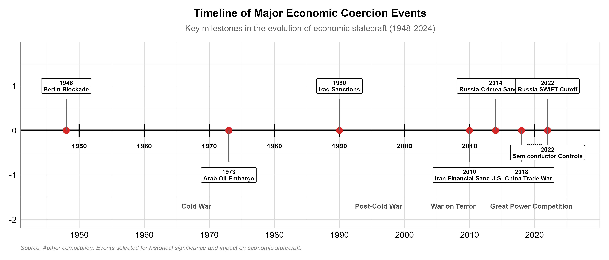
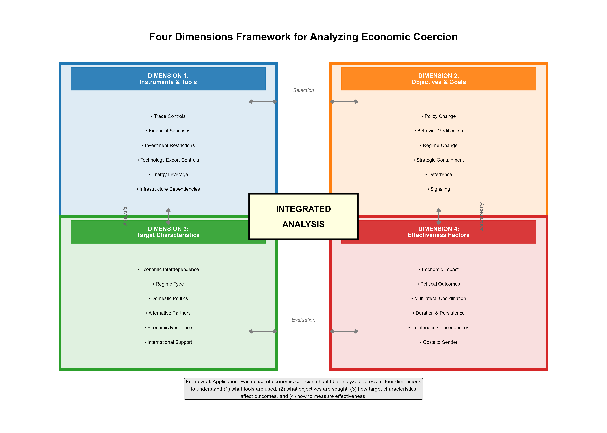
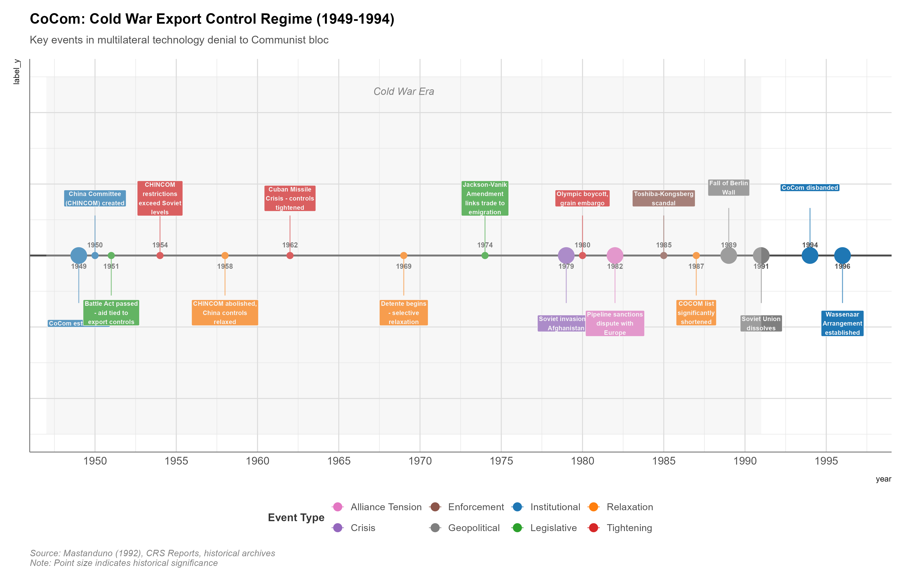

# Foundations of Economic Statecraft in the 21st Century

## Executive Summary

On October 7, 2022, the United States imposed sweeping export controls targeting China's semiconductor industry. The measures restricted not only American technology and equipment, but also deployed a novel "foreign direct product rule" to prevent any advanced chips made anywhere in the world with US tools from reaching Chinese firms. The action represented economic statecraft on an unprecedented scale—an attempt to use commercial restrictions to constrain a strategic rival's technological development. China's response was equally telling: rather than military escalation, Beijing accelerated its "dual circulation" strategy, launched investigations into American firms under its Anti-Foreign Sanctions Law, and tightened export controls on critical minerals like gallium and germanium. This was not traditional economic warfare. It was something new: the systematic weaponization of economic interdependence.

We have entered the era of geoeconomics—a polite term for a messy reality: the firewall between "making money" and "making war" has burned down. For thirty years, policymakers pretended that buying cheap goods from rivals was a kind of peace treaty. It turns out it was just a long line of credit, now coming due. Trade relationships, supply chains, technology standards, and financial flows have become instruments of statecraft. Economic coercion—the use of economic measures to compel behavioral changes in other states—has become central to how great powers compete. For policymakers, business leaders, and citizens navigating this landscape, understanding these dynamics is no longer optional.

This book provides a comprehensive guide to economic coercion in the context of US-China strategic competition. It examines how states use economic tools to pursue security objectives, why such measures succeed or fail, and what the proliferation of economic statecraft means for the international system. The focus is practical: each chapter explains specific tools available to governments, analyzes real-world cases, and explores decision-making through tabletop exercises. But the book also takes seriously the need for strategic empathy—understanding how different actors perceive threats, opportunities, and constraints.

Three core arguments organize our analysis. First, contemporary economic coercion reflects the structural condition of weaponized interdependence. Global networks for finance, technology, and trade create chokepoints—nodes of asymmetric dependency that can be exploited for coercive leverage. The United States benefits from centrality in dollar-denominated finance, internet infrastructure, and semiconductor supply chains. China increasingly holds comparable positions in critical minerals, electric vehicle batteries, and manufacturing capacity. Understanding where these chokepoints exist and how they can be leveraged is fundamental to modern statecraft.

Second, effectiveness in economic coercion depends on more than material capability. Success requires understanding target decision-making, managing allied coordination, anticipating retaliation, and sustaining domestic support. The most sophisticated sanctions can fail if targets can adapt, allies defect, or domestic constituencies lose patience. Conversely, seemingly modest restrictions can succeed when they target genuine vulnerabilities and are paired with viable off-ramps. This book develops a framework for analyzing economic coercion across four dimensions: the domain of action (trade, finance, technology, investment), the target (state, firm, individual), the objective (deterrence, compellence, containment, signaling), and the intensity (from diplomatic pressure to comprehensive economic warfare).

Third, and perhaps most importantly, effective strategy requires understanding adversary perspectives. Chinese policymakers do not view American export controls merely as defensive measures. They see them as containment—efforts to block China's legitimate rise, prevent unification with Taiwan, and preserve a unipolar order. This perception shapes Beijing's responses, driving a strategy of "comprehensive national power" that integrates economic strength, military capability, and global influence. Similarly, American concerns about Chinese economic coercion reflect genuine anxieties about dependency on a strategic competitor with revisionist aims. Effective policy must account for these divergent worldviews.

This chapter establishes foundations. It defines key concepts—geoeconomics, economic statecraft, weaponized interdependence, and economic coercion—and explains how they relate. It traces the arc of US-China economic relations from engagement through growing competition. It introduces analytical frameworks used throughout the book. And critically, it presents both American and Chinese perspectives on economic statecraft, explaining how different historical experiences produce different strategic logics. The chapter includes two detailed case studies—the Cold War-era Coordinating Committee for Multilateral Export Controls (CoCom) and the 2022 exclusion of Russian banks from SWIFT—that illustrate how economic coercion works in practice.

This matters beyond academic interest. How the United States and China manage their economic interdependence while competing strategically may determine whether this century sees managed rivalry or something far worse. Get it wrong, and a trade dispute over memory chips could spiral into a shooting war over Taiwan. Get it right, and economic competition might channel superpower rivalry into domains less likely to incinerate cities. Understanding the tools, limitations, and logic of economic coercion is essential for navigating that challenge.

---

## Introduction - The Return of Economic Statecraft

### Opening Vignette: The October 2022 Semiconductor Controls

In October 2022, Washington bureaucrats did something rarely seen in the annals of trade policy: they attempted to surgically remove a rival superpower's brain. Senior officials from Commerce, State, Defense, and the National Security Council gathered to finalize the most aggressive peacetime export controls the United States had ever imposed. By restricting access to advanced semiconductors, the U.S. wasn't just imposing a tariff or slapping wrists—it was attempting to induce a national learning disability on the People's Republic, freezing China's AI and supercomputing ambitions at their current state indefinitely.

The resulting measures, announced on October 7, 2022, were breathtaking in scope (Allen 2022; Miller 2022). The Bureau of Industry and Security (BIS) added 31 Chinese entities to the Entity List, blocking them from receiving American technology. Far more significantly, BIS imposed sweeping new restrictions on exporting semiconductor manufacturing equipment to China and updated the "foreign direct product rule" (FDPR) to prevent chips made anywhere in the world with American equipment from reaching designated Chinese firms. The controls effectively weaponized America's chokepoint position in the global semiconductor supply chain: no country can produce cutting-edge chips at scale without US equipment, software, and intellectual property.

The measures also contained a remarkable provision targeting people, not just products. Under the new "U.S. person" rule, American citizens and green card holders were prohibited from supporting development or production of advanced chips at Chinese facilities—even those not otherwise subject to U.S. jurisdiction. This represented economic statecraft directed not just at rival governments or companies, but at individual engineers and their career choices.

Beijing's response was a mix of public fury and private scrambling. While Foreign Ministry spokespeople thundered about "technological hegemony" and "economic bullying"—favorite terms of art—state engineers were quietly given a blank check and a singular mandate: *Fix this. At any cost.* The Ministry of Commerce announced it would "resolutely safeguard the legitimate rights and interests of Chinese companies," but the real action was in laboratories and boardrooms. Beijing accelerated implementation of its "dual circulation" strategy, pouring resources into domestic semiconductor development despite massive technical challenges. It launched antitrust and data security investigations into American firms like Micron—a reminder that two can play this game. And in July 2023, China imposed export controls on gallium and germanium—obscure metals critical for semiconductors and defense applications—demonstrating that chokepoint leverage cuts both ways.

This episode crystallizes the central dynamic of contemporary great power competition. The United States and China are locked in a struggle over the commanding heights of 21st-century technology, and economic tools have become the primary instruments of that struggle. Neither side launched missiles or moved troops. Instead, they manipulated supply chain dependencies, restricted access to critical inputs, and used regulatory authority to reshape patterns of global commerce. This is economic statecraft in the modern era.

### The Paradox of Interdependence

For decades, economic interdependence was assumed to be a pacifying force (Keohane and Nye 2011). The logic was straightforward: countries that trade extensively have shared interests in stability, mutual prosperity, and maintaining open markets. War becomes irrational when it disrupts profitable exchange. This "capitalist peace" thesis underpinned much of post-Cold War Western strategy, particularly toward China. Integrating China into global institutions and supply chains would not only enrich all parties but also make conflict prohibitively costly.

Here is the paradox of our time: the same supply chains that were supposed to bind nations in peace have become the very ropes used to strangle opponents. "Interdependence" turns out to be a scholarly word for "mutual vulnerability"—and in a knife fight, the person holding the handle and the person holding the blade have very different incentives. When one country controls chokepoints in critical networks, it can weaponize those positions to extract concessions, punish adversaries, or constrain rivals' strategic options. Rather than preventing coercion, interdependence enables it.

Henry Farrell and Abraham Newman's concept of "weaponized interdependence" captures this dynamic (Farrell and Newman 2019). Global networks—for finance, trade, technology, information—are not evenly distributed. They have hubs: nodes of concentration where transactions must pass through specific institutions, platforms, or jurisdictions. The United States sits at the center of dollar-denominated finance (SWIFT system, correspondent banking), internet infrastructure (submarine cables, cloud services, DNS root servers), and advanced technology supply chains (semiconductors, software, aerospace). China increasingly occupies comparable positions in rare earth processing, electric vehicle batteries, active pharmaceutical ingredients, and certain manufacturing supply chains.

These hub positions create what Farrell and Newman call "panopticon" and "chokepoint" effects. The panopticon effect allows the hub state to see network flows—monitoring transactions, communications, and exchanges. The chokepoint effect allows it to deny access—blocking specific actors from the network or withholding critical inputs. Both capabilities can be weaponized: surveillance enables intelligence gathering and sanctions enforcement, while denial enables coercion.

The result is a fundamental tension. Economic integration does constrain: sanctioning China's semiconductor industry imposes costs on American firms (lost sales, reduced economies of scale) and allies (disrupted supply chains, technology restrictions). But integration also empowers: without reliance on U.S. semiconductor equipment, American controls would have no bite. The same interdependence that creates peace constituencies also creates coercive leverage.

This paradox generates strategic dilemmas. How much economic integration is optimal when potential adversaries are involved? Should states prioritize economic efficiency or strategic autonomy? Can chokepoint dependencies be maintained without provoking retaliation or accelerating rivals' efforts at self-sufficiency? These questions have no easy answers, but understanding the dual nature of interdependence is essential for navigating them.

### Why Now? Four Structural Drivers

Economic coercion is not new. Imperial Britain used trade restrictions and naval blockades. The United States orchestrated Cold War export controls through CoCom (Mastanduno 1992). Economic sanctions have long been a staple of foreign policy. Yet the current era is distinctive in the intensity, sophistication, and centrality of economic statecraft. Four structural factors explain why.

**First: The rise of China as a peer economic competitor.** For the first time since 1945, the United States faces a rival with comparable economic scale and technological ambition. China is the world's largest trading nation, its second-largest economy, and increasingly a technological frontier state in domains from 5G to artificial intelligence to electric vehicles. This creates both motivation and capability for economic competition. The U.S. cannot ignore China's economic power, and China cannot accept permanent technological subordination. Economic coercion becomes a primary mechanism for managing this rivalry short of military conflict.

**Second: The digitalization and networkization of economic activity.** Modern economies run on digital networks: financial transactions through SWIFT and correspondent banking, internet traffic through submarine cables and cloud platforms, manufacturing through complex supply chains coordinated by enterprise software. This digitalization amplifies chokepoint effects. Cutting a country off from SWIFT is far more effective than historical financial sanctions because modern finance is fundamentally networked. Similarly, denying access to advanced chips or cloud services can cripple development in AI, quantum computing, and other strategic technologies in ways that Cold War-era export controls on machine tools could not.

**Third: The fragmentation of the liberal international order.** During the unipolar moment of the 1990s and early 2000s, the United States could largely shape global rules in ways that served its interests. Institutions like the WTO, IMF, and World Bank embedded American preferences. Today, that consensus has fractured. China offers alternative institutions (Asian Infrastructure Investment Bank, Belt and Road Initiative) and contests existing rules. The result is a more contested economic order where states increasingly use economic tools to reshape rules and institutions in their favor, rather than accepting a single set of neutral market principles.

**Fourth: The blurring of economic and security domains.** Emerging technologies increasingly have dual-use applications: artificial intelligence enhances both facial recognition apps and autonomous weapons systems; quantum computing promises breakthroughs in drug discovery and code-breaking; biotechnology enables personalized medicine and biological weapons. This dual-use character means that commercial competition in cutting-edge technologies is inseparable from security competition. States cannot afford to treat trade, investment, and technology development as purely economic matters when those same capabilities determine military effectiveness and intelligence dominance.

Together, these four factors—peer economic competition with China, networked digital economies, fragmentation of the liberal order, and dual-use technology convergence—create an environment where economic coercion is both more feasible and more necessary as a tool of statecraft. Understanding this structural context is essential for making sense of specific policy choices, from semiconductor export controls to rare earth restrictions to financial sanctions.

The remainder of this chapter builds on this foundation. We first define key concepts precisely (geoeconomics, economic statecraft, weaponized interdependence, economic coercion). We then examine the arc of US-China economic relations and the specific strategic perspectives each side brings. Finally, we develop analytical frameworks for understanding when and how economic coercion works—frameworks that will be applied throughout the book's subsequent chapters.

---

## Defining Key Concepts

Precision matters. The terms "geoeconomics," "economic statecraft," "weaponized interdependence," and "economic coercion" are often used interchangeably in policy debates, but they describe distinct—though related—phenomena. Clear definitions enable clearer thinking about when, why, and how states use economic power for strategic purposes.

### Geoeconomics

**Geoeconomics** refers to the use of economic instruments to produce geopolitical outcomes. The term was coined by Edward Luttwak in the early 1990s to describe how states compete for power and influence through economic means in an era when military competition among major powers had become prohibitively risky (Luttwak 1990; see also Blackwill and Harris 2016). Where geopolitics is about the relationship between geography, power, and strategy, geoeconomics applies that logic to economic domains: trade, investment, finance, technology, and resources.

Geoeconomic competition manifests in several ways. States may use trade policy to build spheres of influence—consider China's Belt and Road Initiative, which uses infrastructure investment and trade relationships to expand Beijing's political influence across Eurasia, Africa, and Latin America. They may weaponize access to their markets—the European Union uses the threat of excluding firms from its large consumer market to impose regulatory standards globally, what Anu Bradford calls the "Brussels Effect" (Bradford 2020). They may compete for dominance in strategic industries—U.S.-China rivalry over 5G telecommunications reflects both sides' recognition that whoever sets standards for next-generation communications infrastructure gains strategic advantage. Or they may seek control over critical resources—competition for rare earth minerals, semiconductor supply chains, and energy transit routes all reflect geoeconomic logics.

The geoeconomic lens reveals three key dynamics. First, economic power is relative, not just absolute. What matters is not just a country's GDP, but its ability to shape global economic rules, control chokepoints in networks, and withstand pressure. China's GDP may be substantial, but its dependence on imported semiconductors creates vulnerability despite its overall economic size. Second, economic interdependence creates strategic opportunities and vulnerabilities. States simultaneously seek to maximize others' dependence on them while minimizing their own dependence on potential adversaries. Third, economic and security domains are deeply intertwined. Commercial competition in emerging technologies directly affects military balances, intelligence capabilities, and economic resilience.

Geoeconomics is not inherently adversarial. States can use economic tools to build partnerships, reward friends, and create positive-sum outcomes. The Marshall Plan exemplified geoeconomic strategy aimed at reconstruction and alliance-building, not coercion. Contemporary development finance and trade agreements often serve similar purposes. But in an era of great power competition, the competitive and coercive dimensions of geoeconomics have become increasingly prominent.

The shift toward geoeconomic competition reflects structural changes in the international system. During the Cold War, the economic and security spheres were substantially decoupled: the West traded internally, the Communist bloc did likewise, and military competition dominated superpower relations. Today, the United States and China are deeply economically integrated while simultaneously engaged in strategic competition. This creates demand for geoeconomic tools—economic measures that can advance security objectives without triggering military escalation.

### Economic Statecraft

**Economic statecraft** is the subset of geoeconomics focused on deliberate government policies using economic tools to achieve foreign policy objectives. Where geoeconomics describes a broad strategic domain, economic statecraft refers to specific policy instruments and their application.

David Baldwin's classic definition frames economic statecraft as "influence attempts relying primarily on resources which have a reasonable semblance of a market price in terms of money" (Baldwin 1985). This encompasses both positive inducements (foreign aid, preferential trade agreements, investment, debt relief) and negative sanctions (trade restrictions, asset freezes, financial exclusion, technology denial). The key is intentionality: economic statecraft involves purposeful government action to achieve specific foreign policy goals through economic means.

Economic statecraft operates across multiple domains. In the **trade domain**, tools include tariffs, quotas, export controls, import bans, and preferential trade agreements. The United States uses export controls to prevent advanced technology from reaching rivals; China uses informal trade restrictions to punish countries for political decisions it opposes (see the 2010 rare earth export restrictions after Japan detained a Chinese fishing captain, or the 2020-2021 trade restrictions on Australia following Canberra's calls for a COVID-19 investigation). In the **financial domain**, statecraft includes sanctions, asset freezes, exclusion from payment systems (SWIFT), secondary sanctions on third parties doing business with targets, and restrictions on dollar access. U.S. Treasury's Office of Foreign Assets Control (OFAC) maintains multiple sanctions programs targeting countries (Iran, North Korea, Russia), entities, and individuals (Zarate 2013; U.S. Treasury 2021). In the **investment domain**, tools include foreign direct investment screening, forced divestment, restrictions on portfolio investment, and development finance. CFIUS (Committee on Foreign Investment in the United States) reviews foreign acquisitions of American firms for national security implications. In the **technology domain**, statecraft encompasses export controls, investment restrictions, talent restrictions, standard-setting, and technology transfer requirements. The October 2022 semiconductor controls exemplify technology statecraft.

<figure>
  
</figure>

Effectiveness varies dramatically across contexts. Economic statecraft succeeds when it changes target behavior in desired ways at acceptable cost (Hufbauer et al. 2007; Drezner 1999). Success depends on several factors: the target's vulnerability (is the sanctioned good/service critical and difficult to substitute?), the sanctioner's credibility (will threatened measures actually be imposed?), allied coordination (can the target find alternative suppliers?), and target decision-making (does the target regime value the benefits of compliance more than the political costs?). Many sanctions fail because targets can adapt, allies defect, or political constraints prevent the target from complying even when economic pain is severe (Pape 1997; Blanchard and Ripsman 1999).

Economic statecraft also generates second-order effects that can undermine long-term effectiveness. Overuse of financial sanctions may accelerate efforts to create alternatives to dollar-denominated finance—China's Cross-Border Interbank Payment System (CIPS) and discussions of central bank digital currencies partly reflect this dynamic. Aggressive use of export controls may spur targeted countries to invest heavily in indigenous alternatives, eventually reducing the sanctioner's leverage—as China is now doing in semiconductors following U.S. restrictions.

### Weaponized Interdependence

**Weaponized interdependence** describes the structural condition in which asymmetric network positions in globalized economic systems can be exploited for strategic advantage. This concept, developed by Henry Farrell and Abraham Newman, explains how economic integration—long assumed to promote peace—can actually enable new forms of coercion.

The key insight is that global economic networks have hierarchical structures. Financial transactions concentrate through specific clearing systems (SWIFT for international banking, correspondent banking relationships for dollar transactions). Internet traffic routes through particular hubs (submarine cable landing points, cloud service providers, internet exchange points). Supply chains have critical nodes (Taiwan's TSMC for advanced semiconductors, China's rare earth processing, specific chemical plants for pharmaceutical precursors). These concentration points create power asymmetries: the state with jurisdiction over the hub can see network flows (the panopticon effect) and can deny access to specific actors (the chokepoint effect).

The panopticon effect enables intelligence gathering and enforcement. Because international financial transactions typically route through U.S. correspondent banks or SWIFT (which cooperates closely with U.S. and European authorities), American officials can monitor global financial flows and detect sanctions violations. Because internet traffic often passes through infrastructure under U.S. jurisdiction or operated by American companies, U.S. intelligence agencies have structural advantages in signals intelligence. This visibility itself becomes a source of power.

The chokepoint effect enables coercion. Cutting designated entities off from SWIFT cripples their ability to conduct international business—as Iranian banks discovered in 2012 and Russian banks learned in 2022. Denying access to advanced semiconductors or the equipment to make them constrains development in AI, supercomputing, and advanced weapons systems—the logic behind October 2022 controls on China. Restricting rare earth exports limits production of defense systems, electronics, and renewable energy technologies—China's potential leverage over the West.

Weaponized interdependence differs from traditional economic warfare. It does not require severing economic ties completely (autarky) or imposing comprehensive blockades. Instead, it involves surgical exploitation of specific network vulnerabilities. The United States can maintain substantial trade with China while denying Chinese firms access to specific chokepoint technologies. China can continue exporting manufactured goods while restricting access to specific critical minerals. The coercion targets particular nodes, not entire relationships.

This creates distinctive strategic dynamics. States seek to maximize their hub positions while reducing dependence on rivals' hubs—hence China's emphasis on semiconductor self-sufficiency and development of alternative payment systems, and American efforts to secure rare earth supply chains and reduce reliance on Chinese manufacturing for critical goods. The result is partial decoupling: selective disengagement from specific vulnerable dependencies while maintaining broader economic integration where both sides benefit and neither sees critical security risks.

<figure>
  
</figure>

### Economic Coercion

**Economic coercion** is the use of economic measures to compel changes in another actor's behavior through the threat or infliction of economic costs. It is the most adversarial form of economic statecraft, aimed at forcing targets to do something (compellence), stop doing something (deterrence), or constraining their capabilities (containment).

Economic coercion involves three elements. First, **an economic measure** that imposes costs: sanctions, export controls, market access restrictions, asset seizures, financial exclusion, or other penalties. Second, **a behavioral objective**: the specific change the coercing state seeks in the target's actions. This might be policy change (end nuclear program, withdraw from occupied territory), leadership change (regime change), or capability degradation (prevent military modernization). Third, **a causal theory** linking the economic pain to behavioral change: the coercer believes the imposed costs will motivate the target to comply.

Economic coercion operates through two mechanisms. **Denial** seeks to prevent the target from accessing resources, technologies, or markets necessary for objectionable activities. Export controls on semiconductor manufacturing equipment aim to prevent China from developing cutting-edge AI capabilities by denying access to necessary inputs. This does not require the target to choose compliance; it physically prevents the unwanted activity. **Punishment** inflicts costs to change the target's cost-benefit calculation, making continued defiance more painful than compliance. Financial sanctions on Russia following its invasion of Ukraine aim to impose sufficient economic pain that Moscow reassesses the costs of continuing the war. This requires the target to choose compliance in response to pain.

Effectiveness is contingent and contested. Economic coercion succeeds when targets comply at acceptable cost to the coercer. But success rates are modest. Research suggests comprehensive sanctions succeed in perhaps 20-30% of cases, with effectiveness varying dramatically based on objective (modest policy changes easier than regime change), target regime type (democracies more vulnerable to economic pain than autocracies), and duration (effectiveness often declines over time as targets adapt). Export controls can effectively deny capabilities if the denied input is critical and cannot be substituted, but targets often find workarounds or develop indigenous alternatives over time.

Economic coercion also generates strategic costs. It may damage commercial interests in the coercing state, alienate allies who bear costs without seeing benefits, provoke retaliation, accelerate target efforts to reduce dependency, or undermine the coercer's long-term leverage by encouraging development of alternative systems. The challenge is achieving objectives before these second-order costs become prohibitive.

Importantly, economic coercion exists on a spectrum. At one end are targeted, reversible measures with clear conditions for relief (sanction specific individuals contingent on specific actions). At the other end are comprehensive efforts to fundamentally constrain rivals' capabilities with no clear off-ramp (wholesale technology decoupling). Most real-world cases fall somewhere between these poles, combining elements of denial and punishment, short-term signaling and long-term strategic competition.

Understanding these distinctions—between geoeconomics as strategic domain, economic statecraft as policy tool, weaponized interdependence as structural condition, and economic coercion as specific practice—provides the conceptual foundation for analyzing the US-China strategic competition and the cases examined in subsequent chapters.

---

## The US-China Strategic Competition

The US-China relationship is the central axis of contemporary geoeconomic competition. No other bilateral relationship involves comparable economic interdependence combined with strategic rivalry. Understanding how these two powers reached this point—and how each conceptualizes the competition—is essential for analyzing specific instances of economic coercion.

### The Arc of US-China Economic Relations

The trajectory from partnership to competition unfolded over four decades in three distinct phases.

#### Phase 1: Strategic Engagement (1979-2008)

The normalization of US-China relations in 1979 opened an era of deepening economic integration premised on shared strategic interests and mutual benefit. Initially, the relationship was primarily geopolitical: both countries sought to balance against the Soviet Union. But economic engagement quickly became central to the relationship's logic.

American policymakers embraced a theory of transformative engagement: integrating China into the global economy and international institutions would not only create prosperity but would also promote political liberalization and responsible international behavior. As President Clinton argued in 2000 when advocating for China's WTO accession, "by joining the WTO, China is not simply agreeing to import more of our products; it is agreeing to import one of democracy's most cherished values: economic freedom... When individuals have the power... to realize their dreams, they will demand a greater say."

China's accession to the World Trade Organization in 2001 accelerated integration dramatically. Trade between the US and China grew from $116 billion in 2000 to over $560 billion by 2008. American companies invested heavily in Chinese manufacturing, taking advantage of low labor costs and increasingly sophisticated supply chains. China became "the world's factory," integral to global production networks for electronics, apparel, machinery, and countless other goods. The relationship appeared to validate the liberal assumption that economic interdependence promotes cooperation.

<figure>
  
  <figcaption>US-China Trade Volume and Key Events (2000-2024)</figcaption>
</figure>

But integration also created structural dependencies and distributional consequences that would later fuel tensions. American manufacturing employment declined sharply—research by Autor, Dorn, and Hanson estimated that competition from Chinese imports eliminated 2.4 million U.S. jobs between 1999 and 2011 (Autor, Dorn, and Hanson 2016). China accumulated massive foreign exchange reserves ($2 trillion by 2008) and became the largest foreign holder of U.S. Treasury securities, creating mutual financial dependencies. Technology transfer—sometimes voluntary through joint ventures, sometimes coerced through requirements for market access, sometimes illicit through cyber espionage—accelerated China's industrial upgrading.

For China, this period represented a strategic opportunity. Deng Xiaoping's guidance to "hide capabilities and bide time" (韬光养晦, tāoguāng yǎnghuì) meant avoiding confrontation while building comprehensive national power. Economic growth became the foundation for eventual great power status. The strategy worked remarkably: China sustained average annual GDP growth above 10%, lifting hundreds of millions out of poverty while building infrastructure and industrial capacity on an unprecedented scale.

#### Phase 2: Growing Tensions (2008-2016)

The 2008 financial crisis marked an inflection point. As Western economies struggled, China maintained growth through massive fiscal stimulus. Chinese leaders drew the lesson that the Western model was not inevitable and that China's state-guided approach might be superior for certain developmental challenges. Confidence grew that the "East is rising, West is declining" (东升西降, dōng shēng xī jiàng).

This confidence manifested in more assertive Chinese economic statecraft. In 2010, following Japan's detention of a Chinese fishing captain near the disputed Senkaku/Diaoyu Islands, China imposed informal restrictions on rare earth exports to Japan—a clear instance of economic coercion. In 2012, after the EU imposed anti-dumping duties on Chinese solar panels, Beijing launched an investigation into European wine exports. These episodes signaled willingness to use economic leverage for geopolitical purposes.

Simultaneously, American concerns about Chinese economic practices intensified. Complaints centered on several issues: intellectual property theft through cyber espionage (highlighted by the 2013 Mandiant report on PLA Unit 61398), forced technology transfer requirements for firms operating in China, industrial subsidies that created overcapacity in strategic sectors (steel, aluminum, solar), and currency manipulation that disadvantaged American manufacturers. The Obama administration pursued these concerns through WTO dispute settlement and diplomatic pressure, but frustration mounted that China was not playing by expected rules despite WTO membership.

China's announcement of "Made in China 2025" in 2015 crystallized Western anxieties. The industrial policy aimed for Chinese leadership in ten strategic sectors: information technology, robotics, aerospace, maritime equipment, advanced rail, new energy vehicles, power equipment, agricultural machinery, new materials, and biopharma. Western analysts saw this not as normal industrial policy but as a blueprint for technological dominance backed by massive state subsidies, technology transfer requirements, and possible exclusion of foreign competitors. The program made explicit China's intention to reduce dependence on Western technology while capturing commanding heights in emerging industries.

Economically, interdependence continued deepening. By 2016, US-China trade exceeded $650 billion annually. American companies earned substantial revenue in China (Apple, GM, Boeing, Starbucks all counted China as a top-three market). Chinese firms increasingly operated in the US, from Lenovo's acquisition of IBM's PC business to growing Chinese direct investment in American real estate, technology, and infrastructure. But the political consensus supporting engagement had fractured.

#### Phase 3: Strategic Competition (2017-Present)

The Trump administration's arrival in 2017 marked a decisive shift from engagement to competition. The 2017 National Security Strategy explicitly designated China a "strategic competitor" seeking to "challenge American power, influence, and interests" and to "erode American security and prosperity" (White House 2017). This represented a fundamental reframing: China was no longer a partner to be integrated but a rival to be countered.

Economic statecraft became the primary domain of competition. The Trump administration imposed sweeping tariffs on Chinese goods (eventually covering roughly $370 billion in imports), justified partly on trade grounds (reducing the bilateral deficit) but increasingly on strategic grounds (protecting American technology, reducing dependencies). China retaliated with tariffs on American agricultural products and industrial goods. The "trade war" of 2018-2019 demonstrated both sides' willingness to impose substantial economic costs in pursuit of strategic objectives.

<figure>
  
  <figcaption>Timeline of Economic Coercion Events</figcaption>
</figure>

But tariffs were only the most visible component. More consequentially, the U.S. began systematically restricting Chinese access to advanced technology. The 2018 Export Control Reform Act (ECRA) and Foreign Investment Risk Review Modernization Act (FIRRMA) expanded authority to control technology exports and screen foreign investment. Commerce Department's Bureau of Industry and Security added Chinese firms to the Entity List, blocking access to American technology: Huawei and ZTE in 2018-2019, advanced semiconductor firms SMIC and YMTC in 2020-2022. The October 2022 semiconductor controls, discussed earlier, represented the culmination of this approach—comprehensive effort to prevent China from accessing chokepoint technologies for advanced computing.

The Biden administration maintained and expanded this technology competition despite relaxing some tariffs. The 2022 CHIPS and Science Act provided $52 billion for domestic semiconductor manufacturing and research, with explicit prohibitions on recipients expanding advanced semiconductor production in China. The 2022 Inflation Reduction Act included substantial subsidies for electric vehicle and battery production, with requirements limiting Chinese content to qualify for benefits. Export controls expanded to cover quantum computing, advanced AI chips, and biotech equipment. The framework shifted from simply restricting China to proactively building American and allied advantages in strategic technologies—what National Security Advisor Jake Sullivan called "running faster" while maintaining "as large a lead as possible."

China responded with its own measures. Beijing accelerated implementation of its "dual circulation" strategy (双循环, shuāng xúnhuán), emphasizing domestic consumption and indigenous innovation to reduce vulnerability to external pressure. It passed the Export Control Law (2020), the Data Security Law (2021), and the Anti-Foreign Sanctions Law (2021), creating legal frameworks for economic countermeasures. It imposed export restrictions on critical minerals (gallium, germanium, rare earths) and launched security reviews of American firms operating in China (Micron banned from critical infrastructure in 2023). Most importantly, it made semiconductor self-sufficiency a national priority, investing massive resources in domestic chip production despite technical challenges.

The result is a partial decoupling: selective disengagement from specific dependencies deemed strategically risky, while maintaining broader economic integration where both sides benefit. Total bilateral trade actually increased to over $750 billion by 2022 despite tensions. But the composition is changing—trade in advanced technology products declining, scrutiny of investment intensifying, and both sides building redundancy in critical supply chains.

### China's Economic Power and Strategic Objectives

China brings formidable economic capabilities to this competition. It is the world's second-largest economy ($18 trillion GDP in 2023), largest trading nation ($6 trillion in goods trade annually), largest manufacturer (28% of global manufacturing output), and increasingly a technology frontier state. This economic scale creates multiple sources of leverage.

**Market access** is perhaps China's most immediate form of power. With 1.4 billion people and a growing middle class, China offers a market no major multinational can ignore. This creates dependencies: Boeing derives roughly 25% of revenue from Chinese customers, U.S. agricultural exports to China exceed $30 billion annually, GM sells more cars in China than in the United States. Beijing can weaponize this access through regulations, investigations, informal pressure on consumers (calls to boycott foreign brands), or explicit restrictions. Australia experienced this in 2020-2021 when China imposed trade restrictions on barley, wine, coal, and other exports following Canberra's call for a COVID-19 investigation.

**Manufacturing dominance** in critical goods creates chokepoint leverage. China produces 85% of global rare earth elements (critical for magnets in defense systems, electronics, and wind turbines), 70% of lithium-ion batteries (essential for electric vehicles and energy storage), and 60% of solar panels. It dominates production of active pharmaceutical ingredients (APIs) for many essential medicines. This concentration means disrupting Chinese supply can cause immediate shortages in key industries—as Western countries discovered during COVID-19 when dependence on Chinese personal protective equipment and pharmaceutical inputs became apparent.

**Technology advancement** in specific domains creates competitive advantages. While China lags in cutting-edge semiconductors and certain aerospace technologies, it leads or competes at the frontier in 5G telecommunications (Huawei), high-speed rail, electric vehicles and batteries (BYD, CATL), commercial drones (DJI), certain AI applications (facial recognition, natural language processing), and quantum communications. This heterogeneous technology landscape means neither the US nor China enjoys across-the-board dominance.

**Financial resources** enable global influence. With over $3 trillion in foreign exchange reserves, China can provide substantial development finance through Belt and Road Initiative, extending infrastructure loans to over 140 countries totaling an estimated $1 trillion since 2013. This creates political influence and potential dependencies: recipient countries may hesitate to oppose Chinese preferences if they need continued financing or rescheduling of existing debts.

China's strategic objectives in economic statecraft center on three imperatives. First, **national rejuvenation** (中华民族伟大复兴, Zhōnghuá mínzú wěidà fùxīng)—Xi Jinping's defining goal of restoring China to great power status by the centenary of the People's Republic in 2049. This requires sustained economic growth, technological advancement, and freedom from external constraints. Second, **technology self-sufficiency** (科技自立自强, kējì zìlì zìqiáng)—reducing dependence on Western technology in strategic domains to prevent chokepoint vulnerability. The semiconductor push exemplifies this priority. Third, **resistance to containment**—preventing the formation of a Western coalition that could constrain Chinese development, much as CoCom constrained Soviet technological advancement during the Cold War. Economic statecraft serves all three objectives: building capabilities, reducing vulnerabilities, and contesting U.S. efforts at technological restriction.

### The US Position and Strategic Objectives

The United States brings different but complementary sources of economic power. While no longer the dominant manufacturer, the U.S. maintains critical chokepoints in advanced technology supply chains, global finance, and institutional rule-making.

**Technology chokepoints** remain America's primary economic leverage. U.S. firms dominate in semiconductor design (Intel, AMD, Nvidia), electronic design automation software essential for chip design (Synopsys, Cadence, Mentor Graphics—all American), cloud computing (AWS, Microsoft Azure, Google Cloud), operating systems (Microsoft, Apple), and advanced semiconductor manufacturing equipment (Applied Materials, Lam Research, KLA). Denying access to these chokepoint technologies can severely constrain rivals' technological development—the October 2022 controls leveraged exactly these positions.

**Financial centrality** provides surveillance and coercive capabilities. The dollar remains the dominant global reserve currency (58% of global reserves), most international transactions use dollar-denominated instruments requiring access to U.S. correspondent banks, and SWIFT cooperates closely with U.S. authorities. This enables both panopticon effects (monitoring global financial flows) and chokepoint effects (cutting designated actors from dollar-denominated finance). U.S. Treasury's sanctions authorities are unmatched in reach and effectiveness.

**Alliance networks** amplify American economic power. U.S. treaty allies represent roughly 60% of global GDP and include the other major technology producers (Japan, South Korea, Taiwan, Germany, Netherlands). When the U.S. can coordinate economic statecraft with allies—as it largely succeeded in doing with semiconductor export controls and Russia sanctions—the collective economic power vastly exceeds what America could wield alone. This is China's primary structural disadvantage: it lacks comparable wealthy, technologically advanced treaty allies.

**Institutional influence** in organizations like the WTO, IMF, and World Bank provides agenda-setting power, though this has eroded as China develops alternative institutions. America's ability to shape rules for intellectual property, state subsidies, and trade disputes gives it structural advantages even when specific disputes don't go its way.

American strategic objectives have evolved from engagement to competition. Contemporary U.S. strategy, articulated across both Trump and Biden administrations, centers on **maintaining technological leadership** in domains critical for economic competitiveness and military effectiveness (semiconductors, AI, quantum, biotech), **preventing technological leapfrogging** by China through forced technology transfer or cyber espionage, **building resilient supply chains** that reduce dangerous dependencies on China for critical goods, and **maintaining dollar dominance** and financial system centrality that enable sanctions enforcement and intelligence gathering.

But American strategy faces distinctive constraints. **Commercial interests** often conflict with security imperatives: restricting sales to China costs American firms revenue and may shift market share to foreign competitors. **Allied coordination** is challenging when allies face different threat perceptions and commercial dependencies (European exposure to Chinese market pressure differs from American). **Domestic politics** complicate sustained strategies when constituencies bear costs (farmers hurt by Chinese retaliatory tariffs, consumers facing higher prices from tariffs and supply chain restrictions). **Institutional limitations** constrain executive authority: export controls must demonstrate national security rationale, tariffs face WTO constraints, and financial sanctions can be challenged in courts.

The resulting U.S. approach is asymmetric restriction: comprehensive controls on chokepoint technologies critical for advanced computing and AI, combined with continued economic engagement in less sensitive domains. This attempts to slow Chinese advancement in strategic technologies while avoiding complete decoupling that would impose prohibitive costs on American firms and consumers.

### The Logic of Economic Competition

The US-China economic competition differs from Cold War precedent in several crucial ways. First, it occurs within deep interdependence rather than separate economic blocs. This creates mutual vulnerabilities and domestic constituencies opposing decoupling. Second, it centers on technology and innovation rather than ideology. The competition is about who masters AI, quantum computing, and biotechnology—domains with both commercial and military applications. Third, it involves a broader toolkit than traditional sanctions. Export controls, investment screening, standard-setting, talent restrictions, development finance, and regulatory investigations all serve strategic purposes.

The competition is likely to persist regardless of which parties govern in Washington or Beijing. Structural factors—China's determination to achieve technology self-sufficiency, American concerns about dependence on a strategic competitor, the dual-use nature of emerging technologies—create enduring drivers for economic statecraft. How the two powers manage this competition while maintaining sufficient cooperation in areas of shared interest (climate change, pandemic response, financial stability) is the central challenge of contemporary international relations.

The next sections examine how analysts can systematically assess economic coercion efforts in this context, what tools governments employ, and how different perspectives shape strategic choices.

---

## Conceptual Framework for Analyzing Economic Coercion

Having defined key concepts and examined the US-China strategic context, we now need analytical tools for systematically assessing specific instances of economic coercion. This framework, applied throughout subsequent chapters, organizes analysis across four dimensions: **domain**, **target**, **objective**, and **intensity**.

<figure>
  
  <figcaption>Conceptual Framework of Economic Coercion</figcaption>
</figure>

### Four Dimensions of Economic Coercion

**Domain** identifies the economic sphere in which coercion operates. Different domains offer different leverage and face different constraints.

- **Trade:** Tariffs, quotas, import bans, export controls, preferential trade agreements. Trade measures are highly visible, relatively easy to implement through executive authority or legislation, but also invite retaliation and may harm domestic producers and consumers. Export controls on technology can be particularly effective when the coercing state controls chokepoint inputs, but lose effectiveness as targets develop substitutes.

- **Finance:** Sanctions, asset freezes, exclusion from payment systems (SWIFT), restrictions on correspondent banking access, limitations on dollar transactions, sovereign debt restrictions. Financial measures leverage the centrality of dollar-denominated finance and U.S./European control of major payment systems. They can be devastating when targets depend on international finance, but overuse risks accelerating development of alternative payment systems and reserve currencies.

- **Investment:** Screening of inbound foreign direct investment (CFIUS in the US, similar mechanisms in other countries), forced divestment, restrictions on portfolio investment, limitations on acquisitions in strategic sectors, development finance as inducement. Investment controls protect against technology transfer and strategic dependencies but may reduce capital inflows and innovation from foreign firms.

- **Technology:** Export controls on dual-use technologies, restrictions on technical exchanges and conferences, limitations on foreign students in sensitive fields, standards-setting to exclude rivals' technologies, requirements for technology transfer or data localization. Technology restrictions can effectively deny capabilities when chokepoints exist, but face challenges in enforcement (smuggling, third-country transshipment) and may accelerate target's indigenous development.

The choice of domain depends on where leverage exists (chokepoint positions), what objectives are sought (denial vs. punishment), and what costs the coercing state can accept (domestic economic impact, allied coordination challenges, retaliation risks).

**Target** specifies who bears the economic costs. Precision in targeting affects both effectiveness and political sustainability.

- **State-level:** Comprehensive sanctions targeting an entire country's economy (Iran, North Korea). Maximum pressure but also maximum costs for the coercing state, highest risk of humanitarian consequences, greatest difficulty maintaining allied support over time.

- **Sectoral:** Restrictions on specific industries or economic sectors (Russian energy, Chinese semiconductors, Iranian petrochemicals). More targeted than comprehensive sanctions, easier to justify as protecting specific security interests, but sectors often have complex supply chains making implementation challenging.

- **Entity-level:** Designation of specific companies, banks, or organizations (Huawei on Entity List, Russian banks excluded from SWIFT, Chinese firms on SDN list). Surgical approach minimizes collateral damage and is easier to justify on specific national security grounds, but requires intelligence to identify key entities and risks whack-a-mole dynamics as targets create new entities.

- **Individual-level:** Asset freezes and travel bans on specific officials, businesspeople, or elites (Magnitsky sanctions, sanctions on Russian oligarchs). Highly targeted, low economic cost to coercing state, useful for signaling and imposing personal costs on decision-makers, but effectiveness depends on whether targeted individuals actually influence policy and whether they maintain assets in sanctioning jurisdictions.

Effective targeting requires understanding decision-making structures in the target country. Sanctioning individuals works better in systems where leaders care about elite support (oligarchs in Russia) than in highly centralized authoritarian systems (North Korea). Sectoral sanctions are most effective when targeting industries critical to regime legitimacy or elite wealth.

**Objective** defines what behavioral change the coercing state seeks. Different objectives require different tools and timelines.

- **Deterrence:** Preventing unwanted future actions through threatened costs. Requires credibility (the threat must be believed), capability (ability to impose threatened costs), and communication (target must understand what actions trigger sanctions). Deterrence is difficult to assess (success means nothing happens) and fails when targets value the deterred action more than avoiding sanctions costs.

- **Compellence:** Forcing target to take a positive action they otherwise wouldn't (withdraw from territory, release prisoners, end weapons program). Generally harder than deterrence because it requires target to make active concessions, often publicly. Success requires that sanctions costs exceed target's value of the contested issue, that target has physical capacity to comply, and that compliance doesn't threaten regime survival.

- **Containment:** Degrading target's capabilities to limit future threats without requiring specific behavioral changes. Export controls preventing China from accessing advanced semiconductors aim to slow AI development regardless of policy changes. Effectiveness depends on chokepoint control—can target acquire denied capabilities elsewhere or develop them indigenously?

- **Signaling:** Communicating resolve, values, or alliance commitments rather than achieving specific target behavior change. Symbolic sanctions after Tiananmen Square or Magnitsky-style human rights sanctions often serve signaling functions. Success is measured by domestic and international audience reactions, not target behavior.

- **Regime Change:** Undermining target government to provoke leadership change or collapse. The most ambitious objective, requiring comprehensive economic pressure sustained over time. Historically low success rates—autocratic regimes often adapt to sanctions, blame external enemies, and tighten internal controls. Risk of humanitarian catastrophe if economy collapses without regime change.

Policymakers often pursue multiple objectives simultaneously, creating potential contradictions. Sanctions imposed for signaling (demonstrating concern over human rights) may undermine compellence (negotiating specific policy changes) if they leave no face-saving way for targets to comply without appearing to surrender to external pressure.

**Intensity** measures the scope and severity of economic measures, ranging from diplomatic pressure to comprehensive economic warfare.

- **Level 1 - Diplomatic Pressure:** Public statements of concern, threats of future economic measures, informal discussions about "consequences." Low cost, reversible, maintains communication channels. Limited effectiveness—target may doubt follow-through.

- **Level 2 - Targeted Measures:** Sanctions on individuals or small entities, narrow export controls, investigation announcements. Demonstrable action with limited economic impact. Useful for signaling resolve while leaving escalation options available.

- **Level 3 - Sectoral Restrictions:** Industry-specific sanctions, entity list designations of major firms, restrictions on specific technologies or financing. Meaningful economic pressure with manageable domestic costs. Requires justification and implementation infrastructure.

- **Level 4 - Comprehensive Sanctions:** Broad trade embargoes, asset freezes, financial system exclusion (SWIFT), investment bans. Severe economic pressure intended to cripple target economy. High costs for coercing state (lost trade, higher prices), significant allied coordination challenges, risk of humanitarian consequences.

- **Level 5 - Economic Warfare:** Complete economic decoupling, blockades, seizure of assets, prohibition of all transactions. Approaching or including military enforcement. Typically only seen in wartime (WWII blockades, current Russia sanctions approaching this level in some sectors). Requires treating target as existential threat.

Intensity choices involve trade-offs between effectiveness (higher intensity imposes more costs) and sustainability (higher intensity generates more domestic opposition, allied defection, and target adaptation). Escalation dynamics matter: starting with Level 4 measures leaves no room for escalation if initial pressure fails, but incrementalism (Level 1→2→3) allows targets to adapt and may signal lack of resolve.

### Effectiveness Criteria

Assessing whether economic coercion succeeds requires clear criteria. We evaluate across five dimensions:

**1. Target Compliance:** Did the target change behavior in the desired direction? This is the primary measure but also the most contested—determining causation is difficult when multiple factors influence target decisions.

**2. Capability Degradation:** For containment objectives, did the measures successfully limit target capabilities? Export controls succeed if they slow Chinese AI development, fail if China quickly develops indigenous alternatives.

**3. Cost Imposition:** Even without behavioral change, did measures impose meaningful costs on the target? Sanctions that devastate target economies but don't change policy may still serve strategic purposes (weakening rivals' long-term capability) or political purposes (satisfying domestic demand for action).

**4. Sustainability:** Can the measures be maintained long enough to achieve objectives? High intensity measures that generate rapid domestic opposition, allied defection, or target adaptation may fail even if initially effective.

**5. Collateral Damage:** What unintended costs do measures impose on the coercing state, allies, neutrals, or civilians in target countries? Sanctions that harm humanitarian conditions, undermine long-term economic relationships, or alienate allies may be strategically counterproductive even if they impose costs on targets.

Success is contingent and multi-dimensional. Sanctions might impose costs (criterion 3) without changing behavior (criterion 1). They might achieve short-term compliance but prove unsustainable (criterion 4), leading to eventual failure. Or they might successfully degrade capabilities (criterion 2) while generating humanitarian costs (criterion 5) that undermine political support.

### Strategic Considerations

Beyond the mechanics of economic coercion, several strategic factors shape effectiveness:

**Allied Coordination:** Multilateral measures are generally more effective than unilateral ones—they prevent target from finding alternative suppliers, increase costs, and demonstrate international consensus. But coordination is difficult, requiring aligned threat perceptions, manageable costs for all participants, and institutional mechanisms for implementation. U.S. success in coordinating semiconductor export controls with Netherlands and Japan (securing ASML and Tokyo Electron participation) contrasts with mixed coordination on Russia sanctions (energy loopholes for European dependence).

**Target Regime Type:** Autocracies may be less vulnerable to economic pain than democracies because leaders don't face electoral accountability and can shift costs to populations. But autocracies also lack safety valves (free press, political opposition) that allow democracies to adjust policies in response to economic pressure. Effectiveness depends on specific autocratic structures: personalist dictatorships vulnerable to elite defection respond differently than single-party regimes with institutionalized succession.

**Economic Alternatives:** Can targets substitute sanctioned goods, find alternative suppliers, or develop indigenous capabilities? Export controls on semiconductors are effective because few alternatives exist, but sanctions on commodities often fail because targets find new buyers or smuggling routes. China's Belt and Road Initiative partly aims to create alternative economic networks reducing vulnerability to Western sanctions.

**Escalation Dynamics:** Economic coercion can escalate to military conflict if targets view measures as existential threats, or can de-escalate if measures provide off-ramps and face-saving compromises. Graduated pressure with clear conditions for relief generally works better than comprehensive measures with vague demands.

**Time Horizons:** Targets with longer time horizons (China accepting decades to achieve semiconductor independence) can endure short-term pain better than those facing immediate crises. Coercing states with short political timelines (electoral cycles) struggle to maintain pressure against targets planning in decades.

This conceptual framework—analyzing domain, target, objective, and intensity while assessing effectiveness across multiple criteria and strategic considerations—provides tools for understanding economic coercion in practice. The case studies, government tools boxes, and analyses in subsequent chapters apply this framework systematically.

---

## Roadmap for the Book

This book examines economic coercion in the context of US-China strategic competition through ten chapters organized into five parts. Each chapter applies the conceptual framework developed above, includes government tools boxes explaining specific authorities, presents Chinese and other relevant perspectives, analyzes case studies, and provides tabletop exercises for active learning.

**Part I: Foundations and Context** (Chapters 1-2) establishes conceptual foundations and examines the structural basis of economic coercion. This chapter has provided definitions, historical context, and analytical frameworks. Chapter 2 examines supply chain vulnerabilities and dependencies—the physical infrastructure of weaponized interdependence. It maps where chokepoints exist (semiconductor manufacturing, rare earth processing, pharmaceutical ingredients), how they developed, and how states are attempting to reduce critical dependencies through reshoring, friend-shoring, and diversification.

**Part II: Domains of Economic Statecraft** (Chapters 3-5) analyzes the three primary domains in which states exercise economic coercion, with detailed attention to tools, recent cases, and Chinese responses.

Chapter 3 focuses on **critical sectors and strategic resources**—energy, minerals, food, and materials that states depend on but cannot easily substitute. It examines China's rare earth dominance and export restrictions, Middle Eastern energy leverage, food security vulnerabilities, and competition for resources critical to energy transition (lithium, cobalt, nickel for batteries). The chapter includes Chinese perspectives on resource sovereignty and development rights.

Chapter 4 addresses **technology and innovation competition**—the most consequential domain of contemporary US-China rivalry. It provides detailed analysis of semiconductor supply chains and export controls, artificial intelligence development and data access, quantum computing and communications, biotechnology and genomic data, and space systems and satellite networks. Government tools boxes explain the Export Administration Regulations, Foreign Direct Product Rule, and deemed export controls. The chapter includes substantial treatment of Chinese technology strategy and the implications of dual-use technology convergence.

Chapter 5 examines **information, standards, and digital infrastructure**—often overlooked but increasingly important domains of economic statecraft. It covers control of submarine cables and internet routing, cloud computing and data localization requirements, technology standards-setting (5G, AI governance), social media platforms and information ecosystems, and digital currency competition. Chinese perspectives on cyber sovereignty and digital silk road are integrated throughout.

**Part III: Tools and Mechanisms** (Chapters 6-7) provides practitioner-focused analysis of specific instruments governments use.

Chapter 6 covers **trade controls and tariffs**—from traditional trade remedies (anti-dumping, countervailing duties) through Section 232 national security tariffs, Section 301 unfair trade practice responses, export licensing and deemed exports, to import bans and forced labor concerns. It examines WTO constraints and workarounds, Chinese retaliatory tariffs and the Phase One trade deal, and effectiveness of trade measures in changing target behavior versus signaling resolve.

Chapter 7 analyzes **financial statecraft and sanctions**—the most powerful but also most controversial domain. It explains SWIFT architecture and exclusion mechanisms, correspondent banking and dollar clearing, asset freezes and Specially Designated Nationals, secondary sanctions and extraterritorial reach, and blocking statutes and anti-coercion tools. Government tools boxes detail IEEPA, OFAC authorities, and the Magnitsky Act. The chapter examines Chinese development of alternative payment systems (CIPS), digital yuan internationalization, and the Anti-Foreign Sanctions Law.

**Part IV: Strategic Implications** (Chapters 8-9) examines broader consequences of economic coercion for international order and strategic stability.

Chapter 8 addresses **investment screening and industrial policy**—the intersection of defensive measures (preventing strategic dependencies) and offensive measures (building domestic capabilities). It analyzes CFIUS evolution and expanded jurisdiction, European investment screening mechanisms, Chinese outbound investment restrictions, the CHIPS and Science Act and Inflation Reduction Act subsidy competitions, and effectiveness of industrial policy in achieving technology leadership. Chinese perspectives on "technological hegemony" and development rights are central.

Chapter 9 provides **historical and comparative cases** to contextualize contemporary competition. It examines CoCom and Cold War technology denial in depth, economic sanctions on the Soviet Union and energy pipeline conflicts, Japan-US semiconductor competition in the 1980s-90s, contemporary sanctions on Iran and North Korea, and the comprehensive sanctions on Russia following its 2022 Ukraine invasion. Each case is analyzed using the four-dimension framework, with lessons learned for current policy.

**Part V: Looking Forward** (Chapter 10) synthesizes insights and examines future trajectories.

Chapter 10 explores scenarios for how US-China economic competition might evolve: managed competition with partial decoupling in strategic sectors, comprehensive economic confrontation approaching Cold War separation, crisis escalation where economic coercion triggers military conflict, or cooperative frameworks that establish guardrails and crisis management mechanisms. It examines wild cards (Taiwan contingency, pandemic recurrence, climate crisis forcing cooperation) and assesses policy options for managing competition while maintaining essential cooperation.

**Pedagogical Features:** Each chapter includes:
- **Executive Summary** (500-800 words) for busy practitioners
- **Government Tools Boxes** (2-4 per chapter) explaining legal authorities, implementing agencies, recent applications, and limitations
- **Perspective Boxes** presenting Chinese and other relevant viewpoints with original language terms, historical context, and strategic logic
- **Case Studies** (2-4 per chapter) applying the analytical framework to real-world examples with lessons learned
- **Maps and Data Visualizations** illustrating supply chain dependencies, trade flows, and strategic geography
- **Tabletop Exercises** (1 per chapter) providing 60-90 minute scenario-based learning experiences
- **Data Sources Guides** pointing readers to databases, tracking tools, and primary sources
- **References and Further Reading** with curated bibliographies

**The Argument:** Across these chapters, the book makes several interconnected arguments. Economic coercion has become central to great power competition because military conflict is too costly and interdependence creates exploitable chokepoints. Effectiveness depends not just on material capabilities but on understanding target decision-making, managing allied coordination, and anticipating retaliation. The US-China competition differs fundamentally from the Cold War because it occurs within deep economic integration—creating both opportunities (leverage) and constraints (mutual vulnerability). Chinese perspectives, rooted in historical experiences of foreign economic coercion, shape Beijing's responses in ways Western policymakers must understand even if they don't endorse. How these two powers manage economic interdependence while competing strategically will determine whether this century sees stable competition or catastrophic conflict.

The next sections of this chapter—government tools boxes on IEEPA and the National Emergencies Act, case studies on CoCom and SWIFT exclusion, and a tabletop exercise on a Taiwan crisis—preview the analytical approach applied throughout the book.

---

## Government Tools Box 1: International Emergency Economic Powers Act (IEEPA)

### Legal Authority

**Statute:** 50 U.S.C. §§ 1701-1708 (enacted 1977, amended multiple times)

**Key Provisions:** IEEPA authorizes the President to declare a national emergency in response to "any unusual and extraordinary threat, which has its source in whole or substantial part outside the United States, to the national security, foreign policy, or economy of the United States." Once an emergency is declared, the President may:

- Regulate or prohibit international transactions, including financial transfers
- Block assets of foreign countries, nationals, or entities
- Prohibit or regulate imports and exports
- Investigate, regulate, or prohibit foreign exchange transactions
- Seize property subject to US jurisdiction

**Limitations:** IEEPA prohibits regulation of personal communications, donations of articles (food, clothing, medicine) for humanitarian relief, and informational materials. It requires the President to consult with Congress "in every possible instance" before exercising authorities and to report to Congress on actions taken. Authorities lapse if the national emergency is not renewed annually.

### Implementing Agency

**Primary Agency:** U.S. Department of the Treasury, Office of Foreign Assets Control (OFAC)

**Supporting Agencies:**
- Department of State (foreign policy determinations, diplomatic coordination)
- Department of Commerce (export control coordination)
- Department of Justice (criminal enforcement)
- Department of Homeland Security (customs enforcement)

**Regulatory Framework:** OFAC administers sanctions through 31 C.F.R. Chapter V, which includes country-specific programs (Iran, North Korea, Russia, etc.) and thematic programs (terrorism, narcotics, cyber threats). Each program designates prohibited transactions and blocked persons/entities.

### How It Works

**Trigger/Threshold:** The President must determine that an "unusual and extraordinary threat" exists. This threshold is largely discretionary—courts have consistently deferred to executive branch judgments about what constitutes such threats. Threats have been found in terrorism, weapons proliferation, human rights abuses, cyber attacks, and geopolitical aggression.

**Process:**
1. **Emergency Declaration:** President issues Executive Order declaring national emergency under IEEPA and the National Emergencies Act, identifying the threat
2. **Designation:** OFAC designates specific individuals, entities, or countries subject to sanctions, published in Federal Register and OFAC's SDN (Specially Designated Nationals) List
3. **Implementation:** U.S. persons (individuals, companies) must block transactions with designated parties, freeze assets under U.S. jurisdiction, and report blocked property to OFAC
4. **Enforcement:** OFAC investigates violations, can impose civil penalties up to the greater of $356,579 or twice the value of the transaction. DOJ prosecutes criminal violations (up to 20 years imprisonment, $1 million fines)
5. **Licensing:** OFAC may issue general or specific licenses authorizing otherwise-prohibited transactions (humanitarian aid, legal services, wind-down of existing contracts)
6. **Annual Renewal:** President must renew national emergency declaration annually or authorities lapse

**Compliance Requirements:** U.S. financial institutions must screen transactions against OFAC's SDN list, implement sanctions compliance programs, file Suspicious Activity Reports (SARs) for attempted sanctions violations, and block assets of designated persons.

### Recent Applications (Last 5 Years)

**Example 1: Russia Sanctions (February 2022-present)**
- **Date:** Escalated dramatically following February 24, 2022 invasion of Ukraine
- **Target:** Russian financial system, energy sector, oligarchs, defense industry
- **Rationale:** Responding to "unusual and extraordinary threat" posed by Russian aggression against Ukraine
- **Specific Measures:** Blocked major Russian banks (Sberbank, VTB) from accessing U.S. financial system; prohibited new investment in Russian energy sector; designated hundreds of oligarchs and government officials; restricted export of advanced technology to Russia
- **Outcome:** Ruble collapsed initially (recovered somewhat); Russian economy contracted ~2-3%; coordination with EU/G7 amplified impact; Russia adapted through alternative payment systems and trade redirection to China/India

**Example 2: China Semiconductor Controls (October 2022)**
- **Date:** October 7, 2022 (used IEEPA in conjunction with Export Administration Regulations)
- **Target:** Chinese advanced semiconductor industry and AI development
- **Rationale:** Preventing military applications of advanced computing, citing national security threat from Chinese technological advancement
- **Specific Measures:** Expanded Entity List to include major Chinese chip manufacturers; imposed person-restrictions prohibiting U.S. citizens from supporting Chinese advanced chip production; restricted export of semiconductor manufacturing equipment
- **Outcome:** Significantly hampered Chinese access to cutting-edge chips; prompted massive Chinese investment in indigenous semiconductor development; Netherlands and Japan later coordinated similar restrictions on ASML and Tokyo Electron equipment

**Example 3: Iran Maximum Pressure Campaign (2018-present)**
- **Date:** Reimposed November 2018 after U.S. withdrawal from JCPOA
- **Target:** Iranian oil exports, banking system, shipping, metals industries
- **Rationale:** Countering Iranian nuclear program, regional aggression, missile development
- **Specific Measures:** Secondary sanctions threatening non-U.S. entities purchasing Iranian oil; blocked Iranian central bank access to dollar system; designated IRGC as terrorist organization; sanctioned Chinese and other companies purchasing Iranian oil
- **Outcome:** Iranian oil exports dropped from ~2.5 million barrels/day to ~200,000 barrels/day at peak effectiveness; severe economic contraction; limited behavioral change on nuclear program; effectiveness declined as Iran found workarounds and Biden administration relaxed some enforcement

**Example 4: Myanmar/Burma Sanctions (February 2021-present)**
- **Date:** Following February 1, 2021 military coup
- **Target:** Myanmar military (Tatmadaw), senior officials, military-owned enterprises
- **Rationale:** Responding to overthrow of democratically elected government and violent suppression of protests
- **Specific Measures:** Blocked assets of coup leaders and military conglomerates (MEHL, MEC); prohibited U.S. investment in or trade with military entities; coordinated with UK, EU, Canada on similar measures
- **Outcome:** Limited impact on regime behavior; military maintained power; economic damage widespread; humanitarian crisis deepened; China and Thailand maintained economic ties limiting effectiveness

### Strengths and Limitations

**Strengths:**
- **Flexibility:** Broad presidential authority allows rapid response to emerging threats without congressional action
- **Comprehensive Reach:** Can target entire economies, specific sectors, individual entities, or persons
- **Extraterritorial Effect:** Secondary sanctions threaten non-U.S. entities with loss of U.S. market access, extending reach beyond U.S. jurisdiction
- **Financial Leverage:** U.S. control of dollar-denominated finance and correspondent banking makes exclusion devastating for targets needing international transactions
- **Multilateral Coordination:** IEEPA provides domestic legal basis for coordinating sanctions with allies

**Limitations:**
- **Erosion of Dollar Centrality:** Overuse accelerates development of alternative payment systems (China's CIPS, cryptocurrency, bilateral arrangements)
- **Allied Coordination Challenges:** European and Asian allies may not share U.S. threat perceptions, creating enforcement gaps
- **Target Adaptation:** Sanctions act less like a brick wall and more like a dam in a rainy season. Capital, like water, is relentless. For every compliance officer in New York freezing an asset, there is a corporate lawyer in Dubai or Singapore incorporating a shell company to unfreeze it. The "workaround"—shell companies, third-party intermediaries, barter arrangements—is now a thriving global industry
- **Humanitarian Concerns:** Comprehensive sanctions can devastate civilian populations while elites remain insulated
- **Domestic Costs:** Sanctions reduce U.S. export markets, raise consumer prices, and harm specific industries
- **Judicial Deference:** Courts rarely check presidential determinations, raising constitutional concerns about unconstrained executive power

### Effectiveness Considerations

IEEPA's effectiveness varies dramatically by context. It is most effective when:
- Targets depend heavily on dollar-denominated finance and cannot easily substitute alternative payment systems
- Allied coordination prevents sanctions evasion through third countries
- Objectives are specific and achievable (release prisoners, halt specific weapons transfers) rather than transformational (regime change)
- Off-ramps exist allowing targets to comply while saving face
- Domestic constituencies in the U.S. and target country support measures

Effectiveness decreases when:
- Targets have alternative financial networks (China-Russia bilateral trade in yuan/rubles)
- Allies defect due to different threat perceptions or economic dependencies
- Objectives require targets to accept regime-threatening concessions
- Prolonged sanctions allow adaptation through import substitution and new trade partnerships
- Humanitarian costs generate opposition in sanctioning countries

### Further Reading

- **Primary Sources:**
  - IEEPA Statute: 50 U.S.C. §§ 1701-1708
  - OFAC Sanctions Programs: https://ofac.treasury.gov/sanctions-programs-and-country-information
  - Executive Orders declaring national emergencies: Federal Register

- **Analysis:**
  - Rennack, Dianne E. (2020). "International Emergency Economic Powers Act (IEEPA): Origins, Evolution, and Use." Congressional Research Service.
  - Zarate, Juan C. (2013). *Treasury's War: The Unleashing of a New Era of Financial Warfare.* PublicAffairs.
  - Nephew, Richard (2018). *The Art of Sanctions: A View from the Field.* Columbia University Press.

---

## Government Tools Box 2: National Emergencies Act (NEA)

### Legal Authority

**Statute:** 50 U.S.C. §§ 1601-1651 (enacted 1976)

**Key Provisions:** The National Emergencies Act (NEA) establishes procedural requirements for presidential declarations of national emergencies. It does not itself grant emergency powers but provides the framework through which the President invokes statutory authorities that become available during declared emergencies, including IEEPA. The NEA requires:

- Presidential declaration specifying which statutory authorities are being invoked
- Immediate transmission of declaration to Congress and publication in Federal Register
- Annual renewal of emergency declarations (emergencies automatically terminate after one year unless renewed)
- Congressional oversight and termination procedures
- Maintenance of records and reporting on expenditures

**Context:** NEA was enacted in 1976 following concerns about unchecked executive emergency powers. It terminated four existing national emergencies declared without clear statutory authority and established systematic procedures for future emergencies.

### How It Works with IEEPA

NEA and IEEPA work in tandem. The typical sequence:

1. **Declaration:** President issues Executive Order under both NEA and IEEPA, declaring a national emergency and specifying the "unusual and extraordinary threat"
2. **Notification:** Executive Order transmitted to Congress and published in Federal Register
3. **Invocation:** President invokes specific IEEPA authorities (asset blocking, transaction prohibition, etc.)
4. **Implementation:** OFAC and other agencies implement specific sanctions programs
5. **Renewal:** Annually, President must publish notice in Federal Register continuing the emergency
6. **Termination:** Emergency ends if (a) President terminates it, (b) Congress passes joint resolution terminating it (subject to presidential veto, requiring 2/3 override), or (c) President fails to renew annually

### Current National Emergencies Related to Economic Statecraft

As of 2024, the United States maintains over 40 active national emergencies declared under NEA. Many invoke IEEPA for sanctions programs. Key emergencies related to economic coercion include:

**Long-Standing Emergencies:**
- **Iran (March 1995):** "Unusual and extraordinary threat" posed by Iranian actions and policies. Renewed annually for 29 years.
- **International Terrorism (September 2001):** Post-9/11 emergency enabling sanctions on terrorists and supporters. Renewed for 23 years.
- **Weapons Proliferation (November 2001):** Targeting WMD proliferation, including North Korea. Renewed for 23 years.
- **Syria (May 2004):** Addressing Syrian government actions and support for terrorism. Renewed for 20 years.
- **Drug Trafficking (April 2015):** Targeting transnational criminal organizations. Renewed for 9 years.

**Recent Emergencies:**
- **Venezuela (March 2015):** Unusual and extraordinary threat posed by Venezuelan government. Renewed annually.
- **Cyber Threats (April 2015):** Enabling sanctions on entities engaged in malicious cyber activities. Renewed annually.
- **South Sudan (April 2014):** Responding to conflict and humanitarian crisis. Renewed annually.
- **Russia/Ukraine (March 2014, escalated 2022):** Initially addressing Crimea annexation, dramatically expanded following 2022 invasion. Renewed and expanded annually.
- **China (Various dates):** Multiple emergencies addressing different Chinese actions—Hong Kong (2020), military-industrial complex (2021), semiconductors (2022).
- **Myanmar (February 2021):** Following military coup. Renewed annually.

### Congressional Oversight and Termination

**Reporting Requirements:** The President must report to Congress at least every six months on total expenditures directly related to each emergency. OMB prepares annual reports to Congress on all active emergencies.

**Congressional Termination:** Under the 2019 amendments to NEA, Congress can terminate national emergencies through joint resolution requiring majority vote in both chambers. However, presidential veto power means effective termination requires 2/3 supermajority in both chambers to override veto—a high bar rarely achieved.

**In Practice:** Congressional termination authority is largely symbolic. No emergency has been terminated by Congress over presidential objection. The 2019 amendment was enacted specifically to address President Trump's February 2019 border wall emergency, but the joint resolution to terminate it was vetoed and the override vote failed.

### Strengths and Limitations

**Strengths:**
- **Procedural Clarity:** NEA provides clear framework for declaring, maintaining, and terminating emergencies
- **Transparency:** Public declaration and Federal Register publication ensure visibility
- **Sunset Provision:** Annual renewal requirement prevents indefinite emergencies without affirmative presidential action
- **Congressional Role:** Reporting and termination procedures provide some legislative oversight

**Limitations:**
- **Proliferation of Emergencies:** Over 40 active emergencies, some decades old, suggest "emergency" has become routine instrument of policy rather than exceptional measure
- **Weak Congressional Check:** Supermajority requirement for termination over presidential veto means Congress rarely exercises oversight effectively
- **Judicial Deference:** Courts almost never invalidate emergency declarations, deferring to executive branch national security determinations
- **Definition Ambiguity:** "Unusual and extraordinary threat" is undefined and interpreted expansively—routine foreign policy disagreements framed as emergencies
- **Perpetual Renewal:** Emergencies originally framed as temporary (Iran 1995, terrorism 2001) have been renewed for decades without reassessment

### Policy Debates and Reform Proposals

**Debate 1: Emergency Proliferation**
Critics argue that maintaining 40+ "emergencies," some for decades, trivializes genuine crises and grants unchecked presidential power. Defenders counter that complex threats (terrorism, proliferation) are genuinely long-term and require sustained authorities.

**Debate 2: Congressional Role**
Some propose lowering the bar for congressional termination (simple majority without presidential veto) or requiring affirmative congressional approval to continue emergencies beyond initial period. Others argue this would undermine executive flexibility in foreign policy.

**Debate 3: Judicial Review**
Current judicial deference to executive branch emergency determinations means effectively no check on presidential assertions of threats. Some scholars advocate for more robust judicial review of proportionality and necessity.

**Reform Proposals:**
- **Sunset After Fixed Period:** Require congressional reauthorization after 2-5 years rather than allowing indefinite presidential renewal
- **Narrower Authorities:** Specify which IEEPA powers are available for which types of threats (terrorism vs. geopolitical competition)
- **Impact Assessment:** Require regular assessment of sanctions effectiveness and humanitarian impact
- **Allied Consultation:** Formalize requirements for coordinating with allies before declaring certain emergencies

**Likelihood of Reform:** Low in near term. Both parties value executive flexibility when their candidate holds presidency. Structural factors (partisan polarization, weak Congress relative to executive, judicial deference) make reform difficult.

### Significance for Economic Statecraft

NEA/IEEPA combination provides extraordinary flexibility for economic statecraft:
- **Speed:** President can impose comprehensive sanctions within hours via Executive Order
- **Scope:** Authorities extend to entire economies, sectors, or individual entities
- **Duration:** Once declared, emergencies persist indefinitely through annual renewal
- **Limited Constraints:** Congressional and judicial checks are weak in practice

This flexibility enables rapid response to threats and crises. But it also means U.S. economic statecraft depends heavily on presidential preferences and bureaucratic implementation, with limited democratic accountability. The proliferation of declared emergencies and routine renewal of decades-old "crises" raises questions about whether emergency authorities have become normalized tools of peacetime foreign policy rather than exceptional responses to genuine emergencies.

### Further Reading

- **Primary Sources:**
  - National Emergencies Act: 50 U.S.C. §§ 1601-1651
  - Active National Emergencies: https://www.federalregister.gov/presidential-documents/executive-orders
  - Congressional Research Service tracking: https://crsreports.congress.gov

- **Analysis:**
  - Relyea, Harold C. (2007). "National Emergency Powers." Congressional Research Service.
  - Goitein, Elizabeth and Shapiro, Andrew (2019). "Brennan Center for Justice Report on Emergency Powers Reform."
  - Vladeck, Stephen I. (2020). "The National Emergencies Act at 44." *Lawfare Blog*.

---

## Case Study 1: CoCom and Cold War Technology Denial (1949-1994)

The Coordinating Committee for Multilateral Export Controls (CoCom) represents the most sustained and comprehensive effort at technology denial in modern history. Established in 1949 and operating until 1994, CoCom coordinated Western restrictions on technology exports to the Soviet Union and Communist bloc. Analyzing CoCom through our conceptual framework reveals both the potential and limitations of technology-based economic coercion.

### Background and Structure

CoCom was created informally in 1949 (never codified by treaty) by the United States, United Kingdom, France, Italy, Netherlands, Belgium, and Luxembourg, later expanding to include all NATO members (except Iceland) plus Japan and Australia—17 members at peak. The committee maintained three control lists: munitions, atomic energy, and industrial/commercial items with potential military applications. Member countries agreed to deny export licenses for listed items to Soviet Union, Eastern European communist states, China (until 1980s), North Korea, Vietnam, Cambodia, and Laos.

The organizational structure was deliberately informal: consensus decision-making, no enforcement mechanism, voluntary compliance by members. The U.S. provided most intelligence on Soviet technology gaps and applied diplomatic pressure for strict controls, while European members and Japan often preferred looser restrictions to maintain commercial opportunities.

<figure>
  
</figure>

### Analysis Using Four Dimensions

**Domain: Technology and Trade.** CoCom operated primarily through export controls on dual-use technologies—items with both civilian and military applications. Controls targeted computers, telecommunications equipment, machine tools, advanced materials, semiconductors, and manufacturing equipment. The logic was denial: preventing the Soviet Union from accessing technologies that would enhance military capabilities or economic efficiency.

**Target: State and Sectoral.** CoCom targeted entire Communist bloc states, with particularly strict controls on Soviet Union and tightest restrictions on military and defense-industrial sectors. Unlike modern entity-specific lists, CoCom used comprehensive destination-based controls—the location of the end-user, not their specific identity, determined restrictions.

**Objective: Containment.** The primary goal was capability degradation—slowing Soviet technological advancement and military modernization rather than compelling specific policy changes. Success meant widening the technology gap between West and East, not changing Soviet domestic or foreign policies. This was long-term strategic competition, not crisis-specific coercion.

**Intensity: Level 3-4 (Sectoral to Comprehensive Technology Restrictions).** CoCom maintained comprehensive technology controls for 45 years, covering thousands of items and technologies. Restrictions were severe in strategic sectors (supercomputers, telecommunications, advanced manufacturing) while allowing some commercial trade in non-strategic goods.

### Effectiveness Assessment

**Capability Degradation: Partial Success.** CoCom demonstrably slowed Soviet technological development in several domains. Soviet computers lagged Western counterparts by 5-10 years throughout the Cold War. Manufacturing efficiency suffered from lack of access to advanced machine tools and automation. Telecommunications infrastructure remained primitive compared to the West. Soviet engineers frequently reverse-engineered Western technology or attempted to acquire it through espionage, confirming that indigenous development was inadequate.

However, the Soviet Union achieved technological parity or superiority in specific military domains despite CoCom: nuclear weapons, certain missile technologies, space systems. Where military-technological competition was most intense, the Soviets concentrated resources to overcome restrictions.

**Target Compliance: Not Applicable.** CoCom never sought specific Soviet behavioral changes that could be assessed as "compliance." The objective was degradation, not compellence or deterrence.

**Cost Imposition: Significant.** Soviet Union devoted enormous resources to reverse engineering, technology espionage, and inefficient indigenous development. The KGB's Directorate T employed thousands to steal Western technology. Soviet R&D budgets were skewed toward overcoming technology gaps rather than frontier innovation. These were opportunity costs—resources that could have gone to other priorities.

**Sustainability: Mixed.** CoCom lasted 45 years but faced persistent strains. Allied coordination was challenging: European members and Japan frequently sought to loosen controls for commercial reasons. The U.S. imposed extraterritorial sanctions on allies who violated CoCom restrictions (1982 Siberian gas pipeline conflict nearly broke NATO unity). Black market smuggling and third-country transshipment undermined controls. As the technology gap widened and Communist economies struggled in the 1980s, maintaining political will for strict controls became easier.

**Collateral Damage: Moderate.** Western firms lost Soviet sales (though this market was modest). More significantly, intra-alliance tensions over control levels created diplomatic friction. The 1982 pipeline crisis, when the U.S. attempted to block European companies from providing equipment for Soviet natural gas pipelines, caused severe transatlantic tensions.

### Key Lessons for Contemporary Policy

**1. Long-term technology denial is feasible when:
** - Alliance controls critical chokepoints (CoCom members produced virtually all advanced technology)
- Target lacks alternative suppliers or indigenous capabilities
- Political will sustained through clear ideological/security threat perception
- Objectives are capability degradation rather than behavioral change

**2. Technology denial faces structural limits:**
- Determined adversaries will substitute indigenous development for imports
- Controls are most effective on cutting-edge technologies; targets catch up on mature technologies
- Espionage and smuggling provide workarounds, requiring constant adaptation of controls
- Allied coordination requires managing divergent commercial interests

**3. The CoCom experience differs from contemporary US-China competition in critical ways:**
- **Separate Economic Blocs:** Cold War had minimal East-West economic integration; US-China have deep interdependence creating much higher costs for decoupling
- **Allied Unity:** Anti-Communist consensus stronger than current anti-China alignment; European/Asian allies have different threat perceptions and China dependencies
- **Technology Landscape:** Cold War technology (machine tools, mainframes) was more concentrated in Western hands; contemporary technologies (AI, biotech) more globally distributed
- **Target Capabilities:** Soviet indigenous innovation was weaker than China's; Beijing invests massively and has demonstrated capacity for rapid technological advancement in multiple domains

**4. Effectiveness of technology denial depends critically on chokepoint durability:**
If CoCom controls on semiconductors in 1970s-1980s slowed Soviet computing, contemporary semiconductor controls on China face similar logic—but China's greater resources, larger market, and government commitment suggest faster indigenous substitution than USSR achieved.

### Conclusion

CoCom represents a "successful" case of economic coercion in narrow capability-degradation terms: it measurably slowed Soviet technological development and military modernization. But success was contingent on specific conditions (allied chokepoint control, weak Soviet innovation capacity, ideological cohesion) that may not fully apply to contemporary US-China competition. The 45-year duration also highlights that technology denial is a marathon, not a sprint—effects accumulate over decades, not months.

---

## Case Study 2: SWIFT Exclusion of Russia (2022)

The February 2022 exclusion of major Russian banks from the SWIFT payment messaging system, coordinated among Western allies following Russia's invasion of Ukraine, represents one of the most dramatic deployments of financial weaponized interdependence in history. Analyzing this case reveals both the devastating immediate impact and emerging limitations of financial coercion.

### Background: SWIFT and Financial Infrastructure

The Society for Worldwide Interbank Financial Telecommunication (SWIFT) is a messaging network that enables banks to communicate about international transactions. Based in Belgium and operating under European law, SWIFT connects over 11,000 financial institutions in 200+ countries. While SWIFT doesn't transfer funds (it passes messages about payments), exclusion makes international transactions extremely difficult because banks can't securely communicate payment instructions.

Prior to 2022, SWIFT had been used as coercive tool only sparingly: Iranian banks were excluded 2012-2016 and again after 2018. Russian exclusion had been discussed after the 2014 Crimea annexation but European resistance prevented implementation. The Biden administration and European allies prepared SWIFT exclusion as a "nuclear option" for Russian aggression, but many analysts doubted political will would exist to deploy it given economic costs.

### The February 2022 Response

On February 24, 2022, Russia launched full-scale invasion of Ukraine. Within days, the U.S., EU, UK, and other allies coordinated an unprecedented sanctions package. On February 26, they announced exclusion of selected Russian banks from SWIFT, implemented by March 12. Initial exclusions targeted seven major banks (Sberbank, VTB, Bank Otkritie, Novikombank, Promsvyazbank, Bank Rossiya, Sovcombank) holding roughly 70% of Russian banking assets. Notably, banks handling energy payments (Gazprombank) were initially exempted to allow European natural gas purchases.

Simultaneously, allies imposed:
- Asset freezes on Russian Central Bank's foreign currency reserves (~$300 billion of Russia's ~$640 billion reserves)
- Export controls on advanced technology and dual-use items
- Bans on new investment in Russia
- Sectoral sanctions on energy, defense, and other strategic industries
- Individual sanctions on Putin, oligarchs, and senior officials

### Analysis Using Four Dimensions

**Domain: Finance.** SWIFT exclusion operates in the financial domain, targeting Russia's ability to conduct dollar-denominated and euro-denominated international transactions. Combined with central bank reserve freezes, this created comprehensive financial isolation unprecedented for a G20 economy.

**Target: Sectoral and Entity-level.** Sanctions targeted Russian banking sector specifically, with selective exclusion of major banks while exempting energy-transaction banks. This surgical targeting aimed to maximize pain while managing European gas dependency. Simultaneously, individual sanctions on oligarchs added elite-targeting component.

**Objective: Mixed - Punishment, Deterrence, and Signaling.** The measures pursued multiple objectives:
- **Punishment:** Impose massive costs on Russian economy to pressure policy reversal (withdrawal from Ukraine)
- **Deterrence:** Signal that aggression triggers severe consequences, deterring future Russian actions and other potential aggressors (China regarding Taiwan)
- **Signaling:** Demonstrate Western unity and resolve to domestic audiences, Ukraine, and global observers

**Intensity: Level 4 (Comprehensive Financial Sanctions).** SWIFT exclusion combined with central bank asset freezes represents near-maximum financial pressure short of complete embargo. Comparable only to Iran, North Korea sanctions in severity.

### Effectiveness Assessment

**Cost Imposition: Severe Immediate Impact.** Russian economy contracted ~2.1% in 2022, ruble initially collapsed (40% decline), stock market closed for weeks, inflation spiked to ~17%, capital flight accelerated, foreign investment ceased. Russia was effectively cut off from Western financial system and technology imports. The psychological shock was immense—this level of financial isolation had never been imposed on a major economy.

**Target Compliance: Failed.** Russia did not withdraw from Ukraine, end the war, or change fundamental policy. If the objective was compelling Russian withdrawal, sanctions failed. Some analysts argue sanctions prevented escalation (use of WMDs, attacks on NATO supply lines), but this is impossible to verify.

**Capability Degradation: Moderate.** Sanctions degraded Russian military capabilities over time by restricting access to advanced semiconductors, precision components, and manufacturing equipment. Russian defense industry faced parts shortages. But degradation was gradual—sufficient existing stockpiles meant sanctions didn't immediately cripple military operations.

**Sustainability: Uncertain.** Initial Western unity was remarkable. But sustainability faces challenges:
- **European Energy Dependence:** Initial exemptions for energy banks undermined effectiveness; Europe's need for Russian gas created enforcement gap. As Europe diversified energy sources through 2022-2023, this constraint eased, allowing tighter restrictions.
- **Sanctions Evasion:** Russia developed workarounds—bilateral trade in rubles/yuan with China and India, smuggling of sanctioned goods through third countries (Kazakhstan, Turkey, UAE), cryptocurrency for some transactions.
- **Domestic Costs:** Higher energy prices in Europe, lost Russian market for Western firms, inflation from supply chain disruptions.
- **Target Adaptation:** Russia restructured financial flows, accelerated yuan internationalization, developed alternative payment systems. By 2023, Russian economy showed resilience—GDP growth resumed, budget stabilized through high energy prices and import substitution.

**Collateral Damage: Significant.** European energy costs spiked, contributing to inflation and economic slowdown. Humanitarian concerns in Russia (civilians hurt by economic contraction, medical supply shortages). Broader concerns that demonstrating financial weaponization accelerates global de-dollarization and development of alternative payment systems.

### Key Lessons

**1. Financial coercion can impose severe immediate costs.** SWIFT exclusion + central bank asset freezes created shock to Russian economy unprecedented for a major power. The infrastructure for financial coercion exists and can be deployed rapidly when political will aligns.

**2. Allied coordination is critical but fragile.** European agreement to impose SWIFT exclusion was remarkable given energy dependencies. But maintaining unity over time is challenging when costs differ across allies. Energy exemptions showed limits—economic interdependence constrains even highly motivated coercers.

**3. Targets adapt, reducing long-term effectiveness.** Russia's economic resilience by 2023—resumed growth, stable budget, functioning trade with non-Western partners—demonstrates that determined targets with sufficient resources can adapt to financial isolation. Bilateral trade in non-dollar currencies, third-country transshipment, and domestic substitution reduce sanctions bite over time.

**4. Deterrence value uncertain.** Whether Russia sanctions deter future aggression (e.g., China regarding Taiwan) is unknowable. China observed that (a) Western financial coercion is devastating, suggesting need to accelerate de-dollarization and alternative systems development, but also (b) large economies can survive financial isolation if willing to accept costs, suggesting aggression is not automatically deterred by sanctions threats.

**5. Financial weaponization has strategic costs.** Demonstrating willingness to freeze central bank reserves and exclude major economies from SWIFT accelerates efforts to create alternatives. China's CIPS (Cross-Border Interbank Payment System), digital yuan development, and bilateral currency arrangements with Russia and others partly respond to perceived risks of dollar weaponization. Overuse of financial sanctions may erode their long-term effectiveness.

**6. Effectiveness depends on objectives.** If success means Russian withdrawal from Ukraine, sanctions failed. If success means imposing costs that weaken Russia's long-term military and economic power, degrading defense capabilities, and demonstrating Western resolve, then sanctions partially succeeded. Clarity about achievable objectives is essential for assessing coercion effectiveness.

### Implications for US-China Competition

The Russia case has direct relevance for Taiwan contingency planning. If China moved against Taiwan, would similar financial measures work?

**Arguments for Effectiveness:**
- China far more integrated into global financial system than Russia
- Chinese holdings of dollar assets (~$3 trillion in foreign reserves, extensive private holdings) vulnerable to freezes
- SWIFT exclusion would devastate Chinese international trade
- Chinese economy more dependent on exports, imports, and foreign technology than Russia

**Arguments for Limitations:**
- US-China economic interdependence vastly exceeds US-Russia—bilateral trade ~$750 billion vs. ~$30 billion with Russia. Decoupling costs would be catastrophic for both sides.
- China has prepared financial alternatives (CIPS, digital yuan, bilateral arrangements) more systematically than Russia
- China is critical node in global supply chains—sanctioning China disrupts global economy more than sanctioning Russia
- Allied coordination harder—Japan, South Korea, EU face much greater China dependencies than Russia dependencies
- China's authoritarian system and nationalist legitimacy may allow Beijing to sustain costs better than democratic pressure on Western governments

The Russia experience suggests that financial weaponization can impose severe costs but may not compel policy changes from determined adversaries, especially when targets can trade with non-sanctioning partners and adapt financial systems over time.

---

## Data Sources and Further Research

Understanding economic coercion requires access to reliable data on sanctions, trade flows, technology transfers, and financial transactions. This section provides a curated guide to essential data sources and research tools.

### Official Government Sources

**United States:**
- **OFAC Sanctions Lists:** https://ofac.treasury.gov/specially-designated-nationals-and-blocked-persons-list-sdn-human-readable-lists - Comprehensive SDN list updated daily, searchable database of sanctioned individuals and entities
- **Bureau of Industry and Security (BIS) Entity List:** https://www.bis.doc.gov/index.php/policy-guidance/lists-of-parties-of-concern/entity-list - Companies restricted from receiving U.S. exports due to national security concerns
- **Federal Register:** https://www.federalregister.gov - Executive orders declaring national emergencies, sanctions program regulations
- **Congressional Research Service:** https://crsreports.congress.gov - Authoritative reports on sanctions programs, export controls, economic statecraft
- **USTR (Trade Representative):** https://ustr.gov - Section 301 investigations, tariff actions, trade agreements

**European Union:**
- **EU Sanctions Map:** https://www.sanctionsmap.eu - Interactive database of EU restrictive measures by country and entity
- **Official Journal of the EU:** https://eur-lex.europa.eu - Legal basis for EU sanctions and regulations

**China:**
- **Ministry of Commerce:** http://english.mofcom.gov.cn - Official statements on trade disputes, export controls, and counter-sanctions
- **Unreliable Entity List:** Announced entities subject to Chinese sanctions (no comprehensive public database; must track through official announcements)

### International Organizations

- **WTO Trade Monitoring Database:** https://tmdb.wto.org - Tracks trade restrictions, tariffs, and trade remedy investigations globally
- **IMF Data:** https://data.imf.org - Balance of payments, foreign exchange reserves, economic indicators for assessing sanctions impact
- **World Bank Data:** https://data.worldbank.org - Trade flows, GDP data, development indicators
- **UN Security Council Sanctions:** https://www.un.org/securitycouncil/sanctions/information - Comprehensive data on UN-mandated sanctions programs

### Think Tanks and Research Organizations

**Sanctions Tracking:**
- **Atlantic Council SanctionsTracker:** https://www.atlanticcouncil.org/programs/geoeconomics-center/sanctions/ - Timeline and analysis of major sanctions programs
- **Center for a New American Security (CNAS):** https://www.cnas.org - Research on economic statecraft and geoeconomics
- **Carnegie Endowment for International Peace:** https://carnegieendowment.org - Analysis of US-China competition, technology policy

**Trade and Technology:**
- **Peterson Institute for International Economics (PIIE):** https://www.piie.com - Trade policy analysis, sanctions effectiveness research
- **Center for Strategic and International Studies (CSIS):** https://www.csis.org - Technology competition, supply chain security, economic statecraft
- **Observatory of Economic Complexity (OEC):** https://oec.world - Visualizations of global trade flows, dependencies

**China-Focused:**
- **China Power (CSIS):** https://chinapower.csis.org - Data-driven analysis of Chinese economic and military capabilities
- **MacroPolo (Paulson Institute):** https://macropolo.org - Chinese technology policy, industrial policy, economic data
- **Rhodium Group:** https://rhg.com - Chinese investment flows, technology transfers, economic analysis

### Academic and Legal Resources

**Journals:**
- *International Security* - Leading journal for security studies, often covers economic statecraft
- *The Washington Quarterly* - Policy-oriented analysis of great power competition
- *Journal of Economic Perspectives* - Economic analysis of sanctions and trade policy
- *Lawfare Blog:* https://www.lawfareblog.com - Legal analysis of sanctions, export controls, emergency powers

**Databases:**
- **Global Sanctions Database (Felbermayr et al.):** https://www.globalsanctionsdatabase.com - Comprehensive academic database of sanctions episodes 1950-present
- **SIPRI Arms Embargoes Database:** https://www.sipri.org/databases/embargoes - Track arms embargoes and military-related sanctions
- **Trade Data from UN Comtrade:** https://comtrade.un.org - Detailed bilateral trade data by product category

### Supply Chain and Technology Tracking

- **TechInsights:** https://www.techinsights.com - Semiconductor supply chain analysis, technology teardowns
- **Semiconductor Industry Association (SIA):** https://www.semiconductors.org - Industry data on chip production, trade, technology trends
- **International Energy Agency (IEA):** https://www.iea.org - Energy trade flows, strategic petroleum reserves, critical minerals

### News and Analysis

- **Financial Times:** China economy coverage, sanctions analysis, technology policy
- **Wall Street Journal:** Trade policy, US-China competition, corporate impacts of sanctions
- **Bloomberg:** Real-time sanctions announcements, trade data, financial market impacts
- **South China Morning Post:** English-language coverage of Chinese perspectives and policies
- **The Diplomat:** Asia-Pacific focus, Chinese foreign policy analysis

### Primary Source Collections

**Chinese Official Sources (for understanding Beijing's perspectives):**
- **Xinhua News Agency:** http://www.xinhuanet.com/english - Official Chinese government news
- **People's Daily:** http://en.people.cn - Communist Party newspaper, reflects official positions
- **Ministry of Foreign Affairs:** https://www.fmprc.gov.cn/eng - Official statements on foreign policy, responses to sanctions
- **Xi Jinping speeches:** Available through official Chinese government websites and academic databases

### Tools for Monitoring

- **OFAC Email Updates:** Subscribe at https://ofac.treasury.gov to receive immediate notifications of sanctions actions
- **Federal Register Daily Updates:** Email alerts for new Executive Orders and regulations
- **Google Scholar Alerts:** Set up keyword alerts for academic research on "economic sanctions," "export controls," "economic coercion"
- **Twitter/X:** Follow @TreasurySpox (Treasury), @BISgov (Commerce/BIS), official accounts of relevant think tanks

---

## Tabletop Exercise: Taiwan Strait Economic Coercion Crisis

**Chapter:** 1 - Foundations of Economic Statecraft in the 21st Century

**Duration:** 60-90 minutes

**Learning Objectives:**
- Apply the framework of economic coercion (tools, targets, objectives, effectiveness) to a realistic crisis scenario
- Analyze trade-offs between economic leverage, allied coordination, and escalation risks
- Understand how Chinese and U.S. perspectives on sovereignty and economic interdependence shape crisis responses
- Evaluate the effectiveness of different economic statecraft tools in a high-stakes environment

### Scenario Overview

**Date: January 15, 2026**

Taiwan's newly elected president has announced plans to pursue formal constitutional changes that Beijing views as steps toward de jure independence. In response, the People's Liberation Army (PLA) has initiated large-scale military exercises encircling Taiwan, including a partial naval blockade that disrupts commercial shipping. China has not declared war but characterizes the exercises as "internal law enforcement operations."

The United States faces pressure from Taiwan, Japan, and other Indo-Pacific allies to respond with both security guarantees and economic measures. However, the U.S.-China economic relationship remains deeply intertwined: China holds $850 billion in U.S. Treasury securities, bilateral trade exceeds $700 billion annually, and U.S. firms depend on Chinese supply chains for critical inputs. China, meanwhile, remains dependent on Taiwan for advanced semiconductors, U.S. semiconductor equipment, and access to Western financial systems.

You are members of the National Security Council Deputies Committee convened to develop economic response options for the President. The crisis is escalating, and decisions made in the next 48-72 hours may determine whether the situation resolves diplomatically, escalates to comprehensive economic warfare, or spirals into military conflict.

### Participant Roles

**National Security Advisor (NSA)**
- Responsibilities: Chair the meeting, synthesize recommendations for the President
- Interests: Managing escalation, maintaining allied unity, protecting U.S. security interests
- Constraints: Presidential directive to avoid military conflict if possible

**Deputy Secretary of State**
- Responsibilities: Allied coordination, diplomatic options, international law
- Interests: Maintaining alliance credibility, avoiding rupture with China, UN engagement
- Constraints: Allies have divergent economic exposures to China

**Deputy Secretary of Treasury**
- Responsibilities: Financial sanctions, dollar system, economic impact assessment
- Interests: Financial system stability, minimizing market disruption, sanctions effectiveness
- Constraints: Federal Reserve independence, market volatility, dollar weaponization concerns

**Deputy Secretary of Commerce**
- Responsibilities: Export controls, semiconductor policy, technology restrictions
- Interests: Protecting U.S. technology leadership, maintaining industry competitiveness
- Constraints: Industry opposition, allied semiconductor firm dependencies

**Deputy Secretary of Defense**
- Responsibilities: Military readiness, defense industrial base, operational requirements
- Interests: Ensuring military capability, Taiwan defense, deterring Chinese aggression
- Constraints: Reliance on Chinese rare earths, limited munitions stockpiles

**Deputy Director of National Intelligence**
- Responsibilities: Intelligence assessment, adversary intentions, effectiveness estimates
- Interests: Accurate intelligence, protecting sources/methods
- Constraints: Intelligence gaps on Chinese leadership decision-making

### Timeline and Injects

### Phase 1: Initial Crisis Response (Minutes 0-20)

**Inject 1: Blockade Tightens**

China announces that all vessels approaching Taiwan must receive approval from Chinese maritime authorities. Three commercial cargo ships are turned away. Taiwan reports that PLA Navy vessels are stopping and inspecting merchant ships in international waters. Japan and South Korea express concern that their trade with Taiwan (including critical semiconductor imports) is being disrupted.

**Intelligence Assessment:** China appears to be implementing a "quarantine" rather than a full blockade, claiming authority to inspect vessels for military materials. However, the practical effect is severe disruption to Taiwan's trade. Beijing has mobilized economic ministries to implement potential counter-coercion against countries supporting Taiwan.

**Key Questions:**
1. Should the U.S. immediately announce economic sanctions, or wait to coordinate with allies?
2. Which economic tools provide the most leverage with acceptable escalation risk: financial sanctions, export controls, trade restrictions, or a combination?
3. How do you balance signaling resolve to Taiwan and allies against avoiding steps that make Chinese de-escalation politically impossible?

### Phase 2: Allied Coordination and Chinese Threats (Minutes 20-45)

**Inject 2: Allied Discord**

Japan signals willingness to join coordinated sanctions but requests exemptions for energy imports from China. South Korea is hesitant, fearing Chinese economic retaliation against its auto and electronics exports. The EU issues a statement condemning the blockade but takes no concrete action. Taiwan urgently requests that the U.S. freeze Chinese assets and ban semiconductor equipment exports to China.

**Inject 3: Chinese Counter-Threats**

China's Foreign Ministry spokesperson warns that "countries interfering in China's internal affairs will face resolute countermeasures." Reports indicate China is preparing to:
- Restrict rare earth exports to the U.S. and allies
- Launch investigations into U.S. firms under Anti-Foreign Sanctions Law
- Reduce purchases of U.S. Treasury securities
- Ban U.S. agricultural imports
- Cut off supply of critical pharmaceutical precursors

**Key Questions:**
1. How important is multilateral coordination, and are you willing to delay action to achieve it?
2. How do you assess the credibility of Chinese counter-coercion threats, and how would Chinese retaliation affect the U.S. economy and political sustainability of sanctions?
3. Should the U.S. implement "defensive" economic measures (e.g., diversifying supply chains, building stockpiles) before imposing sanctions on China?

### Phase 3: Escalation and Decision Point (Minutes 45-70)

**Inject 4: Maritime Incident**

A U.S. Navy destroyer conducting a freedom of navigation operation is "painted" by Chinese targeting radar. No shots are fired, but tensions spike. The PLA announces an expanded military exercise zone that effectively closes the Taiwan Strait to commercial traffic.

Taiwan's president appeals directly to the U.S. President for "meaningful economic consequences" for China's actions. Domestic political pressure is mounting: both hawkish members of Congress and U.S. business groups are calling for action, though with very different recommendations.

**Inject 5: Semiconductor Leverage**

Taiwan's government indicates it is considering halting semiconductor exports to China (which would cripple Chinese tech industry) if the U.S. and allies take strong economic action. However, this would also disrupt global supply chains and harm TSMC's business model. China has reportedly put Chinese firms on notice to reduce dependencies on U.S. technology, accelerating indigenous semiconductor development regardless of cost.

**Decision Required:** The President needs recommendations within 24 hours on:
1. Which economic measures to implement, if any
2. Conditions for reversing those measures
3. Coordination strategy with allies
4. Mitigation of likely Chinese counter-coercion
5. Off-ramps for de-escalation

**Key Questions:**
1. Do you recommend comprehensive sanctions (SWIFT exclusion, asset freezes, export controls) or calibrated measures (targeted sanctions, limited export controls)?
2. What objectives are realistic: compelling China to end the blockade (compellence), deterring future aggression (deterrence), or degrading Chinese capabilities (denial)?
3. How do you sequence economic measures to preserve escalation options while signaling resolve?
4. What intelligence would change your assessment, and how do you hedge against uncertainty about Chinese decision-making?

### Phase 4: Debrief and Analysis (Minutes 70-90)

**Discussion Questions:**

1. **Effectiveness Assessment:** Which economic tools provided the most leverage relative to costs? What made certain tools more or less effective?

2. **Allied Coordination:** How did divergent allied interests affect your strategy? Could you have structured measures to accommodate allied concerns while maintaining pressure?

3. **Chinese Perspective:** How might Chinese leaders interpret different U.S. actions? Which measures would Beijing view as crossing red lines versus acceptable responses?

4. **Escalation Dynamics:** Did economic coercion reduce or increase the risk of military conflict? How do you prevent an economic spiral that makes diplomatic off-ramps impossible?

5. **Second-Order Effects:** What long-term consequences would your chosen measures create for:
   - U.S.-China economic relationship
   - Dollar's role in international finance
   - Allied trust in U.S. leadership
   - Chinese pursuit of economic self-reliance
   - Global economic stability

6. **Domestic Politics:** How sustainable is your chosen approach given U.S. domestic politics, economic interests, and public opinion?

7. **Alternative Scenarios:** How would your recommendations change if:
   - China declared a full military blockade rather than a "quarantine"
   - Taiwan took provocative actions (e.g., declaring independence) that complicated U.S. messaging
   - Russia opened a simultaneous crisis in Europe, dividing U.S. attention and allied commitment

### Background Materials

**Key Authorities:**
- International Emergency Economic Powers Act (IEEPA), 50 U.S.C. §§ 1701-1708
- Trading with the Enemy Act (TWEA), 50 U.S.C. App. §§ 1-44
- Export Control Reform Act (ECRA), 50 U.S.C. § 4811 et seq.
- Taiwan Relations Act (TRA), 22 U.S.C. § 3301 et seq.

**Recent Precedents:**
- 2022 Russia SWIFT exclusion and asset freezes
- 2022-2024 semiconductor export controls on China
- 2014 Russia sanctions following Crimea annexation
- 1996 Taiwan Strait Crisis

**Economic Data:**
- U.S.-China bilateral trade: $700+ billion annually
- Chinese holdings of U.S. Treasuries: ~$850 billion
- Taiwan semiconductor exports to China: ~$140 billion annually
- U.S. imports from China: ~$540 billion annually
- U.S. exports to China: ~$195 billion annually

**Strategic Context:**
- Taiwan Strait is world's most important semiconductor chokepoint (TSMC produces 90% of advanced chips)
- China depends on food imports (80%+ soybean import dependence) but has substantial domestic grain production and reserves
- U.S. remains dependent on Chinese rare earths (80%+ for some critical elements)
- Global shipping: 50%+ of container traffic passes through South China Sea

### Facilitator Notes

**Setup:**
- Assign roles in advance if possible, allowing participants to review background
- Provide one-page role sheets with specific responsibilities and interests
- Have whiteboards or shared documents to track proposed measures and their effects

**Time Management:**
- Phase 1: 20 minutes max - focus on immediate response options
- Phase 2: 25 minutes - emphasize allied coordination challenges and Chinese counter-threats
- Phase 3: 25 minutes - force concrete recommendations
- Phase 4: 20-30 minutes - critical for extracting lessons

**Common Pitfalls:**
- Participants defaulting to military rather than economic tools (redirect to economic focus)
- Unrealistic assumptions about allied unity (emphasize divergent interests)
- Treating Chinese responses as passive (inject credible counter-coercion)
- Neglecting second-order effects and long-term consequences (probe these explicitly)

**Extension Options:**
- Add roles for Chinese decision-makers to simulate red-teaming
- Include a market response inject (stock market crash, dollar volatility)
- Simulate a second iteration 6 months later to evaluate chosen strategy's sustainability

**Variations:**
- For more experienced participants: Add complexity with simultaneous Middle East crisis dividing resources
- For policy focus: Emphasize domestic political constraints and Congressional reactions
- For economics focus: Provide detailed economic modeling of sanctions impact

### Learning Outcomes

After completing this exercise, participants should be able to:

1. **Apply the economic coercion framework** to analyze tools (sanctions, export controls, financial measures), targets (state, firms, individuals), objectives (compellence, deterrence, denial), and effectiveness factors

2. **Evaluate trade-offs** between economic leverage and costs, immediate signaling and long-term sustainability, unilateral action and multilateral coordination

3. **Understand adversary perspectives** on how Chinese leaders might interpret different U.S. actions based on historical experiences and strategic objectives

4. **Assess escalation risks** inherent in weaponizing economic interdependence in a crisis environment

5. **Recognize intelligence gaps and uncertainty** in crisis decision-making about adversary intentions and resolve

### Further Reading

**On Taiwan Strait Crises:**
- Saunders, Phillip C. "Military Options for a Taiwan Contingency." *CSIS*, 2022
- Glaser, Bonnie S. "The Taiwan Strait: A Flashpoint in U.S.-China Relations." *Foreign Affairs*, 2023

**On Economic Coercion in Crises:**
- Drezner, Daniel W. "Targeted Sanctions in a World of Global Finance." *International Interactions*, 2015
- Farrell, Henry, and Abraham Newman. "Weaponized Interdependence." *International Security*, 2019

**On U.S.-China Economic Competition:**
- Ratner, Ely, et al. "Rising to the China Challenge." CNAS, 2020
- Blackwill, Robert D., and Jennifer M. Harris. "War by Other Means: Geoeconomics and Statecraft." Harvard University Press, 2016

**Primary Sources:**
- Taiwan Relations Act: https://www.ait.org.tw/our-relationship/policy-history/key-u-s-foreign-policy-documents-region/taiwan-relations-act/
- IEEPA authorities and active emergencies: https://home.treasury.gov/policy-issues/financial-sanctions
- Semiconductor export controls: https://www.bis.doc.gov/

---

### Key Terms for Research

When searching databases and academic literature, use these terms strategically:
- Economic sanctions, financial sanctions, secondary sanctions
- Export controls, technology denial, dual-use controls
- Economic coercion, economic statecraft, geoeconomics
- Weaponized interdependence, chokepoint politics
- IEEPA, OFAC, Entity List, SDN list
- SWIFT exclusion, correspondent banking, dollar weaponization
- US-China competition, technology competition, semiconductor policy
- Rare earth elements, critical minerals, supply chain security

---

## References and Further Reading

### Foundational Texts

- Baldwin, David A. (2020). *Economic Statecraft: New Edition*. Princeton University Press. [Classic text on economic instruments of foreign policy]
- Farrell, Henry and Abraham L. Newman (2019). "Weaponized Interdependence: How Global Economic Networks Shape State Coercion." *International Security* 44:1, 42-79. [Seminal article on chokepoint effects]
- Drezner, Daniel W. (2021). *The Uses and Abuses of Weaponized Interdependence*. Brookings Institution Press. [Comprehensive analysis of network-based coercion]

### US-China Competition

- Blackwill, Robert D. and Jennifer M. Harris (2016). *War by Other Means: Geoeconomics and Statecraft*. Harvard University Press. [Strategic framework for economic competition]
- Economy, Elizabeth C. (2018). *The Third Revolution: Xi Jinping and the New Chinese State*. Oxford University Press. [Chinese domestic politics and foreign policy]
- Brands, Hal and Michael Beckley (2022). *Danger Zone: The Coming Conflict with China*. PublicAffairs. [Arguments for intensifying competition]

### Sanctions and Financial Statecraft

- Zarate, Juan C. (2013). *Treasury's War: The Unleashing of a New Era of Financial Warfare*. PublicAffairs. [Insider account of financial sanctions development]
- Nephew, Richard (2018). *The Art of Sanctions: A View from the Field*. Columbia University Press. [Practitioner guide to sanctions design]
- Mulder, Nicholas (2022). *The Economic Weapon: The Rise of Sanctions as a Tool of Modern War*. Yale University Press. [Historical analysis from WWI to present]

### Technology and Supply Chains

- Miller, Chris (2022). *Chip War: The Fight for the World's Most Critical Technology*. Scribner. [Semiconductor geopolitics and U.S.-China competition]
- Farrell, Henry and Abraham L. Newman (2023). *Underground Empire: How America Weaponized the World Economy*. Henry Holt. [Technology infrastructure and financial networks]
- Kennedy, Scott and Sujai Shivakumar (2022). *China's Digital Silk Road: Strategic Technological Competition and Exporting Political Illiberalism*. CSIS.

### Chinese Perspectives (English translations and analyses)

- Yan Xuetong (2019). *Leadership and the Rise of Great Powers*. Princeton University Press. [Leading Chinese IR scholar on great power competition]
- Wang, Jisi (2011). "China's Search for a Grand Strategy." *Foreign Affairs*. [Influential Chinese scholar on strategy]
- Rush Doshi (2021). *The Long Game: China's Grand Strategy to Displace American Order*. Oxford University Press. [Analysis of Chinese strategic documents and thinking]

### Case Studies

- Mastanduno, Michael (1992). *Economic Containment: CoCom and the Politics of East-West Trade*. Cornell University Press. [Definitive history of CoCom]
- Nephew, Richard et al. (2018). *The Iran Nuclear Archive: Impressions and Implications*. Columbia SIPA. [Iran sanctions case study]
- Bergsten, C. Fred and Joseph Gagnon (2017). *Currency Conflict and Trade Policy: A New Strategy for the United States*. PIIE. [Economic instruments and China]

---

**End of Chapter 1**