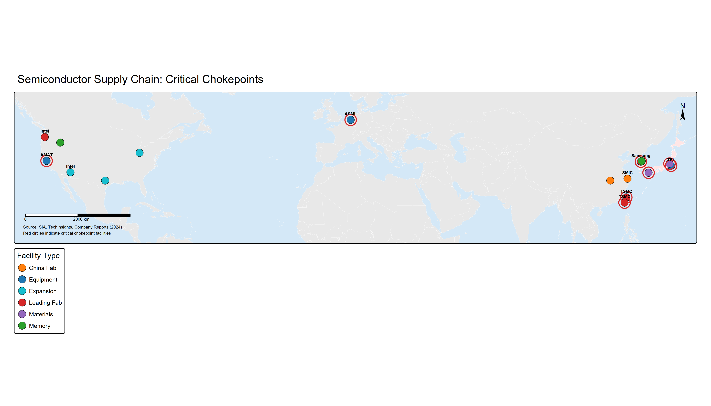

# Supply Chain Vulnerabilities and Dependencies

## Executive Summary

In March 2020, as COVID-19 spread globally, American hospitals confronted a jarring reality: the world's richest country could not obtain N95 masks, ventilators, or testing supplies. The shortages stemmed not from insufficient American manufacturing capacity historically, but from a decades-long shift that had concentrated production of personal protective equipment overwhelmingly in China. The logic of globalization—let each country do what it does cheaply, and trade for the rest—had seemed elegant in economics seminars. Now it looked like a strategic blunder of the first order. Within weeks, officials across the U.S. government were asking hard questions about supply chain vulnerabilities they had previously ignored: Which other critical goods came predominantly from potential adversaries? Could these dependencies be weaponized? How quickly could production be reshored?

The pandemic revealed what specialists had long warned: global supply chains, optimized for efficiency and cost minimization, had created acute concentration risks in strategically critical sectors. This chapter maps those vulnerabilities and examines how states are responding to the recognition that economic interdependence creates not only mutual prosperity but also exploitable chokepoints.


**Definition: Supply Chain Resilience**

Supply chain resilience refers to the ability of a supply chain to anticipate, prepare for, respond to, and recover from disruptions while maintaining continuous operations. Resilient supply chains incorporate redundancy, diversification, and flexibility rather than optimizing solely for cost efficiency. Building resilience often involves accepting higher costs in exchange for reduced vulnerability to shocks.


Three arguments organize our analysis. First, supply chain chokepoints exist where production is geographically or corporately concentrated, substitution is technically difficult, criticality to downstream industries is high, and alternative capacity takes years to build. These conditions describe semiconductors (where Taiwan's TSMC produces 90% of the world's advanced chips), rare earth processing (where China controls 85% of global capacity), pharmaceutical ingredients (where China and India supply 80% of active pharmaceutical ingredients to the U.S.), and critical minerals for the energy transition (where China dominates processing of lithium, cobalt, and graphite despite not dominating raw material extraction).

Second, these chokepoints developed not through natural comparative advantage alone, but through specific industrial policies, environmental externalization, and the logic of just-in-time manufacturing that prioritized efficiency over redundancy. China's dominance in rare earth processing reflects both geological endowment and deliberate government support, combined with Western firms' willingness to offshore environmentally damaging processing. Taiwan's semiconductor leadership stems from massive TSMC investments supported by government incentives, combined with high barriers to entry in advanced chip manufacturing. Understanding how chokepoints emerged is essential to assessing whether they can be unwound—and at what cost.

Third, strategies for reducing supply chain vulnerabilities—reshoring, friend-shoring, diversification, strategic stockpiling, and technology substitution—all involve difficult tradeoffs between security and economics. Bringing semiconductor fabrication back to the United States may enhance national security but requires tens of billions in subsidies, faces persistent cost disadvantages, and will take a decade to achieve meaningful scale. Friend-shoring to allied nations may seem to balance security and efficiency, but many allies face the same Chinese dependencies as the U.S. Diversification across multiple suppliers reduces single-point-of-failure risks but adds complexity and may not eliminate exposure to a dominant supplier. No solution is costless, and all require sustained political commitment despite economic headwinds.

This chapter proceeds in five main sections. Section 1 defines what makes a supply chain chokepoint and maps the most critical concentrations in global production. Section 2 examines semiconductor supply chains in detail—the quintessential chokepoint where Taiwan's dominance creates systemic vulnerabilities for the entire global economy. Section 3 analyzes critical minerals essential for the energy transition, where China's processing dominance creates leverage even when raw materials come from other countries. Section 4 explores pharmaceutical and medical supply chains, where the COVID-19 pandemic exposed acute dependencies. Section 5 evaluates competing strategies for reducing vulnerabilities, analyzing the strengths and limitations of each approach.

The chapter includes two Government Tools Boxes explaining the Defense Production Act (which grants the President authority to direct industrial production for national security) and CFIUS (which reviews foreign acquisitions for security implications). Three case studies apply the analytical framework from Chapter 1: the 2010 China-Japan rare earth crisis (when Beijing used export restrictions to signal displeasure over a territorial dispute), COVID-19 PPE shortages (exposing concentrated dependencies), and Taiwan's TSMC concentration (creating systemic risk from a potential cross-strait crisis). A Chinese Perspective Box explains Beijing's view on supply chain security—emphasizing historical vulnerabilities from foreign embargoes, the strategic logic of "indigenous innovation" (自主创新, zìzhǔ chuàngxīn), and the "dual circulation" (双循环, shuāng xúnhuán) strategy balancing domestic self-sufficiency with continued international engagement.

This is not abstract policy analysis. Supply chain dependencies determine which countries can sustain advanced manufacturing, deploy next-generation technologies, respond to public health emergencies, and maintain military capabilities during crises. Control the chokepoints, and you can strangle an adversary's economy without firing a shot. Recognition of these vulnerabilities is driving the most significant restructuring of global supply chains since the end of the Cold War. Understanding where chokepoints exist, how they developed, and what can realistically be done about them is essential for both policymakers navigating strategic competition and businesses operating in an increasingly geoeconomic world.

---

## The Geography of Supply Chain Chokepoints

### What Makes a Chokepoint?

Not all supply chain dependencies create strategic vulnerabilities. The United States imports coffee, bananas, and cocoa primarily from abroad, but these dependencies pose little coercive leverage: alternative suppliers are readily available, substitutes exist, and interruption would not cripple critical infrastructure or military capabilities. Strategic chokepoints have four defining characteristics that distinguish them from ordinary trade dependencies.


**Definition: Chokepoint**

A strategic chokepoint is a point of concentration in a supply chain where production is controlled by a small number of locations, firms, or countries, making disruption or denial capable of affecting a large share of global supply. Strategic chokepoints are characterized by: (1) geographic or corporate concentration, (2) difficulty of substitution, (3) criticality to downstream industries, and (4) long lead times to build alternative capacity.


**Geographic or corporate concentration** is the first requirement. Production must be concentrated in a small number of locations or firms, such that disruption or denial affects a large share of global supply. Taiwan's TSMC manufactures approximately 90% of the world's most advanced semiconductors (chips at 5 nanometer nodes and below) (Khan, Mann, and Peterson 2021; Miller 2022). China processes roughly 85% of rare earth elements, even though it produces only 60% of raw rare earth ore (U.S. Geological Survey 2023). The Netherlands' ASML is the sole manufacturer of extreme ultraviolet (EUV) lithography machines essential for producing cutting-edge chips. This concentration means that disruption—whether from geopolitical crisis, natural disaster, or deliberate restriction—cannot easily be compensated by ramping up production elsewhere.

**Difficulty of substitution** amplifies the strategic significance of concentration. Some concentrated production can be rapidly replaced if interrupted. Others face technical barriers, massive capital requirements, or long lead times that make substitution infeasible in the short to medium term. Building a semiconductor fabrication facility capable of producing advanced chips requires $15-20 billion in capital investment and 3-5 years of construction and testing (Khan, Mann, and Peterson 2021). Developing rare earth processing capacity involves not only mining but also complex chemical separation processes that take years to establish and generate substantial environmental hazards. These barriers to entry mean that even wealthy countries with strong technical capabilities cannot quickly reduce dependencies when geopolitical circumstances change.

**Criticality to downstream industries** determines whether concentration matters strategically. A chokepoint is most consequential when the concentrated input is essential to sectors vital for economic competitiveness, national security, or public health. Semiconductors are critical because they power everything from smartphones to data centers to advanced weapons systems—no modern economy or military can function without reliable access to chips. Rare earth elements are critical because they are essential for permanent magnets in wind turbines, electric vehicle motors, and precision-guided munitions. Active pharmaceutical ingredients are critical because drug shortages can trigger public health crises. Inputs that are concentrated but not critical to strategic sectors—such as certain consumer goods—pose less leverage.

**Time required to build alternative capacity** is the final characteristic distinguishing strategic chokepoints from ordinary dependencies. Even when substitution is theoretically possible, the time required to develop alternative sources determines vulnerability during crises. If alternative capacity can be built in months, dependencies are manageable through strategic stockpiles and emergency measures. When alternative capacity requires a decade, dependencies create sustained vulnerabilities that can be exploited for coercive leverage. The U.S. CHIPS Act, passed in 2022, provides $52 billion in subsidies to rebuild domestic semiconductor manufacturing (Rasser et al. 2022)—but even with this massive investment, substantial production will not come online until the late 2020s or 2030s. This extended timeline means that Taiwan's current dominance will persist for years regardless of reshoring efforts.

These four characteristics—concentration, difficulty of substitution, criticality, and time to build alternatives—interact to create chokepoint vulnerability. The more pronounced each characteristic, the greater the strategic leverage. Conversely, dependencies that lack one or more of these features pose limited coercive risk. Mapping which supply chains meet these criteria is essential for understanding contemporary economic security threats.

### Mapping Critical Chokepoints

Armed with a framework for identifying chokepoints, we can now map the most strategically significant concentrations in global supply chains. While comprehensive supply chain mapping is beyond the scope of any single chapter (the Biden administration's 100-day supply chain review produced hundreds of pages on just four sectors (White House 2021)), several concentrations stand out for their scale, strategic importance, and centrality to U.S.-China competition.

**Semiconductors** represent the most consequential chokepoint in the global economy. The semiconductor supply chain is a marvel of specialization: design happens primarily in the United States (Intel, AMD, Nvidia, Qualcomm, Apple), Europe (ARM), and increasingly China (Huawei's HiSilicon before U.S. sanctions); electronic design automation (EDA) software that makes chip design possible comes exclusively from three American companies (Synopsys, Cadence, Mentor Graphics/Siemens); manufacturing equipment comes from the U.S. (Applied Materials, Lam Research, KLA), the Netherlands (ASML with monopoly on EUV lithography), and Japan (Tokyo Electron, Screen Holdings); and fabrication is dominated by Taiwan (TSMC with 54% of the foundry market and approximately 90% of advanced chips), South Korea (Samsung, SK Hynix with strength in memory chips), and the U.S. (Intel, though struggling in recent years). China remains weak in fabrication, producing less than 10% of global chips and predominantly at mature technology nodes (28 nanometers and above), despite massive investments through the Big Fund (大基金) industrial policy initiative exceeding $100 billion.

*Figure 2.1: Critical locations in the global semiconductor supply chain. Red circles indicate chokepoint facilities where disruption would cascade through global technology industries. TSMC's Taiwan fabs, ASML's Netherlands lithography equipment, and Japanese materials suppliers each represent single points of failure.*

This geographic and corporate concentration creates multiple chokepoints. TSMC's dominance in advanced nodes means that any disruption to Taiwan—whether from earthquake, Chinese military action, or semiconductor-specific targeting—would cripple global technology sectors. ASML's monopoly on EUV lithography means that the Netherlands holds a chokepoint on the most advanced semiconductor manufacturing equipment. The concentration of EDA software in three American firms means the U.S. can deny design capabilities to rivals. Each chokepoint can be weaponized: the October 2022 U.S. semiconductor export controls leveraged American positions in equipment and software to constrain China's chip capabilities, even for chips not manufactured in the United States.


**Definition: Rare Earth Elements**

Rare earth elements (REEs) are a group of 17 metallic elements with unique magnetic, phosphorescent, and catalytic properties essential for advanced technologies. Despite the name, they are not geologically rare but are difficult to extract and process economically. Key applications include permanent magnets (neodymium, dysprosium), phosphors for displays (europium, terbium), and catalysts (cerium).


**Rare earth elements and critical minerals** present a different type of chokepoint—one where China's dominance stems primarily from processing rather than geological monopoly. Rare earth elements (a group of 17 elements including neodymium, dysprosium, and europium) are essential for permanent magnets used in wind turbines, electric vehicle motors, computer hard drives, and military applications from F-35 fighter jet engines to precision-guided missiles. China produces approximately 60% of global rare earth ore, but more critically, processes roughly 85% of rare earths into usable forms. This processing dominance developed over decades as Western firms offshored environmentally damaging refining operations, and Chinese state-backed companies consolidated market share through vertical integration and subsidies.

Beyond rare earths, China's dominance extends to other minerals critical for the energy transition. China controls approximately 60% of lithium processing (despite Australia and Chile leading in mining), 80% of cobalt refining (though the Democratic Republic of Congo produces 70% of ore), and 80% of natural graphite processing (a critical battery component). The pattern is consistent: China does not monopolize raw material extraction but dominates the midstream processing that converts ore into materials usable in batteries, magnets, and electronics. This positioning reflects deliberate industrial policy identifying critical mineral processing as a strategic sector worthy of state support, combined with willingness to tolerate environmental costs that Western nations regulated away.

**Pharmaceutical ingredients** constitute a third critical chokepoint, one dramatically exposed by the COVID-19 pandemic. China and India together supply approximately 80% of active pharmaceutical ingredients (APIs) used in U.S. medications (White House 2021). China is particularly dominant in antibiotics—roughly 90% of antibiotics used in the United States depend on precursors manufactured in China. For some generic drugs, dependence approaches 100%. This concentration developed gradually as American and European pharmaceutical companies pursued cost savings by offshoring API production to countries with lower labor costs and less stringent environmental regulations. The process accelerated after India and China joined the World Trade Organization, enabling easier global trade in pharmaceutical products.

The strategic implications became apparent during COVID-19 when shortages emerged not only in personal protective equipment (N95 masks produced overwhelmingly in China) but also in pharmaceutical precursors, testing supplies, and even basic medications. China's export restrictions in early 2020, ostensibly for domestic health needs, raised fears about deliberate leverage—fears intensified when Chinese government officials suggested restricting pharmaceutical exports to the U.S. as retaliation for other disputes. Even absent deliberate weaponization, quality control concerns have emerged repeatedly: the 2008 heparin contamination incident that caused deaths in the U.S. traced to Chinese suppliers, and fentanyl precursors that fuel America's opioid epidemic come predominantly from Chinese chemical manufacturers.

**Battery production and energy transition materials** increasingly create chokepoints as the global economy shifts toward electric vehicles and renewable energy. China manufactures approximately 75% of lithium-ion batteries globally and controls substantial shares of battery component production: 85% of battery anodes (typically made from graphite), 70% of cathodes, and 66% of battery cells (IEA 2023). Chinese firms like CATL (Contemporary Amperex Technology Co. Limited) and BYD dominate global battery markets, with CATL alone supplying batteries to Tesla, BMW, Volkswagen, and others. Similarly, China produces roughly 80% of solar panels globally, controlling supply chains from polysilicon production through module assembly.

This dominance creates dependencies for countries pursuing aggressive decarbonization. The European Union's Green Deal and U.S. Inflation Reduction Act aim to rapidly expand electric vehicle adoption and renewable energy deployment—but both depend on Chinese-dominated supply chains for batteries, solar panels, and the critical minerals these technologies require. China's positioning reflects the Made in China 2025 industrial policy explicitly targeting new energy vehicles and advanced electrical equipment as strategic sectors (NDRC 2015). As the U.S. and Europe belatedly attempt to build domestic capacity through subsidies (the U.S. Inflation Reduction Act provides substantial battery manufacturing tax credits), they confront the reality that China holds a decade-long lead in manufacturing scale, supply chain integration, and cost efficiency.

### How Chokepoints Developed

Understanding how chokepoints emerged is essential for assessing whether they can be unwound and at what cost. Five factors explain the development of concentrated supply chain dependencies, each with distinct implications for restructuring efforts.

**Comparative advantage and specialization** represent the starting point. Basic economic theory suggests that countries and firms should specialize in activities where they have relative efficiency advantages, trading for other needs. Taiwan developed semiconductor manufacturing expertise through deliberate industrial policy (government support for TSMC's creation in 1987), substantial human capital investments, and geographic clustering in Hsinchu Science Park that enabled knowledge spillovers. Over time, TSMC's scale advantages—each new fabrication facility costs $15-20 billion, and leading-edge chip production requires continuous R&D investments—created barriers to entry that reinforced dominance. South Korea followed a similar path in memory chips, with Samsung and SK Hynix achieving scale that makes competing prohibitively expensive.

China's development of rare earth processing capacity similarly reflected comparative advantages: geological endowments (significant domestic rare earth deposits), lower labor costs, and critically, willingness to tolerate environmental externalities. Rare earth processing generates toxic byproducts including radioactive waste; as Western countries tightened environmental regulations in the 1980s and 1990s, processing shifted to China where standards were laxer and enforcement weaker. By the 2000s, China's scale advantages and integrated supply chains made competing economically unattractive—even countries with rare earth deposits (the U.S., Australia) sent ore to China for processing rather than developing domestic capacity.

**Economies of scale and network effects** reinforced initial specialization advantages. Semiconductor fabrication exhibits enormous economies of scale: each new generation of manufacturing equipment (measured by how small circuit features can be etched on chips) requires billions in R&D and capital investment, but per-chip costs decline dramatically with volume. This dynamic favors consolidation—TSMC's scale allows it to invest more in next-generation technology than smaller competitors, perpetuating its lead. Network effects compound scale advantages: as TSMC became the dominant foundry, chip designers optimized their designs for TSMC's manufacturing processes, equipment suppliers prioritized compatibility with TSMC's facilities, and engineers globally sought training at TSMC. These network effects create lock-in that makes displacing an incumbent extraordinarily difficult even when governments provide massive subsidies to new entrants.

Battery manufacturing exhibits similar dynamics. CATL's scale allows it to negotiate favorable terms with raw material suppliers (lithium miners, graphite processors), invest heavily in next-generation battery chemistry R&D, and offer competitive pricing that new entrants struggle to match. Early-mover advantages in learning-by-doing—accumulated expertise in manufacturing processes, quality control, and supply chain management—create barriers to entry beyond just capital requirements. This explains why even with substantial U.S. and European subsidies, building competitive battery manufacturing capacity will take years.

**Industrial policy and government support** played crucial roles in creating many contemporary chokepoints, contradicting simplistic narratives of pure market efficiency. China's dominance in rare earths, solar panels, batteries, and electric vehicles reflects explicit government strategies identifying these sectors as priorities, providing subsidies, restricting exports to favor domestic processing, and tolerating sustained losses by state-owned enterprises to gain market share. The Made in China 2025 plan explicitly targeted ten strategic sectors including new energy vehicles, advanced electrical equipment, and new materials—areas where China now holds substantial advantages.

Taiwan's semiconductor success similarly involved deliberate government policy. TSMC's creation was facilitated by government investment (the national development fund provided 48% of initial capital) and recruitment of Morris Chang, former Texas Instruments executive, to lead the venture. The Taiwanese government provided tax incentives, infrastructure support, and R&D funding that enabled TSMC's early development. South Korea followed comparable policies supporting Samsung and SK Hynix through preferential financing, R&D support, and tolerance of corporate structures (chaebol conglomerates) that enabled sustained investment even during downturns.

The implication is significant: if chokepoints resulted from market forces alone, they might be reversed through market mechanisms (competitors entering when prices rise above costs). But when chokepoints reflect sustained government support, reversing them requires comparable or greater government intervention—costly and politically difficult, especially in market-oriented economies where industrial policy faces skepticism.

**Environmental externalization and regulatory arbitrage** explain several critical dependencies, particularly in chemicals, pharmaceuticals, and rare earth processing. Rare earth mining and processing generate substantial pollution: sulfuric acid used in processing creates acidic wastewater, and many rare earth ores contain thorium and uranium that produce radioactive waste. As environmental regulations in the U.S. and Europe tightened from the 1980s onward, mining and processing operations became economically uncompetitive or legally prohibited. The Mountain Pass rare earth mine in California—once the world's largest producer—closed in 2002 partly due to environmental compliance costs and wastewater management challenges. Production shifted to China, where enforcement of environmental regulations was weaker and local governments prioritized economic development over environmental protection.

Pharmaceutical API production followed similar patterns. Manufacturing APIs involves chemical synthesis processes that generate waste streams and pollution. As Western countries tightened environmental standards and labor protections, API production shifted to China and India where costs remained lower. The shift was gradual—beginning with mature generic drugs where intellectual property protections had expired, and eventually encompassing even some branded pharmaceuticals. By the 2010s, American and European pharmaceutical companies had largely exited API manufacturing, retaining only final formulation and packaging domestically.

This dynamic creates a paradox for reshoring efforts: bringing production back may require either substantial subsidies to offset higher environmental compliance costs, or relaxation of environmental standards—a politically fraught choice. The economics that drove offshoring don't disappear because supply chain vulnerabilities are recognized.


**Definition: Just-in-Time Manufacturing**

Just-in-time (JIT) manufacturing is a production strategy that minimizes inventory by receiving materials and components only as needed for immediate production. While JIT reduces storage costs and waste, it also eliminates buffer stocks that could absorb supply disruptions, making supply chains more fragile during crises.


**Just-in-time manufacturing and efficiency optimization** complete the explanation for concentrated supply chains. Beginning in the 1980s and accelerating with digital supply chain management tools, corporations adopted just-in-time practices that minimized inventory, reduced redundancy, and optimized for cost efficiency rather than resilience. Maintaining multiple suppliers for critical components, or holding large inventories as buffers against disruption, appeared wasteful when supply chains functioned smoothly. The result was ever-longer, ever-more-complex supply chains with minimal slack.

The logic was economically rational in stable geopolitical environments. Why pay for redundancy if disruptions are rare and brief? Why maintain expensive domestic capacity if offshore production costs 30-50% less? CFOs made these decisions with spreadsheets, not strategy maps. The misalignment between corporate optimization (focused on shareholder returns and quarterly results) and national strategic needs (focused on resilience and security) is the original sin of contemporary supply chain vulnerability. Shareholders demanded efficiency; nations needed resilience. For thirty years, efficiency won—until it didn't.

The COVID-19 pandemic shattered assumptions underlying just-in-time optimization. When demand surged and borders closed, the absence of redundancy and inventory buffers created cascading shortages. The lesson—that efficiency and resilience can conflict—now drives reshoring debates. But translating this lesson into policy requires addressing the economic incentives that created concentrated supply chains in the first place, either through regulatory requirements (mandating redundancy despite costs) or subsidies (compensating firms for maintaining less efficient but more resilient supply chains). Both approaches face political and economic headwinds.

Understanding these five factors—comparative advantage, economies of scale, industrial policy, environmental externalization, and just-in-time optimization—reveals why supply chain restructuring is so challenging. Chokepoints did not emerge randomly or through temporary distortions. They reflect deep structural forces, deliberate government strategies, and decades of accumulated advantages. Unwinding them requires confronting these root causes, not just providing one-time subsidies or imposing temporary restrictions. The next sections examine specific chokepoints in detail, beginning with semiconductors—the most strategically consequential dependency in the global economy.

---

## Semiconductor Supply Chains - The Critical Chokepoint

If there is a single chokepoint that keeps American national security strategists awake at night, it is semiconductors—and more specifically, Taiwan's dominance in manufacturing the most advanced chips. Semiconductors are the foundation of modern civilization: they power smartphones, data centers, artificial intelligence systems, autonomous vehicles, telecommunications networks, and virtually every advanced weapons system. An economy or military without access to cutting-edge chips is fighting the next war with the last war's tools. Yet roughly 90% of the world's most advanced semiconductors come from a single company (TSMC) on an island (Taiwan) that China claims as its territory and has not ruled out seizing by force. To put this in Cold War terms: imagine if 90% of the world's jet fuel came from one refinery in Berlin during the Soviet blockade. That's roughly the strategic exposure the world faces with semiconductors today. Understanding this chokepoint—how it developed, why it persists, and what responses are being attempted—is essential for grasping contemporary economic security challenges.

### The Semiconductor Value Chain

Semiconductor production involves one of the most complex supply chains in the global economy, with dozens of steps spanning multiple continents. Unlike many industries where a single firm or country might dominate, the semiconductor value chain features multiple chokepoints at different stages—a condition that amplifies both leverage and vulnerability.

**Design** is the first stage, where companies conceive new chips and translate requirements into detailed specifications. This stage is dominated by American firms: Intel designs and manufactures its own chips (an integrated model), while "fabless" companies like AMD, Nvidia, Qualcomm, Broadcom, and Apple design chips but outsource manufacturing to specialized foundries. Britain's ARM (owned by Japan's SoftBank, though potentially facing sale) licenses chip architectures used in virtually all smartphones. Chinese firms, particularly Huawei's HiSilicon division before U.S. sanctions, also design chips but depend on foreign manufacturing. Design requires sophisticated software tools—Electronic Design Automation (EDA) software—controlled by just three companies: Synopsys and Cadence (both American) and Mentor Graphics (American, now owned by Germany's Siemens). This concentration gives the United States extraordinary leverage: denying access to EDA tools effectively prevents sophisticated chip design, as China discovered when U.S. export controls cut HiSilicon off from software updates.

**Manufacturing equipment** is the next critical stage. Producing modern semiconductors requires hundreds of specialized machines, each costing tens of millions of dollars, arranged in extraordinarily precise sequences. The United States maintains strength in several categories: Applied Materials, Lam Research, and KLA Corporation dominate deposition equipment (laying down thin films of materials), etching equipment (removing material to create circuit patterns), and inspection equipment (checking for defects). But the most critical chokepoint belongs to the Netherlands: ASML is the sole manufacturer of extreme ultraviolet (EUV) lithography machines, which use light with wavelengths just 13.5 nanometers to etch transistor features smaller than viruses onto silicon wafers.


**Definition: EUV Lithography**

Extreme Ultraviolet (EUV) lithography is the cutting-edge technology required to manufacture the most advanced semiconductors (7nm and below). EUV machines use light with 13.5nm wavelength to print circuit patterns far smaller than visible light could achieve. Only one company in the world - ASML of the Netherlands - can manufacture EUV machines. Each costs approximately $150 million and requires three Boeing 747s to ship.
 Each EUV machine costs approximately $150 million, requires three Boeing 747s to ship, and represents the pinnacle of optical engineering (Miller 2022)—mirrors polished to atomic-scale smoothness, lasers generating 50,000 pulses per second vaporizing tin droplets to produce EUV light. No other company has successfully produced EUV lithography, and without it, manufacturing chips at 7nm, 5nm, or 3nm nodes (the leading edge) is impossible. Japan also maintains significant equipment strength through Tokyo Electron (etching and coating equipment) and Screen Holdings (cleaning equipment).

This equipment concentration creates extraordinary leverage. The 2019-2022 U.S. campaign to prevent ASML from selling EUV machines to China's SMIC (Semiconductor Manufacturing International Corporation) exemplifies this leverage in action. After years of diplomatic pressure on the Dutch government, ASML has not delivered EUV machines to any Chinese customer, effectively capping Chinese chip manufacturing at 7nm nodes without EUV-enabled production.

**Fabrication** is where silicon wafers become functioning chips—and where Taiwan's dominance creates the most acute vulnerability. TSMC holds approximately 54% of the global foundry market (outsourced chip manufacturing), but more critically, produces roughly 90% of the world's most advanced chips at 5nm nodes and below. South Korea's Samsung has approximately 16% of the foundry market and can produce at leading-edge nodes, though it typically trails TSMC by 1-2 years in introducing each new process generation and has faced yield challenges (the percentage of chips that function correctly). Intel, historically dominant in semiconductor manufacturing, has struggled in recent years, falling behind TSMC's process technology—a failure that prompted the company's CEO to resign in 2020 and led to Intel's new strategy of becoming a foundry for other companies' designs (Intel Foundry Services). China's SMIC can produce at 14nm and, reportedly, 7nm through multi-patterning techniques that don't require EUV, but faces yield challenges, much higher costs than TSMC, and cannot approach 5nm or 3nm.

Fabrication concentration creates several vulnerabilities. First, geographic concentration: TSMC's most advanced fabs cluster in Taiwan's Hsinchu Science Park and Tainan Science Park. An earthquake (Taiwan sits on the Pacific Ring of Fire), cross-strait military conflict, or Chinese blockade could disrupt production that supplies Apple, AMD, Nvidia, Qualcomm, and virtually every other designer of high-performance chips. Second, corporate concentration: while other foundries exist, none can produce leading-edge chips at scale. Qualifying chips on a new manufacturing process takes 12-24 months of engineering work—chip designers cannot easily switch foundries if TSMC faces disruption. Third, water dependency: semiconductor fabrication requires enormous quantities of ultrapure water (a single fab may consume 20-30 million gallons daily). Taiwan has faced severe droughts that forced water rationing, and climate change threatens to intensify these challenges.

**Assembly, testing, and packaging** is the final stage, where fabricated chips are cut from wafers, packaged to protect delicate circuits, tested for functionality, and prepared for integration into devices. This stage is less concentrated than fabrication but still regionally clustered: Taiwan, China, Malaysia, South Korea, and to a lesser extent the Philippines and Vietnam dominate. China holds approximately 38% of global back-end capacity, reflecting lower labor costs and proximity to electronics manufacturing. This stage generally involves less sophisticated technology than fabrication (though advanced packaging is becoming increasingly important), and thus poses less acute strategic risk—but it still creates dependencies, particularly for China's ability to deny assembly services.

**Materials and gases** complete the supply chain. Semiconductor manufacturing requires exotic materials in extreme purity: photoresists (light-sensitive chemicals used in lithography, dominated by Japanese firms JSR, Tokyo Ohka Kogyo, and Shin-Etsu Chemical), silicon wafers (Japan's Shin-Etsu and SUMCO with 50%+ global market share), ultra-high-purity gases (neon, krypton, xenon—notably, neon supplies faced disruption when Russia invaded Ukraine in 2022, as Ukraine produced 50% of global neon), and specialty chemicals. Japan's strength in materials reflects decades of accumulated expertise and extreme quality control—producing photoresist with one impurity per trillion requires mastery that new entrants struggle to match.

This complexity means that no single country can produce advanced semiconductors without reliance on others. The United States dominates design and much equipment. The Netherlands holds a unique chokepoint in EUV lithography. Japan excels in materials and some equipment. Taiwan leads in fabrication. South Korea maintains significant memory chip production (SK Hynix and Samsung together control approximately 70% of DRAM memory and 50% of NAND flash memory markets). China has substantial assembly capacity but depends on others for design, equipment, advanced fabrication, and materials. This interdependence means that semiconductor statecraft requires allied coordination—unilateral American controls have limits when targets can potentially access Dutch equipment or Japanese materials. It also means that semiconductor supply chains cannot easily be "reshored" to any single country; the realistic goal is "friend-shoring" that maintains specialization among allied nations while reducing exposure to strategic competitors.

### Why Taiwan Matters

*Figure 2.2: TSMC Global Market Share and Tech Dominance*

Taiwan Semiconductor Manufacturing Company—TSMC—stands at the center of global semiconductor dependence, and by extension, at the center of tensions between the United States and China. Understanding TSMC's dominance and the barriers to replicating it is essential for assessing supply chain vulnerability and restructuring possibilities.

TSMC's market position is extraordinary. Founded in 1987 by Morris Chang (who had previously worked at Texas Instruments in the U.S.), TSMC pioneered the "pure-play foundry" model: manufacturing chips designed by other companies rather than competing with customers by designing its own. This business model required extraordinary trust—customers had to share their most valuable intellectual property—and TSMC built that trust through reliability, technological leadership, and absolute customer confidentiality. By the early 2000s, TSMC's model had proven superior to integrated manufacturers like Intel for many applications, enabling a split between fabless design companies (who could focus on innovation without massive manufacturing capital requirements) and specialized manufacturing.

Today TSMC manufactures chips for Apple (A-series and M-series processors), AMD (Ryzen CPUs and Radeon GPUs), Nvidia (graphics processors and AI accelerators), Qualcomm (smartphone processors), MediaTek, and hundreds of other customers. The company holds approximately 54% of the global foundry market by revenue, but this understates its strategic importance. Where TSMC's dominance becomes absolute is at the leading edge. Of chips manufactured at 5nm nodes (transistors with features roughly 5 nanometers wide), TSMC produces approximately 90%. At 3nm—the bleeding edge of commercial chip production as of 2024—TSMC is the only volume manufacturer, with Samsung planning to follow in later years. This means that virtually all high-performance processors for smartphones, data centers, AI training, and advanced computing depend on Taiwanese fabrication.

Why hasn't this dominance been challenged? Four factors explain TSMC's sustained lead: capital intensity, accumulated expertise, ecosystem lock-in, and government support.

**Capital intensity** creates enormous barriers to entry. Each new generation of semiconductor fabrication requires approximately $15-20 billion for a single fab capable of volume production. TSMC operates dozens of fabs, with capex (capital expenditure) of $35-40 billion annually in recent years. Building a competing foundry network requires hundreds of billions—sums that only governments can realistically provide, and even then only with sustained commitment across multiple election cycles. Intel's struggles illustrate the challenge: despite being an incumbent with deep expertise, Intel's attempt to match TSMC's process technology has consumed tens of billions and still lags by critical years. For new entrants without Intel's existing capabilities, the challenge is even more daunting.

**Accumulated expertise** compounds capital barriers. Semiconductor manufacturing requires mastery of thousands of process steps, each demanding extreme precision. TSMC has three decades of learning-by-doing: engineers solving yield problems, optimizing processes, managing equipment interactions, and handling the thousands of contingencies that arise in volume production. This tacit knowledge—sometimes called "process know-how"—cannot be purchased or copied. It accumulates through experience, and TSMC's head start means that even firms with comparable equipment face yield and cost disadvantages. Samsung's difficulties achieving competitive yields at leading nodes, despite massive investment and technical capability, illustrate how accumulated expertise matters.

**Ecosystem lock-in** reinforces these advantages. Chip designers optimize their designs for specific manufacturing processes—a design for TSMC's 5nm node cannot easily be transferred to Samsung's 5nm node (which despite the similar name involves different technical specifications). Qualifying a new design on a different foundry's process requires 12-24 months of engineering work and substantial costs. Electronic Design Automation (EDA) tools are optimized for TSMC processes. Equipment suppliers prioritize compatibility with TSMC specifications. Universities in Taiwan train engineers in TSMC-specific knowledge. This ecosystem makes TSMC not just a manufacturer but the center of a network—and networks resist displacement even when alternatives exist.

**Government support** provided crucial early advantages and continues to shape TSMC's trajectory. The Taiwanese government funded 48% of TSMC's initial capital, recruited Morris Chang to lead the venture, and provided tax incentives and infrastructure support. Taiwan's Industrial Technology Research Institute (ITRI) conducts pre-competitive R&D that benefits TSMC. The government ensures stable electricity and water supply despite Taiwan's resource constraints (semiconductor fabs have priority during droughts). Critically, Taiwan has made semiconductor leadership a national priority: TSMC is understood as essential to Taiwan's security (its importance to the global economy makes Chinese aggression less likely by raising international costs of disruption) and its economic competitiveness.

These factors interact to create a sustained competitive advantage that subsidy programs elsewhere struggle to overcome. The U.S. CHIPS Act ($52 billion) has induced TSMC to build fabs in Arizona, but these will trail Taiwan's leading-edge production by 1-2 generations and face 30-50% higher operating costs (due to more expensive labor, energy, and construction). European programs similarly aim to attract semiconductor investment, but face the reality that Taiwan's lead reflects decades of accumulated advantages that cannot be quickly replicated.

The strategic implications are profound. A Chinese blockade of Taiwan—even one that didn't involve invasion—would likely disrupt TSMC production through disrupted shipping, worker anxiety, and uncertainty about fab operations under military threat. Major combat would almost certainly damage facilities in Taiwan, some of the most concentrated high-value industrial assets on Earth. TSMC's Arizona fabs, even when fully operational in the late 2020s, will produce perhaps 5% of TSMC's total output, nowhere near enough to compensate for Taiwan disruption. The United States, Europe, Japan, and South Korea would all face acute chip shortages affecting everything from consumer electronics to data centers to weapons systems.

This vulnerability explains U.S. efforts to constrain China's indigenous semiconductor capabilities through export controls. If China could produce advanced chips domestically, it would not need TSMC—and thus might calculate that the economic costs of blockading or invading Taiwan would be manageable. Conversely, maintaining China's dependence on TSMC (and thus on Taiwan's autonomy) raises the costs of aggressive Chinese action. This logic underpins the October 2022 semiconductor export controls: by denying China access to EUV lithography and advanced manufacturing equipment, the United States aims to lock in Chinese dependence on foreign chips, thereby increasing deterrence of actions against Taiwan.

But this strategy faces its own vulnerabilities. If U.S. controls are too aggressive, they may accelerate Chinese determination to achieve semiconductor self-sufficiency regardless of cost—and given sufficient time (potentially a decade or more) and resources (tens or hundreds of billions), China may succeed in developing at least mid-range capabilities even without foreign equipment access. If controls are too weak, they may fail to prevent China from reaching parity, eliminating the dependence that protects Taiwan. The challenge is calibrating restrictions to maintain Chinese dependence without provoking a crash program at self-sufficiency that might eventually succeed. This calibration is extraordinarily difficult, involves substantial uncertainty, and must account for Chinese perspectives examined later in this chapter.

### 2.3 U.S. and Chinese Strategies

Both the United States and China recognize semiconductor dependence as a critical vulnerability and have launched ambitious programs to address it—though with different objectives, constraints, and prospects for success.

**U.S. Strategy: Maintain the Lead, Secure Supply, and Deny Adversaries**

American semiconductor strategy rests on three pillars: preserving technological advantages over China, securing supply of advanced chips despite Taiwan concentration, and preventing China from achieving indigenous capabilities that would reduce dependence on Western technology.

The **CHIPS and Science Act**, signed into law in August 2022, provides $52 billion in subsidies for semiconductor manufacturing and R&D in the United States. The legislation includes $39 billion in manufacturing incentives, $11 billion for R&D (including the National Semiconductor Technology Center for advancing chip technology), and $2 billion for defense and legacy chips. These subsidies aim to reverse decades of manufacturing decline: U.S. share of global semiconductor fabrication fell from 37% in 1990 to just 12% in 2020, reflecting offshoring to Taiwan, South Korea, and elsewhere where governments provided more support and costs were lower.

CHIPS Act incentives have already induced substantial announced investments. TSMC is building two fabs in Arizona with projected $40 billion investment, targeting 4nm production by 2025 and 3nm by 2028. Samsung is expanding in Texas with $17 billion investment. Intel announced $20 billion for Ohio facilities and tens of billions more for Arizona expansion, as part of CEO Pat Gelsinger's strategy to restore Intel's manufacturing competitiveness and build a credible foundry business serving external customers. Micron, SK Hynix, and others have also announced U.S. investments, totaling over $200 billion in new domestic semiconductor facilities.

Yet even these massive investments face limitations. First, timescale: new fabs take 3-5 years to construct and ramp to volume production, meaning substantial new capacity won't come online until the late 2020s. Second, cost disadvantage: manufacturing in the U.S. costs 30-50% more than in Taiwan or South Korea due to higher labor costs, energy costs, and construction costs. Subsidies offset these disadvantages partially, but not entirely—and subsidies must be sustained over decades to maintain competitiveness. Third, talent: semiconductor manufacturing requires tens of thousands of engineers and technicians with specialized expertise, and American universities have not produced these cohorts in decades. TSMC's Arizona fabs have imported hundreds of Taiwanese engineers to provide expertise, raising questions about whether U.S. facilities will truly be independent of Taiwan. Fourth, ecosystem gaps: manufacturing requires not just fabs but also suppliers of equipment, materials, and components, many of whom lack U.S. presence and may not build it unless demand justifies investment.

These limitations mean that CHIPS Act goals—reducing dependence on Taiwan, securing domestic supply of advanced chips—will be only partially achieved. U.S. production will grow, but Taiwan will remain dominant in leading-edge chips for the foreseeable future. The realistic goal is reducing absolute dependence (ensuring that some domestic production exists as a hedge) rather than eliminating dependence entirely.

**Export controls** represent the second pillar of U.S. strategy. As detailed in Chapter 1, the October 2022 controls imposed unprecedented restrictions on exports of semiconductor manufacturing equipment to China and updated the "foreign direct product rule" to prevent chips made anywhere with U.S. technology from reaching designated Chinese firms. Subsequent updates in 2023 and 2024 tightened loopholes and expanded restrictions to more Chinese entities.

These controls aim to prevent China from developing indigenous capabilities in advanced chip manufacturing. By denying EUV lithography from ASML, advanced deposition and etching equipment from U.S. firms, and EDA software from American companies, the U.S. seeks to cap Chinese capabilities at older-generation nodes (14nm and above, though China has achieved some 7nm production through labor-intensive multi-patterning techniques). The logic is strategic denial: if China cannot make advanced chips domestically, it must rely on imports from Taiwan, South Korea, or the United States—dependence that constrains Chinese strategic options and preserves Taiwan's economic leverage.

The strategy involves substantial risk. First, China may eventually develop indigenous equipment and EDA tools that, while inferior to Western technology, enable acceptable chip production. China has invested $100+ billion through its "Big Fund" (国家集成电路产业投资基金, National Integrated Circuit Industry Investment Fund) and designated semiconductors as a top national priority. With sufficient time—perhaps a decade, perhaps more—Chinese firms may achieve adequate (if not leading-edge) capabilities. Second, aggressive export controls may accelerate Chinese determination to achieve self-sufficiency at any cost, strengthening hawks in Beijing who argue that economic interdependence with the West is a vulnerability rather than an asset. Third, controls risk fracturing allied coordination if European and Asian partners perceive U.S. restrictions as damaging their economic interests without proportionate security benefits.

**Allied coordination** forms the third pillar. Semiconductor controls only work if coordinated among major equipment suppliers and manufacturing countries. The U.S. has pursued several mechanisms: the Chip 4 Alliance (proposed cooperation among the U.S., Taiwan, South Korea, and Japan); bilateral agreements with the Netherlands and Japan restricting ASML and Tokyo Electron equipment sales to China; and trilateral coordination through the U.S.-EU Trade and Technology Council. These efforts aim to prevent Chinese end-runs around U.S. restrictions by purchasing equipment from non-U.S. suppliers.

Coordination faces challenges. South Korea and Taiwan both have substantial exports to China and face Chinese retaliation risks. South Korea's semiconductor firms (Samsung, SK Hynix) operate fabs in China that serve Chinese customers—stringent export controls threaten their business models. Taiwan worries that overly aggressive restrictions might eventually harm TSMC if Chinese customers abandon their designs in favor of domestic alternatives. Europe sees economic opportunity in China and historically resisted U.S. sanctions it viewed as extraterritorial overreach. Maintaining coordination requires balancing these diverse interests while presenting a unified front—a difficult diplomatic challenge.

**Chinese Strategy: Self-Reliance through Indigenous Innovation**

China's response to semiconductor vulnerability reflects historical learning from past embargoes, current strategic competition with the United States, and deep Communist Party commitment to avoiding dependence on potential adversaries. The strategy is captured by the phrase "chokepoint" (卡脖子, qiǎ bózi, literally "strangling the neck") that pervades official documents—recognition that dependencies on foreign semiconductors, equipment, and software represent strategic vulnerabilities that adversaries can exploit.

China's approach involves massive state investment through the Big Fund, now in its third phase with total commitments exceeding $100 billion. These funds support Chinese chip manufacturers (SMIC, Hua Hong Semiconductor), equipment makers (AMEC, Naura Technology), materials suppliers, and design firms. The goal is vertical integration: developing Chinese capabilities across the entire semiconductor value chain to eliminate or reduce dependence on foreign suppliers at each stage.

Progress has been uneven. In chip design, Chinese firms led by Huawei's HiSilicon were approaching global standards by 2020—HiSilicon's Kirin processors for smartphones competed with Qualcomm and MediaTek. U.S. sanctions that cut HiSilicon off from TSMC manufacturing and EDA software updates devastated this progress, and HiSilicon largely exited the smartphone processor market. In manufacturing equipment, Chinese firms supply mature-generation equipment but lag far behind U.S., Dutch, and Japanese leaders in advanced tools. No Chinese firm has produced EUV lithography or comparable capabilities. In fabrication, SMIC can produce at 14nm nodes and reportedly achieved 7nm through multi-patterning (using older Deep-UV lithography multiple times to achieve smaller features), but faces yield problems, much higher costs than TSMC, and cannot approach 5nm or 3nm without EUV. In materials, China has made more progress, leveraging its domestic chemical industry, though quality and purity still trail Japanese suppliers for cutting-edge applications.

China's realistic goal over the next decade is likely achieving adequate capabilities at mature nodes (14nm-28nm) where demand remains strong (for automotive chips, industrial applications, and less demanding consumer products) while continuing efforts to eventually reach advanced nodes. Complete self-sufficiency at leading edge (5nm, 3nm, and future nodes) remains a distant prospect, perhaps 10-15 years away if achievable at all. But China doesn't need leading-edge self-sufficiency to reduce vulnerability—if it can produce at 7nm or even 14nm domestically, many military and industrial applications would be satisfied, reducing dependence on Taiwan.

**Alternative architectures** represent a second dimension of Chinese strategy. Rather than directly competing in CPU and GPU designs where U.S. firms lead, China is investing in alternative approaches: RISC-V (an open-source instruction set architecture that avoids licensing requirements from ARM or Intel), chiplet designs (connecting multiple smaller chips rather than single monolithic processors), and specialized AI accelerators optimized for particular workloads. These alternatives might eventually enable Chinese tech giants like Alibaba and ByteDance to reduce dependence on Nvidia GPUs or Intel CPUs, even if Chinese chips aren't superior—"good enough" can suffice when strategic autonomy is prioritized over peak performance.

**Leverage and retaliation** complete China's strategy. While China lacks leading semiconductor manufacturing, it holds chokepoints of its own: rare earth processing (essential for semiconductor equipment and electronics), legacy chip production (automotive chips supply chains run through China), assembly and testing capacity, and market access (China is the world's largest semiconductor market). Beijing has used these positions both to signal resolve (gallium and germanium export controls in July 2023, following U.S. semiconductor restrictions) and to pressure foreign firms to maintain investments in China despite geopolitical tensions. The implicit threat: if you exclude us from advanced chips, we can disrupt your supply chains for materials and manufacturing, and exclude you from our vast market.

The U.S.-China semiconductor competition is less a war than a siege—grinding, expensive, and without clear end. Washington aims to preserve its lead and prevent Chinese parity; Beijing seeks to reduce or eliminate dependence on foreign technology. Each side's strategies impose costs on the other, but neither can easily achieve decisive advantage. Both governments have made semiconductor supremacy a matter of national priority, which means neither will back down easily and both will spend whatever it takes. The result is likely to be continued partial decoupling—parallel semiconductor ecosystems that share some components (mature equipment, materials) while diverging in advanced manufacturing, with Taiwan caught in between and facing pressure from both sides to align. This partial decoupling will be economically costly (duplicating R&D, sacrificing scale economies) and strategically risky (each side racing to achieve advantages that might prove temporary). Understanding this dynamic—not as a story of inevitable American dominance or Chinese collapse, but as a sustained competitive struggle with uncertain outcome—is essential for realistic policymaking.

---

## Critical Minerals and the Green Transition

The global energy transition—the shift from fossil fuels to renewable energy and electric vehicles—creates new supply chain dependencies that rival semiconductors in strategic significance. Paradoxically, escaping dependence on Middle Eastern oil for energy security may create even more acute dependencies on Chinese processing of the minerals required for batteries, solar panels, wind turbines, and electric motors. This section examines critical mineral chokepoints, how China achieved dominance, and what (if anything) can be done to reduce vulnerabilities.

### Minerals for Energy Transition

*Figure 2.3: Critical Minerals Supply Chain Concentration*

The International Energy Agency estimates that reaching net-zero emissions by 2050 will require six times more mineral inputs in 2040 than today. This demand surge reflects the mineral intensity of clean energy technologies: an electric vehicle requires six times the mineral inputs of a conventional car (primarily lithium, nickel, cobalt, and graphite for batteries, plus rare earths for motors); an onshore wind farm requires nine times the mineral resources of a gas-fired power plant (copper, rare earths for magnets, steel); solar panels require substantial silicon, silver, and other materials. The energy transition is, fundamentally, a materials transition—and control over these materials confers strategic leverage.

**Lithium** has become synonymous with the battery revolution. This light metal is essential for lithium-ion batteries that power electric vehicles, grid-scale energy storage, and portable electronics. Global lithium demand is projected to grow 40-fold by 2040 under IEA net-zero scenarios. Mining is concentrated but not monopolized: Australia produces approximately 50% of lithium (primarily hard-rock spodumene ore), Chile 25% (brine extraction from salt flats in the Atacama Desert), and China 15%. However, China controls approximately 60% of lithium refining capacity—the processing of ore or brine into battery-grade lithium compounds (lithium carbonate, lithium hydroxide). This processing requires sophisticated chemical engineering, significant energy inputs, and generates environmental waste that makes it economically unattractive in countries with stringent environmental regulations.

The strategic implication is clear: even though Australia and Chile dominate mining, China controls the critical midstream processing that converts ore into usable material. Disrupting Chinese refining would create immediate lithium shortages for battery manufacturers worldwide, regardless of mining production levels. China's leverage is amplified by vertical integration: Chinese companies increasingly invest in Australian and Chilean lithium mines, securing supply while maintaining processing dominance.

**Cobalt** presents even more acute concentration. The Democratic Republic of Congo (DRC) produces approximately 70% of global cobalt, with most extraction occurring in Lualaba Province. China controls an estimated 80% of cobalt refining, again dominating midstream processing despite limited mining. Cobalt is essential for cathodes in lithium-ion batteries, though the industry is attempting to reduce cobalt content due to supply concerns and ethical issues (DRC cobalt mining involves significant child labor and hazardous working conditions, documented extensively by human rights organizations).

DRC concentration creates several vulnerabilities beyond geopolitics. Political instability, corruption, governance challenges, and infrastructure deficits all threaten reliable supply. China's dominance reflects early investments: Chinese companies including Zhejiang Huayou Cobalt and China Molybdenum acquired stakes in major DRC mines over the past 15 years, while Western firms largely avoided cobalt due to reputational risks. This first-mover advantage now translates to control over the majority of supply chains from DRC mines through Chinese refineries to battery manufacturers.

Western responses involve attempts to develop cobalt supplies outside the DRC (Australia, Canada, Indonesia, Philippines) and accelerate development of low-cobalt or cobalt-free battery chemistries (lithium-iron-phosphate batteries used in many Chinese EVs contain no cobalt; nickel-rich chemistries reduce cobalt content). But transitions take time, and cobalt remains essential for high-performance batteries in the near to medium term.

**Rare earth elements** form a family of 17 elements (the lanthanides plus scandium and yttrium) with unique magnetic, phosphorescent, and catalytic properties that make them essential for numerous advanced technologies. Neodymium and praseodymium are critical for permanent magnets in wind turbines, electric vehicle motors, hard disk drives, and military applications from F-35 fighter jet engines to precision-guided munitions. Dysprosium and terbium enhance magnet performance at high temperatures. Europium and yttrium are used in phosphors for displays and lighting. Cerium serves as a catalyst in petroleum refining and automotive catalytic converters.

China's rare earth dominance is both mining and processing: approximately 60% of global mining and 85-90% of processing and refining capacity. This dominance developed over three decades through a combination of geological endowment (China has significant rare earth deposits), deliberate industrial policy (state support for consolidation of rare earth industry under state-owned enterprises), environmental externalization (rare earth processing generates radioactive waste and toxic byproducts that Western countries regulated), and strategic patience (willingness to operate at losses to drive competitors out of business).

The strategic value of rare earths became globally visible during the 2010 China-Japan territorial dispute, examined in detail in Case Study 1 below. China imposed informal export restrictions on rare earths to Japan, causing panic in Tokyo and among global manufacturers. Though China later relaxed restrictions (partly due to WTO complaints and partly due to market dynamics as prices surged), the episode demonstrated Beijing's willingness to leverage rare earth dominance for geopolitical purposes.

**Graphite** is less publicly discussed than lithium or rare earths but equally critical for batteries. Natural graphite serves as the anode (negative electrode) in most lithium-ion batteries, and synthetic graphite increasingly supplements natural sources. China controls approximately 80% of graphite processing capacity, converting mined graphite into the spheroidized, high-purity form required for battery anodes. This processing dominance reflects similar dynamics to lithium and cobalt: China invested heavily in processing capacity while Western firms prioritized other activities, and environmental regulations made graphite processing economically uncompetitive in higher-cost jurisdictions.

**Nickel** rounds out the critical battery minerals. Indonesia has emerged as the dominant nickel producer (37% of global supply), overtaking the Philippines (13%) and Russia (10%). Nickel is essential for cathodes in lithium-ion batteries, particularly high-energy-density batteries for long-range electric vehicles. China again dominates refining: roughly 65% of nickel refining capacity is Chinese or Chinese-invested. Indonesia's nickel boom reflects Chinese investment in Indonesian smelters combined with Indonesia's 2020 ban on nickel ore exports, forcing miners to process domestically—a strategy directly modeled on China's approach of capturing value-added midstream processing rather than exporting raw materials.

### China's Rare Earth Dominance: How and Why

Understanding how China achieved rare earth dominance provides insights into strategic industrial policy and the challenges of reversing established chokepoints. The story is neither one of inevitable Chinese triumph nor of Western strategic blindness—but rather reflects concrete policy choices, different risk tolerances, and divergent approaches to environmental regulation.

**Historical background**: The United States dominated rare earth production from the 1950s through 1980s, primarily through the Mountain Pass mine in California's Mojave Desert operated by Molycorp (now MP Materials). During the Cold War, rare earths were recognized as strategic materials for defense applications, and domestic production was prioritized. Other significant deposits existed in Australia, India, and elsewhere, but the U.S. led both mining and processing.

The shift began in the 1980s and accelerated through the 1990s. China opened the Bayan Obo mine in Inner Mongolia (discovered to contain rare earth elements alongside iron ore) and invited foreign partners to help develop processing capabilities. Chinese rare earth production grew rapidly, and prices fell sharply as Chinese supply flooded markets. Molycorp and other Western producers faced declining profitability. Simultaneously, environmental regulations tightened in the U.S.—the Clean Air Act, Clean Water Act, and Resource Conservation and Recovery Act imposed substantial compliance costs on mining and processing operations that generated hazardous waste.

In 2002, Mountain Pass closed after a series of wastewater spills and growing regulatory challenges. The mine's closure was partly environmental (compliance costs and community opposition), partly economic (Chinese competition making operations unprofitable), and partly strategic neglect (rare earths were no longer perceived as critically scarce, and defense needs could be met through imports). By the mid-2000s, China produced over 90% of global rare earths, and virtually 100% of processing occurred in China.

**Chinese industrial policy** deliberately consolidated and expanded this advantage. In the 2000s and 2010s, Beijing pursued several strategies. First, consolidation: China reduced the number of rare earth mining and processing firms from hundreds to approximately 6-8 large state-owned enterprises with explicit state guidance. This reduced illegal mining, improved quality control, and enhanced Beijing's ability to use rare earth supply as a strategic tool. Second, vertical integration: Chinese rare earth firms invested in downstream applications—permanent magnet production, phosphor manufacturing—to capture more value chain. Third, export restrictions: China imposed export quotas on rare earths (ostensibly for environmental reasons), which had the dual effect of encouraging foreign manufacturers to relocate magnet and component production to China (to access supply) while constraining global supply and raising prices.

Fourth, technological advancement: China invested heavily in rare earth R&D, improving extraction efficiency, developing separation techniques for specific elements, and advancing magnet manufacturing. By the 2010s, Chinese rare earth technology matched or exceeded Western capabilities. Fifth, stockpiling: China built strategic reserves of rare earths, providing buffer against supply disruptions and tools for market manipulation.

This comprehensive approach reflects China's broader industrial policy model: identify strategic sectors, provide state support, consolidate under national champions, invest in technology, control midstream processing, and leverage market power to shape global supply chains. The strategy proved highly effective: by 2010, China's rare earth dominance was virtually complete, and Beijing had demonstrated willingness to weaponize supply.

**Environmental externalization** was central to China's competitive advantage and remains a major barrier to Western reshoring. Rare earth mining and processing generate significant environmental hazards. Many rare earth ores contain thorium and uranium, making processing produce low-level radioactive waste requiring careful disposal. Chemical separation of rare earths from ore uses hydrochloric acid, sulfuric acid, and other harsh chemicals, generating toxic wastewater. Refining processes consume substantial energy and water.

In China, particularly during the 1990s-2010s, environmental enforcement was lax. Rare earth processing facilities operated with minimal environmental controls, disposing of waste in ways that would be illegal in the U.S. or Europe. This generated substantial local environmental damage—reports from Baotou in Inner Mongolia, center of Chinese rare earth processing, document radioactive slag heaps, polluted groundwater, and respiratory illnesses among residents. But it also created cost advantages: processing rare earths in compliance with Western environmental standards adds 30-50% to costs by some estimates.

This dynamic creates a dilemma for reshoring: bringing rare earth processing back to the United States or Europe requires either substantial subsidies to offset higher environmental compliance costs, or relaxation of environmental standards—a politically fraught choice that environmental advocates strongly resist. The economics of environmental regulation directly shaped where processing occurs, and reversing that geography requires confronting these economic realities.

### Western Responses: Mining, Diversification, and Substitution

Recognition of critical mineral dependencies has triggered numerous Western initiatives to reduce reliance on Chinese processing. These efforts face substantial obstacles but have achieved modest progress, illustrating both the possibilities and limits of supply chain restructuring.

**Mining investment** aims to develop non-Chinese sources of rare earths, lithium, and other critical minerals. The reopened Mountain Pass mine in California (operated by MP Materials with Department of Defense support) now produces approximately 15% of global rare earth ore. However, MP Materials still ships most ore to China for processing—American rare earth separation capacity is minimal. The company is building domestic processing facilities with DOD funding, but full operation is years away. Australia's Lynas Corporation operates the only significant non-Chinese rare earth processing facility (in Malaysia, having faced community opposition to building in Australia), supplying approximately 10% of global separated rare earths.

For lithium, substantial mining expansion is underway in Australia, Argentina, and Chile, with additional projects in the United States (Nevada), Canada, and elsewhere. These projects can reduce Chinese mining share, but China's processing dominance persists—most non-Chinese lithium ore is sent to China for refining. Building Western refining capacity requires different expertise than mining, substantial capital investment (refineries cost $500 million to $1 billion+), environmental permitting (which can take 5-10 years in the U.S.), and long-term offtake agreements to justify investment.

Cobalt diversification efforts include Australian projects (Queensland and New South Wales deposits), Canadian nickel-cobalt projects, and attempts to formalize and improve DRC mining conditions to make Western corporate involvement more palatable. But Chinese companies' head start, combined with willingness to operate in challenging jurisdictions and accept lower margins, makes displacing them difficult. European and American firms face shareholder pressure regarding ESG (environmental, social, governance) standards that Chinese state-owned enterprises can more easily ignore.

**Processing capacity development** is ultimately more critical than mining diversification—controlling midstream processing provides more leverage than raw material extraction. The U.S. Defense Production Act has funded rare earth processing projects; the Inflation Reduction Act provides tax credits for battery material processing; and the European Union's Critical Raw Materials Act sets targets for domestic processing capacity. Australia is attempting to build lithium refining capacity. Canada is positioning itself as a "responsible" supplier of battery materials. South Korea and Japan are investing in processing facilities.

Yet even with subsidies, building competitive processing faces challenges. First, scale: China's processing capacity dwarfs current Western facilities, and economies of scale matter—larger refineries have lower per-unit costs. Second, expertise: rare earth separation and lithium refining require accumulated knowledge that takes years to develop; hiring Chinese engineers or licensed Chinese technology partially defeats the purpose of reducing dependence. Third, environmental costs: processing is environmentally hazardous, and communities often resist new facilities (Lynas faced years of opposition in Australia before building in Malaysia). Fourth, time: permitting, construction, and ramp-up take 5-10 years minimum, during which dependence persists.

Realistic Western goals over the next decade are not eliminating Chinese processing dominance but reducing absolute dependence—ensuring that some non-Chinese capacity exists as a hedge, building strategic reserves to buffer temporary disruptions, and establishing the industrial base for expansion if geopolitical tensions escalate. This is security through redundancy rather than through independence—accepting higher costs for insurance against worst-case scenarios.

**Recycling** offers potential to reduce dependence on new mining, though it faces economic and technical barriers. Rare earth magnets in end-of-life electronics could theoretically be recovered and reprocessed. Lithium-ion batteries can be recycled to recover lithium, nickel, cobalt, and other materials. European Union regulations increasingly mandate battery recycling, and several startups (Redwood Materials, Li-Cycle, American Manganese) are building battery recycling capacity.

Limitations include collection challenges (electronics and batteries are dispersed globally, and many end up in landfills), processing costs (dismantling and chemical recovery is expensive), and purity issues (recycled materials may not meet quality standards for demanding applications without extensive purification). Recycling will help at the margin—perhaps supplying 10-20% of needs by 2030-2035—but cannot eliminate dependence on new mining and processing in timeframes relevant to current strategic competition.

**Substitution research** pursues alternatives that don't require critical minerals concentrated in adversary nations. For magnets, research includes rare-earth-free motor designs (though these typically sacrifice performance), alternative magnet materials (iron nitride, manganese-based compounds), and lower-rare-earth-content magnets. For batteries, alternatives include lithium-iron-phosphate (LFP) chemistry that eliminates cobalt and nickel (widely used in Chinese EVs and increasingly in Tesla vehicles), sodium-ion batteries that could replace lithium for grid storage and low-performance vehicles, and solid-state batteries that may eventually use less critical materials.

These alternatives involve tradeoffs. LFP batteries have lower energy density than nickel-cobalt-manganese (NCM) batteries, meaning shorter range for EVs—acceptable for some applications but limiting for others. Sodium-ion batteries are heavier and less energy-dense. Rare-earth-free motors typically sacrifice efficiency or require heavier magnets. Solid-state batteries remain expensive and face manufacturing challenges, though potentially transformative if costs decline.

Substitution can reduce vulnerability but not eliminate it. Some applications genuinely require rare earths or specific battery chemistries; others can tolerate substitutes with performance penalties; still others might eventually use better alternatives if technology matures. The time horizon for meaningful substitution is typically 5-15 years from research breakthrough to commercial scale—too slow to address near-term dependencies but potentially significant for medium-term strategic planning.

The pattern across mining, processing, recycling, and substitution is consistent: progress is possible but slow, expensive, and partial. Decades of accumulated Chinese advantages cannot be reversed quickly or cheaply. Western strategies realistically aim for reduced dependence rather than independence—accepting that Chinese processing will remain dominant but ensuring that alternatives exist and can scale if needed. This requires sustained political commitment across multiple election cycles, substantial ongoing subsidies, regulatory reforms to accelerate permitting, and tolerance for environmental and economic costs. Whether democratic political systems can maintain such commitment remains uncertain.

---

## Pharmaceutical and Medical Supply Chains

The COVID-19 pandemic delivered a stark lesson in pharmaceutical supply chain vulnerability: the United States, for all its wealth and technical sophistication, could not reliably obtain N95 masks, ventilators, testing supplies, or even basic medications because production had migrated overwhelmingly to China and other foreign countries. This section examines how pharmaceutical dependencies developed, what strategic risks they pose, and why reshoring faces significant obstacles.

### Active Pharmaceutical Ingredients (APIs): The Hidden Dependency


**Definition: Active Pharmaceutical Ingredient (API)**

An Active Pharmaceutical Ingredient (API) is the biologically active compound in a medication that produces the intended therapeutic effect. APIs are the core chemical substances that make drugs work, as distinct from inactive ingredients (excipients) used for binding, flavoring, or delivery. Most APIs for U.S. medications are manufactured abroad, primarily in China and India.


When Americans fill prescriptions, few consider where the drugs were manufactured. The label typically shows a U.S. pharmaceutical company (Pfizer, Merck, Johnson & Johnson), creating an impression of domestic production. The reality is more complex: while final formulation (combining ingredients into pills or liquids) and packaging often occur domestically, the active pharmaceutical ingredients—the chemical compounds that make drugs effective—predominantly come from abroad.

China and India together supply approximately 80% of active pharmaceutical ingredients used in U.S. medications. For some drug categories, dependence is even higher: roughly 90-95% of antibiotics and their precursors come from China. Common medications for blood pressure (enalapril, valsartan), cholesterol (atorvastatin), diabetes (metformin), and other chronic conditions rely heavily on APIs manufactured in China and India. Generic drugs—which account for 90% of prescriptions in the U.S.—are particularly dependent on foreign APIs, as generic manufacturers compete primarily on price and thus source ingredients wherever costs are lowest.

This dependency developed gradually over three decades. In the 1990s, American and European pharmaceutical companies began offshoring API production to reduce costs. Manufacturing APIs involves chemical synthesis—often multi-step processes that generate waste and require skilled chemists and strict quality control. Labor costs in China and India were substantially lower than in the U.S. or Europe. Environmental regulations were less stringent, reducing compliance costs. And after China and India joined the World Trade Organization (China in 2001, India in 1995), trade barriers to pharmaceutical imports fell, making offshoring economically attractive.

Pharmaceutical companies faced pressure from multiple directions to reduce costs: health insurers demanding lower drug prices, generic competition eroding margins, and shareholders expecting profit growth. Offshoring API production was a rational response to these pressures. The process accelerated as Indian and Chinese manufacturers developed capabilities: India's pharmaceutical industry gained expertise in chemical synthesis and became known for generic production, while China's chemical industry scaled up API manufacturing for both domestic consumption and export.

By the 2010s, American API manufacturing had largely disappeared. A 2019 FDA report found that only 28% of facilities manufacturing APIs for U.S. drugs were located in the United States, down from over 50% in the 1970s. China hosted approximately 13% of API manufacturing sites, India 18%, and other foreign countries 41%. These figures likely understate dependence: many APIs notionally manufactured in other countries use precursor chemicals sourced from China. The full supply chain often involves Chinese precursors shipped to India for intermediate processing, then to the U.S. for final formulation—multiple steps, each creating potential disruption points.

**National security implications** are substantial. First, supply reliability: if China or India restrict API exports—whether due to domestic shortages, retaliation for other policies, or deliberate leverage—U.S. pharmaceutical supplies could be disrupted within weeks or months. Hospitals and pharmacies typically maintain minimal inventory (days to weeks rather than months), meaning that API disruptions quickly cascade to patient-level shortages. Second, quality control: APIs manufactured abroad face less stringent inspection than domestic production. The FDA conducts foreign inspections, but less frequently than domestic facilities, and Chinese and Indian regulators' standards may not match FDA rigor. Several high-profile contamination incidents—including 2008 heparin contamination traced to Chinese suppliers that caused deaths in the U.S., and repeated failures of Indian generic manufacturers to meet quality standards—illustrate these risks.

Third, deliberate contamination: worst-case scenarios involve adversaries deliberately contaminating medications with intent to harm. While no confirmed cases exist, the possibility that a foreign adversary controls production of essential medications raises the specter of biological or chemical warfare through pharmaceutical supply chains. Even absent deliberate contamination, simple denials of supply during crises could cripple medical systems. Fourth, pandemic vulnerabilities: COVID-19 revealed how quickly pharmaceutical supply chains seize during global health emergencies. When China imposed export restrictions on personal protective equipment and restricted API exports in early 2020, American hospitals and manufacturers faced immediate shortages. Chinese officials explicitly suggested restricting pharmaceutical exports as leverage, though Beijing ultimately did not follow through comprehensively.

### COVID-19 and the PPE Wake-Up Call

The COVID-19 pandemic transformed abstract supply chain concerns into concrete crises. In February-April 2020, American hospitals confronted shortages of personal protective equipment (N95 respirators, surgical masks, gloves, gowns), ventilators, testing supplies (swabs, reagents), and even basic medications (sedatives for ventilated patients). These shortages stemmed directly from production concentration in China.

N95 respirators—critical for protecting healthcare workers from airborne pathogens—were manufactured overwhelmingly in China, which held approximately 50% of global production capacity. 3M, the major U.S. manufacturer, operated factories in China, the U.S., and several other countries, but global supply was inadequate for pandemic-level demand. When COVID-19 emerged in China, Beijing implemented export restrictions to secure domestic supply. By March 2020, the U.S. Strategic National Stockpile was nearly depleted, hospitals were rationing masks, and healthcare workers faced exposure without adequate protection.

Ventilators posed similar challenges. Production was globally dispersed but components came heavily from China, and scaling production required months. Testing supplies faced severe shortages: nasopharyngeal swabs (mostly manufactured in Italy and China) ran out, and chemical reagents used in testing came from limited suppliers. The FDA relaxed standards to allow alternative testing methods, but diagnostic capacity remained constrained for months.

Pharmaceuticals faced less acute but still significant disruptions. India—a major API and generic drug manufacturer—imposed export restrictions on several medications to secure domestic supply, causing shortages of hydroxychloroquine, paracetamol (acetaminophen), and other drugs. China's export restrictions on APIs in early 2020 raised fears of broader medication shortages. Hospitals reported difficulties obtaining sedatives (propofol, fentanyl, midazolam) and paralytics required for ventilating severe COVID-19 patients, as demand surged and supply chains strained.

The U.S. response involved multiple elements. President Trump invoked the Defense Production Act to compel manufacturers to prioritize ventilator and PPE production. The federal government negotiated with 3M and other manufacturers to increase domestic production and secure export commitments. State governments competed to purchase PPE internationally, sometimes outbidding each other in chaotic markets. The private sector retooled: distilleries made hand sanitizer, clothing manufacturers produced masks, auto companies built ventilators. These emergency measures eventually alleviated shortages, but the lag period—March through May 2020—saw genuine medical supply crises.

**Geopolitical dimensions** complicated supply chains. China engaged in "mask diplomacy," donating or selling PPE to countries worldwide while highlighting Chinese production capacity and positioning Beijing as a global health leader. Some recipients viewed this as genuine assistance; others saw opportunistic leverage. Reports emerged of Chinese customs officials blocking PPE exports despite contracts, holding shipments for domestic use. European countries diverted PPE shipments intended for other nations, and the U.S. invoked the Defense Production Act to prevent 3M from exporting N95 respirators manufactured domestically, angering Canada and Latin American countries that depended on those exports.

The lesson was clear: just-in-time supply chains optimized for efficiency collapse under surge demand and geopolitical stress. Redundancy and domestic capacity, dismissed as wasteful in normal times, became essential during crises. The question became whether this lesson would translate into sustained policy changes or fade as the acute crisis passed—a question examined in Section 5.

### Reshoring Challenges: Economics, Environment, and Skills

Recognition of pharmaceutical supply chain vulnerability has triggered calls to reshore API production and medical manufacturing. The Biden administration's 100-day supply chain review identified pharmaceuticals as a critical vulnerability. Proposed legislation includes the DPRA (Developing and Promoting Advanced Research for Coronavirus Act) and various reshoring incentive programs. Yet substantial obstacles limit reshoring prospects.

**Economic challenges** are fundamental. Manufacturing APIs in the United States costs 30-50% more than in China or India due to higher labor costs, stricter environmental regulations, and greater regulatory compliance expenses. For generic drugs where price competition is intense, this cost difference is prohibitive without subsidies. Pharmaceutical companies will not voluntarily reshore production if it makes them uncompetitive.

Subsidies could offset cost differences, but at substantial public expense. Estimates suggest that bringing 50% of API production back to the U.S. would require tens of billions in subsidies over a decade. Who pays? Higher government spending faces budget constraints and political opposition. Higher drug prices face intense resistance from patients and insurers. Tax incentives reduce government revenue, requiring offsetting cuts or tax increases elsewhere. Economic realities constrain policy options.

**Environmental regulations** partly explain why production left the U.S. in the first place. API synthesis generates chemical waste that must be treated and disposed safely. The EPA's regulations for hazardous waste handling, air emissions, and water discharge substantially raise costs compared to countries with laxer enforcement. Streamlining environmental reviews to accelerate pharmaceutical manufacturing projects might somewhat reduce costs but risks weakening protections. Conversely, maintaining high environmental standards ensures that reshoring simply replicates the cost disadvantages that drove offshoring initially.

This creates a paradox: to reshore pharmaceutical production while maintaining environmental standards requires accepting permanently higher costs—a choice that implies either sustained subsidies (politically difficult to maintain) or higher drug prices (politically unpopular). Alternatively, environmental standards could be relaxed to make domestic production competitive—but this faces opposition from environmental advocates and communities near pharmaceutical manufacturing sites. The economic logic that drove offshoring hasn't changed.

**Skilled workforce shortages** add another barrier. API manufacturing requires chemists, chemical engineers, and technicians with specialized expertise. Decades of offshoring meant that American universities and technical schools graduated fewer professionals with pharmaceutical manufacturing skills—why train for jobs that don't exist domestically? Rebuilding this workforce requires years of education system adaptation: expanding chemistry and engineering programs, creating technician training pathways, attracting students to manufacturing careers that historically paid less than pharmaceutical R&D or finance. Even with successful programs, rebuilding takes a decade minimum.

Some expertise can be imported—hiring foreign-trained chemists and engineers—but this partially defeats the national security purpose of reshoring (dependence on foreign labor rather than foreign facilities). And immigration restrictions, politically popular in some constituencies, constrain access to foreign talent. The skills gap is solvable but requires long-term commitment that extends beyond typical political cycles.

**Regulatory approval timelines** present additional obstacles. Any new API manufacturing facility must receive FDA approval before producing drugs for the U.S. market. This process involves facility inspections, process validation, product testing, and extensive documentation—typically 18-36 months. Accelerated approval pathways exist but still require months. During this approval period, facilities operate without revenue, increasing costs and risk. Streamlining FDA approval could accelerate reshoring but must balance speed against quality and safety—hasty approvals that allow contaminated drugs would create worse problems than supply chain dependencies.

**Strategic stockpiling** offers an alternative to reshoring: rather than bringing all production back, maintain reserves of critical APIs and medications to buffer supply disruptions. The U.S. Strategic National Stockpile contains some pharmaceuticals, but coverage is incomplete and replenishment faces funding constraints. Stockpiling works for drugs with long shelf lives but not for medications that degrade quickly. And stockpiles must be continuously rotated (using older stock before expiration and replenishing with fresh supply), creating ongoing costs.

The realistic outcome is likely hybrid: modest reshoring of truly critical medications (those essential for national security or public health with no easy substitutes), expanded stockpiling, and continued reliance on foreign supply for the bulk of generic medications where cost considerations dominate. This accepts some vulnerability as the price of affordable medications—an implicit judgment that the security risks of dependence are lower than the economic costs of complete independence. Whether this judgment is correct will become apparent only if and when supply disruptions occur during future crises or conflicts.

---

## Strategies for Reducing Vulnerabilities

Recognition of supply chain chokepoints has triggered a global rethinking of trade and industrial policy. The previous consensus—that economic efficiency should drive sourcing decisions and governments should minimize intervention in markets—has fractured. In its place, several strategies have emerged for reducing dependencies on potential adversaries. Each involves distinct tradeoffs between security and economics, and each faces implementation challenges that limit effectiveness. This section evaluates five approaches: reshoring (onshoring), friend-shoring (ally-shoring), diversification, strategic stockpiling, and technology substitution.

*Figure 2.4: Supply Chain Risk Matrix: Vulnerability Assessment Across Critical Sectors*

### Reshoring (Onshoring)


**Definition: Reshoring (Onshoring)**

Reshoring refers to the practice of bringing manufacturing and production activities back to the home country from overseas locations. Also called "onshoring," this strategy prioritizes domestic production capacity over cost efficiency to reduce dependence on foreign suppliers, particularly for strategically critical goods.


**Definition and logic**: Reshoring means bringing production back to the home country—in the American context, manufacturing semiconductors, pharmaceuticals, batteries, and other critical goods domestically rather than relying on imports. The logic is straightforward: domestic production eliminates foreign dependencies, ensures supply during crises, maintains quality control, and preserves industrial capabilities that might otherwise atrophy.

**Advantages** are primarily strategic. Domestic production cannot be disrupted by foreign government decisions, shipping bottlenecks, or geopolitical crises. Quality control is easier when facilities operate under domestic jurisdiction and regulatory oversight. Industrial capabilities—the technical knowledge, skilled workforce, and supplier networks required for advanced manufacturing—are preserved rather than allowed to migrate offshore. And domestic production creates jobs and economic activity, though this economic benefit may be offset by higher consumer prices.

**Disadvantages** center on cost and feasibility. As detailed in previous sections, manufacturing in the United States typically costs 30-50% more than in Taiwan, South Korea, China, or India due to higher labor costs, stricter environmental regulations, and greater regulatory compliance requirements. For products where price competition is intense (generic drugs, mature semiconductors, consumer goods), these cost differences make domestic production economically unsustainable without substantial government subsidies.

Even with subsidies, reshoring faces obstacles. Building semiconductor fabs requires $15-20 billion per facility and 3-5 years construction time. Developing pharmaceutical API capacity requires specialized chemical engineering expertise that has atrophied domestically. Rare earth processing requires accepting environmental costs that communities and regulators have resisted for decades. And in all cases, scale matters: Chinese or Taiwanese facilities benefit from economies of scale that American facilities, even if built, will struggle to match.

**Examples and outcomes**: The CHIPS and Science Act ($52 billion in semiconductor subsidies) represents the most ambitious American reshoring effort. Announced investments exceed $200 billion, with TSMC building in Arizona, Samsung expanding in Texas, Intel pursuing Ohio facilities, and others following. Yet even optimistic projections suggest these facilities will produce perhaps 15-20% of U.S. semiconductor consumption by 2030, leaving substantial dependence on foreign sources. And costs are proving higher than expected: TSMC's Arizona fabs face 30-50% cost disadvantages versus Taiwan, construction delays, and workforce challenges.

Pharmaceutical reshoring has seen more limited progress. MP Materials is building rare earth processing capacity in California, but at higher costs than Chinese processing. API reshoring proposals face economic headwinds and have not achieved significant scale. PPE manufacturing increased during COVID-19 but has since declined as demand normalized and Chinese suppliers remain cheaper.

The realistic outcome is partial reshoring of the most critical inputs—advanced semiconductors for defense and AI, essential medications with no substitutes, rare earth processing for military applications—while accepting continued dependence for less critical goods where cost considerations dominate. This requires sustained political will to maintain subsidies, regulatory reforms to accelerate permitting, and tolerance for economic inefficiency in service of security objectives.

*Figure 2.5: Global Reshoring and Friend-shoring Initiatives*

### Friend-shoring (Ally-shoring)


**Definition: Friend-shoring (Ally-shoring)**

Friend-shoring is the strategy of relocating supply chains to countries that are geopolitical allies or trusted partners, rather than to potential adversaries. This approach seeks to balance economic efficiency (by maintaining some benefits of international specialization) with strategic security (by ensuring supply comes from reliable partners).


**Definition and logic**: Friend-shoring involves shifting supply chains from potential adversaries to trusted allies and partners—for example, sourcing semiconductors from Taiwan or South Korea, rare earths from Australia, pharmaceuticals from European or Indian allies. The logic is balancing security and economics: allied countries provide more reliable supply than adversaries while maintaining some of the cost advantages and specialization benefits that pure domestic production cannot match.

**Advantages** include leveraging allied capacity and expertise rather than building from scratch, maintaining scale economies through larger markets spanning multiple allied countries, and preserving alliance relationships by integrating economic and security cooperation. Friend-shoring also allows for specialization: the U.S. might focus on chip design and advanced equipment, Taiwan and South Korea on manufacturing, Japan on materials, and Europe on certain equipment—each ally contributing where it has comparative advantage.

**Disadvantages** involve coordination challenges and shared vulnerabilities. Allies have their own economic interests and may resist restrictions on trade with China if those restrictions impose costs on their firms. South Korea's semiconductor companies operate significant facilities in China and depend on Chinese customers—Seoul faces painful choices if forced to choose between U.S. security demands and economic ties with China. Taiwan's geographic vulnerability means that even shifting more production to TSMC doesn't fully address risk—a Chinese blockade or invasion affects Taiwan regardless of whether facilities are nominally American-owned or Taiwanese-owned.

Allied coordination also faces free-rider problems: each ally may prefer that others bear costs of restricting China ties while maintaining their own access to Chinese markets. And friend-shoring requires trusted allies—not all countries with relevant capabilities qualify, limiting options. India manufactures pharmaceuticals but has not aligned closely with U.S. strategic objectives in all domains. Vietnam and Southeast Asian states offer manufacturing capacity but face Chinese pressure and may not be reliable in crises.

**Examples and outcomes**: The Chip 4 Alliance (proposed cooperation among U.S., Taiwan, South Korea, and Japan) represents friend-shoring in semiconductors. The Quad's supply chain resilience initiatives aim to diversify production across the U.S., Japan, Australia, and India. The U.S.-EU Trade and Technology Council coordinates technology policy including supply chain security. And bilateral agreements address specific dependencies—U.S.-Taiwan semiconductor cooperation, U.S.-Australia rare earth development, U.S.-Japan coordination on equipment exports to China.

Progress has been mixed. Allies broadly agree on reducing China dependencies but differ on pace and scope. Japan and the Netherlands agreed to restrict semiconductor equipment exports to China, but only after extended U.S. pressure and with more limited scope than American officials preferred. South Korea has been reluctant to restrict its semiconductor industry's China operations. European countries see economic opportunities in China and worry about becoming collateral damage in U.S.-China competition.

The realistic outcome is selective friend-shoring—cooperation on the most strategically sensitive technologies (advanced semiconductors, certain defense applications) while maintaining diverse supply chains including China for less sensitive goods. This requires continuous diplomatic effort to maintain alignment, mutual acceptance of some economic costs, and recognition that allied interests won't perfectly coincide with American preferences.

### Diversification

**Definition and logic**: Diversification involves sourcing critical inputs from multiple countries and suppliers rather than relying on a single source—for example, obtaining lithium from Australia, Chile, and Argentina rather than depending on any one country, or sourcing APIs from India, Europe, and China rather than China alone. The logic is reducing single-point-of-failure risks: even if one supplier is disrupted, others can partially compensate.

**Advantages** include resilience without necessarily requiring reshoring's high costs. Diversification across multiple foreign suppliers may achieve security benefits while maintaining some cost advantages of offshore production. It also avoids putting all eggs in one basket—if Australia faces drought affecting lithium production, Chilean supply continues; if India restricts pharmaceutical exports, other sources remain.

**Disadvantages** center on limits to diversification and added complexity. For some goods, genuine alternatives don't exist at scale—China's 85% rare earth processing share means that diversification can reduce but not eliminate dependence. TSMC's 90% advanced chip share similarly limits alternatives. And diversification adds complexity: managing multiple suppliers increases transaction costs, requires maintaining relationships with more partners, and may sacrifice economies of scale if each supplier serves smaller markets.

Moreover, apparent diversification can be illusory if multiple suppliers depend on common inputs—lithium mining in Australia, Chile, and Argentina still requires processing, which China dominates. API manufacturing in India, Europe, and China may all use precursor chemicals from China. The semiconductor supply chain spans dozens of countries but has single chokepoints (ASML's EUV lithography, TSMC's advanced fabrication). True diversification requires mapping entire supply chains, not just immediate suppliers—a task that companies and governments often struggle to accomplish.

**Examples and outcomes**: Battery manufacturers are diversifying mineral sources, signing agreements with miners in Australia, Chile, Argentina, Canada, and Africa. Pharmaceutical companies list multiple suppliers for critical APIs to reduce dependence on single sources. Semiconductor design firms maintain relationships with multiple foundries (though for cutting-edge chips, alternatives to TSMC don't exist).

Progress is real but limited. Diversification within existing geographies (multiple Chinese suppliers rather than a single Chinese supplier) provides little protection against Chinese government decisions affecting all firms. Geographic diversification across allied countries (rare earths from Australia and the U.S., lithium from Australia and Canada, semiconductors from Taiwan and South Korea) reduces but doesn't eliminate concentration risks. And for genuine chokepoints—EUV lithography, advanced chip manufacturing, rare earth processing—diversification isn't currently possible at scale.

The realistic outcome is diversification where possible combined with acceptance of remaining chokepoints. This involves mapping supply chains systematically, identifying single points of failure, and directing investment toward building alternative sources—but recognizing that some chokepoints will persist for years or decades.

### Strategic Stockpiling


**Definition: Strategic Stockpiling**

Strategic stockpiling is the practice of governments maintaining reserves of critical materials, components, or finished goods to provide buffer against supply disruptions. Examples include the U.S. Strategic Petroleum Reserve (oil), National Defense Stockpile (critical minerals), and Strategic National Stockpile (medical supplies). Stockpiles provide time during crises but face challenges including cost, obsolescence, and finite capacity.


**Definition and logic**: Strategic stockpiling involves governments maintaining reserves of critical materials, components, or finished goods to buffer supply disruptions. The U.S. Strategic Petroleum Reserve exemplifies this approach: 700+ million barrels of oil stored in underground caverns provide months of supply during emergencies. Similar logic could apply to semiconductors, rare earths, pharmaceuticals, and other critical inputs.

**Advantages** include rapid availability during crises without requiring reshoring or long-term supply diversification, relatively lower costs than maintaining excess production capacity, and flexibility (stockpiles can be drawn down quickly and replenished when supply normalizes). Stockpiles also provide time—if foreign suppliers are disrupted, reserves provide months or years to develop alternatives or negotiate agreements.

**Disadvantages** involve cost, obsolescence, and limits. Stockpiling requires upfront purchases (expensive for high-value goods like semiconductors), storage facilities (with appropriate environmental controls for pharmaceuticals and chemicals), and continuous rotation (using older stock before expiration and replenishing). For goods that rapidly obsolesce—semiconductors improve every 18-24 months, making stockpiled chips outdated—strategic reserves face diminishing value over time.

More fundamentally, stockpiles provide finite buffers. Six months of semiconductor stockpiles only help if disruptions last less than six months—for permanent loss of access (China conquering Taiwan, long-term Chinese embargo), stockpiles just delay rather than solve vulnerabilities. And determining optimal stockpile levels involves difficult tradeoffs: too small and they don't provide adequate protection; too large and costs become prohibitive.

**Examples and outcomes**: The U.S. National Defense Stockpile contains various materials including rare earths, tungsten, and other strategic minerals, though quantities are often below recommended levels due to funding constraints. The Strategic National Stockpile for medical supplies (PPE, medications, medical equipment) proved inadequate during COVID-19 pandemic, as discussed earlier. The Defense Logistics Agency maintains reserves of certain military-specific items.

Proposals include semiconductor stockpiles (though rapid obsolescence limits attractiveness), rare earth reserves (more feasible given slower technology change), pharmaceutical API stockpiles, and battery material reserves. Japan has invested significantly in rare earth stockpiling following the 2010 China crisis. South Korea maintains strategic reserves of key industrial inputs.

The realistic outcome is selective stockpiling of goods that are critical, stable (not rapidly obsolescing), and storable—rare earths, certain pharmaceuticals, critical minerals, perhaps mature-generation semiconductors for defense applications. This provides insurance against short-term disruptions while accepting that stockpiles cannot substitute for supply diversification over longer horizons.

### Technology Substitution

**Definition and logic**: Technology substitution involves developing alternative technologies that eliminate dependencies on concentrated inputs—for example, batteries that don't require cobalt, magnets without rare earths, or manufacturing processes that use more common materials. If successful, substitution eliminates dependencies entirely rather than just diversifying or reshoring them.

**Advantages** are potentially transformative. Successful substitution provides permanent solutions: if sodium-ion batteries can replace lithium-ion batteries for grid storage and entry-level EVs, lithium dependencies decline. If rare-earth-free motors achieve comparable performance, China's rare earth leverage diminishes. And substitution can improve performance or reduce costs beyond just addressing supply chain concerns—driving innovation that benefits multiple objectives simultaneously.

**Disadvantages** involve uncertainty, time horizons, and tradeoffs. Technology substitution requires R&D breakthroughs that may not materialize despite investment. Even successful breakthroughs require years to scale from laboratory to commercial production—solid-state batteries have been "five years away" for two decades. And alternatives often involve performance tradeoffs: lithium-iron-phosphate batteries reduce cobalt/nickel dependencies but have lower energy density than nickel-cobalt-manganese batteries; rare-earth-free motors typically sacrifice efficiency.

Moreover, substitution can trigger counter-adaptation. If the U.S. develops rare-earth-free motors, China might respond by restricting other critical inputs (graphite, lithium processing). If manufacturers shift to alternative battery chemistries, new dependencies emerge on different minerals (sodium, iron, phosphate sources). The challenge is not just developing alternatives but ensuring those alternatives don't create new vulnerabilities.

**Examples and outcomes**: Lithium-iron-phosphate (LFP) batteries have succeeded in substituting for nickel-cobalt batteries in many Chinese EVs and increasingly Tesla vehicles, eliminating cobalt dependencies for these applications (though at the cost of lower range). Sodium-ion battery research aims to replace lithium in grid storage and low-performance applications. Rare-earth-free motor designs exist but typically sacrifice efficiency or increase weight. Alternative semiconductor architectures (RISC-V) aim to reduce dependence on ARM and x86 designs, though ecosystems remain underdeveloped.

Hydrogen fuel cells offer alternatives to batteries in some applications but face infrastructure challenges. Magnet recycling and improved magnet designs reduce rare earth content per motor, though don't eliminate dependencies. Advanced materials research pursues alternatives to critical minerals in numerous applications, with some successes and many ongoing efforts.

The realistic outcome is gradual substitution in applications where alternatives prove viable, combined with continued use of existing technologies where substitutes don't yet exist or involve unacceptable tradeoffs. This requires sustained R&D investment, support for scaling promising alternatives, and acceptance that breakthroughs are uncertain and time-consuming. Substitution is a medium to long-term strategy (5-15 years) rather than a solution for near-term dependencies.

### Synthesis: No Silver Bullets, Only Difficult Tradeoffs

Supply chain security strategies—reshoring, friend-shoring, diversification, stockpiling, and substitution—all contribute to reducing vulnerabilities, but none provides complete solutions. Each involves tradeoffs between security and economics, between near-term and long-term, between efficiency and resilience. The realistic approach combines elements of all five strategies, tailored to specific contexts.

For advanced semiconductors: friend-shoring (TSMC Arizona, Samsung Texas) combined with export controls to maintain Chinese dependencies, plus stockpiling of mature nodes for defense, and long-term substitution through alternative architectures.

For rare earths: modest reshoring of processing (MP Materials), diversification of mining (Australia, Canada), stockpiling, friend-shoring (Australian Lynas), and substitution research for rare-earth-free technologies.

For pharmaceuticals: selective reshoring of truly critical APIs, diversification of suppliers, expanded stockpiling, friend-shoring to India and allies, and acceptance of continued imports for most generic medications.

For battery materials: diversification of mining, friend-shoring of processing, substitution through alternative chemistries (LFP, sodium-ion), and recycling infrastructure development.

The pattern is consistent: layered strategies accepting that complete independence is neither achievable nor economically rational, but that reduced dependence and maintained alternatives enhance resilience. This requires sustained political commitment, substantial subsidies, regulatory reforms, allied coordination, and tolerance for inefficiency and higher costs.

Whether democratic political systems can maintain such commitment across multiple election cycles, withstand pressure from industries facing higher costs, and resist temptations to declare victory prematurely remains uncertain. Autocratic systems may have advantages in industrial policy requiring decades of sustained investment. Yet democracies can mobilize substantial resources when threats are clear—the question is whether supply chain vulnerabilities, abstract in peacetime, generate sufficient urgency to sustain long-term policies. The coming decade will test this question.

---

## Perspective Box: Chinese Views on Supply Chain Security

### The Trauma of Chokepoints: Historical Context and Contemporary Anxieties

To understand Chinese approaches to supply chain security requires appreciating historical experiences fundamentally different from American perspectives. Where American policymakers worry about emerging dependencies on China, Chinese strategists look back on a century of vulnerability to foreign embargoes, technology denial, and economic coercion—experiences that profoundly shape contemporary threat perceptions and policy responses.


**Chinese Historical Context: Century of Humiliation**

**百年国耻** (bǎinián guóchǐ) - the "Century of Humiliation" (approximately 1839-1949)

This period of foreign domination shapes Chinese strategic culture profoundly. The experience of technological inferiority leading to military defeat and national subjugation creates deep resolve to never again be vulnerable to foreign pressure through economic or technological dependence.


**The Century of Humiliation** (百年国耻, bǎinián guóchǐ) remains central to Chinese strategic thinking. From the Opium Wars (1839-1842, 1856-1860) through foreign concessions, the unequal treaties, Japanese invasion, and civil war lasting until 1949, China experienced repeated subjugation by technologically superior foreign powers. British gunboats enforced opium imports despite Chinese opposition. Foreign powers controlled Chinese ports, extracted territorial concessions, and imposed extraterritorial legal jurisdiction. Japan's invasion and occupation killed tens of millions. These experiences created deep collective memory of weakness stemming from technological backwardness and dependence on foreign powers.

The Cold War reinforced these lessons. The Soviet Union withdrew technical advisors in 1960, halting hundreds of industrial projects mid-construction and forcing China to develop indigenous capabilities despite enormous costs. The United States and its allies maintained comprehensive embargoes on technology exports to China through CoCom restrictions, denying access to advanced manufacturing equipment, computers, and countless dual-use technologies. These embargoes were not abstract policy—they meant that China could not obtain semiconductor manufacturing equipment, advanced machine tools, aerospace technology, or telecommunications equipment from the West. Chinese engineers and scientists had to reverse-engineer foreign technology or develop alternatives from scratch, processes that took decades and cost enormous resources.

Post-1978 reform and opening brought economic growth and technology transfer, but also new dependencies. As China integrated into global supply chains, it gained access to foreign technology and markets—but also became vulnerable to disruptions if those relationships soured. The 1989 Tiananmen Square crackdown triggered Western sanctions that reminded Chinese leaders of continued vulnerability. The 1996 Taiwan Strait crisis, when the United States deployed two aircraft carrier battle groups in response to Chinese military exercises, demonstrated American military superiority rooted partly in technological advantages China could not match. The 1999 U.S. bombing of the Chinese embassy in Belgrade (which the U.S. claimed was accidental) and 2001 EP-3 surveillance plane collision near Hainan further reinforced perceptions of American willingness to use pressure against China.

### Key Chinese Concepts and Strategic Logic

Contemporary Chinese discourse on supply chain security employs specific concepts that reflect this historical experience and shape policy responses.


**Chinese Strategic Concept: Chokepoint**

**卡脖子** (qiǎ bózi) - literally "strangling the neck" or "getting choked by the throat"

This term has become ubiquitous in Chinese strategic discourse to describe technological dependencies that adversaries can exploit. The visceral metaphor conveys how foreign control over critical inputs can "strangle" Chinese development. Xi Jinping personally uses this term repeatedly, signaling the highest-level attention to these vulnerabilities.


**Chokepoint** (卡脖子, qiǎ bózi), literally "strangling the neck" or "getting choked by the throat," has become ubiquitous in Chinese strategic and technical discussions. The metaphor conveys visceral vulnerability: dependencies on foreign technology, components, or materials that adversaries can exploit to strangle Chinese development. State media, academic journals, and official documents obsessively catalog chokepoints across technologies and industries. Xi Jinping personally uses the term repeatedly, signaling top-level attention.

These chokepoints include semiconductors (dependence on foreign equipment, EDA software, advanced chips), aerospace (aircraft engines, avionics), industrial software (EDA, CAD/CAM, operating systems), scientific instruments (high-precision measurement equipment, electron microscopes), materials (specialty chemicals, high-performance alloys), and medical technology (high-end medical equipment, certain APIs despite China's manufacturing dominance). Chinese technical literature analyzes each chokepoint in detail: which foreign firms dominate, what alternatives exist, what investments are required to develop indigenous capabilities, and what timeframes are realistic.

The chokepoint concept frames supply chain dependencies as national security threats requiring urgent government action. It provides political justification for massive industrial policy investments, tolerance of economic inefficiency in service of security, and willingness to sacrifice short-term growth for long-term technological independence. When Xi Jinping declares that China must achieve breakthroughs in chokepoint technologies, it mobilizes resources across government, state-owned enterprises, private firms, and research institutions.


**Chinese Strategic Concept: Indigenous Innovation**

**自主创新** (zìzhǔ chuàngxīn) - literally "independent/autonomous innovation"

This policy framework describes China's strategy for achieving technological self-reliance by developing domestic capabilities in critical technologies. Rather than relying on foreign suppliers, China aims to create substitutable (可替代, kě tìdài) alternatives that can replace foreign imports if access is restricted. The goal is not complete autarky but strategic insurance against foreign leverage.


**Indigenous innovation** (自主创新, zìzhǔ chuàngxīn), literally "independent/autonomous innovation," describes China's strategy for overcoming chokepoints. The term means developing technologies domestically rather than relying on foreign alternatives—creating Chinese semiconductor equipment rather than importing from the U.S. or Netherlands, developing Chinese EDA software rather than licensing from American firms, producing Chinese aerospace engines rather than purchasing from Western suppliers.

Indigenous innovation doesn't mean autarky or rejection of all foreign technology. Rather, it means ensuring that for critical technologies, Chinese alternatives exist that can substitute for foreign imports if necessary. This "substitutable" (可替代, kě tìdài) capability provides strategic insurance: if foreign suppliers restrict access, Chinese firms can fall back on domestic alternatives. The alternatives may be inferior in performance or more expensive, but "good enough" suffices when the alternative is complete dependence.

Critics within China debate the costs and feasibility of indigenous innovation. Economists argue that pursuing autarky sacrifices gains from specialization and trade, raising costs and slowing growth. Technical experts note that many advanced technologies require decades to master, and attempting to develop everything domestically stretches resources. Business leaders worry that forcing use of inferior domestic technologies makes Chinese firms uncompetitive internationally. Yet security hawks prevail in current debates: the risks of dependence are judged to exceed the costs of indigenous development, especially after U.S. sanctions on Huawei, SMIC, and others demonstrated willingness to weaponize chokepoints.


**Chinese Strategic Concept: Dual Circulation**

**双循环** (shuāng xúnhuán) - the "dual circulation development paradigm" (双循环发展格局)

Announced by Xi Jinping in May 2020, this strategy balances **internal circulation** (内循环, nèi xúnhuán) - strengthening domestic production and consumption to reduce foreign dependence - with **external circulation** (外循环, wài xúnhuán) - maintaining international engagement on terms that reduce Chinese vulnerabilities while building asymmetric dependencies where others rely on Chinese supply chains.


**Dual circulation** (双循环, shuāng xúnhuán), officially the "dual circulation development paradigm" (双循环发展格局, shuāng xúnhuán fāzhǎn géjú), represents China's strategic response to supply chain vulnerabilities revealed by U.S.-China competition. Announced by Xi Jinping in May 2020 and formalized in China's 14th Five-Year Plan (2021-2025), dual circulation calls for:

- **Internal circulation** (内循环, nèi xúnhuán): Strengthening domestic production, consumption, and innovation to reduce dependence on foreign markets and technologies. This involves expanding domestic consumption to reduce reliance on exports, developing indigenous technologies to overcome chokepoints, building complete domestic supply chains in strategic sectors, and ensuring China can sustain development even if cut off from Western technology and markets.

- **External circulation** (外循环, wài xúnhuán): Maintaining international economic engagement, but on terms that reduce Chinese vulnerabilities. This includes diversifying trade partners beyond the U.S. and Europe, investing in Belt and Road countries to secure resources and markets, developing Chinese standards and technology platforms that others depend on, and building asymmetric dependencies where foreign countries need Chinese supply chains.

The two circulations are meant to be mutually reinforcing: domestic strength enables more favorable international engagement, while international engagement provides resources and markets supporting domestic development. The strategy explicitly recognizes that complete autarky is neither achievable nor desirable, but that China must position itself to survive and prosper even if Western countries attempt economic containment.

Dual circulation represents a fundamental shift from earlier Chinese strategy that prioritized export-led growth and integration into Western-led global supply chains. The new approach treats international economic engagement as potentially adversarial: economic interdependence creates both opportunities and vulnerabilities, and China must manage that interdependence to maximize others' dependence on China while minimizing Chinese dependence on potential adversaries.

### Official Positions and Policy Responses

Chinese government responses to supply chain vulnerabilities span multiple domains, reflecting both defensive measures to reduce Chinese dependencies and offensive measures to leverage Chinese chokepoints.

**Made in China 2025** (中国制造2025, Zhōngguó Zhìzào 2025), launched in 2015, explicitly targets ten strategic sectors where China seeks indigenous capabilities: information technology (semiconductors, software, telecommunications), robotics and AI, aerospace (aircraft and spacecraft), maritime equipment (ships, offshore oil platforms), advanced rail equipment, new energy vehicles, power equipment (gas turbines, generators), agricultural equipment, new materials (advanced alloys, composites), and biotech and medical devices. The plan sets specific targets: 40% domestic content in core components by 2020, 70% by 2025. While the plan's public profile declined after 2018 due to U.S. criticism, underlying policies continue with similar goals rebranded as "New Infrastructure" or simply incorporated into Five-Year Plans without the Made in China 2025 label.

Massive state investment through mechanisms like the **Big Fund** (国家集成电路产业投资基金, Guójiā Jíchéng Diànlù Chǎnyè Tóuzī Jījīn—National Integrated Circuit Industry Investment Fund) provides tens of billions in subsidies for semiconductor development. The fund's first phase (2014-2018) invested approximately $30 billion, the second phase (2019-2024) another $30 billion, and a third phase is reportedly underway with even larger commitments. These funds support Chinese chip manufacturers (SMIC, Hua Hong), equipment makers (AMEC, Naura), materials suppliers, and design firms. Subsidies cover capital investment, R&D, talent recruitment, and sustained operational losses while firms develop capabilities.

Beyond semiconductors, similar state-backed investment funds target batteries, electric vehicles, aerospace, industrial software, and other chokepoint sectors. The scale dwarfs Western industrial policy: where the U.S. CHIPS Act provides $52 billion, China's semiconductor investments alone exceed $100 billion, and total industrial policy spending across all sectors reaches hundreds of billions.

**Export controls and counter-restrictions** demonstrate China's willingness to leverage its own chokepoints. Following U.S. semiconductor export controls in October 2022, China imposed restrictions on gallium and germanium exports in July 2023 and expanded controls to graphite in October 2023. These metals are critical for semiconductors, defense applications, and advanced manufacturing—and China produces 80-90% of global supply. The restrictions require export licenses, slow deliveries to foreign customers, and signal Beijing's ability to retaliate.

Similarly, China has restricted rare earth exports previously (2010 Japan incident, discussed in Case Study 1) and maintains export quotas ostensibly for environmental reasons. The **Unreliable Entity List** (不可靠实体清单, bù kěkào shítǐ qīngdān), established in 2019, threatens to restrict Chinese market access for foreign firms that comply with U.S. sanctions against Chinese companies—essentially forcing companies to choose between U.S. and Chinese markets. The **Anti-Foreign Sanctions Law** (反外国制裁法, fǎn wàiguó zhìcái fǎ), passed in 2021, authorizes retaliation against entities implementing foreign sanctions, creating legal liability for firms complying with U.S. restrictions.

These tools remain largely symbolic to date—China has not comprehensively weaponized rare earth or gallium supplies, likely because doing so would accelerate diversification efforts and harm Chinese exporters. But the legal and regulatory infrastructure exists to escalate if China judges retaliation necessary.

### Debates Within China: Costs and Feasibility

While official discourse emphasizes indigenous innovation and supply chain security, debates within Chinese policy and academic circles reveal disagreements about costs, feasibility, and strategy.

**Economic costs** of self-reliance are substantial. Developing indigenous capabilities in semiconductors, aerospace, and other advanced technologies requires enormous investment with uncertain returns. Chinese economists note that attempting to produce everything domestically sacrifices gains from comparative advantage and specialization—China achieves higher growth by importing advanced chips and exporting lower-value goods than by building domestic semiconductor capacity from scratch. The opportunity cost is significant: resources devoted to indigenous innovation could support education, infrastructure, or consumption.

Some Chinese analysts argue that current policies risk repeating Soviet mistakes: pursuing autarky impoverished the USSR while the West prospered through trade and specialization. They advocate for continued engagement with global supply chains, managing dependencies through diversification rather than pursuing complete self-sufficiency. These voices have less influence since 2018, as U.S. actions seemed to vindicate security hawks' warnings about weaponized interdependence.

**Technical feasibility** debates center on whether China can realistically overcome certain chokepoints. In semiconductors, despite massive investment, China remains 10-15 years behind cutting-edge capabilities in equipment (no EUV lithography) and fabrication (no 3nm production). Some Chinese engineers privately express skepticism that purely indigenous development can close these gaps—the technology is too complex, requires too many iterative improvements, and needs global ecosystems (materials, equipment, design tools) that China lacks. Without access to ASML EUV machines, TSMC manufacturing processes, or Synopsys EDA software, Chinese firms must reinvent decades of accumulated knowledge.

Optimists counter that China has overcome such gaps before—satellite and space technology, high-speed rail, 5G telecommunications, and other sectors where China initially lagged but eventually achieved parity or leadership through sustained investment. They argue that underestimating Chinese technical capabilities repeats past mistakes, and that given sufficient time and resources, Chinese engineers can master any technology. The debate reflects genuine uncertainty: some chokepoints may prove insurmountable within relevant timeframes, while others may yield to Chinese efforts sooner than skeptics expect.

**Strategic debates** question whether pursuing technological independence might be counterproductive. Some Chinese analysts argue that demonstrating willingness to accept economic decoupling encourages U.S. hardliners who advocate comprehensive containment. If China appears bent on autarky regardless of U.S. policy, this removes incentives for American restraint. Conversely, if China emphasizes continued desire for economic interdependence and portrays itself as responding defensively to U.S. aggression, this might split American and allied opinion, making coordination more difficult.

This debate parallels discussions about Taiwan: does building indigenous semiconductor capabilities make Chinese military action against Taiwan more likely (by reducing dependence on TSMC) or less likely (by reducing the strategic importance of controlling Taiwan's fabs)? Answers depend on assessments of how Chinese leaders weigh economic and military factors—questions outsiders struggle to answer definitively.

### Implications for U.S. Strategy

Understanding Chinese perspectives on supply chain security has several implications for American strategy:

First, **Chinese responses to U.S. export controls should be expected to be strong and sustained**. From Chinese perspectives, U.S. semiconductor restrictions are not defensive measures to protect national security but offensive containment aimed at keeping China weak and dependent—another chapter in the long history of Western powers using technological advantages to subjugate China. This historical framing generates domestic political pressure for forceful responses and willingness to accept economic costs to overcome dependencies. American policymakers hoping that export controls will deter Chinese technological ambitions likely misunderstand Beijing's resolve.

Second, **the window for leveraging Chinese dependencies may be narrowing**. U.S. semiconductor controls and other restrictions have accelerated Chinese indigenous innovation efforts. While China likely cannot achieve cutting-edge semiconductor capabilities in the next 5-7 years, it may develop adequate capabilities at mature nodes (14nm, 28nm) within that timeframe—sufficient for many military and industrial applications. Similarly, China is rapidly building domestic aerospace engine capabilities, industrial software, and other technologies. The period when China is maximally vulnerable to U.S. chokepoint leverage may be limited.

Third, **China will seek to build asymmetric dependencies where others rely on Chinese supply chains**. Dual circulation strategy explicitly aims to reduce Chinese vulnerabilities while increasing others' dependencies. This means China will continue leveraging advantages in rare earth processing, battery manufacturing, solar panels, and other sectors where it holds dominance, using market access and supply chains as tools of leverage. U.S. strategy must account for China's ability to retaliate through its own chokepoints.

Fourth, **allies face genuine dilemmas that American pressure may not resolve**. From allied perspectives, choosing between U.S. security demands and economic ties with China imposes real costs. South Korea's semiconductor firms, Taiwan's manufacturers, Europe's industrial companies, and others benefit from Chinese markets and supply chains. American framing of this as a simple choice between democracy and autocracy misses the economic realities these countries face. Effective U.S. strategy requires understanding and addressing allied economic concerns, not just demanding compliance with American preferences.

Finally, **long-term U.S.-China economic competition may involve painful adjustment costs for both sides**. If both countries pursue supply chain security through reshoring, friend-shoring, and indigenous innovation, the result will be partially decoupled economies duplicating R&D, sacrificing scale economies, and operating less efficient supply chains. Both countries will be poorer than if they maintained deep economic integration—the question is whether security benefits justify these costs. Chinese leaders appear willing to accept substantial costs; American political sustainability of comparable sacrifices remains uncertain.

The fundamental challenge is that both sides view their supply chain policies as defensive responses to the other's aggression, while viewing the other's policies as offensive containment or coercion. This mutual perception of defensive necessity makes compromise difficult: neither side can easily back down without appearing to sacrifice vital security interests. Managing this dynamic requires more than technical supply chain policies—it requires broader strategic dialogues about what level and type of economic interdependence both sides can accept, and whether mechanisms exist to manage competition short of complete decoupling. Such dialogues have not occurred successfully to date, and prospects for them may be dimming.

---

## Data Sources and Further Research

For practitioners, researchers, and policymakers seeking to deepen understanding of supply chain vulnerabilities, several categories of data sources and analytical resources prove particularly valuable.

### Supply Chain Mapping and Analysis

**TechInsights** (formerly VLSIresearch) provides detailed semiconductor industry data including fab capacity, technology node production, market share analysis, and supply chain mapping. Their reports track TSMC, Samsung, Intel, and other manufacturers' capabilities and investments—essential for understanding semiconductor chokepoints.

**USGS Mineral Commodity Summaries** (published annually by the U.S. Geological Survey) catalogs production, consumption, and reserves of critical minerals including rare earths, lithium, cobalt, graphite, and others. Each commodity receives a dedicated chapter with production by country, major uses, substitution possibilities, and supply risk assessments. Available free at minerals.usgs.gov/minerals.

**International Energy Agency (IEA) Critical Minerals reports** analyze minerals essential for clean energy transitions. The 2021 report "The Role of Critical Minerals in Clean Energy Transitions" and subsequent updates provide demand projections, supply concentration analysis, and policy recommendations. IEA data complements USGS with focus on energy applications.

**Center for Strategic and International Studies (CSIS) Critical Technologies projects** map supply chains for strategic technologies. The China Power project (chinapower.csis.org) tracks Chinese industrial policy, technology development, and trade relationships. CSIS reports on semiconductor supply chains, rare earth dependencies, and pharmaceutical supply chains synthesize open-source intelligence with expert analysis.

### Trade and Investment Data

**UN Comtrade** (comtrade.un.org) provides detailed bilateral trade flows for thousands of product categories. Researchers can query imports and exports by country, commodity code (HS classifications), and year to map supply chain dependencies. Data quality varies by country reporting standards.

**U.S. International Trade Commission (USITC) DataWeb** (dataweb.usitc.gov) offers detailed U.S. import and export data with more granular product classifications than Comtrade for U.S.-specific analysis. Essential for understanding American dependencies on foreign suppliers.

**OECD Trade in Value Added (TiVA) database** tracks value-added trade—how much value each country contributes to global supply chains rather than just gross trade flows. Particularly useful for understanding complex supply chains where products cross borders multiple times during manufacturing.

### Government Reports and Assessments

**Biden Administration 100-Day Supply Chain Review** (June 2021) assessed vulnerabilities in semiconductors, large-capacity batteries, critical minerals, and pharmaceuticals. Follow-up one-year reports (February 2022) evaluated additional sectors including defense, public health, energy, and food. Available at whitehouse.gov/briefing-room/statements-releases.

**Department of Defense Industrial Capability Reports** assess defense supply chain vulnerabilities across multiple sectors. Annual reports to Congress identify foreign dependencies that threaten military readiness and propose mitigation strategies.

**Department of Energy Critical Materials Strategy** evaluates minerals essential for energy technologies and national security. Reports identify supply risks and recommend policy responses including research, recycling, substitution, and stockpiling.

**FDA Drug Shortages database** (accessdata.fda.gov/scripts/drugshortages) tracks pharmaceutical supply disruptions in real-time, documenting causes (manufacturing issues, raw material shortages, demand surges) and affected drugs. Essential for understanding pharmaceutical supply chain fragility.

### Industry and Company Data

**Semiconductor Industry Association (SIA)** publishes market statistics, technology roadmaps, and policy analyses. Annual "State of the U.S. Semiconductor Industry" reports assess American competitiveness and dependencies on foreign supply chains.

**Company annual reports and investor disclosures** from TSMC, Samsung, Intel, CATL, ASML, and other key suppliers provide detailed financial data, capacity expansion plans, geographic exposure, and strategic priorities. Public companies' 10-K filings (for U.S.-listed firms) include risk factor discussions highlighting supply chain dependencies and geopolitical exposure.

**Patent databases** (USPTO, WIPO, EPO) reveal technological capabilities and innovation trends. Patent filings by Chinese firms in semiconductor equipment, battery technology, and other strategic sectors indicate progress toward indigenous innovation despite export controls.

### Chinese-Language Sources

Understanding Chinese perspectives requires accessing Chinese-language materials often overlooked in Western analysis.

**State media and official publications**: Xinhua, People's Daily, and other outlets convey official positions on supply chain security, industrial policy, and U.S. relations. While propagandistic, these sources reveal priorities and framing that shape Chinese domestic understanding.

**Chinese academic journals**: Publications like *China Industrial Economics* (中国工业经济), *Science and Technology Review* (科技导报), and university journals publish technical analyses of chokepoint technologies and policy debates about indigenous innovation costs and feasibility.

**Government planning documents**: Five-Year Plans, Made in China 2025, and sectoral plans articulate official strategies. English translations exist but often miss technical nuance—Chinese-language originals provide fuller picture.

**Company disclosures and industry reports**: Chinese semiconductor firms, battery manufacturers, and others publish annual reports and strategic plans providing data on capabilities, investments, and government support.

### Think Tanks and Research Centers

**Center for a New American Security (CNAS)** produces reports on technology competition, economic statecraft, and Chinese industrial policy. Particular strength in analyzing intersection of technology and national security.

**Belfer Center for Science and International Affairs** (Harvard Kennedy School) hosts the Technology and Public Purpose project analyzing AI, semiconductors, and emerging technologies. Reports combine technical understanding with policy analysis.

**Information Technology and Innovation Foundation (ITIF)** focuses on technology policy including semiconductor competitiveness, rare earth supply chains, and Chinese industrial policy. Strong industry connections inform pragmatic policy recommendations.

**Mercator Institute for China Studies (MERICS)** (Berlin-based) provides European perspectives on Chinese industrial policy, trade relations, and technology development. Particularly valuable for understanding allied views on U.S.-China competition.

### Ongoing Monitoring

Supply chain dynamics evolve rapidly—policies change, new facilities open, technologies advance, geopolitical tensions fluctuate. Effective analysis requires ongoing monitoring through multiple channels:

- Subscribe to industry newsletters: Semiconductor Digest, Battery Technology, PharmaTech
- Follow key journalists: Nikkei Asia's semiconductor coverage, Financial Times' trade reporting, Wall Street Journal's China coverage
- Monitor policy developments: Federal Register for U.S. regulatory changes, Chinese State Council announcements, allied government statements
- Track company announcements: Capacity expansions, technology breakthroughs, government contract awards

The intersection of supply chains, technology, and geopolitics remains dynamic. Yesterday's analysis may be outdated by tomorrow's policy shift or technology breakthrough. Rigorous research requires combining multiple data sources, verifying claims across independent sources, and maintaining humility about uncertainties in rapidly changing domains.

---

---

## Tabletop Exercise: Semiconductor Chokepoint Crisis

**Chapter:** 2 - Supply Chain Vulnerabilities and Dependencies

**Duration:** 60-90 minutes

**Learning Objectives:**
- Analyze chokepoint vulnerabilities in global supply chains
- Evaluate tools for supply chain resilience and diversification
- Understand trade-offs between economic efficiency and strategic autonomy
- Assess effectiveness of export controls and investment restrictions in protecting critical supply chains

### Scenario Overview

**Date: March 2027**

A major earthquake measuring 7.8 on the Richter scale strikes central Taiwan, causing significant damage to infrastructure in Hsinchu Science Park, home to Taiwan Semiconductor Manufacturing Company (TSMC) and dozens of supporting firms. While TSMC's advanced fabs have earthquake protection, several critical facilities suffer damage that will take 4-6 months to fully repair. TSMC announces that production of advanced 3nm and 5nm chips will be reduced by approximately 40% for at least four months.

Global markets react with panic. Within 48 hours, major automotive manufacturers announce production slowdowns due to anticipated chip shortages. Apple, NVIDIA, AMD, and Qualcomm stocks drop 15-20%. The White House receives urgent calls from industry leaders requesting government intervention.

Simultaneously, intelligence reports indicate that China is considering using this crisis as a "window of opportunity" to pressure Taiwan, potentially by offering emergency semiconductor supplies in exchange for political concessions. Chinese state media emphasizes that "the reunification of the motherland would prevent such vulnerabilities."

You are members of the National Economic Council and National Security Council convened to develop both immediate crisis response and longer-term supply chain resilience strategies.

### Participant Roles

**Director of National Economic Council (NEC)**
- Responsibilities: Coordinate economic policy response, balance industry and security interests
- Interests: Economic stability, minimizing disruption, long-term competitiveness
- Constraints: Limited ability to quickly increase production, industry resistance to government direction

**Deputy Secretary of Commerce**
- Responsibilities: Export controls, domestic semiconductor policy, industry liaison
- Interests: Supporting U.S. semiconductor industry, maintaining technology leadership
- Constraints: CHIPS Act funding already allocated, limited leverage over private firms

**Deputy Secretary of Defense**
- Responsibilities: Defense industrial base, military systems dependent on advanced chips
- Interests: Ensuring military access to cutting-edge semiconductors, preventing Chinese advantage
- Constraints: Defense programs face multi-year delays if chip supplies interrupted

**Deputy Secretary of State**
- Responsibilities: Diplomatic coordination with Taiwan, allies, and China
- Interests: Supporting Taiwan, managing China relations, allied coordination
- Constraints: Taiwan is sovereign in semiconductor decisions, allies have competing interests

**Deputy Secretary of Treasury**
- Responsibilities: Market stability, economic impact assessment, sanctions if needed
- Interests: Preventing market panic, maintaining economic growth
- Constraints: Cannot directly control private markets, fiscal limits on subsidies

**CEO Representative (Private Sector Advisor)**
- Responsibilities: Represent major tech firms dependent on TSMC supply
- Interests: Restoring chip supply, protecting market position, avoiding government overreach
- Constraints: No authority over TSMC, competitive pressures, shareholder accountability

### Timeline and Injects

### Phase 1: Immediate Crisis (Minutes 0-20)

**Inject 1: Supply Chain Assessment**

Initial assessments indicate:
- Apple: 60% of advanced chips sourced from damaged facilities; iPhone production at risk
- Auto industry: Already fragile chip supplies; this will force plant closures within weeks
- Defense contractors: Weapons systems requiring advanced chips face delays
- Data center operators: AI chip shortages will slow cloud infrastructure expansion

TSMC requests U.S. assistance with specialized equipment and materials to accelerate repairs. Japanese and Dutch lithography equipment manufacturers are offering expedited support, but Chinese firms are offering immediate alternative production capacity at older nodes.

**Key Questions:**
1. What immediate steps should the U.S. government take to manage the crisis: emergency CHIPS Act funding, Defense Production Act authorities, diplomatic coordination?
2. Should the U.S. encourage or discourage firms from using Chinese alternative production capacity?
3. How do you balance market forces (allowing firms to source chips wherever available) against security concerns (preventing Chinese leverage over U.S. tech industry)?

### Phase 2: Chinese Pressure and Allied Divergence (Minutes 20-45)

**Inject 2: China's Strategic Offer**

China's government announces an emergency program offering to prioritize semiconductor production for "Chinese and friendly markets" to compensate for Taiwan's disruption. Chinese state-owned firms contact major U.S. tech companies offering guaranteed chip supplies for the next 12 months at favorable prices.

Taiwan's government reports that Beijing has quietly communicated that "unnecessary tensions and provocations" could affect China's willingness to provide economic assistance during Taiwan's recovery. Intelligence suggests China may be preparing to restrict rare earth exports needed for semiconductor manufacturing as additional leverage.

**Inject 3: Allied Semiconductor Competition**

- **South Korea:** Samsung announces major production expansion but prioritizes Korean and European customers; hints that U.S. export control cooperation depends on preferential access
- **Japan:** Willing to expedite equipment to Taiwan but requests U.S. reconsider restrictions on Japanese firms selling to Chinese customers
- **EU:** Announces €20 billion emergency semiconductor fund; Commissioner publicly criticizes U.S. "America First" semiconductor policy

**Key Questions:**
1. How do you prevent Chinese economic leverage over U.S. firms without driving them to bankruptcy?
2. What incentives or requirements should accompany any government assistance to industry?
3. How do you coordinate with allies who have competing semiconductor ambitions?

### Phase 3: Long-Term Strategy Decision (Minutes 45-70)

**Inject 4: Strategic Choices**

Intelligence assessment projects:
- TSMC Taiwan recovery: 4-6 months to 80% capacity, 12-18 months to full capacity
- China accelerating indigenous semiconductor development; may achieve 7nm production within 2 years
- U.S. domestic fab construction (CHIPS Act funded): Still 2-3 years from volume production

Industry coalition proposes:
1. $50 billion emergency fund for domestic fab acceleration
2. Waiver of certain environmental reviews to speed construction
3. Government-backed insurance for semiconductor supply disruptions
4. Relaxation of export controls to allow U.S. firms to maintain Chinese market share

National security team proposes:
1. Mandatory supply chain diversification requirements for critical industries
2. Stricter export controls to prevent any advanced technology reaching China
3. Strategic reserve of critical semiconductors (similar to oil reserve)
4. Accelerated TSMC Arizona production even at higher costs

**Inject 5: Taiwan Vulnerability**

Taiwan's president publicly states that the earthquake demonstrates the need for international support for Taiwan's security, linking semiconductor supply reliability to Taiwan's political status. This draws sharp Chinese condemnation and veiled military threats.

U.S. firms express concern that overly politicizing semiconductors will damage business relationships and innovation ecosystems. Some suggest the U.S. should separate economic and security issues to maintain industry competitiveness.

**Decision Required:** Recommendations for:
1. Immediate crisis mitigation (0-6 months)
2. Medium-term resilience building (1-3 years)
3. Long-term supply chain restructuring (3-10 years)
4. Policy toward China's semiconductor industry and firms using Chinese capacity
5. Allied coordination and burden-sharing

**Key Questions:**
1. How much economic inefficiency and cost is acceptable to achieve supply chain security?
2. Should the government mandate private sector behavior (e.g., prohibit using Chinese chips) or rely on incentives?
3. What is the right balance between allied diversification (Europe, Japan, Korea) and domestic reshoring?
4. How do you handle the tension between maintaining U.S. semiconductor competitiveness and denying China access to advanced technology?

### Phase 4: Debrief and Analysis (Minutes 70-90)

**Discussion Questions:**

1. **Chokepoint Vulnerability:** What made Taiwan semiconductors such a critical chokepoint? Could this vulnerability have been reduced through prior policy choices?

2. **Resilience vs. Efficiency:** How did you balance the economic costs of diversification/reshoring against security benefits? What metrics should guide this trade-off?

3. **Private Sector Coordination:** How did you align private sector incentives (profitability, market share) with national security objectives? Were mandates or incentives more effective?

4. **Allied Coordination:** Why is coordinating semiconductor policy among allies difficult? How did you structure burden-sharing?

5. **China Strategic Leverage:** How did you prevent China from using the crisis to gain leverage over Taiwan or U.S. firms? Did your approach reduce or increase long-term Chinese leverage?

6. **Unintended Consequences:** What second-order effects might your policies create:
   - Impact on U.S. tech industry innovation and competitiveness
   - Chinese response (accelerated self-reliance, retaliation)
   - Allied relations and trust
   - Global semiconductor market structure

7. **Timeframe Mismatches:** How did you manage the gap between immediate needs (chips now), medium-term buildout (2-3 years), and long-term restructuring (5-10 years)?

### Background Materials

**Key Authorities:**
- CHIPS and Science Act of 2022, Pub. L. 117-167
- Defense Production Act, 50 U.S.C. § 4501 et seq.
- Export Control Reform Act (ECRA), 50 U.S.C. § 4811 et seq.
- Foreign Direct Product Rule (FDPR) for semiconductors

**Supply Chain Data:**
- Taiwan market share: ~60% global semiconductor foundry capacity, 90% most advanced chips
- U.S. dependencies: ~75% of U.S. semiconductor purchases from Asia
- Defense systems: F-35, satellite systems, missile guidance all require advanced chips
- China market: ~35% of global semiconductor consumption
- Leading-edge fabs: TSMC (Taiwan), Samsung (Korea), Intel (U.S.)

**Economic Impact:**
- Semiconductor industry: $600 billion annually
- Dependent industries: $8 trillion+ (electronics, auto, aerospace, medical devices)
- 2021 chip shortage: Estimated $240 billion in lost auto industry revenue
- Average fab construction time: 3-5 years, $10-20 billion cost

**Recent Precedents:**
- 2021-2022 global chip shortage following COVID-19 disruptions
- October 2022 U.S. semiconductor export controls on China
- CHIPS Act $52 billion in subsidies for domestic semiconductor production
- TSMC Arizona fab construction (2024-2025 target for production)

### Facilitator Notes

**Setup:**
- Have participants review semiconductor supply chain basics before exercise
- Provide simple map showing global semiconductor production nodes
- Consider inviting private sector guest to play CEO role for added realism

**Time Management:**
- Phase 1: Focus on immediate triage; prevent lengthy technical discussions
- Phase 2: Emphasize difficult choices between security and competitiveness
- Phase 3: Force specific recommendations with timelines and resource allocations
- Phase 4: Extract generalizable lessons about chokepoint vulnerabilities

**Common Pitfalls:**
- Assuming domestic production can quickly replace Taiwan (it cannot)
- Underestimating costs of supply chain restructuring ($100s of billions, many years)
- Treating "allied coordination" as automatic (allies have competing interests)
- Neglecting innovation impacts of restricting global collaboration

**Extension Options:**
- Add China military pressure on Taiwan during crisis
- Include second natural disaster (e.g., drought affecting Taiwan fab water supply)
- Simulate industry resistance to government mandates (strikes, lawsuits)
- Add congressional hearing where participants must defend their choices

### Learning Outcomes

After completing this exercise, participants should be able to:

1. **Identify chokepoint vulnerabilities** in complex supply chains and assess systemic risks

2. **Evaluate resilience strategies** including diversification, reshoring, stockpiling, and redundancy

3. **Balance competing objectives** of economic efficiency, national security, allied coordination, and industry competitiveness

4. **Understand limitations** of government tools to rapidly restructure global supply chains

5. **Assess long-term strategic** implications of supply chain policy for U.S.-China competition and allied relationships

### Further Reading

**On Semiconductor Supply Chains:**
- Khan, Saif M., et al. "The Semiconductor Supply Chain: Assessing National Competitiveness." CSET, 2021
- Miller, Chris. "Chip War: The Fight for the World's Most Critical Technology." Scribner, 2022

**On Supply Chain Resilience:**
- Bown, Chad P. "How the United States Marched the Semiconductor Industry into Its Trade War with China." PIIE, 2020
- Scissors, Derek. "Partial Decoupling from China." AEI, 2020

**Policy Documents:**
- CHIPS and Science Act: https://www.congress.gov/bill/117th-congress/house-bill/4346
- Semiconductor export controls: https://www.bis.doc.gov/index.php/policy-guidance/product-guidance/semiconductors
- National Security Strategy on critical supply chains: https://www.whitehouse.gov/briefing-room/statements-releases/2021/06/08/fact-sheet-biden-harris-administration-announces-supply-chain-disruptions-task-force-to-address-short-term-supply-chain-discontinuities/

---

## References and Further Reading

### Books

Miller, Chris. *Chip War: The Fight for the World's Most Critical Technology*. New York: Scribner, 2022.
  - Essential reading on semiconductor geopolitics, tracing the industry's evolution and strategic implications of Taiwan's TSMC dominance.

Pitron, Guillaume. *The Rare Metals War: The Dark Side of Clean Energy and Digital Technologies*. New York: Scribner, 2020.
  - Examines critical mineral supply chains and China's strategic positioning in rare earth and battery material processing.

Farrell, Henry, and Abraham L. Newman. *Underground Empire: How America Weaponized the World Economy*. New York: Henry Holt, 2023.
  - Theoretical framework for weaponized interdependence applied to financial networks, internet infrastructure, and supply chains.

Baldwin, David A. *Economic Statecraft*. Princeton: Princeton University Press, 1985.
  - Classic theoretical treatment of economic coercion, influence, and statecraft—foundational for understanding contemporary tools.

Blackwill, Robert D., and Jennifer M. Harris. *War by Other Means: Geoeconomics and Statecraft*. Cambridge: Harvard University Press, 2016.
  - Framework for geoeconomic competition and how states use economic tools for strategic purposes.

### Government Reports

White House. "Building Resilient Supply Chains, Revitalizing American Manufacturing, and Fostering Broad-Based Growth: 100-Day Reviews under Executive Order 14017." June 2021.

U.S. International Trade Commission. "Foreign Trade Barriers." Annual Report. Latest edition 2024.

U.S.-China Economic and Security Review Commission. Annual Reports, 2015-2024. Comprehensive assessments of U.S.-China economic relationship and security implications.

Congressional Research Service. "Semiconductors: U.S. Industry, Global Competition, and Federal Policy." Updated regularly.

Department of Defense. "Securing Defense-Critical Supply Chains: An Action Plan Developed in Response to President Biden's Executive Order 14017." February 2022.

### Academic Articles and Reports

Khan, Saif M., and Carrick Flynn. "Maintaining China's Dependence on Democracies for Advanced Computer Chips." Brookings Institution, April 2020.

Allen, Gregory C. "Choking Off China's Access to the Future of AI." Center for Strategic and International Studies, October 2022.

Kleinhans, Jan-Peter, and Nurzat Baisakova. "The Global Semiconductor Value Chain: A Technology Primer for Policy Makers." Stiftung Neue Verantwortung, October 2020.

Grimes, William W., and Tsuneo Akaha. "Japan and the Rare Earth Crisis." Asian Survey 54, no. 6 (2014): 1011-1030.

Kalantzakos, Sophia. "China and the Geopolitics of Rare Earths." Oxford: Oxford University Press, 2017.

Lebdioui, Amir. "Chile's Lithium Industry: Balancing Development and Sustainability Challenges." The Extractive Industries and Society 8, no. 3 (2021): 100935.

### Industry and Technical Reports

Boston Consulting Group. "Strengthening the Global Semiconductor Supply Chain in an Uncertain Era." April 2021.

Semiconductor Industry Association. "State of the U.S. Semiconductor Industry." Annual publication.

McKinsey & Company. "Battery 2030: Resilient, Sustainable, and Circular." January 2023.

ASML. Annual Reports and Technology Roadmaps. Available at asml.com/investors.

TSMC. Annual Reports. Available at tsmc.com/english/investorRelations.

### Chinese-Language Sources (Selected)

刘鹤 (Liu He). "加快构建以国内大循环为主体、国内国际双循环相互促进的新发展格局" ["Accelerating the Construction of a New Development Pattern with Domestic Circulation as the Main Body and Domestic and International Dual Circulation Promoting Each Other"]. *People's Daily*, November 2020.

王志乐 (Wang Zhile). "中国工业化进程中的产业安全问题研究" ["Research on Industrial Security Issues in China's Industrialization Process"]. *China Industrial Economics* 2018年第5期.

中国电子信息产业发展研究院 (CCID). "中国集成电路产业发展报告" ["China Integrated Circuit Industry Development Report"]. Annual publication.

### Ongoing Sources

- *Nikkei Asia* - Excellent semiconductor and supply chain coverage
- *Financial Times* - Global trade and geoeconomics
- *The Wire China* - Analysis of Chinese policy and economy
- *CSIS ChinaPower Project* - Data-driven analysis of Chinese capabilities
- *Semiconductor Engineering* - Technical developments in chip industry
- *Nature Materials*, *Science*, *Nature Energy* - Cutting-edge research on battery technology, materials science, substitution research

---

**End of Chapter 2**

