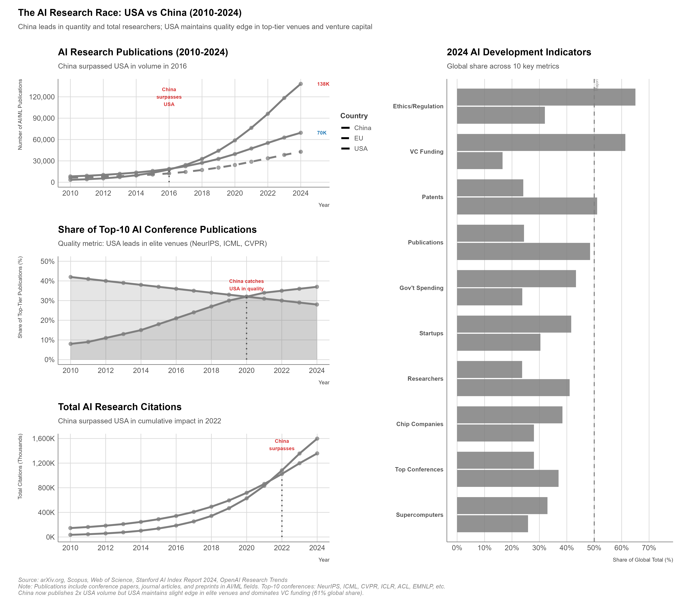
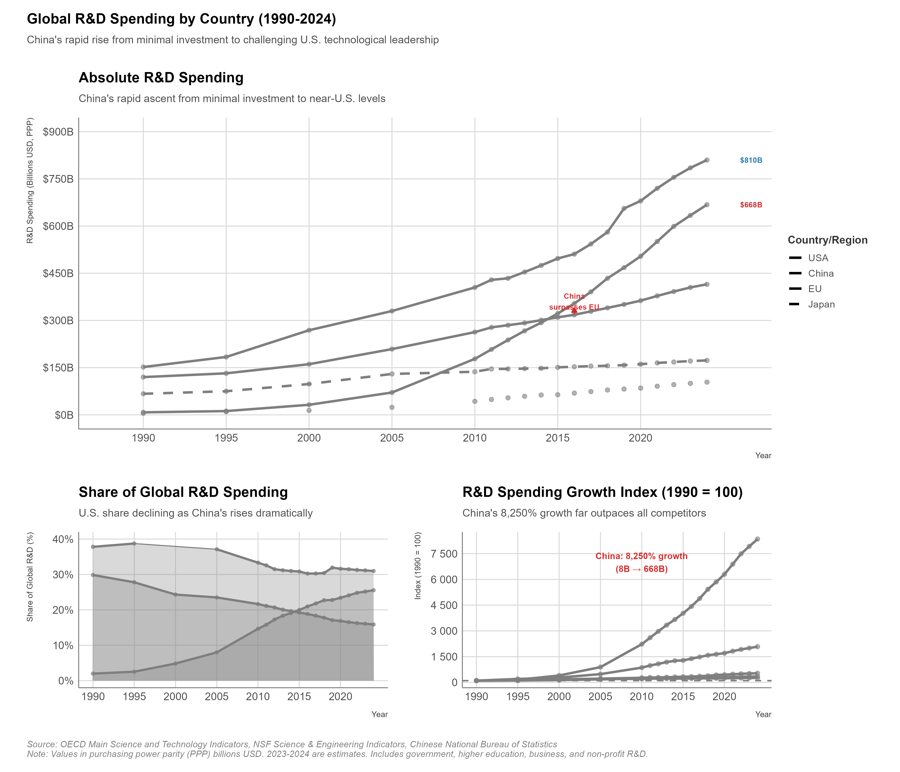

# Technology and Innovation Competition

## Executive Summary

On October 7, 2022, the Biden administration unveiled what industry analysts immediately recognized as the most comprehensive technology export controls in a generation. The new regulations banned sales of advanced semiconductors and chipmaking equipment to China, restricted American personnel from supporting Chinese semiconductor development, and extended controls to foreign-made products using American technology—through the expansive Foreign Direct Product Rule. Nvidia's A100 and H100 AI chips, essential for training cutting-edge artificial intelligence models, could no longer be shipped to Chinese customers. ASML's most advanced extreme ultraviolet (EUV) lithography machines, already blocked from Chinese buyers since 2019, now faced joined by deep ultraviolet (DUV) tools capable of producing chips below 14 nanometers. American engineers working for Chinese semiconductor firms faced career-ending choices: resign or lose U.S. export privileges. The message was unmistakable: the United States would sacrifice billions in commercial revenue to prevent China from accessing technologies deemed critical to both economic competitiveness and military superiority.

China's response came swiftly, though not through official statements. Within weeks, Chinese state media declared a "technology self-reliance" campaign, echoing rhetoric from previous embargoes but with renewed urgency and resources. The Big Fund III semiconductor investment vehicle reportedly secured over $47 billion—dwarfing previous efforts (Triolo and Greene 2023). Huawei, whose advanced chip development had been crippled by earlier U.S. restrictions, stunned analysts in August 2023 by releasing the Mate 60 Pro smartphone powered by a sophisticated 7-nanometer chip produced by SMIC (Allen and Feng 2023) (Semiconductor Manufacturing International Corporation) using older DUV equipment. While technologically inferior to TSMC's leading-edge 3nm chips and produced with reportedly low yields, the achievement demonstrated Chinese determination and capability to circumvent export controls through indigenous innovation, however costly and inefficient.

This escalating technology competition represents a fundamental shift in U.S.-China relations and global economic architecture. Here's the uncomfortable reality: unlike the Cold War technology denial regime examined in Chapter 1—where the Soviet Union largely operated in a separate technology ecosystem—contemporary competition occurs within deeply integrated global supply chains. We are trying to strangle a competitor while our own hands are around each other's throats. American semiconductor firms derive 30-40% of revenue from Chinese customers (SIA 2023). Chinese researchers publish more AI papers than American counterparts. Global telecommunications networks run on equipment from Huawei, Ericsson, Nokia, and Samsung—with market shares fluctuating based on geopolitical rather than purely economic considerations. This interdependence means that technology competition inflicts costs on restricting nations while creating powerful commercial constituencies lobbying against restrictions, yet continues to escalate as security concerns override economic logic.

This chapter examines how technology has become the central domain of U.S.-China strategic competition and explores mechanisms states employ to gain advantages, deny adversaries access, and shape global technology governance. Three core arguments organize the analysis.

First, **technology competition defines contemporary great power rivalry because technological capabilities determine both economic competitiveness and military effectiveness**. Semiconductors power everything from smartphones to fighter jets, from data centers to missile guidance systems. Artificial intelligence enables autonomous weapons, facial recognition surveillance, economic prediction, and scientific discovery. Quantum computing threatens encryption systems securing financial transactions and military communications. Biotechnology promises revolutionary healthcare but also potential bioweapons. Space capabilities provide communications, navigation, surveillance, and potential weapons platforms. The nation that leads in these technologies gains advantages across military, economic, and political domains—making technology supremacy a strategic imperative rather than a commercial preference.

Second, **dual-use technologies blur distinctions between commercial and military applications, complicating export controls and creating dilemmas about balancing economic openness with security protection**. The same AI chips training large language models for consumer applications also train military target recognition systems. Quantum communications secure civilian financial transactions and military command networks. CRISPR gene editing treats cancer and could engineer bioweapons or enhance soldiers. Hypersonic materials enable civilian spacecraft and nuclear delivery vehicles. This dual-use reality means that commercial technology trade inevitably transfers capabilities with military applications—forcing governments to choose between economic integration (allowing technology flows that benefit both commercial sectors and potential adversaries) and security (restricting flows that handicap domestic industries while delaying but not preventing adversary development).

Third, **innovation ecosystems—not just individual technologies—determine long-term competitive advantage**. China can purchase AI chips or acquire software, but building world-class AI requires research universities producing talent, venture capital funding startups, immigration policies attracting global researchers, intellectual property protection encouraging R&D investment, and cultural acceptance of entrepreneurial failure. The United States has led technological innovation not because of specific policies but because of ecosystem advantages: top research universities, deep capital markets, rule of law protecting IP, immigration drawing global talent, and a culture rewarding risk-taking. Replicating this ecosystem proves extraordinarily difficult—no planned economy has achieved sustained technological leadership, and China's state-directed approach faces inherent limitations despite massive resources. Yet American ecosystem advantages are eroding: Chinese R&D spending rivals American levels, Chinese universities increasingly produce top-tier research, and Chinese AI talent competes with Western counterparts. The competition is not just over technologies but over which system—market-driven innovation or state-directed development—proves more effective.

The chapter proceeds in four main sections. Section 1 examines **the semiconductor battleground**, analyzing October 2022 U.S. export controls, allied coordination challenges, Chinese responses, and effectiveness across the five criteria established in Chapter 1. Section 2 explores **artificial intelligence and compute**, examining AI chip restrictions, compute as strategic resource, research leadership dynamics, and military AI applications. Section 3 surveys **emerging technologies**—quantum computing and communications, space systems, and biotechnology—where competition is intensifying but outcomes remain uncertain. Section 4 analyzes **innovation ecosystems and industrial policy**, comparing U.S. and Chinese approaches to R&D spending, talent development, venture capital, and government support.

Two case studies apply the analytical framework. Case Study 1 examines the **October 2022 U.S. semiconductor export controls** in detail, assessing mechanisms, allied coordination, Chinese countermeasures, and strategic implications. Case Study 2 analyzes the **Huawei 5G competition**, tracing Huawei's rise to global leadership, U.S. restrictions and allied exclusion campaigns, European decisions, and impacts on both Huawei and broader technology competition.

Two Government Tools Boxes explain mechanisms for controlling technology. The first covers **Export Administration Regulations (EAR)**, detailing Entity List mechanics, Commerce Department authorities, license requirements, and enforcement. The second examines **CFIUS expansion** following the 2018 FIRRMA legislation, analyzing technology-focused investment screening, mandatory declarations, and coordination with allied screening mechanisms.

A Chinese Perspective Box explores Beijing's views on technology competition, shaped by experiences of Western embargoes and determination to achieve "technology sovereignty." Key concepts include **Made in China 2025** (中国制造2025, Zhōngguó Zhìzào 2025), **technology sovereignty** (科技主权, kējì zhǔquán), **indigenous innovation** (自主创新, zìzhǔ chuàngxīn), and **civil-military fusion** (军民融合, jūnmín rónghé). The box examines Chinese strategies for closing technology gaps, debates about costs of self-reliance versus efficiency, and implications for decoupling scenarios.

What's at stake is nothing less than which nation shapes the 21st century. Technological leadership has historically determined great power status—British industrial revolution dominance, American 20th century innovation supremacy—and now we face the question of whether China's state-directed approach can close gaps or whether free-market innovation ecosystems retain their edge. The U.S.-China technology competition will shape not only bilateral relations but global technology governance, alliance structures, and the extent to which technology supply chains fragment along geopolitical lines. Understanding this competition—its tools, limitations, and trajectories—is essential for policymakers navigating security imperatives and economic costs, for businesses operating in increasingly politicized technology sectors, and for researchers analyzing the evolving international order.

---

## The Semiconductor Battleground

### Why Semiconductors Define Technology Competition

Semiconductors occupy a unique position in technology competition: they are simultaneously ubiquitous (powering virtually all modern electronics), strategically critical (essential for both economic activity and military systems), and characterized by extreme concentration in production (with Taiwan's TSMC holding 90% of advanced chip manufacturing). This combination—universality, strategic importance, and geographic concentration—makes semiconductors the single most critical chokepoint in contemporary technology competition.

The strategic significance of semiconductors extends across every domain examined in this book. **Military systems** depend on advanced chips: F-35 fighter jets contain thousands of chips enabling avionics, sensors, weapons targeting, and communications. Missile guidance systems require radiation-hardened chips operating in extreme conditions. Radar and electronic warfare systems process massive data streams using specialized chips. Naval vessels depend on chips for navigation, combat systems, and command networks. The technological sophistication of modern militaries correlates directly with semiconductor capabilities—a nation lacking access to advanced chips cannot field competitive 21st-century military systems.

**Economic competitiveness** increasingly relies on semiconductors. Data centers processing cloud computing, AI training, and digital services run on cutting-edge chips—Nvidia's AI accelerators, Intel's Xeon processors, AMD's EPYC chips. Telecommunications networks depend on networking chips from Broadcom, Marvels, and others. Automotive industry transformation toward electric and autonomous vehicles requires chips for battery management, sensors (LIDAR, radar, cameras), driver assistance systems, and entertainment. Consumer electronics—smartphones, laptops, gaming systems, IoT devices—are essentially sophisticated chip delivery mechanisms. The nation or nations controlling semiconductor design and manufacturing hold competitive advantages across virtually every economic sector.

**National security** vulnerabilities emerge from semiconductor dependencies. A nation relying on foreign chip supplies faces potential cutoffs during crises—imagine U.S. military systems depending on Chinese chips during Taiwan Strait conflict, or Chinese telecommunications dependent on American chips during trade war escalation. This dependency creates what Chapter 1 termed "weaponized interdependence": whoever controls chokepoints can restrict access for strategic advantage. The semiconductor supply chain's complexity—with different stages concentrated in different countries, as examined in Chapter 2—means that multiple nations hold potential choke points: U.S. design tools (EDA software), Dutch lithography equipment (ASML), Taiwanese fabrication (TSMC), American/Japanese materials (photoresists, silicon wafers). Each represents a potential vulnerability if geopolitical alignment fractures.

The semiconductor industry also exhibits characteristics that make competition particularly intense and restrictions particularly potent. **Technology leadership** requires continuous innovation—the "Moore's Law" dynamic where chip capabilities roughly double every two years means that falling behind technologically creates gaps difficult to close. A semiconductor manufacturer two generations behind (e.g., producing 14nm chips when leaders make 3nm) faces not just quantitative disadvantage but qualitative gaps: lower performance, higher power consumption, larger size, higher costs. These gaps compound: inferior chips mean inferior end products (slower computers, shorter battery life, less AI capability), reducing competitiveness and revenues, limiting R&D investment, widening technological gaps further.

**Capital intensity** creates natural barriers to entry. Building a cutting-edge semiconductor fabrication facility costs $15-20 billion and requires 3-5 years. A single EUV lithography machine costs $150-200 million, and fabs need dozens. Annual R&D spending for leading firms (TSMC, Samsung, Intel) exceeds $15-20 billion each. This capital intensity means that semiconductor leadership cannot be achieved through incremental investment—it requires sustained, massive commitments over decades. China's semiconductor investment, while enormous in absolute terms ($100+ billion across Big Fund I, II, and III), must compete with private sector investment by Samsung, TSMC, Intel, and others that collectively exceeds this annually. Catching up requires not just matching current investment but exceeding it sufficiently to close gaps while leaders continue advancing.

**Supply chain complexity** examined in Chapter 2 creates multiple chokepoints across the value chain. The United States dominates chip design (Qualcomm, Nvidia, AMD, Intel, Apple) and essential design tools (Synopsys, Cadence, Mentor Graphics control 100% of EDA software). The Netherlands monopolizes extreme ultraviolet lithography through ASML—literally the only company globally producing EUV machines essential for sub-7nm chips. Japan dominates critical materials (photoresists from JSR/Tokyo Ohka, silicon wafers from Shin-Etsu/SUMCO) and production equipment (Tokyo Electron). Taiwan controls advanced fabrication through TSMC. South Korea provides memory chips (Samsung, SK Hynix). China handles much assembly and testing but controls no critical upstream stages. This distributed supply chain means that comprehensive technology denial requires coordination across multiple countries—or that any single chokepoint can halt production.

### October 2022 Export Controls: Strategic Logic and Mechanisms

The Biden administration's October 7, 2022 semiconductor export controls represented a sharp escalation in U.S.-China technology competition and a fundamental shift in export control philosophy. Previous controls targeted specific companies (Huawei, SMIC) or specific applications (military, surveillance). The October 2022 rules instead imposed broad, capability-based restrictions: **any semiconductor manufacturing equipment enabling production of chips below 14nm**, **any advanced AI chip with specified computing capabilities**, and **any American person supporting Chinese semiconductor development** faced restrictions. The breadth shocked industry: controls extended far beyond military applications to encompass nearly all advanced commercial chip development in China.

**Strategic logic** behind the controls reflected shifting U.S. government assessment of Chinese technology development and security implications. Officials concluded that previous incremental restrictions—Entity List additions targeting specific firms, licenses required for certain sales—were insufficient to prevent Chinese military modernization and potential displacement of American technology leadership. Chinese firms like SMIC, despite Entity List designation, continued advancing (achieving 7nm production demonstrated by Huawei's 2023 chip). Chinese AI development progressed despite limited access to cutting-edge chips, using older but still capable hardware and algorithmic innovations. The U.S. government, facing political pressure to address Chinese technology competition and genuinely concerned about military implications of AI and advanced computing, opted for comprehensive restrictions targeting China's semiconductor ecosystem broadly rather than specific firms.

National Security Advisor Jake Sullivan articulated the strategic shift in a September 2022 speech: moving from maintaining a "relative" advantage (keeping the United States a few years ahead) to establishing "as large a lead as possible" through denying China access to technologies that could close gaps (Sullivan 2022). The old playbook—stay ahead by running faster—gave way to a new one: stay ahead by hobbling the competition. This reflected recognition that dual-use technologies transferred for commercial purposes inevitably support military applications, and that allowing Chinese semiconductor self-sufficiency would empower potential adversary across military and economic domains. Whether this logic succeeds depends on effectiveness across the five criteria examined in Section 1.3, but the strategic intent was clear: accept commercial costs to prevent Chinese technology development.

**Mechanisms** employed multiple complementary tools to restrict access:

**Advanced chip export restrictions** prohibited sales of AI chips exceeding specified performance thresholds to Chinese customers. Nvidia's A100 and H100 chips, dominating AI training and inference markets, immediately fell under restrictions. AMD's MI250 accelerators faced similar bans. These restrictions targeted capability rather than specific companies—any chip meeting performance criteria faced controls. Nvidia attempted to develop "China-compliant" chips (A800, H800) with marginally reduced specifications designed to evade controls while maintaining commercial viability. The Commerce Department responded by tightening specifications in October 2023 updates, closing loopholes and banning the compliant variants. This cat-and-mouse game illustrated both industry resistance to lost revenue and government determination to enforce comprehensive restrictions.

**Semiconductor manufacturing equipment controls** banned sales of equipment capable of producing chips below 14nm to Chinese fabrication facilities. This targeted deep ultraviolet (DUV) lithography tools from ASML (Netherlands), etching and deposition equipment from Lam Research and Applied Materials (United States), and metrology tools from KLA (United States). Previous restrictions had blocked EUV machines (only from ASML) essential for sub-7nm production, but DUV tools could produce 14nm and 7nm chips through multiple patterning—technically challenging but feasible. The October 2022 rules closed this gap, aiming to freeze Chinese semiconductor manufacturing at trailing-edge nodes. ASML faced particular pressure: while its EUV machines were already blocked, its DUV tools (Twinscan NXT) were profitable exports to China. Dutch government implementation of controls faced industry lobbying and political resistance, though ultimately complied following U.S. pressure.

**U.S. person restrictions** prohibited American citizens and permanent residents from supporting Chinese semiconductor development without Commerce Department authorization. This provision shocked industry: American engineers working for Chinese firms (including SMIC, YMTC, Yangtze Memory Technologies) faced immediate job losses or forced resignations. Senior technologists, many ethnic Chinese who had studied in the United States and worked for American firms before returning to China, found expertise suddenly prohibited. The restrictions targeted human capital transfer—recognizing that equipment alone is insufficient without expertise to operate it effectively. This "brain drain" reversal attempted to halt technology transfer through personnel, though legality faced challenges (restricting Americans' employment based on foreign employer's nationality raises constitutional questions) and effectiveness remains uncertain (non-American engineers could substitute, though with lower expertise).

**Foreign Direct Product Rule (FDPR) extension** expanded U.S. jurisdiction extraterritorially to cover foreign-made products incorporating American technology. The FDPR, previously applied to Huawei specifically, became general policy: any semiconductor manufacturing equipment made anywhere globally using American technology (software, components, technical data) above de minimis thresholds required U.S. export licenses for sales to Chinese semiconductor fabs. This provision asserted that American technology embedded in foreign products grants U.S. government veto power over sales—a controversial claim of jurisdiction that allied governments privately resented but largely accepted given dependence on U.S. semiconductor technology and markets. The FDPR's effectiveness depends on American content in foreign equipment: if non-U.S. suppliers can substitute American components, the rule's leverage diminishes; if American technology proves irreplaceable, the rule grants comprehensive control.

### Allied Coordination: Success and Tensions

U.S. export controls on semiconductors cannot succeed unilaterally—equipment chokepoints reside in Netherlands (ASML lithography), Japan (Tokyo Electron equipment, JSR photoresists), and South Korea (memory chips, production expertise). Allied cooperation is essential, yet involves tensions between American security imperatives and allied commercial interests.

**Netherlands** became critical because ASML monopolizes EUV lithography and produces the most advanced DUV tools. The Dutch government initially resisted U.S. pressure for comprehensive DUV restrictions, citing economic costs (China represented ASML's largest market outside Taiwan/South Korea, generating billions in revenue) and legal complexities (Dutch export control law requires independent assessment of military applications, not blanket restrictions based on buyer nationality). Extended negotiations involving U.S. Commerce Secretary Raimondo, Dutch Prime Minister Rutte, and ASML executives eventually produced January 2023 Dutch export control expansion covering advanced DUV tools. However, restrictions proved narrower than U.S. officials desired: only the most advanced DUV machines (capable of producing sub-14nm chips through multiple patterning) faced restrictions, while less advanced DUV tools remained exportable. This reflected Dutch compromise: cooperate sufficiently to maintain U.S. alliance while limiting economic damage to ASML.

**Japan** faced similar pressures across multiple companies. Tokyo Electron, Japan's leading semiconductor equipment manufacturer, derives substantial revenue from Chinese sales. JSR and Tokyo Ohka supply photoresists critical for lithography—materials where Japanese firms dominate globally. Japanese government implemented export controls in March 2023 covering 23 categories of advanced semiconductor equipment, aligning with U.S. and Dutch restrictions. However, Japanese controls similarly reflected compromise: targeting equipment for leading-edge chips while allowing continued sales of mature-node equipment. Japanese officials emphasized alignment with Wassenaar Arrangement multilateral export control frameworks rather than U.S. unilateral demands, preserving legal distinction even while substantively cooperating.

**South Korea** presented unique complications. Samsung and SK Hynix, Korea's semiconductor champions, operate fabrication facilities in China producing memory chips (DRAM, NAND flash). U.S. restrictions threatened these operations: if Samsung and SK Hynix couldn't import American equipment or receive support from American engineers, their Chinese fabs would struggle. The U.S. government granted exemptions allowing continued American support for South Korean firms' Chinese operations—exemptions criticized as undermining control effectiveness but deemed necessary to preserve South Korean cooperation. Korean officials faced difficult balance: maintaining alignment with the United States (critical security ally) while protecting Samsung and SK Hynix commercial interests in China (major market).

**Effectiveness of allied coordination** remains incomplete. While Netherlands, Japan, and South Korea implemented restrictions, gaps exist. Chinese firms can still purchase some advanced equipment, obtain maintenance and upgrades for previously purchased equipment (restrictions don't retroactively block support for installed machines), and potentially source from third-country suppliers (though few alternatives exist for critical tools). Allied governments interpret restrictions narrowly, frustrating U.S. officials seeking comprehensive prohibitions. Commercial lobbying pressures allied governments to minimize restrictions—ASML, Tokyo Electron, and equipment manufacturers argue that lost Chinese revenue reduces R&D budgets for future innovation, potentially undermining long-term competitiveness.

The fundamental tension is that **allied governments share U.S. concerns about Chinese military modernization but prioritize commercial interests more highly and resist American extraterritorial jurisdiction**. Dutch, Japanese, and Korean perspectives view U.S. technology restrictions as partly motivated by commercial competitiveness (protecting American chip firms against Chinese competition) rather than purely security concerns. This creates suspicion that the United States seeks allied cooperation in restricting Chinese technology access while American firms simultaneously gain market share from European and Asian competitors handicapped by lost Chinese sales.

Future coordination faces challenges. If Chinese technology development continues despite restrictions, allied governments may conclude that accepting economic costs for ineffective restrictions is poor policy. If restrictions prove effective but Chinese retaliation targets allied exports (China restricting rare earth exports to Japan, agricultural purchases from Netherlands, or Samsung market access), allied political support for restrictions could erode. Sustaining coordinated export controls requires balancing security imperatives against commercial pressures—a balance that shifts with political leadership changes, economic conditions, and effectiveness assessment.

### Chinese Responses: Adaptation, Circumvention, and Indigenous Development

China's responses to semiconductor export controls operate across multiple dimensions: immediate adaptations to restrictions, attempts to circumvent controls, long-term indigenous development, and potential retaliation. Understanding these responses is essential for assessing restriction effectiveness.

**Immediate adaptations** involve working within constraints. Chinese AI developers facing restrictions on Nvidia A100/H100 chips shifted to alternative approaches: using older but still capable chips (Nvidia V100, available before restrictions), clustering many weaker chips to approximate fewer powerful chips (less efficient but functional), optimizing algorithms to reduce computing requirements (achieving similar AI performance with less hardware), and purchasing restricted chips through third-country intermediaries or smuggling (explicitly prohibited but difficult to prevent entirely). Baidu, Alibaba, Tencent, and other Chinese tech giants stockpiled AI chips before restrictions took effect, providing buffer capacity for near-term development. These adaptations mean that restrictions slow but don't halt Chinese AI progress—developers adjust to constrained resources rather than abandoning efforts.

**Circumvention attempts** exploit loopholes and enforcement limitations. Chinese shell companies established in third countries (Singapore, Malaysia, Taiwan) purchase restricted equipment and chips, claiming end-use in permitted locations before diverting to China. Equipment manufacturers' foreign subsidiaries sell to Chinese customers with technical modifications claimed to fall outside control specifications. Individual smugglers purchase chips in small quantities (below regulatory thresholds) and aggregate shipments. U.S. and allied customs enforcement struggles with verification—distinguishing permitted sales (Chinese consumer electronics manufacturing using mature-node chips) from prohibited applications (advanced semiconductor development) requires technical expertise and investigation resources that overwhelm enforcement agencies. Commerce Department investigations and prosecutions send signals but cannot halt all circumvention.

**Indigenous development** represents China's long-term strategy and the ultimate determinant of restriction effectiveness. Chinese government, recognizing that dependency on foreign technology creates vulnerability, has poured resources into domestic semiconductor capabilities across the value chain:

**Semiconductor fabrication** investments aim to build SMIC and other Chinese foundries capable of producing advanced chips without foreign equipment. SMIC's achievement of 7nm production demonstrated progress: using older DUV tools and advanced multiple patterning techniques (industry estimates suggest 5+ masks per layer, far more complex than TSMC's EUV process), SMIC produced Huawei's Kirin 9000s chip powering the Mate 60 Pro smartphone released August 2023. This shocked American officials who believed Chinese firms lacked technical capacity for sub-10nm production without EUV machines. However, the achievement comes with caveats: yields reportedly below 50% (compared to TSMC's 90%+ yields), meaning high costs and limited production volumes; process instability requiring extensive trial-and-error; technological ceiling around 5-7nm without EUV (further miniaturization requires extreme ultraviolet lithography China cannot access); and performance gaps versus TSMC's 3nm chips (Huawei's chip less power-efficient and lower-performing than Apple's latest processors using TSMC 3nm).

**Equipment development** targets building Chinese alternatives to ASML, Applied Materials, Lam Research, and Tokyo Electron. Shanghai Micro Electronics Equipment (SMEE) is developing DUV lithography tools, but current capabilities lag ASML by 10-15 years (SMEE's best machines comparable to ASML's tools from 2010). AMEC, Naura, and other Chinese equipment firms produce etching, deposition, and metrology tools, but achieve specifications suitable for 14nm+ nodes rather than cutting-edge <7nm. Breakthroughs in EUV lithography—requiring extraordinary precision in optical systems, high-power laser technology, and ultra-clean manufacturing—appear beyond Chinese capabilities for the foreseeable future despite substantial R&D investment. Equipment development is the hardest component: while semiconductor design can potentially achieve innovation through talent and software, equipment manufacturing requires decades of accumulated expertise in precision engineering, materials science, and production processes difficult to replicate quickly.

**Materials and chemicals** development addresses dependencies on Japanese photoresists, American specialty gases, and other inputs. Chinese firms have achieved progress in some materials (achieving acceptable photoresist quality for mature nodes), but cutting-edge materials remain dependent on Japanese suppliers. This dependence creates additional chokepoints beyond equipment—even if China built indigenous fabrication equipment, reliance on foreign materials leaves vulnerability.

**Design tools** represent another critical gap. Synopsys, Cadence, and Mentor Graphics (Siemens EDA) control 100% of Electronic Design Automation software essential for designing complex chips. U.S. restrictions prohibit sales of EDA tool updates to Chinese firms, freezing their capabilities at older software versions. Chinese EDA companies exist but produce tools suitable for simple chips, not cutting-edge designs. Building world-class EDA software requires decades of development—accumulated libraries, verification tools, and optimization algorithms cannot be replicated quickly. This dependency means that even if China achieved fabrication independence, design tool limitations would constrain capabilities.

**Talent development** involves training engineers, physicists, chemists, and technicians with expertise in semiconductor development. China produces more STEM graduates than any country globally and has repatriated many ethnic Chinese engineers who studied and worked abroad. However, leading-edge semiconductor development requires not just quantity but quality: tacit knowledge from operating cutting-edge fabs, experience troubleshooting complex manufacturing processes, and creative problem-solving for unprecedented challenges. U.S. restrictions on American personnel supporting Chinese semiconductor work aim to cut off this expertise transfer, though non-American engineers (from Taiwan, South Korea, Europe) can substitute with varying effectiveness.

### Effectiveness Assessment: Five Criteria Analysis

Applying the five effectiveness criteria from Chapter 1 to semiconductor export controls reveals mixed results: controls impose significant costs and delays but face limitations in achieving stated objectives.

**Target Compliance:** Moderate effectiveness. Chinese firms cannot legally purchase restricted chips and equipment from American, Dutch, or Japanese suppliers, forcing either compliance or circumvention. Major firms (SMIC, Huawei) largely comply with explicit restrictions, avoiding sanctions risk, though aggressive exploitation of loopholes continues. Smaller firms and research institutes pursue circumvention more aggressively. Overall, restrictions force behavioral changes (stockpiling permitted equipment, shifting to indigenous development, purchasing through intermediaries) rather than full compliance.

**Capability Degradation:** Moderate to high short-term effectiveness, uncertain long-term. Chinese semiconductor capabilities face immediate constraints: lack of EUV machines prevents sub-5nm production, restricted AI chips slow large-scale model training, loss of American engineering expertise hampers troubleshooting complex processes. SMIC's 7nm achievement demonstrates technical capability but economic unviability (low yields, high costs). Chinese firms are 3-5 years behind TSMC/Samsung in fabrication capabilities and lack clear path to close gaps without accessing restricted equipment. However, long-term degradation depends on whether indigenous development succeeds—a question with enormous uncertainty. If China achieves equipment breakthroughs (unlikely but not impossible), degradation proves temporary; if equipment gaps persist (more likely), Chinese semiconductor capabilities remain constrained at trailing-edge nodes indefinitely.

**Cost Imposition:** High effectiveness. Restrictions impose multiple costs on China: lost revenue for Chinese firms unable to compete in advanced markets, massive R&D investment required for indigenous development (hundreds of billions with uncertain payoff), economic inefficiency from using inferior domestic alternatives (SMIC's low-yield 7nm production far costlier than TSMC), and opportunity costs from engineers and resources devoted to duplicating foreign capabilities rather than advancing beyond them. Chinese semiconductor industry estimates suggest restrictions will reduce Chinese production by tens of billions annually and delay advanced chip availability by years. Whether these costs prove sustainable (China accepts costs to achieve independence) or motivate policy changes remains to be seen.

**Sustainability:** Moderate concerns. U.S. restrictions require allied cooperation, which faces commercial pressures and political shifts. If Republican or Democratic administrations in allied countries prioritize economic growth over strategic competition with China, export control cooperation could erode. Chinese retaliation targeting allied exports creates political constituencies opposed to restrictions. However, security concerns about Chinese military modernization and technology competition provide countervailing political support. Sustainability also depends on restriction effectiveness: if controls successfully constrain Chinese capabilities, political support for continuing them may strengthen; if Chinese breakthroughs render restrictions ineffective, sustaining them becomes politically difficult.

**Collateral Damage:** Moderate to high. American semiconductor equipment and chip firms lose tens of billions in annual Chinese revenue—Nvidia alone estimates $7-10 billion in lost AI chip sales (Del Rey 2023). These revenue losses reduce R&D budgets, potentially undermining long-term American innovation leadership. Allied equipment manufacturers (ASML, Tokyo Electron) similarly lose major revenue sources. American semiconductor firms employ tens of thousands of workers whose jobs depend partly on Chinese sales—lost revenue creates political pressure against restrictions. Scientists and researchers face constraints on collaboration with Chinese colleagues, slowing scientific progress. Global supply chain disruption from semiconductor restrictions creates ripple effects across industries dependent on chips. However, security considerations and long-term competitiveness concerns outweigh commercial costs in U.S. government calculations—accepting near-term collateral damage to prevent long-term strategic disadvantage.

### Strategic Implications: The Semiconductor Decoupling Dynamic

Semiconductor export controls have initiated a decoupling process with profound strategic implications extending far beyond chips themselves. This decoupling creates several dynamics:

**Technology ecosystem fragmentation:** Global semiconductor supply chains are splitting along geopolitical lines. Chinese firms increasingly source equipment, materials, and services from Chinese or non-aligned suppliers, building parallel but inferior ecosystem. Western firms consolidate supply chains among allies (U.S.-Japan-Netherlands-South Korea-Taiwan), reducing China exposure. This fragmentation creates inefficiencies (duplicated R&D, smaller economies of scale) but increases resilience (reduced mutual vulnerability).

**Allied coordination requirements:** Effective semiconductor restrictions require unprecedented allied cooperation on export controls. This cooperation extends beyond semiconductors to other critical technologies (quantum, AI, biotech), creating technology alliance structures paralleling military alliances. The U.S.-Japan-Netherlands semiconductor equipment coordination may presage broader "Tech 10" or similar groupings coordinating technology policies. However, maintaining cooperation faces challenges from diverging commercial interests and political changes.

**Chinese determination for self-sufficiency:** Export controls have convinced Chinese leadership that dependency on Western technology creates unacceptable vulnerability. This drives enormous investment in indigenous development regardless of economic efficiency. China's semiconductor self-sufficiency pursuit may sacrifice economic growth for strategic autonomy—a calculation Western market economies rarely make. The question is whether China's state-directed approach can achieve technological leadership or whether innovation ecosystems favoring market-driven entrepreneurship retain advantages.

**Race to technological leadership:** Semiconductor competition catalyzes broader technology race. Both the United States and China are massively increasing R&D spending, industrial policy support, and talent development across semiconductors, AI, quantum computing, and emerging technologies. This spending acceleration could drive innovation beneficial for humanity (medical advances, climate technologies, scientific breakthroughs) or waste resources on duplicated efforts and strategic competition. Historical parallels (Space Race during Cold War drove innovation but at enormous cost) suggest both outcomes are possible.

**Military-technological escalation risks:** As civilian technology gaps widen between China and the West, Chinese military modernization may plateau, potentially constraining Chinese regional ambitions. Alternatively, constraints could motivate Chinese military investment in asymmetric technologies (hypersonics, AI-powered autonomous systems, cyber capabilities) that don't require cutting-edge semiconductors. U.S. military advantages depend not just on restricting Chinese chip access but on sustaining American innovation—a challenge requiring continued R&D investment, immigration enabling talent acquisition, and education systems producing engineers.

The semiconductor battleground thus represents the sharpest edge of U.S.-China strategic competition, combining economic stakes (hundreds of billions in commerce), security imperatives (military modernization dependencies), and long-term competitiveness (technological leadership determining great power status). How this competition evolves—whether restrictions successfully constrain Chinese capabilities, whether Chinese indigenous development succeeds, whether allied coordination sustains, and whether collateral damage proves acceptable—will profoundly shape the 21st-century international order. The next sections examine how similar competitive dynamics operate across artificial intelligence, emerging technologies, and innovation ecosystems.

---

## Artificial Intelligence and Compute - The New Strategic Resource

### AI as Dual-Use Technology: From Language Models to Weapons Systems

Artificial intelligence has emerged as the defining technology of the 21st century, with applications spanning from consumer services (ChatGPT, image generation, recommendation algorithms) to military systems (autonomous weapons, target recognition, intelligence analysis). This dual-use character—where the same technology enables both beneficial civilian applications and potentially destabilizing military capabilities—creates profound challenges for export controls and technology competition.

Modern AI, particularly large language models and deep learning systems, depends critically on **compute**—massive computational power for training and running models. Training GPT-4, Claude, or comparable frontier models requires thousands of specialized AI accelerator chips running for months, consuming tens of millions of dollars in electricity and computing costs. If oil was the strategic resource of the 20th century, compute may be the strategic resource of the 21st. Access to advanced AI chips determines which nations, companies, and research institutions can develop cutting-edge AI. Unlike previous technologies where expertise and algorithms dominated, contemporary AI transforms compute into a bottleneck—those controlling AI chip supply can influence global AI development trajectories.

**Military AI applications** demonstrate why governments treat AI as strategic technology requiring restriction. Autonomous weapons systems—drones that identify and engage targets without human intervention—depend on AI vision systems and decision-making algorithms trained on vast datasets using powerful chips. China has publicly showcased drone swarms capable of coordinated action, reportedly using AI algorithms developed by Chinese tech firms. Target recognition systems enabling missiles to distinguish military from civilian targets, evade countermeasures, and adapt to battlefield conditions require AI trained on extensive imagery and sensor data. Intelligence analysis leveraging AI to process satellite imagery, communications intercepts, and open-source data enables militaries to identify patterns, predict adversary actions, and optimize resource allocation. Cyber operations increasingly employ AI to identify vulnerabilities, craft phishing campaigns, and automate intrusions at scale beyond human operators' capacity.

The U.S. military's Project Maven, initiated in 2017, exemplifies military AI adoption: using machine learning to analyze drone footage (Shane and Wakabayashi 2018), identifying objects and patterns faster and more accurately than human analysts. The project sparked controversy when Google employees protested company participation, ultimately leading Google to withdraw—illustrating tensions between commercial AI development and military applications. However, other firms (Palantir, Anduril, Shield AI, and increasingly Microsoft, Amazon, and Oracle) embrace defense AI contracts, recognizing strategic importance and commercial opportunities. China faces no similar corporate resistance: civil-military fusion doctrine explicitly mandates private sector support for military AI development, with Baidu, Alibaba, Tencent, SenseTime, and others actively collaborating with People's Liberation Army on AI systems.

**Surveillance and social control** applications demonstrate AI's political implications. China's surveillance state leverages AI facial recognition (SenseTime, Megvii, Hikvision systems) to monitor populations, track dissidents, and enforce social control in Xinjiang and beyond (Mozur 2019). These systems depend on AI chips for real-time processing of millions of video streams, matching faces against databases, and identifying "suspicious" behaviors. Western governments condemn such applications while developing their own surveillance AI (for border control, counterterrorism, and law enforcement), creating hypocrisies and dilemmas about AI governance. Export controls on AI chips partly aim to prevent empowering authoritarian surveillance, though effectiveness faces limitations: older chips (A100's predecessor V100) retain substantial surveillance capabilities, and algorithms continue improving efficiency even with constrained hardware.

**Economic and scientific applications** explain why AI restrictions face commercial resistance and potential long-term costs. AI powers drug discovery (predicting molecular interactions, identifying potential treatments), climate modeling (simulating atmospheric dynamics with unprecedented resolution), materials science (discovering new compounds for batteries, catalysts, semiconductors), and financial markets (algorithmic trading, risk assessment, fraud detection). Restricting AI chip exports to China means cutting Chinese researchers off from frontier AI capabilities—potentially slowing scientific collaboration and reducing global innovation even while protecting American leads. American pharmaceutical companies collaborating with Chinese research institutions face disruptions. Climate research requiring Chinese participation (China operates major climate models and represents critical data source) encounters obstacles. These costs don't disappear simply because they serve long-term strategic interests—they represent genuine tradeoffs requiring justification.

### The October 2022 AI Chip Restrictions: Logic and Implementation

AI chip restrictions announced alongside semiconductor controls (Section 1.2) targeted Chinese access to computing power required for frontier AI development. The logic was straightforward: if training cutting-edge AI models requires thousands of high-performance chips, restricting access to those chips constrains Chinese AI capabilities, maintaining American advantages in both military and commercial AI applications.

**Specific restrictions** focused on chip capabilities rather than applications. The October 2022 rules prohibited exports to China of chips exceeding specified thresholds of computing performance and chip-to-chip interconnect bandwidth:

- **Compute density threshold:** 600 trillion operations per second (TOPS) for INT8 operations and 300 teraflops (TFLOPS) for FP16/FP32
- **Interconnect bandwidth threshold:** 600 gigabytes per second (GB/s)

These specifications targeted Nvidia's flagship AI chips: the A100 (released 2020) providing 1,200 GB/s interconnect bandwidth and 624 teraflops FP16 performance, and H100 (released 2022) with even higher specifications. AMD's MI250 accelerators faced similar restrictions. The thresholds aimed to prohibit chips optimal for large-scale AI training while potentially permitting less capable chips for inference (running trained models) and other applications.

Nvidia's response demonstrated commercial creativity in circumventing restrictions while technically complying. Within weeks, Nvidia announced "China-compliant" chips: the A800 (modified A100) and H800 (modified H100) with interconnect bandwidth reduced to 400 GB/s—just below the 600 GB/s threshold—while maintaining computing performance. These chips sacrificed some efficiency in distributed training (where multiple chips must exchange data rapidly) but retained substantial capabilities for AI development. Nvidia could legally export these variants, preserving billions in Chinese revenue while ostensibly respecting control requirements.

The Commerce Department's October 2023 update closed these loopholes, revising specifications to ban the compliant variants. New rules set lower thresholds and employed "total processing performance" metrics incorporating both compute density and interconnect bandwidth, preventing specification gaming. Nvidia's ability to sell AI chips to China was effectively eliminated, forcing Chinese customers to either stockpile older chips (V100, T4), use clustered weaker chips with performance penalties, or develop indigenous alternatives (discussed in Section 2.4).

**Allied coordination** for AI chip restrictions faces less complexity than semiconductor equipment controls because AI chips primarily originate from U.S. companies (Nvidia, AMD, Intel). However, ensuring Chinese customers don't obtain chips through third-country intermediaries requires export compliance and customs enforcement. Reports of Nvidia chips reaching China through Singapore and Hong Kong shell companies, third-country procurement agents, and individual smuggling highlight enforcement challenges. The United States pressured Singapore and Hong Kong to tighten export controls and investigate suspicious transactions, with mixed success. Systematic circumvention proves difficult at scale (Chinese AI firms need thousands or tens of thousands of chips, not ones or tens smuggled individually), but marginal circumvention continues.

### AI Research Leadership: Publications, Patents, and Talent

<figure>
  
  <figcaption>AI Research Output and Impact by Country</figcaption>
</figure>

AI competition extends beyond chips to research capabilities: which countries publish cutting-edge research, file foundational patents, attract and develop top talent, and translate research into commercial products and military applications. Metrics reveal complex dynamics where the United States and China lead in different dimensions while Europe falls behind.

**Research publications** show China overtaking the United States in quantity while competing in quality. According to Stanford's AI Index and analysis of Scopus publication databases, China publishes more AI/ML research papers annually than the United States (approximately 40-45% of global AI publications versus 10-15% for the U.S.). However, citation metrics—measuring research influence—show American papers cited more frequently on average, suggesting higher impact. The most-cited individual papers and breakthrough publications disproportionately originate from American institutions (Stanford, MIT, Berkeley, OpenAI, Google Research, Microsoft Research) rather than Chinese universities and firms. This pattern suggests Chinese research emphasizes quantity and incremental advances while American research produces more foundational breakthroughs—though China's quality is improving rapidly, with Tsinghua, Peking University, and firms like Baidu and Alibaba publishing increasingly influential work.

**Patent filings** in AI-related technologies show similar patterns. WIPO data indicates Chinese entities file more AI patents than American counterparts, particularly in applications (computer vision, natural language processing, recommendation systems). American firms file more foundational algorithm and architecture patents. Patent quality assessments (citations, legal scope, commercial value) generally favor American patents, though measuring quality proves methodologically challenging and controversial. Patent filings also reveal different focuses: Chinese patents emphasize applications (surveillance, e-commerce, social media), American patents cover broader algorithmic innovations and AI chips/hardware.

**Talent development and circulation** represent critical dimensions where the United States has historically held advantages but faces erosion. American universities dominate global AI education and research: Stanford, MIT, Carnegie Mellon, Berkeley, and others train both American and international students (including many Chinese) who disproportionately contribute to AI advances. Immigration historically allowed the United States to retain top foreign talent—Chinese, Indian, European researchers staying in America after PhDs to join Google, Microsoft, OpenAI, or start companies. This "brain gain" amplified American AI capabilities beyond domestic population proportions.

Recent dynamics threaten American advantages. Increasingly, Chinese AI researchers return to China after U.S. education, attracted by generous compensation, research funding, and opportunities to lead large teams. Alibaba, Baidu, Tencent, ByteDance, and other firms offer competitive salaries and access to massive datasets (hundreds of millions of Chinese users) unavailable to Western researchers. Chinese government funding for AI research rivals or exceeds American levels (though measuring precisely proves difficult due to definitional differences and reporting opacity). Geopolitical tensions, visa restrictions following Trump administration policies, and COVID-19 pandemic disruptions reduced Chinese student numbers in U.S. universities—potentially cutting future American access to Chinese AI talent.

The United States also develops domestic talent, though shortfalls exist. Computer science enrollments at American universities have surged, but demand for AI expertise exceeds supply, driving fierce corporate competition for talent (six-figure salaries for new PhDs, million-dollar compensation for experienced researchers). Many top American students pursue lucrative industry careers rather than academic research, potentially reducing long-term foundational research. Educational outcomes show the United States producing fewer STEM graduates per capita than China, South Korea, and several European nations, though American education quality at top institutions remains unmatched globally.

**Transfer between research and application** represents another dimension where American ecosystem advantages manifest. Silicon Valley's venture capital, startup culture, and major tech firms excel at commercializing AI research: OpenAI transformed GPT research into ChatGPT commercial product within months, Google commercialized transformer architectures into search and advertising improvements, and countless startups leverage academic research for specialized applications. China's AI commercialization proceeds rapidly (TikTok's recommendation algorithms, Alibaba's logistics optimization, SenseTime's surveillance systems), but ecosystem differences create advantages for American translation of research to products, particularly in global markets where Chinese firms face regulatory and political obstacles (TikTok bans, Huawei restrictions, data localization requirements limiting Chinese cloud services).

### Chinese AI Development: Constrained but Not Halted

U.S. restrictions on AI chips aim to constrain Chinese AI development, yet Chinese capabilities continue advancing through adaptations, stockpiling, algorithmic innovations, and indigenous chip development. Assessing whether restrictions achieve meaningful delays or merely inconvenience Chinese developers requires examining specific Chinese responses and their effectiveness.

**Stockpiling and hoarding** before and immediately after October 2022 restrictions allowed Chinese firms to accumulate substantial AI chip inventories. Alibaba, Tencent, Baidu, ByteDance, and others reportedly purchased tens of thousands of A100 and H100 chips before restrictions took effect, spending billions to secure near-term supply. These stockpiles enable continued frontier AI development for 2-3 years, during which time Chinese firms can train large models, deploy AI systems, and potentially develop indigenous alternatives. Stockpiling success demonstrates export control challenges: restrictions announced with insufficient lead time (industry knew restrictions were coming months before implementation) allow targets to adapt.

**Algorithmic innovations** reduce compute requirements, allowing Chinese researchers to achieve competitive AI performance with constrained hardware. Techniques include:

- **Model compression and quantization:** Reducing model precision from 32-bit to 8-bit or even 4-bit operations dramatically cuts computing requirements with minimal accuracy loss for many applications.
- **Efficient architectures:** Developing models requiring fewer parameters and operations to achieve equivalent performance—e.g., China's GLM-130B model claims performance comparable to OpenAI's GPT-3 (175 billion parameters) while using only 130 billion parameters.
- **Training optimizations:** Techniques like mixed-precision training, gradient checkpointing, and efficient parallelization reduce chip requirements for given model sizes.
- **Specialized models:** Rather than pursuing general-purpose foundation models like GPT-4, developing specialized models for specific applications (language translation, image recognition, recommendation systems) that require less compute.

These innovations mean Chinese AI development continues even with chip constraints—though potentially falling behind American frontier models that leverage unrestricted access to thousands of H100 chips. Chinese researchers publish extensively on efficient AI, potentially sharing advances globally and benefiting non-Chinese researchers—an irony where restrictions motivate innovation that diffuses beyond the target.

**Indigenous AI chip development** pursues Chinese alternatives to Nvidia and AMD accelerators. Huawei's Ascend 910 chip, developed before U.S. restrictions intensified, provides AI training capabilities comparable to Nvidia's V100 (pre-A100 generation). Cambricon, a Chinese AI chip startup, produces training and inference accelerators used by Chinese firms and government agencies. These chips lag Nvidia's latest generations (Ascend 910 performs roughly at 2018-2019 Nvidia levels), and production faces challenges without access to TSMC or Samsung cutting-edge fabrication (Huawei's Ascend uses 7nm process, now constrained by semiconductor equipment restrictions). However, domestic AI chips partially substitute for embargoed Nvidia hardware, reducing dependence and providing fallback capacity.

**Cloud computing workarounds** allow Chinese users to access foreign AI computing resources indirectly. Chinese researchers and firms can rent AI compute from foreign cloud providers (Amazon Web Services, Google Cloud, Microsoft Azure, Oracle Cloud) operating in third countries (Singapore, Japan, Europe), ostensibly for permitted purposes while potentially using capacity for restricted AI development. Cloud providers face export compliance obligations and implement customer screening, but distinguishing permitted from prohibited AI development proves challenging. Unless the United States extends restrictions to prohibit cloud AI services to Chinese customers—an escalation with major commercial costs and enforcement complexity—cloud access provides partial circumvention route.

**Chinese AI development trajectories** remain robust despite restrictions, though likely slowed relative to counterfactual without controls. Chinese firms continue releasing competitive AI products: Baidu's ERNIE models (competitor to ChatGPT), Alibaba's Tongyi Qianwen language model, SenseTime's multimodal AI systems, and TikTok's recommendation algorithms (arguably world-leading in engagement optimization). Chinese military AI development proceeds across autonomous systems, intelligence analysis, and cyber applications. Complete Chinese AI development stagnation proves implausible; whether the United States maintains meaningful leads (2-3 years, 5 years, or permanent) remains uncertain and depends on sustained American innovation, effective enforcement of restrictions, and Chinese indigenous capabilities.

### Compute as Strategic Resource: Implications and Alternatives

The centralization of AI capability in advanced compute resources creates a new form of strategic dependency analogous to oil dependence in the 20th century. Nations lacking indigenous AI chip production or access to foreign chips face constraints on AI development, potentially falling behind economically and militarily. This dependency creates several dynamics:

**Compute inequalities** between nations and institutions shape AI development globally. Only a handful of institutions can afford frontier AI model training: OpenAI (Microsoft-backed), Google DeepMind, Meta, Anthropic (Amazon-backed), and a few others with access to tens of thousands of H100-equivalent chips and tens of millions in compute budgets. Most nations lack resources for comparable efforts—creating AI capabilities dominated by American firms and potentially China. This concentration raises governance questions: should AI development this consequential occur in private firms pursuing commercial objectives rather than democratic oversight? Concerns about AI risks (from misinformation to potential existential threats) intersect with debates about compute access and control.

**Cloud concentration** amplifies dependencies. Amazon Web Services, Microsoft Azure, and Google Cloud dominate global cloud computing, including AI-specific services providing access to GPU clusters, pre-trained models, and development tools. Firms and researchers globally depend on these platforms for AI development—creating surveillance opportunities (cloud providers can observe model training and usage patterns), control mechanisms (providers can restrict access or raise prices), and leverage for American foreign policy (government can pressure providers to cut off disfavored customers). China's pursuit of indigenous cloud infrastructure (Alibaba Cloud, Tencent Cloud, Huawei Cloud) partly reflects determination to escape this dependency, creating parallel ecosystems.

**Energy consumption** for AI training and inference creates environmental costs and practical constraints. Training large models consumes tens of gigawatt-hours of electricity—equivalent to hundreds of American households' annual consumption. Global AI expansion could consume substantial percentages of electricity production, raising costs and environmental concerns (if powered by fossil fuels) or requiring renewable energy expansion. Compute-constrained nations may face energy constraints limiting AI development even if they access chips—an underappreciated bottleneck in AI competition.

**Alternative AI paradigms** less dependent on massive compute could shift competitive dynamics. Neuromorphic computing, inspired by brain architectures, potentially enables AI with far lower energy consumption. Analog computing approaches promise specialized AI chips more efficient than digital alternatives. Quantum-inspired algorithms could achieve specific AI tasks more efficiently than conventional approaches. Breakthroughs in any of these alternatives could render current compute-centric restrictions obsolete—creating both opportunities (for countries innovating successfully) and risks (for those invested in conventional paradigms). China's substantial investment in alternative computing approaches reflects recognition that conventional paths may remain constrained by foreign dependencies.

**Diffusion of AI capabilities** complicates control strategies. As AI techniques improve, yesterday's frontier capabilities become accessible to broader audiences using less powerful chips. GPT-2, once restricted from release due to misuse concerns, runs on consumer hardware. Image generation models operate on smartphones. This diffusion means that even if the United States successfully restricts Chinese access to cutting-edge chips, previous-generation capabilities—still formidable—diffuse globally. Permanent AI advantage through export controls appears implausible; the goal becomes maintaining leads of 2-5 years rather than permanent dominance.

The AI compute competition thus represents a race where both the United States and China are sprinting, with U.S. restrictions aiming to slow Chinese progress while America maintains innovation pace. Success requires not just restricting Chinese chip access but sustaining American AI innovation through research investment, talent development, and commercial ecosystems supporting rapid deployment. Failure scenarios include both Chinese breakthroughs closing gaps despite restrictions and American complacency assuming restrictions alone suffice without continued innovation. The next section examines how similar competitive dynamics operate across other emerging technologies where leadership remains contested.

---

## Emerging Technologies - Quantum, Space, and Biotechnology

### Quantum Computing and Communications: The Next Frontier

Quantum technologies represent potentially revolutionary capabilities across computing, communications, and sensing—with implications for cryptography, drug discovery, materials science, and military systems. Unlike semiconductors and AI where current capabilities are well-established, quantum technologies remain largely in research and early development phases, making competition about future potential rather than present applications. This uncertainty creates both opportunities (countries achieving breakthroughs could leapfrog competitors) and risks (massive investments may yield limited practical returns if technical barriers prove insurmountable).

**Quantum computing** leverages quantum mechanical phenomena (superposition and entanglement) to perform certain calculations exponentially faster than classical computers. If scaled successfully, quantum computers could break current encryption systems (threatening financial transactions, military communications, diplomatic secrets), accelerate drug discovery (simulating molecular interactions beyond classical computing capacity), optimize complex systems (logistics, supply chains, financial portfolios), and advance materials science (discovering new catalysts, battery chemistries, superconductors). These applications explain why governments treat quantum computing as strategic priority requiring substantial R&D investment and potential export restrictions.

Current quantum computing capabilities remain limited. The most advanced quantum computers—Google's Sycamore, IBM's Quantum System One, and competitors—contain hundreds of qubits (quantum bits) but face challenges with error rates, coherence times (how long qubits maintain quantum states), and connectivity between qubits. These limitations mean that quantum computers cannot yet outperform classical computers for practical applications—the much-publicized "quantum supremacy" demonstrations involve contrived problems designed to favor quantum approaches rather than real-world tasks. Industry estimates suggest that practical quantum advantage for meaningful applications (beyond demonstrations) may require 1,000-10,000 logical qubits with error correction—a threshold potentially decades away.

**U.S.-China quantum computing competition** shows both countries investing heavily while following different strategies. American quantum computing efforts combine government funding (National Quantum Initiative allocating billions for research), academic research (MIT, Caltech, Berkeley, Chicago leading), and private sector innovation (Google, IBM, Microsoft, Amazon, and startups like Rigetti, IonQ, PsiQuantum). This distributed ecosystem leverages America's traditional advantages in fundamental research and commercial innovation. China's approach emphasizes concentrated state direction: large government investments in quantum research institutes, dedicated quantum computing centers, and mandates for commercial participation. Chinese researchers publish extensively on quantum computing, and institutions like University of Science and Technology of China (USTC) contribute frontier research.

**Publication metrics** show U.S.-China rough parity in quantum computing research. Both countries contribute 20-25% of global quantum computing publications, with Europe producing comparable numbers. Citation analysis suggests American and Chinese research compete in quality, with both producing influential papers and neither demonstrating clear dominance. This parity contrasts with AI (where American research leads in citations) and semiconductors (where American design dominates)—quantum computing remains sufficiently early-stage that research leadership is contested.

**Quantum communications** represents a nearer-term application with important security implications. Quantum key distribution (QKD) leverages quantum mechanics to generate encryption keys with theoretically unbreakable security—any eavesdropping attempt disturbs quantum states and reveals intrusion. China has aggressively deployed quantum communication infrastructure: the Beijing-Shanghai quantum communication trunk line (2,000+ km of fiber optic cable with QKD), the Micius quantum satellite enabling quantum key exchange between ground stations separated by thousands of kilometers, and integration of quantum communications into government and financial networks.

Chinese quantum communication leadership reflects strategic priorities and advantages. The technology requires expensive infrastructure investment (specialized fiber networks, satellite systems) where state-directed funding excels. Applications primarily serve government communications and financial security—domains where Chinese state control enables rapid deployment without requiring commercial viability. Whether quantum communications provide genuine security advantages over post-quantum cryptography (classical encryption algorithms resistant to quantum computing attacks) remains debated among cryptographers, but Chinese deployments demonstrate technical capability and willingness to invest in speculative technologies.

**U.S. quantum communication efforts** proceed more cautiously, reflecting different priorities and skepticism about quantum key distribution's practical advantages. American researchers argue that post-quantum cryptography—upgrading classical encryption algorithms to be quantum-resistant—may provide equivalent security at lower cost and greater flexibility than quantum key distribution networks. Government funding supports quantum communication research, but deployment lags Chinese efforts. This divergence creates an interesting dynamic: China leads in quantum communication infrastructure deployment, but whether this leadership translates to strategic advantages depends on future quantum computing trajectories and cryptographic developments.

**Export controls on quantum technologies** remain limited but expanding. The October 2022 semiconductor export controls included restrictions on quantum computing equipment and materials, though specific applications remain classified. Quantum computers require cryogenic cooling systems, specialized control electronics, and precision manufacturing—potential chokepoints where U.S. or allied firms dominate. However, quantum technology's early stage and distributed research ecosystem complicate export controls: much relevant knowledge resides in published research accessible globally, making restrictions on equipment only partially effective. Future export controls likely will target specific quantum computing capabilities (number of qubits, error rates, coherence times) as technology matures and military applications clarify.

### Space Systems: Dual-Use Infrastructure and Military Competition

Space capabilities have become essential infrastructure for modern economies and militaries: satellites provide communications, navigation (GPS/Galileo/BeiDou), earth observation (weather, agriculture, intelligence), and increasingly commercial services (internet connectivity, remote sensing). This dual-use character—where civilian and military space applications share common technologies—makes space a domain of intensifying strategic competition with economic and security dimensions.

**Launch capabilities** determine access to space and represent a critical technology where multiple nations compete. The United States historically dominated space launch through NASA and later commercial firms (SpaceX, Blue Origin, United Launch Alliance). SpaceX's reusable Falcon 9 rockets dramatically reduced launch costs (from $10,000-20,000 per kilogram to $2,000-3,000), enabling satellite constellation deployment and maintaining American launch dominance despite reduced government space budgets. China has rapidly expanded launch capabilities: conducting 60+ orbital launches annually (comparable to or exceeding U.S. totals), developing diverse launch vehicles, and achieving technological milestones (first landing on far side of the moon, Mars rover, space station construction). Russia retains launch capabilities but faces constraints from sanctions and reduced commercial demand. Europe (Ariane), Japan (H-IIA), and India (PSLV/GSLV) maintain independent launch capabilities serving commercial and government needs.

**Launch competition** combines commercial and strategic dimensions. Commercial launch services represent a market worth billions annually, with SpaceX dominating Western markets and China providing cost-competitive launches for developing nations' satellites (particularly Belt and Road Initiative participants). Strategic competition involves assured access to space: nations dependent on foreign launches face potential restrictions during crises. China's pursuit of independent launch capabilities reflects determination to escape dependency on Western launch services—ensuring that geopolitical tensions cannot cut off space access. U.S. restrictions on satellite exports to China (instituted in 1998 after alleged technology transfer concerns) accelerated Chinese indigenous satellite development, demonstrating how export controls motivate target self-sufficiency.

**Satellite constellations** for communications and earth observation represent another competitive domain. SpaceX's Starlink constellation (5,000+ satellites operational, plans for tens of thousands) aims to provide global internet coverage, with substantial implications for connectivity in remote and underserved areas. China's state-owned enterprises are developing competing constellations (Guowang/GW with projected 13,000 satellites) serving similar functions. European OneWeb, Amazon's Project Kuiper, and others pursue constellation strategies. These mega-constellations create both opportunities (global internet coverage, bridging digital divides) and concerns (space debris, light pollution, military applications enabling communications in denied areas, surveillance implications).

**Navigation systems** demonstrate strategic imperatives for indigenous capabilities. GPS (U.S.), GLONASS (Russia), Galileo (Europe), and BeiDou (China) provide positioning and timing services essential for civilian and military applications. Military systems depend on navigation for precision weapons, troop movements, and platform coordination—dependency on foreign navigation systems creates vulnerability if access is restricted during conflicts. China's BeiDou development, completed in 2020 with global coverage, eliminated dependency on GPS and provides services throughout Belt and Road Initiative nations. European Galileo development similarly reflected determination to escape GPS dependency. These parallel systems create redundancy beneficial for civilian users (multiple systems improve accuracy and reliability) while serving strategic autonomy objectives.

**Anti-satellite (ASAT) capabilities and space weaponization** represent the most troubling military space competition dimensions. China, Russia, and the United States have all demonstrated ASAT capabilities through kinetic interceptors (missiles destroying satellites), directed energy weapons (lasers), electronic warfare (jamming satellite communications), and cyber attacks. China's 2007 ASAT test destroyed a weather satellite, creating thousands of debris pieces that will threaten space operations for decades. Russia has tested co-orbital ASAT systems (satellites maneuvering near targets before attacking). The United States maintains ASAT capabilities while advocating for space norms prohibiting debris-generating tests. This competition creates escalation risks: space assets are vulnerable, attacks are difficult to attribute, and debris from conflicts threatens all space operations indiscriminately.

**Space domain awareness and tracking** capabilities determine which nations can monitor space activities, detect potential threats, and attribute attacks. The United States maintains the most comprehensive space surveillance network, tracking tens of thousands of objects and providing collision warnings to satellite operators globally. China is developing comparable capabilities through ground-based radars, optical telescopes, and space-based surveillance satellites. This tracking capability serves both peaceful purposes (debris avoidance, space traffic management) and military objectives (targeting adversary satellites, protecting indigenous assets).

**Export controls and space technology** face significant challenges. International Traffic in Arms Regulations (ITAR) restrict many space technologies as munitions, requiring licenses for exports and limiting international collaboration. These restrictions aim to prevent technology transfer enabling adversary space and missile capabilities but impose costs: American satellite manufacturers lost market share to European competitors less constrained by export controls, and scientific collaboration faces bureaucratic obstacles. Recent reforms have eased some restrictions while maintaining controls on sensitive technologies, but balancing commercial interests against security concerns remains contentious.

### Biotechnology and Synthetic Biology: From CRISPR to Biosecurity

Biotechnology represents perhaps the most consequential and least-governed domain of U.S.-China technology competition. Advances in gene editing (CRISPR), synthetic biology (engineering organisms for specific functions), and computational biology (AI-driven drug discovery and protein design) promise revolutionary medical treatments, agricultural improvements, and industrial applications—while raising existential biosecurity risks from engineered pathogens, genetic discrimination, and ecosystem disruption.

**CRISPR and gene editing** capabilities have rapidly diffused globally since the technology's development in 2012. The United States leads in foundational research (Jennifer Doudna and Emmanuelle Charpentier's Nobel-winning work at Berkeley and European institutions), but Chinese researchers aggressively apply CRISPR to human embryos, agricultural crops, and medical treatments with less ethical and regulatory constraint than Western counterparts. He Jiankui's 2018 creation of gene-edited human babies (attempting to confer HIV resistance) violated international norms and Chinese regulations, resulting in his imprisonment, but demonstrated Chinese willingness to push ethical boundaries in pursuit of technological firsts.

**Research leadership** in biotechnology shows complex dynamics. American institutions (NIH, major research universities, pharmaceutical companies) publish the most influential biological research, file the most biotech patents, and translate research to commercial products most effectively. China has rapidly increased biotech research output and quality: Chinese institutions now contribute 20%+ of global biological research publications, increasingly in top-tier journals. However, citation patterns and breakthrough discoveries still favor American research. The broader pattern resembles AI: China pursues rapid scaling of research quantity and practical applications while the United States maintains advantages in foundational discoveries and quality.

**BIOSECURE Act and restrictions on Chinese biotech firms** represent recent U.S. efforts to limit Chinese biotech access and address data security concerns. Legislation introduced in 2024 would prohibit U.S. government contracts with certain Chinese biotech companies (WuXi AppTec, WuXi Biologics, BGI Group, MGI Tech) and potentially restrict broader commercial relationships. The stated rationale combines data security concerns (Chinese firms processing American patients' genomic data could transfer information to Chinese government), supply chain vulnerabilities (U.S. pharmaceutical development depending on Chinese contract research organizations creates dependencies), and long-term competitiveness concerns (Chinese firms using American data and collaborations to advance while Chinese data remains inaccessible to Americans).

**WuXi AppTec and contract research organizations** exemplify Chinese biotechnology's global integration and strategic concerns. WuXi provides drug discovery and development services to Western pharmaceutical companies, handling chemistry, manufacturing, and testing—essentially outsourced R&D. Western firms benefited from cost savings and Chinese expertise, while WuXi gained access to cutting-edge research, established commercial relationships, and developed capabilities. However, this integration creates vulnerabilities: if geopolitical tensions sever relationships, Western pharmaceutical development faces disruptions from lost capacity, while China retains intellectual property and capabilities developed through collaborations. The BIOSECURE Act attempts to force decoupling before dependencies deepen further.

**BGI Group and genomic data** raises distinct concerns. BGI operates sequencing services globally, including prenatal testing for hundreds of thousands of international customers. Genomic data from these services potentially flows to Chinese databases, creating privacy concerns and strategic intelligence opportunities (population-level genetic data could inform biological weapon development targeting specific ethnicities or identifying genetic advantages for human enhancement). While evidence of malicious data use is limited, the potential for abuse motivates restrictions. BGI's response—arguing that data is anonymized, stored according to local regulations, and serves legitimate commercial purposes—highlights tensions between beneficial international scientific collaboration and legitimate security concerns.

**Synthetic biology and dual-use research** present governance challenges exceeding those of previous technologies. Synthetic biology enables engineering organisms to produce pharmaceuticals (insulin, vaccines), industrial chemicals (biofuels, materials), and agricultural improvements (nitrogen-fixing crops, pest resistance). The same techniques could engineer pathogens with enhanced transmissibility, lethality, or resistance to treatments—whether for bioweapons development or gain-of-function research investigating pandemic threats. The 2020 COVID-19 pandemic, originating in Wuhan and involving virology research at the Wuhan Institute of Virology, intensified debates about laboratory biosafety, gain-of-function research, and potential for accidental or deliberate pathogen releases.

**Export controls on biotechnology** remain limited compared to semiconductors or AI, reflecting biotechnology's distributed nature and dual-use civilian applications. Biological weapons convention prohibits offensive bioweapons development, but verification challenges and defensive research exceptions create loopholes. The Australia Group coordinates export controls on biological materials and equipment among 42 countries, but China is not a member. U.S. export controls cover specific pathogens, toxins, and specialized equipment (fermenters, freeze dryers, spray dryers) but cannot restrict widely available knowledge or commercial biological materials. The challenge is that much biotechnology requires only published knowledge, commercial equipment, and standard laboratory practices—making export controls far less effective than for capital-intensive technologies like semiconductors.

**Chinese biotechnology strategy** emphasizes scaling and commercialization: building large genomic databases (collecting data from hundreds of millions of citizens), supporting biotech firms through subsidies and government contracts, investing in agricultural biotechnology, and pursuing medical breakthroughs (gene therapy, stem cell treatments) with less regulatory constraint than the United States or Europe. This strategy leverages China's population size (enabling massive clinical studies), state-directed funding, and willingness to accept risks Western regulators prohibit. Whether Chinese biotechnology achieves leadership depends on whether scaling advantages and risk tolerance outweigh American advantages in fundamental research quality, intellectual property protection, and regulatory frameworks ensuring safety and efficacy.

**Biosecurity risks** from U.S.-China technology competition include reduced international collaboration (hampering pandemic preparedness and scientific progress), intelligence collection concerns motivating data restrictions (limiting beneficial research uses), and potential biotech decoupling (fragmenting global supply chains for pharmaceuticals and medical equipment). Unlike semiconductors where military applications are clear, biotechnology's primary applications are civilian (medicine, agriculture, environmental remediation), making restrictions costlier and ethically more fraught. Balancing open science traditions with security concerns represents an ongoing challenge without clear resolution.

---

## Innovation Ecosystems and Industrial Policy

### R&D Spending and the Race for Investment

Research and development investment determines long-term technological leadership, yet measuring and comparing R&D spending across countries involves definitional challenges, data quality concerns, and questions about efficiency versus quantity. Nevertheless, broad patterns reveal intensifying competition where Chinese R&D investment rivals or exceeds American levels while questions persist about which system generates more innovation per dollar invested.

<figure>
  
  <figcaption>R&D Spending by Country (1990-2024)</figcaption>
</figure>

**Global R&D trends** show dramatic growth and shifting geographic distribution. World Bank and OECD data indicate global R&D spending reached approximately $2.5 trillion annually (roughly 2.5% of global GDP), with growth concentrated in Asia. The United States remains the largest single-country investor at $700-750 billion annually (roughly 3.5% of U.S. GDP), but China has closed gaps dramatically: from less than 10% of U.S. R&D spending in 2000 to 85-90% by 2020, with estimates suggesting Chinese R&D spending may have surpassed American levels by 2023 in purchasing power parity terms. European Union collectively spends comparable amounts to the United States ($400-450 billion), but fragmentation across 27 member states reduces coordination and scale. Japan, South Korea, Taiwan, and other advanced economies maintain high R&D intensity (3-4% of GDP) but represent smaller absolute totals.

**U.S. R&D composition** exhibits distinctive characteristics reflecting market-driven innovation ecosystems. Private sector funding dominates, accounting for roughly 65-70% of total R&D, with government contributing 20-25% (primarily through NIH, NSF, DOD, DOE), and universities/nonprofits 5-10%. This composition means American R&D responds primarily to commercial incentives and market demands rather than state direction. Major companies (Amazon, Alphabet, Microsoft, Meta, Apple, pharmaceutical firms, aerospace manufacturers) invest tens of billions annually in R&D pursuing competitive advantages. This commercial focus creates efficiencies (market discipline eliminates unproductive research) but potentially underinvests in basic research with long payoff horizons (where commercial returns are uncertain but societal benefits potentially enormous).

**Chinese R&D composition** reverses the public-private balance: government and state-owned enterprises account for 60-70% of R&D funding, with private sector contributing the remainder. This reflects China's state-directed innovation system where government identifies strategic priorities (semiconductors, AI, quantum computing, aerospace, biotechnology) and directs resources accordingly. Major SOEs (State Grid, PetroChina, Sinopec) conduct substantial R&D as required by government mandates. Private firms (Huawei, Tencent, Alibaba, BYD) invest heavily in R&D but often in coordination with state objectives. This composition enables rapid scaling of investment in priority areas but risks inefficiency from political interference, misallocation to unproductive projects, and lack of market discipline.

**Measuring R&D effectiveness** proves challenging. Patent filings, publication counts, and citation metrics provide partial indicators but don't capture commercial impact or societal value. American R&D arguably demonstrates higher efficiency: U.S. firms commercialize innovations rapidly (Google's search algorithms, Apple's iPhone, Moderna's mRNA vaccines), translate research to profitable products, and achieve global market leadership across numerous sectors. Chinese R&D shows increasing effectiveness (Huawei's 5G leadership, BYD's electric vehicles, TikTok's algorithm) but faces questions about whether massive investment quantities compensate for lower per-dollar productivity. efficiency. The fundamental question is whether China's state-directed approach can match or exceed market-driven American innovation—a question with ideological, empirical, and political dimensions where evidence remains mixed.

### Universities, Research Institutions, and Talent Development

Research universities represent critical nodes in innovation ecosystems, producing both fundamental discoveries and trained talent that feeds industry R&D. University quality, academic freedom, and connections to industry differ significantly across the United States and China, creating competitive advantages and vulnerabilities.

**American universities** dominate global rankings of research institutions: Stanford, MIT, Harvard, Berkeley, Caltech, Carnegie Mellon, Princeton, and others consistently rank among the world's top universities for science and engineering. This dominance reflects sustained investment (endowments worth billions, federal research funding exceeding $40 billion annually through NIH, NSF, DOD), academic freedom enabling pursuit of curiosity-driven research, and cultural prestige attracting global talent. American universities train not just American students but international cohorts: 50%+ of STEM PhDs at top programs come from abroad (particularly China and India), creating brain gain when these graduates stay in the United States for industry careers.

**Chinese universities** have improved dramatically in global rankings, with Tsinghua, Peking University, Zhejiang, Fudan, and Shanghai Jiao Tong now appearing in top-100 global rankings. Chinese government investment in elite universities (Double First Class University Plan allocating tens of billions) aims to match Western institutions. Publication output from Chinese universities has surged, particularly in engineering and applied sciences. However, academic freedom constraints, political requirements (Communist Party cells in universities, restrictions on sensitive research topics), and faculty compensation structures (favoring administrative positions over research) create challenges. Brain drain persists: many top Chinese students educated at Chinese universities pursue PhDs abroad and remain in the West, though returnee rates have increased.

**Research institutions** beyond universities contribute significantly to national innovation. American national laboratories (Lawrence Livermore, Los Alamos, Sandia, Argonne, Oak Ridge, and others) conduct basic and applied research in areas with limited commercial incentives (nuclear weapons, fundamental physics, advanced materials). DARPA (Defense Advanced Research Projects Agency) funds high-risk, high-reward research that has produced breakthroughs including the internet, GPS, and mRNA vaccine platform technologies. These institutions bridge basic science and applications, taking risks commercial firms avoid.

China's research institutes include Chinese Academy of Sciences (CAS, with hundreds of member institutions), specialized defense research institutes, and newer entities like West Lake University (established 2018, modeled on Western research universities). These institutions receive substantial government funding and pursue state-directed priorities. Whether they can match DARPA's record of breakthrough innovations remains uncertain—success requires tolerance for failure and risk-taking that may conflict with political accountability demands in authoritarian systems.

**Talent circulation** and "brain drain/brain gain" dynamics critically shape technology competition. The United States has historically benefited from global talent flows: recruiting foreign students to American universities, retaining many through employment visas and green cards, and absorbing scientists and engineers fleeing authoritarian regimes (Soviet scientists after Cold War, Chinese researchers after Tiananmen). This talent importation amplified American innovation beyond what domestic population and education systems alone could produce.

Recent trends create concerns about eroding American advantages. Chinese STEM PhD holders increasingly return to China (estimates suggest returnee rates have risen from 25% in 2000s to 50%+ in 2020s) as Chinese opportunities improve and American visa policies tighten. Trump administration policies (restrictive H-1B visas, security screening for Chinese students, investigations of Chinese researchers under "China Initiative") created hostile environments that pushed talented individuals away. COVID-19 pandemic travel restrictions disrupted international education flows. If these trends continue, American access to global talent—a historic competitive advantage—could diminish while China benefits from reverse brain drain.

### Venture Capital, Startups, and Commercialization

Innovation ecosystems require not just research but also mechanisms translating discoveries to commercial products. Venture capital funding, entrepreneurial culture, and regulatory environments supporting startups differentiate American and Chinese innovation systems with implications for technology competition.

**Silicon Valley** and the broader American venture capital ecosystem represent distinctive competitive advantages difficult for competitors to replicate. Approximately $200-300 billion in venture capital deploys annually in the United States, concentrated in software, biotechnology, and hardware sectors. This capital supports tens of thousands of startups pursuing risky innovations with uncertain payoffs. Most fail (90% of startups eventually shut down or remain small), but successes (Google, Amazon, Facebook, Tesla, Nvidia) generate enormous economic value and technological breakthroughs. The ecosystem combines multiple elements: wealthy individuals and institutions willing to invest in high-risk ventures, experienced entrepreneurs who achieved prior successes and fund/mentor new startups, legal and financial infrastructure supporting equity financing, and cultural acceptance of failure (entrepreneurs who failed previously can raise capital for subsequent ventures).

**Chinese venture capital** has grown explosively, rivaling American levels with $100-150 billion deploying annually (though estimates vary widely due to definitional differences and data quality). Chinese VC funded successes include Alibaba, Tencent, ByteDance, Meituan, and others worth hundreds of billions collectively. However, Chinese VC differs structurally: state-guided funds (central and provincial government venture funds) account for larger shares than in the United States, influencing investment toward government priorities rather than purely commercial returns. Regulatory uncertainty creates risks: sudden government crackdowns on sectors (private education, gaming, fintech) have destroyed billions in value and discouraged investment. IPO markets favor state-owned enterprises and firms with political connections, creating exit challenges for independent startups.

**Entrepreneurial culture** differences shape innovation patterns. American culture celebrates entrepreneurship: founders like Elon Musk, Mark Zuckerberg, and others achieve celebrity status, inspiring imitators. Failure carries limited stigma—serial entrepreneurs who failed previously raise capital for new ventures. University students aspire to startup careers as much as corporate employment. This culture supports high-risk innovation: entrepreneurs pursue improbable visions (SpaceX reusable rockets, Moderna mRNA vaccines, OpenAI frontier AI) that established firms avoid.

Chinese entrepreneurial culture has developed rapidly but differs in character. Successful entrepreneurs (Jack Ma, Pony Ma, Zhang Yiming) inspire admiration, but government tolerance for independently powerful entrepreneurs has declined (Jack Ma's Ant Financial IPO blocked, regulatory crackdowns on tech platforms, entrepreneurs required to demonstrate political loyalty). Risk tolerance favors incremental innovations and business model innovations (e.g., applying Western platforms to Chinese markets) over technological breakthroughs. State-owned enterprises dominate sectors deemed strategic, limiting entrepreneurial opportunities. Whether China can sustain rapid innovation with increasing state control remains uncertain.

**Regulation and intellectual property** protection create ecosystem differences. American regulatory environments generally favor innovation: FDA approves drugs efficiently (relative to alternatives), SEC regulations support startup IPOs, patent system protects intellectual property (imperfectly but better than most countries). This enables startups to raise capital, attract talent, and commercialize innovations with reasonable regulatory predictability.

China's regulatory environment presents greater uncertainties. Patent protection has improved but enforcement remains weaker than the United States—technology theft and counterfeiting persist. Regulatory approvals often favor SOEs and connected firms. Government interventions can suddenly destroy company value (gaming time restrictions harming Tencent, education company bans). These uncertainties create risks that discourage long-term investment and favor established firms over disruptive startups.

### Industrial Policy: CHIPS Act vs. Made in China 2025

Government industrial policy—direct state intervention to support specific industries or technologies—has returned to favor after decades of market-oriented skepticism. Both the United States and China now pursue aggressive industrial policies, though with different mechanisms, scales, and philosophies.

**The CHIPS and Science Act** (2022) represents American industrial policy's most significant recent example, allocating $52 billion in subsidies for domestic semiconductor manufacturing and R&D. The Act aims to reduce American dependence on Asian semiconductor fabrication (particularly TSMC's Taiwan concentration), strengthen supply chain resilience, and maintain technological leadership. Subsidies fund construction of new fabs (Intel, TSMC, Samsung building facilities in Arizona, Ohio, Texas, and elsewhere) and support R&D consortia developing next-generation technologies. Additional tax credits (25% investment tax credit) amplify incentives. The Act represents philosophical shift: accepting that market forces alone won't maintain semiconductor capabilities and that government subsidies, despite inefficiencies, serve national security imperatives.

**The Inflation Reduction Act** (2022) similarly provides $370 billion in tax credits and subsidies for clean energy technologies: battery manufacturing, solar panel production, electric vehicle assembly, and critical mineral processing. Like CHIPS, IRA reflects industrial policy logic: subsidizing domestic capacity to reduce Chinese dependencies, addressing climate change, and creating manufacturing jobs. Requirements for domestic content and restricted Chinese content (batteries with Chinese materials increasingly ineligible for tax credits) aim to reshore supply chains.

**Made in China 2025** represents China's systematic industrial policy across ten strategic sectors: semiconductors, AI, robotics, aerospace, electric vehicles, biotechnology, new materials, agricultural machinery, rail equipment, and maritime engineering. The policy set ambitious targets: 70% domestic content in core components by 2025, global leadership in advanced manufacturing. Implementation involves subsidies (Big Fund I, II, III for semiconductors totaling $100+ billion), preferential procurement (government agencies required to buy domestic products), forced technology transfer (foreign firms accessing Chinese markets must partner with Chinese companies and transfer technology), and R&D support.

Made in China 2025's explicit articulation sparked Western backlash, particularly American concerns about Chinese industrial policy undermining fair competition, stealing intellectual property, and threatening Western technological leadership. The Trump administration's trade war and Biden administration's export controls partly aimed to counter Made in China 2025. Chinese government subsequently downplayed explicit references but pursues substantive policies largely unchanged.

**Effectiveness and sustainability** of these industrial policies remains contested. American critics argue that government "picking winners" wastes resources on politically favored projects rather than economically viable ventures, that subsidies enrich corporations without generating lasting capabilities, and that protectionism invites retaliation harming exports. Supporters counter that market failures (private sector underinvests in strategic capabilities with national security externalities) justify intervention, and that competing with China's state-directed economy requires government support.

Chinese industrial policy faces different critiques: subsidies encourage overcapacity and inefficiency (steel, solar panels, and potentially semiconductors produced beyond market demand), political priorities override economic logic (supporting SOEs rather than more efficient private firms), and top-down direction misses market signals guiding investment. However, Chinese successes (electric vehicles, high-speed rail, telecommunications equipment) demonstrate that state-directed development can achieve substantial capabilities even if economically inefficient.

The broader pattern is industrial policy convergence: both the United States and China now actively support strategic industries through subsidies, procurement preferences, and trade restrictions. This convergence creates escalation risks (subsidy competitions waste resources) while potentially benefiting technological development (increased R&D spending, manufacturing capacity, innovation incentives). Whether market-driven or state-directed approaches prove more effective likely depends on sectoral specifics, implementation quality, and sustained political commitment rather than ideological superiority.

---

## Perspective Box: Chinese Views on Technology Competition and Self-Reliance

### Historical Trauma and Technology Sovereignty

Chinese strategic thinking about technology is fundamentally shaped by historical experiences of technological backwardness enabling foreign domination—experiences largely absent from American historical consciousness. Understanding these historical traumas is essential for comprehending why Chinese leadership prioritizes technology self-reliance even at enormous economic cost and why U.S. export controls resonate with deep anxieties about foreign strangulation.

The **Century of Humiliation** (百年国耻, bǎinián guóchǐ) from the 1840s Opium Wars through 1949 demonstrated to Chinese elites that technological inferiority meant powerlessness. British gunboats defeated Qing dynasty forces, opening China to forced trade, territorial concessions, and semi-colonial status. Japanese invasion exploited Chinese technological weakness—modern Japanese industry producing weapons, ships, and aircraft China could not match. This period taught that nations lacking indigenous technological capabilities face exploitation, occupation, and destruction of sovereignty. Western narratives emphasizing trade benefits and international cooperation often fail to engage this historical experience where foreign technology meant foreign domination.

The early People's Republic period reinforced technology sovereignty imperatives. CoCom restrictions, examined in Chapter 1, denied China access to advanced manufacturing equipment, computers, and countless dual-use technologies. Soviet technical assistance during the 1950s proved temporary—the Sino-Soviet split in 1960 saw Soviet advisors withdrawn and equipment deliveries halted, crippling Chinese industrial programs dependent on Soviet inputs. China's response was enforced **self-reliance** (自力更生, zìlì gēngshēng): developing indigenous capabilities regardless of cost or efficiency. The "Two Bombs, One Satellite" program (两弹一星, liǎngdàn yīxīng) developed nuclear weapons, ballistic missiles, and satellites despite Western embargo and Soviet abandonment—demonstrating that determined state-directed effort could achieve technological breakthroughs even from positions of profound backwardness.

Contemporary technology competition evokes these historical patterns. American semiconductor export controls represent, in Chinese perspectives, the latest iteration of Western technological denial aimed at preserving American dominance and preventing Chinese development. Official Chinese media explicitly invoke historical parallels: just as Western powers restricted technology transfers in the 19th century to maintain advantages, contemporary restrictions aim to "strangle" (卡脖子, qiǎ bózi, literally "strangling the neck") Chinese technological rise. This framing transforms commercial disputes into existential struggles about national sovereignty and dignity.

### Key Concepts in Chinese Technology Strategy

Contemporary Chinese technology policy employs specific concepts that reflect historical experiences and current strategic priorities. Understanding these concepts requires engaging with Chinese-language sources and official documents rather than relying solely on Western interpretations.

**Made in China 2025** (中国制造2025, Zhōngguó Zhìzào 2025) represents China's most explicit industrial policy, though its public profile has diminished following Western criticism. Announced in 2015, the policy identified ten strategic sectors for development with ambitious targets: achieving 70% domestic content in core components by 2025, becoming globally competitive by 2035, and leading manufacturing globally by 2049 (PRC's centenary). The policy reflected recognition that China's manufacturing prowess concentrated in low-value assembly and processing while core technologies (semiconductors, software, precision machinery) remained foreign-dependent—a vulnerability unacceptable for great power status.

Western backlash, particularly American accusations that Made in China 2025 involved technology theft, forced technology transfers, and unfair subsidies threatening Western industries, led Chinese officials to de-emphasize explicit references. However, substantive policies continued largely unchanged: massive government subsidies (Big Fund semiconductors investments), preferential procurement, research support, and talent recruitment programs all serve Made in China 2025 objectives even if rhetorical emphasis shifted. The policy's core logic—that China must achieve technology self-sufficiency in strategic sectors to escape foreign leverage—remains central to Chinese strategy regardless of labeling.

**Technology Sovereignty** (科技主权, kējì zhǔquán) expresses determination that China will not depend on foreign-controlled technologies for critical functions. The concept parallels territorial sovereignty: just as China defends borders against foreign encroachment, technological sovereignty requires defending against foreign control over essential technologies. This framing justifies enormous costs: accepting economic inefficiency, duplicating foreign R&D, and forgoing gains from specialization all become acceptable prices for sovereignty. American arguments about economic benefits from technology trade often fail to engage this sovereignty frame—Chinese leadership appears willing to sacrifice GDP growth for reduced technological dependency.

**Indigenous Innovation** (自主创新, zìzhǔ chuàngxīn) emphasizes domestically-developed technologies rather than foreign imports or licensed technologies. The concept gained prominence in China's Medium and Long-term Plan for Science and Technology Development (2006-2020) and continues in current policies. Indigenous innovation doesn't mean autarky or rejecting all foreign technology, but rather that core technologies in strategic sectors must be Chinese-developed and Chinese-controlled. This creates tensions with international norms about technology transfer, intellectual property, and market access—China's insistence on indigenous development leads to policies (forced joint ventures, technology transfer requirements) that Western firms and governments view as illegitimate.

**Civil-Military Fusion** (军民融合, jūnmín rónghé) mandates integration between civilian technology development and military applications. Under Xi Jinping, civil-military fusion became national strategy, requiring private tech firms to support military modernization, share research relevant to defense applications, and accept People's Liberation Army involvement in ostensibly civilian projects. This policy reflects recognition that dual-use technologies—semiconductors, AI, quantum computing, biotechnology—advance both economic competitiveness and military capabilities simultaneously. American export controls partly target preventing civil-military fusion: restricting civilian technology access aims to constrain military modernization.

However, civil-military fusion creates complications for Chinese innovation. Western firms and researchers increasingly avoid Chinese collaboration (fearing military application of their work), international research partnerships face restrictions, and Chinese firms dependent on Western markets must balance government fusion mandates against Western regulatory risks. The policy exemplifies tensions between Chinese government priorities (leveraging civilian innovation for military purposes) and commercial incentives (accessing global markets requires distancing from military applications).

### Official Positions and Strategic Responses

Chinese government responses to U.S. technology restrictions operate across multiple dimensions, combining defiant rhetoric, concrete countermeasures, and long-term strategic adaptations.

**Rhetorical responses** emphasize victimization narratives and American hypocrisy. Chinese official statements characterize U.S. export controls as "technological bullying" (技术霸凌, jìshù bàlíng), "technological hegemony" (技术霸权, jìshù bàquán), and violations of market principles and international norms. Chinese media highlight contradictions: the United States preaches free trade while practicing protectionism, condemns Chinese industrial policy while implementing CHIPS Act subsidies, and criticizes forced technology transfer while pressuring allies to restrict chip sales. These narratives aim to build domestic political support for costly self-reliance efforts and international sympathy portraying China as victim of American containment rather than aggressor threatening Western interests.

**Retaliatory measures** demonstrate Chinese willingness to use available leverage even if asymmetric with American power. The 2023 restrictions on gallium and germanium exports (Chapter 2) directly responded to semiconductor export controls, signaling that China possesses chokepoints threatening Western industries. Rare earth export restrictions, though not currently implemented comprehensively, remain potential leverage—Chinese officials occasionally threaten restrictions when particularly aggrieved by Western actions. Informal economic coercion (restricting procurement from American firms, regulatory harassment, customs delays) targets companies and sectors vulnerable to Chinese market access restrictions. These measures aim to impose costs on the United States and allies, creating political constituencies opposed to restrictions.

**Indigenous development acceleration** represents the substantive strategic response. Big Fund III (大基金三期, Dà Jījīn Sān Qī) semiconductor investments reportedly exceed $47 billion, dwarfing previous efforts. Talent recruitment intensified, with generous packages attracting engineers from Taiwan, South Korea, and the United States (though American export controls restricting U.S. person participation limit this avenue). Research investments surged across semiconductors, AI chips, quantum computing, and other restricted technologies. Government procurement requirements favor domestic alternatives even when technically inferior or costlier. The logic is straightforward: if foreign technology will be denied during crises or permanently, accepting near-term costs to build indigenous capabilities proves rational long-term strategy.

**Alternative technology pathways** pursue approaches circumventing American chokepoints. RISC-V architecture for chips, though originating in the United States, offers open-source alternative to ARM and x86 architectures controlled by American and British firms. Chiplet designs, connecting multiple smaller chips rather than single monolithic chips, potentially circumvent some advanced lithography requirements. Neuromorphic computing, analog computing, and other alternative paradigms could reduce dependence on conventional silicon chips. Whether these alternatives prove technically viable and commercially competitive remains uncertain, but massive investment reflects determination to escape conventional paths where American firms dominate chokepoints.

### Debates and Internal Tensions

Despite outward unity in official statements, significant debates exist within Chinese policy and academic circles about technology strategy, costs of self-reliance, and optimal responses to Western restrictions.

**Efficiency versus sovereignty tradeoffs** generate ongoing tensions. Economists and business leaders argue that pursuing complete technology self-sufficiency sacrifices economic growth that could be invested more productively elsewhere. China's comparative advantage lies in manufacturing and applications, not necessarily in designing cutting-edge chips or developing fundamental algorithms—importing these technologies while focusing on downstream value-added activities might generate higher overall economic returns. However, security hawks and nationalist commentators counter that economic arguments miss strategic realities: foreign suppliers cannot be trusted, dependencies create vulnerabilities, and accepting inefficiency for sovereignty proves worthwhile. Xi Jinping's emphasis on self-reliance appears to have settled these debates in favor of sovereignty over efficiency, but implementation challenges and economic costs generate continued pushback.

**Opening versus protection dilemmas** reflect broader questions about China's relationship with global economy. Technology development benefits from international collaboration, access to foreign markets, and participation in global research networks. Excessive focus on indigenous development risks isolation: Chinese researchers cut off from international collaborations, Chinese firms denied foreign markets, and innovation ecosystems suffering from reduced competition and knowledge flows. Some Chinese officials and scholars advocate pragmatic openness: accepting some technology dependencies where alternatives are economically irrational, maintaining research collaboration where beneficial, and avoiding nationalist excesses that backfire economically. Others argue that Western hostility makes integration impossible and that China must build self-contained innovation ecosystems regardless of costs. Policy oscillates between these positions depending on specific technologies and political climates.

**State direction versus market innovation tensions** raise fundamental questions about innovation governance. China's state-directed approach enables rapid mobilization of resources toward strategic priorities but risks inefficiency, corruption, and political interference undermining innovation. Market-driven innovation, proven successful in the United States, requires accepting that government cannot effectively "pick winners," that many investments will fail, and that political control must defer to commercial logic. Chinese tech firms' most successful innovations (TikTok, Alibaba, Tencent) emerged from commercial competition rather than state direction, suggesting that market approaches generate better outcomes. However, national security technologies (semiconductors, quantum computing, aerospace) may represent market failures requiring state intervention. Balancing state direction for strategic capabilities and market innovation for commercial competitiveness remains unresolved tension.

### Implications for U.S.-China Technology Competition

Chinese perspectives on technology competition create several dynamics shaping bilateral relations and global technology governance.

First, **China will accept enormous costs to achieve technology self-sufficiency in domains deemed strategic**. American export controls aim to slow Chinese technological development and maintain U.S. advantages, but Chinese leadership views technological independence as existential imperative justifying sacrificing efficiency, accepting lower growth, and enduring restricted market access. Western assumptions that economic costs will moderate Chinese behavior underestimate political determination rooted in historical trauma and sovereignty concerns.

Second, **U.S.-China technology decoupling appears increasingly inevitable across strategic domains**. Both countries are building parallel technology ecosystems: China developing indigenous semiconductors, AI chips, operating systems, and industrial standards while the United States and allies restrict Chinese access and build "trusted" supply chains excluding China. This decoupling creates inefficiencies, duplicates R&D, and fragments global technology standards. However, both sides apparently judge strategic benefits (reduced vulnerability, maintained technological advantages) outweigh economic costs.

Third, **competition over standards and governance will intensify**. China seeks influence over global technology standards (5G, AI governance, internet protocols) to shape rules favoring Chinese technologies and limiting Western regulatory dominance. Belt and Road Initiative technology investments (digital Silk Road) aim to spread Chinese standards and technologies in developing countries. U.S. and allies pursue competing visions emphasizing democratic governance, human rights, and market-driven innovation. This standards competition will shape which technologies and governance models dominate 21st-century global infrastructure.

Fourth, **Chinese retaliation will target Western vulnerabilities selectively**. While China cannot match U.S. semiconductor restrictions (lacking equivalent chokepoints), it possesses leverage in critical minerals processing, rare earths, battery supply chains, and pharmaceutical ingredients. Escalating U.S. restrictions risk prompting comprehensive Chinese counter-restrictions that disrupt Western industries dependent on Chinese inputs. Both sides' strategies assume they can inflict more pain than they receive—an assumption likely incorrect, meaning escalation threatens mutually destructive outcomes.

Finally, **long-term competition depends on innovation system effectiveness, not just current capabilities**. Chinese massive R&D spending, large talent pool, and willingness to invest in strategic technologies could close gaps if state-directed innovation proves sufficiently effective. However, American advantages in research quality, entrepreneurial ecosystems, and institutional frameworks supporting innovation may sustain U.S. leadership even with relatively lower government investment. The fundamental question is whether authoritarian governance can generate sustained innovation rivaling democratic market systems—a question with profound implications for both U.S.-China competition and broader debates about political economy.

Understanding Chinese perspectives doesn't require accepting their validity but rather recognizing how historical experiences, strategic logic, and institutional incentives shape Chinese technology policies. U.S. strategies that fail to engage these perspectives risk ineffective policies based on assumptions (that China prioritizes economic efficiency, that costs will moderate behavior, that Chinese innovation will inevitably lag Western creativity) that Chinese leadership explicitly rejects. Effective competition requires understanding adversary perspectives, not just projecting American assumptions onto Chinese decision-making.

---

## Case Study: U.S. Semiconductor Export Controls (October 2022-2024)

### Background and Strategic Context

The October 7, 2022 semiconductor export controls represented the culmination of escalating U.S.-China technology competition and a fundamental shift in American export control philosophy from targeted entity-specific restrictions to comprehensive capability-based controls. Understanding this shift requires tracing the evolution from earlier incremental measures to the sweeping October 2022 rules and subsequent updates.

Prior to October 2022, U.S. semiconductor restrictions targeted specific Chinese firms deemed national security threats. Huawei's Entity List designation in May 2019 restricted sales of American semiconductors and equipment, expanded in May 2020 to cover foreign-made chips using U.S. technology (Foreign Direct Product Rule). SMIC joined the Entity List in December 2020 due to military ties. These targeted restrictions achieved narrow objectives (degrading Huawei's smartphone and 5G equipment competitiveness, constraining SMIC's most advanced production) but left most Chinese semiconductor industry accessible to American chips and equipment. Chinese AI firms purchased Nvidia GPUs without restriction, Chinese fabs bought ASML DUV tools freely, and American engineers worked for Chinese semiconductor companies legally.

The strategic logic for comprehensive controls emerged from several assessments. First, targeted restrictions proved inadequate: SMIC continued advancing despite Entity List status, achieving 7nm production demonstrated later. Chinese firms not on Entity Lists developed AI capabilities using unrestricted chips. Second, dual-use technologies meant that commercial sales inevitably supported military applications through civil-military fusion. Third, U.S. officials concluded that preventing Chinese semiconductor self-sufficiency served American interests more than maintaining commercial semiconductor sales revenue. Fourth, growing Congressional pressure and bipartisan consensus on China competition created political momentum for aggressive action.

The October 2022 controls imposed three complementary restrictions: (1) advanced AI chip export prohibitions targeting compute capabilities and interconnect bandwidths, (2) semiconductor manufacturing equipment export restrictions targeting tools capable of producing sub-14nm chips, and (3) U.S. person prohibitions banning American citizens and permanent residents from supporting Chinese advanced semiconductor development without licenses. These rules aimed to prevent China from developing cutting-edge chips regardless of which specific firms attempted development.

### Analytical Framework Application

**Domain:** Technology (semiconductors and artificial intelligence) with secondary trade implications.

**Target:**
- **Sectoral:** Chinese semiconductor manufacturing industry broadly (all fabs, equipment suppliers, design firms)
- **Entity-level:** Specific restrictions on firms like SMIC, Huawei, and others on Entity List with enhanced controls
- **Individual:** U.S. persons restricted from supporting Chinese semiconductor work

**Objective:**
- **Primary:** Capability degradation—preventing Chinese development of advanced semiconductors and AI chips
- **Secondary:** Containment—slowing Chinese technology advancement to maintain U.S. competitive advantages
- **Tertiary:** Compellence—pressuring China to modify technology development practices and civil-military fusion policies (though unstated and unlikely to succeed)

**Intensity:** Level 4-5 (Severe to Comprehensive)
- Denies entire categories of technology to adversary regardless of end-use
- Extraterritorial application through FDPR
- Requires allied coordination to achieve effectiveness
- Imposes substantial economic costs on American firms ($7-10 billion annually in lost Nvidia AI chip sales alone)
- Creates technological bifurcation with long-term economic and strategic implications

### Implementation and Allied Coordination

Implementation required addressing multiple technical and diplomatic challenges. Commerce Department Bureau of Industry and Security (BIS) published 139 pages of regulations defining controlled capabilities, establishing licensing procedures, and providing compliance guidance. Definitions of "advanced computing chips" evolved as Nvidia and AMD developed "China-compliant" variants (A800, H800) that technically met specifications while maintaining substantial capabilities. October 2023 updates tightened definitions, closing loopholes and banning compliant chips.

Allied coordination proved essential but challenging. Netherlands controls ASML lithography equipment, Japan produces critical materials and equipment (Tokyo Electron, JSR), and South Korea's Samsung and SK Hynix operate fabs in China. Extended negotiations produced Dutch export restrictions (January 2023) covering advanced DUV tools, Japanese controls (March 2023) on 23 equipment categories, and South Korean exemptions allowing continued American support for Korean firms' Chinese operations.

Enforcement mechanisms include export licensing requirements, customs inspections, end-use verification, and penalties for violations. However, circumvention through third-country procurement, smuggling, and cloud computing access continues. Commerce Department lacks resources for comprehensive enforcement, and distinguishing prohibited from permitted transactions requires technical expertise not readily available.

### Effectiveness Assessment: Five Criteria

**Target Compliance (Moderate):** Major Chinese firms largely comply with explicit restrictions while aggressively exploiting loopholes. Stockpiling before implementation, purchasing through intermediaries, and using cloud computing access provide partial circumvention. Smaller firms and research institutes pursue more aggressive circumvention. Overall, restrictions force behavioral changes but not complete compliance.

**Capability Degradation (High Short-Term, Uncertain Long-Term):** Chinese access to cutting-edge chips and manufacturing equipment is substantially constrained. SMIC's 7nm achievement demonstrates capability but at low yields and high costs unsuitable for commercial scale. China currently cannot produce sub-7nm chips or access Nvidia H100-equivalent AI accelerators. However, long-term degradation depends on whether Chinese indigenous development succeeds—a question with 5-10 year time horizons and enormous uncertainty.

**Cost Imposition (Very High):** Restrictions impose multiple costs: lost commercial revenue ($50-100 billion annually across Chinese semiconductor industry), massive R&D investment required for indigenous alternatives (Big Fund III $47+ billion), economic inefficiency from using inferior domestic chips, and opportunity costs from resources devoted to duplicating foreign capabilities rather than advancing beyond them. Whether China sustains these costs depends on political determination rather than economic rationality.

**Sustainability (Moderate Concerns):** U.S. restrictions require allied cooperation subject to commercial pressures and political changes. If allied governments prioritize economic growth over strategic competition, coordination could erode. Chinese retaliation targeting allied exports creates political constituencies opposing restrictions. However, security concerns provide countervailing support. Sustainability also depends on effectiveness: if restrictions successfully constrain China, political support strengthens; if Chinese breakthroughs render restrictions ineffective, sustaining them becomes difficult.

**Collateral Damage (High):** American firms lose tens of billions in Chinese revenue (Nvidia, AMD, Applied Materials, Lam Research, KLA). Revenue losses reduce R&D budgets potentially undermining long-term innovation. Allied equipment manufacturers similarly sacrifice Chinese sales. Scientific collaboration faces restrictions slowing research progress. Global supply chain disruptions create ripple effects across chip-dependent industries. Costs are accepted as necessary for strategic objectives but remain substantial.

### Strategic Implications and Future Trajectories

The October 2022 controls initiated technological decoupling with profound long-term implications. Several scenarios are plausible:

**Scenario 1 (U.S. Success):** Restrictions successfully constrain Chinese semiconductor capabilities at trailing-edge nodes indefinitely. American innovation continues advancing while Chinese efforts stagnate without access to critical equipment. U.S. military maintains decisive technological advantages, and American firms dominate global chip markets excluding China. Allied coordination sustains, and China accepts technological constraints.

**Scenario 2 (Chinese Breakthrough):** Chinese indigenous development achieves unexpected breakthroughs in manufacturing equipment (domestic EUV equivalents) or alternative architectures (RISC-V, chiplets, neuromorphic computing) that circumvent conventional constraints. Massive state investment drives rapid progress despite inefficiency. U.S. restrictions prove temporarily effective but ultimately fail as Chinese capabilities close gaps by 2030s.

**Scenario 3 (Fragmented Stalemate):** Restrictions prevent Chinese access to cutting-edge chips, but China develops "good enough" capabilities for most applications using trailing-edge processes. Global technology ecosystems fragment: U.S./allied advanced chips serve Western markets, Chinese chips serve domestic and Belt and Road Initiative markets. Both systems coexist with inefficiencies from duplicated R&D and lost economies of scale.

**Scenario 4 (Mutual Damage):** Restrictions trigger comprehensive Chinese retaliation (rare earth export prohibitions, critical mineral restrictions, pharmaceutical ingredient cutoffs). Both sides suffer substantial economic damage. Technology decoupling combines with broader economic fragmentation reducing global growth. Neither side achieves decisive advantages; both incur significant costs.

Current evidence suggests Scenario 3 (fragmented stalemate) as most likely: China develops partial capabilities sufficient for many purposes while remaining behind cutting-edge, and both ecosystems operate in parallel with strategic and economic costs. However, outcomes remain highly uncertain and dependent on Chinese indigenous development success, sustained allied cooperation, and continued American innovation investment.

The case demonstrates how technology export controls serve strategic competition objectives while creating economic costs, enforcement challenges, and escalation risks. Success requires not just restricting adversary access but sustaining domestic innovation, maintaining allied coordination, and accepting collateral damage as acceptable price for strategic advantages. Whether these requirements can be sustained over decades of competition remains the fundamental question shaping U.S.-China technology rivalry.

---

## Data Sources and Further Research

### Semiconductor Industry Data

**Primary Sources:**
- **TechInsights:** Semiconductor market analysis, technology assessments, and competitive intelligence on chip manufacturers
- **Semiconductor Industry Association (SIA):** U.S. industry statistics, policy positions, and market data
- **Gartner and IC Insights:** Market research, forecasts, and technology trend analysis
- **Company disclosures:** TSMC, Samsung, Intel, SMIC annual reports and investor presentations provide production capacity, technology node progress, and capital expenditures

**Trade and Export Control Data:**
- **Bureau of Industry and Security (BIS):** Federal Register publications of export control rules, Entity List updates, and enforcement actions
- **Commerce Department:** Semiconductor supply chain reviews and policy documents
- **UN Comtrade:** Bilateral trade flows for semiconductor equipment and chips (HS codes 8541, 8542)

### Artificial Intelligence Research

**Publication Databases:**
- **arXiv.org:** Preprint server for AI/ML research papers
- **Scopus and Web of Science:** Citation databases for measuring research impact
- **Stanford AI Index:** Annual comprehensive reports on AI trends, publications, and capabilities
- **Google Scholar:** Author and institution publication tracking

**Patent Data:**
- **USPTO (U.S. Patent and Trademark Office):** American patent filings
- **WIPO (World Intellectual Property Organization):** Global patent database
- **Patent analytics firms:** Dimensions, PatSnap for AI-specific patent analysis

**AI Chip and Computing:**
- **Nvidia, AMD, Intel investor relations:** Product announcements and market data
- **MLPerf benchmarks:** Standardized AI performance metrics
- **Top500 and Green500:** Supercomputer rankings including AI-specific systems

### Government Policy and Strategy Documents

**U.S. Sources:**
- **National Security Strategy:** High-level technology competition framing
- **CHIPS and Science Act:** Legislative text and Commerce Department implementation
- **Inflation Reduction Act:** Clean energy and battery manufacturing incentives
- **National Quantum Initiative:** Federal quantum technology strategy and funding
- **OSTP reports:** White House Office of Science and Technology Policy analyses

**Chinese Sources:**
- **Made in China 2025:** Original policy documents (English translations available from CSIS, Mercator Institute for China Studies)
- **Five-Year Plans:** 13th (2016-2020) and 14th (2021-2025) include technology priorities
- **Ministry of Science and Technology:** Policy announcements and R&D statistics (Chinese-language, partial English)
- **Chinese academic journals:** *China Science and Technology Resources* (中国科技资源导刊), *Science and Technology Progress and Policy* (科技进步与对策)

### Think Tanks and Policy Research

**U.S.-Focused:**
- **Center for Strategic and International Studies (CSIS):** China Power Project, Strategic Technologies Program
- **Center for a New American Security (CNAS):** Technology and national security
- **Belfer Center for Science and International Affairs:** AI, cybersecurity, technology competition
- **Information Technology and Innovation Foundation (ITIF):** Technology policy analysis

**China-Focused:**
- **Mercator Institute for China Studies (MERICS):** European perspective on Chinese technology policy
- **Rhodium Group:** Chinese investment tracking and economic analysis
- **Carnegie Endowment for International Peace:** China technology and innovation research
- **Australian Strategic Policy Institute (ASPI):** Critical technology tracker

### Books and Foundational Reading

**Semiconductors:**
- Miller, Chris. *Chip War: The Fight for the World's Most Critical Technology*. New York: Scribner, 2022.
- Lécuyer, Christophe and David C. Brock. *Makers of the Microchip: A Documentary History of Fairchild Semiconductor*. Cambridge: MIT Press, 2010.

**Artificial Intelligence:**
- Lee, Kai-Fu. *AI Superpowers: China, Silicon Valley, and the New World Order*. Boston: Houghton Mifflin Harcourt, 2018.
- Mitchell, Melanie. *Artificial Intelligence: A Guide for Thinking Humans*. New York: Farrar, Straus and Giroux, 2019.

**Technology Competition:**
- Roberts, Anthea, Henrique Choer Moraes, and Victor Ferguson. *Toward a Geoeconomic Order in International Trade and Investment*. Cambridge: Cambridge University Press, 2019.
- Farrell, Henry and Abraham L. Newman. "Weaponized Interdependence: How Global Economic Networks Shape State Coercion." *International Security* 44, no. 1 (2019): 42-79.

**Chinese Technology Strategy:**
- Breznitz, Dan and Michael Murphree. *Run of the Red Queen: Government, Innovation, Globalization, and Economic Growth in China*. New Haven: Yale University Press, 2011.
- Segal, Adam. *The Hacked World Order: How Nations Fight, Trade, Maneuver, and Manipulate in the Digital Age*. New York: PublicAffairs, 2016.

### Databases and Tracking Tools

- **China Global Investment Tracker (AEI):** Chinese foreign investment by sector including technology
- **CSET China AI Research Tracker:** Georgetown University database of Chinese AI research
- **PIIE Peterson Institute Trade Charts:** U.S.-China trade flows and tariffs
- **Council on Foreign Relations Global Conflict Tracker:** Taiwan Strait tensions and scenarios

### Recommended Monitoring for Current Developments

- **Federal Register:** Weekly monitoring for new export control rules
- **Commerce Department newsroom:** BIS announcements on Entity List and enforcement
- **Industry publications:** *Semiconductor Engineering*, *EE Times*, *The Information* (technology)
- **Financial news:** *Financial Times*, *Wall Street Journal*, *Bloomberg* for corporate developments
- **Chinese media:** *Global Times*, *South China Morning Post* for official perspectives (interpret carefully given state influence)

---

**End of Chapter 4**

---

## Tabletop Exercise: AI Export Control Dilemma

**Chapter:** 4 - Technology and Innovation Competition

**Duration:** 60-90 minutes

**Learning Objectives:**
- Analyze effectiveness and limitations of technology export controls
- Evaluate trade-offs between denying adversary capabilities and harming domestic industry
- Understand challenges of controlling dual-use technologies with global development
- Assess allied coordination in multilateral technology restrictions

### Scenario Overview

**Date: September 2027**

A classified intelligence report reveals that China has made breakthrough progress in developing advanced AI models for military applications, including autonomous weapon systems, intelligence analysis, and cyber warfare tools. The AI models rival OpenAI's GPT-5 and Google's Gemini Ultra in capability.

Investigation reveals that Chinese progress was enabled by:
1. Illegally obtained NVIDIA H100 GPUs smuggled through third countries despite export controls
2. Recruitment of Chinese-American AI researchers who worked at U.S. labs
3. Massive government investment in AI supercomputing infrastructure using slightly older but still capable chips
4. Stolen training data and model architectures from U.S. companies via cyber espionage

The Department of Defense warns that Chinese AI-enabled military systems could narrow or eliminate U.S. technological advantage within 2-3 years if current trends continue. However, U.S. AI companies warn that tighter export controls would:
- Eliminate their largest foreign market (China represents 25% of revenue for some firms)
- Slow AI development by reducing scale and investment returns
- Push China toward complete self-reliance, creating competing global AI standards
- Drive talented researchers away from the U.S. if they cannot collaborate globally

You are convened as the Technology Policy Coordination Committee to recommend export control and AI security policies.

### Participant Roles

**Deputy National Security Advisor**
- Responsibilities: Balance security and economic interests, coordinate policy
- Interests: Preventing Chinese military AI advantage, maintaining U.S. technological leadership
- Constraints: Allied support needed for controls to be effective

**Deputy Secretary of Defense**
- Responsibilities: Military technological advantage, defense applications of AI
- Interests: Denying China AI capabilities for autonomous weapons, ISR, cyber warfare
- Constraints: DoD also depends on commercial AI development (most AI innovation in private sector)

**Deputy Secretary of Commerce**
- Responsibilities: Export controls (BIS), technology industry competitiveness
- Interests: Effective controls without destroying U.S. industry
- Constraints: Industry opposition, enforcement challenges, allied coordination needed

**Deputy Secretary of State**
- Responsibilities: Allied coordination, multilateral export control regimes
- Interests: Maintaining allied unity, preventing proliferation
- Constraints: Allies have different China exposures and tech industry interests

**CEO of Major AI Company (Private Sector Advisor)**
- Responsibilities: Represent AI industry perspective
- Interests: Maximizing markets and talent access, preventing fragmentation
- Constraints: Shareholder pressure, competition from Chinese AI firms

**FBI Deputy Director**
- Responsibilities: Counterintelligence, technology theft investigations
- Interests: Preventing espionage and illegal technology transfers
- Constraints: Cannot monitor all researchers, legal restrictions on surveillance

### Timeline and Injects

### Phase 1: Assessment and Options (Minutes 0-20)

**Inject 1: Intelligence Briefing**

The intelligence community reports:
- China's AI progress is 12-18 months behind cutting-edge U.S. models but closing gap rapidly
- Chinese military is integrating AI into command/control, autonomous systems, cyber operations
- Current export controls are being circumvented via Singapore, Malaysia, UAE transshipment
- Over 500 Chinese-origin researchers work at leading U.S. AI labs; some maintain China ties
- Chinese firms are designing AI chips to work around U.S. export restrictions

Technical assessment shows controlling AI requires addressing:
- **Hardware:** Advanced GPUs/AI chips (current export control focus)
- **Software:** AI frameworks, model architectures, training algorithms
- **Data:** Large datasets needed for training
- **Talent:** AI researchers and engineers
- **Cloud computing:** Access to U.S.-based AI training infrastructure

**Key Questions:**
1. What is the primary objective: delay Chinese AI development, deny specific military applications, or maintain U.S. lead?
2. Which elements (hardware, software, data, talent, cloud) should be controlled, and how?
3. How do you prevent circumvention when AI technology is globally distributed?

### Phase 2: Industry and Allied Reactions (Minutes 20-45)

**Inject 2: Industry Pushback**

Major U.S. AI companies present impact analysis:
- **NVIDIA:** Proposes "middle ground" AI chips for export - powerful but limited for military use; warns full ban costs $10 billion annually
- **OpenAI/Anthropic:** Argue controlling model weights is impractical (easily copied); propose verification systems instead
- **Microsoft/Google:** Warn that losing Chinese market funding will slow global AI development; suggest tiered access based on use cases
- **Meta:** Points out open-source AI models cannot be controlled; advocates focusing on downstream military applications only

Industry threatens:
- Lobbying Congress to block stringent controls
- Moving AI development overseas to avoid U.S. restrictions
- Reducing cooperation with government on AI safety research

**Inject 3: Allied Divergence**

- **Netherlands (ASML):** Will not restrict AI chip lithography equipment sales without WTO-consistent controls
- **Taiwan (TSMC):** Caught between U.S. pressure and economic dependence on Chinese market
- **UK/EU:** Developing separate AI governance frameworks; resistant to export controls that harm competitiveness
- **South Korea (Samsung):** Willing to coordinate but requests compensation for lost Chinese sales
- **Japan:** Supports controls but fears driving China toward complete self-reliance

**Key Questions:**
1. How do you address industry concerns while achieving security objectives?
2. What concessions or incentives bring allies into coordinated export control regime?
3. How do you control open-source AI when models and code are freely published?

### Phase 3: Escalation and Strategic Choices (Minutes 45-70)

**Inject 4: Chinese Response**

China announces:
- **Counter-controls:** Export restrictions on AI training data services and labeled datasets
- **Talent restrictions:** Exit bans on Chinese AI researchers; incentives for overseas Chinese researchers to return
- **Alternative ecosystem:** $100 billion fund for indigenous AI development; mandatory use of Chinese AI models for domestic applications
- **Legal retaliation:** Investigations of U.S. AI companies under Anti-Monopoly Law and Data Security Law

Chinese AI development appears to accelerate in response to controls, with government directing unlimited resources toward self-sufficiency.

**Inject 5: Espionage and Enforcement Challenges**

FBI reports:
- Attempted theft of proprietary AI model weights from U.S. company by insider
- Chinese intelligence recruiting AI researchers at academic conferences
- Covert Chinese access to U.S. cloud computing for AI training via shell companies
- Illegal GPU shipments discovered but likely only small fraction of total smuggling

Commerce Department reports export control violations are difficult to prove and prosecute; companies argue they are complying with "letter of law" while finding creative workarounds.

**Decision Required:** Comprehensive AI technology security strategy including:
1. Export control scope (hardware only, or also software/models/cloud access?)
2. Enforcement mechanisms and resources
3. Allied coordination and burden-sharing
4. Researcher mobility and security policies
5. Domestic AI development acceleration programs
6. Offramps and criteria for adjusting controls

**Key Questions:**
1. Do comprehensive controls that harm U.S. industry make America more or less secure in the long run?
2. How do you prevent controls from accelerating Chinese self-reliance rather than creating dependency?
3. What is enforceable given AI's digital, globally distributed nature?
4. Should controls focus on capabilities (all advanced AI) or specific applications (military AI)?

### Phase 4: Debrief and Analysis (Minutes 70-90)

**Discussion Questions:**

1. **Effectiveness Assessment:** Can export controls significantly delay Chinese AI development, or do they merely reduce U.S. industry revenue while China achieves self-reliance anyway?

2. **Dual-Use Challenge:** AI is inherently dual-use (civilian and military applications inseparable). How do you control military applications without restricting beneficial civilian innovation?

3. **Industry Incentives:** How did you align profit-seeking private companies with national security objectives? Were carrots (subsidies, market protection) or sticks (mandatory controls) more effective?

4. **Talent and Openness:** The U.S. AI lead depends on attracting global talent and open research collaboration. How do you balance openness with security?

5. **Allied Coordination:** Why is AI export control coordination harder than Cold War-era CoCom? How sustainable is multilateral cooperation when allies have competing interests?

6. **Strategic Logic:**
   - If controls work: Does delaying Chinese AI create window for U.S. to build insurmountable lead?
   - If controls fail: Do they still impose costs on China (slower, more expensive development)?
   - Unintended consequences: Accelerating Chinese AI industry, fragmenting global AI ecosystem

7. **Long-term Vision:** What is the end state - permanent technological bifurcation, temporary delay until negotiated AI arms control, or failed attempt at containment?

8. **Alternative Approaches:** Rather than export controls, should strategy emphasize:
   - Outcompeting through superior investment and innovation
   - International AI safety governance reducing proliferation risks
   - Defensive measures (counterintelligence, securing U.S. models) rather than denying China access

### Background Materials

**Key Authorities:**
- Export Control Reform Act (ECRA), 50 U.S.C. § 4811 et seq.
- International Traffic in Arms Regulations (ITAR), 22 C.F.R. §§ 120-130
- Commerce Control List (CCL) for emerging technologies
- Executive Order 14110 on Safe, Secure, and Trustworthy AI

**AI Technology Basics:**
- Advanced AI models require: (1) powerful compute (GPUs/TPUs), (2) large datasets, (3) sophisticated algorithms, (4) skilled talent
- Current export controls: October 2022 controls on NVIDIA H100/A100 GPUs to China
- Chinese AI industry: Baidu, Alibaba, Tencent, SenseTime, ByteDance developing competitive models
- Military AI applications: Autonomous weapons, intelligence analysis, cyber operations, decision support

**Economic Data:**
- Global AI market: $200 billion (2023), projected $2 trillion by 2030
- China AI market: ~25% of global market
- U.S. AI industry: Leads globally but dependent on international talent and markets
- Cost to train frontier AI model: $100 million - $1 billion

**Recent Precedents:**
- October 2022 semiconductor export controls on China
- October 2023 expanded controls on AI chips and Chinese AI companies
- Wassenaar Arrangement multilateral export control coordination
- Entity List designations for Chinese AI firms (e.g., SenseTime, Megvii)

### Facilitator Notes

**Setup:**
- Provide brief AI technology primer before exercise
- Consider showing AI military application examples (autonomous drones, intelligence tools)
- Have industry representative role-play actual company arguments

**Time Management:**
- Phase 1: Establish technical and strategic context
- Phase 2: Emphasize difficult trade-offs between security and competitiveness
- Phase 3: Force decision on enforcement and allied coordination
- Phase 4: Extract lessons about controlling rapidly advancing, globally distributed technologies

**Common Pitfalls:**
- Assuming export controls can "bottle up" AI (technology spreads globally)
- Underestimating Chinese capability for indigenous development
- Treating allied coordination as automatic (significant divergence)
- Neglecting second-order effect of driving Chinese self-reliance

**Extension Options:**
- Add AI safety crisis (uncontrolled autonomous weapon incident)
- Include Chinese AI breakthrough that leapfrogs U.S. capabilities
- Simulate congressional hearing on AI policy
- Add ethicist role to raise AI arms race concerns

### Learning Outcomes

After completing this exercise, participants should be able to:

1. **Analyze dual-use technology control challenges** when civilian and military applications are inseparable

2. **Evaluate export control effectiveness** for rapidly advancing, globally distributed technologies versus traditional goods

3. **Navigate industry-government tensions** when national security and commercial interests conflict

4. **Assess multilateral coordination challenges** in technology controls

5. **Understand strategic competition dynamics** where controls may accelerate rather than prevent adversary development

### Further Reading

**On AI and National Security:**
- Schmidt, Eric, et al. "Final Report: National Security Commission on AI." 2021
- Allen, Gregory C. "Choking Off China's Access to the Future of AI." CSIS, 2022

**On Technology Export Controls:**
- Mastanduno, Michael. "Economic Containment: CoCom and the Politics of East-West Trade." Cornell UP, 1992
- Stokes, Jacob. "The Rise of Techno-Statecraft." Carnegie Endowment, 2023

**On U.S.-China AI Competition:**
- Lee, Kai-Fu. "AI Superpowers: China, Silicon Valley, and the New World Order." Houghton Mifflin, 2018
- Ding, Jeffrey. "ChinAI Newsletter and Analysis" (ongoing)

**Policy Documents:**
- BIS Semiconductor Export Controls: https://www.bis.doc.gov/
- White House AI Executive Order: https://www.whitehouse.gov/briefing-room/presidential-actions/2023/10/30/executive-order-on-the-safe-secure-and-trustworthy-development-and-use-of-artificial-intelligence/
- NSCAI Final Report: https://www.nscai.gov/

---

