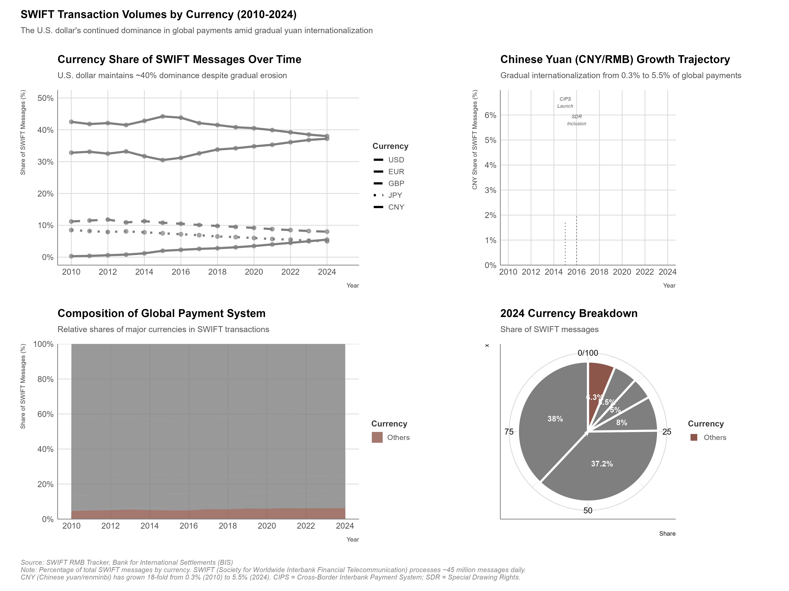
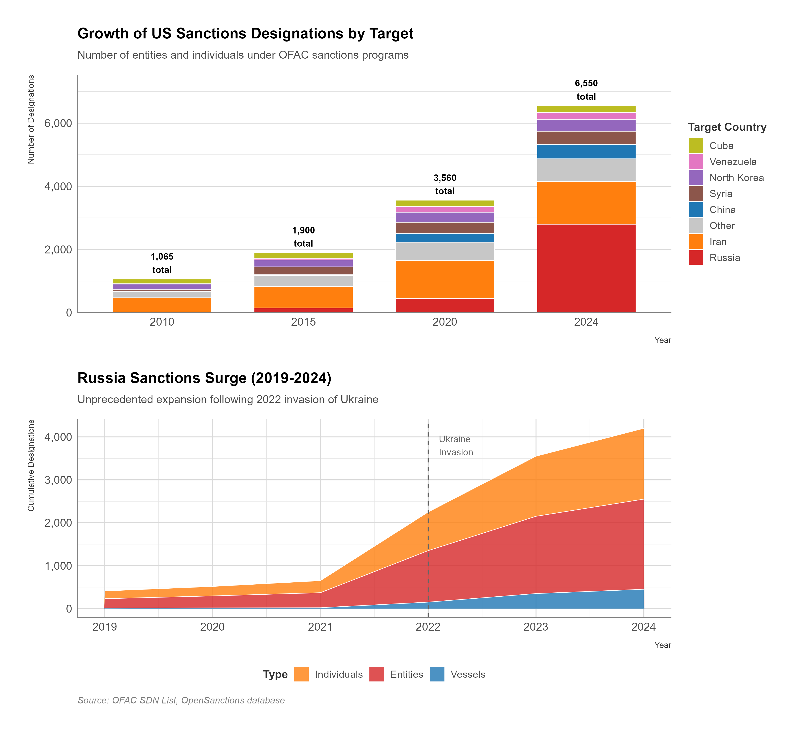
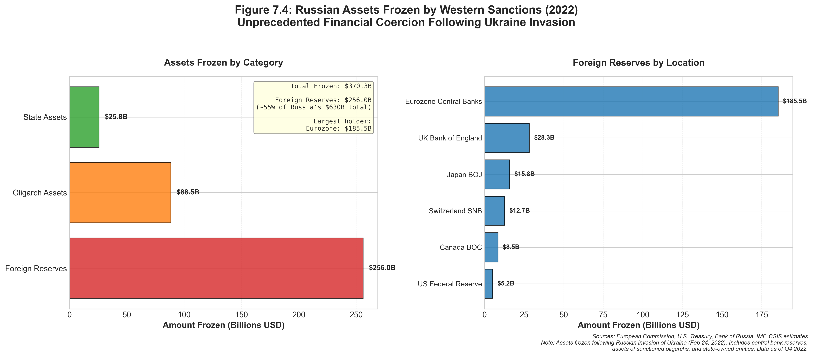

# Financial Statecraft and Sanctions

## Executive Summary

On February 26, 2022, four days after Russia's full-scale invasion of Ukraine, the United States, European Union, United Kingdom, and Canada announced unprecedented financial sanctions: freezing Russian Central Bank reserves held in Western financial institutions (an estimated $300+ billion) (U.S. Treasury 2022), removing major Russian banks from the SWIFT international payments messaging system, and imposing comprehensive restrictions on transactions with Russian entities.

Within days, the ruble collapsed 30%, Russian stock markets plunged, and Western firms scrambled to unwind Russian exposure. The speed and severity shocked observers—one former Russian finance minister called it "financial nuclear war." He was not exaggerating by much.

Yet this extraordinary action represented the culmination of decades building U.S.-centered financial architecture enabling what Treasury officials call "economic warfare." Washington had spent generations wiring the global financial system; now it was using those wires to electrocute an adversary.

This chapter examines financial sanctions—restricting access to financial systems, freezing assets, and prohibiting transactions—as instruments of economic coercion. Unlike trade controls affecting goods flows or investment screening targeting ownership, financial sanctions operate in the abstract realm of money, payments, and capital—yet their impacts can be devastating. A firm denied access to dollar-denominated payments or international banking systems faces existential crisis; a state frozen out of global finance confronts economic strangulation. Three key arguments structure our analysis:

**First, U.S. financial power rests on structural advantages in the international monetary system, not simply economic size.** The dollar's role as dominant reserve currency (58% of global foreign exchange reserves), invoicing currency (40% of SWIFT payments), and safe haven asset creates network effects (IMF 2024) and path dependencies that competitors cannot easily replicate. Control of financial infrastructure—SWIFT, Euroclear, correspondent banking—amplifies this power. Understanding these structural foundations illuminates both sanctions' effectiveness and vulnerabilities.

**Second, U.S. financial coercion has expanded in scope and ambition, moving from targeted individuals and entities to entire economies and financial systems.** Traditional sanctions blocked specific terrorists, narcotics traffickers, or proliferators from U.S. financial system access. Modern sanctions impose comprehensive restrictions on entire countries (Iran, North Korea, Venezuela), freeze central bank reserves (Russia, Afghanistan), and employ secondary sanctions forcing third parties to choose between U.S. and target markets. This escalation raises questions about sustainability and blowback.

**Third, aggressive use of financial sanctions generates counter-balancing efforts that may erode long-term U.S. advantages.** China's Cross-Border Interbank Payment System (CIPS), BRICS discussions of alternative currency arrangements, Russia-China bilateral settlement in national currencies, and central bank digital currency experiments all aim to reduce dollar dependence and create sanction-resistant alternatives. Whether these efforts succeed depends on network effects, trust, and the fundamental attributes making currencies attractive—questions we explore throughout.

The chapter proceeds in four sections. Section 1 examines **dollar privilege and financial infrastructure**, mapping how U.S. currency dominance and control of payment systems enable coercion. Section 2 analyzes the **Office of Foreign Assets Control (OFAC) sanctions architecture**, detailing legal authorities, targeting mechanisms, and administrative processes. Section 3 explores **secondary sanctions and extraterritoriality**, examining how U.S. sanctions reach beyond its borders to coerce third parties. Section 4 assesses **de-dollarization efforts and alternatives**, evaluating whether challengers can build viable substitutes.

Throughout, we apply the four-dimension framework to understand how financial sanctions operate across domains, targets, objectives, and intensities. We examine Chinese and Russian perspectives on dollar weaponization and financial sovereignty, illustrating strategic empathy for targets' responses. Government Tools Boxes detail IEEPA (International Emergency Economic Powers Act) and OFAC's Specially Designated Nationals (SDN) List mechanics. Case studies analyze comprehensive sanctions on Iran's nuclear program (2012-2015) and Russia post-2022 invasion, assessing effectiveness across our five criteria.

By chapter's end, readers will understand:
- How dollar dominance and payment system control enable financial coercion
- The legal architecture and institutional actors implementing U.S. sanctions
- Mechanisms of primary, secondary, and sectoral sanctions
- Economic and strategic impacts of comprehensive financial restrictions
- Prospects for de-dollarization and alternative financial systems
- Chinese and Russian perspectives on financial sovereignty and counter-strategies

Financial sanctions represent perhaps the most powerful economic coercion tool available to the United States—but also the most likely to destroy itself through overuse. Every time Washington weaponizes the dollar, it reminds the world why depending on the dollar is dangerous. Balancing near-term effectiveness against long-term system preservation constitutes the central challenge for U.S. policymakers. Use sanctions too sparingly, and adversaries act with impunity. Use them too aggressively, and the dollar's dominance erodes. There is no comfortable middle ground.

---

## Dollar Privilege and Financial Infrastructure

Financial sanctions' effectiveness derives from the U.S. dollar's dominant position in the international monetary system and U.S. control over critical financial infrastructure. This section maps these structural advantages, explaining how currency and payment system characteristics enable coercion.

### The Dollar's Privileged Position

<figure class="book-figure">
  
  <figcaption>Figure 7.3: Foreign Holdings of U.S. Treasury Securities</figcaption>
</figure>

**Reserve Currency Status**

The U.S. dollar comprises approximately 58% of allocated global foreign exchange reserves (2024) (IMF COFER 2024), far exceeding the U.S. share of global GDP (~25%) (World Bank WDI) or trade (~11%). This reserve status means:

- **Central banks hold dollars**: Foreign governments maintain dollar reserves to stabilize exchange rates, service dollar-denominated debts, and conduct international transactions. As of 2024, foreign official holdings of U.S. Treasury securities exceed $7.6 trillion (U.S. Treasury).

- **Safe haven demand**: During crises, capital flows into dollar assets (especially U.S. Treasuries) as investors seek safety. This "exorbitant privilege" enables U.S. borrowing at lower rates than economic fundamentals alone would justify.

- **Network effects**: Dollar dominance is self-reinforcing. Because others use dollars, liquidity is high and transaction costs low, encouraging further dollar use. Breaking this cycle requires coordinated shift—difficult to achieve.

**Reserve Currency Composition (2024)**:
- U.S. Dollar: 58.4%
- Euro: 20.5%
- Japanese Yen: 5.5%
- British Pound: 4.9%
- Chinese Renminbi: 2.7%
- Other: 7.9%

The euro's 20% share (representing EU's ~17% of global GDP, per World Bank WDI) suggests currency share can exceed GDP share if backed by deep financial markets and institutional credibility. Yet the euro faces structural challenges (lack of unified fiscal authority, fragmented bond markets) limiting its reserve currency appeal.

China's renminbi remains distant third despite China's 18% of global GDP (World Bank WDI). Capital controls, limited currency convertibility, underdeveloped bond markets, and concerns about rule of law constrain international renminbi adoption—points we explore in Section 4.

**Invoicing and Trade Settlement**

Beyond reserves, the dollar dominates international trade invoicing and settlement:

- **SWIFT data (2024)**: 42% of international payments by value denominated in dollars, 31% in euros, 4% in renminbi (SWIFT RMB Tracker 2024)
- **Trade invoicing**: Estimated 40% of global trade invoiced in dollars (Gopinath et al. 2020), including trade not involving U.S. parties
- **Commodities**: Oil, gas, metals, agricultural products predominantly priced in dollars (the "petrodollar" system)

**Why dollar invoicing matters for sanctions**: When trade is invoiced in dollars, payments flow through U.S. financial system or correspondent banks with U.S. connections. This creates jurisdiction for U.S. sanctions enforcement. A Chinese firm buying Brazilian soybeans in dollars must clear payment through U.S.-connected banks, giving Treasury visibility and control.

**Dominant Currency Paradigm**: Research by Gopinath and others demonstrates exchange rate pass-through is asymmetric (Gopinath et al. 2020): when dollar strengthens, import prices in non-U.S. countries rise more than when local currencies weaken. This "dollar-invoicing" phenomenon means global trade volumes respond to dollar fluctuations, not just bilateral exchange rates—further entrenching dollar centrality.

**Debt Denomination**

Approximately $13 trillion in non-U.S. dollar-denominated debt exists (2024) (BIS 2022)—debt issued by non-U.S. entities in dollars:

- **Emerging market sovereigns**: Many governments borrow in dollars, creating currency mismatches (borrow in dollars, earn revenue in local currency)
- **Corporations**: Multinational firms issue dollar bonds to access deep U.S. capital markets
- **Financial institutions**: Banks worldwide maintain dollar funding to service international clients

**Sanctions implications**: Entities with dollar debts require dollar access to service obligations. Sanctions blocking dollar access can trigger defaults, bankruptcies, and financial crises—amplifying coercive pressure.

### Payment System Infrastructure: SWIFT and Correspondent Banking


**SWIFT (Society for Worldwide Interbank Financial Telecommunication)** is a Belgian-based cooperative providing secure messaging services for financial transactions between 11,000+ institutions in 200+ countries. SWIFT does not transfer funds directly but transmits standardized payment instructions. Its near-universal adoption creates powerful network effects, making exclusion from SWIFT tantamount to exclusion from international finance.


**Society for Worldwide Interbank Financial Telecommunication (SWIFT)**

<figure class="book-figure">
  
  <figcaption>Figure 7.1: Currency Share of Global Payments (SWIFT)</figcaption>
</figure>

SWIFT is not a payment system but a secure messaging network transmitting payment instructions between 11,000+ financial institutions in 200+ countries. Key characteristics:

- **Cooperative structure**: Belgian-based cooperative owned by member banks; not controlled by single government
- **Message standardization**: Provides common formats for payment orders, confirmations, securities transfers
- **Network effects**: Universal adoption means avoiding SWIFT is extremely difficult; alternatives lack coverage
- **Daily volume**: Processes ~45 million messages daily valued at trillions of dollars

**SWIFT and U.S. sanctions**: While SWIFT is not U.S.-controlled, several factors give U.S. leverage:

1. **Dollar dominance**: 42% of SWIFT messages involve dollar transactions requiring clearing through U.S. banks
2. **U.S. market access**: SWIFT members want access to U.S. financial system; compliance with U.S. sanctions required
3. **EU coordination**: European authorities (SWIFT's home jurisdiction) generally coordinate with U.S. on sanctions
4. **CIA access controversy**: 2006 revelations showed U.S. Treasury accessed SWIFT data for counterterrorism, confirming U.S. reach

**SWIFT disconnections**: U.S. has successfully pressured SWIFT to disconnect sanctioned entities:
- **Iranian banks (2012, 2018)**: Removed after U.S./EU pressure, cutting Iran off from international finance (Nephew 2017)
- **Russian banks (2022)**: Removed seven Russian banks and two Belarusian banks after Ukraine invasion; notably excluded Gazprombank (natural gas payments) and Sberbank (initially)

SWIFT disconnection is the "financial nuclear option"—it immediately severs international payment capability, forcing reliance on informal channels (cash, barter, cryptocurrency, bilateral arrangements). Being cut off from SWIFT is the financial equivalent of being unplugged from the internet: theoretically you can still communicate, but practically you're in the dark ages.

**Correspondent Banking**


**Correspondent Banking** is a system where smaller banks maintain accounts at larger banks with global reach to process international transactions. For dollar-denominated payments, transactions ultimately clear through the U.S. Federal Reserve system. This tiered structure gives U.S. authorities visibility and enforcement jurisdiction over international payments, even between non-U.S. parties.


Most banks cannot directly clear international payments; instead they use correspondent banking relationships with larger institutions having global reach:

- **Tiered structure**: Small Bank A in Country X maintains account at Larger Bank B in Country Y, which maintains account at Major Bank C in the United States
- **Dollar clearing**: For dollar transactions, ultimately clears through U.S. Federal Reserve system via U.S. banks
- **U.S. jurisdiction**: Payment instructions touching U.S. correspondent banks give U.S. Treasury visibility and enforcement authority

**Sanctions mechanism**: Treasury can pressure correspondent banks to terminate relationships with sanctioned entities. If Bank B faces choice between access to U.S. financial system (profitable) or servicing sanctioned Bank A (risky, low-profit), Bank B terminates relationship. This "de-risking" cascades through banking system, effectively excluding sanctioned entities even from non-dollar transactions.

**Example - North Korea isolation**: Following 2016-2017 nuclear tests, U.S. Treasury systematically pressured Chinese banks maintaining North Korean accounts (Zarate 2013). Bank of China, China Construction Bank, Agricultural Bank of China all terminated North Korean relationships. Combined with SWIFT access restrictions, North Korea became largely excluded from international banking—forced to rely on cash couriers, shell companies, and cryptocurrency.

### Financial Market Depth and Liquidity

U.S. financial markets' extraordinary depth and liquidity amplify dollar attractiveness:

**U.S. Treasury Market**:
- $27 trillion outstanding (2024) (U.S. Treasury), most liquid bond market globally
- Benchmark for global risk-free rate
- Unmatched secondary market liquidity (can buy/sell billions instantly)
- No viable alternative offers comparable scale, liquidity, and safety

**Corporate Bond Markets**:
- U.S. corporate bond market ~$10 trillion
- European corporate bond market ~$4 trillion (fragmented across jurisdictions)
- Asian corporate bond markets smaller, less liquid, more restricted

**Equity Markets**:
- U.S. stock market capitalization ~$50 trillion (40% of global)
- Depth enables massive capital raising (Apple $3 trillion market cap; Saudi Aramco IPO raised $29 billion in 2019 but still listed on Tadawul, not NYSE)

**Foreign Exchange Market**:
- 88% of foreign exchange transactions involve the dollar (2022 BIS Triennial Survey)
- Dollar-euro is most liquid currency pair
- This liquidity enables low-cost currency conversion and hedging

**Why liquidity matters**: Sanctions restricting access to U.S. financial markets deny targets:
- Ability to raise capital at competitive rates
- Liquid secondary markets for selling assets
- Low-cost foreign exchange transactions
- Access to sophisticated financial instruments (derivatives, structured products)

Iran, Russia, Venezuela all face higher borrowing costs and reduced market access due to sanctions, constraining investment and economic growth.

### Legal and Institutional Framework

**Extraterritorial Reach**

U.S. financial sanctions possess extraterritorial reach exceeding trade or investment controls:

- **U.S. person prohibition**: U.S. citizens, permanent residents, entities, and anyone in U.S. territory prohibited from transactions with sanctioned targets (standard jurisdictional basis)

- **U.S. dollar transactions**: Any transaction denominated in dollars, even between non-U.S. parties abroad, potentially subject to U.S. jurisdiction if clears through U.S. financial system

- **U.S. correspondent banks**: Foreign banks using U.S. correspondent banking for clearing become subject to U.S. sanctions compliance requirements

- **Secondary sanctions**: Threaten sanctions on third parties (non-U.S. persons) conducting business with sanctioned targets, forcing choice between U.S. and target markets

This expansive reach enables U.S. to coerce behavior globally, not just within its borders—but also generates sovereignty concerns and motivates alternatives.

**Enforcement Mechanisms**

Multiple U.S. agencies enforce financial sanctions:

- **Treasury Department - Office of Foreign Assets Control (OFAC)**: Primary sanctions administrator; maintains SDN List, issues licenses, enforces compliance
- **Treasury Department - Financial Crimes Enforcement Network (FinCEN)**: Anti-money laundering (AML) enforcement; identifies sanctions evasion
- **Justice Department**: Criminal prosecution of sanctions violations
- **State Department**: Diplomatic coordination; designates state sponsors of terrorism
- **Commerce Department - Bureau of Industry and Security**: Export controls (overlapping with financial restrictions)

**Penalties**: Civil penalties up to greater of $330,000 per violation or twice transaction value; criminal penalties up to $1 million and 20 years imprisonment for willful violations. Financial institutions face enormous fines for sanctions violations:
- BNP Paribas: $8.9 billion (2014) for violating Cuba, Iran, Sudan sanctions (U.S. Department of Justice)
- Standard Chartered: $1.1 billion (2019) for Iran sanctions violations (OFAC)
- UniCredit: $1.3 billion (2019) for Iran, Syria, Libya sanctions violations (OFAC)

These massive penalties incentivize over-compliance: banks often refuse transactions remotely related to sanctioned jurisdictions to avoid risk.

### Vulnerabilities and Limits

Despite formidable advantages, U.S. financial power faces vulnerabilities:

**Overuse Risks**

Expanding sanctions use creates incentives for alternatives:
- As of 2024, over 30 countries face some form of U.S. sanctions (comprehensive or targeted)
- More than 10,000 individuals and entities on OFAC SDN List (OFAC 2024)
- Estimated 30% of global GDP in countries under some U.S. sanctions (Atlantic Council 2022)

Widespread sanctions motivate targets and even neutral parties to develop alternatives, potentially eroding long-term U.S. leverage.

**Geopolitical Fragmentation**

Russia-China alignment creates critical mass for alternative systems:
- Combined 20% of global GDP (World Bank WDI)
- 40% of global population
- Significant commodity production (oil, gas, minerals)

If Russia-China-led bloc develops interoperable payment systems and trades in national currencies, could create parallel financial infrastructure reducing dollar centrality.

**Technological Change**

Digital currencies and blockchain technologies may enable sanctions circumvention:
- **Cryptocurrencies**: While traceable, can facilitate sanctions evasion (North Korea, Iran use crypto)
- **Central Bank Digital Currencies (CBDCs)**: Enable direct cross-border payments bypassing correspondent banking
- **Decentralized finance (DeFi)**: Programmable money on blockchains potentially resistant to state control

**Trust and Credibility**

Freezing Russia's central bank reserves (2022) shocked many observers—calling into question the safety of dollar reserves. If holding dollar reserves risks confiscation for geopolitical reasons, why hold them? The message was unmistakable: your dollars are only yours as long as Washington approves of your behavior. This "weaponization" concern motivates reserve diversification even among U.S. partners. Central bankers who once viewed dollar reserves as the safest possible asset now wonder if they're holding frozen assets waiting to happen.

---

## OFAC Sanctions Architecture

The Office of Foreign Assets Control (OFAC) within the U.S. Department of Treasury administers and enforces economic sanctions against targeted foreign countries, entities, and individuals. With fewer than 200 staff members, OFAC wields authority over trillions of dollars in transactions, maintaining sanctions programs affecting over 10,000 targets across 30+ countries. Understanding OFAC's structure, authorities, and mechanisms illuminates how financial sanctions translate from policy objectives into economic pressure.

### Legal Authorities

OFAC operates under multiple statutory authorities granting the President power to impose economic sanctions:

**International Emergency Economic Powers Act (IEEPA)**

The primary legal basis for modern sanctions, IEEPA (50 U.S.C. §§ 1701-1706) authorizes the President to:

- Declare a national emergency with respect to an "unusual and extraordinary threat"
- Block transactions and freeze assets of foreign persons or entities
- Prohibit imports and exports
- Regulate foreign exchange, banking, and property transfers

**Process**:
1. President issues Executive Order declaring national emergency and identifying threat
2. Executive Order cites IEEPA authority
3. OFAC issues implementing regulations (31 C.F.R. Parts 500-599)
4. Congress can terminate national emergency by joint resolution (never successfully done)

**Scope**: IEEPA grants nearly unlimited discretion. "National emergency" is self-defined by President; "unusual and extraordinary threat" interpreted broadly. Courts provide minimal review, treating national security determinations as non-justiciable political questions.

**Current IEEPA-based programs** (2024): Russia, Iran, North Korea, Syria, Venezuela, South Sudan, Yemen, Burma, Libya, Somalia, Democratic Republic of Congo, Central African Republic, Burundi, Nicaragua, Belarus, Ethiopia, and others.

**Trading with the Enemy Act (TWEA)**

Enacted 1917, TWEA (50 U.S.C. §§ 4301-4341) authorizes wartime sanctions. Much broader than IEEPA but now only applies to Cuba (grandfathered under TWEA before IEEPA's 1977 enactment). Requires congressional authorization for new programs, limiting utility.

**Specific Sanctions Statutes**

Congress has enacted country-specific and issue-specific sanctions laws:

- **Comprehensive Iran Sanctions, Accountability, and Divestment Act (CISADA) 2010**: Mandated sanctions on entities facilitating Iran's petroleum sector; authorized secondary sanctions
- **Countering America's Adversaries Through Sanctions Act (CAATSA) 2017**: Mandated sanctions on Russia, Iran, North Korea; limited presidential waiver authority
- **Magnitsky Act 2012 and Global Magnitsky Act 2016**: Target human rights abusers and corrupt officials globally
- **Hong Kong Autonomy Act 2020**: Sanctions on Chinese officials and entities undermining Hong Kong autonomy

These statutes constrain presidential discretion by mandating specific sanctions, limiting waivers, or requiring reports to Congress. However, presidents retain broad IEEPA authority for additional sanctions beyond statutory minimums.

**United Nations Security Council Resolutions**

When UN Security Council adopts sanctions resolutions (e.g., North Korea, Iran historically, Taliban, Al-Qaeda), U.S. implements through OFAC. However, U.S. sanctions typically exceed UNSC minimums, adding unilateral restrictions beyond multilateral baseline.

### Types of Sanctions Programs

<figure class="book-figure">
  
  <figcaption>Figure 7.2: Active U.S. Sanctions Programs by Type</figcaption>
</figure>

OFAC administers multiple sanctions program types:

**Comprehensive Country Sanctions**

Prohibit nearly all transactions with entire countries, requiring licenses for humanitarian exceptions:

- **Cuba**: Comprehensive embargo since 1962 (TWEA)
- **North Korea**: Comprehensive sanctions since 2008, tightened repeatedly
- **Syria**: Comprehensive sanctions since 2011
- **Iran**: Comprehensive sanctions (1979-2015, reimposed 2018-present)

Comprehensive sanctions effectively cut targets from U.S. economy and, through secondary sanctions and correspondent banking pressures, much of global financial system.

**Targeted (List-Based) Sanctions**


**SDN List (Specially Designated Nationals and Blocked Persons List)** is OFAC's primary sanctions list containing 10,000+ entries of individuals, companies, vessels, and aircraft. U.S. persons are prohibited from any transactions with SDN-listed parties, and all assets of listed parties within U.S. jurisdiction must be frozen. The "50% rule" extends these restrictions to any entity 50%+ owned by an SDN.


Prohibit transactions with specific individuals, entities, vessels, or aircraft designated on OFAC lists:

- **Specially Designated Nationals and Blocked Persons (SDN) List**: Over 10,000 entries (individuals, companies, vessels, aircraft) whose assets are blocked and with whom U.S. persons cannot transact
- **Non-SDN Lists**: Sectoral Sanctions Identifications List (SSI), Foreign Sanctions Evaders List (FSE), Non-SDN Menu-Based Sanctions List, etc. - varying restrictions

Targeted sanctions enable surgical precision, blocking specific proliferators, terrorists, narcotics traffickers, or human rights abusers without comprehensive country-wide restrictions.

**Sectoral Sanctions**

Prohibit specific transaction types with designated entities in targeted sectors:

- **Russia Sectoral Sanctions**: Restrictions on transactions involving debt/equity of major Russian banks (e.g., Sberbank, VTB), energy companies (Gazprom, Rosneft, Novatek), and defense firms (prohibiting specific financing, technology transfers, or services)
- **Venezuela Sectoral Sanctions**: Restrictions on PdVSA (state oil company) transactions

Sectoral sanctions impose targeted pain on strategic industries while permitting other economic activity. More calibrated than comprehensive sanctions but complex to administer and susceptible to circumvention.

<figure class="book-figure">
  
  <figcaption>Figure 7.6: U.S. Sanctions Programs by Target Country</figcaption>
</figure>

**Secondary Sanctions**


**Secondary Sanctions** threaten penalties on non-U.S. persons (foreign companies, banks, individuals) for conducting business with primary sanctions targets. Unlike primary sanctions that apply within U.S. jurisdiction, secondary sanctions extend U.S. policy globally by forcing third parties to choose between access to the U.S. financial system or business with sanctioned entities. Most foreign companies value U.S. market access more than target-country business, making secondary sanctions highly effective but diplomatically contentious.


Threaten sanctions on third parties (non-U.S. persons) engaging in specified activities with sanctions targets:

- **Iran secondary sanctions**: Foreign financial institutions conducting significant petroleum transactions with Iran risk losing U.S. correspondent banking access
- **Russia secondary sanctions (CAATSA)**: Foreign persons engaging in significant transactions with Russian defense/intelligence sectors face potential blocking

Secondary sanctions extend U.S. reach globally, forcing third parties to choose between U.S. and target markets. Highly effective but diplomatically contentious (explored in Section 3).

### Designation Process

**SDN Designations**

OFAC adds individuals and entities to SDN List through administrative process:

1. **Intelligence gathering**: Agencies (CIA, NSA, FBI, DHS, State, Commerce) identify targets meeting sanctions criteria
2. **Interagency review**: Agencies coordinate through Treasury-chaired process; State, Justice, Commerce, others provide input
3. **Treasury determination**: OFAC, with approval from Treasury Secretary (or delegate), makes final designation decision
4. **Public listing**: OFAC publishes designation on SDN List with identifying information (name, aliases, addresses, dates of birth, passport numbers, vessel/aircraft identifiers)
5. **Asset freeze**: U.S. financial institutions holding designated party's assets must freeze and report to OFAC
6. **Transaction prohibition**: U.S. persons prohibited from transactions; foreign financial institutions risk secondary sanctions if designated individual/entity is subject to secondary sanctions

**Designation criteria** vary by program but generally include:
- **Terrorism**: Providing material support to Foreign Terrorist Organizations (FTOs) or Specially Designated Global Terrorists (SDGTs)
- **Proliferation**: Contributing to weapons of mass destruction programs (North Korea, Iran)
- **Narcotics trafficking**: Significant role in international drug trade
- **Human rights abuses**: Magnitsky Act designations for serious violations
- **Cyber attacks**: Malicious cyber actors (Executive Order 13694)
- **Corruption**: Officials engaging in public corruption
- **Undermining democratic institutions**: Foreign interference in elections

**50% Rule**: If sanctioned entity owns 50%+ of another entity (directly or indirectly), the subsidiary is automatically subject to same restrictions even if not listed. This prevents evasion through corporate structures.

**Evidentiary Standards**: Designations based on "administrative record" reviewed internally; courts provide limited review. Designated parties rarely see underlying intelligence. This low procedural threshold enables rapid designations but raises due process concerns.

**Delisting Process**

Designated parties may petition OFAC for removal:

1. Submit request with evidence demonstrating no longer meeting designation criteria
2. OFAC reviews (can take months to years; no statutory deadline)
3. OFAC may grant, deny, or request additional information
4. Judicial review available but courts typically defer to OFAC's national security determinations

Delisting is difficult; presumption favors maintaining designations. Burden on petitioner to prove changed circumstances.

### Licensing and Compliance

**General Licenses**

OFAC issues general licenses authorizing categories of transactions without individual applications:

- **Humanitarian transactions**: Medicine, medical devices, food, agricultural commodities generally authorized (even to comprehensive sanctions targets)
- **Personal remittances**: Individuals may send limited funds to family members in sanctioned countries
- **Informational materials**: First Amendment protections for publishing, importing/exporting informational materials
- **Diplomatic activities**: UN, embassies, consulates authorized to conduct official business
- **Telecommunications**: Services enabling internet, phone communication generally authorized (promotes information freedom)

General licenses balance sanctions pressure with humanitarian concerns, constitutional rights, and diplomatic necessities.

**Specific Licenses**

For transactions not covered by general licenses, U.S. persons may apply for specific licenses:

- **Application**: Submit to OFAC with detailed transaction description, parties involved, purpose, economic impact
- **Review**: OFAC evaluates consistency with sanctions policy objectives, humanitarian factors, foreign policy considerations
- **Determination**: OFAC may approve, deny, or approve with conditions (reporting requirements, transaction limits)
- **Timeline**: No statutory deadline; can take weeks to many months

Specific licenses enable flexibility for compelling cases (medical treatment, legal fees, winding down contracts) while maintaining default prohibition.

**Compliance Requirements for Financial Institutions**

U.S. financial institutions must implement robust sanctions compliance programs:

**Screening**:
- Screen all customers, transactions, and counterparties against OFAC SDN List and other sanctions lists
- Screen transaction descriptions, beneficiaries, originators for sanctions nexus
- Real-time or near-real-time screening before processing transactions

**Blocking**:
- Immediately freeze assets of designated persons if discovered
- File Blocked Property Report with OFAC within 10 days
- Reject transactions involving designated persons

**Reporting**:
- Report blocked property annually
- Report suspicious activity to FinCEN (overlapping AML requirements)
- Respond to OFAC information requests

**Internal controls**:
- Designated sanctions compliance officer
- Regular employee training
- Independent audit function
- Policies and procedures manual
- Recordkeeping (5+ years)

**Consequences of non-compliance**: Massive civil and criminal penalties (as noted above - BNP Paribas $8.9 billion, Standard Chartered $1.1 billion). This incentivizes over-compliance: banks often block transactions with tenuous sanctions connections to avoid enforcement risk.

### Humanitarian Exceptions and Challenges

Sanctions laws provide humanitarian exceptions, yet implementation faces challenges:

**Statutory Humanitarian Exceptions**

- **Food and medicine**: IEEPA exempts donations of food, clothing, and medicine from prohibition (50 U.S.C. § 1702(b)(2))
- **Informational materials**: Protected by First Amendment and statutory exemption (§ 1702(b)(3))

**Practical Barriers**

Despite exemptions, humanitarian actors face obstacles:

**Over-compliance**: Banks' sanctions compliance systems often flag humanitarian transactions to sanctioned countries (Iran, Syria, Yemen), leading to rejection even when legally permitted. Risk-averse banks avoid entire sanctioned jurisdictions.

**Payment processing**: International NGOs struggle to pay local staff, suppliers, partners in sanctioned countries when banks refuse transactions. Forces reliance on cash couriers, local currency, informal value transfer (hawala)—inefficient and risky.

**Licensing delays**: While general licenses cover many humanitarian activities, complex projects may require specific licenses. Approval delays (months) hamper time-sensitive humanitarian response.

**Chilling effect**: Even authorized activities face challenges when suppliers, shippers, insurers refuse involvement due to sanctions concerns. Comprehensive sanctions (Iran, Syria, North Korea) create environments where humanitarian aid becomes extremely difficult despite legal exemptions.

**2019-2020 Examples**: U.S. humanitarian exports to Iran fell 90% (2017-2019) (Nephew 2017; Treasury sanctions review data) despite exemptions, as pharmaceutical companies and banks avoided transactions. COVID-19 pandemic exacerbated problems, with Iran facing difficulty importing medical equipment and medicine. Treasury eventually issued additional guidance and specific licenses, but damage to Iran's pandemic response occurred.

**Reform Efforts**: NGOs, humanitarian organizations, and some policymakers advocate for:
- Enhanced general licenses for humanitarian transactions
- Dedicated payment channels for humanitarian actors
- Regulatory safe harbors for banks processing humanitarian transactions
- Faster specific license processing

However, concerns about sanctions evasion (disguising commercial transactions as humanitarian) and limited OFAC resources constrain reforms.

---

## Secondary Sanctions and Extraterritoriality

<figure class="book-figure">
  
  <figcaption>Figure 7.5: Sanctions Cascade: How Primary Sanctions Spread Through Secondary Effects</figcaption>
</figure>

Secondary sanctions represent the most controversial and powerful dimension of U.S. financial coercion: threatening sanctions on third parties—foreign persons outside U.S. jurisdiction—to compel them to cease business with primary sanctions targets. This section examines secondary sanctions' mechanics, effectiveness, and blowback.

### Defining Secondary Sanctions

**Primary Sanctions** prohibit U.S. persons from transactions with designated targets. Applies within traditional jurisdiction: U.S. citizens, permanent residents, entities, and anyone/anything in U.S. territory.

**Secondary Sanctions** threaten sanctions on non-U.S. persons for engaging in specified activities with primary sanctions targets. This extends U.S. sanctions beyond its borders by:

- Leveraging U.S. market access as coercive tool
- Forcing third parties to choose: U.S. market or target market
- Creating de facto global enforcement of U.S. policy preferences

**Mechanism**: If Foreign Company A (non-U.S., outside U.S.) conducts business with Iran, U.S. may threaten to block Foreign Company A from U.S. financial system. Most foreign companies value U.S. market access more than Iran business, so they comply with U.S. demands—even absent legal obligation under their home country law.

**Legal Basis**: Secondary sanctions typically authorized by specific statutes (CISADA, CAATSA, Hong Kong Autonomy Act) or Executive Orders. IEEPA alone generally insufficient; requires congressional authorization or specific presidential finding.

### Iran Secondary Sanctions: Case Study in Coercion

**Background**

Iran sanctions evolved from primary (prohibiting U.S.-Iran transactions) to secondary (prohibiting non-U.S.-Iran transactions) through Congressional legislation and Executive Orders:

- **CISADA 2010**: First comprehensive secondary sanctions statute—targeting foreign financial institutions (FFIs) conducting petroleum transactions with Iran
- **National Defense Authorization Act (NDAA) 2012**: Expanded secondary sanctions to FFIs facilitating Iran Central Bank transactions
- **Executive Orders 2012-2015**: Additional secondary sanctions on Iran's energy, petrochemical, automotive, and other sectors
- **Joint Comprehensive Plan of Action (JCPOA) 2015**: Suspended most secondary sanctions in exchange for nuclear limitations
- **JCPOA withdrawal 2018**: Trump administration reimposed secondary sanctions (effective November 2018)

**Mechanics of Iran Financial Secondary Sanctions**

**IFCA (Iran Financial Connection Act)**:

If foreign financial institution "knowingly conducts or facilitates" significant financial transaction with:
- Designated Iranian financial institutions
- Facilitating transactions for Iranian Revolutionary Guard Corps (IRGC)
- Iran's petroleum, petrochemical, or shipping sectors

Then Treasury may impose one or more sanctions:

- Prohibition on correspondent banking (no USD clearing)
- Prohibition on payable-through accounts (no USD transactions)
- Block all property and interests in property (asset freeze)

**Significant Transaction Definition**:

"Significant" is intentionally vague, determined case-by-case. Factors include:
- Transaction size and frequency
- Nature of transaction (routine commercial vs. strategic sector)
- Level of awareness (deliberate facilitation vs. negligent)
- Management involvement

Vagueness creates uncertainty, incentivizing maximum compliance.

**Energy Secondary Sanctions**:

If foreign person "knowingly" engages in significant transaction for:
- Purchase or acquisition of Iranian crude oil or petroleum products
- Provision of goods, services, technology, or support to Iran's petroleum sector
- Petroleum-related transactions with sanctioned Iranian entities

Then President must impose at least three of twelve menu-based sanctions:

- Export-Import Bank financing prohibition
- Export licenses denial
- Loans from U.S. financial institutions prohibition
- Foreign exchange/banking/property transactions prohibition
- Procurement bans
- Others

**Waiver Authority**: President may waive if determines in U.S. national interest, typically requiring commitments to reduce Iranian petroleum purchases. Initially, China, India, South Korea, Turkey, Japan, and others received waivers conditioned on purchase reductions.

**Impact on Global Behavior**

Secondary sanctions dramatically reduced Iran's oil exports and financial system access:

**Oil Exports**:
- Pre-sanctions (2017): ~2.5 million barrels/day
- Post-secondary sanctions (2019-2020): ~200,000 barrels/day (92% reduction) (IEA 2020)
- Major importers (China, India, South Korea, Japan, Turkey, EU) ceased or drastically reduced purchases

**Financial isolation**:
- Major global banks (HSBC, Standard Chartered, Deutsche Bank, BNP Paribas, Commerzbank) ceased Iran transactions after CISADA/NDAA threats
- SWIFT disconnected Iranian banks (2012, 2018) under EU/U.S. pressure
- Iran unable to access $100+ billion in frozen oil revenue held abroad

**GDP impact**: World Bank estimates Iran's GDP fell ~8% (2018-2020) due to sanctions, with oil sector particularly affected.

**Third-Party Compliance**:

European companies (Total, Shell, Peugeot, Renault, Daimler, Siemens, Airbus) withdrew from Iranian projects post-2018 despite EU opposition to U.S. secondary sanctions and European Blocking Statute. Companies prioritized U.S. market access over Iran business.

China initially continued purchases (providing Iran lifeline) but at discounted prices and under covert arrangements. Even China-Iran trade constrained by major Chinese banks' correspondent banking relationships requiring U.S. access.

### Russia Secondary Sanctions (CAATSA)

**Countering America's Adversaries Through Sanctions Act (CAATSA) 2017**

Enacted after Russian 2016 election interference, CAATSA mandates secondary sanctions on foreign persons engaging in "significant transactions" with Russian defense/intelligence sectors:

**Section 231**: Prohibits significant transactions with:
- Russian defense companies (Rosoboronexport, Almaz-Antey, others listed)
- Russian intelligence agencies (FSB, GRU, SVR)
- Entities facilitating cyber intrusions or malign influence activities

**Section 232**: Energy pipeline sanctions—threatens sanctions on companies providing goods, services, technology, or financing for Russian energy export pipelines (e.g., Nord Stream 2)

**Section 241**: Menu-based sanctions (12 options, must impose at least five) on violators

**Caatsa Section 231 Application**:

**India-Russia defense purchases**: India purchases substantial Russian arms (S-400 missile defense system $5 billion contract 2018). CAATSA mandates sanctions, yet U.S. granted waivers recognizing India's strategic importance and existing Russian equipment dependencies. Demonstrates political override of statutory mandates.

**Turkey S-400 purchase**: Turkey acquired Russian S-400 despite U.S. objections (and alternative U.S. Patriot offer). U.S. imposed CAATSA sanctions on Turkey's defense procurement agency (2020)—rare case of sanctioning NATO ally. Turkey removed from F-35 program as punishment.

**China-Russia arms deals**: China purchases Russian S-400, Su-35 fighters. U.S. sanctioned Chinese defense procurement agency and its director (2018) under CAATSA, but limited impact as entity and individual had minimal U.S. exposure.

**Nord Stream 2**:

U.S. opposed Russian-German gas pipeline (viewing it as increasing European energy dependence on Russia). CAATSA Section 232 sanctions targeted pipeline construction:

- Swiss pipelay company Allseas withdrew (2019) under U.S. pressure, delaying construction
- Multiple German, Austrian, Dutch, French firms faced sanctions threats
- Biden administration ultimately waived sanctions (2021) to repair EU relations, then reimposed (2022) after Ukraine invasion
- Pipeline completed but never operational due to Ukraine war

**Effectiveness and Limitations**:

CAATSA secondary sanctions had mixed results:
- Deterred some transactions (India delayed S-400 deliveries, some European firms avoided Russian defense sector)
- Limited impact on major powers (China, India) with alternative markets and U.S. waiver politics
- Strained alliances (Turkey, India irritated by sanctions threats)

Compared to Iran, Russia secondary sanctions were narrower (defense/intel sectors vs. economy-wide), more constrained by geopolitical considerations (major power with allies vs. isolated Iran), and implemented inconsistently (frequent waivers).

### Hong Kong and China Secondary Sanctions

**Hong Kong Autonomy Act (HKAA) 2020**

Enacted after China's national security law imposed on Hong Kong (June 2020), HKAA mandates secondary sanctions on:

**Primary sanctions**: Chinese officials and entities materially contributing to Hong Kong autonomy erosion

**Secondary sanctions**: Foreign financial institutions conducting "significant transactions" with designated officials/entities face:
- Correspondent banking prohibitions
- Asset freeze
- Export license denials

**Implementation**:

- State Department identified 49 Chinese officials (including Hong Kong Chief Executive Carrie Lam)
- Treasury designated 10 officials (2020)
- No foreign financial institutions sanctioned under HKAA secondary provisions (as of 2024)

**Why limited implementation?**

1. **Chinese official assets**: Most designated officials held minimal assets in U.S. or Western banks; symbolic impact
2. **Financial institution reluctance**: Sanctioning banks with Chinese official relationships would affect most major global banks (HSBC, Standard Chartered, Bank of China, China Construction Bank)—risked systemic financial disruption
3. **Diplomatic costs**: Sanctioning international banks for China ties would strain relationships globally
4. **Chinese retaliation**: China enacted counter-sanctions law enabling retaliation against entities complying with U.S. secondary sanctions

HKAA demonstrates secondary sanctions' limits when targets are major powers with retaliatory capacity and deeply integrated into global finance.

### Diplomatic and Legal Controversies

**Sovereignty Objections**

Secondary sanctions coerce behavior by non-U.S. persons outside U.S. territory based on activity not illegal under their home country law. This generates sharp objections:

**European Union**:
- **Blocking Statute (Council Regulation 2271/96)**: Prohibits EU companies from complying with U.S. extraterritorial sanctions; allows companies to recover damages from U.S. sanctions compliance
- **Updated 2018**: Reactivated after U.S. withdrew from JCPOA, explicitly blocking EU compliance with Iran secondary sanctions

However, Blocking Statute largely ineffective: EU companies prioritized U.S. market access over EU legal compliance. Legal prohibition couldn't override economic reality.

**INSTEX**: EU created special purpose vehicle (Instrument in Support of Trade Exchanges) to facilitate Iran trade bypassing U.S. financial system. Processed only small humanitarian transactions before becoming defunct—demonstrated U.S. sanctions power exceeds EU counter-measures.

**Russia and China**: Both enacted counter-sanctions laws prohibiting domestic entities from complying with foreign (U.S.) extraterritorial sanctions. However, enforcement difficult when entities value U.S. market access.

**International Law Questions**:

Do secondary sanctions violate international law principles of sovereignty, non-intervention, or freedom of commerce? Debate continues:

**U.S. position**: Secondary sanctions are exercises of U.S. sovereign authority to deny U.S. market access—no obligation to permit foreign access. Comparable to export controls or immigration restrictions.

**Critics' position**: Leveraging market power to coerce foreign policy compliance by third states violates norms against extraterritorial jurisdiction and interference in domestic affairs.

No authoritative international legal resolution. International Court of Justice addressed tangentially (Iran v. U.S. 2018 regarding JCPOA) but didn't directly rule on secondary sanctions' international legality.

**Effectiveness vs. Blowback Calculation**:

Secondary sanctions are highly effective in near-term (isolating targets like Iran) but generate long-term costs:

- **Alliance strain**: EU, India, Turkey, others resent coercion
- **Alternative development**: China's CIPS, BRICS currency discussions, bilateral payment arrangements aim to escape U.S. sanctions reach
- **Dollar weaponization narrative**: Provides rhetorical ammunition for rivals portraying U.S. financial dominance as illegitimate coercion
- **Overstretch**: Expanding secondary sanctions to more countries/sectors risks diluting effectiveness and accelerating de-dollarization

Balancing coercive power and system preservation constitutes central strategic challenge.

---

## De-dollarization and Alternative Financial Systems


**Chinese Strategic Perspective: De-dollarization**

Chinese scholars and officials view de-dollarization as both strategic necessity and historic opportunity. The freezing of Russian central bank reserves in 2022 confirmed Beijing's long-held concern that dollar reserves are only "safe" as long as Washington approves of a country's behavior. China frames its de-dollarization efforts as defensive responses to U.S. "weaponization" of finance, while positioning itself as offering the Global South an alternative to dollar hegemony. However, Chinese strategists also recognize the difficulty of displacing entrenched network effects and the tension between RMB internationalization and maintaining capital controls.


Aggressive U.S. use of financial sanctions—particularly freezing Russia's central bank reserves (2022)—accelerated efforts to reduce dollar dependence and build alternative financial infrastructure. This section examines de-dollarization initiatives, assessing whether challengers can create viable substitutes for dollar-dominated systems.

### Motivations for De-dollarization

**Sanctions Vulnerability**

<figure class="book-figure">
  
  <figcaption>Figure 7.4: Russian Central Bank Assets Frozen in 2022</figcaption>
</figure>

States facing sanctions or anticipating future sanctions seek alternatives to dollar-denominated transactions and U.S.-connected financial infrastructure:

- **Russia**: After 2014 Crimea sanctions and especially 2022 central bank freeze, prioritized reducing dollar reserves and building non-dollar payment systems
- **China**: Concerned about potential Taiwan-related sanctions, accelerating renminbi internationalization and CIPS development
- **Iran, Venezuela, North Korea**: Already sanctioned, forced to use alternatives (barter, bilateral arrangements, cryptocurrency)

**Sovereignty Concerns**

Even non-sanctioned states worry about U.S. financial surveillance and coercion potential:

- **India**: Despite U.S. partnership, resents secondary sanctions threats over Russian arms purchases
- **Saudi Arabia**: Exploring oil sales in currencies other than dollars despite security partnership
- **Brazil**: Vocal critic of dollar "privilege," advocating BRICS currency alternatives

**Economic Diversification**

Some initiatives reflect economic rather than security motivations:

- **China**: Renminbi internationalization supports Chinese firms' global operations and reduces currency risk
- **EU**: Euro as reserve currency reduces European dependence on Fed monetary policy
- **Central Bank Digital Currencies**: Many countries developing CBDCs for domestic payment efficiency, not primarily to challenge dollar

### China's Cross-Border Interbank Payment System (CIPS)


**Chinese Strategic Perspective: CIPS**

China views CIPS as critical infrastructure for financial sovereignty. From Beijing's perspective, SWIFT represents a Western-controlled chokepoint that can be weaponized at any time. CIPS serves multiple strategic objectives: reducing vulnerability to U.S. sanctions, supporting RMB internationalization, and providing developing countries an alternative to dollar-dominated systems. Chinese officials frame CIPS not as challenging the dollar but as providing "choice" in the international payment system.


**Structure and Function**

Launched 2015, CIPS processes cross-border renminbi (RMB) payments, positioning as alternative to SWIFT for RMB transactions:

**Participants** (2024):
- 143 direct participants (mainly Chinese banks, some foreign banks)
- 1,300+ indirect participants (financial institutions globally using direct participants for clearing)
- Covers 180+ countries and regions

**Volume**: Daily average ~$50-60 billion (2024), up from ~$5 billion (2018). However, SWIFT processes ~$5-7 trillion daily—CIPS is 1% of SWIFT volume.

**Currency settlement**: Only RMB-denominated transactions. Cannot process dollar, euro, or multi-currency transactions like SWIFT.

**Integration with SWIFT**: Many CIPS transactions still use SWIFT messaging protocols, creating continued dependence. Full independence requires adopting alternative messaging standards—work in progress.

**Advantages**:
- Reduces correspondent banking layers for RMB transactions
- Lower transaction costs for China-specific trades
- Beijing-controlled, immune to U.S. pressure for disconnection
- Supports renminbi internationalization by facilitating cross-border use

**Limitations**:
- Small scale relative to SWIFT (1% volume)
- Limited to RMB transactions; dollar remains dominant trade currency
- Many participants also SWIFT members, creating retaliation vulnerability
- Liquidity much lower than dollar markets

### Renminbi Internationalization: Progress and Barriers

**Progress Indicators**

China has made measured progress internationalizing the renminbi:

**Reserve currency status**: ~2.7% of global reserves (2024), up from < 1% (2016) (IMF COFER). IMF included RMB in Special Drawing Rights basket (2016), granting reserve currency legitimacy.

**Trade settlement**: ~25% of China's trade settled in RMB (2024), up from ~10% (2015) (PBOC; SWIFT RMB Tracker). China-Russia bilateral trade increasingly in local currencies (50%+ in RMB/ruble).

**Bond issuance**: "Panda bonds" (RMB bonds issued in China by foreign entities) and "Dim Sum bonds" (RMB bonds issued offshore) provide debt markets. However, combined issuance ~$100 billion—minuscule compared to $27 trillion U.S. Treasury market.

**Currency swap agreements**: People's Bank of China established currency swap lines with 40+ central banks totaling ~$550 billion, enabling RMB liquidity provision.

**Belt and Road Initiative**: China encourages BRI project financing in RMB, expanding currency use among developing countries.

**Fundamental Barriers**

Despite progress, structural obstacles limit RMB challenge to dollar:

**Capital Controls**

China maintains strict capital account restrictions:
- Limits on foreign investors purchasing Chinese assets
- Restrictions on Chinese residents moving capital offshore
- Exchange rate managed by PBOC, not freely floating

Capital controls prevent full convertibility—foreign holders cannot freely buy/sell RMB or RMB assets. This reduces RMB attractiveness for international reserves and transactions.

**Financial Market Depth**

Chinese financial markets lack liquidity and depth of U.S. markets:
- Chinese government bond market ~$20 trillion but fragmented, less liquid
- Corporate bond market smaller, with default risks (property developers, local government financing vehicles)
- Foreign holdings of Chinese bonds < 10% of market (BIS 2022; U.S. Treasury) (compared to 30-40% foreign holdings of U.S. Treasuries)

**Rule of Law and Property Rights**

Reserve currency status requires confidence in legal institutions protecting property rights:
- Opaque legal system with Communist Party override capability
- Government interventions in markets (trading halts, capital flight restrictions, property confiscations)
- Zero-COVID lockdowns (2020-2022) and abrupt regulatory crackdowns (tech, education, gaming sectors 2021-2022) demonstrated policy unpredictability

Freezing Russia's central bank reserves ironically highlighted U.S. willingness to confiscate for political reasons, but China's record of domestic asset confiscations and capital controls raises even greater concerns.

**Network Effects**

Dollar benefits from self-reinforcing network: because others use dollars, liquidity high, which encourages further use. RMB lacks critical mass to overcome this network advantage. Even if 25% of global trade settled in RMB, remaining 75% in dollars creates continued dollar necessity.

**Assessment**: RMB will continue growing as trade settlement and regional reserve currency, especially in China-centric supply chains and BRI countries. But replacing dollar as dominant global reserve currency requires financial market liberalization, capital account opening, and institutional credibility—reforms conflicting with CCP's political control priorities.

### BRICS Currency Proposals

**Background**

BRICS (Brazil, Russia, India, China, South Africa; expanded 2024 to include Iran, UAE, Egypt, Ethiopia) periodically discuss creating alternative currency or payment system to reduce dollar dependence.

**Proposals Range from Moderate to Ambitious**:

**Option 1: BRICS Payment System**: Connecting national payment systems (Russia's SPFS, China's CIPS, India's UPI) to enable direct bilateral settlements in local currencies, bypassing SWIFT and correspondent banking.

**Option 2: BRICS Currency Unit**: Basket currency similar to SDR, representing weighted average of BRICS currencies. Could serve as accounting unit for trade invoicing and reserve holdings.

**Option 3: New BRICS Currency**: Issue common currency backed by gold, commodities, or BRICS economies for use in mutual trade and reserves.

**Challenges**:

**Divergent Interests**:
- **China** dominates BRICS economically (70%+ of combined GDP, per World Bank WDI); RMB-centric system serves Chinese interests
- **India** wary of Chinese dominance; reluctant to embrace Chinese-led financial infrastructure
- **Russia** needs alternatives urgently but peripheral economic player
- **Brazil, South Africa** have closer economic ties to U.S./West than to China

Lack of shared interests and trust makes coordination difficult.

**Technical and Institutional Barriers**:

Creating new currency requires:
- Unified monetary policy or currency board (necessitating surrendering monetary sovereignty—politically impossible for major powers)
- Deep, liquid bond markets (requiring decades to build)
- Credible institutions (BRICS New Development Bank is small; lacks capacity for global reserve currency management)
- Widespread international adoption (network effects require critical mass)

**Economic Fundamentals**:

Several BRICS members face economic challenges limiting currency attractiveness:
- **Russia**: Sanctions, commodity dependence, economic isolation
- **Brazil**: History of inflation and debt crises
- **South Africa**: Economic stagnation and fiscal problems
- **Iran**: Comprehensive sanctions and economic mismanagement

Currency backed by these economies unlikely to inspire confidence as reserve asset.

**Most Likely Outcome**: Incremental measures—bilateral currency swaps, local currency trade settlement, payment system integration—rather than comprehensive new currency. These reduce dollar use at margins but don't fundamentally challenge dollar dominance.

### Central Bank Digital Currencies (CBDCs)


**Chinese Strategic Perspective: Digital Yuan (e-CNY)**

China's digital yuan represents Beijing's most ambitious effort to reshape international finance. The e-CNY enables programmable money with unprecedented state visibility into transactions, while cross-border CBDC pilots (mBridge) aim to create direct central bank-to-central bank settlement channels that bypass SWIFT and correspondent banking entirely. Chinese strategists see CBDCs as potentially transformative technology that could accelerate de-dollarization by eliminating the infrastructure advantages that currently favor the dollar.


**Global CBDC Development**

Over 100 countries (representing 95%+ of global GDP) exploring CBDCs (Atlantic Council CBDC Tracker 2024); several operational:

- **China e-CNY (Digital Yuan)**: Pilot program since 2020; used by 260+ million people domestically (PBOC 2024). Cross-border pilots with Hong Kong, Thailand, UAE testing international CBDC transactions.
- **Russia Digital Ruble**: Pilot launched 2023; aims to reduce sanctions vulnerability by enabling domestic and cross-border transactions outside U.S.-dominated infrastructure.
- **EU Digital Euro**: Development phase; goals include efficiency, financial inclusion, and euro sovereignty (reducing dependence on U.S. payment providers like Visa, Mastercard).
- **India e-Rupee**: Pilot since 2022; focuses on financial inclusion and domestic payment efficiency.

**Potential to Challenge Dollar**:

**Optimistic Scenario**: CBDCs enable direct central bank-to-central bank settlements, bypassing correspondent banking and SWIFT. China-Russia-Iran-Saudi Arabia could settle trade directly in digital currencies, creating parallel financial system immune to U.S. sanctions.

**Skeptical Scenario**: CBDCs are domestic payment infrastructure improvements; international adoption faces same barriers as traditional currencies (capital controls, market depth, trust). Digital yuan remains subject to Chinese capital controls; digital dollar would strengthen, not weaken, U.S. financial dominance.

**Current Evidence**: Early CBDC cross-border pilots (mBridge project: China, Thailand, Hong Kong, UAE) demonstrate technical feasibility but limited economic scale. Volumes tiny; participating countries still conduct vast majority of trade in dollars through traditional channels.

**Assessment**: CBDCs may incrementally reduce correspondent banking dependence and enable sanctions evasion at margins. But fundamental currency attractiveness depends on economic size, financial market depth, capital openness, and institutional credibility—factors unchanged by digitalization.

### Gold, Commodities, and Bitcoin

**Gold Reserves**

Some states increased gold reserves to diversify away from dollars:
- **Russia**: Accumulated gold reserves (20%+ of total reserves before 2022 invasion, sold some since to fund war) (World Gold Council)
- **China**: Steady gold purchases; officially 4% of reserves but potentially underreported (World Gold Council)
- **Central banks globally**: Net purchasers since 2010 after decades of selling

**Limitations**: Gold generates no yield, volatile, difficult to transact for modern commerce. Useful for value storage but not medium of exchange or unit of account. Can't build financial system on gold without returning to gold standard constraints (fixed exchange rates, monetary policy inflexibility).

**Commodity-Backed Currency Proposals**:

Proposals to back BRICS currency with commodities (oil, gas, minerals) face similar limitations plus additional challenges:
- Commodity prices volatile
- Requires trusted warehousing and auditing
- Extraction/delivery logistics complex
- Limited currency supply constrained by commodity production

**Bitcoin and Cryptocurrencies**

Some sanctioned actors use cryptocurrencies to evade restrictions:
- **North Korea**: Estimated $2+ billion stolen through cryptocurrency hacking/theft (UN Panel of Experts 2023); used for regime financing
- **Iran**: Some oil sales conducted in cryptocurrency
- **Russia**: Limited cryptocurrency use for sanctions evasion (most trade still requires traditional finance)

**Limitations for State Actors**:
- **Volatility**: Bitcoin price fluctuations (50%+ swings common) make it unsuitable for reserves or large transactions
- **Liquidity**: Converting large volumes to/from fiat currencies requires exchanges with banking connections—vulnerable to sanctions
- **Traceability**: Blockchain transactions pseudo-anonymous but traceable; U.S. sanctions authorities increasingly effective at tracking illicit crypto flows
- **Adoption**: No major economy accepts cryptocurrency for taxes or official transactions; limited utility for state-level commerce

**Stablecoins**: Dollar-pegged cryptocurrencies (USDT, USDC) are largest crypto by volume—but these reinforce dollar dominance by creating digital dollars, not alternatives.

**Assessment**: Cryptocurrencies enable marginal sanctions evasion for small transactions and illicit actors but cannot support large-scale international trade or serve as reserve currency. More likely to complement than replace dollar.

### Evaluating De-dollarization Prospects

**Inertia and Network Effects**

Dollar benefits from powerful inertia:
- Existing financial infrastructure optimized for dollars
- Contracts, invoices, debt denominated in dollars create lock-in
- Switching costs high (new contracts, hedging instruments, clearing systems)
- First-mover disadvantage: Entity switching to RMB while others use dollars faces liquidity and exchange rate costs

Network effects mean collective action problem: Everyone benefits if all switch, but individuals bear costs of switching alone. Absent coordinated global shift, dollar likely retains dominance.

**Realistic Scenarios**:

**Baseline (Most Likely)**: Gradual erosion of dollar dominance, not collapse. Dollar share of reserves, trade invoicing, and debt gradually declines from 55-60% toward 40-50% over 2-3 decades. RMB, euro, and others gain share but no single challenger emerges. Multipolar currency system with dollar as first among equals.

**Partial Fragmentation**: Geopolitical blocs use regional currencies—China-led bloc transacts in RMB, U.S.-led bloc in dollars, European bloc in euros. Trade between blocs requires currency exchange, increasing transaction costs. Resembles Cold War bifurcation but with more complex geometry.

**Status Quo+**: U.S. Digital Dollar and improved payment infrastructure strengthen dollar dominance. CBDC enables faster, cheaper cross-border transactions, making dollar even more attractive. U.S. financial market depth and Fed credibility sustain reserve currency status.

**Collapse (Low Probability)**: Major U.S. policy errors (debt crisis, hyperinflation, loss of Fed independence) or catastrophic geopolitical event (Taiwan conflict triggering comprehensive financial war) could precipitate rapid dollar abandonment. Absent such shocks, gradual evolution more likely than sudden collapse.

**Wild Card: Climate and Transition Risk**:

Some propose "green" currencies backed by carbon neutrality or renewable energy capacity. European Central Bank discussing environmental factors in reserve management. If climate transition reshapes global economy, new financial architectures could emerge—but speculative.

<figure class="book-figure">
  
  <figcaption>Figure 7.7: De-dollarization Trends: Reserve Currency Shares and Alternative Payment Systems</figcaption>
</figure>

---

## Chinese Perspective Box: Financial Sovereignty and Dollar Hegemony

### Understanding Chinese Views on Financial Coercion

Chinese perspectives on financial sanctions and dollar dominance reflect deep concerns about vulnerability to U.S. coercion, historical memories of Western financial imperialism, and determination to build independent financial infrastructure. Understanding these views illuminates China's strategic choices in financial system development and sanctions countermeasures.

### Historical Context and Financial Strategic Objectives

**Historical Experience**

Chinese financial sovereignty concerns reflect historical experiences with foreign financial control, including 19th-century foreign management of China's Maritime Customs Service and post-1949 exclusion from Bretton Woods institutions. These experiences reinforce the conviction that financial dependence creates political vulnerability—foreign control of financial infrastructure enables coercion.

**Contemporary Financial Strategic Objectives**

China's financial strategy pursues several forward-looking goals:

**De-dollarization and financial resilience**: Reducing dependence on dollar-denominated transactions and U.S.-controlled payment systems (SWIFT, correspondent banking) to protect against sanctions. Russia's frozen reserves ($300+ billion, 2022) validated these concerns, accelerating Chinese efforts to build alternative systems (CIPS) and diversify reserve holdings.

**RMB internationalization**: Promoting yuan use in international trade and finance to reduce transaction costs, enhance monetary policy autonomy, and build financial influence comparable to China's economic weight.

**Alternative financial architecture**: Developing institutions (AIIB, New Development Bank) and systems (CIPS, digital yuan) that reduce reliance on Western-dominated infrastructure while providing alternatives for countries seeking to reduce dollar dependence.

**Capital account management**: Maintaining controls on cross-border capital flows to prevent destabilizing speculation while gradually opening to support RMB internationalization—balancing financial security against market access benefits.

**Financial technology leadership**: Achieving dominance in digital payments, central bank digital currencies (CBDC), and fintech to shape future global financial architecture.

### Key Chinese Concepts in Financial Sovereignty

**Financial Hegemony (金融霸权, jīnróng bàquán)**

**Financial hegemony** describes U.S. exploitation of dollar dominance for coercive purposes. Chinese scholars and officials characterize this as:

- **Illegitimate privilege**: Dollar reserve status grants U.S. "exorbitant privilege"—ability to borrow cheaply, run persistent deficits, and export inflation to others
- **Weaponized interdependence**: U.S. transforms mutually beneficial financial integration into coercive tool, violating trust
- **Extraterritorial overreach**: Secondary sanctions force third parties to comply with U.S. preferences, violating sovereignty

Chinese Foreign Ministry statements routinely condemn U.S. "long-arm jurisdiction" (长臂管辖, chángbì guǎnxiá) and "unilateral sanctions" (单边制裁, dānbiān zhìcái) as violations of international law and sovereign equality.

**Financial Security (金融安全, jīnróng ānquán)**

**Financial security** represents core Chinese national security priority alongside military, food, and energy security. Key dimensions:

- **Payment system independence**: Ability to conduct international transactions without U.S./Western infrastructure dependencies
- **Reserve safety**: Protecting foreign exchange reserves ($3.2 trillion, world's largest) from confiscation or freezing
- **Capital account control**: Managing cross-border capital flows to prevent destabilizing speculation or capital flight
- **Systemic stability**: Preventing external shocks (sanctions, financial crises) from destabilizing domestic financial system

Russia's frozen reserves ($300+ billion, 2022) validated Chinese concerns: Even central bank reserves considered sacrosanct can be confiscated. This accelerated Chinese efforts to reduce dollar exposure and build alternatives.

**Financial Opening with Chinese Characteristics (有中国特色的金融开放, yǒu zhōngguó tèsè de jīnróng kāifàng)**

China pursues **controlled financial opening**—expanding international RMB use while maintaining capital controls and financial system oversight:

- **Gradual liberalization**: Incrementally opening bond markets to foreign investors (Bond Connect, Stock Connect programs) while retaining capital account restrictions
- **RMB internationalization**: Encouraging RMB trade settlement and reserves without full convertibility
- **Managed float**: Exchange rate influenced by market forces but PBOC intervenes to prevent excessive volatility

This reflects lesson from Asian Financial Crisis (1997-1998): Premature capital account liberalization creates vulnerability to speculation and capital flight. China prioritizes stability over Western-style financial openness.

**Dual Circulation and Self-Reliance (双循环与自力更生, shuāng xúnhuán yǔ zìlì gēngshēng)**

Post-2020, China's **dual circulation** strategy emphasizes reducing external dependencies including financial:

- **Domestic circulation** (国内循环, guónèi xúnhuán): Developing deep domestic capital markets reducing reliance on foreign financing
- **External circulation** (国际循环, guójì xúnhuán): Engaging globally but from position of strength, not dependence

**Financial self-reliance** means building complete financial ecosystem:
- Alternative payment systems (CIPS)
- RMB-denominated trade and investment
- Domestic rating agencies, auditing standards, legal frameworks
- Gold reserves and commodity-backed arrangements

### Chinese Critiques of U.S. Financial Coercion

**Violation of Sovereign Equality**

Chinese officials argue U.S. financial sanctions violate UN Charter principles of sovereign equality and non-intervention:

- **Secondary sanctions**: Forcing third countries to comply with U.S. preferences exceeds legitimate jurisdiction
- **SWIFT weaponization**: Using ostensibly neutral financial infrastructure for geopolitical purposes politicizes system
- **Asset freezes**: Confiscating sovereign assets (Russian reserves) undermines international financial system stability

From Chinese perspective, international financial system should be governed by multilateral rules (IMF, BIS), not unilateral U.S. dictates. Current system reflects 1945 power distribution, not contemporary multipolar reality.

**Double Standards and Selective Application**

Chinese scholars highlight U.S. sanctions inconsistency:

- **Allies exempted**: Israel, Saudi Arabia, India avoid sanctions despite behaviors (settlements, Yemen war, Kashmir) comparable to sanctioned states
- **Geopolitical motives**: Sanctions target U.S. rivals (Russia, China, Iran, Venezuela) regardless of stated justifications (human rights, proliferation, democracy)
- **Rules for thee**: U.S. violates international law (Iraq War, drone strikes, Guantanamo) without consequences while sanctioning others for lesser violations

This selective application reveals sanctions as power politics, not principled enforcement of international norms.

**Economic Warfare Disguised as Law Enforcement**

Chinese officials characterize comprehensive sanctions (Iran, Venezuela, North Korea) as "economic warfare" causing humanitarian suffering:

- **Civilian impact**: Sanctions harm ordinary citizens through inflation, unemployment, medicine/food shortages
- **Regime resilience**: Authoritarian regimes often survive sanctions; populations suffer while elites adapt
- **Collective punishment**: Comprehensive sanctions punish entire populations for government actions beyond their control

China frames its opposition to unilateral sanctions as defending multilateralism, sovereignty, and humanitarian principles—positions resonating with Global South countries.

### Chinese Counter-Strategies

**Building Parallel Infrastructure**

China systematically developing alternatives to U.S.-dominated financial systems:

**Cross-Border Interbank Payment System (CIPS)**:
- Launched 2015 to process RMB cross-border payments
- 143 direct participants, 1,300+ indirect participants (2024)
- Daily volume ~$50-60 billion (growing but still 1% of SWIFT)
- Eventually aims for full independence from SWIFT messaging

**Digital Yuan (e-CNY)**:
- CBDC pilot since 2020; 260+ million users domestically
- Cross-border pilots (mBridge) with Hong Kong, Thailand, UAE, Saudi Arabia
- Enables direct central bank settlements bypassing correspondent banking
- Potential for sanctions-resistant transactions in digital currency

**RMB Internationalization**:
- Bilateral currency swap agreements with 40+ central banks ($550+ billion)
- Encouraging BRI countries to use RMB for trade and investment
- Shanghai-Hong Kong Stock Connect, Bond Connect increasing foreign access to RMB assets
- RMB now ~2.7% of global reserves, ~25% of China's trade settlement

**Gold Reserves and Commodities**:
- Steady gold accumulation (officially ~4% of reserves, potentially more)
- Shanghai Gold Exchange (largest physical gold market globally)
- Commodity trading in RMB (Shanghai oil futures, iron ore, LNG contracts)

**Legal and Regulatory Counter-Measures**

**Blocking Statute (阻断法, zǔduàn fǎ)**:

China's **Rules on Counteracting Unjustified Extra-territorial Application of Foreign Legislation and Other Measures** (2021) enables:
- Chinese entities to refuse compliance with foreign (U.S.) extraterritorial sanctions
- Recovery of damages from entities complying with foreign sanctions
- Retaliatory measures against foreign entities enforcing extraterritorial rules

**Unreliable Entity List (不可靠实体清单, bù kě kào shítǐ qīngdān)**:

Announced 2019, implemented 2021 in response to U.S. Entity List targeting Chinese firms:
- Designates foreign entities "endangering China's sovereignty, security, development interests"
- Restrictions on trade, investment, entry into China
- Threat to deter foreign compliance with U.S. sanctions against Chinese entities

**Anti-Foreign Sanctions Law (反外国制裁法, fǎn wàiguó zhìcái fǎ)** (2021):

Authorizes counter-measures against foreign sanctions:
- Asset freezing of foreign individuals/entities imposing sanctions on China
- Prohibition on Chinese persons/entities complying with foreign sanctions
- Visa denials for foreign officials involved in sanctions

**Effectiveness Questions**: Chinese counter-measures face enforcement challenges. Foreign entities valuing U.S. market access more than Chinese market access will comply with U.S. sanctions despite Chinese legal prohibitions. Chinese laws assert sovereignty but cannot override economic reality—similar to EU Blocking Statute's limited effectiveness.

### Strategic Calculus: Balancing Integration and Independence

China faces strategic tension:

**Integration Benefits**:
- Access to deep U.S./Western capital markets for financing
- Dollar liquidity for international trade
- Participation in global financial system supporting economic growth
- Foreign investment in Chinese markets (technology, capital, expertise)

**Integration Risks**:
- Vulnerability to U.S. sanctions (frozen assets, SWIFT disconnection, correspondent banking denial)
- Financial surveillance (U.S. visibility into Chinese transactions)
- Policy constraints (capital controls limit monetary policy independence; opening creates instability risks)

**Chinese Approach: Hedged Integration**:
- Maintain substantial dollar reserves ($3.2 trillion total reserves) but gradually diversify (gold, euros, RMB assets)
- Participate in U.S.-centered system (SWIFT member, dollar transactions) while building alternatives (CIPS, digital yuan)
- Open selected markets to foreign capital (bonds, some equities) while maintaining capital controls and state oversight
- Engage in international institutions (IMF, BIS) while supporting alternatives (BRICS NDB, Asian Infrastructure Investment Bank)

This hedging strategy seeks integration benefits while limiting vulnerability—similar to dual circulation's domestic/external balance.

### Implications for U.S. Strategy

**Inevitability of Alternatives**: Chinese efforts to build parallel financial infrastructure are strategic imperative, not negotiable preference. Russia's frozen reserves demonstrated sanctions vulnerability; China will continue de-dollarization regardless of U.S. actions. Question is speed and scale, not direction.

**Network Effects Advantage**: Despite Chinese efforts, dollar network effects remain powerful. Most countries maintain dollar reserves and conduct dollar trade. Rapid shift to RMB would require Chinese financial market liberalization conflicting with CCP control priorities. U.S. retains substantial structural advantages if avoids undermining them through overuse.

**Fragmentation Risks**: Aggressive U.S. sanctions use accelerates financial system fragmentation into geopolitical blocs. China-led bloc (BRICS+, SCO, BRI countries) may develop parallel financial infrastructure serving 40-50% of global GDP. This reduces U.S. leverage and sanctions effectiveness long-term.

**Calibration Imperative**: U.S. faces trade-off between near-term sanctions effectiveness and long-term system preservation. Freezing Russian reserves achieved immediate impact but provided powerful demonstration effect motivating de-dollarization. Future sanctions use requires weighing immediate gains against cumulative erosion of dollar privilege.

**Inadvertent Alliance Building**: U.S. secondary sanctions force choices: U.S. market or China/Russia markets. Countries resenting this coercion (India, Saudi Arabia, Turkey, Brazil) may cooperate with Chinese alternative systems even without ideological alignment. Overreach creates coalitions of the aggrieved.

Chinese perspectives reflect different historical experiences, political system, and strategic position. While U.S. policymakers need not accept Chinese framing, understanding it enables more effective strategy—anticipating responses, avoiding counterproductive overreach, and preserving long-term U.S. financial advantages.

---

## Global South Perspective Box: Multi-Alignment, Financial Sovereignty, and the Sanctions Backlash

### The View from the "New Neutrals"

For much of the Global South — the 101 countries that Bloomberg (2024) identified as "new neutrals" — the weaponization of the dollar and Western financial infrastructure is not an abstract geopolitical debate but a lived experience of constrained sovereignty. Countries that depend on dollar-denominated trade, SWIFT-based payments, and IMF-conditioned lending experience financial sanctions not as targeted instruments of statecraft but as assertions of a hierarchical international order in which their policy autonomy is contingent on Western approval. This perspective, rooted in the Non-Aligned Movement's legacy and articulated with increasing sophistication through BRICS+, represents the fastest-growing challenge to U.S. financial primacy — not because the Global South can replace the dollar, but because collective resistance is eroding the political legitimacy that underpins dollar dominance.

### Historical Context: From Non-Alignment to Multi-Alignment

The Non-Aligned Movement (NAM), born at the 1955 Bandung Conference and formally established in 1961, represented the first collective effort by developing nations to resist being instrumentalized in great-power competition. Its founding principle — that newly independent states should not be forced to choose sides — reflected hard experience: colonial powers had leveraged economic dependence to maintain political control long after formal independence.

Contemporary scholars distinguish today's Global South strategy from Cold War non-alignment. Jorge Heine (2025) describes **active non-alignment** (*no alineamiento activo*) as a fundamentally different posture: not passive equidistance between blocs, but strategic engagement with all major powers simultaneously to maximize national advantage. India purchases discounted Russian oil while deepening defense ties with Washington through the Quad. Brazil settles 40% of its trade with China in yuan while maintaining its status as a Major Non-NATO Ally. Saudi Arabia joins BRICS+ while hosting U.S. military bases. Turkey, a NATO member, becomes Russia's third-largest fossil fuel customer while mediating the Black Sea Grain Initiative. The common thread is not ideology but pragmatism — what Amitav Acharya calls a "multiplex world" in which consequential middle powers refuse the binary choices that great-power competition demands.

### Key Global South Concepts

**Financial Sovereignty (*soberanía financiera*)**

For developing nations, financial sovereignty means the capacity to conduct international trade and manage national reserves without vulnerability to unilateral foreign government decisions. The 2022 freezing of Russia's $300 billion in central bank reserves crystallized a concern that many Global South governments had long harbored: that dollar-denominated reserves, held in Western custodial institutions, are not truly sovereign wealth but conditional deposits subject to political seizure. This perception — whether fully justified or not — has driven concrete behavioral changes:

- Central bank gold purchases surged to record levels in 2022-2024 (World Gold Council), as physical gold held domestically cannot be frozen by foreign governments
- India and Russia shifted approximately 90% of bilateral trade to rupee-ruble settlement by 2024 (Reserve Bank of India), up from near-zero before February 2022
- Brazil and China signed a R$157 billion ($27.7 billion) currency swap agreement in May 2025 (PBOC); roughly 40% of bilateral trade now settles in yuan
- China and Saudi Arabia completed their first yuan-denominated oil transaction in 2023 (Reuters), following a $6.98 billion currency swap agreement

These bilateral arrangements remain small relative to global dollar flows. But their proliferation signals a systemic shift: countries are actively building the infrastructure for a post-dollar-dominant world, even if that world remains decades away.

**South-South Cooperation and Institutional Alternatives**

The Global South's response to perceived financial hegemony has been institutional as well as bilateral. The BRICS New Development Bank (NDB), headquartered in Shanghai and led since 2023 by former Brazilian President Dilma Rousseff, has approved $40 billion across 122 projects (NDB Annual Report 2024), with approximately 25% of lending denominated in local currencies rather than dollars — a direct challenge to the dollar-denominated lending model of the World Bank and regional development banks. The Asian Infrastructure Investment Bank (AIIB), with 110 member nations including major European states, approved $8.4 billion in 2024 alone, with cumulative approvals exceeding $60 billion (AIIB Annual Report 2024).

These institutions do not yet rival Bretton Woods incumbents in scale — the World Bank lent approximately $73 billion in FY2024 (World Bank Annual Report 2024) — but they offer something Bretton Woods institutions often cannot: lending without Washington Consensus conditionality. For governments that experienced IMF structural adjustment programs as instruments of ideological discipline (privatization requirements, fiscal austerity mandates, market liberalization conditions), the NDB and AIIB represent not just alternative funding sources but alternative development philosophies.

**BRICS+ as Political Platform**

BRICS has expanded rapidly from its original five members (Brazil, Russia, India, China, South Africa) to encompass Egypt, Ethiopia, Iran, the UAE, and Indonesia (joining January 2025), with nine additional partner nations (Belarus, Bolivia, Cuba, Kazakhstan, Malaysia, Nigeria, Thailand, Uganda, Uzbekistan) accepted at the October 2024 Kazan Summit. The expanded grouping encompasses roughly half the world's population and over 41% of global GDP (PPP) (IMF WEO 2024).

BRICS+ is not a military alliance or even a coherent economic bloc — its members' interests diverge on almost every specific issue. But it serves three functions relevant to financial statecraft:

1. **Legitimacy platform**: BRICS communiqués characterizing unilateral sanctions as "incompatible with the UN Charter" provide diplomatic cover for non-compliance with Western sanctions regimes
2. **Infrastructure coordination**: The BRICS Cross-Border Payment Initiative (BCBPI), BRICS Clear (financial instrument settlement), and discussions of interlinked payment systems create institutional architecture for de-dollarized transactions
3. **Collective bargaining**: BRICS expansion signals to Washington that sanctions overreach has political costs — the more countries join an explicitly sanctions-skeptical grouping, the harder it becomes to maintain the fiction that sanctions represent "the international community"

A common BRICS currency remains aspirational — the 2025 Rio de Janeiro summit made no mention of it, partly because Trump's threat of 100% tariffs on any BRICS country backing a dollar alternative concentrated minds. But the operative de-dollarization agenda is bilateral rather than multilateral: an expanding web of local-currency swap lines, settlement mechanisms, and payment platforms that gradually reduce dollar dependence transaction by transaction.

### Global South Critiques of Western Financial Sanctions

**Sanctions as Financial Hegemony**

The most fundamental Global South critique frames sanctions not as targeted policy instruments but as expressions of structural power in an asymmetric international order:

- **Unilateral authority**: U.S. sanctions are imposed by executive decision, administered by a single bureau (OFAC), and enforced through the threat of exclusion from the dollar clearing system — with no meaningful international oversight, no right of appeal for affected third parties, and no democratic accountability to the populations they devastate
- **Extraterritorial reach**: Secondary sanctions extend U.S. jurisdiction to transactions involving no American persons, territory, or goods. For developing countries, this means that their sovereign right to trade with whichever partners they choose is contingent on American approval — a relationship that echoes colonial-era trade restrictions
- **Collective punishment**: Comprehensive sanctions regimes (Iran, Cuba, Venezuela, DPRK) impose devastating humanitarian costs on civilian populations — infant mortality, medical shortages, economic collapse — while elites maintain access through alternative channels. From the Global South, this looks less like "targeted pressure on decision-makers" and more like collective punishment of societies that lack the geopolitical weight to resist

**Double Standards**

Global South governments consistently point to selective enforcement:

- Russia's invasion of Ukraine triggered the most comprehensive sanctions regime in history; Israel's military operations in Gaza triggered none
- Iran faces comprehensive financial exclusion for nuclear enrichment; India and Pakistan (actual nuclear weapons states) face no financial sanctions
- China faces escalating technology controls; Western allies receiving subsidized technology transfers face no restrictions

Whether these comparisons are analytically sound is beside the point — they are politically potent, and they erode the moral authority on which sanctions' legitimacy ultimately depends.

**The Russia Sanctions as Demonstration Effect**

The Western response to Russia's 2022 invasion of Ukraine has been the single most consequential event shaping Global South attitudes toward financial sanctions. Not because Global South governments support the invasion — most voted for UN General Assembly resolutions condemning it — but because the scale and speed of the Western response demonstrated capabilities that could, in principle, be directed at any country:

- Freezing sovereign reserves held in Western institutions
- Disconnecting banks from SWIFT
- Seizing private assets on the basis of nationality
- Imposing secondary sanctions forcing third countries to choose sides

India, with $660 billion in foreign exchange reserves (Reserve Bank of India) held substantially in Western institutions, drew immediate lessons. So did Saudi Arabia ($450 billion), Brazil ($350 billion) (IMF data), and dozens of smaller nations. The rational response — diversify reserves, build alternative payment channels, reduce dollar exposure — is not anti-American ideology but prudent risk management in a world where financial infrastructure has been weaponized.

### The Limits of Global South Resistance

Global South de-dollarization rhetoric outpaces reality. The dollar still accounts for approximately 57% of global reserves (IMF COFER) (down from 71% in 1999, but still dominant). The yuan's share of SWIFT payments remains just 2.7% (SWIFT RMB Tracker 2024), and its share of global reserves approximately 2.2% (IMF COFER). China's CIPS processed $24.5 trillion in 2024 (PBOC) — impressive growth, but still reliant on SWIFT messaging for most transactions. The NDB's $40 billion portfolio is a rounding error beside the World Bank's cumulative lending.

The structural barriers are formidable:

- **Capital market depth**: No alternative currency offers the deep, liquid, open capital markets that make the dollar attractive for reserve management. China's capital controls directly contradict reserve currency requirements
- **Rule of law**: Foreign investors hold dollar assets partly because U.S. courts protect property rights through independent judicial review — a guarantee no alternative reserve currency issuer currently provides
- **Network effects**: The dollar's dominance is self-reinforcing. Switching costs are enormous, and no individual country benefits from switching unilaterally
- **Collective action problems**: BRICS+ members' interests diverge radically. India and China are strategic competitors; Saudi Arabia and Iran are regional rivals; Brazil's economic structure differs fundamentally from Russia's. Coordinated action against the dollar requires a level of trust and alignment that does not exist

### Implications for U.S. Strategy

The Global South perspective suggests several strategic considerations:

1. **Legitimacy erosion is cumulative**: Each sanctions action faces a cost-benefit calculation not just for its immediate target but for its effect on the broader coalition of sanctions-compliant nations. The more countries that view sanctions as illegitimate, the higher the enforcement costs and the lower the effectiveness

2. **Multi-alignment is structural, not opportunistic**: India, Brazil, Turkey, and Saudi Arabia are not "fence-sitting" — they are pursuing rational strategies in a multipolar world. Demanding alignment through secondary sanctions may produce short-term compliance but accelerates long-term infrastructure development that reduces U.S. leverage

3. **Alternative institutions compound**: The NDB, AIIB, CIPS, bilateral swaps, and BRICS+ coordination are individually insufficient to challenge dollar dominance. Collectively, over decades, they build the institutional infrastructure that makes de-dollarization feasible. The question for U.S. strategists is not whether alternatives will emerge but how fast — and how much U.S. behavior accelerates the timeline

4. **Humanitarian consequences undermine moral authority**: The Global South's strongest rhetorical weapon against sanctions is their humanitarian impact. Demonstrating that sanctions are carefully targeted, time-limited, and include humanitarian exceptions would not eliminate Global South opposition but would reduce its political potency

5. **The "coalitions of the aggrieved" are real**: When 101 countries identify as "new neutrals" and BRICS+ membership applications multiply, this represents not a conspiracy against the dollar but a market signal: the political cost of dollar weaponization is rising. Prudent strategy would seek to lower this cost rather than dismiss the signal

Global South perspectives on financial sanctions are neither uniformly hostile nor uniformly coherent. They range from India's pragmatic hedging to Iran's ideological opposition to Brazil's principled multilateralism. What unites them is a shared conviction that the international financial architecture should serve all participants, not function as a coercive instrument of any single power — and an increasing willingness to build alternatives when it does.

---

## Tabletop Exercise: Designing a Comprehensive Financial Sanctions Regime

**Chapter:** 7 - Financial Statecraft and Sanctions

**Duration:** 60-90 minutes

**Learning Objectives:**
- Design effective financial sanctions packages balancing leverage and costs
- Evaluate trade-offs between comprehensive sanctions and targeted measures
- Understand challenges of sanctions enforcement and evasion
- Assess de-dollarization risks from aggressive sanctions use

### Scenario Overview

**Date: April 2028**

The military junta in Myanmar, which has ruled since the 2021 coup, intensifies its brutal crackdown on pro-democracy protesters, ethnic minorities, and civil society. Reports document:
- Mass killings of civilians by security forces
- Widespread use of torture and arbitrary detention
- Forced displacement of 500,000+ Rohingya and ethnic minorities
- Blocking humanitarian aid access to conflict zones
- Attacks on schools, hospitals, and religious sites

International outrage grows following leaked videos of atrocities. Congress passes bipartisan legislation demanding the Administration impose "comprehensive sanctions" on Myanmar's military regime. Regional allies (India, Thailand, Japan) express concern about refugee flows and regional instability but are reluctant to isolate Myanmar, which could drive it deeper into Chinese orbit.

You are convened as the Sanctions Policy Coordination Committee to design a financial sanctions package that maximizes pressure on the junta while managing humanitarian, economic, and geopolitical complications.

### Participant Roles

**Deputy Secretary of Treasury**
- Responsibilities: OFAC sanctions, financial system stability
- Interests: Effective pressure on junta, protecting dollar system integrity
- Constraints: De-dollarization concerns, enforcement challenges

**Deputy Secretary of State**
- Responsibilities: Diplomatic pressure, humanitarian concerns, regional stability
- Interests: Supporting democracy, protecting civilians, allied coordination
- Constraints: Regional allies resistant to sanctions, Chinese influence

**Deputy National Security Advisor**
- Responsibilities: Balancing competing interests, strategic objectives
- Interests: Preventing Chinese domination of Myanmar, promoting democratic norms
- Constraints: Limited leverage over military junta, regional complexity

**USAID Administrator**
- Responsibilities: Humanitarian assistance, development programs
- Interests: Maintaining access to vulnerable populations
- Constraints: Sanctions can block humanitarian aid flows

**NSC Director for Asia**
- Responsibilities: Regional strategy, managing China factor
- Interests: Preventing Myanmar becoming Chinese client state
- Constraints: Sanctions may push junta toward Beijing

**NGO Human Rights Advocate**
- Responsibilities: Represent civil society and democracy activists
- Interests: Maximum pressure on junta, accountability for atrocities
- Constraints: No formal authority, limited information

### Timeline and Injects

### Phase 1: Sanctions Design (Minutes 0-20)

**Inject 1: Sanctions Menu**

Treasury presents options:
1. **Comprehensive/Country-Level:** Block all financial transactions with Myanmar (similar to North Korea/Iran)
2. **Sectoral:** Target specific industries (natural gas, jade, gemstones generating junta revenue)
3. **Targeted/Individual:** Sanction specific junta leaders, military units, businesses
4. **Financial Institution:** Block Myanmar banks from dollar system, SWIFT access
5. **Secondary:** Sanction third parties doing business with Myanmar junta

For each option, assessment provided:
- Estimated impact on junta revenue and behavior
- Humanitarian costs (blocking food, medicine, banking for civilians)
- Enforcement challenges (evasion through China, Thailand)
- Allied coordination needs
- De-dollarization risks (driving countries toward alternative payment systems)

**Key Questions:**
1. What is the primary objective: compel junta to negotiate power transfer, punish atrocities, or degrade military capabilities?
2. How do you maximize pressure on junta while minimizing humanitarian harm to civilian population?
3. Which sanctions approach (comprehensive, sectoral, targeted) best balances effectiveness and costs?

### Phase 2: Enforcement and Evasion (Minutes 20-45)

**Inject 2: Evasion Routes**

Intelligence reveals:
- **China:** Providing financial lifeline through yuan-denominated trade, alternative payment systems (CIPS)
- **Thailand:** Thai banks facilitating transactions despite U.S. pressure; cross-border informal finance
- **Singapore:** Shell companies obscuring beneficial ownership of Myanmar businesses
- **Cryptocurrency:** Junta leaders using crypto to move funds and evade detection
- **Hawala networks:** Informal value transfer systems bypassing formal banking

Enforcement challenges:
- Limited Treasury/DoJ resources to investigate complex evasion schemes
- Difficulty distinguishing legitimate humanitarian transactions from sanctions violations
- Third-country resistance to enforcing U.S. sanctions

**Inject 3: Humanitarian Impact**

USAID and NGOs report sanctions side effects:
- Banks refusing all Myanmar transactions due to over-compliance (de-risking)
- Humanitarian organizations cannot pay staff or purchase supplies
- Remittances from migrant workers (critical for families) blocked
- Medical supply imports disrupted
- Food prices spiking due to import financing difficulties

Democracy activists inside Myanmar send message: "We support sanctions on junta, but please don't starve the population."

**Key Questions:**
1. How do you design humanitarian exemptions that allow aid while preventing junta exploitation?
2. Should U.S. use secondary sanctions to compel third-party compliance, even if it damages relationships?
3. What enforcement resources and mechanisms are needed to make sanctions effective?

### Phase 3: Strategic Trade-offs and Geopolitical Complications (Minutes 45-70)

**Inject 4: Chinese Counter-Moves**

China responds to U.S. sanctions by:
- Increasing economic engagement with Myanmar ($10 billion investment package)
- Offering Myanmar access to Chinese alternative payment systems
- Proposing "Myanmar peace process" that would legitimize junta while marginalizing democracy opposition
- Using Myanmar as example in international fora of "U.S. unilateral coercion" and why countries need alternatives to dollar system

**Inject 5: Regional Allies Pushback**

- **India:** Concerned about Chinese influence; quietly engaging with junta; opposes sanctions that empower Beijing
- **Thailand:** Hosts 100,000 Myanmar refugees; fears sanctions will increase flows; resists enforcement cooperation
- **Japan:** Supports democracy rhetorically but has business interests in Myanmar; prefers engagement to sanctions
- **ASEAN:** Divided; some members support sanctions, others prioritize non-interference principle

Allies request U.S. provide:
- Funding for refugee support if sanctions increase displacement
- Alternative economic engagement plans if they comply with sanctions
- Coordination on "carrots" for junta (sanctions relief conditions)

**Decision Required:** Final sanctions package including:
1. Scope (comprehensive, sectoral, or targeted)
2. Humanitarian exemption mechanisms
3. Secondary sanctions on third parties
4. Enforcement strategy and resources
5. Allied coordination and burden-sharing
6. Conditionality (clear criteria for sanctions relief)
7. Accompanying diplomatic and economic measures

**Key Questions:**
1. How do you prevent sanctions from driving Myanmar further into Chinese sphere?
2. Are sanctions sustainable if regional allies don't cooperate and China provides alternatives?
3. What combination of pressure (sanctions) and incentives (sanctions relief, aid) creates path to resolution?
4. How do you manage risk that aggressive sanctions use accelerates global de-dollarization?

### Phase 4: Debrief (Minutes 70-90)

**Discussion Questions:**

1. **Effectiveness:** Can financial sanctions compel behavior change by determined autocratic regime?
2. **Humanitarian Balance:** How did you navigate tension between pressure and humanitarian protection?
3. **Enforcement:** What makes sanctions enforceable versus easily evaded?
4. **Allied Coordination:** Why is multilateral cooperation difficult even when allies share values?
5. **Unintended Consequences:** De-dollarization, Chinese influence, civilian suffering, NGO de-banking
6. **Long-term Strategy:** Exit strategy? Conditions for lifting sanctions? How to avoid permanent isolation?

### Background Materials

**Authorities:**
- International Emergency Economic Powers Act (IEEPA)
- Global Magnitsky Human Rights Accountability Act
- Countering America's Adversaries Through Sanctions Act (CAATSA)

**Data:**
- Myanmar military revenue sources (natural gas, gems, timber, banking)
- Humanitarian needs and aid flows
- Regional trade patterns and Chinese investment
- Previous sanctions effectiveness cases

**Precedents:**
- Iran comprehensive sanctions
- Russia sectoral sanctions (2014, 2022)
- North Korea sanctions
- Venezuela targeted sanctions

### Learning Outcomes

1. Design sanctions packages balancing objectives and constraints
2. Navigate humanitarian exemptions and over-compliance
3. Assess multilateral coordination challenges
4. Understand long-term risks of financial sanctions overuse

### Further Reading

- Nephew, Richard. "The Art of Sanctions." Columbia UP, 2018
- Zarate, Juan. "Treasury's War." PublicAffairs, 2013
- Drezner, Daniel W. "The Sanctions Paradox." Cambridge UP, 1999

**Policy Documents:**
- OFAC Sanctions Programs: https://home.treasury.gov/policy-issues/financial-sanctions
- UN Security Council Sanctions: https://www.un.org/securitycouncil/sanctions/

---
