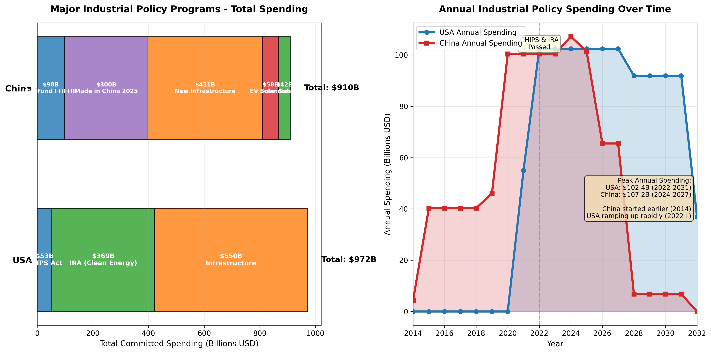
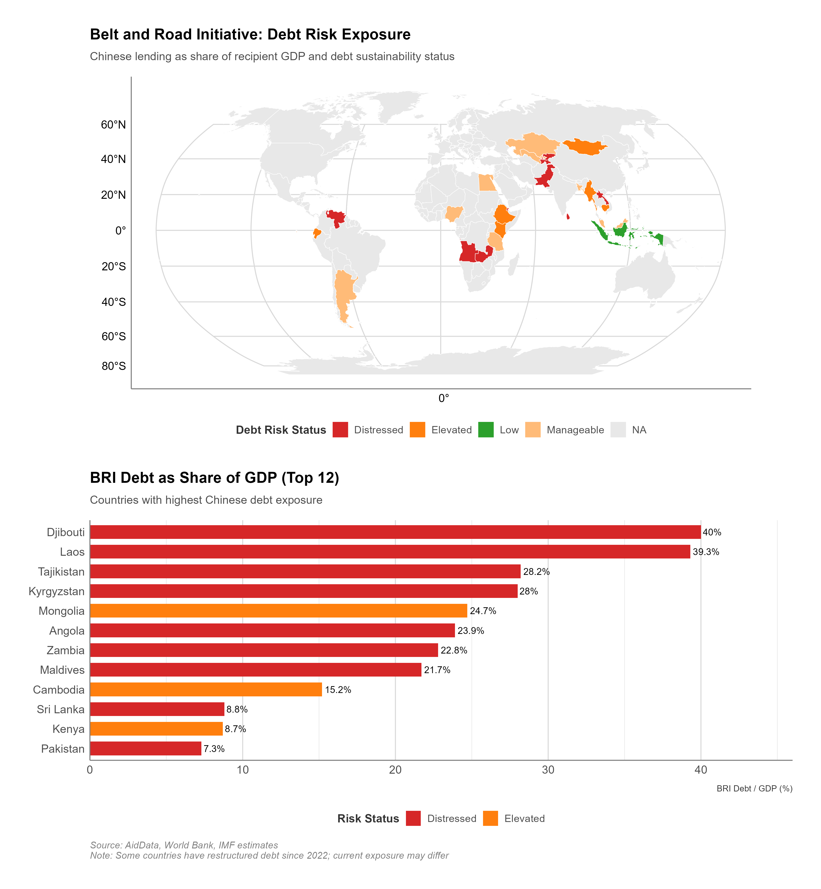
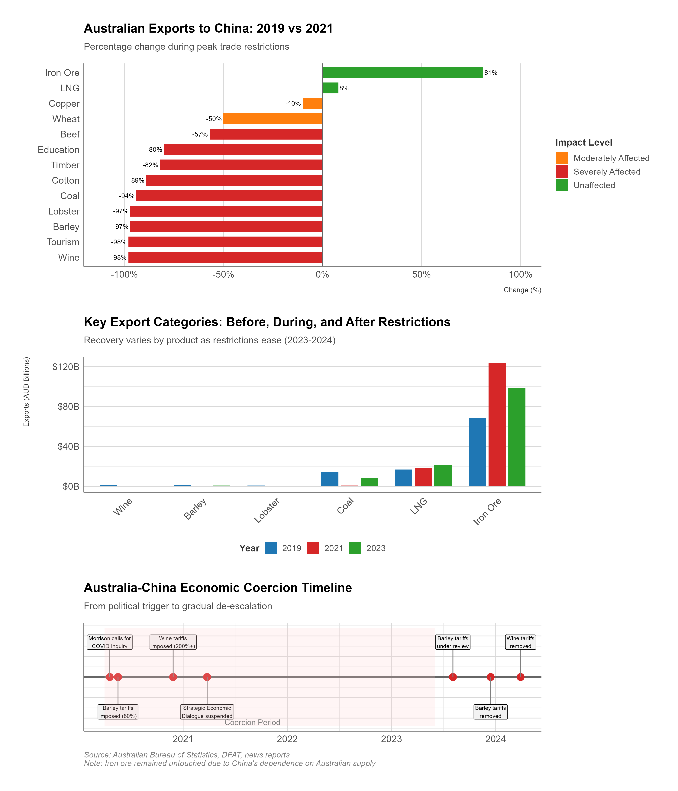

# Investment Screening, Industrial Policy, and Strategic Assets

## Executive Summary

On August 6, 2020, President Trump issued an executive order giving ByteDance, the Chinese parent company of TikTok, 45 days to divest the popular video-sharing app or face a complete ban in the United States. The order cited national security concerns: TikTok's collection of American users' data, algorithmic content curation controlled by a Chinese company potentially subject to Chinese government influence, and risks of Chinese intelligence exploitation of the platform's vast user base (100 million Americans, predominantly young).

ByteDance attempted negotiations, proposing technical solutions and partnership structures, but the Committee on Foreign Investment in the United States (CFIUS) determined that only complete divestment—selling TikTok's U.S. operations to American owners—would address security concerns. Four years and multiple legal battles later, TikTok remains Chinese-owned, operating under continued threat of forced sale or ban, illustrating both the expanded reach of U.S. investment screening authorities and the complexities of enforcing technology divestments.


**CFIUS (Committee on Foreign Investment in the United States)**: An interagency committee chaired by the Treasury Secretary that reviews foreign acquisitions of U.S. businesses for national security implications. CFIUS can recommend that the President block transactions or require divestment of existing investments.


The TikTok saga exemplifies a fundamental transformation in how advanced economies employ investment screening: once a passive, largely procedural review of foreign acquisitions for narrow national security concerns, investment review has evolved into an active tool of economic coercion targeting specific countries (primarily China), entire sectors (technology, critical infrastructure, data-intensive businesses), and even operating companies already established in domestic markets.


**Industrial Policy**: Government intervention in the economy to promote specific industries through subsidies, tax incentives, trade protection, directed credit, and other measures intended to accelerate development of strategic sectors and build domestic capabilities.


Simultaneously, governments have embraced industrial policy—direct state intervention through subsidies, mandates, and preferential treatment—to build domestic capabilities and reduce dependencies. The United States, long a champion of free markets and skeptic of industrial policy, has committed over $500 billion through the CHIPS and Science Act, Inflation Reduction Act, and Infrastructure Investment and Jobs Act (Rasser et al. 2022) to reshape semiconductor production, clean energy supply chains, and critical infrastructure.

China, meanwhile, continues its decades-long industrial policy regime through Made in China 2025, state-owned enterprise dominance, and the Big Fund semiconductor investments exceeding $100 billion. This dual transformation—weaponized investment screening and resurgent industrial policy—represents a decisive shift from market-driven globalization toward strategic economic competition. The invisible hand has been replaced by the visible fist.

This chapter examines how states employ investment controls and industrial policy as instruments of economic coercion, shaping capital flows, ownership structures, and industrial capabilities to serve strategic objectives. Three core arguments organize our analysis.

**First, investment screening has evolved from passive national security review to active economic coercion tool, particularly targeting Chinese investments in technology and critical infrastructure.** Traditional CFIUS review focused on narrow security concerns: preventing foreign control of defense contractors, protecting classified information, safeguarding critical infrastructure from sabotage. Applications were relatively rare, reviews largely procedural, and approvals common with modest mitigation measures.


**FIRRMA (Foreign Investment Risk Review Modernization Act)**: Landmark 2018 legislation that dramatically expanded CFIUS authority to review non-controlling investments in technology, infrastructure, and data sectors; mandated declarations for certain transactions; and added jurisdiction over real estate near sensitive facilities.


The 2018 Foreign Investment Risk Review Modernization Act (FIRRMA) fundamentally changed the game: expanding jurisdiction to cover non-controlling investments and early-stage ventures (previously outside CFIUS reach), mandating declarations for investments in "TID" sectors (Technology, Infrastructure, Data), and explicitly targeting critical emerging technologies (AI, quantum computing, biotechnology, hypersonics).

Post-FIRRMA, Chinese investment in U.S. technology plummeted from a 2016 peak of $45.6 billion to just $2.5 billion in 2024—a 95% decline (Rhodium Group 2024). This wasn't market forces but policy intent: investment screening became a mechanism for economic decoupling, preventing Chinese capital from accessing American innovation ecosystems.

**Second, industrial policy competition represents a return of state-directed capitalism, with both the United States and China deploying massive subsidies and mandates to reshape critical supply chains.** For decades, Western economic policy emphasized market efficiency, comparative advantage, and free trade—viewing industrial policy as distortionary, inefficient, and characteristic of failing developmental states. "The government shouldn't pick winners" was the mantra. Then China picked winners, and they won.

Targeted investments in strategic sectors (high-speed rail, renewable energy, telecommunications, semiconductors) enabled Chinese firms to achieve global leadership, often displacing Western competitors. The CHIPS and Science Act, committing $52 billion to semiconductor manufacturing and R&D, explicitly aims to reverse market-driven offshoring (Rasser et al. 2022) and rebuild domestic production despite higher costs.

The Inflation Reduction Act's $369 billion for clean energy similarly seeks to counter China's dominance in solar panels (80% global production), wind turbines (60%), and EV batteries (75%). This represents industrial policy on unprecedented scale: not just supporting nascent industries but attempting to reshore established supply chains through subsidies rendering uneconomic production economically viable. The effectiveness of such policies—whether they build sustainable capabilities or create dependency on perpetual government support—remains unproven, but the commitment is unmistakable.

**Third, informal economic coercion—state actions outside formal legal frameworks to impose costs on target economies—demonstrates that economic power operates beyond institutionalized sanctions and tariffs.** China's 2020-2021 economic pressure on Australia illustrates these dynamics: following Australia's call for an independent investigation into COVID-19 origins, China imposed de facto restrictions on Australian exports including wine (tariffs of 200%+), barley (80% tariffs), coal (unofficial import bans), lobster, timber, and beef—affecting over $20 billion in trade.

Notably, these restrictions operated through administrative measures, customs delays, and "quality concerns" rather than explicit government policies, providing plausible deniability while inflicting substantial economic pain. Australian wine exporters, deriving 95% of revenue from China, faced existential crisis. Yet Australia maintained its policy positions, sought alternative markets, and deepened security alignment with the United States.

This case demonstrates both the power of informal coercion (imposing costs without triggering WTO dispute mechanisms or formal retaliation frameworks) and its limitations (targets may absorb pain rather than concede, and market diversification reduces future leverage).

The chapter proceeds through four main sections. Section 1 examines **investment screening mechanisms**, analyzing CFIUS evolution, FIRRMA expansion, allied investment review systems, and effectiveness in blocking Chinese technology access. Section 2 explores **industrial policy competition**, comparing U.S. approaches (CHIPS Act, IRA, infrastructure) with China's model (Made in China 2025, Big Fund, SOE-directed development) and assessing prospects for success. Section 3 analyzes **state-owned enterprises and sovereign wealth funds** as strategic instruments, examining their role in technology acquisition, resource control, and state influence. Section 4 investigates **informal economic coercion**, using the Australia case to understand mechanisms, targets' responses, and implications for middle powers caught between superpowers.

Two Government Tools Boxes explain legal mechanisms. The first covers **CFIUS procedures and FIRRMA expansion**, detailing mandatory declarations, review timelines, mitigation measures, and forced divestments. The second examines **industrial policy authorities** including CHIPS Act implementation, Defense Production Act Title III, and tax incentives/procurement preferences.

Two case studies apply the analytical framework. Case Study 1 examines the **BIOSECURE Act and Chinese biotech firms**, analyzing U.S. legislative responses to genomics and pharmaceutical dependencies, industry impacts, and Chinese countermeasures. Case Study 2 details **Australian economic coercion (2020-2021)**, tracing China's trade restrictions, economic impacts, Australian responses, and lessons for middle powers navigating great power competition.

A Chinese Perspective Box explores Beijing's views on investment screening as discriminatory protectionism, industrial policy as legitimate development strategy, state-owned enterprises as tools for economic sovereignty, and informal coercion as Western hypocrisy. Key concepts include **industrial policy** (产业政策, chǎnyè zhèngcè), **state-owned enterprises** (国有企业, guóyǒu qǐyè), **reciprocity** (对等, duìděng), and **national champions** (国家冠军企业, guójiā guànjūn qǐyè).

This chapter's themes—investment screening as economic weapon, industrial policy's resurgence, informal coercion's power—reveal economic statecraft's evolution beyond traditional trade and financial tools. As Chapter 6 examined tariffs and export controls, and Chapter 7 analyzed financial sanctions, this chapter demonstrates that capital flows and industrial capabilities have become contested domains.

The implications extend beyond bilateral U.S.-China competition: allied countries face pressure to harmonize investment screening and industrial policies, developing nations navigate competing offers of development finance and technology transfer, and multinational corporations confront fragmenting markets where ownership, production location, and technology sourcing carry geopolitical implications.

Understanding these dynamics is essential for policymakers balancing economic efficiency against security imperatives, businesses navigating politicized markets, and analysts assessing the future of globalization.


**Chinese Strategic Concept: Belt and Road Initiative (一带一路)**

The BRI represents China's flagship foreign economic strategy, investing over $1 trillion in infrastructure across 140+ countries since 2013. From Beijing's perspective, BRI serves multiple objectives: securing resource supply chains, expanding export markets for Chinese construction capacity, promoting RMB internationalization, and building diplomatic relationships through development finance. Critics view BRI as "debt trap diplomacy" creating dependencies on Chinese lending, but Chinese officials counter that BRI provides infrastructure investment that Western institutions have failed to deliver.


<figure class="book-figure">
  
  <figcaption>Figure 8.1: Key Belt and Road Initiative infrastructure investments. Port investments (blue) extend Chinese maritime presence; rail projects (red) create overland connectivity; corridor investments (orange) integrate regional economies. Size indicates investment scale in USD billions.</figcaption>
</figure>

---

## Investment Screening - From Passive Review to Active Coercion


**National Security Review**: The process by which governments evaluate whether foreign investments in domestic companies or assets pose risks to national security. Reviews typically assess military implications, critical infrastructure vulnerabilities, technology transfer concerns, and potential foreign government influence over strategic sectors.


Investment screening—government review of foreign acquisitions and investments for national security implications—has existed for decades in most advanced economies. The United States established the Committee on Foreign Investment in the United States (CFIUS) in 1975, primarily to monitor OPEC petrodollar investments following the oil crises.

For most of its history, CFIUS operated as a relatively obscure interagency process: companies voluntarily notified proposed foreign acquisitions, government agencies reviewed for narrow security concerns (protecting classified information, preventing foreign control of defense contractors), and most transactions received approval, sometimes with mitigation measures. Rejections and forced divestments were rare. This passive, procedural approach reflected an era when foreign investment was generally welcomed as beneficial capital inflow, and national security concerns centered on traditional military threats. CFIUS was a sleepy backwater of bureaucracy. Then China came knocking with bags of money and shopping lists of technology companies.

The 2018 Foreign Investment Risk Review Modernization Act (FIRRMA) fundamentally reshaped the system, expanding CFIUS jurisdiction, mandating reviews of previously exempt transactions, and explicitly targeting Chinese investments in emerging technologies. Post-FIRRMA investment screening represents not passive review but active economic coercion: deliberately blocking Chinese capital from accessing American technology, even when transactions pose only speculative, long-term security risks rather than immediate threats. This section examines CFIUS evolution, FIRRMA's mechanisms, allied investment screening coordination, and effectiveness in achieving decoupling objectives.

### CFIUS Evolution: From OPEC to China

**Historical Origins and Traditional Approach (1975-2016)**

President Gerald Ford established CFIUS via Executive Order 11858 in 1975, primarily to monitor foreign investments amid concerns about OPEC nations recycling petrodollars into U.S. assets. The Committee, chaired by the Treasury Secretary and including Defense, State, Commerce, and Homeland Security, could review foreign acquisitions of U.S. companies and recommend that the President block transactions threatening national security. However, legal authority remained ambiguous until the Exon-Florio Amendment to the Defense Production Act (1988) explicitly granted the President authority to suspend or prohibit foreign acquisitions, mergers, or takeovers that threaten national security.

Through 2015, CFIUS operated with relatively limited scope and activity:

- **Voluntary jurisdiction**: Companies could choose whether to file CFIUS notices. Most foreign acquisitions proceeded without notification, and CFIUS reviewed only self-selected cases (typically where parties anticipated potential concerns and sought clearance).

- **Narrow security focus**: Reviews concentrated on traditional national security: defense contractors, classified programs, critical infrastructure vulnerable to sabotage (ports, telecommunications). Economic competitiveness, technology leadership, and data privacy were largely outside CFIUS purview.

- **Rare rejections**: From 2008-2015, CFIUS reviewed 770 transactions, investigated 111 (14%), and only 5 were withdrawn or prohibited—a 99%+ approval rate. Most cases received approval with mitigation measures: requiring corporate governance changes, limiting foreign personnel access to sensitive facilities, or implementing cybersecurity protocols.

- **Limited Chinese scrutiny**: Chinese investments grew dramatically from $1 billion annually (pre-2008) to $45.6 billion peak (2016), largely approved. High-profile acquisitions included Lenovo's purchase of IBM's PC business (2005), Chinese investments in U.S. real estate and entertainment (AMC Theatres, Legendary Entertainment), and technology sector venture capital.

**Awakening to Strategic Competition (2012-2016)**

Several developments triggered policy reassessment of Chinese investment:

**Technology transfer concerns**: U.S. intelligence assessments concluded that Chinese investments increasingly targeted dual-use technologies, particularly in semiconductors, aerospace, robotics, and AI. While individual investments appeared benign, cumulative effect transferred critical capabilities supporting Chinese military modernization and industrial policy goals.

**Huawei and ZTE telecommunications dominance**: Growing presence of Chinese telecommunications equipment in U.S. and allied networks raised security concerns about potential espionage, backdoors, and disruption capabilities. Congressional reports in 2012 recommended excluding Huawei and ZTE from U.S. critical infrastructure.

**Visible acquisition attempts**: China's 2016 attempt to acquire German semiconductor equipment maker Aixtron (blocked by U.S. intervention citing technology transfer concerns) and proposed acquisition of U.S. chipmaker Lattice Semiconductor (blocked by Trump 2017) demonstrated systematic targeting of technology chokepoints.

**Intellectual property theft campaigns**: Revelations of Chinese cyber espionage (APT1, APT10, APT41 as examined in Chapter 5) stealing hundreds of billions in IP demonstrated that while Chinese firms acquired some technology through investment, they also pursued systematic theft—raising questions about enabling access through permissive investment review.

By 2016-2017, bipartisan consensus emerged that existing CFIUS authorities were insufficient to address Chinese strategic investment targeting American technology leadership. This consensus culminated in FIRRMA, the most significant expansion of U.S. investment screening since Exon-Florio.

### FIRRMA 2018: Expanding the Net

The Foreign Investment Risk Review Modernization Act (FIRRMA), enacted August 13, 2018, dramatically expanded CFIUS jurisdiction (Jackson 2020), introduced mandatory filing requirements, and explicitly targeted emerging and foundational technologies. Key provisions transformed investment screening from passive review to active technology protection:

**Expanded Jurisdiction Beyond Controlling Investments**

Traditional CFIUS jurisdiction covered only transactions resulting in foreign "control" of U.S. businesses—typically defined as acquiring majority ownership or board control. FIRRMA expanded jurisdiction to cover non-controlling investments in specific sectors:

- **Non-controlling investments in TID sectors**: Foreign investments in U.S. businesses dealing with critical **Technology**, **Infrastructure**, or **Data** ("TID") now fall under CFIUS jurisdiction even without control. This captures minority stake investments, venture capital funding, and strategic partnerships previously beyond CFIUS reach.

- **Critical technology definition**: Investments involving businesses that produce, design, test, manufacture, fabricate, or develop critical technologies face CFIUS review. Critical technologies include:
  - Export-controlled items (including emerging and foundational technologies under Export Control Reform Act)
  - Nuclear facilities and materials
  - Select agents and toxins
  - Emerging technologies not yet subject to export controls but determined critical to national security (AI, quantum computing, biotechnology, hypersonics, robotics, brain-computer interfaces)

- **Critical infrastructure**: Investments in 28 infrastructure sectors (energy, telecommunications, transportation, water systems, healthcare, financial services) within the United States face heightened scrutiny.

- **Sensitive personal data**: Businesses maintaining or collecting sensitive data on U.S. citizens that could be exploited for intelligence purposes (genetic information, geolocation data, financial records, health data) now trigger jurisdiction.

**Mandatory Declarations**

Previously, CFIUS filings were voluntary—parties could choose whether to notify. FIRRMA introduced mandatory declarations for certain transactions:

- Foreign government-controlled investors acquiring substantial interest (25%+ voting rights) in TID businesses must file
- Transactions involving critical technologies subject to export controls require declarations
- Failure to file carries penalties and potential forced divestment even years after transaction completion

Mandatory declarations create a "short-form" filing (5 pages vs. 50-100 page full notices), with CFIUS responding within 30 days: cleared, request for full notice, or unilateral initiation of review. This mechanism forces disclosure of investments previously hidden from CFIUS.

**Real Estate Transactions**

FIRRMA added jurisdiction over foreign purchases or leases of real estate near sensitive locations:
- Military installations (within ranges determined by regulations)
- Government facilities involved in critical technologies, sensitive information, or national security functions
- Ports and airports

This addresses concerns about foreign surveillance infrastructure near military bases or intelligence facilities—for example, Chinese purchases of land near Air Force bases in Texas and North Dakota.

**Pilot Programs and Regulations**

Treasury implemented FIRRMA through phased rulemakings:
- November 2018: Critical technology pilot program mandating declarations for investments in 27 industry sectors
- February 2020: Final regulations establishing TID definitions, mandatory declarations, real estate jurisdiction
- Ongoing: Updates expanding critical technology definitions and covered transactions

**Increased Resources and Timelines**

FIRRMA authorized increased CFIUS staffing and funding (from ~20 full-time employees to 70+) and extended review timelines:
- Initial review: 45 days
- Investigation if concerns identified: 45 days
- Presidential decision: 15 days
- Total possible timeline: 105 days (previously 90 days)
- Extensions possible by mutual agreement

### Impact on Chinese Investment: Near-Total Collapse

<figure class="book-figure">
  
  <figcaption>Figure 8.2: Chinese FDI in U.S. and Europe (2008-2024)</figcaption>
</figure>

FIRRMA's impact on Chinese investment was immediate and severe. Chinese direct investment in the United States:

- **2016 (Pre-FIRRMA peak)**: $45.6 billion
- **2017**: $29.4 billion (declining as political sentiment shifted)
- **2018** (FIRRMA enacted): $5.4 billion
- **2019**: $5.0 billion
- **2020**: $3.8 billion
- **2021**: $5.1 billion
- **2022**: $2.8 billion
- **2023**: $2.6 billion
- **2024**: $2.5 billion (estimated)

This represents a **95% decline from peak**, with 2024 investment returning to levels last seen in 2004—before China's emergence as major global investor. The collapse extends across sectors but concentrates in technology:

**Technology sector**: Chinese VC investment in U.S. technology startups fell from $3.2 billion (2017) to less than $200 million (2024). Prominent Chinese VCs (Sequoia China, Hillhouse Capital) largely exited U.S. deals.

**Real estate**: Chinese purchases of U.S. commercial and residential real estate declined from $46.2 billion peak (2016) to approximately $3 billion (2024), driven partly by CFIUS concerns about properties near sensitive sites but also Chinese capital controls and economic slowdown.

**Entertainment and consumer sectors**: High-profile Chinese acquisitions of AMC Theatres, Legendary Entertainment, and other entertainment assets ended. Consumer sector deals (food, retail) also largely ceased.

**CFIUS Statistics Reflecting Increased Scrutiny**

<figure class="book-figure">
  
  <figcaption>Figure 8.4: CFIUS reviews and outcomes over time. The post-FIRRMA era shows increased scrutiny with more investigations, withdrawals, and mitigation agreements, particularly for Chinese transactions.</figcaption>
</figure>

CFIUS annual reports document transformed review patterns:

- **Total notices**: Declined from 237 (2016) to approximately 150-180 annually (2019-2024) as Chinese filings disappeared
- **Chinese transactions**: Comprised 23% of CFIUS reviews (2016) vs. 7-10% (2024)
- **Withdrawn transactions**: Chinese deals withdrawn or abandoned after CFIUS intervention rose from 1-2 annually (pre-2018) to 8-12 annually (post-FIRRMA)
- **Presidential blocks**: Rare but concentrated on Chinese deals (2012: Ralls wind farm project near naval base; 2017: Lattice Semiconductor; 2018: Broadcom-Qualcomm to prevent Huawei 5G advantage; 2020: TikTok)

**Forced Divestments**

Beyond blocking prospective deals, CFIUS gained aggressive enforcement of existing investments:

- **Grindr**: Chinese gaming company Kunlun required to divest Grindr (LGBTQ dating app) due to blackmail/espionage concerns from location and personal data. Divestment completed 2020.
- **PatientsLikeMe**: Chinese firm iCarbonX forced to divest health data platform
- **StayNTouch**: Chinese acquirer required to divest hotel management software accessing guest data
- **Multiple smaller divestitures**: CFIUS identified and unwound dozens of unreported transactions closed before FIRRMA, forcing retroactive review and divestment.

### Allied Investment Screening: Coordination and Divergence

The United States is not alone in expanding investment screening. European Union member states, United Kingdom, Australia, Japan, and other allies have implemented or strengthened foreign investment review mechanisms, driven by similar concerns about Chinese technology acquisition and critical infrastructure control. However, allied approaches reflect differing balances between economic openness and security protection, creating coordination challenges.

**European Union FDI Screening Regulation (2019)**

The EU implemented a framework for screening foreign direct investments in October 2020, establishing coordination among member states while preserving national sovereignty over investment decisions. Key features:

- **Voluntary national screening**: Member states may establish investment review mechanisms but aren't required to. As of 2024, 25 of 27 EU members have screening regimes, with varying scope and rigor.

- **Coordination mechanism**: When a member state reviews a transaction, other members and the European Commission can provide opinions if the investment affects their security interests or EU-wide projects (Horizon Europe research, Galileo satellite navigation, etc.)

- **Mandatory factors**: Screening must consider whether foreign investors are controlled by foreign governments, whether investors have been involved in activities affecting security in another member state, and risks to critical infrastructure, critical technologies, sensitive information, or media freedom.

- **No veto power**: The Commission and member states provide opinions, but the member state where the investment occurs makes the final decision. This preserves sovereignty but limits coordination effectiveness.

**Germany and France: Strictest EU Regimes**

Germany and France, as EU's largest economies and leading industrial powers, have implemented the EU's most comprehensive screening:

**Germany**:
- Foreign Trade and Payments Act amendments (2017, 2020, 2023) expanded screening beyond defense to critical infrastructure, media, healthcare, and food supply
- Lowered thresholds for mandatory review from 25% to 10% ownership for critical sectors
- Blocked Chinese acquisitions: Aixtron semiconductor equipment (2016), Leifeld Metal Spinning (machine tools, 2018), 50Hertz power grid operator (2018)
- But approved: Chinese acquisitions in automotive (Volvo/Geely, Daimler stakes), robotics (Kuka), and other sectors, demonstrating selective rather than blanket restrictions

**France**:
- 2019 PACTE law expanded sectors subject to screening to include AI, robotics, semiconductors, data storage, cybersecurity
- Blocked Chinese acquisitions of Photonis (night vision technology, 2021), though later partially reversed under appeal
- Maintains extensive screening but balances with economic openness—Chinese battery investments (Envision AESC) approved for electric vehicle supply chains

**United Kingdom: National Security and Investment Act (2022)**

The UK's NSI Act, effective January 2022, represents post-Brexit recalibration of investment policy:

- **Mandatory notification**: Acquisitions in 17 defined sensitive sectors (AI, quantum, semiconductors, nuclear, defense, communications) must be notified even for acquisitions as small as 15% ownership or material influence
- **Call-in powers**: Government can review any transaction in any sector if national security concerns exist, with retroactive reach up to 5 years
- **Volume**: Over 1,800 notifications in first two years, with ~1% subject to detailed review and handful blocked
- **Chinese focus**: Particularly scrutinizes Chinese investments in technology and infrastructure, though maintains openness to non-sensitive sectors

**Australia: FIRB and Critical Infrastructure**

Australia, geographically proximate to China and economically dependent on Chinese trade, faces acute tensions between economic interests and security concerns. The Foreign Investment Review Board (FIRB):

- 2021 reforms lowered thresholds for review, particularly for investments by foreign government entities (including SOEs)
- Expanded definition of national security businesses to include critical infrastructure, defense, telecommunications, data
- Critical Infrastructure Act (2021) grants government powers to direct operators of critical infrastructure (ports, energy, telecommunications, data centers) to mitigate security risks, even absent change of ownership
- Chinese reaction: Accusations of discriminatory treatment, contributing to bilateral tensions examined in Section 4

**Japan: Strengthened FISC Reviews**

Japan's Foreign Investment Screening Committee (FISC), operating under Foreign Exchange and Foreign Trade Act (FEFTA):

- 2019 amendments expanded covered sectors from 12 to 20, including semiconductors, pharmaceuticals, software
- Lowered notification threshold from 10% to 1% for sensitive sectors and foreign government-linked investors
- Streamlined "pre-clearance" process for trusted investors from allied countries
- Scrutinizes Chinese investments while facilitating Western capital—reflecting geopolitical alignment

**South Korea: Balancing Act**

South Korea faces particular difficulty balancing alliance with the United States against economic dependence on China (largest trading partner). Investment screening reflects this tension:

- National Security Investigation Act covers acquisitions in defense, dual-use technologies, critical infrastructure
- Applied selectively: blocks or mitigates concerning Chinese investments but avoids comprehensive restrictions
- Samsung and SK Hynix exemptions from U.S. semiconductor equipment export controls (Chapter 4) create reciprocal pressure to avoid overly restrictive investment screening
- Maintains substantially more open posture toward Chinese investment than U.S./Europe

**Coordination Challenges**

Allied investment screening coordination faces persistent obstacles:

1. **Divergent threat perceptions**: U.S. views Chinese technology acquisition as existential competition; European countries often see commercial opportunities; smaller allies balance economic dependence against security alignment

2. **Regulatory arbitrage**: Investors can target countries with weaker screening, or structure transactions to avoid triggers (using multiple jurisdictions, complex ownership structures, sequential transactions)

3. **Sovereignty sensitivities**: Investment screening historically national prerogative; countries resist ceding decision authority to multilateral bodies

4. **Economic costs**: Blocking foreign investment imposes costs (lost capital, jobs, technology transfer); costs fall unevenly depending on country's economic structure and alternatives

5. **Legal frameworks**: U.S. uses national security exception in WTO agreements; EU screening operates under EU law; coordination requires reconciling different legal bases and procedural requirements

The U.S.-EU Trade and Technology Council (TTC), Quadrilateral Security Dialogue (Quad: U.S., Japan, India, Australia), and G7 coordination mechanisms attempt to harmonize investment screening, but progress remains incremental.

### Effectiveness Assessment

Evaluating investment screening's effectiveness as economic coercion instrument requires applying the five criteria established in Chapter 1:

**1. Target Compliance**

Investment screening achieves high compliance: when CFIUS or allied authorities block or demand divestment, targets generally comply rather than risk presidential prohibition, sanctions, or legal penalties. The TikTok case illustrates both the difficulties and ultimate effectiveness of forced divestiture for already-operating businesses: ByteDance resisted through years of litigation and negotiation, but the January 2026 establishment of the TikTok USDS Joint Venture — with majority American ownership and Oracle-hosted infrastructure — demonstrated that even complex, politically charged divestitures can be resolved when backed by credible legislative force.

Compliance extends to voluntary transaction abandonment: when parties anticipate CFIUS rejection, they typically withdraw filings rather than proceeding to formal rejection. This "shadow" effect means visible statistics undercount actual effectiveness.

**2. Capability Degradation**

Investment screening demonstrably degrades Chinese technology acquisition capabilities:

- **95% reduction in U.S. investment** eliminates Chinese capital from American technology ecosystems
- **VC funding cutoff** prevents Chinese firms from early-stage access to startups developing emerging technologies
- **Forced divestitures** remove existing Chinese ownership of sensitive data and capabilities

However, degradation is partial:
- **Alternative acquisition methods**: Chinese entities pursue technology through partnerships below ownership thresholds, recruitment of talent, procurement of products (rather than companies), and cyber espionage
- **Non-U.S. investments**: Chinese capital increasingly targets European, Israeli, and emerging market technology, though allied coordination limits options
- **Indigenous development**: Investment restrictions spur Chinese self-reliance efforts (Chapter 4 semiconductor example), potentially building capabilities that reduce long-term dependence

**3. Economic Cost**

Costs fall asymmetrically:

**Target costs (China)**:
- Lost investment opportunities in world's most innovative technology ecosystem
- Forced divestitures incur financial losses (Grindr sale at distressed valuation)
- Reduced access to early-stage technologies limits future competitiveness
- Estimated economic cost: $40-50B in lost investment annually compared to 2015-2016 levels

**Coercer costs (United States)**:
- Lost foreign capital (though largely offset by other sources—European, Japanese, Canadian investment increased)
- Reduced competition in venture capital may inflate valuations
- Technology sector lobbying against restrictions creates political friction
- Estimated cost: Modest in aggregate but concentrated in specific sectors (biotechnology, semiconductors where Chinese capital significant)

**4. Sustainability**

Investment screening appears highly sustainable:
- **Strong political support**: Bipartisan consensus in U.S. Congress, political support in allied countries
- **Institutional capacity**: CFIUS, EU mechanisms, allied bodies now resourced and established
- **Legal clarity**: FIRRMA and allied legislation provide clear authorities and procedures

Sustainability risks include:
- **Allied coordination**: Requires ongoing diplomatic effort; political changes could fracture consensus
- **Legal challenges**: Targets contest authorities in courts (as ByteDance did before ultimately accepting the TikTok divestiture); adverse rulings could limit tools
- **Economic pressure**: Prolonged capital controls may generate business community opposition if costs rise or alternative capital sources prove insufficient

**5. Collateral Damage**

Collateral damage is moderate:
- **Friendly countries**: Investment screening targets Chinese and Russian investments but creates compliance burdens for all foreign investors; allied coordination mitigates but doesn't eliminate costs
- **U.S. businesses**: Startups lose potential investors, face longer fundraising timelines, and navigate regulatory complexity
- **Technology diffusion**: Restricting capital flows may slow global innovation diffusion, reducing benefits of international collaboration
- **Middle powers**: Countries like South Korea, Israel, and Southeast Asian nations face pressure to choose sides, limiting economic flexibility

**Overall Assessment**

Investment screening has proven remarkably effective in achieving its primary objective: dramatically reducing Chinese access to Western technology through capital markets. The 95% decline in U.S. investment and substantial reductions in Europe demonstrate capability degradation. Political sustainability appears strong, and collateral damage remains moderate. However, effectiveness in preventing Chinese technology development is less clear—restrictions spur indigenous innovation, alternative acquisition methods, and investments in non-allied technology ecosystems. Investment screening is a powerful coercion tool but not a comprehensive solution to strategic technology competition.

---

## Industrial Policy Competition - The Return of the State

For nearly four decades, Western economic policy embraced market-driven allocation of resources, viewing government industrial policy—directed subsidies, mandates, and preferences for specific industries—as inefficient distortions that reduce competitiveness. The Washington Consensus held that governments should establish rule of law, protect property rights, maintain macroeconomic stability, and otherwise let markets determine winners and losers.

China's spectacular rise through aggressive industrial policy challenged this orthodoxy. Now, facing strategic competition and supply chain vulnerabilities exposed by the pandemic and geopolitical tensions, the United States and Europe have embraced industrial policy on unprecedented scale, directly competing with China's state-directed model.

This section examines contemporary industrial policy competition, comparing U.S. and Chinese approaches, assessing early results, and evaluating prospects for success.

### U.S. Industrial Policy: CHIPS, IRA, and Infrastructure

**CHIPS and Science Act (August 2022)**

The Creating Helpful Incentives to Produce Semiconductors (CHIPS) and Science Act represents the United States' most significant industrial policy intervention in generations, committing $52.7 billion to rebuild domestic semiconductor manufacturing and R&D capabilities:

- **Manufacturing incentives**: $39 billion in direct grants and loans for fabrication facilities, with additional 25% investment tax credit
- **R&D investments**: $13.2 billion for semiconductor research, including National Semiconductor Technology Center, National Advanced Packaging Manufacturing Program, and expanded NSF/DOE research
- **Workforce development**: $500 million for semiconductor workforce training
- **Guardrails**: Recipients prohibited from expanding semiconductor manufacturing in China for 10 years ("guardrails" preventing subsidized firms from aiding Chinese competitors)

**Major projects announced** (as of 2024):
- **TSMC Arizona**: Two fabs producing 4nm and 3nm chips, $65 billion investment (with $6.6 billion CHIPS funding), targeting 2025-2028 production
- **Intel Ohio**: Two fabs for advanced logic chips, potential $100+ billion investment over decade ($8.5 billion CHIPS funding awarded)
- **Samsung Texas**: Expansion of Austin fab for advanced logic, ~$25 billion
- **Micron New York**: Two memory chip fabs, $100 billion investment over 20 years ($6.1 billion CHIPS funding)
- **GlobalFoundries**: Expansion of Malta, NY fab ($1.5 billion CHIPS funding)

**Challenges**:
- **Cost overruns**: U.S. fab construction costs 30-50% higher than Taiwan/Korea due to labor, regulatory, and materials costs
- **Talent shortages**: U.S. lacks sufficient semiconductor engineers, technicians; TSMC bringing Taiwan staff to Arizona
- **Technology lag**: Arizona TSMC fabs will produce chips 2-3 generations behind Taiwan leading edge
- **Subsidy dependency**: Without ongoing support, economics favor continued offshore production
- **Timeline delays**: Multiple projects behind schedule; TSMC Arizona delayed from 2024 to 2025-2026

**Inflation Reduction Act (August 2022)**

The IRA commits $369 billion to clean energy and climate programs, much of it functioning as industrial policy to counter Chinese dominance in renewable energy supply chains:

- **Solar and wind manufacturing**: Tax credits for U.S.-manufactured solar panels, wind turbines, and components
- **Electric vehicles**: $7,500 tax credit per EV, with requirements for North American assembly and battery component sourcing (excluding Chinese content)
- **Battery manufacturing**: $35/kWh production tax credit for battery cells, incentivizing domestic production
- **Critical minerals**: Loans and grants for domestic mining and processing of lithium, graphite, cobalt, rare earths
- **Green hydrogen**: Tax credits for clean hydrogen production

**Impact**:
- Over $100 billion in announced clean energy manufacturing investments since IRA passage
- Battery plant construction boom: Over a dozen plants announced in U.S. (LG, SK, Panasonic, Ford, GM)
- Solar manufacturing: First Solar, Hanwha Q Cells expanding U.S. production
- However, Chinese supply chain dominance (80% solar panels, 75% EV batteries) means transitioning to domestic production will take years, and Chinese firms may circumvent restrictions through third-country operations

**Infrastructure Investment and Jobs Act (November 2021)**

$1.2 trillion infrastructure bill includes industrial policy elements:
- $65 billion for broadband expansion
- $42 billion for bridge repair and replacement
- $39 billion for public transit modernization
- $7.5 billion for EV charging infrastructure
- "Buy America" provisions requiring domestic content for infrastructure projects

**Total U.S. Industrial Policy Commitment: ~$500 billion** across these three acts, representing fundamental shift from market-driven allocation to strategic state intervention.

### China's State-Directed Model: Made in China 2025 and Beyond

China has pursued aggressive industrial policy for decades, viewing state-directed development as essential for technological catch-up, economic security, and great power status. Current initiatives represent continuation and acceleration of long-standing approach.

**Made in China 2025 (2015)**

Announced in 2015, Made in China 2025 targets ten strategic industries for Chinese leadership:
1. New information technology (semiconductors, 5G, AI)
2. Robotics and automation
3. Aerospace and aviation equipment
4. Maritime engineering and high-tech ships
5. Advanced rail equipment
6. New energy vehicles and equipment
7. Power equipment (nuclear, renewables)
8. Agricultural machinery
9. New materials (rare earths, composites)
10. Biopharmaceuticals and medical devices

**Explicit self-sufficiency targets**:
- 40% domestic content by 2020
- 70% domestic content by 2025
- Global leadership in key sectors by 2049 (100th anniversary of PRC)

**Mechanisms**:
- **Subsidies**: Central and local government grants, loans at below-market rates, tax incentives totaling hundreds of billions
- **Government procurement**: Preferential purchasing of domestic suppliers
- **Technology transfer requirements**: Foreign firms seeking market access must partner with Chinese firms and transfer technology
- **SOE investments**: State-owned enterprises directed to invest in strategic sectors regardless of profitability
- **Venture capital**: Government-backed VC funds invest in startups in target sectors
- **Talent recruitment**: "Thousand Talents Plan" recruiting foreign scientists and engineers

**Western backlash**: Made in China 2025 triggered alarm in Washington and European capitals, contributing to shift toward industrial policy competition and export controls. After Trump administration criticism, China downplayed the program but didn't abandon underlying objectives.

**Big Fund I, II, and III: Semiconductor Focus**

China's National Integrated Circuit Industry Investment Fund (the "Big Fund") exemplifies state-directed capital allocation:

- **Big Fund I (2014)**: $21 billion, invested in SMIC, Hua Hong, Yangtze Memory (YMTC), packaging firms
- **Big Fund II (2019)**: $29 billion, focused on design tools (EDA), equipment manufacturing, materials
- **Big Fund III (2024)**: Estimated $47 billion, targeting advanced chips, AI processors, domestic equipment

**Results**:
- **Mixed success**: Chinese semiconductor industry expanded capacity dramatically, but technology gaps persist
- **SMIC achievements**: Demonstrated 7nm production (Huawei Mate 60 Pro chip) despite equipment restrictions, though yields reportedly low (40-50%)
- **Equipment struggles**: Chinese firms produce mature-node tools but lag 10-15 years in cutting-edge lithography, etching, deposition
- **Market share**: China's share of global semiconductor production capacity rose from 12% (2015) to 24% (2024), but concentrated in mature nodes (28nm and above); advanced node (14nm and below) share remains low
- **Efficiency questions**: Massive capital investment yielded progress but at high cost; multiple Big Fund corruption scandals (executives arrested for embezzlement) raise questions about allocation efficiency

### Comparing Approaches: Market-Driven vs. State-Directed

<figure class="book-figure">
  
  <figcaption>Figure 8.3: Industrial Policy Spending: U.S. vs China</figcaption>
</figure>

**U.S. Model: Strategic Industrial Policy within Market Framework**

- **Selective intervention**: CHIPS and IRA target specific chokepoints (semiconductors, batteries, critical minerals) rather than comprehensive planning
- **Private sector leadership**: Government provides incentives, but private firms make investment and production decisions
- **Technology neutrality (mostly)**: Tax credits and grants available to any firm meeting criteria, not picking specific companies
- **Sunset assumptions**: Programs have defined funding and timelines, not permanent subsidies (though likely to be extended)
- **Allied coordination**: Emphasizes friend-shoring and partner cooperation (TSMC, Samsung participation in U.S. fabs)

**Weaknesses**:
- **Short-term political cycles**: Industrial policy requires decades; U.S. political system struggles with sustained commitment
- **Cost competitiveness**: Even with subsidies, U.S. production often more expensive than Asian alternatives
- **Fragmented implementation**: Multiple agencies, federal-state coordination challenges, bureaucratic complexity
- **Private sector profit motives**: Companies may take subsidies but maintain primary production offshore if more profitable

**China Model: Comprehensive State Direction**

- **Sector-wide planning**: Made in China 2025 targets entire industries, not just chokepoints
- **SOE implementation**: State-owned enterprises execute government priorities regardless of short-term profitability
- **Long-term commitment**: Industrial policy spans decades with consistent resource allocation
- **Technology sovereignty**: Explicit goal of self-sufficiency, accepting higher costs for security
- **Central coordination**: Top-down direction reduces bureaucratic fragmentation

**Weaknesses**:
- **Inefficiency**: State-directed allocation often misallocates resources (Big Fund corruption, zombie companies sustained by subsidies)
- **Innovation deficits**: State planning struggles to match market-driven innovation; Chinese strengths in scaling production more than breakthrough R&D
- **Diminishing returns**: As China approaches technology frontier, state-directed catch-up becomes less effective
- **International resistance**: Industrial policy triggers Western countermeasures (export controls, investment screening, tariffs)

**Which approach will succeed?** Uncertain and likely sector-dependent. Semiconductors favor scale, capital intensity, and sustained investment (potentially China advantage). Biotechnology and AI favor entrepreneurial innovation and talent mobility (potentially U.S. advantage). Both countries face obstacles: U.S. must overcome short-term political pressures and cost disadvantages; China must address efficiency and innovation limitations. The competition will unfold over decades, not years.

<figure class="book-figure">
  
  <figcaption>Figure 8.6: Industrial Policy Comparison: U.S. and China Approaches</figcaption>
</figure>

---

## State-Owned Enterprises and Sovereign Wealth Funds as Strategic Instruments


**Chinese Strategic Concept: "Going Out" Strategy (走出去, zǒu chūqù)**

Launched in 1999 and accelerated after WTO accession in 2001, the "Going Out" strategy encourages Chinese enterprises to invest overseas, acquire foreign companies, and secure access to resources and technology. From Beijing's perspective, this represents natural economic development as Chinese firms grow internationally—similar to American and European multinationals' global expansion in previous decades. Chinese SOEs leading overseas investment are seen as national champions building China's global economic footprint, not instruments of state power projection.


State-owned enterprises (SOEs) and sovereign wealth funds (SWFs) function as extensions of government power in economic statecraft. Unlike private firms accountable primarily to shareholders and profit maximization, SOEs and SWFs pursue state strategic objectives—resource control, technology acquisition, geopolitical influence—sometimes accepting commercial losses for political gains. This section examines how states, particularly China, deploy these instruments as tools of economic coercion and strategic competition.

### Chinese SOEs: Scale and Strategic Role

China's state-owned enterprises dominate key sectors of its economy and increasingly operate globally as instruments of state policy. As of 2024:

- **157 centrally-managed SOEs** under State-owned Assets Supervision and Administration Commission (SASAC)
- **Combined assets**: Over $35 trillion (larger than many countries' GDP)
- **Employment**: 20+ million workers directly, tens of millions more in subsidiaries and supply chains
- **Sectors**: Energy (Sinopec, PetroChina, CNOOC), telecommunications (China Mobile, China Unicom, China Telecom), banking (ICBC, Bank of China, China Construction Bank), aerospace (AVIC, CASC), shipping (COSCO), nuclear (CNNC)

**Dual Mandate: Commercial and Political**


**Chinese Strategic Concept: State Capitalism (国家资本主义)**

Western analysts often frame Chinese economic policy as "state capitalism," implying deviation from proper market economics. Chinese officials reject this characterization, instead describing their system as "socialism with Chinese characteristics" where state guidance corrects market failures and serves national development goals. From this perspective, SOEs in strategic sectors (energy, telecommunications, finance, defense) ensure that critical capabilities serve national interests rather than foreign shareholders or short-term profit maximization. The debate reflects fundamentally different views on the proper relationship between state and market.


Chinese SOEs operate under dual mandate:

**Commercial objectives**: Profitability, efficiency, competitiveness (increasingly emphasized since Xi Jinping's SOE reforms requiring better performance)

**Political objectives**:
- Implementing industrial policy (Made in China 2025 sectors)
- Ensuring resource security (energy, minerals, food)
- Supporting Belt and Road Initiative infrastructure
- Advancing technology self-reliance
- Executing economic coercion when directed

<figure class="book-figure">
  
  <figcaption>Figure 8.7: Belt and Road Initiative: Debt Exposure by Region</figcaption>
</figure>

The tension between commercial and political objectives creates complexity: SOEs must generate profits to avoid becoming fiscal drains while simultaneously pursuing strategic goals that may not maximize returns.

**Resource Acquisition**

Chinese SOEs have aggressively acquired global resources to secure supply:

**Energy**:
- CNOOC's failed attempt to acquire Unocal (blocked by U.S. Congress, 2005)
- PetroChina investments in Canadian oil sands, Venezuelan heavy oil, African offshore fields
- Strategic petroleum reserves stockpiling (world's second-largest after U.S.)

**Mining and Minerals**:
- Chinalco's stake in Rio Tinto (2008-2009, ultimately reduced after political resistance)
- Multiple acquisitions of lithium, cobalt, rare earth, copper mines in Latin America, Africa, Australia
- China Molybdenum acquisition of cobalt mine in DRC

**Agriculture**:
- ChemChina acquisition of Syngenta (Swiss agribusiness, $43 billion, 2017)
- COFCO investments in grain trading and processing globally
- Farmland acquisitions in Africa, South America, Eastern Europe (though facing resistance)

**Technology Acquisition**

SOEs serve as vehicles for accessing foreign technology:
- Joint venture requirements force foreign firms to partner with Chinese SOEs and transfer technology
- Huawei's relationship with state (government contracts, financial support) enables global telecommunications expansion
- AVIC (aviation SOE) partnerships with Boeing, Airbus, GE to acquire aerospace technology
- CRRC (rail SOE) acquisitions of foreign rail manufacturers

### Sovereign Wealth Funds as Investment Vehicles

**China Investment Corporation (CIC)**

Established 2007 with $200 billion initial capital (now ~$1.4 trillion AUM), CIC invests China's foreign exchange reserves:
- Portfolio includes stakes in Blackstone, Morgan Stanley, commodity firms, infrastructure
- Increasingly focused on technology and strategic sectors
- Subject to CFIUS and allied investment screening, limiting U.S./European access

**Other Chinese SWFs**:
- SAFE Investment Company ($1+ trillion, manages forex reserves)
- National Social Security Fund ($440 billion, domestic focus)

**Compared to other major SWFs**:
- Norway Government Pension Fund: $1.4 trillion (ethical guidelines, transparent)
- Abu Dhabi Investment Authority: ~$700 billion
- Singapore GIC: ~$700 billion, Temasek: ~$280 billion

Chinese SWFs operate with less transparency than Norwegian/Singaporean counterparts, raising Western concerns about strategic rather than purely commercial motivations.

### Western Responses: Reciprocity and Screening

**Reciprocity Arguments**

U.S. and European critics argue for reciprocal market access: if Chinese SOEs invest freely in Western markets while Chinese markets remain restricted to foreign firms, this creates asymmetric advantages. Proposals include:

- **Conditional market access**: Deny Chinese SOE acquisitions unless China opens equivalent sectors to Western firms
- **Subsidies countervailing**: Treat Chinese SOE advantages from subsidized financing as unfair trade requiring countervailing duties
- **WTO reforms**: Strengthen disciplines on SOEs to prevent distortionary advantages

**Investment Screening** (covered in Section 1)

CFIUS and allied mechanisms increasingly target SOE investments:
- SOE-controlled investors face mandatory declarations for TID sectors
- Presumption of government control raises security concerns
- Several high-profile SOE acquisitions blocked: CNOOC-Unocal (2005), State Grid-AES wind farms (2012)

**SOE Reform Pressure**

Western governments and multilateral institutions pressure China to reform SOEs:
- IMF, World Bank, OECD all recommend reducing SOE role, subjecting them to market disciplines
- U.S.-China trade negotiations include SOE subsidy reduction demands
- China has consolidated, merged, and partially privatized some SOEs but retains strategic control

---

## Informal Economic Coercion - The Australia Case

Formal economic coercion operates through institutionalized mechanisms: CFIUS decisions, tariffs under Section 301, OFAC sanctions. Informal coercion employs state power outside formal frameworks—customs delays, regulatory harassment, unofficial import restrictions, consumer boycotts encouraged by state media—to impose costs while maintaining plausible deniability. China's 2020-2021 economic pressure on Australia exemplifies informal coercion dynamics: how it operates, why targets struggle to respond, and implications for middle powers navigating great power competition.

### Background: COVID-19 Investigation and Bilateral Tensions

**April 2020: Australia's COVID Origins Call**

On April 19, 2020, Australian Foreign Minister Marise Payne called for an independent international investigation into COVID-19 origins, including China's initial response in Wuhan. Prime Minister Scott Morrison amplified the call, comparing it to "weapons inspectors" investigating the pandemic. The proposal, though supported by many countries, particularly angered Beijing:

- **Timing**: During peak of pandemic when China faced international criticism for initial cover-ups, silencing whistle-blowers (Dr. Li Wenliang), and delayed WHO notification
- **Terminology**: "Weapons inspectors" language evoked Iraq WMD inspections, implying coercive intrusion
- **Motives**: Australia had strengthened Five Eyes intelligence cooperation, banned Huawei from 5G networks (2018), and increased criticism of Chinese influence operations—COVID investigation seen as part of broader confrontational approach

**Chinese Official Responses**

Chinese officials and state media delivered warnings:
- Chinese Ambassador to Australia Jingye Chen warned of consumer boycotts if investigation proceeded
- Global Times (state media) published articles threatening economic consequences
- Chinese Foreign Ministry spokesman condemned Australia's "political manipulation"

### Economic Restrictions: Sectors Targeted

Beginning May 2020, China imposed de facto restrictions on multiple Australian export sectors. Critically, these operated through administrative measures and unofficial guidance rather than formal tariff or ban announcements:

**Barley (May 2020)**
- **Action**: China imposed 80.5% anti-dumping and countervailing duties on Australian barley
- **Impact**: Australian barley exports to China fell from $1.5 billion annually to near zero
- **Nominal justification**: Dumping investigation initiated 2018, but decision timing clearly political
- **Australian response**: WTO dispute initiated (ultimately successful in 2024, with China removing tariffs)

**Beef (May-September 2020)**
- **Action**: Four major Australian beef processors lost export licenses for "labeling violations," later expanded to more facilities
- **Impact**: Reduced but didn't eliminate Australian beef exports (other facilities continued, though facing delays)
- **Justification**: Technical compliance issues (labeling, health certificates)

**Wine (November 2020)**
- **Action**: Anti-dumping duties of 107-212% on bottled Australian wine
- **Impact**: Australian wine exports to China collapsed from $1.2 billion (2019) to $12 million (2021)—99% decline. For Australian wineries, China had been largest export market (39% of exports).
- **Devastating sector impacts**: Treasury Wine Estates, Pernod Ricard Australia, and many smaller wineries faced revenue collapse, lay-offs, discounted inventory

**Coal (October 2020-2022)**
- **Action**: Unofficial import restrictions—Australian coal ships stuck at Chinese ports for months without customs clearance
- **Impact**: Australian coal exports to China fell from $14 billion (2019) to $2.4 billion (2020) to near-zero (2021)
- **No formal announcement**: Chinese officials denied restrictions; customs simply delayed or rejected clearances for unspecified "quality concerns"
- **Strategic dimensions**: Coal restrictions hurt Australian exports but also created Chinese domestic energy shortages (winter 2020-2021 power crises), demonstrating costs of coercion

**Lobster, Timber, Copper**
- Lobster: Customs delays leading to spoilage of live lobsters at airports
- Timber: Import restrictions citing pest concerns
- Copper ore and concentrates: Some restrictions and delays

### Australian Responses and Economic Impact

<figure class="book-figure">
  
  <figcaption>Figure 8.5: Australian exports to China during the 2020-2022 trade restrictions. Wine and barley were severely affected (over 95% decline), while iron ore remained untouched due to China's dependence on Australian supply. Restrictions began easing in 2023.</figcaption>
</figure>

**Economic Costs**

Cumulative trade impact estimated $20+ billion in affected exports over 2020-2022. However:
- **Diversification partially mitigated**: Australian exporters found alternative markets (U.S., UK, Southeast Asia for wine; India, Japan, Korea for coal)
- **Commodity prices**: Strong demand for iron ore, coal, and LNG (not restricted) meant Australia's overall trade balance remained positive
- **Sector-specific pain**: Wine, barley, lobster industries suffered concentrated losses; regional economies dependent on these exports faced severe hardship

**Policy Responses**

**No policy reversal**: Australia maintained its positions:
- Continued calling for COVID-19 investigation
- Upheld Huawei 5G ban
- Strengthened foreign interference legislation targeting Chinese influence
- Deepened Five Eyes and Quad security cooperation
- Announced AUKUS nuclear submarine partnership with U.S. and UK (September 2021)

**Market diversification**:
- Wine industry shifted to U.S., UK, Southeast Asian markets
- Coal exporters increased sales to India, Japan, South Korea
- Barley found buyers in Middle East, Southeast Asia
- Government Export Market Development Grants supported diversification

**WTO disputes**:
- Challenged Chinese barley duties at WTO (successful 2024)
- Prepared but didn't file wine dispute (bilateral relations thawing by 2023)

**Closer U.S. alliance**:
- AUKUS represented dramatic deepening of security ties
- U.S. diplomatic support for Australia during Chinese pressure
- Economic resilience strengthened through broader Indo-Pacific partnerships

### Easing of Restrictions (2023-2024)

Following Chinese leadership transition dynamics and Australian government change (Labor Party's Anthony Albanese elected May 2022), bilateral relations gradually stabilized:

- **Barley**: Duties removed August 2023 after Australia suspended WTO case
- **Wine**: Duties under review with indications of removal by 2025
- **Coal**: Informal restrictions eased 2023; exports resumed
- **Ministerial engagement**: High-level visits resumed after three-year freeze

**Why did China ease pressure?**

Several factors:
1. **Limited effectiveness**: Australia didn't reverse policies; restrictions imposed costs on China (energy shortages, forfeited revenue)
2. **Diversification**: Australian exporters found alternative markets, reducing future leverage
3. **Reputational costs**: China's coercion alarmed other middle powers, driving them toward U.S. alignment
4. **Broader strategy shift**: China sought to reduce tensions with multiple countries simultaneously (also stabilizing relations with Japan, South Korea, EU)

### Lessons: Informal Coercion Dynamics

**Mechanisms**

Informal coercion operates through:
- **Administrative discretion**: Customs delays, regulatory harassment, licensing revocations for ostensible technical violations
- **Plausible deniability**: No formal government announcements; officials deny political motives
- **Sector selectivity**: Target economically significant exports while avoiding escalation (iron ore untouched because China depends on Australian supply)
- **State media amplification**: Nationalist sentiment, consumer boycott encouragement

**Advantages**

- **Avoids WTO constraints**: Informal measures harder to challenge than explicit tariffs or quotas
- **Flexibility**: Easily escalated or de-escalated without formal policy reversals
- **Deniability**: Diplomatic relations can continue while economic pressure applied

**Limitations**

- **Market diversification**: Targets can find alternative buyers, reducing long-term leverage
- **Domestic costs**: Restrictions harm Chinese consumers and industries (coal shortages)
- **Reputational damage**: Visible coercion drives other countries toward rival alliances
- **Targets may not comply**: Australia accepted economic pain rather than concede sovereignty

**Middle Power Implications**

Australia's experience demonstrates challenges facing middle powers:
- **Asymmetric economic dependence**: China was Australia's largest trading partner (35% of exports); Australia represented smaller share of Chinese trade
- **Security vs. economics trade-off**: Maintaining sovereignty and security alignment with U.S. required accepting economic costs
- **Alliance value**: U.S. and allied support (diplomatic, security deepening via AUKUS) helped Australia withstand pressure
- **Resilience through diversification**: Market access to U.S., Europe, Japan, India, Southeast Asia provided alternatives

For countries like South Korea, ASEAN states, and others with high China trade dependence but security interests aligned with U.S., Australia's experience offers cautionary lessons: economic coercion is real, painful, but survivable with diversification and allied support.

---

## Chinese Perspective Box: Industrial Policy, SOEs, and Reciprocity

*This perspective box presents Chinese government and elite viewpoints on investment screening, industrial policy, state-owned enterprises, and informal coercion. Understanding these perspectives is essential for strategic empathy—recognizing how policies appear from Chinese vantage point, even while maintaining Western analytical frameworks.*

**Industrial Policy as Legitimate Development Tool (产业政策, chǎnyè zhèngcè)**

From Beijing's perspective, Chinese industrial policy represents legitimate catch-up development strategy employed by successful late industrializers from 19th century Germany to post-WWII Japan and South Korea. Key arguments:

**Historical precedent**: Every major economy employed industrial policy during development. The United States protected infant industries through tariffs (1800s), funded railroad construction, supported aerospace and internet development through military contracts (ARPANET, GPS), and currently subsidizes agriculture massively. For Washington to condemn Chinese industrial policy while deploying CHIPS Act and IRA subsidies exemplifies hypocrisy.

**Development imperative**: China remains middle-income country ($13,000 per capita GDP vs. $70,000 U.S.) seeking to escape "middle-income trap" where countries stagnate before reaching high-income status. Industrial policy targeting strategic sectors (semiconductors, aerospace, pharmaceuticals) represents rational development strategy, not unfair competition.

**Technology sovereignty (科技主权, kējì zhǔquán)**: Chinese experience of Western embargoes (CoCom during Cold War, post-Tiananmen sanctions, contemporary semiconductor export controls) demonstrates that relying on foreign technology creates vulnerability. Indigenous innovation through state support ensures China cannot be "strangled" (卡脖子, qiǎ bózi—"strangled at the neck") by foreign technology denial.

**"Dual circulation" (双循环, shuāng xúnhuán)**: Xi Jinping's dual circulation strategy emphasizes domestic self-sufficiency (internal circulation) while maintaining international engagement (external circulation). Industrial policy enables internal circulation by building domestic capabilities in critical sectors, reducing dependence on potentially hostile foreign suppliers.

**State-Owned Enterprises as Strategic Instruments (国有企业, guóyǒu qǐyè)**

Chinese perspectives on SOEs emphasize their role in national economic security and strategic objectives:

**Economic stability**: SOEs provide countercyclical investment during downturns, employ workers for social stability, and invest in infrastructure with long payback periods that private firms avoid. During 2008 financial crisis, Chinese SOE infrastructure spending helped sustain growth while Western economies contracted.

**National champions (国家冠军企业, guójiā guànjūn qǐyè)**: SOEs in telecommunications (Huawei, ZTE), energy (Sinopec, PetroChina), and aerospace (COMAC) compete globally against established Western firms. State support helps Chinese firms achieve scale and technical capabilities to challenge incumbent monopolies.

**Strategic sectors**: Defense, nuclear energy, grid infrastructure, telecommunications networks require state control for national security. Allowing foreign or purely profit-driven private ownership in these sectors would create unacceptable vulnerabilities.

**Reform and efficiency**: Chinese government acknowledges SOE efficiency challenges and has implemented reforms: consolidating SOEs, introducing private capital into mixed-ownership enterprises, requiring profitability improvements, and disciplining poor performers. However, strategic control remains non-negotiable.

**Western investment screening as discriminatory protectionism (歧视性保护主义, qíshì xìng bǎohù zhǔyì)**

Chinese analysts view FIRRMA and allied investment screening as:

**Violating market principles**: The United States long championed free markets and foreign investment openness, criticizing protectionism. CFIUS expansion represents abandoning these principles when Chinese firms achieve competitiveness.

**Discriminatory targeting**: Investment screening ostensibly applies to all foreign investors but disproportionately affects Chinese firms. De facto country-specific restrictions violate non-discrimination principles and WTO national treatment obligations.

**Moving goalposts**: When Chinese firms acquired technology through market-based transactions (investments, acquisitions), Western countries retroactively deemed this threatening and changed rules (FIRRMA). This "rules-based order" only operates when rules favor Western interests.

**Reciprocity demands (对等, duìděng) as unreasonable**

Western calls for reciprocal market access ignore development stage differences:

**Development stage**: China as developing country reasonably maintains SOE presence and foreign investment restrictions to protect nascent industries, similar to Western countries during their industrialization. Demanding China immediately match U.S. openness ignores this context.

**Sectoral sensitivities**: Every country restricts foreign investment in sensitive sectors (U.S. restricts defense, telecommunications, energy). China's restrictions may be broader but reflect legitimate security concerns, particularly given Western containment strategy.

**Incremental opening**: China has substantially opened markets since WTO accession (2001): eliminated joint venture requirements in many sectors, opened finance and insurance, reduced tariffs dramatically. Western demands for faster opening ignore progress achieved.

**Informal coercion: Western double standards**

Regarding Australia case and similar episodes:

**Legitimate trade measures**: Anti-dumping duties on Australian barley and wine followed proper procedures (investigations, findings of dumping/subsidies). That decisions coincided with political tensions doesn't prove political motivation—timing may be coincidental or reflect genuine trade concerns.

**Western sanctions more severe**: U.S. and European sanctions freeze assets, cut off entire countries from financial systems (Russia, Iran, Venezuela), impose secondary sanctions forcing third parties to comply. Chinese trade measures affecting specific sectors while maintaining overall economic relations appear mild by comparison.

**Australia's provocations**: Australia's calls for COVID investigation using "weapons inspector" language, Huawei ban, foreign interference legislation targeting Chinese community, and AUKUS nuclear submarine deal all represented hostile actions. That China responded through trade policy merely reflects normal state behavior protecting interests.

**Selective outrage**: When U.S. imposes tariffs on Chinese goods (Section 301), blocks Chinese investments (CFIUS), and sanctions Chinese entities (Entity List, SDN), Washington frames these as legitimate national security measures. When China responds through trade restrictions, Western media condemns "economic coercion." This double standard reflects unwillingness to accept that China can employ similar tools.

**Synthesis: Chinese Elite Consensus**

Despite internal debates about economic policy details, Chinese elite consensus holds:

1. **Industrial policy is essential**: Market forces alone cannot build capabilities in strategic technologies where established Western firms dominate; state support is necessary and legitimate
2. **State economic role must continue**: SOEs, government guidance, and capital allocation serve strategic purposes that pure market allocation would not achieve
3. **Western containment requires self-reliance**: Technology controls, investment screening, and alliance coordination demonstrate Western intent to prevent Chinese development; indigenous innovation is survival imperative
4. **Reciprocity demands are premature**: China's development stage and security concerns justify maintained restrictions; Western countries protected their economies during similar development stages
5. **Economic coercion is mutual**: If U.S. can employ export controls, investment restrictions, and sanctions for national security, China can use trade policy for similar purposes

Understanding these perspectives doesn't require accepting their validity—significant criticisms exist regarding SOE inefficiency, technology theft beyond market acquisition, and Chinese coercion targeting. However, recognizing Chinese reasoning illuminates why U.S.-China economic competition intensifies: both sides view their policies as defensive responses to adversary aggression, creating escalation dynamics resistant to resolution.

---

## Government Tools Box 1: CFIUS Procedures and FIRRMA Expansion

**Legal Authority**

- **Primary statute**: Section 721 of the Defense Production Act of 1950, as amended
- **Major amendments**:
  - Exon-Florio Amendment (1988): Granted President authority to block foreign acquisitions
  - FINSA 2007: Codified CFIUS procedures, required Congressional notification
  - FIRRMA 2018: Expanded jurisdiction, mandatory declarations, added real estate and TID sectors

**Committee Composition**

CFIUS consists of nine voting members (Cabinet-level):
- Treasury (Chair)
- Defense
- State
- Commerce
- Homeland Security
- Justice
- Energy
- Office of Science and Technology Policy
- U.S. Trade Representative

Plus non-voting members: Office of Management and Budget, Council of Economic Advisers, National Security Council

**Covered Transactions**

Traditional CFIUS jurisdiction:
- **Control transactions**: Foreign person acquiring control of U.S. business

FIRRMA expanded jurisdiction:
- **Non-controlling TID investments**: Foreign person (especially government-controlled) acquiring non-controlling interest in Technology, Infrastructure, or Data (TID) U.S. business
- **Real estate**: Foreign person purchasing/leasing real estate near sensitive facilities
- **Change in foreign investor rights**: Modifications to existing investments expanding foreign access

**Review Process**

**1. Voluntary Notice or Mandatory Declaration**

- **Voluntary notice**: Parties may file if seeking CFIUS clearance
- **Mandatory declaration** required for:
  - Foreign government substantial interest (25%+) in TID business
  - Critical technology companies where foreign person gains specific rights
  - Failure to file mandatory declaration results in penalties and potential forced divestment

**2. Initial Review (45 days from acceptance)**

- CFIUS members review for national security concerns
- Three outcomes:
  - **Cleared**: Transaction proceeds without conditions
  - **Mitigation agreement**: Conditions imposed (governance structures, security protocols, data protections)
  - **Investigation**: Proceed to Phase II

**3. Investigation (45 days)**

- Detailed interagency assessment
- Parties provide additional information
- Mitigation negotiations
- Outcomes:
  - Cleared with or without mitigation
  - Parties withdraw (often indicates anticipated block)
  - Proceed to Presidential decision

**4. Presidential Decision (15 days)**

- President may:
  - Approve transaction
  - Approve with conditions
  - Block transaction
  - Require divestment (if already closed)

**5. Post-Transaction Monitoring and Enforcement**

- CFIUS can review non-notified transactions (5-year look-back)
- Monitor compliance with mitigation agreements
- Enforce through penalties, divestment orders

**Mitigation Measures**

Common mitigation approaches:
- **Board governance**: Independent directors, government observers, foreign person voting restrictions
- **Data security**: Firewalls preventing foreign access to sensitive information
- **Physical security**: Limiting foreign personnel access to facilities
- **Export controls**: Enhanced compliance programs
- **Annual certifications**: Ongoing reporting requirements
- **Violation consequences**: Fines, divestment, criminal penalties

**Statistics (2024)**

- **Total filings**: ~150-180 annually
- **Investigation rate**: ~15-20% of notices proceed to Phase II
- **Withdrawal rate**: ~5-10% (often indicating anticipated blocks)
- **Presidential blocks**: Rare (<5 since 2012), but shadow effect means parties withdraw before formal decision
- **Mitigation agreements**: ~20-30 annually

**FIRRMA Impact**

Post-FIRRMA changes:
- **Mandatory declarations**: 200-300 annually (new category)
- **Increased staff**: From ~20 to 70+ FTEs
- **Longer timelines**: Average case duration increased from 60 days to 80+ days
- **Chinese transaction collapse**: From 23% of cases (2016) to 7-10% (2024)

**Challenges and Criticisms**

- **Lack of transparency**: CFIUS decisions classified; limited public explanation
- **Resource constraints**: Despite increases, staff struggles with volume and complexity
- **Interagency disagreements**: Members occasionally divide on risk assessments
- **Legal uncertainty**: Scope of "national security" undefined, creating unpredictability
- **Allied tensions**: Extraterritorial reach (blocking foreign-to-foreign deals with U.S. nexus) causes friction

---

## Government Tools Box 2: Industrial Policy Authorities

**CHIPS and Science Act Implementation**

**Legal authority**: Public Law 117-167 (August 2022)

**Implementing agencies**:
- **Department of Commerce** (primary): CHIPS Program Office administers manufacturing incentives
- **National Science Foundation**: R&D investments
- **Department of Energy**: Materials research, workforce development
- **Department of Defense**: Trusted foundry program

**Funding mechanisms**:
- **Direct grants**: Awarded through application process to qualified semiconductor projects
- **Loans and loan guarantees**: Up to $75 billion via Commerce Department
- **Investment tax credit**: 25% advanced manufacturing investment tax credit (IRS administered)

**Guardrails**:
- **China restrictions**: Recipients prohibited from expanding semiconductor manufacturing in China for 10 years
- **Excess profits clawback**: If projects exceed projected profits significantly, government may recoup portion
- **Transparency requirements**: Recipients must report financials, employment, production

**Review and approval process**:
1. Company submits application detailing project scope, investment, jobs, technology node
2. Commerce Department evaluates: Economic and national security benefits, financial viability, guardrail compliance
3. Conditional award negotiated (subsidies, conditions, milestones)
4. Environmental reviews, community engagement
5. Final award and disbursement tied to construction/production milestones

**Defense Production Act Title III**

**Legal authority**: 50 U.S.C. § 4501 et seq., Title III

**Purpose**: Expand productive capacity and supply for national defense critical materials and technologies

**Mechanisms**:
- **Purchase commitments**: Government commits to purchase materials/products to incentivize production
- **Loans and loan guarantees**: Finance expansion of production capacity
- **Technological and production expansion**: Support development of new production techniques

**Recent applications**:
- **Semiconductors**: Title III investments in domestic chip production before CHIPS Act
- **Critical minerals**: Rare earths, lithium, graphite mining and processing
- **Pharmaceuticals**: API production capacity post-COVID
- **Defense industrial base**: Munitions, shipbuilding, aerospace components

**Administration**: Department of Defense, Department of Energy (for nuclear materials)

**Inflation Reduction Act Industrial Components**

**Legal authority**: Public Law 117-169 (August 2022)

**Clean energy manufacturing incentives**:
- **Advanced Manufacturing Production Credit**: $35/kWh for battery cells, $10/kWh for modules
- **Solar/wind component credits**: Domestic content bonuses for U.S.-manufactured components
- **Critical mineral sourcing**: Requirements for North American or free-trade agreement partner sourcing

**Electric vehicle credits**:
- **Consumer credits**: $7,500 per vehicle, conditioned on North American assembly and battery component/mineral sourcing requirements
- **Commercial vehicle credits**: $40,000 for heavy vehicles, similar sourcing requirements

**Implementation**: IRS (tax credits), Department of Energy (loan programs), Treasury (guidance on sourcing requirements)

**Buy America Provisions**

Various statutes require federal procurement and federally-funded projects use domestically manufactured goods:
- **Infrastructure Investment and Jobs Act**: Buy America requirements for infrastructure projects
- **Berry Amendment**: Defense Department procurement must use U.S.-manufactured items
- **Trade Agreements Act**: Federal procurement restricted to designated countries (excluding China)

**Implementation challenges**:
- **Domestic unavailability waivers**: Many products not manufactured domestically require waivers
- **Cost thresholds**: Domestic content requirements vary (often 55-60% domestic content)
- **Enforcement limitations**: Tracking supply chains and verifying compliance difficult

**Coordinating Mechanisms**

**U.S.-EU Trade and Technology Council (TTC)**:
- Coordinates industrial policy, investment screening, export controls
- Working groups on semiconductors, AI, clean technology
- Goal: Align allied subsidies to avoid subsidy races and coordinate China policies

**Indo-Pacific Economic Framework (IPEF)**:
- Supply chain resilience pillar coordinates friend-shoring
- Critical mineral and semiconductor cooperation
- Limited participation (not comprehensive trade agreement)

**Multilateral export control regimes** (Wassenaar, etc.): Coordinate advanced technology export restrictions (covered in Chapter 6)

---

## Case Study 1: BIOSECURE Act and Chinese Biotech

**Background: Genomics and Pharmaceutical Dependencies**

U.S. healthcare and pharmaceutical industries rely heavily on Chinese biotechnology companies for genomics services, contract research, and manufacturing. Five Chinese firms dominate specific segments:

- **WuXi AppTec**: Contract research organization (CRO) providing drug development services to U.S. and European pharmaceutical companies. Estimated 20-30% of U.S. biotech and pharma companies use WuXi services. 2023 revenue: $5.4 billion.
- **WuXi Biologics**: Biologics manufacturing (antibodies, vaccines), separate from WuXi AppTec. Major customers include top 20 global pharmaceutical companies.
- **BGI Group (BGI Genomics, MGI)**: Genomics sequencing services and equipment. Processed millions of genetic samples globally, including U.S. COVID tests during pandemic.
- **Complete Genomics**: Genomics sequencing (BGI subsidiary).
- **GenScript**: Synthetic biology and gene synthesis services.

**National Security Concerns**

U.S. intelligence and security officials identified multiple risks:

**Genetic data collection**: BGI processing U.S. patient samples creates access to American genetic data—potentially exploitable for intelligence (identifying individuals, health vulnerabilities) or biological research (population genetics, targeted therapeutics or bioweapons). BGI also operates globally, collecting genetic data from multiple countries.

**Intellectual property**: WuXi AppTec and WuXi Biologics work with early-stage drug candidates and proprietary research. Access to this IP could enable Chinese firms to develop competing products or support Chinese pharmaceutical industry development.

**Supply chain dependencies**: Relying on Chinese genomics equipment (BGI/MGI sequencers) and services creates vulnerability—potential disruption during geopolitical crisis or deliberate denial to disadvantage U.S. healthcare.

**Chinese national security laws**: China's 2017 National Intelligence Law requires all organizations and citizens to support intelligence work. WuXi, BGI, and others must comply if Chinese government requests data access.

**Legislative Response: BIOSECURE Act**

**House version introduced**: January 2024
**Senate version**: March 2024
**Enacted**: December 18, 2025 — signed into law as Section 851 of the FY2026 National Defense Authorization Act (NDAA), after passing the House 306-81 (September 2024) and surviving extensive Senate negotiation over the final text.

**Key provisions**:

**Prohibition on federal contracts**: Federal agencies prohibited from contracting with or procuring from "biotechnology companies of concern" (BCCs) and their subsidiaries. Agencies may not expend loan or grant funds for biotechnology equipment or services provided by a BCC.

**Designation mechanism**: The enacted law does not name specific companies. Instead, it treats any company on the Department of Defense's Section 1260H list of "Chinese military companies" as a BCC, while creating an administrative process through which additional companies can be designated. Notably, WuXi AppTec and WuXi Biologics are not currently on the 1260H list and therefore are not subject to the law's restrictions as of early 2026 — a significant narrowing from the original House bill, which named them explicitly.

**Covered activities**:
- Drug development contracts
- Genomics sequencing services
- Equipment procurement
- Data processing services

**Timeline**:
- Existing contracts: Five-year safe harbor for contracts with companies later designated as BCCs
- New contracts: Prohibition effective upon designation
- Equipment produced or services provided prior to designation are excluded

**Exemptions and waivers**: Secretary of HHS may waive in national security interest or if no viable alternative exists

**Industry Impact**

**Pharmaceutical and biotech disruption**:
- **Immediate costs**: U.S. firms using WuXi or BGI services must find alternatives
- **Development delays**: Transitioning to non-Chinese CROs and genomics providers delays drug development timelines (estimated 6-18 months for some projects)
- **Increased costs**: U.S. and European CROs charge 20-40% more than Chinese providers; capacity constraints may drive prices higher
- **Market cap impact**: WuXi AppTec and WuXi Biologics lost ~$20 billion combined market capitalization when BIOSECURE Act advanced (stock prices fell 20-30%)

**Genomics sector**:
- BGI/MGI sequencing equipment widely used in U.S. hospitals, research institutions, and companies
- Illumina (U.S. genomics leader) stands to benefit but faces capacity constraints for rapid expansion
- European (Oxford Nanopore) and Japanese (PacBio) genomics firms gain market opportunities

**Chinese countermeasures**:
- Chinese government condemned BIOSECURE as protectionism violating WTO principles
- Potential retaliatory restrictions on U.S. pharmaceutical companies operating in China
- WuXi companies announced efforts to restructure operations, separate U.S. businesses, or sell assets to avoid designation
- Lawsuits challenging legislative designation as unconstitutional (bills of attainder, due process violations)

**Effectiveness Assessment**

**1. Compliance**: High—federal agencies must comply; private firms relying on federal contracts (NIH grants, DoD biodefense projects, Medicare reimbursements for diagnostics) will transition. However, the narrower designation mechanism (1260H list rather than named companies) means the initial scope of compliance obligations is more limited than anticipated during the legislative debate.

**2. Capability Degradation**:
- **Chinese access to U.S. genetic data reduced**: BGI and others lose U.S. samples
- **IP protection improved**: WuXi companies lose access to early-stage U.S. drug development
- **But limitations**: Private sector not prohibited from using Chinese services unless seeking federal funding; Chinese firms serve European, Asian markets

**3. Economic Cost**:
- **U.S. costs**: $5-15 billion over decade (higher development costs, delays, lost efficiencies)
- **Chinese costs**: $40-60 billion in lost revenue for WuXi, BGI over 10 years; reputational damage limiting global business

**4. Sustainability**: High political support (bipartisan enactment via NDAA), aligns with broader China competition strategy. Industry lobbying succeeded in narrowing the designation mechanism from named companies to the 1260H list process, but the framework is now law and can be expanded through administrative action.

**5. Collateral Damage**: Moderate—U.S. biotech firms face costs and delays; patients may experience delayed access to new therapies; European and other allies not coordinating similar restrictions may gain competitive advantages if their firms continue using Chinese services.

**Strategic Implications**

BIOSECURE Act represents expansion of U.S.-China economic competition into healthcare and biotechnology. Unlike semiconductor or telecommunications restrictions justified by military applications, biotech restrictions emphasize:
- Data sovereignty (genetic information as strategic asset)
- Health security (supply chain resilience)
- Future technology leadership (genomics, synthetic biology, CRISPR)

The legislation demonstrates U.S. willingness to accept economic costs (delayed drug development, higher healthcare costs) for security and competitive objectives—consistent with broader strategic decoupling. Chinese firms face growing exclusion from Western markets, reinforcing Beijing's drive for technology self-reliance and alternative partnerships with developing countries.

---

## Case Study 2: Australian Economic Coercion (2020-2022)

China's campaign of economic pressure against Australia following Canberra's April 2020 call for an independent COVID-19 origins investigation represents one of the most comprehensive modern cases of informal economic coercion. The episode is analyzed in detail in Sections 4.4 and 4.5 above, which cover the full spectrum of Chinese restrictions (barley, wine, beef, coal, lobster, and other sectors), Australian economic impacts and policy responses, the gradual easing of restrictions in 2023-2024, and broader lessons about informal coercion mechanisms and middle power resilience.

The case is particularly instructive for this chapter's themes because it illustrates how investment screening and industrial policy intersect with coercion dynamics. Australia's decision to exclude Huawei from its 5G network (August 2018) and to strengthen foreign investment review through the Foreign Relations Act (December 2020) were both triggers for and responses to Chinese economic pressure. The episode demonstrates that countries willing to absorb short-term economic costs—and capable of diversifying trade relationships—can resist coercive campaigns without policy capitulation.

---

## Data Sources and Further Research

**Investment Screening Data**

**U.S. CFIUS**:
- **Annual Reports to Congress**: Treasury Department publishes annual reports with aggregate statistics (total filings, countries of origin, sectors, withdrawal rates, mitigation agreements). Available: https://home.treasury.gov/policy-issues/international/cfius-reports-and-tables
- **Individual transactions**: Specific deals rarely disclosed publicly except Presidential blocks (Ralls wind farm, Lattice Semiconductor, TikTok). Media reports and company disclosures provide partial information.

**Chinese FDI Data**:
- **Rhodium Group China Investment Monitor**: Tracks Chinese FDI into U.S. and Europe with sector breakdowns, deal values, policy analysis. Subscription-based but reports often publicly available.
- **American Enterprise Institute China Global Investment Tracker**: Database of $100M+ Chinese investments and construction contracts globally. Free access: https://www.aei.org/china-global-investment-tracker/
- **Bureau of Economic Analysis (BEA)**: U.S. FDI statistics including country-of-origin data

**Allied Investment Screening**:
- **European Commission FDI Screening Reports**: Annual reports on member state screening activity
- **UK Investment Security Unit**: NSI Act annual reports detailing notifications, investigations
- **Australian FIRB**: Annual reports on foreign investment applications and decisions

**Industrial Policy Tracking**

**U.S. Programs**:
- **Commerce Department CHIPS Program Office**: Awarded projects, funding details, timelines
- **Department of Energy Loan Programs Office**: Clean energy investments
- **IRS**: Clean energy tax credit statistics
- **CSIS Industrial Policy Tracker**: Aggregates U.S., Chinese, European subsidies and investments

**Chinese Industrial Policy**:
- **Made in China 2025 documentation**: Original Chinese government documents (五年规划, wǔ nián guīhuà—Five-Year Plans) outline sector targets, investment levels
- **Big Fund disclosures**: Partial information from Chinese securities filings, company annual reports
- **MERICS (Mercator Institute for China Studies)**: European think tank tracking Chinese industrial policy with excellent English-language analysis
- **Chinese government statistics**: National Bureau of Statistics provides R&D spending, production capacity data (caution: reliability varies)

**State-Owned Enterprise Data**:
- **SASAC**: State-owned Assets Supervision and Administration Commission publishes limited aggregate data on central SOEs
- **Company disclosures**: Individual SOE annual reports (for listed entities) provide financial details
- **OECD SOE Database**: Comparative data on SOE presence globally
- **Sovereign Wealth Fund Institute**: Tracks SWF assets, investments

**Australia-China Trade**:
- **Australian Bureau of Statistics**: Detailed trade data by commodity, destination
- **Wine Australia**: Industry-specific export statistics
- **Meat and Livestock Australia**: Beef export data
- **Industry reports**: Sectoral analyses of Chinese restrictions impacts

**Key Academic and Policy Literature**

**Investment Screening**:
- Hanemann, Thilo, and Daniel H. Rosen. *Chinese Investment in the United States* series. Rhodium Group.
- Jackson, James K. "The Committee on Foreign Investment in the United States (CFIUS)." Congressional Research Service.

**Industrial Policy**:
- Miller, Chris. *Chip War: The Fight for the World's Most Critical Technology.* Scribner, 2022. [Exceptional history of semiconductors and industrial policy competition]
- Rodrik, Dani. "Industrial Policy for the Twenty-First Century." KSG Working Paper, 2004.
- Harrison, Ann, and Andrés Rodríguez-Clare. "Trade, Foreign Investment, and Industrial Policy for Developing Countries." *Handbook of Development Economics*, Vol. 5.

**Chinese Economic Strategy**:
- Lardy, Nicholas R. *The State Strikes Back: The End of Economic Reform in China?* Peterson Institute, 2019.
- Naughton, Barry. *The Rise of China's Industrial Policy: 1978 to 2020.* Universidad Nacional Autónoma de México, 2021.
- Scissors, Derek. "Chinese Investment: State-Owned Enterprises and the Trade Agenda." American Enterprise Institute.

**Economic Coercion**:
- Blackwill, Robert D., and Jennifer M. Harris. *War by Other Means: Geoeconomics and Statecraft.* Harvard, 2016.
- Baldwin, David A. *Economic Statecraft.* Princeton, 1985. [Classic text]
- Drezner, Daniel W. "Economic Statecraft in the Age of Trump." *The Washington Quarterly*, 2019.

**Think Tanks and Ongoing Analysis**:
- **Center for Strategic and International Studies (CSIS)**: Economics Program, China Power Project, Strategic Technologies Program
- **Center for a New American Security (CNAS)**: Economic Statecraft Initiative
- **Council on Foreign Relations**: Asia Studies, International Economics
- **Peterson Institute for International Economics**: China Economic Watch, Trade and Investment Policy
- **Atlantic Council**: GeoEconomics Center

---

---

## Tabletop Exercise: CFIUS Review and Investment Screening Dilemmas

**Chapter:** 8 - Investment Screening, Industrial Policy, and Strategic Assets

**Duration:** 60-90 minutes

**Learning Objectives:**
- Apply CFIUS framework to assess national security risks of foreign investments
- Evaluate trade-offs between security and economic openness
- Understand sectoral and technology-based investment risks
- Navigate political pressure and interagency disagreement in investment screening

### Scenario Overview

**Date: July 2028**

The Committee on Foreign Investment in the United States (CFIUS) faces three simultaneous high-profile cases requiring urgent decisions. Each involves Chinese investment in U.S. companies with potential national security implications but also significant economic consequences:

**Case 1:** Chinese semiconductor equipment firm seeks to acquire 40% stake in U.S. precision machinery company that supplies components used in advanced chip manufacturing

**Case 2:** Chinese private equity fund (with state-owned enterprise investors) proposes $2 billion investment in U.S. agricultural biotechnology company developing gene-editing technology

**Case 3:** Chinese electric vehicle battery company wants to build $5 billion manufacturing facility in Michigan, creating 2,000 jobs in economically distressed region

All three transactions have been voluntarily filed with CFIUS. You must decide: approve, approve with mitigation measures, or block each transaction. Congressional and industry pressure is intense. Presidential decision required within 30 days.

### Participant Roles

**CFIUS Chair (Deputy Secretary of Treasury)**
- Responsibilities: Lead CFIUS process, synthesize recommendations
- Interests: Balancing security and economic openness
- Constraints: Statutory timelines, appeals process

**Deputy Secretary of Defense Representative**
- Responsibilities: Assess defense industrial base risks
- Interests: Protecting military technology and capabilities
- Constraints: Many civilian technologies have military applications

**Deputy Secretary of Commerce Representative**
- Responsibilities: Economic competitiveness, industrial base
- Interests: Maintaining U.S. technological leadership
- Constraints: Need for foreign investment capital

**Deputy Attorney General (DOJ Representative)**
- Responsibilities: Law enforcement and security concerns
- Interests: Preventing espionage and technology theft
- Constraints: Legal standards of evidence

**ODNI Representative**
- Responsibilities: Intelligence assessment of foreign government connections
- Interests: Protecting against intelligence collection
- Constraints: Limited visibility into Chinese corporate structures

**State Department Representative**
- Responsibilities: Diplomatic implications
- Interests: Managing U.S.-China relations
- Constraints: Blocking deals creates diplomatic friction

### Timeline and Injects

### Phase 1: Case 1 - Semiconductor Equipment (Minutes 0-25)

**Inject 1: Transaction Details**

Chinese firm "TechPrecision Industries" offers $800 million for 40% stake in "AmeriMachine Inc." (based in California, 500 employees). AmeriMachine produces ultra-precision CNC machines used in semiconductor manufacturing equipment.

**Due Diligence Findings:**
- TechPrecision has contracts with Chinese government entities
- AmeriMachine technology is dual-use (also used in aerospace, defense)
- Several AmeriMachine executives are former DOD contractors
- Chinese investors would gain board seats and access to R&D
- No direct U.S. government contracts, but supplies companies that have them

**Intelligence Assessment:**
- TechPrecision likely has ties to Chinese military-civil fusion programs
- Technology could enhance Chinese semiconductor manufacturing capabilities
- Risk of technology diversion to Chinese military applications

**Economic Impact:**
- AmeriMachine struggling financially; needs capital injection
- Alternative investors (U.S., EU, Japan) offering less money with more conditions
- 500 jobs at risk if company cannot secure financing

**Industry Position:**
- U.S. semiconductor firms oppose (fear strengthening Chinese capabilities)
- Some equipment manufacturers support (want access to Chinese market)

**Key Questions:**
1. Does this transaction present unacceptable national security risk?
2. Are mitigation measures (e.g., board restrictions, technology access limits, compliance monitoring) sufficient?
3. How do you balance AmeriMachine's financial needs against technology protection?

### Phase 2: Case 2 - Agricultural Biotechnology (Minutes 25-50)

**Inject 2: Transaction Details**

Chinese private equity fund "Golden Harvest Capital" proposes $2 billion investment in "GenAg Sciences" (based in Iowa), acquiring 35% stake. GenAg develops CRISPR gene-editing technology for crop improvement.

**Due Diligence Findings:**
- Golden Harvest's largest investors include Chinese state-owned enterprises
- GenAg technology has applications for food security (China's concern)
- Technology could enhance biological research capabilities
- GenAg holds sensitive genomic data from U.S. agricultural regions
- Chinese investors request rights to license technology in Asia

**Intelligence Assessment:**
- China prioritizes agricultural biotechnology for food security
- Potential dual-use for biological weapons research (low probability but catastrophic impact)
- Concern about Chinese access to U.S. genomic and agricultural data
- China's military-civil fusion could redirect civilian technology

**Economic Impact:**
- GenAg needs capital for R&D and commercialization
- Investment would accelerate development of drought-resistant crops (beneficial globally)
- Iowa governor and Congressional delegation strongly support (jobs, rural development)
- U.S. agricultural sector split (some fear Chinese biotech dominance)

**Political Pressure:**
- Senator from Iowa threatens to block administration nominees if deal blocked
- Bioethics community concerned about genomic data transfers
- Farm lobby supports investment as opening Chinese market access

**Key Questions:**
1. How do you assess dual-use risks of biotechnology versus traditional defense technology?
2. Should genomic data and agricultural IP be treated as national security assets?
3. Are concerns about Chinese food security motivations legitimate or cover for military applications?

### Phase 3: Case 3 - EV Battery Manufacturing (Minutes 50-75)

**Inject 3: Transaction Details**

"ChargeTech Industries" (Chinese battery manufacturer) proposes $5 billion greenfield investment building EV battery gigafactory in Detroit area. No U.S. company acquisition; purely new facility construction.

**Due Diligence Findings:**
- ChargeTech is private company but receives Chinese government subsidies
- Facility would produce batteries for U.S. automakers (Tesla, Ford, GM)
- Technology involves proprietary Chinese battery chemistry and manufacturing processes
- Plant would employ 2,000 workers in economically distressed region
- Chinese firm requests access to U.S. grid infrastructure and rare earth supply chains

**Intelligence Assessment:**
- Minimal direct national security risk (consumer EV batteries)
- Potential supply chain dependencies if future U.S. automakers rely on Chinese supplier
- Facility could collect data on U.S. energy infrastructure and logistics
- China could use facility as leverage in future crises (threaten shutdown)

**Economic Impact:**
- Massive economic benefit to Detroit region ($5 billion investment, 2,000 direct jobs, 5,000+ indirect)
- Accelerates U.S. EV transition (climate benefits)
- Reduces need to import Chinese batteries
- But creates dependency on Chinese firm for critical U.S. industry

**Political Pressure:**
- Michigan governor and Congressional delegation demand approval
- Labor unions support (jobs)
- Environmental groups support (EV transition)
- Some manufacturing groups oppose (subsidized Chinese competition)
- Energy Department concerned about grid infrastructure access

**Key Questions:**
1. Does greenfield investment (new facility, not acquisition) present different security risks?
2. How do you weigh job creation and climate benefits against supply chain dependency risks?
3. Can mitigation measures (e.g., restricting infrastructure access, requiring U.S. sourcing) address concerns?

### Phase 4: Synthesis and Recommendations (Minutes 75-90)

**Decision Required:** For each case, recommend:
1. Approve
2. Approve with mitigation measures (specify)
3. Block/divest

**Discussion Questions:**

1. **Risk Assessment Framework:** How did you distinguish acceptable from unacceptable national security risks across different sectors?

2. **Mitigation Effectiveness:** When are mitigation measures sufficient versus inadequate? How enforceable are they?

3. **Economic Trade-offs:** How did you balance security risks against economic benefits (jobs, capital, innovation)?

4. **Political Pressure:** How did you handle Congressional and state-level pressure? Should CFIUS be insulated from politics?

5. **Consistency:** Were your decisions consistent across the three cases? What principles guided trade-offs?

6. **Sectoral Differences:** Should some sectors (semiconductors, biotech, energy) receive different scrutiny levels?

7. **Alternatives to Blocking:**
   - Could U.S. provide alternative financing to reduce Chinese investment need?
   - Are there coalition investment models (allies pool capital) to replace Chinese investors?

8. **Long-term Strategy:** Impact on U.S. as investment destination? Will aggressive screening drive capital elsewhere?

### Background Materials

**Key Authorities:**
- Foreign Investment Risk Review Modernization Act (FIRRMA), 2018
- CFIUS regulations, 31 C.F.R. Part 800
- Export Control Reform Act (ECRA) for technology controls

**CFIUS Process:**
- Voluntary and mandatory filings
- 45-day review + 45-day investigation
- Presidential authority to block/divest (rarely used)
- Mitigation agreements for approved deals

**Recent Cases:**
- Broadcom/Qualcomm (2018): Blocked
- Grindr/Kunlun (2020): Forced divestment
- Multiple Chinese tech company acquisitions blocked (2018-2024)

**Data:**
- Chinese FDI in U.S.: Peaked at $46 billion (2016), declined to <$5 billion (2023) following CFIUS expansion
- CFIUS filings: 200-300 annually, ~10-15% involve Chinese parties

### Learning Outcomes

1. Apply CFIUS framework to assess national security risks
2. Evaluate sector-specific investment vulnerabilities
3. Design mitigation measures for approved transactions
4. Balance competing interests (security, economy, politics)
5. Understand investment screening's role in broader economic security strategy

### Further Reading

- Jackson, James K. "The Committee on Foreign Investment in the United States (CFIUS)." CRS, 2020
- Hanemann, Thilo, and Daniel H. Rosen. "Chinese Investment in the United States." Rhodium Group, 2019
- Scissors, Derek. "Chinese Investment and CFIUS." AEI, 2018

**Policy Documents:**
- CFIUS Annual Reports: https://home.treasury.gov/policy-issues/international/the-committee-on-foreign-investment-in-the-united-states-cfius
- FIRRMA Regulations: https://www.federalregister.gov/documents/2020/01/17/2020-00182/provisions-pertaining-to-certain-investments-in-the-united-states-by-foreign-persons

---

## References

1. U.S. Department of the Treasury, "Annual Report to Congress on CFIUS," various years, https://home.treasury.gov/policy-issues/international/cfius-reports-and-tables

2. Rhodium Group, "Two-Way Street: 2024 Update on US-China Investment Trends," Thilo Hanemann, Daniel H. Rosen, et al., May 2024.

3. U.S. Congress, Foreign Investment Risk Review Modernization Act of 2018 (FIRRMA), Public Law 115-232.

4. U.S. Congress, CHIPS and Science Act of 2022, Public Law 117-167.

5. BIOSECURE Act, Section 851 of the National Defense Authorization Act for Fiscal Year 2026, Pub. L. No. 119-XXX (December 18, 2025); originally H.R. 8333, 118th Congress (2024).

6. Australian Bureau of Statistics, "International Trade in Goods and Services," various releases 2020-2024.

7. State Council of the People's Republic of China, "Made in China 2025," 2015.

8. Miller, Chris. *Chip War: The Fight for the World's Most Critical Technology.* New York: Scribner, 2022.

9. European Commission, "Annual Report on the screening of foreign direct investments into the Union," 2024.

10. American Enterprise Institute, "China Global Investment Tracker," https://www.aei.org/china-global-investment-tracker/

---
